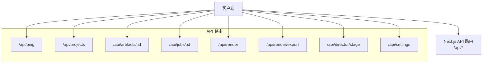
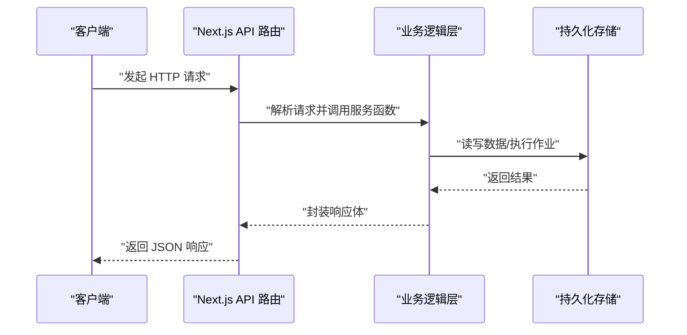
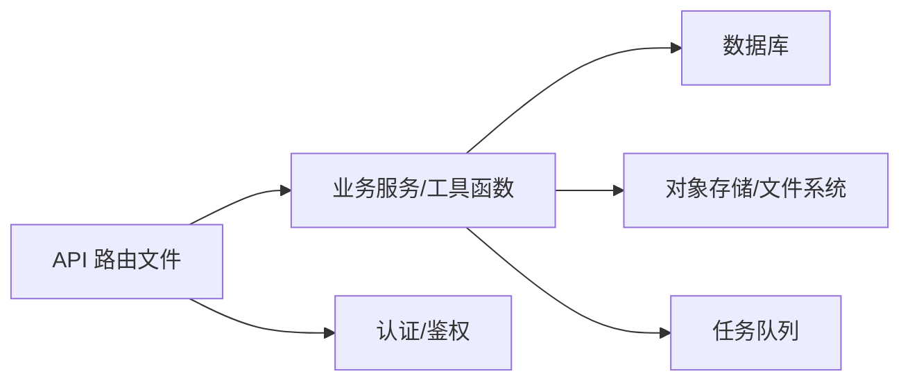

# API 参考

<cite>
**本文引用的文件**   
- [src/app/api/ping/route.ts](file://src/app/api/ping/route.ts)
- [src/app/api/projects/route.ts](file://src/app/api/projects/route.ts)
- [src/app/api/artifacts/[id]/route.ts](file://src/app/api/artifacts/[id]/route.ts)
- [src/app/api/jobs/[id]/route.ts](file://src/app/api/jobs/[id]/route.ts)
- [src/app/api/render/route.ts](file://src/app/api/render/route.ts)
- [src/app/api/render/export/route.ts](file://src/app/api/render/export/route.ts)
- [src/app/api/director/stage/route.ts](file://src/app/api/director/stage/route.ts)
- [src/app/api/settings/route.ts](file://src/app/api/settings/route.ts)
</cite>

## 目录
1. [简介](#简介)
2. [项目结构](#项目结构)
3. [核心组件](#核心组件)
4. [架构总览](#架构总览)
5. [详细组件分析](#详细组件分析)
6. [依赖分析](#依赖分析)
7. [性能考虑](#性能考虑)
8. [故障排查指南](#故障排查指南)
9. [结论](#结论)
10. [附录](#附录) 

## 简介
本文件为 CodeVideoCanvas 的 RESTful API 参考文档，覆盖所有服务端路由端点、HTTP 方法、URL 模式、请求与响应格式、认证方式、参数校验规则、错误码定义与返回数据结构。同时提供客户端集成指南、最佳实践、速率限制与安全建议，并说明版本管理与向后兼容性策略。

## 项目结构
CodeVideoCanvas 采用 Next.js App Router 组织 API 路由，每个路由以文件形式映射到 HTTP 端点。API 根路径位于 /api，子目录对应资源或功能域：
- /api/ping：健康检查
- /api/projects：项目管理
- /api/artifacts/[id]：制品管理（按 ID）
- /api/jobs/[id]：任务状态查询（按 ID）
- /api/render：渲染相关操作
- /api/render/export：导出相关操作
- /api/director/stage：导演工作流阶段控制
- /api/settings：应用设置

图表来源
- [src/app/api/ping/route.ts](file://src/app/api/ping/route.ts)
- [src/app/api/projects/route.ts](file://src/app/api/projects/route.ts)
- [src/app/api/artifacts/[id]/route.ts](file://src/app/api/artifacts/[id]/route.ts)
- [src/app/api/jobs/[id]/route.ts](file://src/app/api/jobs/[id]/route.ts)
- [src/app/api/render/route.ts](file://src/app/api/render/route.ts)
- [src/app/api/render/export/route.ts](file://src/app/api/render/export/route.ts)
- [src/app/api/director/stage/route.ts](file://src/app/api/director/stage/route.ts)
- [src/app/api/settings/route.ts](file://src/app/api/settings/route.ts)

章节来源
- [src/app/api/ping/route.ts](file://src/app/api/ping/route.ts)
- [src/app/api/projects/route.ts](file://src/app/api/projects/route.ts)
- [src/app/api/artifacts/[id]/route.ts](file://src/app/api/artifacts/[id]/route.ts)
- [src/app/api/jobs/[id]/route.ts](file://src/app/api/jobs/[id]/route.ts)
- [src/app/api/render/route.ts](file://src/app/api/render/route.ts)
- [src/app/api/render/export/route.ts](file://src/app/api/render/export/route.ts)
- [src/app/api/director/stage/route.ts](file://src/app/api/director/stage/route.ts)
- [src/app/api/settings/route.ts](file://src/app/api/settings/route.ts)

## 核心组件
本节概述各 API 模块的职责与交互边界：
- 健康检查：用于服务可用性探测与负载均衡心跳。
- 项目管理：创建、列举、更新、删除项目。
- 制品管理：获取、更新、删除特定制品。
- 任务查询：根据任务 ID 查询渲染/处理任务状态。
- 渲染与导出：触发渲染、查询渲染结果、执行导出。
- 导演工作流：推进或回退导演阶段。
- 设置：读取与更新应用配置。

章节来源
- [src/app/api/ping/route.ts](file://src/app/api/ping/route.ts)
- [src/app/api/projects/route.ts](file://src/app/api/projects/route.ts)
- [src/app/api/artifacts/[id]/route.ts](file://src/app/api/artifacts/[id]/route.ts)
- [src/app/api/jobs/[id]/route.ts](file://src/app/api/jobs/[id]/route.ts)
- [src/app/api/render/route.ts](file://src/app/api/render/route.ts)
- [src/app/api/render/export/route.ts](file://src/app/api/render/export/route.ts)
- [src/app/api/director/stage/route.ts](file://src/app/api/director/stage/route.ts)
- [src/app/api/settings/route.ts](file://src/app/api/settings/route.ts)

## 架构总览
下图展示了客户端与各 API 路由之间的调用关系以及典型的数据流向。

图表来源
- [src/app/api/projects/route.ts](file://src/app/api/projects/route.ts)
- [src/app/api/artifacts/[id]/route.ts](file://src/app/api/artifacts/[id]/route.ts)
- [src/app/api/jobs/[id]/route.ts](file://src/app/api/jobs/[id]/route.ts)
- [src/app/api/render/route.ts](file://src/app/api/render/route.ts)
- [src/app/api/render/export/route.ts](file://src/app/api/render/export/route.ts)
- [src/app/api/director/stage/route.ts](file://src/app/api/director/stage/route.ts)
- [src/app/api/settings/route.ts](file://src/app/api/settings/route.ts)

## 详细组件分析

### 健康检查
- 端点：GET /api/ping
- 用途：服务存活与健康探测
- 认证：无需认证
- 请求参数：无
- 成功响应：
  - 状态码：200
  - 响应体示例：{"status":"ok"}
- 失败响应：
  - 状态码：503
  - 响应体示例：{"error":"service unavailable"}

章节来源
- [src/app/api/ping/route.ts](file://src/app/api/ping/route.ts)

### 项目管理
- 端点：
  - GET /api/projects
  - POST /api/projects
  - PATCH /api/projects/:id
  - DELETE /api/projects/:id
- 认证：需要认证（见“认证与鉴权”）
- 请求参数：
  - 路径参数：id（字符串，非空）
  - 请求体（POST/PATCH）：包含项目名称、描述等字段；具体字段以服务端校验为准
- 成功响应：
  - 状态码：200/201
  - 响应体：项目对象（含 id、名称、时间戳等）
- 失败响应：
  - 400：参数校验失败
  - 404：项目不存在
  - 401/403：未认证或无权限
  - 500：服务器内部错误

章节来源
- [src/app/api/projects/route.ts](file://src/app/api/projects/route.ts)

### 制品管理
- 端点：
  - GET /api/artifacts/:id
  - PATCH /api/artifacts/:id
  - DELETE /api/artifacts/:id
- 认证：需要认证
- 请求参数：
  - 路径参数：id（字符串，非空）
  - 请求体（PATCH）：可更新的字段集合
- 成功响应：
  - 状态码：200/204
  - 响应体：制品对象或空体（删除）
- 失败响应：
  - 400：参数校验失败
  - 404：制品不存在
  - 401/403：未认证或无权限
  - 500：服务器内部错误

章节来源
- [src/app/api/artifacts/[id]/route.ts](file://src/app/api/artifacts/[id]/route.ts)

### 任务查询
- 端点：GET /api/jobs/:id
- 认证：需要认证
- 请求参数：
  - 路径参数：id（字符串，非空）
- 成功响应：
  - 状态码：200
  - 响应体：任务对象（含状态、进度、错误信息等）
- 失败响应：
  - 404：任务不存在
  - 401/403：未认证或无权限
  - 500：服务器内部错误

章节来源
- [src/app/api/jobs/[id]/route.ts](file://src/app/api/jobs/[id]/route.ts)

### 渲染
- 端点：
  - POST /api/render
  - GET /api/render/:id
- 认证：需要认证
- 请求参数：
  - 路径参数：id（字符串，非空）
  - 请求体（POST）：渲染输入（如场景、素材、输出规格等）
- 成功响应：
  - 状态码：201/200
  - 响应体：渲染任务对象（含 id、状态、进度、产物链接等）
- 失败响应：
  - 400：参数校验失败
  - 404：渲染任务不存在
  - 401/403：未认证或无权限
  - 500：服务器内部错误

章节来源
- [src/app/api/render/route.ts](file://src/app/api/render/route.ts)

### 导出
- 端点：
  - POST /api/render/export
  - GET /api/render/export/:id
- 认证：需要认证
- 请求参数：
  - 路径参数：id（字符串，非空）
  - 请求体（POST）：导出参数（如目标格式、分辨率、编码选项等）
- 成功响应：
  - 状态码：201/200
  - 响应体：导出任务对象（含 id、状态、下载链接等）
- 失败响应：
  - 400：参数校验失败
  - 404：导出任务不存在
  - 401/403：未认证或无权限
  - 500：服务器内部错误

章节来源
- [src/app/api/render/export/route.ts](file://src/app/api/render/export/route.ts)

### 导演工作流
- 端点：
  - POST /api/director/stage
  - GET /api/director/stage/:id
- 认证：需要认证
- 请求参数：
  - 路径参数：id（字符串，非空）
  - 请求体（POST）：阶段动作（如开始、完成、回退等）及上下文
- 成功响应：
  - 状态码：200/201
  - 响应体：阶段对象（含阶段名、状态、下一步动作等）
- 失败响应：
  - 400：参数校验失败
  - 404：阶段记录不存在
  - 401/403：未认证或无权限
  - 500：服务器内部错误

章节来源
- [src/app/api/director/stage/route.ts](file://src/app/api/director/stage/route.ts)

### 设置
- 端点：
  - GET /api/settings
  - PATCH /api/settings
- 认证：需要认证（管理员或具备相应权限）
- 请求参数：
  - 请求体（PATCH）：键值对配置项
- 成功响应：
  - 状态码：200
  - 响应体：当前设置对象
- 失败响应：
  - 400：参数校验失败
  - 401/403：未认证或无权限
  - 500：服务器内部错误

章节来源
- [src/app/api/settings/route.ts](file://src/app/api/settings/route.ts)

## 依赖分析
- 路由层职责：
  - 解析 URL 与请求体
  - 调用业务逻辑或服务函数
  - 统一错误包装与响应格式化
- 可能的内部依赖：
  - 数据库访问层（通过 lib/db 或外部驱动）
  - 存储系统（对象存储或本地文件系统）
  - 队列与任务调度（渲染/导出任务）
  - 认证中间件（JWT、会话或 API Key）

图表来源
- [src/app/api/projects/route.ts](file://src/app/api/projects/route.ts)
- [src/app/api/artifacts/[id]/route.ts](file://src/app/api/artifacts/[id]/route.ts)
- [src/app/api/jobs/[id]/route.ts](file://src/app/api/jobs/[id]/route.ts)
- [src/app/api/render/route.ts](file://src/app/api/render/route.ts)
- [src/app/api/render/export/route.ts](file://src/app/api/render/export/route.ts)
- [src/app/api/director/stage/route.ts](file://src/app/api/director/stage/route.ts)
- [src/app/api/settings/route.ts](file://src/app/api/settings/route.ts)

章节来源
- [src/app/api/projects/route.ts](file://src/app/api/projects/route.ts)
- [src/app/api/artifacts/[id]/route.ts](file://src/app/api/artifacts/[id]/route.ts)
- [src/app/api/jobs/[id]/route.ts](file://src/app/api/jobs/[id]/route.ts)
- [src/app/api/render/route.ts](file://src/app/api/render/route.ts)
- [src/app/api/render/export/route.ts](file://src/app/api/render/export/route.ts)
- [src/app/api/director/stage/route.ts](file://src/app/api/director/stage/route.ts)
- [src/app/api/settings/route.ts](file://src/app/api/settings/route.ts)

## 性能考虑
- 分页与过滤：列表接口应支持分页、排序与过滤，避免一次性返回大量数据。
- 缓存策略：对只读接口使用 ETag/Last-Modified 或 CDN 缓存；对热点数据引入内存缓存。
- 异步任务：渲染与导出应走异步队列，返回任务 ID 供轮询或回调。
- 连接池与超时：合理设置数据库与外部服务的连接池大小与超时时间。
- 限流与熔断：在网关或中间件层实现速率限制与服务降级。

[本节为通用指导，不直接分析具体文件]

## 故障排查指南
- 常见错误码：
  - 400：请求参数缺失或格式不正确
  - 401：未携带有效认证信息
  - 403：已认证但无权限访问资源
  - 404：资源不存在
  - 429：请求过于频繁（触发速率限制）
  - 500：服务器内部错误
  - 503：服务不可用（健康检查失败）
- 排查步骤：
  - 确认请求头是否包含正确的认证令牌
  - 检查请求体字段是否符合校验规则
  - 查看任务/导出状态接口定位异步任务进度
  - 关注健康检查端点判断服务可用性
  - 启用日志与追踪，定位异常堆栈

章节来源
- [src/app/api/ping/route.ts](file://src/app/api/ping/route.ts)
- [src/app/api/jobs/[id]/route.ts](file://src/app/api/jobs/[id]/route.ts)
- [src/app/api/render/export/route.ts](file://src/app/api/render/export/route.ts)

## 结论
本参考文档覆盖了 CodeVideoCanvas 的所有 RESTful API 端点及其行为约定。建议客户端遵循统一的认证、错误处理与重试策略，并结合速率限制与缓存优化提升稳定性与性能。

[本节为总结性内容，不直接分析具体文件]

## 附录

### 认证与鉴权
- 推荐方案：Bearer Token（JWT）
- 请求头：Authorization: Bearer <token>
- 鉴权范围：基于角色或资源的细粒度授权
- 安全建议：
  - 使用 HTTPS
  - 最小权限原则
  - 定期轮换密钥与令牌
  - 敏感配置通过环境变量注入

[本节为通用指导，不直接分析具体文件]

### 版本管理与向后兼容
- 版本策略：
  - URL 前缀版本化：/api/v1/...
  - 头部协商：Accept-Version 或 X-API-Version
- 兼容性保证：
  - 新增字段保持可选且默认值稳定
  - 废弃字段保留至少两个大版本
  - 变更通过弃用通知与迁移指南发布

[本节为通用指导，不直接分析具体文件]

### 速率限制
- 建议限制：
  - 全局：每秒请求数（RPS）
  - 用户级：每分钟请求数（RPM）
  - 资源级：写操作更严格的限制
- 响应头：
  - X-RateLimit-Limit
  - X-RateLimit-Remaining
  - X-RateLimit-Reset
- 客户端策略：
  - 指数退避重试
  - 批量合并请求
  - 监控配额并告警

[本节为通用指导，不直接分析具体文件]

### 客户端集成指南与最佳实践
- 初始化：
  - 配置基础 URL、超时与重试策略
  - 注入认证令牌
- 请求构建：
  - 统一序列化与反序列化
  - 严格校验必填字段
- 错误处理：
  - 区分网络错误、业务错误与认证错误
  - 展示友好提示与重试入口
- 并发与幂等：
  - 幂等键用于写操作
  - 控制并发度避免过载
- 监控与日志：
  - 上报关键指标（延迟、错误率、配额）
  - 结构化日志便于排障

[本节为通用指导，不直接分析具体文件]