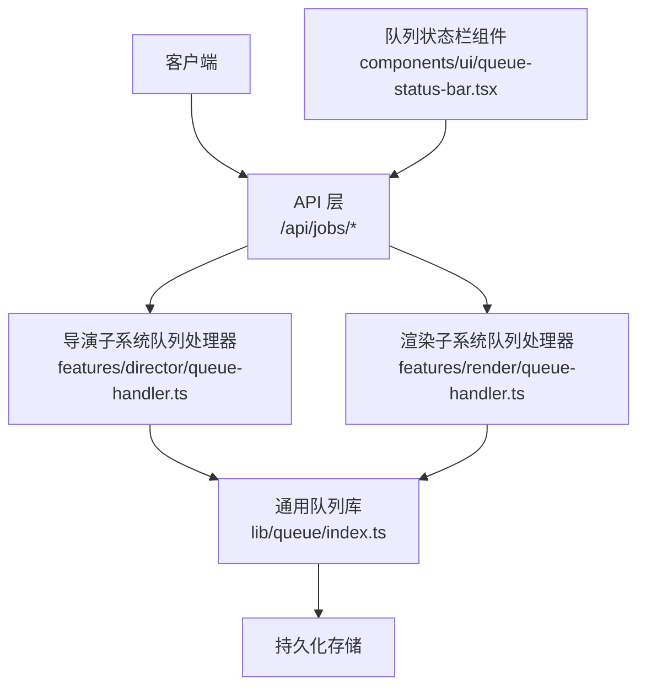
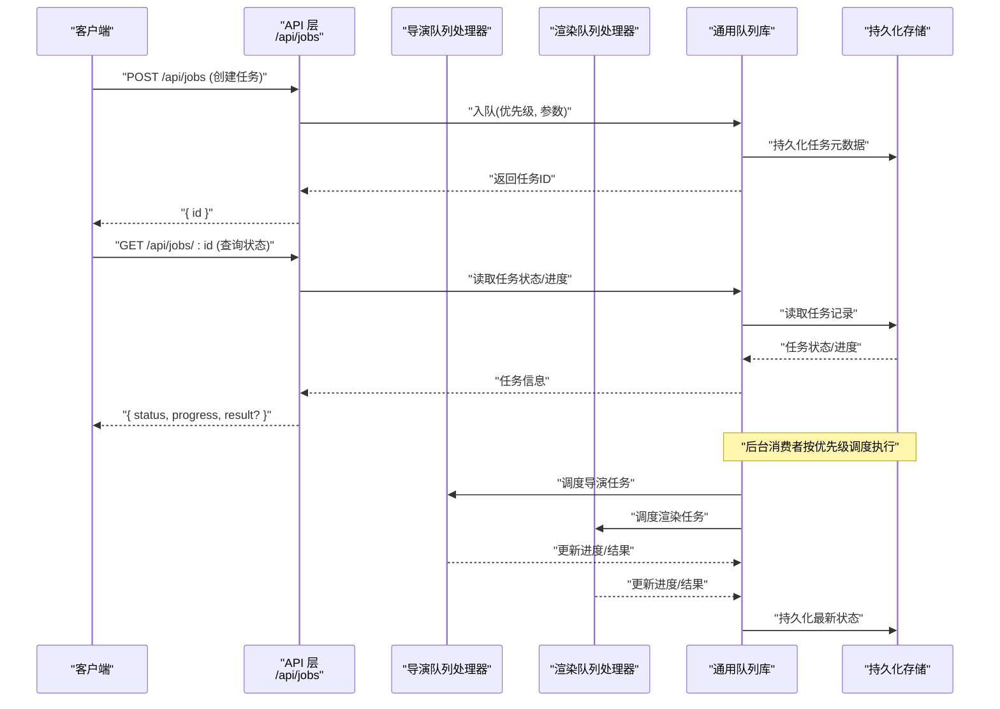
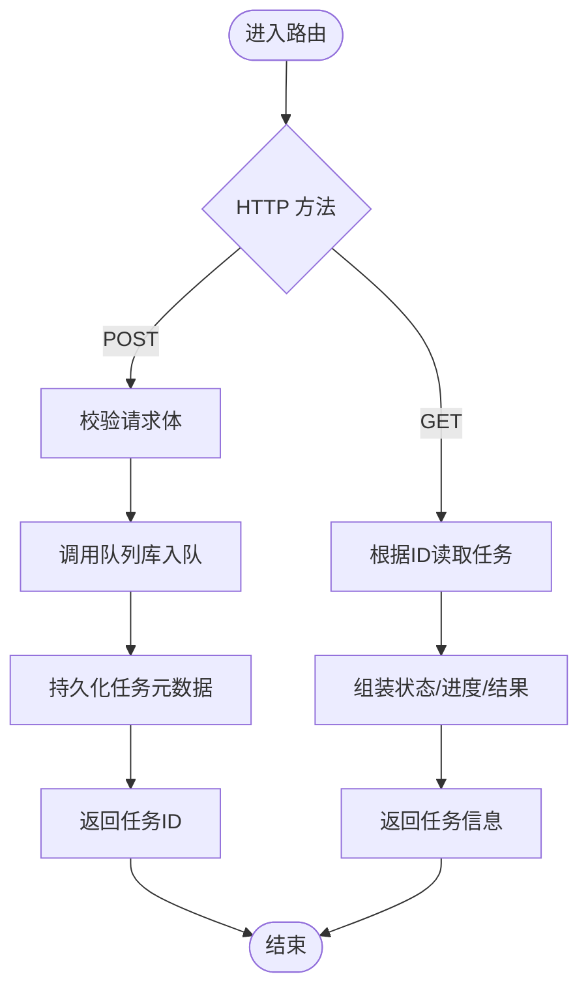
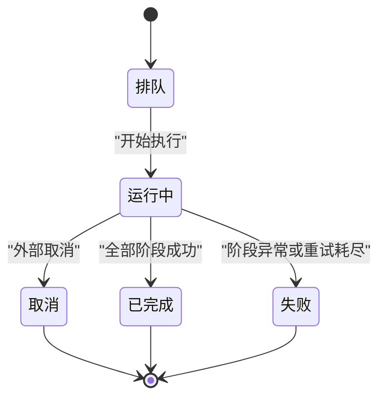
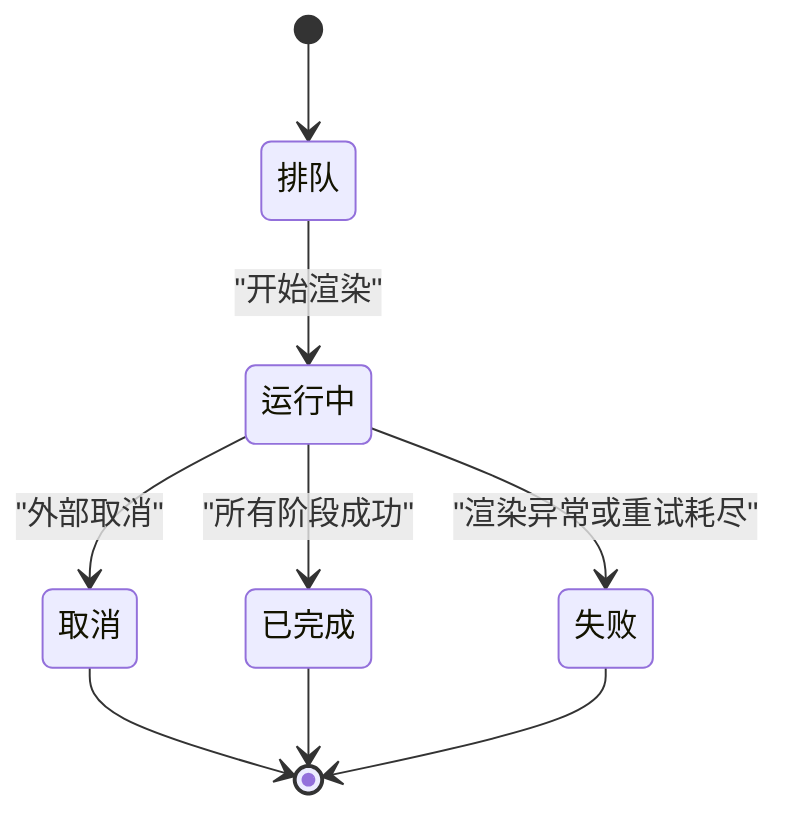
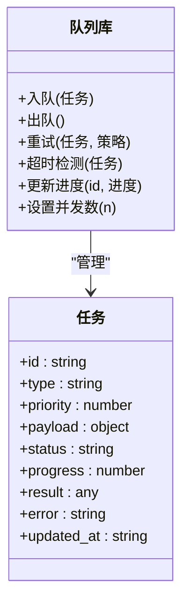
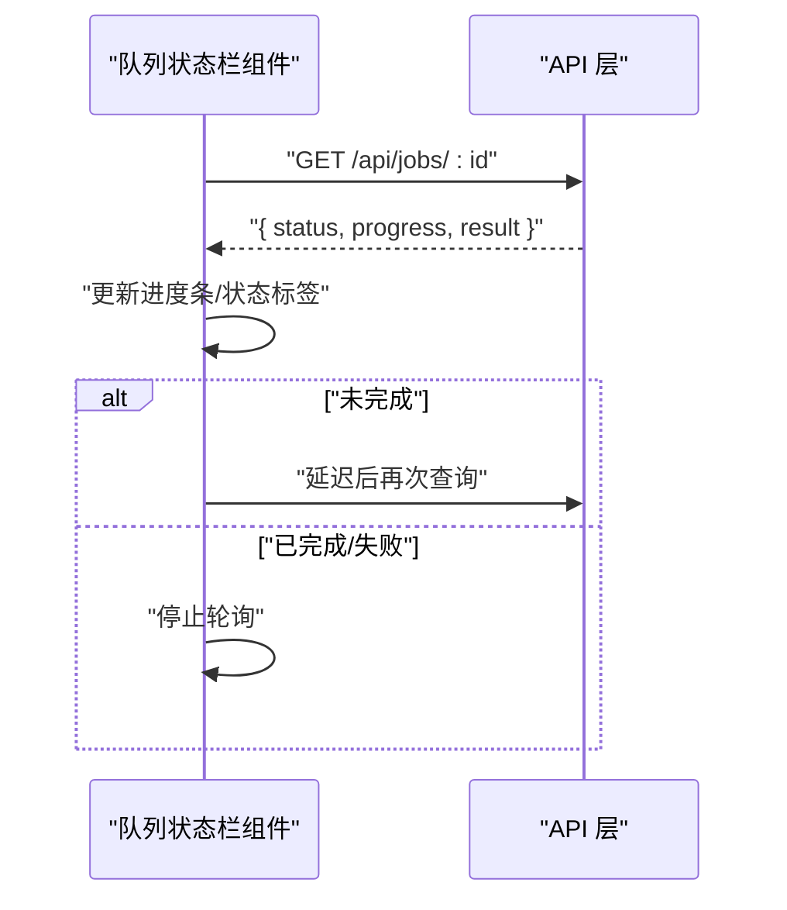
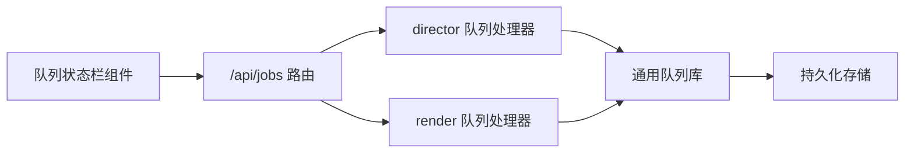

# 任务队列 API

<cite>
**本文引用的文件**
- [src/app/api/jobs/[id]/route.ts](file://src/app/api/jobs/[id]/route.ts)
- [src/app/api/jobs/[id]/route.test.ts](file://src/app/api/jobs/[id]/route.test.ts)
- [src/features/director/queue-handler.ts](file://src/features/director/queue-handler.ts)
- [src/features/render/queue-handler.ts](file://src/features/render/queue-handler.ts)
- [src/lib/queue/index.ts](file://src/lib/queue/index.ts)
- [src/components/ui/queue-status-bar.tsx](file://src/components/ui/queue-status-bar.tsx)
</cite>

## 目录
1. [简介](#简介)
2. [项目结构](#项目结构)
3. [核心组件](#核心组件)
4. [架构总览](#架构总览)
5. [详细组件分析](#详细组件分析)
6. [依赖分析](#依赖分析)
7. [性能考虑](#性能考虑)
8. [故障排查指南](#故障排查指南)
9. [结论](#结论)
10. [附录](#附录)

## 简介
本文件为“任务队列模块”的 API 文档，聚焦于异步任务管理的 RESTful 接口与实现。内容涵盖：
- 任务创建、状态查询、进度跟踪与结果获取
- 任务生命周期管理示例（提交、轮询、处理）
- 优先级调度、失败重试与超时策略
- 监控指标与调试工具使用指南

说明：当前仓库中已暴露的任务相关端点主要位于 jobs 路由；其他功能（如渲染导出、导演编排等）通过内部队列处理器协作完成。

## 项目结构
与任务队列相关的代码分布在以下位置：
- API 层：Next.js App Router 下的 /api/jobs 路由
- 业务层：director 与 render 子系统的队列处理器
- 基础设施：lib/queue 通用队列能力
- 前端展示：队列状态栏组件用于 UI 展示

图表来源
- [src/app/api/jobs/[id]/route.ts](file://src/app/api/jobs/[id]/route.ts)
- [src/features/director/queue-handler.ts](file://src/features/director/queue-handler.ts)
- [src/features/render/queue-handler.ts](file://src/features/render/queue-handler.ts)
- [src/lib/queue/index.ts](file://src/lib/queue/index.ts)
- [src/components/ui/queue-status-bar.tsx](file://src/components/ui/queue-status-bar.tsx)

章节来源
- [src/app/api/jobs/[id]/route.ts](file://src/app/api/jobs/[id]/route.ts)
- [src/features/director/queue-handler.ts](file://src/features/director/queue-handler.ts)
- [src/features/render/queue-handler.ts](file://src/features/render/queue-handler.ts)
- [src/lib/queue/index.ts](file://src/lib/queue/index.ts)
- [src/components/ui/queue-status-bar.tsx](file://src/components/ui/queue-status-bar.tsx)

## 核心组件
- 任务路由层（/api/jobs）
  - 职责：接收任务创建与状态查询请求，转发至对应子系统队列处理器，返回统一响应格式。
  - 关键路径：[src/app/api/jobs/[id]/route.ts](file://src/app/api/jobs/[id]/route.ts)
- 导演子系统队列处理器
  - 职责：执行导演编排类任务（如分镜计划、提示词生成等），维护任务状态与进度。
  - 关键路径：[src/features/director/queue-handler.ts](file://src/features/director/queue-handler.ts)
- 渲染子系统队列处理器
  - 职责：执行渲染导出类任务（如帧序列、编码、拼接等），维护任务状态与进度。
  - 关键路径：[src/features/render/queue-handler.ts](file://src/features/render/queue-handler.ts)
- 通用队列库
  - 职责：提供任务入队、出队、优先级调度、重试与超时的基础能力。
  - 关键路径：[src/lib/queue/index.ts](file://src/lib/queue/index.ts)
- 队列状态栏组件
  - 职责：在 UI 上展示队列运行状态与任务进度，便于用户观察。
  - 关键路径：[src/components/ui/queue-status-bar.tsx](file://src/components/ui/queue-status-bar.tsx)

章节来源
- [src/app/api/jobs/[id]/route.ts](file://src/app/api/jobs/[id]/route.ts)
- [src/features/director/queue-handler.ts](file://src/features/director/queue-handler.ts)
- [src/features/render/queue-handler.ts](file://src/features/render/queue-handler.ts)
- [src/lib/queue/index.ts](file://src/lib/queue/index.ts)
- [src/components/ui/queue-status-bar.tsx](file://src/components/ui/queue-status-bar.tsx)

## 架构总览
下图展示了从客户端发起任务到后端处理的端到端流程，包括任务创建、状态查询、进度更新与结果获取。

图表来源
- [src/app/api/jobs/[id]/route.ts](file://src/app/api/jobs/[id]/route.ts)
- [src/features/director/queue-handler.ts](file://src/features/director/queue-handler.ts)
- [src/features/render/queue-handler.ts](file://src/features/render/queue-handler.ts)
- [src/lib/queue/index.ts](file://src/lib/queue/index.ts)

## 详细组件分析

### 任务路由层（/api/jobs）
- 端点定义
  - POST /api/jobs
    - 作用：创建并加入任务队列
    - 请求体字段（建议）：
      - type: string | 任务类型（例如 director、render）
      - priority: number | 可选，默认值由队列库决定
      - payload: object | 任务参数（随类型变化）
    - 响应体：
      - id: string | 任务唯一标识
      - status: string | 初始状态（如 queued）
  - GET /api/jobs/:id
    - 作用：查询任务状态、进度与结果
    - 路径参数：
      - id: string | 任务 ID
    - 响应体：
      - id: string
      - status: string | 常见状态：queued、running、completed、failed、cancelled
      - progress: number | 0~100 或自定义进度对象
      - result?: any | 成功时返回结果引用或数据
      - error?: string | 失败时返回错误信息
      - updated_at: string | 最后更新时间

- 控制流
  - 创建任务：校验输入 -> 调用队列库入队 -> 持久化 -> 返回任务 ID
  - 查询任务：根据 ID 读取任务记录 -> 返回状态、进度与结果

图表来源
- [src/app/api/jobs/[id]/route.ts](file://src/app/api/jobs/[id]/route.ts)

章节来源
- [src/app/api/jobs/[id]/route.ts](file://src/app/api/jobs/[id]/route.ts)
- [src/app/api/jobs/[id]/route.test.ts](file://src/app/api/jobs/[id]/route.test.ts)

### 导演子系统队列处理器
- 职责
  - 解析导演类任务参数
  - 执行编排步骤（如提示词生成、计划验证、产物写入）
  - 更新任务进度与最终结果
- 典型状态流转
  - queued -> running -> completed/failed
- 进度上报
  - 每完成一个阶段，更新 progress 与 stage 信息

图表来源
- [src/features/director/queue-handler.ts](file://src/features/director/queue-handler.ts)

章节来源
- [src/features/director/queue-handler.ts](file://src/features/director/queue-handler.ts)

### 渲染子系统队列处理器
- 职责
  - 解析渲染类任务参数（如导出目标、编码参数）
  - 执行渲染管线（帧捕获、编码、拼接）
  - 更新任务进度与产物链接
- 典型状态流转
  - queued -> running -> completed/failed
- 进度上报
  - 基于阶段（capture、encode、concat）累计进度

图表来源
- [src/features/render/queue-handler.ts](file://src/features/render/queue-handler.ts)

章节来源
- [src/features/render/queue-handler.ts](file://src/features/render/queue-handler.ts)

### 通用队列库
- 能力概览
  - 任务入队/出队
  - 优先级调度（数值越小优先级越高，或反之，取决于实现）
  - 失败重试（指数退避或固定间隔）
  - 超时控制（单任务最大运行时间）
  - 状态持久化与进度更新
- 配置项（建议）
  - maxRetries: number | 最大重试次数
  - retryDelayMs: number | 重试间隔毫秒
  - taskTimeoutMs: number | 任务超时毫秒
  - concurrency: number | 并发消费者数量
  - priorityPolicy: string | 优先级策略（如 low-first、high-first）

图表来源
- [src/lib/queue/index.ts](file://src/lib/queue/index.ts)

章节来源
- [src/lib/queue/index.ts](file://src/lib/queue/index.ts)

### 前端队列状态栏组件
- 职责
  - 定时轮询任务状态
  - 可视化显示进度条与状态标签
  - 提供操作入口（如取消任务）
- 交互要点
  - 轮询间隔可配置
  - 任务完成后停止轮询
  - 错误状态显示错误消息

图表来源
- [src/components/ui/queue-status-bar.tsx](file://src/components/ui/queue-status-bar.tsx)
- [src/app/api/jobs/[id]/route.ts](file://src/app/api/jobs/[id]/route.ts)

章节来源
- [src/components/ui/queue-status-bar.tsx](file://src/components/ui/queue-status-bar.tsx)

## 依赖分析
- 耦合关系
  - API 层依赖队列库与各子系统处理器
  - 处理器依赖队列库进行状态与进度管理
  - 前端组件依赖 API 层进行状态同步
- 外部依赖
  - 持久化存储（数据库或文件系统）
  - 可能的消息总线或定时器（用于消费者调度）

图表来源
- [src/app/api/jobs/[id]/route.ts](file://src/app/api/jobs/[id]/route.ts)
- [src/features/director/queue-handler.ts](file://src/features/director/queue-handler.ts)
- [src/features/render/queue-handler.ts](file://src/features/render/queue-handler.ts)
- [src/lib/queue/index.ts](file://src/lib/queue/index.ts)
- [src/components/ui/queue-status-bar.tsx](file://src/components/ui/queue-status-bar.tsx)

章节来源
- [src/app/api/jobs/[id]/route.ts](file://src/app/api/jobs/[id]/route.ts)
- [src/features/director/queue-handler.ts](file://src/features/director/queue-handler.ts)
- [src/features/render/queue-handler.ts](file://src/features/render/queue-handler.ts)
- [src/lib/queue/index.ts](file://src/lib/queue/index.ts)
- [src/components/ui/queue-status-bar.tsx](file://src/components/ui/queue-status-bar.tsx)

## 性能考虑
- 并发与吞吐
  - 合理设置队列并发消费者数量，避免资源争用
  - 对大任务采用分阶段进度上报，减少长轮询压力
- 优先级调度
  - 高优先级任务优先出队，但需防止低优先级饥饿
  - 可引入公平调度策略（如加权轮询）
- 重试与退避
  - 使用指数退避降低瞬时风暴风险
  - 限制最大重试次数，避免无限重试
- 超时控制
  - 为每个任务设置合理超时阈值，及时释放资源
  - 支持任务级超时与全局超时双重保护
- 缓存与去重
  - 对相同参数的任务进行去重，避免重复计算
  - 对只读结果进行短期缓存，提高查询效率

## 故障排查指南
- 常见问题
  - 任务长时间处于排队状态
    - 检查队列并发配置与消费者是否启动
    - 查看是否有高优先级任务阻塞
  - 任务频繁失败
    - 检查重试策略与错误日志
    - 确认外部依赖（存储、网络）可用性
  - 进度不更新
    - 确认处理器是否正确上报进度
    - 检查持久化写入是否成功
- 定位手段
  - 使用任务 ID 查询状态接口，核对 status、progress、error 字段
  - 查看队列库日志与消费者日志，定位具体阶段失败原因
  - 前端状态栏组件可用于快速观察任务生命周期

章节来源
- [src/app/api/jobs/[id]/route.ts](file://src/app/api/jobs/[id]/route.ts)
- [src/features/director/queue-handler.ts](file://src/features/director/queue-handler.ts)
- [src/features/render/queue-handler.ts](file://src/features/render/queue-handler.ts)
- [src/lib/queue/index.ts](file://src/lib/queue/index.ts)
- [src/components/ui/queue-status-bar.tsx](file://src/components/ui/queue-status-bar.tsx)

## 结论
本 API 文档围绕任务队列的核心能力展开，提供了任务创建、状态查询、进度跟踪与结果获取的完整说明，并结合导演与渲染子系统的具体实现，阐述了优先级调度、失败重试与超时策略。通过统一的响应结构与清晰的状态机，开发者可以快速集成与扩展新的任务类型。

## 附录
- 任务生命周期管理示例（概念性流程）
  - 提交任务：调用 POST /api/jobs，获得任务 ID
  - 轮询状态：周期性 GET /api/jobs/:id，直到状态为 completed 或 failed
  - 处理结果：根据 result 字段下载产物或展示输出
- 监控指标（建议）
  - 队列长度、平均等待时间、平均处理时间
  - 成功率、失败率、重试次数分布
  - 各任务类型的耗时分布与资源占用
- 调试工具
  - 前端状态栏组件用于直观观察
  - 后端日志与错误堆栈用于定位问题
  - 可通过增加更详细的进度字段辅助排障