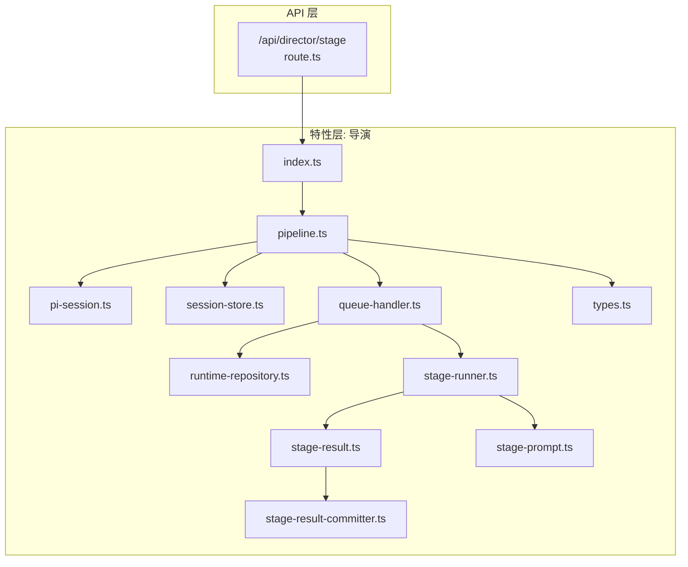
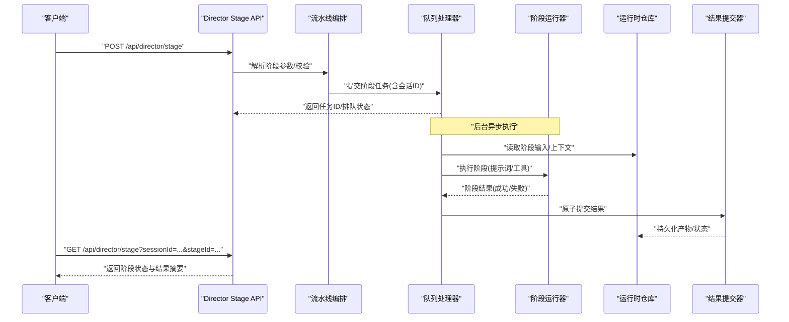
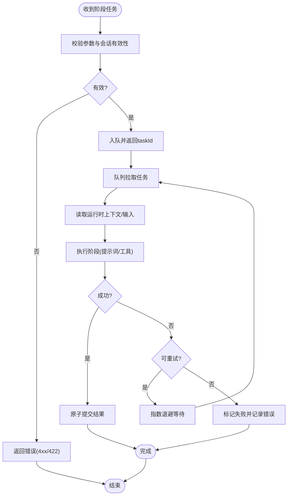
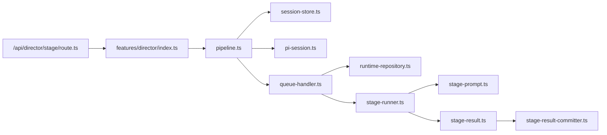

# 导演系统 API

<cite>
**本文引用的文件**
- [src/app/api/director/stage/route.ts](file://src/app/api/director/stage/route.ts)
- [src/app/api/director/stage/route.test.ts](file://src/app/api/director/stage/route.test.ts)
- [src/features/director/index.ts](file://src/features/director/index.ts)
- [src/features/director/pipeline.ts](file://src/features/director/pipeline.ts)
- [src/features/director/pi-session.ts](file://src/features/director/pi-session.ts)
- [src/features/director/session-store.ts](file://src/features/director/session-store.ts)
- [src/features/director/queue-handler.ts](file://src/features/director/queue-handler.ts)
- [src/features/director/runtime-repository.ts](file://src/features/director/runtime-repository.ts)
- [src/features/director/stage-runner.ts](file://src/features/director/stage-runner.ts)
- [src/features/director/stage-result.ts](file://src/features/director/stage-result.ts)
- [src/features/director/stage-prompt.ts](file://src/features/director/stage-prompt.ts)
- [src/features/director/stage-result-committer.ts](file://src/features/director/stage-resultcommitter.ts)
- [src/features/director/types.ts](file://src/features/director/types.ts)
</cite>

## 目录
1. [简介](#简介)
2. [项目结构](#项目结构)
3. [核心组件](#核心组件)
4. [架构总览](#架构总览)
5. [详细组件分析](#详细组件分析)
6. [依赖分析](#依赖分析)
7. [性能考虑](#性能考虑)
8. [故障排查指南](#故障排查指南)
9. [结论](#结论)
10. [附录](#附录)

## 简介
本文件为“导演系统”模块的 API 文档，聚焦于工作流编排与阶段执行相关的 RESTful 接口。内容涵盖：
- 导演会话管理（创建、查询、销毁）
- 阶段任务提交（按阶段顺序或并行编排）
- 状态查询（会话级与阶段级）
- 结果获取（阶段产物与最终输出）
- 异步任务处理机制、状态同步策略与错误重试逻辑
- 性能优化建议与最佳实践

## 项目结构
导演系统的 API 位于 Next.js App Router 下，采用基于路由的文件组织方式；业务逻辑集中在 features/director 目录中，包含会话管理、队列调度、运行时仓库、阶段运行器与结果提交等能力。

图表来源
- [src/app/api/director/stage/route.ts](file://src/app/api/director/stage/route.ts)
- [src/features/director/index.ts](file://src/features/director/index.ts)
- [src/features/director/pipeline.ts](file://src/features/director/pipeline.ts)
- [src/features/director/pi-session.ts](file://src/features/director/pi-session.ts)
- [src/features/director/session-store.ts](file://src/features/director/session-store.ts)
- [src/features/director/queue-handler.ts](file://src/features/director/queue-handler.ts)
- [src/features/director/runtime-repository.ts](file://src/features/director/runtime-repository.ts)
- [src/features/director/stage-runner.ts](file://src/features/director/stage-runner.ts)
- [src/features/director/stage-result.ts](file://src/features/director/stage-result.ts)
- [src/features/director/stage-prompt.ts](file://src/features/director/stage-prompt.ts)
- [src/features/director/stage-result-committer.ts](file://src/features/director/stage-resultcommitter.ts)
- [src/features/director/types.ts](file://src/features/director/types.ts)

章节来源
- [src/app/api/director/stage/route.ts](file://src/app/api/director/stage/route.ts)
- [src/features/director/index.ts](file://src/features/director/index.ts)

## 核心组件
- 会话管理：负责创建、持久化与清理导演会话上下文，维护会话生命周期。
- 流水线编排：定义阶段序列、依赖关系与执行策略（串行/并行）。
- 队列处理器：将阶段任务入队、出队并驱动执行，提供并发控制与背压。
- 运行时仓库：读写阶段输入/中间产物/输出，保证幂等与一致性。
- 阶段运行器：加载提示词、调用外部服务或内部工具、产出阶段结果。
- 结果提交器：原子性写入阶段结果，支持回滚与补偿。
- 类型定义：统一请求/响应/状态模型，确保前后端契约一致。

章节来源
- [src/features/director/session-store.ts](file://src/features/director/session-store.ts)
- [src/features/director/pipeline.ts](file://src/features/director/pipeline.ts)
- [src/features/director/queue-handler.ts](file://src/features/director/queue-handler.ts)
- [src/features/director/runtime-repository.ts](file://src/features/director/runtime-repository.ts)
- [src/features/director/stage-runner.ts](file://src/features/director/stage-runner.ts)
- [src/features/director/stage-result-committer.ts](file://src/features/director/stage-resultcommitter.ts)
- [src/features/director/types.ts](file://src/features/director/types.ts)

## 架构总览
下图展示了从 HTTP 请求到阶段执行的端到端流程，包括会话初始化、任务入队、队列消费、阶段运行与结果落盘。

图表来源
- [src/app/api/director/stage/route.ts](file://src/app/api/director/stage/route.ts)
- [src/features/director/pipeline.ts](file://src/features/director/pipeline.ts)
- [src/features/director/queue-handler.ts](file://src/features/director/queue-handler.ts)
- [src/features/director/runtime-repository.ts](file://src/features/director/runtime-repository.ts)
- [src/features/director/stage-runner.ts](file://src/features/director/stage-runner.ts)
- [src/features/director/stage-result-committer.ts](file://src/features/director/stage-resultcommitter.ts)

## 详细组件分析

### 阶段任务提交接口
- 方法：POST
- URL：/api/director/stage
- 用途：提交一个或多个阶段任务至队列，支持指定会话 ID 与阶段配置。
- 请求体字段（示例键名）：
  - sessionId：字符串，可选；未提供时由服务端创建新会话
  - stages：数组，元素包含 stageId、inputs、options
  - concurrency：整数，可选；限制并发度
- 响应体字段（示例键名）：
  - taskId：字符串，唯一任务标识
  - status：枚举，如 queued/accepted
  - estimatedStartAt：时间戳，预估开始时间
  - links：对象，包含后续查询与取消链接

注意：具体字段以实现为准，详见测试用例与类型定义。

章节来源
- [src/app/api/director/stage/route.ts](file://src/app/api/director/stage/route.ts)
- [src/app/api/director/stage/route.test.ts](file://src/app/api/director/stage/route.test.ts)
- [src/features/director/types.ts](file://src/features/director/types.ts)

### 阶段状态查询接口
- 方法：GET
- URL：/api/director/stage
- 查询参数：
  - sessionId：字符串，必需
  - stageId：字符串，可选；不传则返回会话内所有阶段汇总
  - includeArtifacts：布尔，可选；是否包含产物元数据
- 响应体字段（示例键名）：
  - sessionId、stageId
  - status：pending/running/succeeded/failed/cancelled
  - progress：数字，0~100
  - error：对象，包含 code/message（失败时）
  - artifacts：数组，产物清单（当 includeArtifacts=true）

章节来源
- [src/app/api/director/stage/route.ts](file://src/app/api/director/stage/route.ts)
- [src/features/director/stage-result.ts](file://src/features/director/stage-result.ts)
- [src/features/director/runtime-repository.ts](file://src/features/director/runtime-repository.ts)

### 结果获取接口
- 方法：GET
- URL：/api/director/stage/artifacts
- 查询参数：
  - sessionId：字符串，必需
  - stageId：字符串，必需
  - artifactId：字符串，可选；不传则列出全部
- 响应体字段（示例键名）：
  - id、name、type、size、url、checksum
  - createdAt、expiresAt

章节来源
- [src/app/api/director/stage/route.ts](file://src/app/api/director/stage/route.ts)
- [src/features/director/runtime-repository.ts](file://src/features/director/runtime-repository.ts)

### 会话管理接口
- 创建会话
  - 方法：POST
  - URL：/api/director/stage
  - 请求体：{ options?: { concurrency, ttl } }
  - 响应：{ sessionId, status, created_at }
- 查询会话
  - 方法：GET
  - URL：/api/director/stage
  - 查询参数：sessionId
  - 响应：{ sessions: [...] }
- 销毁会话
  - 方法：DELETE
  - URL：/api/director/stage
  - 查询参数：sessionId
  - 响应：{ ok: true }

说明：上述路径复用同一路由，通过方法与参数区分操作。

章节来源
- [src/app/api/director/stage/route.ts](file://src/app/api/director/stage/route.ts)
- [src/features/director/session-store.ts](file://src/features/director/session-store.ts)
- [src/features/director/pi-session.ts](file://src/features/director/pi-session.ts)

### 工作流编排示例
- 串行编排：A -> B -> C
  - 提交阶段 A，成功后自动触发 B，再触发 C
- 并行编排：A || B -> C
  - A 与 B 并行执行，完成后汇聚到 C
- 条件分支：若 A 成功则走 B，否则走 D
- 重试与退避：对可重试错误进行指数退避重试

章节来源
- [src/features/director/pipeline.ts](file://src/features/director/pipeline.ts)
- [src/features/director/queue-handler.ts](file://src/features/director/queue-handler.ts)

### 异步任务处理机制
- 任务入队：API 接收请求后快速返回任务 ID，进入队列等待
- 消费者：队列处理器按并发度拉取任务，分配给阶段运行器
- 状态推进：运行器更新阶段状态为 running，完成后更新为 succeeded/failed
- 幂等性：相同 taskId 重复提交应被去重或返回已有结果

章节来源
- [src/features/director/queue-handler.ts](file://src/features/director/queue-handler.ts)
- [src/features/director/stage-runner.ts](file://src/features/director/stage-runner.ts)

### 状态同步策略
- 短轮询：客户端周期性 GET 查询阶段状态
- 事件推送：可选 SSE/WebSocket 推送状态变更（当前实现以轮询为主）
- 快照聚合：会话级聚合最近 N 个阶段的状态与进度

章节来源
- [src/app/api/director/stage/route.ts](file://src/app/api/director/stage/route.ts)
- [src/features/director/stage-result.ts](file://src/features/director/stage-result.ts)

### 错误重试逻辑
- 重试范围：网络抖动、临时资源不可用、限流
- 非重试：参数校验失败、权限不足、业务规则拒绝
- 退避策略：指数退避 + 抖动，最大重试次数上限
- 失败通知：记录错误码与消息，供前端展示与告警

章节来源
- [src/features/director/queue-handler.ts](file://src/features/director/queue-handler.ts)
- [src/features/director/stage-runner.ts](file://src/features/director/stage-runner.ts)

#### 阶段执行流程图

图表来源
- [src/features/director/queue-handler.ts](file://src/features/director/queue-handler.ts)
- [src/features/director/stage-runner.ts](file://src/features/director/stage-runner.ts)
- [src/features/director/stage-result-committer.ts](file://src/features/director/stage-resultcommitter.ts)

## 依赖分析
- API 层依赖特性层入口 index.ts，进而组合 pipeline、session-store、queue-handler 等
- queue-handler 依赖 runtime-repository 与 stage-runner
- stage-runner 依赖 stage-prompt 与 stage-result
- stage-result 与 stage-result-committer 共同保障结果一致性

图表来源
- [src/app/api/director/stage/route.ts](file://src/app/api/director/stage/route.ts)
- [src/features/director/index.ts](file://src/features/director/index.ts)
- [src/features/director/pipeline.ts](file://src/features/director/pipeline.ts)
- [src/features/director/session-store.ts](file://src/features/director/session-store.ts)
- [src/features/director/pi-session.ts](file://src/features/director/pi-session.ts)
- [src/features/director/queue-handler.ts](file://src/features/director/queue-handler.ts)
- [src/features/director/runtime-repository.ts](file://src/features/director/runtime-repository.ts)
- [src/features/director/stage-runner.ts](file://src/features/director/stage-runner.ts)
- [src/features/director/stage-prompt.ts](file://src/features/director/stage-prompt.ts)
- [src/features/director/stage-result.ts](file://src/features/director/stage-result.ts)
- [src/features/director/stage-result-committer.ts](file://src/features/director/stage-resultcommitter.ts)

章节来源
- [src/features/director/index.ts](file://src/features/director/index.ts)
- [src/features/director/pipeline.ts](file://src/features/director/pipeline.ts)

## 性能考虑
- 并发控制：合理设置 concurrency，避免下游服务过载
- 批处理：合并小粒度阶段为批量任务，减少调度开销
- 缓存：对只读输入与中间产物做短期缓存，降低重复计算
- 分页与增量：状态查询支持分页与增量字段，减少带宽
- 超时与熔断：对外部依赖设置超时与熔断，防止雪崩
- 存储分层：热数据内存/近线存储，冷数据归档

[本节为通用指导，无需源码引用]

## 故障排查指南
- 常见错误码
  - 400/422：参数校验失败，检查必填字段与格式
  - 404：会话或阶段不存在，确认 sessionId/stageId
  - 429：限流，稍后重试或降低并发
  - 500：内部错误，查看日志与错误码 message
- 定位步骤
  - 使用 taskId 追踪任务全链路
  - 检查队列堆积与消费者健康状态
  - 核对运行时仓库读写权限与配额
  - 验证外部服务可用性与鉴权
- 恢复策略
  - 对幂等阶段可安全重试
  - 对非幂等阶段需人工介入或补偿脚本

章节来源
- [src/app/api/director/stage/route.test.ts](file://src/app/api/director/stage/route.test.ts)
- [src/features/director/queue-handler.ts](file://src/features/director/queue-handler.ts)
- [src/features/director/stage-runner.ts](file://src/features/director/stage-runner.ts)

## 结论
导演系统 API 围绕“会话—任务—阶段—结果”的主线设计，通过队列与流水线编排实现高吞吐与可扩展的执行模型。结合幂等、重试与原子提交，保证了在分布式环境下的稳定性与一致性。建议在生产环境中配合监控、告警与容量规划，持续优化延迟与成本。

[本节为总结，无需源码引用]

## 附录

### 请求/响应数据结构参考
- 阶段提交请求
  - 字段：sessionId、stages[].stageId、stages[].inputs、stages[].options、concurrency
- 阶段提交响应
  - 字段：taskId、status、estimatedStartAt、links
- 阶段状态查询响应
  - 字段：sessionId、stageId、status、progress、error、artifacts
- 结果获取响应
  - 字段：id、name、type、size、url、checksum、createdAt、expiresAt

章节来源
- [src/features/director/types.ts](file://src/features/director/types.ts)
- [src/features/director/stage-result.ts](file://src/features/director/stage-result.ts)
- [src/app/api/director/stage/route.ts](file://src/app/api/director/stage/route.ts)