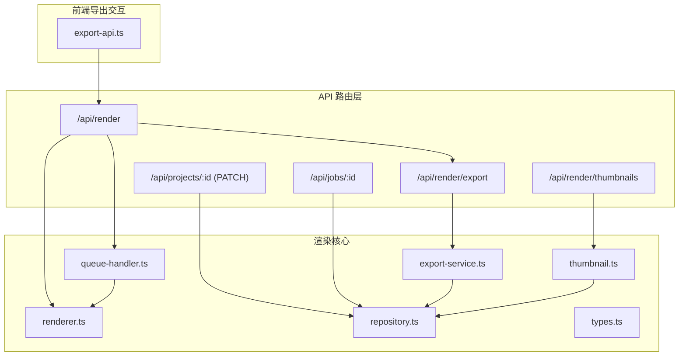
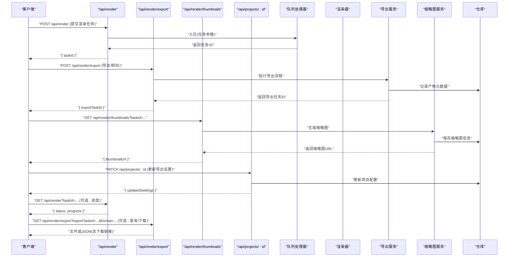
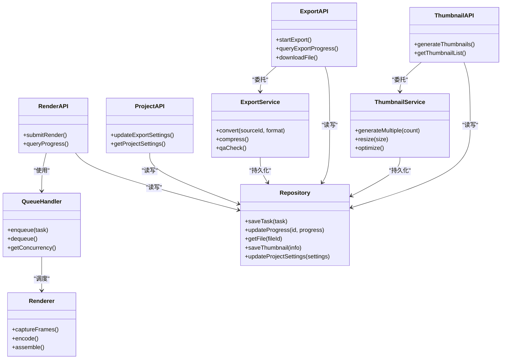

# 渲染导出 API

<cite>
**本文引用的文件**   
- [src/app/api/render/route.ts](file://src/app/api/render/route.ts)
- [src/app/api/render/export/route.ts](file://src/app/api/render/export/route.ts)
- [src/app/api/render/thumbnails/route.ts](file://src/app/api/render/thumbnails/route.ts)
- [src/app/api/projects/[id]/route.ts](file://src/app/api/projects/[id]/route.ts)
- [src/app/api/jobs/[id]/route.ts](file://src/app/api/jobs/[id]/route.ts)
- [src/app/canvas/export/export-api.ts](file://src/app/canvas/export/export-api.ts)
- [src/features/render/renderer.ts](file://src/features/render/renderer.ts)
- [src/features/render/queue-handler.ts](file://src/features/render/queue-handler.ts)
- [src/features/render/export-service.ts](file://src/features/render/export-service.ts)
- [src/features/render/repository.ts](file://src/features/render/repository.ts)
- [src/features/render/types.ts](file://src/features/render/types.ts)
- [src/features/render/thumbnail.ts](file://src/features/render/thumbnail.ts)
- [src/components/ui/queue-status-bar.tsx](file://src/components/ui/queue-status-bar.tsx)
</cite>

## 更新摘要
**变更内容**   
- 新增缩略图生成接口 GET /api/render/thumbnails
- 新增项目导出设置更新接口 PATCH /api/projects/[id]
- 增强导出API支持新的分辨率参数和QA检查集成
- 更新渲染工作流程以包含缩略图生成步骤

## 目录
1. [简介](#简介)
2. [项目结构](#项目结构)
3. [核心组件](#核心组件)
4. [架构总览](#架构总览)
5. [详细组件分析](#详细组件分析)
6. [依赖关系分析](#依赖关系分析)
7. [性能考虑](#性能考虑)
8. [故障排查指南](#故障排查指南)
9. [结论](#结论)
10. [附录](#附录)

## 简介
本文件为"渲染导出模块"的 API 文档，聚焦于视频渲染与导出的 RESTful 接口。内容涵盖：
- 渲染任务提交、进度查询、格式转换与文件下载端点
- 缩略图生成与项目导出设置管理接口
- 请求参数与响应数据结构说明
- 完整渲染工作流示例（参数配置、进度跟踪、结果处理）
- 渲染队列管理、并发控制与资源优化策略
- 性能调优建议与故障排查指南

## 项目结构
渲染导出相关代码主要分布在以下位置：
- API 路由层：Next.js App Router 下的 /api/render、/api/render/export、/api/render/thumbnails、/api/projects/[id]、/api/jobs/[id]
- 前端导出交互：canvas/export/export-api.ts
- 渲染核心：features/render 下的 renderer、queue-handler、export-service、repository、types、thumbnail

图表来源
- [src/app/api/render/route.ts](file://src/app/api/render/route.ts)
- [src/app/api/render/export/route.ts](file://src/app/api/render/export/route.ts)
- [src/app/api/render/thumbnails/route.ts](file://src/app/api/render/thumbnails/route.ts)
- [src/app/api/projects/[id]/route.ts](file://src/app/api/projects/[id]/route.ts)
- [src/app/api/jobs/[id]/route.ts](file://src/app/api/jobs/[id]/route.ts)
- [src/app/canvas/export/export-api.ts](file://src/app/canvas/export/export-api.ts)
- [src/features/render/queue-handler.ts](file://src/features/render/queue-handler.ts)
- [src/features/render/renderer.ts](file://src/features/render/renderer.ts)
- [src/features/render/export-service.ts](file://src/features/render/export-service.ts)
- [src/features/render/repository.ts](file://src/features/render/repository.ts)
- [src/features/render/types.ts](file://src/features/render/types.ts)
- [src/features/render/thumbnail.ts](file://src/features/render/thumbnail.ts)

章节来源
- [src/app/api/render/route.ts](file://src/app/api/render/route.ts)
- [src/app/api/render/export/route.ts](file://src/app/api/render/export/route.ts)
- [src/app/api/render/thumbnails/route.ts](file://src/app/api/render/thumbnails/route.ts)
- [src/app/api/projects/[id]/route.ts](file://src/app/api/projects/[id]/route.ts)
- [src/app/api/jobs/[id]/route.ts](file://src/app/api/jobs/[id]/route.ts)
- [src/app/canvas/export/export-api.ts](file://src/app/canvas/export/export-api.ts)
- [src/features/render/renderer.ts](file://src/features/render/renderer.ts)
- [src/features/render/queue-handler.ts](file://src/features/render/queue-handler.ts)
- [src/features/render/export-service.ts](file://src/features/render/export-service.ts)
- [src/features/render/repository.ts](file://src/features/render/repository.ts)
- [src/features/render/types.ts](file://src/features/render/types.ts)
- [src/features/render/thumbnail.ts](file://src/features/render/thumbnail.ts)

## 核心组件
- 渲染队列处理器（Queue Handler）：负责任务入队、出队、并发控制、重试与状态流转
- 渲染器（Renderer）：执行帧捕获、编码、合成等具体渲染步骤
- 导出服务（Export Service）：封装导出流程（如转码、拼接、生成缩略图），协调存储与产物
- 缩略图服务（Thumbnail Service）：专门负责生成视频缩略图和预览图
- 仓库（Repository）：持久化渲染任务、进度、产物元数据与下载链接
- 类型定义（Types）：统一任务、进度、产物、错误等数据结构

章节来源
- [src/features/render/queue-handler.ts](file://src/features/render/queue-handler.ts)
- [src/features/render/renderer.ts](file://src/features/render/renderer.ts)
- [src/features/render/export-service.ts](file://src/features/render/export-service.ts)
- [src/features/render/thumbnail.ts](file://src/features/render/thumbnail.ts)
- [src/features/render/repository.ts](file://src/features/render/repository.ts)
- [src/features/render/types.ts](file://src/features/render/types.ts)

## 架构总览
整体采用"API 路由 + 队列 + 渲染引擎 + 存储服务"的分层架构。客户端通过 REST 接口提交渲染任务或导出请求，服务端将任务入队并异步执行；进度通过任务 ID 轮询获取；最终产物通过下载接口获取。新增的缩略图生成功能提供了独立的缩略图处理流水线。

图表来源
- [src/app/api/render/route.ts](file://src/app/api/render/route.ts)
- [src/app/api/render/export/route.ts](file://src/app/api/render/export/route.ts)
- [src/app/api/render/thumbnails/route.ts](file://src/app/api/render/thumbnails/route.ts)
- [src/app/api/projects/[id]/route.ts](file://src/app/api/projects/[id]/route.ts)
- [src/app/api/jobs/[id]/route.ts](file://src/app/api/jobs/[id]/route.ts)
- [src/features/render/queue-handler.ts](file://src/features/render/queue-handler.ts)
- [src/features/render/renderer.ts](file://src/features/render/renderer.ts)
- [src/features/render/export-service.ts](file://src/features/render/export-service.ts)
- [src/features/render/thumbnail.ts](file://src/features/render/thumbnail.ts)
- [src/features/render/repository.ts](file://src/features/render/repository.ts)

## 详细组件分析

### 渲染任务提交接口
- HTTP 方法：POST
- URL 模式：/api/render
- 功能：提交一个渲染任务，包含分辨率、帧率、时长、编码参数、输出格式等
- 请求体字段（示例）：
  - resolution: 对象，包含 width、height
  - fps: 数字
  - duration: 数字（秒）
  - codec: 字符串（如 h264/h265）
  - outputFormat: 字符串（如 mp4/webm）
  - quality: 字符串或数字（如 high/medium/low 或比特率）
  - metadata: 对象（可选，用于附加业务信息）
- 响应数据：
  - taskId: 字符串（唯一任务标识）
  - status: 字符串（如 queued/processing/completed/failed）
  - message: 字符串（可选提示）
- 错误处理：
  - 参数校验失败返回 400
  - 队列满或资源不足返回 429/503
  - 内部错误返回 500

章节来源
- [src/app/api/render/route.ts](file://src/app/api/render/route.ts)
- [src/features/render/types.ts](file://src/features/render/types.ts)

### 渲染进度查询接口
- HTTP 方法：GET
- URL 模式：/api/render?taskId={taskId}
- 功能：根据任务 ID 查询渲染任务的状态与进度
- 查询参数：
  - taskId: 字符串（必填）
- 响应数据：
  - taskId: 字符串
  - status: 字符串（queued/processing/completed/failed）
  - progress: 数字（0~100）
  - error: 字符串（可选，失败原因）
  - result: 对象（可选，完成时包含产物信息）
- 错误处理：
  - 未找到任务返回 404
  - 参数缺失返回 400

章节来源
- [src/app/api/render/route.ts](file://src/app/api/render/route.ts)
- [src/features/render/repository.ts](file://src/features/render/repository.ts)

### 导出/格式转换接口
- HTTP 方法：POST
- URL 模式：/api/render/export
- 功能：对已有渲染产物进行格式转换、压缩、拼接等导出操作
- 请求体字段（示例）：
  - sourceId: 字符串（源产物 ID）
  - targetFormat: 字符串（如 mp4/webm/avi）
  - bitrate: 数字（可选，目标比特率）
  - scale: 数字（可选，缩放比例）
  - resolution: 对象（可选，新的分辨率参数）
  - qaCheck: 布尔值（可选，是否启用质量检查）
  - metadata: 对象（可选）
- 响应数据：
  - exportTaskId: 字符串（导出任务 ID）
  - status: 字符串（queued/processing/completed/failed）
  - message: 字符串（可选）
- 错误处理：
  - 源产物不存在返回 404
  - 参数非法返回 400
  - 转码失败返回 500

**更新** 增强了导出API，现在支持新的分辨率参数和QA检查集成

章节来源
- [src/app/api/render/export/route.ts](file://src/app/api/render/export/route.ts)
- [src/features/render/export-service.ts](file://src/features/render/export-service.ts)
- [src/features/render/types.ts](file://src/features/render/types.ts)

### 导出进度查询接口
- HTTP 方法：GET
- URL 模式：/api/render/export?exportTaskId={exportTaskId}
- 功能：查询导出任务的进度与结果
- 查询参数：
  - exportTaskId: 字符串（必填）
- 响应数据：
  - exportTaskId: 字符串
  - status: 字符串（queued/processing/completed/failed）
  - progress: 数字（0~100）
  - result: 对象（可选，包含下载链接、文件大小、MIME 类型等）
- 错误处理：
  - 未找到导出任务返回 404

章节来源
- [src/app/api/render/export/route.ts](file://src/app/api/render/export/route.ts)
- [src/features/render/repository.ts](file://src/features/render/repository.ts)

### 缩略图生成接口
- HTTP 方法：GET
- URL 模式：/api/render/thumbnails?taskId={taskId}&count={count}&size={size}
- 功能：为渲染任务生成多个缩略图，用于预览和展示
- 查询参数：
  - taskId: 字符串（必填，渲染任务ID）
  - count: 数字（可选，默认3，缩略图数量）
  - size: 字符串（可选，默认medium，缩略图尺寸：small/medium/large）
- 响应数据：
  - thumbnails: 数组（缩略图信息列表）
  - taskId: 字符串（关联的任务ID）
  - generatedAt: 时间戳（生成时间）
- 每个缩略图对象包含：
  - url: 字符串（缩略图访问URL）
  - timestamp: 数字（对应的时间戳）
  - width: 数字（宽度）
  - height: 数字（高度）
- 错误处理：
  - 任务不存在返回 404
  - 任务未完成返回 400
  - 生成失败返回 500

**新增** 这是全新的缩略图生成功能，支持批量生成不同尺寸的预览图

章节来源
- [src/app/api/render/thumbnails/route.ts](file://src/app/api/render/thumbnails/route.ts)
- [src/features/render/thumbnail.ts](file://src/features/render/thumbnail.ts)
- [src/features/render/repository.ts](file://src/features/render/repository.ts)

### 项目导出设置更新接口
- HTTP 方法：PATCH
- URL 模式：/api/projects/{projectId}
- 功能：更新项目的导出配置和默认设置
- 路径参数：
  - projectId: 字符串（项目ID）
- 请求体字段（示例）：
  - defaultResolution: 对象（默认分辨率设置）
  - defaultCodec: 字符串（默认编码器）
  - defaultQuality: 字符串（默认质量等级）
  - enableThumbnails: 布尔值（是否自动生成缩略图）
  - exportSettings: 对象（其他导出相关配置）
- 响应数据：
  - project: 对象（更新后的项目信息）
  - settings: 对象（更新的导出设置）
  - updatedAt: 时间戳（更新时间）
- 错误处理：
  - 项目不存在返回 404
  - 参数验证失败返回 400
  - 权限不足返回 403

**新增** 这是全新的项目导出设置管理接口，允许动态调整项目的默认导出行为

章节来源
- [src/app/api/projects/[id]/route.ts](file://src/app/api/projects/[id]/route.ts)
- [src/features/render/repository.ts](file://src/features/render/repository.ts)

### 文件下载接口
- HTTP 方法：GET
- URL 模式：/api/render/download?fileId={fileId}&token={token}
- 功能：安全下载渲染产物或导出产物
- 查询参数：
  - fileId: 字符串（产物文件 ID）
  - token: 字符串（可选，鉴权令牌）
- 响应：二进制文件流
- 错误处理：
  - 文件不存在返回 404
  - 权限不足返回 401/403

章节来源
- [src/app/api/render/export/route.ts](file://src/app/api/render/export/route.ts)
- [src/features/render/repository.ts](file://src/features/render/repository.ts)

### 任务详情查询接口（通用）
- HTTP 方法：GET
- URL 模式：/api/jobs/{jobId}
- 功能：根据作业 ID 查询任务详情（可用于渲染或导出任务）
- 路径参数：
  - jobId: 字符串（任务 ID）
- 响应数据：
  - id: 字符串
  - type: 字符串（render/export/thumbnail）
  - status: 字符串
  - progress: 数字
  - createdAt/updatedAt: 时间戳
  - result: 对象（可选）
- 错误处理：
  - 未找到任务返回 404

章节来源
- [src/app/api/jobs/[id]/route.ts](file://src/app/api/jobs/[id]/route.ts)
- [src/features/render/repository.ts](file://src/features/render/repository.ts)

### 前端导出交互（Canvas Export）
- 模块职责：封装导出相关的 API 调用、状态管理与 UI 反馈
- 关键能力：
  - 发起导出请求（调用 /api/render/export）
  - 轮询导出进度（GET /api/render/export）
  - 触发下载（GET /api/render/download）
  - 获取缩略图（GET /api/render/thumbnails）
  - 展示队列状态（结合 queue-status-bar 组件）

章节来源
- [src/app/canvas/export/export-api.ts](file://src/app/canvas/export/export-api.ts)
- [src/components/ui/queue-status-bar.tsx](file://src/components/ui/queue-status-bar.tsx)

## 依赖关系分析
渲染导出模块的依赖关系如下：
- API 路由依赖队列处理器与仓库
- 导出服务依赖仓库与外部转码工具
- 缩略图服务依赖仓库与图像处理库
- 渲染器依赖编码器与帧捕获模块
- 前端导出模块依赖 API 路由与 UI 组件

图表来源
- [src/app/api/render/route.ts](file://src/app/api/render/route.ts)
- [src/app/api/render/export/route.ts](file://src/app/api/render/export/route.ts)
- [src/app/api/render/thumbnails/route.ts](file://src/app/api/render/thumbnails/route.ts)
- [src/app/api/projects/[id]/route.ts](file://src/app/api/projects/[id]/route.ts)
- [src/app/api/jobs/[id]/route.ts](file://src/app/api/jobs/[id]/route.ts)
- [src/features/render/queue-handler.ts](file://src/features/render/queue-handler.ts)
- [src/features/render/renderer.ts](file://src/features/render/renderer.ts)
- [src/features/render/export-service.ts](file://src/features/render/export-service.ts)
- [src/features/render/thumbnail.ts](file://src/features/render/thumbnail.ts)
- [src/features/render/repository.ts](file://src/features/render/repository.ts)

章节来源
- [src/app/api/render/route.ts](file://src/app/api/render/route.ts)
- [src/app/api/render/export/route.ts](file://src/app/api/render/export/route.ts)
- [src/app/api/render/thumbnails/route.ts](file://src/app/api/render/thumbnails/route.ts)
- [src/app/api/projects/[id]/route.ts](file://src/app/api/projects/[id]/route.ts)
- [src/app/api/jobs/[id]/route.ts](file://src/app/api/jobs/[id]/route.ts)
- [src/features/render/queue-handler.ts](file://src/features/render/queue-handler.ts)
- [src/features/render/renderer.ts](file://src/features/render/renderer.ts)
- [src/features/render/export-service.ts](file://src/features/render/export-service.ts)
- [src/features/render/thumbnail.ts](file://src/features/render/thumbnail.ts)
- [src/features/render/repository.ts](file://src/features/render/repository.ts)

## 性能考虑
- 队列并发控制：合理设置最大并发数，避免 CPU/GPU 过载；根据硬件能力动态调整
- 任务优先级：支持高优先级任务插队，保障关键渲染快速完成
- 缓存与去重：相同参数的任务可复用中间结果，减少重复计算
- I/O 优化：批量写入产物、使用流式传输降低内存占用
- 编码参数调优：选择合适的编码器与比特率，平衡质量与体积
- 缩略图优化：使用异步生成和缓存机制，避免阻塞主渲染流程
- 监控与告警：记录队列长度、平均处理时间、失败率，及时扩容或降级

## 故障排查指南
常见问题与定位步骤：
- 任务无法入队：检查队列容量与并发限制；查看系统资源使用情况
- 渲染失败：查看任务错误日志；确认输入素材有效性与编码参数合法性
- 导出失败：验证源产物存在性；检查转码工具链是否可用
- 缩略图生成失败：检查渲染任务是否已完成；确认图像处理和存储后端可用性
- 项目设置更新失败：验证项目ID有效性；检查权限和用户配置
- 下载失败：确认文件 ID 与权限令牌；检查存储后端可用性
- 进度不更新：检查仓库写入是否正常；确认轮询间隔与超时设置

章节来源
- [src/features/render/queue-handler.ts](file://src/features/render/queue-handler.ts)
- [src/features/render/renderer.ts](file://src/features/render/renderer.ts)
- [src/features/render/export-service.ts](file://src/features/render/export-service.ts)
- [src/features/render/thumbnail.ts](file://src/features/render/thumbnail.ts)
- [src/features/render/repository.ts](file://src/features/render/repository.ts)

## 结论
本 API 文档覆盖了渲染与导出的核心接口与工作流，包括新增的缩略图生成和项目设置管理功能，提供了从任务提交到结果下载的完整链路说明。通过合理的队列管理、并发控制与性能调优，可实现稳定高效的视频渲染与导出服务。

## 附录

### 完整渲染工作流示例
- 步骤一：提交渲染任务（POST /api/render）
- 步骤二：轮询进度（GET /api/render?taskId=...）
- 步骤三：等待完成并获取产物信息
- 步骤四：生成缩略图（GET /api/render/thumbnails?taskId=...&count=5&size=large）
- 步骤五：如需格式转换，调用导出接口（POST /api/render/export）
- 步骤六：轮询导出进度（GET /api/render/export?exportTaskId=...）
- 步骤七：下载最终文件（GET /api/render/download?fileId=...&token=...）
- 步骤八：更新项目导出设置（PATCH /api/projects/:id）

章节来源
- [src/app/api/render/route.ts](file://src/app/api/render/route.ts)
- [src/app/api/render/export/route.ts](file://src/app/api/render/export/route.ts)
- [src/app/api/render/thumbnails/route.ts](file://src/app/api/render/thumbnails/route.ts)
- [src/app/api/projects/[id]/route.ts](file://src/app/api/projects/[id]/route.ts)
- [src/app/canvas/export/export-api.ts](file://src/app/canvas/export/export-api.ts)

### 队列状态展示（UI）
- 组件职责：显示当前队列长度、活跃任务数、平均耗时等指标
- 数据来源：通过 API 查询任务状态与队列统计

章节来源
- [src/components/ui/queue-status-bar.tsx](file://src/components/ui/queue-status-bar.tsx)

### 新增功能特性
- **缩略图批量生成**：支持一次生成多个不同尺寸的缩略图，提升预览效率
- **项目级导出配置**：允许为不同项目设置不同的默认导出参数和行为
- **质量检查集成**：导出过程中可集成QA检查，确保输出质量符合标准
- **增强的分辨率支持**：导出API现在支持动态分辨率调整，无需重新渲染

章节来源
- [src/app/api/render/thumbnails/route.ts](file://src/app/api/render/thumbnails/route.ts)
- [src/app/api/projects/[id]/route.ts](file://src/app/api/projects/[id]/route.ts)
- [src/features/render/export-service.ts](file://src/features/render/export-service.ts)
- [src/features/render/thumbnail.ts](file://src/features/render/thumbnail.ts)