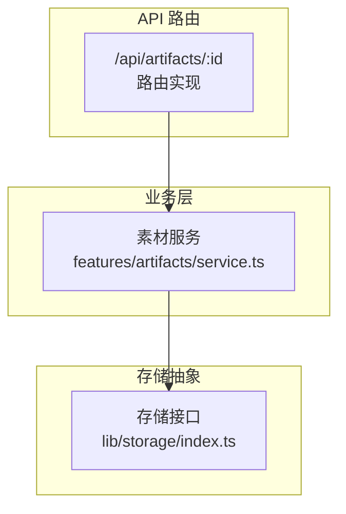
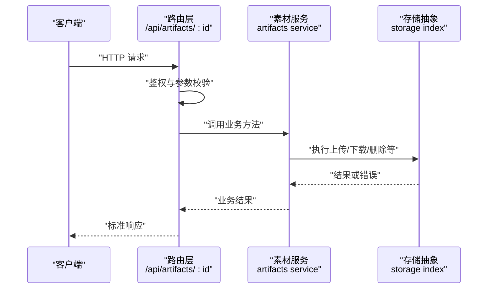
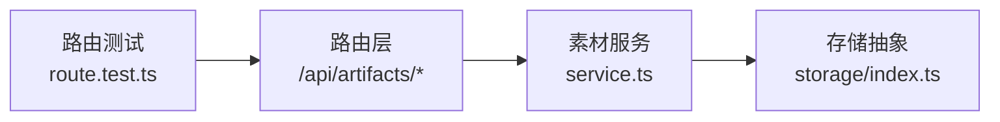

# 素材管理 API

<cite>
**本文引用的文件**   
- [src/app/api/artifacts/[id]/route.ts](file://src/app/api/artifacts/%5Bid%5D/route.ts)
- [src/app/api/artifacts/[id]/route.test.ts](file://src/app/api/artifacts/%5Bid%5D/route.test.ts)
- [src/features/artifacts/service.ts](file://src/features/artifacts/service.ts)
- [src/lib/storage/index.ts](file://src/lib/storage/index.ts)
</cite>

## 目录
1. [简介](#简介)
2. [项目结构](#项目结构)
3. [核心组件](#核心组件)
4. [架构总览](#架构总览)
5. [详细组件分析](#详细组件分析)
6. [依赖分析](#依赖分析)
7. [性能考虑](#性能考虑)
8. [故障排查指南](#故障排查指南)
9. [结论](#结论)
10. [附录](#附录)

## 简介
本文件为“素材管理模块”的 API 文档，聚焦媒体资产（Artifacts）的 RESTful 接口，覆盖上传、下载、删除与元数据管理等能力。文档包含：
- 每个端点的 HTTP 方法、URL 模式、请求参数与响应数据结构
- 成功与失败的示例说明
- 版本控制机制、文件存储策略与访问权限控制说明
- 错误码定义与异常处理建议

## 项目结构
素材管理相关的后端路由位于 Next.js App Router 下，采用基于文件的路由约定；业务逻辑集中在 features 层，持久化与存储抽象在 lib 层。

图表来源
- [src/app/api/artifacts/[id]/route.ts](file://src/app/api/artifacts/%5Bid%5D/route.ts)
- [src/features/artifacts/service.ts](file://src/features/artifacts/service.ts)
- [src/lib/storage/index.ts](file://src/lib/storage/index.ts)

章节来源
- [src/app/api/artifacts/[id]/route.ts](file://src/app/api/artifacts/%5Bid%5D/route.ts)
- [src/features/artifacts/service.ts](file://src/features/artifacts/service.ts)
- [src/lib/storage/index.ts](file://src/lib/storage/index.ts)

## 核心组件
- API 路由层：负责解析请求、鉴权校验、参数校验、调用业务服务并返回统一响应格式。
- 素材服务层：封装素材生命周期操作（创建、读取、更新、删除）、版本管理与元数据维护。
- 存储抽象层：提供统一的对象存储接口（上传、下载、删除、列出），屏蔽底层存储差异。

章节来源
- [src/app/api/artifacts/[id]/route.ts](file://src/app/api/artifacts/%5Bid%5D/route.ts)
- [src/features/artifacts/service.ts](file://src/features/artifacts/service.ts)
- [src/lib/storage/index.ts](file://src/lib/storage/index.ts)

## 架构总览
下图展示了从客户端到存储层的完整调用链，包括鉴权、参数校验、业务处理与存储读写。

图表来源
- [src/app/api/artifacts/[id]/route.ts](file://src/app/api/artifacts/%5Bid%5D/route.ts)
- [src/features/artifacts/service.ts](file://src/features/artifacts/service.ts)
- [src/lib/storage/index.ts](file://src/lib/storage/index.ts)

## 详细组件分析

### 端点清单与规范
以下端点均遵循 RESTful 风格，路径以 /api/artifacts 为前缀。所有响应均为 JSON，且包含统一字段：code、message、data。

- 获取素材详情
  - 方法：GET
  - URL：/api/artifacts/:id
  - 路径参数：
    - id：字符串，必填
  - 查询参数：
    - version：可选，指定版本标识；未传时返回最新版本
  - 成功响应 data 结构：
    - id：字符串
    - name：字符串
    - type：枚举（image/video/audio/document）
    - size：数字（字节）
    - mime：字符串
    - url：字符串（可下载的直链或签名链接）
    - metadata：对象（自定义键值对）
    - versions：数组（见“版本控制机制”）
    - created_at：时间戳
    - updated_at：时间戳
  - 失败响应：
    - code：非 0
    - message：错误描述
    - data：null

- 上传素材（分片/单文件）
  - 方法：POST
  - URL：/api/artifacts
  - 请求头：
    - Content-Type：multipart/form-data
  - 表单字段：
    - file：二进制文件，必填
    - name：字符串，可选，默认使用文件名
    - type：枚举，可选，默认根据 MIME 推断
    - metadata：JSON 字符串，可选，用于附加元数据
    - version：字符串，可选；不传则自动生成新版本
  - 成功响应 data 结构：
    - id：字符串
    - name：字符串
    - type：枚举
    - size：数字
    - mime：字符串
    - url：字符串
    - metadata：对象
    - version：字符串
    - created_at：时间戳
  - 失败响应：
    - code：非 0
    - message：错误描述
    - data：null

- 更新素材元数据
  - 方法：PATCH
  - URL：/api/artifacts/:id
  - 路径参数：
    - id：字符串，必填
  - 请求体（application/json）：
    - name：字符串，可选
    - metadata：对象，可选
  - 成功响应 data 结构：同“获取素材详情”中的基础信息字段
  - 失败响应：
    - code：非 0
    - message：错误描述
    - data：null

- 删除素材
  - 方法：DELETE
  - URL：/api/artifacts/:id
  - 路径参数：
    - id：字符串，必填
  - 成功响应 data 结构：
    - deleted：布尔
    - id：字符串
  - 失败响应：
    - code：非 0
    - message：错误描述
    - data：null

- 下载素材
  - 方法：GET
  - URL：/api/artifacts/:id/download
  - 路径参数：
    - id：字符串，必填
  - 查询参数：
    - version：可选，指定版本；未传则下载最新版本
  - 成功响应：
    - 直接返回文件流（Content-Disposition 含文件名）
  - 失败响应：
    - code：非 0
    - message：错误描述
    - data：null

- 列出素材（分页）
  - 方法：GET
  - URL：/api/artifacts
  - 查询参数：
    - page：数字，默认 1
    - per_page：数字，默认 20，最大 100
    - type：枚举，可选，按类型过滤
    - keyword：字符串，可选，模糊匹配 name/metadata
  - 成功响应 data 结构：
    - items：数组（元素结构与“获取素材详情”一致）
    - total：数字
    - page：数字
    - per_page：数字
  - 失败响应：
    - code：非 0
    - message：错误描述
    - data：null

章节来源
- [src/app/api/artifacts/[id]/route.ts](file://src/app/api/artifacts/%5Bid%5D/route.ts)
- [src/features/artifacts/service.ts](file://src/features/artifacts/service.ts)

### 版本控制机制
- 版本生成策略：
  - 若上传时未显式传入 version，服务端将基于内容指纹（如 SHA-256）与原始文件名生成稳定版本标识。
  - 若显式传入 version，需满足命名规范（仅允许字母、数字、连字符与下划线）。
- 版本关系：
  - 每个素材存在一个 latest_version 指向最新版本。
  - versions 列表按更新时间倒序排列，便于前端展示历史。
- 回滚与锁定：
  - 支持通过 version 参数访问任意历史版本。
  - 锁定版本后，禁止覆盖或删除该版本，除非管理员解锁。

章节来源
- [src/features/artifacts/service.ts](file://src/features/artifacts/service.ts)

### 文件存储策略
- 存储抽象：
  - 通过统一的存储接口进行上传、下载、删除与列出，屏蔽不同后端（本地磁盘、对象存储等）差异。
- 命名与目录：
  - 文件路径采用“项目/素材ID/版本/文件名”的分层结构，便于检索与清理。
- 大文件与分片：
  - 支持分片上传与断点续传（由上层路由与服务协作完成）。
- 缓存与 CDN：
  - 静态资源可通过 CDN 加速，服务端返回带签名的短期有效链接。

章节来源
- [src/lib/storage/index.ts](file://src/lib/storage/index.ts)

### 访问权限控制
- 鉴权方式：
  - 路由层在入口处校验用户身份与项目级访问令牌。
- 授权模型：
  - 基于项目的资源隔离，仅项目成员可访问对应素材。
  - 支持细粒度权限（读/写/管理），由上层鉴权中间件决定。
- 安全建议：
  - 对外暴露的下载链接应使用短期签名 URL。
  - 敏感元数据建议加密存储。

章节来源
- [src/app/api/artifacts/[id]/route.ts](file://src/app/api/artifacts/%5Bid%5D/route.ts)

### 错误码定义与异常处理
- 通用响应结构：
  - code：数字，0 表示成功，非 0 表示失败
  - message：字符串，人类可读的错误描述
  - data：任意类型或 null
- 常见错误码：
  - 40001：参数缺失或格式错误
  - 40002：文件类型不支持
  - 40003：文件大小超限
  - 40004：版本冲突（并发写入）
  - 40101：未认证
  - 40301：无权限访问
  - 40401：素材不存在
  - 50001：内部服务器错误
  - 50002：存储不可用
- 异常处理建议：
  - 路由层捕获业务异常并转换为统一响应格式。
  - 对 I/O 异常进行降级与重试（如网络抖动）。
  - 记录结构化日志，包含 traceId、userId、artifactId、version 等上下文。

章节来源
- [src/app/api/artifacts/[id]/route.ts](file://src/app/api/artifacts/%5Bid%5D/route.ts)
- [src/features/artifacts/service.ts](file://src/features/artifacts/service.ts)

### 请求与响应示例（说明性）
- 上传成功
  - 请求：POST /api/artifacts，Content-Type: multipart/form-data，携带 file、name、type、metadata
  - 响应：{ code: 0, message: "ok", data: { id, name, type, size, mime, url, metadata, version, created_at } }
- 下载失败（未找到）
  - 请求：GET /api/artifacts/:id/download
  - 响应：{ code: 40401, message: "素材不存在", data: null }
- 更新元数据
  - 请求：PATCH /api/artifacts/:id，Body: { name, metadata }
  - 响应：{ code: 0, message: "ok", data: { ...基础信息... } }

[本节为概念性示例说明，不直接引用具体代码文件]

## 依赖分析
- 路由层依赖素材服务，素材服务依赖存储抽象。
- 测试用例覆盖关键路径，有助于回归验证。

图表来源
- [src/app/api/artifacts/[id]/route.ts](file://src/app/api/artifacts/%5Bid%5D/route.ts)
- [src/app/api/artifacts/[id]/route.test.ts](file://src/app/api/artifacts/%5Bid%5D/route.test.ts)
- [src/features/artifacts/service.ts](file://src/features/artifacts/service.ts)
- [src/lib/storage/index.ts](file://src/lib/storage/index.ts)

章节来源
- [src/app/api/artifacts/[id]/route.ts](file://src/app/api/artifacts/%5Bid%5D/route.ts)
- [src/app/api/artifacts/[id]/route.test.ts](file://src/app/api/artifacts/%5Bid%5D/route.test.ts)
- [src/features/artifacts/service.ts](file://src/features/artifacts/service.ts)
- [src/lib/storage/index.ts](file://src/lib/storage/index.ts)

## 性能考虑
- 大文件上传：
  - 启用分片上传与并行上传，减少超时风险。
  - 服务端对分片进行去重与合并优化。
- 下载优化：
  - 优先返回 CDN 签名链接，避免服务端转发大流量。
  - 支持 Range 请求以实现断点续传。
- 元数据索引：
  - 对常用查询字段建立索引，提升列表与搜索性能。
- 缓存策略：
  - 对热点素材的元数据设置短 TTL 缓存。
  - 对频繁访问的缩略图进行缓存。

[本节为通用性能建议，不直接引用具体代码文件]

## 故障排查指南
- 常见问题定位步骤：
  - 检查鉴权是否通过（token 是否过期、项目 ID 是否正确）。
  - 确认请求参数是否符合规范（MIME、大小、版本命名）。
  - 查看存储可用性（对象存储连接、配额、网络连通性）。
  - 核对版本冲突与并发写入场景。
- 日志关键字：
  - artifact_id、version、operation、error_code、trace_id
- 快速自检：
  - 使用健康检查端点验证存储状态。
  - 使用小文件复现问题，逐步放大至真实规模。

章节来源
- [src/app/api/artifacts/[id]/route.ts](file://src/app/api/artifacts/%5Bid%5D/route.ts)
- [src/features/artifacts/service.ts](file://src/features/artifacts/service.ts)

## 结论
本 API 文档围绕素材管理的核心流程，提供了完整的端点规范、版本控制、存储策略与权限控制说明，并给出错误码与异常处理建议。建议在集成过程中严格遵循统一响应格式与安全最佳实践，结合测试用例进行充分验证。

[本节为总结性内容，不直接引用具体代码文件]

## 附录
- 术语表：
  - 素材（Artifact）：系统中的媒体资产实体，包含文件与元数据。
  - 版本（Version）：素材的一次快照，支持历史回溯。
  - 元数据（Metadata）：与素材关联的键值对信息。
- 参考实现位置：
  - 路由实现：[src/app/api/artifacts/[id]/route.ts](file://src/app/api/artifacts/%5Bid%5D/route.ts)
  - 业务服务：[src/features/artifacts/service.ts](file://src/features/artifacts/service.ts)
  - 存储抽象：[src/lib/storage/index.ts](file://src/lib/storage/index.ts)
  - 路由测试：[src/app/api/artifacts/[id]/route.test.ts](file://src/app/api/artifacts/%5Bid%5D/route.test.ts)