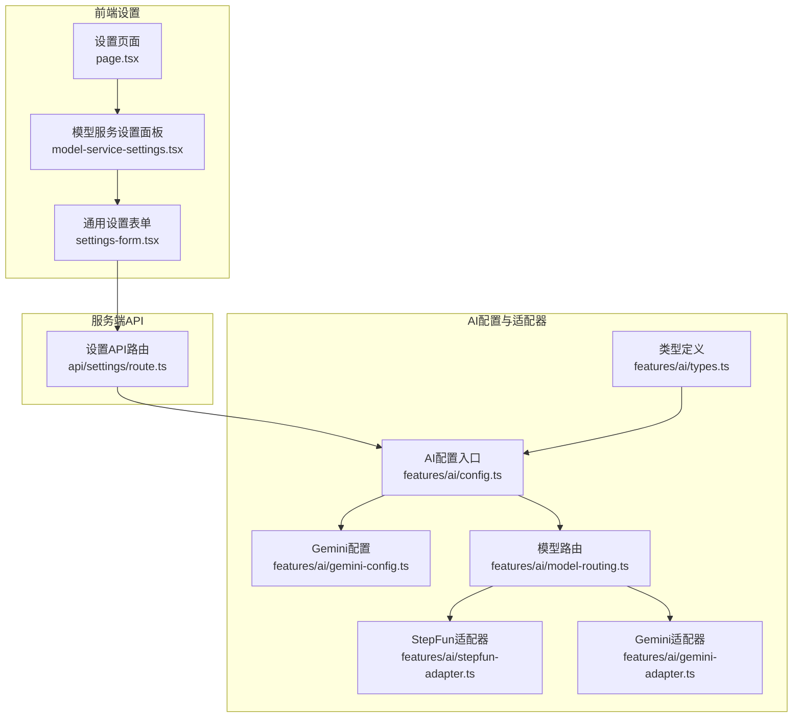
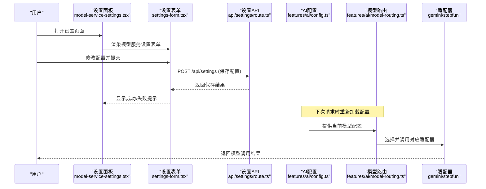
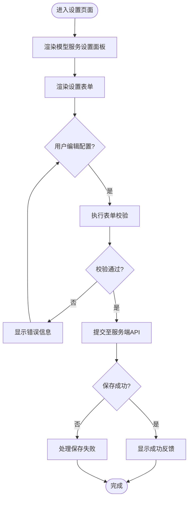
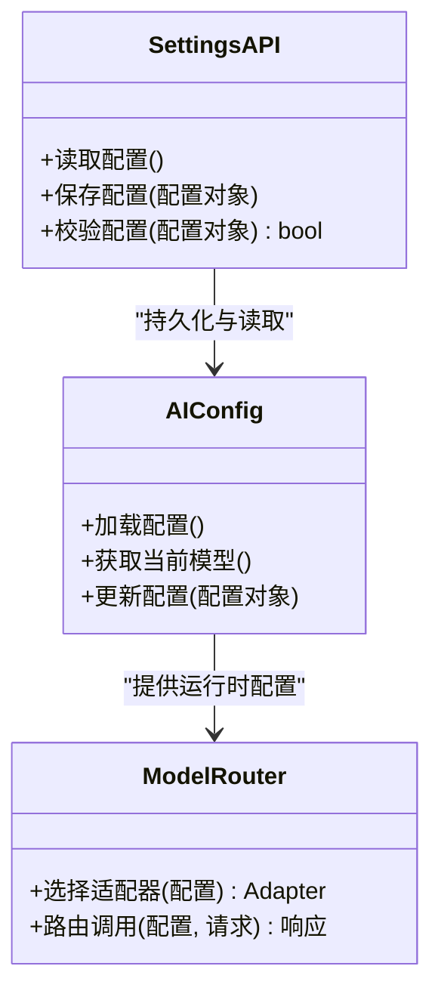
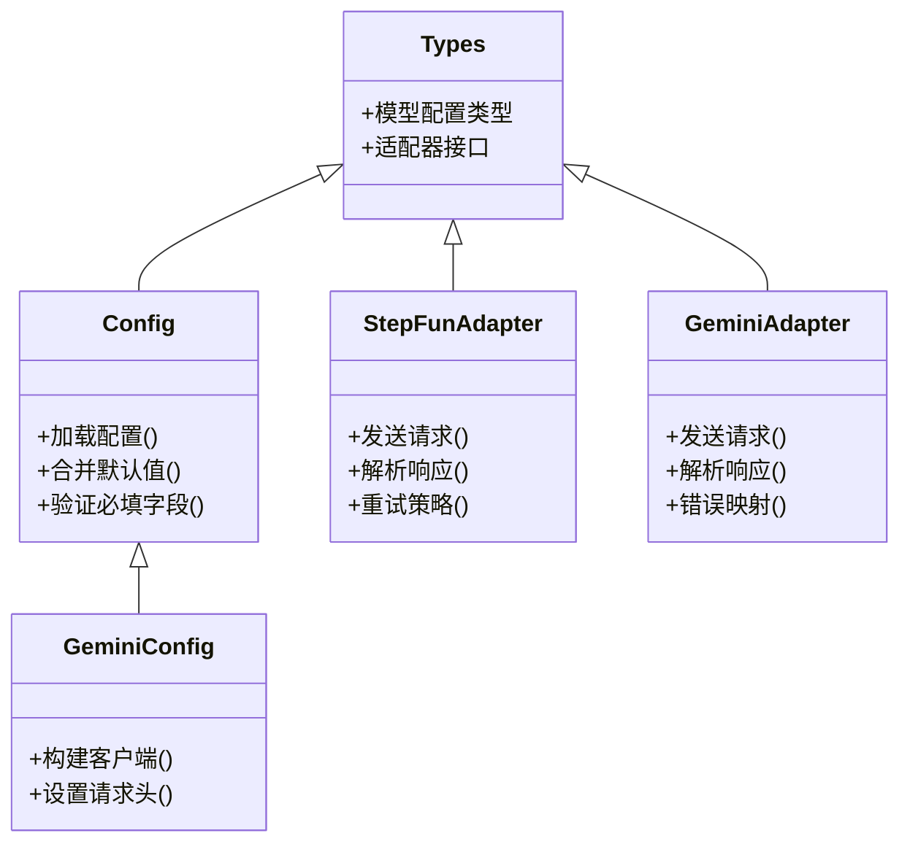
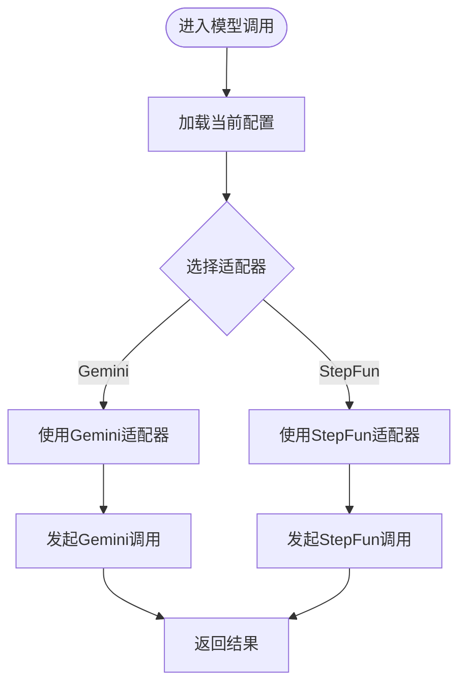
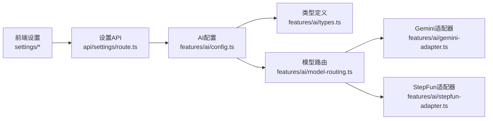

# 模型服务设置

<cite>
**本文引用的文件**   
- [settings/page.tsx](file://src/app/(app)/settings/page.tsx)
- [settings/model-service-settings.tsx](file://src/app/(app)/settings/model-service-settings.tsx)
- [settings/settings-form.tsx](file://src/app/(app)/settings/settings-form.tsx)
- [api/settings/route.ts](file://src/app/api/settings/route.ts)
- [features/ai/config.ts](file://src/features/ai/config.ts)
- [features/ai/gemini-config.ts](file://src/features/ai/gemini-config.ts)
- [features/ai/stepfun-adapter.ts](file://src/features/ai/stepfun-adapter.ts)
- [features/ai/gemini-adapter.ts](file://src/features/ai/gemini-adapter.ts)
- [features/ai/types.ts](file://src/features/ai/types.ts)
- [features/ai/model-routing.ts](file://src/features/ai/model-routing.ts)
</cite>

## 目录
1. [简介](#简介)
2. [项目结构](#项目结构)
3. [核心组件](#核心组件)
4. [架构总览](#架构总览)
5. [详细组件分析](#详细组件分析)
6. [依赖关系分析](#依赖关系分析)
7. [性能考虑](#性能考虑)
8. [故障排查指南](#故障排查指南)
9. [结论](#结论)
10. [附录](#附录)

## 简介
本文件聚焦“模型服务设置”能力，涵盖前端设置界面、服务端配置接口与AI模型适配层之间的关系。目标是帮助读者理解如何在应用中配置与管理不同AI模型（如Gemini、StepFun）的服务参数，以及这些配置如何被路由到具体适配器并影响后续调用流程。

## 项目结构
围绕“模型服务设置”的关键代码分布在以下位置：
- 前端设置页面与表单：位于应用路由下的 settings 模块
- 服务端设置API：用于读取和持久化配置
- AI配置与适配器：定义模型配置结构与具体厂商适配实现
- 模型路由：根据当前配置选择对应适配器

**图表来源** 
- [settings/page.tsx](file://src/app/(app)/settings/page.tsx)
- [settings/model-service-settings.tsx](file://src/app/(app)/settings/model-service-settings.tsx)
- [settings/settings-form.tsx](file://src/app/(app)/settings/settings-form.tsx)
- [api/settings/route.ts](file://src/app/api/settings/route.ts)
- [features/ai/config.ts](file://src/features/ai/config.ts)
- [features/ai/gemini-config.ts](file://src/features/ai/gemini-config.ts)
- [features/ai/stepfun-adapter.ts](file://src/features/ai/stepfun-adapter.ts)
- [features/ai/gemini-adapter.ts](file://src/features/ai/gemini-adapter.ts)
- [features/ai/types.ts](file://src/features/ai/types.ts)
- [features/ai/model-routing.ts](file://src/features/ai/model-routing.ts)

**章节来源**
- [settings/page.tsx](file://src/app/(app)/settings/page.tsx)
- [settings/model-service-settings.tsx](file://src/app/(app)/settings/model-service-settings.tsx)
- [settings/settings-form.tsx](file://src/app/(app)/settings/settings-form.tsx)
- [api/settings/route.ts](file://src/app/api/settings/route.ts)
- [features/ai/config.ts](file://src/features/ai/config.ts)
- [features/ai/gemini-config.ts](file://src/features/ai/gemini-config.ts)
- [features/ai/stepfun-adapter.ts](file://src/features/ai/stepfun-adapter.ts)
- [features/ai/gemini-adapter.ts](file://src/features/ai/gemini-adapter.ts)
- [features/ai/types.ts](file://src/features/ai/types.ts)
- [features/ai/model-routing.ts](file://src/features/ai/model-routing.ts)

## 核心组件
- 设置页面：承载“模型服务设置”入口与布局
- 模型服务设置面板：提供模型相关配置的输入与展示
- 通用设置表单：封装表单状态、校验与提交逻辑
- 设置API：暴露读取/更新配置的接口，负责持久化与校验
- AI配置与适配器：集中管理模型配置与厂商适配实现
- 模型路由：依据当前配置动态选择适配器

**章节来源**
- [settings/page.tsx](file://src/app/(app)/settings/page.tsx)
- [settings/model-service-settings.tsx](file://src/app/(app)/settings/model-service-settings.tsx)
- [settings/settings-form.tsx](file://src/app/(app)/settings/settings-form.tsx)
- [api/settings/route.ts](file://src/app/api/settings/route.ts)
- [features/ai/config.ts](file://src/features/ai/config.ts)
- [features/ai/gemini-config.ts](file://src/features/ai/gemini-config.ts)
- [features/ai/stepfun-adapter.ts](file://src/features/ai/stepfun-adapter.ts)
- [features/ai/gemini-adapter.ts](file://src/features/ai/gemini-adapter.ts)
- [features/ai/types.ts](file://src/features/ai/types.ts)
- [features/ai/model-routing.ts](file://src/features/ai/model-routing.ts)

## 架构总览
下图展示了从用户操作到模型调用的端到端流程：用户在设置面板修改配置，通过表单提交至服务端API；服务端保存后，AI配置层加载最新配置，模型路由根据配置选择适配器，最终由具体适配器发起外部模型调用。

**图表来源** 
- [settings/model-service-settings.tsx](file://src/app/(app)/settings/model-service-settings.tsx)
- [settings/settings-form.tsx](file://src/app/(app)/settings/settings-form.tsx)
- [api/settings/route.ts](file://src/app/api/settings/route.ts)
- [features/ai/config.ts](file://src/features/ai/config.ts)
- [features/ai/model-routing.ts](file://src/features/ai/model-routing.ts)
- [features/ai/gemini-adapter.ts](file://src/features/ai/gemini-adapter.ts)
- [features/ai/stepfun-adapter.ts](file://src/features/ai/stepfun-adapter.ts)

## 详细组件分析

### 设置页面与表单
- 设置页面负责挂载“模型服务设置”面板，组织页面布局与导航
- 模型服务设置面板提供模型相关的字段展示与编辑入口
- 通用设置表单统一处理表单状态、校验规则与提交行为，确保配置一致性

**图表来源** 
- [settings/page.tsx](file://src/app/(app)/settings/page.tsx)
- [settings/model-service-settings.tsx](file://src/app/(app)/settings/model-service-settings.tsx)
- [settings/settings-form.tsx](file://src/app/(app)/settings/settings-form.tsx)

**章节来源**
- [settings/page.tsx](file://src/app/(app)/settings/page.tsx)
- [settings/model-service-settings.tsx](file://src/app/(app)/settings/model-service-settings.tsx)
- [settings/settings-form.tsx](file://src/app/(app)/settings/settings-form.tsx)

### 设置API与服务端配置
- 设置API提供统一的读写接口，负责接收前端提交的配置数据
- 服务端对配置进行必要校验与持久化存储
- 其他模块通过配置入口获取最新配置，保证运行时一致性

**图表来源** 
- [api/settings/route.ts](file://src/app/api/settings/route.ts)
- [features/ai/config.ts](file://src/features/ai/config.ts)
- [features/ai/model-routing.ts](file://src/features/ai/model-routing.ts)

**章节来源**
- [api/settings/route.ts](file://src/app/api/settings/route.ts)
- [features/ai/config.ts](file://src/features/ai/config.ts)

### AI配置与适配器
- AI配置入口集中管理模型配置结构，包括密钥、端点、版本等关键参数
- Gemini配置与StepFun适配器分别实现特定厂商的调用协议与鉴权方式
- 类型定义确保配置与适配器之间的契约一致

**图表来源** 
- [features/ai/types.ts](file://src/features/ai/types.ts)
- [features/ai/config.ts](file://src/features/ai/config.ts)
- [features/ai/gemini-config.ts](file://src/features/ai/gemini-config.ts)
- [features/ai/stepfun-adapter.ts](file://src/features/ai/stepfun-adapter.ts)
- [features/ai/gemini-adapter.ts](file://src/features/ai/gemini-adapter.ts)

**章节来源**
- [features/ai/types.ts](file://src/features/ai/types.ts)
- [features/ai/config.ts](file://src/features/ai/config.ts)
- [features/ai/gemini-config.ts](file://src/features/ai/gemini-config.ts)
- [features/ai/stepfun-adapter.ts](file://src/features/ai/stepfun-adapter.ts)
- [features/ai/gemini-adapter.ts](file://src/features/ai/gemini-adapter.ts)

### 模型路由
- 模型路由根据当前配置决定使用哪个适配器
- 支持多模型切换与降级策略
- 为上层业务提供统一的调用入口

**图表来源** 
- [features/ai/model-routing.ts](file://src/features/ai/model-routing.ts)
- [features/ai/gemini-adapter.ts](file://src/features/ai/gemini-adapter.ts)
- [features/ai/stepfun-adapter.ts](file://src/features/ai/stepfun-adapter.ts)

**章节来源**
- [features/ai/model-routing.ts](file://src/features/ai/model-routing.ts)

## 依赖关系分析
- 前端设置模块依赖服务端API以持久化配置
- 服务端API依赖AI配置模块以读取与更新配置
- AI配置模块依赖类型定义以确保数据结构一致性
- 模型路由依赖具体适配器实现以完成实际调用

**图表来源** 
- [settings/page.tsx](file://src/app/(app)/settings/page.tsx)
- [settings/model-service-settings.tsx](file://src/app/(app)/settings/model-service-settings.tsx)
- [settings/settings-form.tsx](file://src/app/(app)/settings/settings-form.tsx)
- [api/settings/route.ts](file://src/app/api/settings/route.ts)
- [features/ai/config.ts](file://src/features/ai/config.ts)
- [features/ai/types.ts](file://src/features/ai/types.ts)
- [features/ai/model-routing.ts](file://src/features/ai/model-routing.ts)
- [features/ai/gemini-adapter.ts](file://src/features/ai/gemini-adapter.ts)
- [features/ai/stepfun-adapter.ts](file://src/features/ai/stepfun-adapter.ts)

**章节来源**
- [settings/page.tsx](file://src/app/(app)/settings/page.tsx)
- [settings/model-service-settings.tsx](file://src/app/(app)/settings/model-service-settings.tsx)
- [settings/settings-form.tsx](file://src/app/(app)/settings/settings-form.tsx)
- [api/settings/route.ts](file://src/app/api/settings/route.ts)
- [features/ai/config.ts](file://src/features/ai/config.ts)
- [features/ai/types.ts](file://src/features/ai/types.ts)
- [features/ai/model-routing.ts](file://src/features/ai/model-routing.ts)
- [features/ai/gemini-adapter.ts](file://src/features/ai/gemini-adapter.ts)
- [features/ai/stepfun-adapter.ts](file://src/features/ai/stepfun-adapter.ts)

## 性能考虑
- 配置加载应缓存避免重复I/O
- 表单提交需防抖与节流减少无效请求
- 适配器调用应支持超时与重试机制
- 大对象传输建议压缩与分页

[本节为通用指导，不直接分析具体文件]

## 故障排查指南
- 配置未生效：检查服务端API是否正确保存配置，确认AI配置模块是否重新加载
- 模型调用失败：查看适配器日志，确认密钥与端点配置正确性
- 表单校验错误：核对必填字段与格式要求，确保前后端校验一致
- 路由选择异常：验证模型路由逻辑是否符合预期配置

**章节来源**
- [api/settings/route.ts](file://src/app/api/settings/route.ts)
- [features/ai/config.ts](file://src/features/ai/config.ts)
- [features/ai/model-routing.ts](file://src/features/ai/model-routing.ts)
- [features/ai/gemini-adapter.ts](file://src/features/ai/gemini-adapter.ts)
- [features/ai/stepfun-adapter.ts](file://src/features/ai/stepfun-adapter.ts)

## 结论
“模型服务设置”功能通过前端设置界面、服务端配置接口与AI适配器层的协同工作，实现了灵活的模型配置管理与调用路由。建议在后续迭代中加强配置校验、错误处理与性能优化，以提升用户体验与系统稳定性。

[本节为总结性内容，不直接分析具体文件]

## 附录
- 相关文档与规范可参考项目中的设计文档与约定
- 测试用例可覆盖配置加载、表单提交与适配器调用等关键路径

[本节为补充说明，不直接分析具体文件]