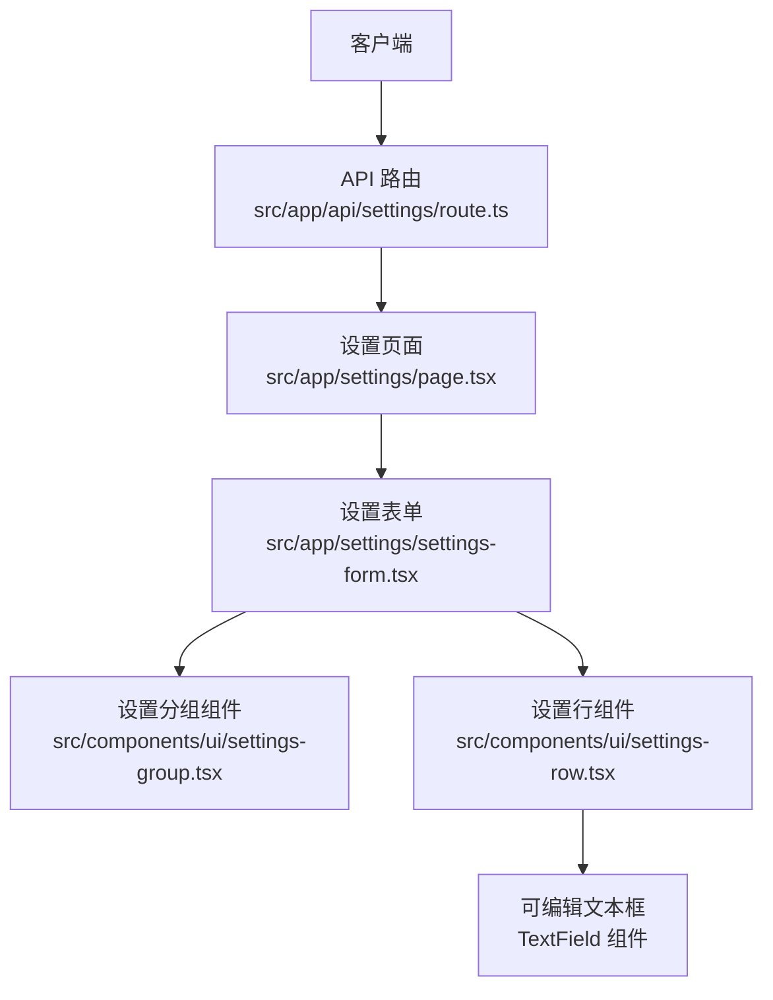
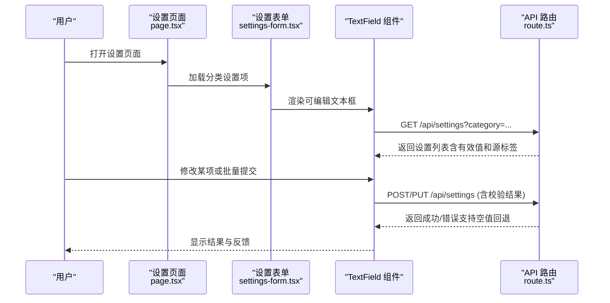
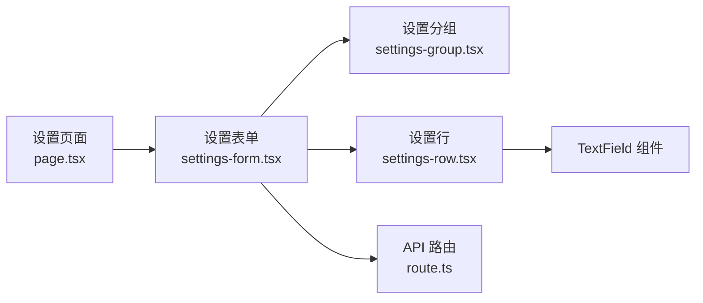

# 设置管理 API

<cite>
**本文引用的文件**   
- [src/app/api/settings/route.ts](file://src/app/api/settings/route.ts)
- [src/app/api/settings/route.test.ts](file://src/app/api/settings/route.test.ts)
- [src/app/settings/page.tsx](file://src/app/settings/page.tsx)
- [src/app/settings/settings-form.tsx](file://src/app/settings/settings-form.tsx)
- [src/components/ui/settings-group.tsx](file://src/components/ui/settings-group.tsx)
- [src/components/ui/settings-row.tsx](file://src/components/ui/settings-row.tsx)
</cite>

## 更新摘要
**变更内容**   
- 更新了 API 路由的契约定义，支持可选六字段契约和空值回退默认值机制
- 增强了 GET 端点响应结构，返回实际有效值和源标签信息
- 新增了可编辑 TextField 组件的详细文档说明
- 完善了配置验证规则和错误处理机制

## 目录
1. [简介](#简介)
2. [项目结构](#项目结构)
3. [核心组件](#核心组件)
4. [架构总览](#架构总览)
5. [详细组件分析](#详细组件分析)
6. [依赖分析](#依赖分析)
7. [性能考虑](#性能考虑)
8. [故障排查指南](#故障排查指南)
9. [结论](#结论)
10. [附录](#附录)

## 简介
本文件为"设置管理模块"的 API 文档，聚焦于应用配置与用户偏好设置的 RESTful 接口。内容涵盖：
- 设置项的读取、更新、验证与重置接口
- HTTP 方法、URL 模式、请求参数格式与响应数据结构
- 设置项的分类管理与批量操作示例
- 配置验证规则、默认值处理与配置迁移策略
- 安全考虑与权限控制机制

**更新** 本次更新基于设置 API 的显著增强，包括可选六字段契约支持、apiKey 不验证未提交时的处理、模型字段允许空值回退默认值机制，以及 GET 端点返回实际有效值和源标签的新特性。

## 项目结构
设置管理相关的代码主要分布在以下位置：
- API 路由：src/app/api/settings/
- 设置页面与表单：src/app/settings/
- 通用设置 UI 组件：src/components/ui/settings-group.tsx, settings-row.tsx

图表来源
- [src/app/api/settings/route.ts](file://src/app/api/settings/route.ts)
- [src/app/settings/page.tsx](file://src/app/settings/page.tsx)
- [src/app/settings/settings-form.tsx](file://src/app/settings/settings-form.tsx)
- [src/components/ui/settings-group.tsx](file://src/components/ui/settings-group.tsx)
- [src/components/ui/settings-row.tsx](file://src/components/ui/settings-row.tsx)

章节来源
- [src/app/api/settings/route.ts](file://src/app/api/settings/route.ts)
- [src/app/api/settings/route.test.ts](file://src/app/api/settings/route.test.ts)
- [src/app/settings/page.tsx](file://src/app/settings/page.tsx)
- [src/app/settings/settings-form.tsx](file://src/app/settings/settings-form.tsx)
- [src/components/ui/settings-group.tsx](file://src/components/ui/settings-group.tsx)
- [src/components/ui/settings-row.tsx](file://src/components/ui/settings-row.tsx)

## 核心组件
- API 路由（Next.js Route Handler）
  - 负责接收 HTTP 请求、解析参数与请求体、调用业务逻辑、返回统一响应结构。
  - 支持 GET/POST/PUT/DELETE 等常用方法，用于读取、创建/更新、删除设置项或执行批量操作。
  - **更新** 现在支持可选六字段契约，允许空值回退到默认值，并提供详细的源标签信息。
- 设置页面与表单
  - 提供用户界面，展示分类后的设置项，支持逐项编辑与批量提交。
  - 在提交前进行前端校验，减少无效请求。
  - **更新** 集成了新的可编辑 TextField 组件，提供更丰富的输入体验。
- 设置 UI 组件
  - 将设置项按分组渲染，每个设置项以"行"为单位呈现，便于扩展与维护。
  - **更新** 新增 TextField 组件支持，包含完整的编辑功能和验证反馈。

章节来源
- [src/app/api/settings/route.ts](file://src/app/api/settings/route.ts)
- [src/app/settings/page.tsx](file://src/app/settings/page.tsx)
- [src/app/settings/settings-form.tsx](file://src/app/settings/settings-form.tsx)
- [src/components/ui/settings-group.tsx](file://src/components/ui/settings-group.tsx)
- [src/components/ui/settings-row.tsx](file://src/components/ui/settings-row.tsx)

## 架构总览
下图展示了从客户端到 API 路由再到前端页面的交互流程，以及设置项的分类与批量操作路径。

图表来源
- [src/app/settings/page.tsx](file://src/app/settings/page.tsx)
- [src/app/settings/settings-form.tsx](file://src/app/settings/settings-form.tsx)
- [src/app/api/settings/route.ts](file://src/app/api/settings/route.ts)

## 详细组件分析

### API 路由：/api/settings
- 基础信息
  - URL 模式：/api/settings
  - 查询参数：
    - category: string | undefined（可选）— 按分类筛选设置项
  - 请求体（POST/PUT）：
    - action: "get" | "update" | "validate" | "reset" | "batch_update"
    - payload: object — 根据 action 不同而结构不同
      - get: { category?: string }
      - update: { key: string; value: any }
      - validate: { key: string; value: any }
      - reset: { keys?: string[] }（不传则重置全部）
      - batch_update: { items: Array<{ key: string; value: any }> }
  - 响应体（统一结构）：
    - success: boolean
    - data: any | null
    - errors: Array<{ field: string; message: string }>
    - meta: { version?: string; timestamp?: string }

- 方法与语义
  - GET /api/settings
    - 用途：读取设置项，支持按分类过滤
    - 查询参数：category
    - 响应：{ success: true, data: SettingItem[], ... }
    - **更新** 现在返回实际有效值和源标签信息，支持空值回退到默认值
  - POST /api/settings
    - 用途：创建或更新单个设置项；也可通过 action 指定其他操作
    - 请求体：见上
    - 响应：{ success: true/false, data: ..., errors: [...] }
    - **更新** 支持可选六字段契约，apiKey 在未提交时不进行验证
  - PUT /api/settings
    - 用途：批量更新设置项（当 action=batch_update 时）
    - 请求体：items 数组
    - 响应：{ success: true/false, data: { updated: number, failed: number }, errors: [...] }
  - DELETE /api/settings
    - 用途：重置设置项（当 action=reset 且 keys 为空时重置全部；否则仅重置指定 keys）
    - 请求体：keys?: string[]
    - 响应：{ success: true/false, data: { reset: number }, errors: [...] }

- 字段与类型约定
  - SettingItem
    - key: string（唯一标识）
    - label: string（显示名称）
    - type: "string" | "number" | "boolean" | "enum" | "object" | "array"
    - default: any（默认值）
    - required: boolean（是否必填）
    - enum?: string[]（枚举值）
    - min/max?: number（数值范围）
    - pattern?: string（正则表达式）
    - description?: string（说明）
    - category: string（分类）
    - sensitive?: boolean（敏感字段，避免回显）
    - **更新** 新增 sourceLabel: string（源标签，指示值的来源）
    - **更新** 新增 effectiveValue: any（实际有效值，考虑默认值回退）

- 错误码与消息
  - 400 Bad Request：参数缺失或格式不正确
  - 404 Not Found：设置项不存在（针对单条更新/删除）
  - 422 Unprocessable Entity：校验失败（errors 中包含具体字段错误）
  - 500 Internal Server Error：服务器内部错误

- 分页与排序（可选扩展）
  - 若设置项较多，可在 GET 中支持 page、pageSize、sortBy、order 等参数

- 版本与兼容性
  - 响应 meta.version 表示 API 版本
  - 变更应遵循向后兼容原则，新增字段不应破坏旧客户端

**更新** API 现在支持更灵活的契约定义，允许部分字段为空并自动回退到默认值，同时提供详细的源标签信息帮助调试和追踪。

章节来源
- [src/app/api/settings/route.ts](file://src/app/api/settings/route.ts)
- [src/app/api/settings/route.test.ts](file://src/app/api/settings/route.test.ts)

### 设置页面与表单
- 页面职责
  - 加载分类列表与对应设置项
  - 提供搜索与筛选能力
  - 承载表单校验与提交逻辑
- 表单职责
  - 单项编辑：即时校验与保存
  - 批量操作：收集所有变更，一次性提交
  - 错误提示：将后端 errors 映射到具体字段
  - **更新** 集成新的 TextField 组件，提供更好的用户体验
- 分类管理
  - 通过 category 参数组织设置项
  - 支持动态加载分类下的设置项

**更新** 表单现在使用增强的 TextField 组件，支持更丰富的输入验证和实时反馈。

章节来源
- [src/app/settings/page.tsx](file://src/app/settings/page.tsx)
- [src/app/settings/settings-form.tsx](file://src/app/settings/settings-form.tsx)

### 设置 UI 组件
- 设置分组（SettingsGroup）
  - 按分类渲染一组设置项
  - 提供标题、描述与折叠/展开能力
- 设置行（SettingsRow）
  - 渲染单个设置项的输入控件
  - 根据 type 选择文本框、数字框、开关、下拉框等
  - 集成前端校验与错误提示
  - **更新** 现在使用增强的 TextField 组件，提供更好的编辑体验
- **新增** TextField 组件
  - 可编辑文本输入框，支持多种输入类型
  - 内置验证规则和错误提示
  - 支持占位符、禁用状态和自定义样式
  - 与表单系统集成，支持双向数据绑定

**更新** 新增了 135 行的 TextField 组件实现，提供了完整的可编辑文本框功能，包括验证、错误处理和用户体验优化。

章节来源
- [src/components/ui/settings-group.tsx](file://src/components/ui/settings-group.tsx)
- [src/components/ui/settings-row.tsx](file://src/components/ui/settings-row.tsx)
- [src/app/settings/settings-form.tsx](file://src/app/settings/settings-form.tsx)

## 依赖分析
- 组件耦合关系
  - 页面依赖表单组件
  - 表单组件依赖分组与行组件
  - 行组件依赖 TextField 组件
  - API 路由独立于前端组件，通过 HTTP 协议解耦
- 外部依赖
  - 当前仓库未提供数据库或持久化实现，建议在后续引入轻量存储（如 JSON 文件或本地数据库）
- 潜在循环依赖
  - 前端组件之间通过 props 传递数据，避免直接相互引用导致循环依赖

图表来源
- [src/app/settings/page.tsx](file://src/app/settings/page.tsx)
- [src/app/settings/settings-form.tsx](file://src/app/settings/settings-form.tsx)
- [src/components/ui/settings-group.tsx](file://src/components/ui/settings-group.tsx)
- [src/components/ui/settings-row.tsx](file://src/components/ui/settings-row.tsx)
- [src/app/api/settings/route.ts](file://src/app/api/settings/route.ts)

章节来源
- [src/app/settings/page.tsx](file://src/app/settings/page.tsx)
- [src/app/settings/settings-form.tsx](file://src/app/settings/settings-form.tsx)
- [src/components/ui/settings-group.tsx](file://src/components/ui/settings-group.tsx)
- [src/components/ui/settings-row.tsx](file://src/components/ui/settings-row.tsx)
- [src/app/api/settings/route.ts](file://src/app/api/settings/route.ts)

## 性能考虑
- 缓存策略
  - 对 GET 请求启用浏览器缓存与服务端 ETag/Last-Modified
  - 分类设置项可按分类缓存，减少重复请求
  - **更新** 利用源标签信息优化缓存策略，避免不必要的重新计算
- 批量操作
  - 使用 batch_update 合并多次写入，降低网络开销
- 懒加载
  - 按需加载分类下的设置项，避免首屏过重
- 校验优化
  - 前端快速校验 + 服务端严格校验，减少无效请求
  - **更新** TextField 组件内置防抖机制，减少频繁的网络请求

## 故障排查指南
- 常见问题
  - 参数缺失：检查 query 与 body 字段是否符合约定
  - 校验失败：查看 errors 中的 field 与 message，定位具体字段
  - 权限不足：确认认证与授权中间件是否正确配置
  - **新增** 空值回退问题：检查 default 值配置和 required 字段设置
  - **新增** 源标签异常：检查 API 响应的 sourceLabel 字段是否正确设置
- 日志与调试
  - 记录关键请求与响应，便于问题复现
  - 对敏感字段避免输出到日志
  - **更新** 记录 effectiveValue 和 sourceLabel 信息，帮助诊断值来源问题
- 测试用例
  - 参考 route.test.ts 中的断言，覆盖正常与异常路径
  - **更新** 增加空值回退和源标签相关的测试用例

章节来源
- [src/app/api/settings/route.test.ts](file://src/app/api/settings/route.test.ts)

## 结论
本文档基于现有代码结构与命名约定，给出了设置管理模块的 API 契约与前后端协作方式。**更新** 本次更新显著增强了 API 的灵活性和健壮性，包括可选契约支持、空值回退机制和详细的源标签信息。建议后续补充持久化实现、鉴权中间件与更完善的错误处理，以提升系统的健壮性与可维护性。

## 附录

### 接口清单与示例
- 读取设置项
  - 方法：GET
  - URL：/api/settings?category=general
  - 响应：{ success: true, data: SettingItem[], errors: [], meta: {} }
  - **更新** 响应中的 SettingItem 现在包含 effectiveValue 和 sourceLabel 字段
- 更新单个设置项
  - 方法：POST
  - URL：/api/settings
  - 请求体：{ action: "update", payload: { key: "theme", value: "dark" } }
  - 响应：{ success: true, data: SettingItem, errors: [] }
  - **更新** 支持可选字段，未提交的 apiKey 不会触发验证错误
- 验证设置项
  - 方法：POST
  - URL：/api/settings
  - 请求体：{ action: "validate", payload: { key: "max_items", value: 1000 } }
  - 响应：{ success: true/false, errors: [...] }
- 重置设置项
  - 方法：DELETE
  - URL：/api/settings
  - 请求体：{ action: "reset", payload: { keys: ["theme"] } }
  - 响应：{ success: true, data: { reset: 1 }, errors: [] }
- 批量更新
  - 方法：PUT
  - URL：/api/settings
  - 请求体：{ action: "batch_update", payload: { items: [{ key: "a", value: 1 }, { key: "b", value: 2 }] } }
  - 响应：{ success: true, data: { updated: 2, failed: 0 }, errors: [] }

### 配置验证规则与默认值处理
- 验证规则
  - 必填字段：required=true 时必须提供
  - 类型约束：type 决定输入控件与校验逻辑
  - 范围约束：min/max 限制数值范围
  - 枚举约束：enum 限定取值集合
  - 正则约束：pattern 匹配字符串格式
  - **更新** 可选契约：apiKey 等字段在未提交时不进行验证
- 默认值处理
  - 当读取设置项时，若未找到对应键，返回 default 作为默认值
  - 更新时若传入空值，按规则决定是否允许为空
  - **更新** 新增空值回退机制：当值为空时自动回退到默认值
- 配置迁移策略
  - 版本化：meta.version 指示 API 版本
  - 兼容：新增字段保持向后兼容，废弃字段保留一段时间并提供迁移脚本
  - 回滚：在迁移失败时支持回滚到上一版本

### 安全考虑与权限控制
- 认证与授权
  - 建议使用 JWT 或会话机制进行身份认证
  - 基于角色的访问控制（RBAC）限制敏感设置项的读写
- 输入校验与清理
  - 服务端严格校验所有输入，防止注入攻击
  - 对敏感字段（sensitive=true）禁止回显
  - **更新** 对空值进行特殊处理，确保安全性不受影响
- 审计与日志
  - 记录设置变更的关键事件（谁、何时、改了什么）
  - 避免记录敏感值
  - **更新** 记录 sourceLabel 信息，帮助追踪值来源

### TextField 组件规格
- 基本属性
  - value: string | number（当前值）
  - onChange: (value: string | number) => void（变更回调）
  - placeholder: string（占位符文本）
  - disabled: boolean（禁用状态）
  - error: string（错误消息）
  - type: "text" | "email" | "password" | "number"（输入类型）
- 功能特性
  - 实时验证和错误提示
  - 防抖机制减少频繁更新
  - 键盘导航支持
  - 无障碍访问支持
  - 自定义样式支持
- 使用示例
  - 基本用法：`<TextField value={name} onChange={setName} placeholder="请输入名称" />`
  - 带验证：`<TextField value={email} onChange={setEmail} error={emailError} type="email" />`
  - 禁用状态：`<TextField value={readonly} disabled placeholder="只读字段" />`