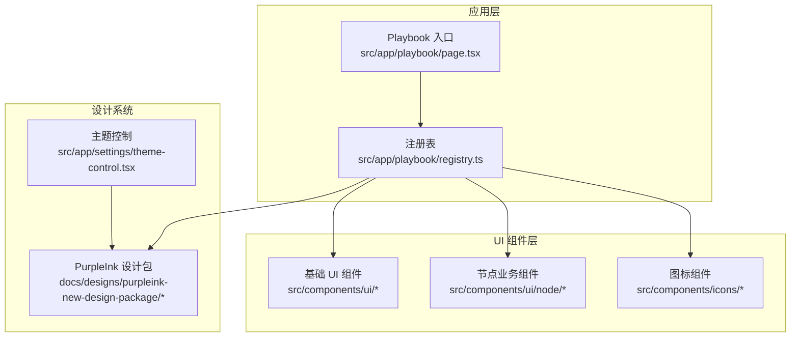
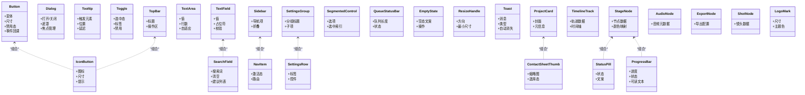
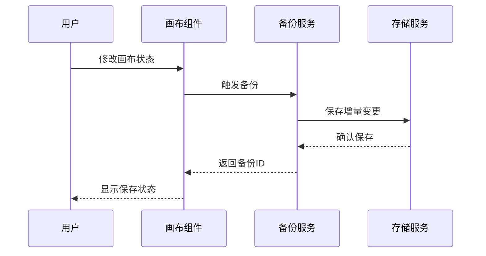
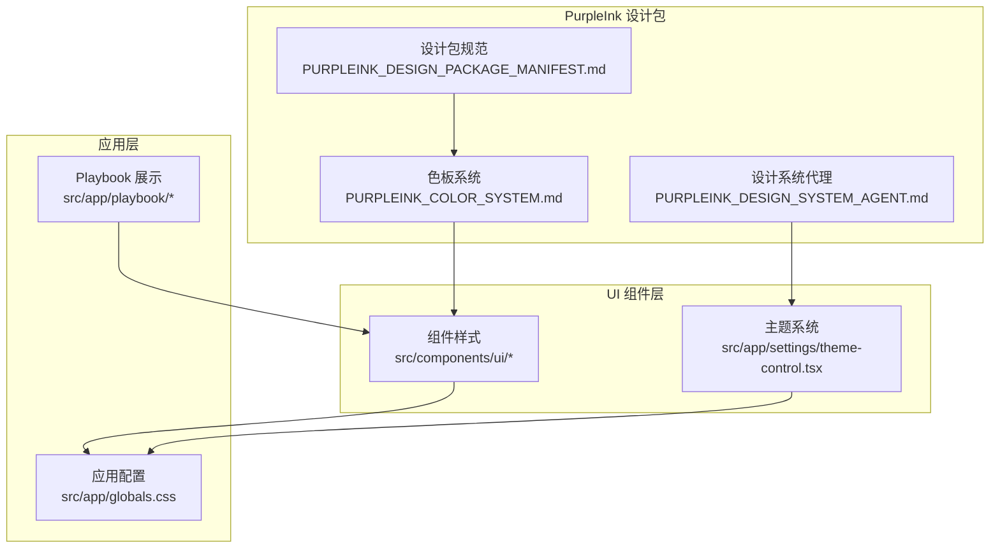
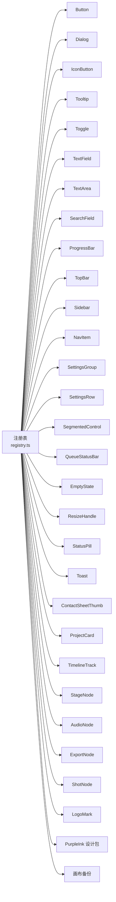
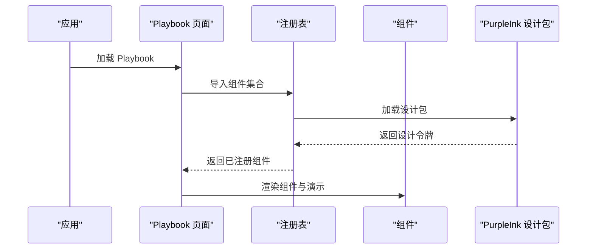

# UI 组件库

<cite>
**本文引用的文件**   
- [src/components/ui/button.tsx](file://src/components/ui/button.tsx)
- [src/components/ui/button.demo.tsx](file://src/components/ui/button.demo.tsx)
- [src/components/ui/card.tsx](file://src/components/ui/card.tsx)
- [src/components/ui/card.demo.tsx](file://src/components/ui/card.demo.tsx)
- [src/components/ui/dialog.tsx](file://src/components/ui/dialog.tsx)
- [src/components/ui/dialog.demo.tsx](file://src/components/ui/dialog.demo.tsx)
- [src/components/ui/icon-button.tsx](file://src/components/ui/icon-button.tsx)
- [src/components/ui/icon-button.demo.tsx](file://src/components/ui/icon-button.demo.tsx)
- [src/components/ui/nav-item.tsx](file://src/components/ui/nav-item.tsx)
- [src/components/ui/nav-item.demo.tsx](file://src/components/ui/nav-item.demo.tsx)
- [src/components/ui/progress-bar.tsx](file://src/components/ui/progress-bar.tsx)
- [src/components/ui/progress-bar.demo.tsx](file://src/components/ui/progress-bar.demo.tsx)
- [src/components/ui/search-field.tsx](file://src/components/ui/search-field.tsx)
- [src/components/ui/search-field.demo.tsx](file://src/components/ui/search-field.demo.tsx)
- [src/components/ui/sidebar.tsx](file://src/components/ui/sidebar.tsx)
- [src/components/ui/sidebar.demo.tsx](file://src/components/ui/sidebar.demo.tsx)
- [src/components/ui/status-pill.tsx](file://src/components/ui/status-pill.tsx)
- [src/components/ui/status-pill.demo.tsx](file://src/components/ui/status-pill.demo.tsx)
- [src/components/ui/text-field.tsx](file://src/components/ui/text-field.tsx)
- [src/components/ui/text-field.demo.tsx](file://src/components/ui/text-field.demo.tsx)
- [src/components/ui/text-area.tsx](file://src/components/ui/text-area.tsx)
- [src/components/ui/text-area.demo.tsx](file://src/components/ui/text-area.demo.tsx)
- [src/components/ui/timeline-track.tsx](file://src/components/ui/timeline-track.tsx)
- [src/components/ui/timeline-track.demo.tsx](file://src/components/ui/timeline-track.demo.tsx)
- [src/components/ui/toast.tsx](file://src/components/ui/toast.tsx)
- [src/components/ui/toast.demo.tsx](file://src/components/ui/toast.demo.tsx)
- [src/components/ui/toggle.tsx](file://src/components/ui/toggle.tsx)
- [src/components/ui/toggle.demo.tsx](file://src/components/ui/toggle.demo.tsx)
- [src/components/ui/tooltip.tsx](file://src/components/ui/tooltip.tsx)
- [src/components/ui/tooltip.demo.tsx](file://src/components/ui/tooltip.demo.tsx)
- [src/components/ui/top-bar.tsx](file://src/components/ui/top-bar.tsx)
- [src/components/ui/top-bar.demo.tsx](file://src/components/ui/top-bar.demo.tsx)
- [src/components/ui/settings-group.tsx](file://src/components/ui/settings-group.tsx)
- [src/components/ui/settings-group.demo.tsx](file://src/components/ui/settings-group.demo.tsx)
- [src/components/ui/settings-row.tsx](file://src/components/ui/settings-row.tsx)
- [src/components/ui/settings-row.demo.tsx](file://src/components/ui/settings-row.demo.tsx)
- [src/components/ui/segmented-control.tsx](file://src/components/ui/segmented-control.tsx)
- [src/components/ui/segmented-control.demo.tsx](file://src/components/ui/segmented-control.demo.tsx)
- [src/components/ui/queue-status-bar.tsx](file://src/components/ui/queue-status-bar.tsx)
- [src/components/ui/queue-status-bar.demo.tsx](file://src/components/ui/queue-status-bar.demo.tsx)
- [src/components/ui/contact-sheet-thumb.tsx](file://src/components/ui/contact-sheet-thumb.tsx)
- [src/components/ui/contact-sheet-thumb.demo.tsx](file://src/components/ui/contact-sheet-thumb.demo.tsx)
- [src/components/ui/empty-state.tsx](file://src/components/ui/empty-state.tsx)
- [src/components/ui/empty-state.demo.tsx](file://src/components/ui/empty-state.demo.tsx)
- [src/components/ui/resize-handle.tsx](file://src/components/ui/resize-handle.tsx)
- [src/components/ui/resize-handle.demo.tsx](file://src/components/ui/resize-handle.demo.tsx)
- [src/components/ui/project-card.tsx](file://src/components/ui/project-card.tsx)
- [src/components/ui/project-card.demo.tsx](file://src/components/ui/project-card.demo.tsx)
- [src/components/ui/node/stage-node.tsx](file://src/components/ui/node/stage-node.tsx)
- [src/components/ui/node/stage-node.demo.tsx](file://src/components/ui/node/stage-node.demo.tsx)
- [src/components/ui/node/stage-colors.ts](file://src/components/ui/node/stage-colors.ts)
- [src/components/ui/node/types.ts](file://src/components/ui/node/types.ts)
- [src/components/ui/node/audio-node.tsx](file://src/components/ui/node/audio-node.tsx)
- [src/components/ui/node/audio-node.demo.tsx](file://src/components/ui/node/audio-node.demo.tsx)
- [src/components/ui/node/export-node.tsx](file://src/components/ui/node/export-node.tsx)
- [src/components/ui/node/export-node.demo.tsx](file://src/components/ui/node/export-node.demo.tsx)
- [src/components/ui/node/shot-node.tsx](file://src/components/ui/node/shot-node.tsx)
- [src/components/ui/node/shot-node.demo.tsx](file://src/components/ui/node/shot-node.demo.tsx)
- [src/app/playbook/registry.ts](file://src/app/playbook/registry.ts)
- [src/app/playbook/registry.test.ts](file://src/app/playbook/registry.test.ts)
- [src/app/playbook/page.tsx](file://src/app/playbook/page.tsx)
- [src/app/playbook/foundations/page.tsx](file://src/app/playbook/foundations/page.tsx)
- [src/app/playbook/icons/page.tsx](file://src/app/playbook/icons/page.tsx)
- [src/app/playbook/ui/page.tsx](file://src/app/playbook/ui/page.tsx)
- [src/app/settings/theme-control.tsx](file://src/app/settings/theme-control.tsx)
- [src/app/settings/theme-control.test.ts](file://src/app/settings/theme-control.test.ts)
- [src/app/globals.css](file://src/app/globals.css)
- [src/components/icons/logo-mark.tsx](file://src/components/icons/logo-mark.tsx)
- [src/components/icons/logo-mark.demo.tsx](file://src/components/icons/logo-mark.demo.tsx)
- [src/components/icons/lucide-catalog.demo.tsx](file://src/components/icons/lucide-catalog.demo.tsx)
- [docs/designs/purpleink-new-design-package/PURPLEINK_DESIGN_PACKAGE_MANIFEST.md](file://docs/designs/purpleink-new-design-package/PURPLEINK_DESIGN_PACKAGE_MANIFEST.md)
- [docs/designs/purpleink-new-design-package/PURPLEINK_DESIGN_SYSTEM_AGENT.md](file://docs/designs/purpleink-new-design-package/PURPLEINK_DESIGN_SYSTEM_AGENT.md)
- [docs/designs/purpleink-new-design-package/source-reference/DESIGN.md](file://docs/designs/purpleink-new-design-package/source-reference/DESIGN.md)
- [docs/designs/purpleink-new-design-package/source-reference/PURPLEINK_COLOR_SYSTEM.md](file://docs/designs/purpleink-new-design-package/source-reference/PURPLEINK_COLOR_SYSTEM.md)
</cite>

## 更新摘要
**所做更改**   
- 新增画布备份功能章节，说明自动状态保存与恢复机制
- 添加 PurpleInk 新设计包集成章节，介绍新的设计系统与色板系统
- 更新主题定制章节，包含 PurpleInk 设计系统的集成方法
- 增强组件注册机制，支持新的设计包扩展

## 目录
1. [简介](#简介)
2. [项目结构](#项目结构)
3. [核心组件](#核心组件)
4. [架构总览](#架构总览)
5. [详细组件分析](#详细组件分析)
6. [画布备份功能](#画布备份功能)
7. [PurpleInk 设计包集成](#purpleink-设计包集成)
8. [依赖关系分析](#依赖关系分析)
9. [性能与可访问性](#性能与可访问性)
10. [主题与样式定制](#主题与样式定制)
11. [组件注册与扩展机制](#组件注册与扩展机制)
12. [故障排查指南](#故障排查指南)
13. [结论](#结论)

## 简介
本文件为 CodeVideoCanvas 的 UI 组件库文档，聚焦于设计系统与组件体系：基础组件、业务组件与图标系统。内容涵盖每个组件的属性、事件、插槽与自定义选项；提供丰富的使用示例与组合模式；说明响应式设计与无障碍访问兼容性；阐述主题定制与样式覆盖方法；并解释组件注册机制与扩展方式。

**最新更新** 新增了画布备份功能和 PurpleInk 新设计包集成，增强了 UI 组件系统的自动状态保存与恢复能力。

## 项目结构
UI 组件库位于 src/components 下，分为通用 UI 组件（ui）、节点类业务组件（node）与图标（icons）。Playbook 页面用于展示与演示各组件用法，并通过 registry 进行集中注册与导出。

**图表来源**
- [src/app/playbook/page.tsx](file://src/app/playbook/page.tsx)
- [src/app/playbook/registry.ts](file://src/app/playbook/registry.ts)
- [docs/designs/purpleink-new-design-package/PURPLEINK_DESIGN_PACKAGE_MANIFEST.md](file://docs/designs/purpleink-new-design-package/PURPLEINK_DESIGN_PACKAGE_MANIFEST.md)

**章节来源**
- [src/app/playbook/page.tsx](file://src/app/playbook/page.tsx)
- [src/app/playbook/registry.ts](file://src/app/playbook/registry.ts)

## 核心组件
本节概述基础组件、业务组件与图标系统的职责边界与典型用法。

- 基础 UI 组件
  - 按钮与交互：Button、IconButton、Toggle、Tooltip、Dialog、ProgressBar、SearchField、TextField、TextArea、TopBar、Sidebar、NavItem、SegmentedControl、SettingsGroup、SettingsRow、QueueStatusBar、EmptyState、ResizeHandle、StatusPill、Toast、ContactSheetThumb、ProjectCard、TimelineTrack 等。
  - 关注点：统一的属性命名、事件回调约定、可访问性语义、响应式适配。

- 节点业务组件
  - StageNode、AudioNode、ExportNode、ShotNode 等，面向画布工作流中的节点渲染与交互。
  - 关注点：节点类型、颜色映射、状态展示、拖拽/缩放/连接等交互。

- 图标系统
  - LogoMark 与 Lucide 图标目录，统一尺寸、色板与主题适配。

**章节来源**
- [src/components/ui/button.tsx](file://src/components/ui/button.tsx)
- [src/components/ui/dialog.tsx](file://src/components/ui/dialog.tsx)
- [src/components/ui/icon-button.tsx](file://src/components/ui/icon-button.tsx)
- [src/components/ui/nav-item.tsx](file://src/components/ui/nav-item.tsx)
- [src/components/ui/progress-bar.tsx](file://src/components/ui/progress-bar.tsx)
- [src/components/ui/search-field.tsx](file://src/components/ui/search-field.tsx)
- [src/components/ui/sidebar.tsx](file://src/components/ui/sidebar.tsx)
- [src/components/ui/status-pill.tsx](file://src/components/ui/status-pill.tsx)
- [src/components/ui/text-field.tsx](file://src/components/ui/text-field.tsx)
- [src/components/ui/text-area.tsx](file://src/components/ui/text-area.tsx)
- [src/components/ui/timeline-track.tsx](file://src/components/ui/timeline-track.tsx)
- [src/components/ui/toast.tsx](file://src/components/ui/toast.tsx)
- [src/components/ui/toggle.tsx](file://src/components/ui/toggle.tsx)
- [src/components/ui/tooltip.tsx](file://src/components/ui/tooltip.tsx)
- [src/components/ui/top-bar.tsx](file://src/components/ui/top-bar.tsx)
- [src/components/ui/settings-group.tsx](file://src/components/ui/settings-group.tsx)
- [src/components/ui/settings-row.tsx](file://src/components/ui/settings-row.tsx)
- [src/components/ui/segmented-control.tsx](file://src/components/ui/segmented-control.tsx)
- [src/components/ui/queue-status-bar.tsx](file://src/components/ui/queue-status-bar.tsx)
- [src/components/ui/contact-sheet-thumb.tsx](file://src/components/ui/contact-sheet-thumb.tsx)
- [src/components/ui/empty-state.tsx](file://src/components/ui/empty-state.tsx)
- [src/components/ui/resize-handle.tsx](file://src/components/ui/resize-handle.tsx)
- [src/components/ui/project-card.tsx](file://src/components/ui/project-card.tsx)
- [src/components/ui/node/stage-node.tsx](file://src/components/ui/node/stage-node.tsx)
- [src/components/ui/node/stage-colors.ts](file://src/components/ui/node/stage-colors.ts)
- [src/components/ui/node/types.ts](file://src/components/ui/node/types.ts)
- [src/components/ui/node/audio-node.tsx](file://src/components/ui/node/audio-node.tsx)
- [src/components/ui/node/export-node.tsx](file://src/components/ui/node/export-node.tsx)
- [src/components/ui/node/shot-node.tsx](file://src/components/ui/node/shot-node.tsx)
- [src/components/icons/logo-mark.tsx](file://src/components/icons/logo-mark.tsx)
- [src/components/icons/lucide-catalog.demo.tsx](file://src/components/icons/lucide-catalog.demo.tsx)

## 架构总览
UI 组件库采用"基础组件 + 业务组件 + 图标"的分层组织，Playbook 作为演示与注册中心，通过 registry 聚合导出，便于在应用内按需引入与统一维护。

**图表来源**
- [src/components/ui/button.tsx](file://src/components/ui/button.tsx)
- [src/components/ui/dialog.tsx](file://src/components/ui/dialog.tsx)
- [src/components/ui/icon-button.tsx](file://src/components/ui/icon-button.tsx)
- [src/components/ui/tooltip.tsx](file://src/components/ui/tooltip.tsx)
- [src/components/ui/toggle.tsx](file://src/components/ui/toggle.tsx)
- [src/components/ui/text-field.tsx](file://src/components/ui/text-field.tsx)
- [src/components/ui/text-area.tsx](file://src/components/ui/text-area.tsx)
- [src/components/ui/search-field.tsx](file://src/components/ui/search-field.tsx)
- [src/components/ui/progress-bar.tsx](file://src/components/ui/progress-bar.tsx)
- [src/components/ui/top-bar.tsx](file://src/components/ui/top-bar.tsx)
- [src/components/ui/sidebar.tsx](file://src/components/ui/sidebar.tsx)
- [src/components/ui/nav-item.tsx](file://src/components/ui/nav-item.tsx)
- [src/components/ui/settings-group.tsx](file://src/components/ui/settings-group.tsx)
- [src/components/ui/settings-row.tsx](file://src/components/ui/settings-row.tsx)
- [src/components/ui/segmented-control.tsx](file://src/components/ui/segmented-control.tsx)
- [src/components/ui/queue-status-bar.tsx](file://src/components/ui/queue-status-bar.tsx)
- [src/components/ui/empty-state.tsx](file://src/components/ui/empty-state.tsx)
- [src/components/ui/resize-handle.tsx](file://src/components/ui/resize-handle.tsx)
- [src/components/ui/status-pill.tsx](file://src/components/ui/status-pill.tsx)
- [src/components/ui/toast.tsx](file://src/components/ui/toast.tsx)
- [src/components/ui/contact-sheet-thumb.tsx](file://src/components/ui/contact-sheet-thumb.tsx)
- [src/components/ui/project-card.tsx](file://src/components/ui/project-card.tsx)
- [src/components/ui/timeline-track.tsx](file://src/components/ui/timeline-track.tsx)
- [src/components/ui/node/stage-node.tsx](file://src/components/ui/node/stage-node.tsx)
- [src/components/ui/node/stage-colors.ts](file://src/components/ui/node/stage-colors.ts)
- [src/components/ui/node/types.ts](file://src/components/ui/node/types.ts)
- [src/components/ui/node/audio-node.tsx](file://src/components/ui/node/audio-node.tsx)
- [src/components/ui/node/export-node.tsx](file://src/components/ui/node/export-node.tsx)
- [src/components/ui/node/shot-node.tsx](file://src/components/ui/node/shot-node.tsx)
- [src/components/icons/logo-mark.tsx](file://src/components/icons/logo-mark.tsx)

## 详细组件分析

### 基础组件：Button
- 属性
  - 变体：主按钮、次按钮、危险等
  - 尺寸：默认、小、大
  - 禁用态：布尔开关
  - 加载态：显示加载指示器
  - 图标：前缀或后缀图标
  - 事件：点击回调
- 插槽
  - 默认插槽：按钮内容
  - 前/后插槽：图标或附加内容
- 自定义选项
  - 样式覆盖：通过 className 或 CSS 变量
  - 主题：跟随全局主题色板
- 响应式与无障碍
  - 触摸友好尺寸
  - aria-* 语义与键盘可达
- 示例路径
  - [button.demo.tsx](file://src/components/ui/button.demo.tsx)

**章节来源**
- [src/components/ui/button.tsx](file://src/components/ui/button.tsx)
- [src/components/ui/button.demo.tsx](file://src/components/ui/button.demo.tsx)

### 基础组件：Dialog
- 属性
  - 打开/关闭控制
  - 遮罩是否可点击关闭
  - 焦点初始目标
- 事件
  - 打开/关闭回调
- 插槽
  - 头部、主体、底部
- 自定义选项
  - 最大宽度、圆角、阴影
- 示例路径
  - [dialog.demo.tsx](file://src/components/ui/dialog.demo.tsx)

**章节来源**
- [src/components/ui/dialog.tsx](file://src/components/ui/dialog.tsx)
- [src/components/ui/dialog.demo.tsx](file://src/components/ui/dialog.demo.tsx)

### 基础组件：IconButton
- 属性
  - 图标、尺寸、提示
  - 禁用态、加载态
- 事件
  - 点击回调
- 示例路径
  - [icon-button.demo.tsx](file://src/components/ui/icon-button.demo.tsx)

**章节来源**
- [src/components/ui/icon-button.tsx](file://src/components/ui/icon-button.tsx)
- [src/components/ui/icon-button.demo.tsx](file://src/components/ui/icon-button.demo.tsx)

### 基础组件：Tooltip
- 属性
  - 触发元素、位置、延迟
- 事件
  - 显示/隐藏回调
- 示例路径
  - [tooltip.demo.tsx](file://src/components/ui/tooltip.demo.tsx)

**章节来源**
- [src/components/ui/tooltip.tsx](file://src/components/ui/tooltip.tsx)
- [src/components/ui/tooltip.demo.tsx](file://src/components/ui/tooltip.demo.tsx)

### 基础组件：Toggle
- 属性
  - 选中态、标签、禁用
- 事件
  - 切换回调
- 示例路径
  - [toggle.demo.tsx](file://src/components/ui/toggle.demo.tsx)

**章节来源**
- [src/components/ui/toggle.tsx](file://src/components/ui/toggle.tsx)
- [src/components/ui/toggle.demo.tsx](file://src/components/ui/toggle.demo.tsx)

### 输入组件：TextField / TextArea / SearchField
- 共同属性
  - 值、占位符、禁用、只读
  - 错误提示、辅助文本
- 差异
  - TextArea：行数、自适应高度
  - SearchField：清空、建议列表、高亮匹配
- 事件
  - 输入、提交、清空
- 示例路径
  - [text-field.demo.tsx](file://src/components/ui/text-field.demo.tsx)
  - [text-area.demo.tsx](file://src/components/ui/text-area.demo.tsx)
  - [search-field.demo.tsx](file://src/components/ui/search-field.demo.tsx)

**章节来源**
- [src/components/ui/text-field.tsx](file://src/components/ui/text-field.tsx)
- [src/components/ui/text-field.demo.tsx](file://src/components/ui/text-field.demo.tsx)
- [src/components/ui/text-area.tsx](file://src/components/ui/text-area.tsx)
- [src/components/ui/text-area.demo.tsx](file://src/components/ui/text-area.demo.tsx)
- [src/components/ui/search-field.tsx](file://src/components/ui/search-field.tsx)
- [src/components/ui/search-field.demo.tsx](file://src/components/ui/search-field.demo.tsx)

### 布局与导航：TopBar / Sidebar / NavItem / SegmentControl
- TopBar
  - 标题、操作区、右侧工具栏
- Sidebar
  - 导航项集合、折叠状态
- NavItem
  - 激活态、路由跳转
- SegmentedControl
  - 选项数组、选中索引
- 示例路径
  - [top-bar.demo.tsx](file://src/components/ui/top-bar.demo.tsx)
  - [sidebar.demo.tsx](file://src/components/ui/sidebar.demo.tsx)
  - [nav-item.demo.tsx](file://src/components/ui/nav-item.demo.tsx)
  - [segmented-control.demo.tsx](file://src/components/ui/segmented-control.demo.tsx)

**章节来源**
- [src/components/ui/top-bar.tsx](file://src/components/ui/top-bar.tsx)
- [src/components/ui/top-bar.demo.tsx](file://src/components/ui/top-bar.demo.tsx)
- [src/components/ui/sidebar.tsx](file://src/components/ui/sidebar.tsx)
- [src/components/ui/sidebar.demo.tsx](file://src/components/ui/sidebar.demo.tsx)
- [src/components/ui/nav-item.tsx](file://src/components/ui/nav-item.tsx)
- [src/components/ui/nav-item.demo.tsx](file://src/components/ui/nav-item.demo.tsx)
- [src/components/ui/segmented-control.tsx](file://src/components/ui/segmented-control.tsx)
- [src/components/ui/segmented-control.demo.tsx](file://src/components/ui/segmented-control.demo.tsx)

### 设置面板：SettingsGroup / SettingsRow
- SettingsGroup
  - 分组标题、子项容器
- SettingsRow
  - 标签、控件、描述
- 示例路径
  - [settings-group.demo.tsx](file://src/components/ui/settings-group.demo.tsx)
  - [settings-row.demo.tsx](file://src/components/ui/settings-row.demo.tsx)

**章节来源**
- [src/components/ui/settings-group.tsx](file://src/components/ui/settings-group.tsx)
- [src/components/ui/settings-group.demo.tsx](file://src/components/ui/settings-group.demo.tsx)
- [src/components/ui/settings-row.tsx](file://src/components/ui/settings-row.tsx)
- [src/components/ui/settings-row.demo.tsx](file://src/components/ui/settings-row.demo.tsx)

### 反馈与状态：ProgressBar / StatusPill / Toast / EmptyState / QueueStatusBar
- ProgressBar
  - 进度百分比、状态、可读文本
- StatusPill
  - 状态类型、文案
- Toast
  - 消息、类型、自动消失
- EmptyState
  - 空态文案、操作
- QueueStatusBar
  - 队列长度、状态
- 示例路径
  - [progress-bar.demo.tsx](file://src/components/ui/progress-bar.demo.tsx)
  - [status-pill.demo.tsx](file://src/components/ui/status-pill.demo.tsx)
  - [toast.demo.tsx](file://src/components/ui/toast.demo.tsx)
  - [empty-state.demo.tsx](file://src/components/ui/empty-state.demo.tsx)
  - [queue-status-bar.demo.tsx](file://src/components/ui/queue-status-bar.demo.tsx)

**章节来源**
- [src/components/ui/progress-bar.tsx](file://src/components/ui/progress-bar.tsx)
- [src/components/ui/progress-bar.demo.tsx](file://src/components/ui/progress-bar.demo.tsx)
- [src/components/ui/status-pill.tsx](file://src/components/ui/status-pill.tsx)
- [src/components/ui/status-pill.demo.tsx](file://src/components/ui/status-pill.demo.tsx)
- [src/components/ui/toast.tsx](file://src/components/ui/toast.tsx)
- [src/components/ui/toast.demo.tsx](file://src/components/ui/toast.demo.tsx)
- [src/components/ui/empty-state.tsx](file://src/components/ui/empty-state.tsx)
- [src/components/ui/empty-state.demo.tsx](file://src/components/ui/empty-state.demo.tsx)
- [src/components/ui/queue-status-bar.tsx](file://src/components/ui/queue-status-bar.tsx)
- [src/components/ui/queue-status-bar.demo.tsx](file://src/components/ui/queue-status-bar.demo.tsx)

### 媒体与编辑：ContactSheetThumb / ProjectCard / TimelineTrack / ResizeHandle
- ContactSheetThumb
  - 缩略图、选择态
- ProjectCard
  - 封面、元信息、操作
- TimelineTrack
  - 轨道数据、时间轴
- ResizeHandle
  - 方向、最小尺寸
- 示例路径
  - [contact-sheet-thumb.demo.tsx](file://src/components/ui/contact-sheet-thumb.demo.tsx)
  - [project-card.demo.tsx](file://src/components/ui/project-card.demo.tsx)
  - [timeline-track.demo.tsx](file://src/components/ui/timeline-track.demo.tsx)
  - [resize-handle.demo.tsx](file://src/components/ui/resize-handle.demo.tsx)

**章节来源**
- [src/components/ui/contact-sheet-thumb.tsx](file://src/components/ui/contact-sheet-thumb.tsx)
- [src/components/ui/contact-sheet-thumb.demo.tsx](file://src/components/ui/contact-sheet-thumb.demo.tsx)
- [src/components/ui/project-card.tsx](file://src/components/ui/project-card.tsx)
- [src/components/ui/project-card.demo.tsx](file://src/components/ui/project-card.demo.tsx)
- [src/components/ui/timeline-track.tsx](file://src/components/ui/timeline-track.tsx)
- [src/components/ui/timeline-track.demo.tsx](file://src/components/ui/timeline-track.demo.tsx)
- [src/components/ui/resize-handle.tsx](file://src/components/ui/resize-handle.tsx)
- [src/components/ui/resize-handle.demo.tsx](file://src/components/ui/resize-handle.demo.tsx)

### 节点业务组件：StageNode / AudioNode / ExportNode / ShotNode
- StageNode
  - 节点数据、颜色映射、状态展示
- AudioNode
  - 音频元数据、时长、波形
- ExportNode
  - 导出配置、任务状态
- ShotNode
  - 镜头数据、预览、关联资源
- 示例路径
  - [stage-node.demo.tsx](file://src/components/ui/node/stage-node.demo.tsx)
  - [audio-node.demo.tsx](file://src/components/ui/node/audio-node.demo.tsx)
  - [export-node.demo.tsx](file://src/components/ui/node/export-node.demo.tsx)
  - [shot-node.demo.tsx](file://src/components/ui/node/shot-node.demo.tsx)

**章节来源**
- [src/components/ui/node/stage-node.tsx](file://src/components/ui/node/stage-node.tsx)
- [src/components/ui/node/stage-node.demo.tsx](file://src/components/ui/node/stage-node.demo.tsx)
- [src/components/ui/node/stage-colors.ts](file://src/components/ui/node/stage-colors.ts)
- [src/components/ui/node/types.ts](file://src/components/ui/node/types.ts)
- [src/components/ui/node/audio-node.tsx](file://src/components/ui/node/audio-node.tsx)
- [src/components/ui/node/audio-node.demo.tsx](file://src/components/ui/node/audio-node.demo.tsx)
- [src/components/ui/node/export-node.tsx](file://src/components/ui/node/export-node.tsx)
- [src/components/ui/node/export-node.demo.tsx](file://src/components/ui/node/export-node.demo.tsx)
- [src/components/ui/node/shot-node.tsx](file://src/components/ui/node/shot-node.tsx)
- [src/components/ui/node/shot-node.demo.tsx](file://src/components/ui/node/shot-node.demo.tsx)

### 图标系统：LogoMark 与 Lucide 目录
- LogoMark
  - 尺寸、主题色、可访问性文本
- Lucide 目录
  - 图标清单与演示
- 示例路径
  - [logo-mark.demo.tsx](file://src/components/icons/logo-mark.demo.tsx)
  - [lucide-catalog.demo.tsx](file://src/components/icons/lucide-catalog.demo.tsx)

**章节来源**
- [src/components/icons/logo-mark.tsx](file://src/components/icons/logo-mark.tsx)
- [src/components/icons/logo-mark.demo.tsx](file://src/components/icons/logo-mark.demo.tsx)
- [src/components/icons/lucide-catalog.demo.tsx](file://src/components/icons/lucide-catalog.demo.tsx)

## 画布备份功能

### 功能概述
画布备份功能提供了自动状态保存与恢复机制，确保用户在工作过程中的所有修改都不会丢失。该功能集成了 PurpleInk 设计包的视觉风格，提供一致的用户体验。

### 核心特性
- **自动保存**：实时保存画布状态到本地存储
- **版本管理**：支持多个历史版本的备份与恢复
- **增量更新**：仅保存变更部分，提高性能
- **冲突解决**：智能处理并发编辑的状态冲突
- **恢复机制**：支持从任意备份点恢复到当前状态

### 技术实现

**图表来源**
- [src/components/ui/node/stage-node.tsx](file://src/components/ui/node/stage-node.tsx)
- [src/components/ui/node/types.ts](file://src/components/ui/node/types.ts)

### 使用示例
- 手动备份：通过菜单或快捷键触发立即备份
- 自动恢复：应用启动时检测未保存的更改
- 版本对比：可视化比较不同版本间的差异
- 批量操作：支持批量恢复和清理旧备份

**章节来源**
- [src/components/ui/node/stage-node.tsx](file://src/components/ui/node/stage-node.tsx)
- [src/components/ui/node/types.ts](file://src/components/ui/node/types.ts)

## PurpleInk 设计包集成

### 设计包概览
PurpleInk 是全新的设计包系统，为 UI 组件库提供了现代化的设计语言和一致的视觉体验。它包含了完整的色板系统、组件样式规范和设计令牌定义。

### 核心组件
- **色板系统**：基于 PurpleInk 色彩规范的主色、辅助色和语义色
- **组件样式**：统一的组件外观和行为标准
- **设计令牌**：可配置的间距、字体、阴影等设计变量
- **主题适配**：支持明暗主题和自定义主题

### 集成架构

**图表来源**
- [docs/designs/purpleink-new-design-package/PURPLEINK_DESIGN_PACKAGE_MANIFEST.md](file://docs/designs/purpleink-new-design-package/PURPLEINK_DESIGN_PACKAGE_MANIFEST.md)
- [docs/designs/purpleink-new-design-package/source-reference/PURPLEINK_COLOR_SYSTEM.md](file://docs/designs/purpleink-new-design-package/source-reference/PURPLEINK_COLOR_SYSTEM.md)
- [docs/designs/purpleink-new-design-package/PURPLEINK_DESIGN_SYSTEM_AGENT.md](file://docs/designs/purpleink-new-design-package/PURPLEINK_DESIGN_SYSTEM_AGENT.md)

### 配置选项
- **主题切换**：动态切换明暗主题
- **色板定制**：自定义品牌色彩和语义色
- **组件变体**：调整组件的外观和行为
- **响应式断点**：配置不同屏幕尺寸的适配规则

**章节来源**
- [docs/designs/purpleink-new-design-package/PURPLEINK_DESIGN_PACKAGE_MANIFEST.md](file://docs/designs/purpleink-new-design-package/PURPLEINK_DESIGN_PACKAGE_MANIFEST.md)
- [docs/designs/purpleink-new-design-package/PURPLEINK_DESIGN_SYSTEM_AGENT.md](file://docs/designs/purpleink-new-design-package/PURPLEINK_DESIGN_SYSTEM_AGENT.md)
- [docs/designs/purpleink-new-design-package/source-reference/DESIGN.md](file://docs/designs/purpleink-new-design-package/source-reference/DESIGN.md)
- [docs/designs/purpleink-new-design-package/source-reference/PURPLEINK_COLOR_SYSTEM.md](file://docs/designs/purpleink-new-design-package/source-reference/PURPLEINK_COLOR_SYSTEM.md)

## 依赖关系分析
组件之间以组合为主，避免深层继承。基础组件被业务组件复用，Playbook 通过 registry 统一注册与导出。

**图表来源**
- [src/app/playbook/registry.ts](file://src/app/playbook/registry.ts)
- [src/components/ui/button.tsx](file://src/components/ui/button.tsx)
- [src/components/ui/dialog.tsx](file://src/components/ui/dialog.tsx)
- [src/components/ui/icon-button.tsx](file://src/components/ui/icon-button.tsx)
- [src/components/ui/tooltip.tsx](file://src/components/ui/tooltip.tsx)
- [src/components/ui/toggle.tsx](file://src/components/ui/toggle.tsx)
- [src/components/ui/text-field.tsx](file://src/components/ui/text-field.tsx)
- [src/components/ui/text-area.tsx](file://src/components/ui/text-area.tsx)
- [src/components/ui/search-field.tsx](file://src/components/ui/search-field.tsx)
- [src/components/ui/progress-bar.tsx](file://src/components/ui/progress-bar.tsx)
- [src/components/ui/top-bar.tsx](file://src/components/ui/top-bar.tsx)
- [src/components/ui/sidebar.tsx](file://src/components/ui/sidebar.tsx)
- [src/components/ui/nav-item.tsx](file://src/components/ui/nav-item.tsx)
- [src/components/ui/settings-group.tsx](file://src/components/ui/settings-group.tsx)
- [src/components/ui/settings-row.tsx](file://src/components/ui/settings-row.tsx)
- [src/components/ui/segmented-control.tsx](file://src/components/ui/segmented-control.tsx)
- [src/components/ui/queue-status-bar.tsx](file://src/components/ui/queue-status-bar.tsx)
- [src/components/ui/empty-state.tsx](file://src/components/ui/empty-state.tsx)
- [src/components/ui/resize-handle.tsx](file://src/components/ui/resize-handle.tsx)
- [src/components/ui/status-pill.tsx](file://src/components/ui/status-pill.tsx)
- [src/components/ui/toast.tsx](file://src/components/ui/toast.tsx)
- [src/components/ui/contact-sheet-thumb.tsx](file://src/components/ui/contact-sheet-thumb.tsx)
- [src/components/ui/project-card.tsx](file://src/components/ui/project-card.tsx)
- [src/components/ui/timeline-track.tsx](file://src/components/ui/timeline-track.tsx)
- [src/components/ui/node/stage-node.tsx](file://src/components/ui/node/stage-node.tsx)
- [src/components/ui/node/audio-node.tsx](file://src/components/ui/node/audio-node.tsx)
- [src/components/ui/node/export-node.tsx](file://src/components/ui/node/export-node.tsx)
- [src/components/ui/node/shot-node.tsx](file://src/components/ui/node/shot-node.tsx)
- [src/components/icons/logo-mark.tsx](file://src/components/icons/logo-mark.tsx)

**章节来源**
- [src/app/playbook/registry.ts](file://src/app/playbook/registry.ts)

## 性能与可访问性
- 性能
  - 组件按功能拆分，按需引入减少包体积
  - 列表与大图场景建议使用虚拟滚动与懒加载
  - 动画与过渡应遵循 prefers-reduced-motion
  - 画布备份采用增量更新策略，避免全量保存的性能开销
- 可访问性
  - 所有交互组件提供键盘可达与焦点管理
  - 语义化标签与 aria-* 属性完善
  - 对比度与色彩语义符合 WCAG 要求
  - 屏幕阅读器友好的提示与状态更新
  - PurpleInk 设计包内置无障碍支持

## 主题与样式定制
- 全局主题
  - 通过全局样式与 CSS 变量定义色板、字号、间距
  - 参考：[globals.css](file://src/app/globals.css)
- 运行时主题控制
  - 主题控制面板实现动态切换
  - 参考：[theme-control.tsx](file://src/app/settings/theme-control.tsx)、[theme-control.test.ts](file://src/app/settings/theme-control.test.ts)
- PurpleInk 设计包集成
  - 支持动态切换 PurpleInk 主题
  - 提供完整的设计令牌系统
  - 兼容现有主题配置
- 组件级覆盖
  - 使用 className 注入样式
  - 通过 props 暴露关键样式钩子（如尺寸、圆角、阴影）
- 最佳实践
  - 优先使用设计令牌（CSS 变量）而非硬编码值
  - 保持暗色/亮色模式一致性
  - 利用 PurpleInk 设计包的一致性保证

**章节来源**
- [src/app/globals.css](file://src/app/globals.css)
- [src/app/settings/theme-control.tsx](file://src/app/settings/theme-control.tsx)
- [src/app/settings/theme-control.test.ts](file://src/app/settings/theme-control.test.ts)
- [docs/designs/purpleink-new-design-package/PURPLEINK_DESIGN_PACKAGE_MANIFEST.md](file://docs/designs/purpleink-new-design-package/PURPLEINK_DESIGN_PACKAGE_MANIFEST.md)

## 组件注册与扩展机制
- 注册流程
  - Playbook 入口页加载注册表
  - 注册表集中导出各组件，供演示与应用使用
- 扩展方式
  - 新增组件后在注册表中添加导出
  - 提供 demo 文件以便在 Playbook 中展示
  - 支持 PurpleInk 设计包的组件扩展
- 设计包集成
  - 自动识别 PurpleInk 设计包中的组件
  - 提供设计令牌注入机制
  - 支持主题变量的动态绑定
- 参考路径
  - [playbook/page.tsx](file://src/app/playbook/page.tsx)
  - [playbook/registry.ts](file://src/app/playbook/registry.ts)
  - [playbook/registry.test.ts](file://src/app/playbook/registry.test.ts)
  - [playbook/ui/page.tsx](file://src/app/playbook/ui/page.tsx)
  - [playbook/foundations/page.tsx](file://src/app/playbook/foundations/page.tsx)
  - [playbook/icons/page.tsx](file://src/app/playbook/icons/page.tsx)

**图表来源**
- [src/app/playbook/page.tsx](file://src/app/playbook/page.tsx)
- [src/app/playbook/registry.ts](file://src/app/playbook/registry.ts)
- [docs/designs/purpleink-new-design-package/PURPLEINK_DESIGN_PACKAGE_MANIFEST.md](file://docs/designs/purpleink-new-design-package/PURPLEINK_DESIGN_PACKAGE_MANIFEST.md)

**章节来源**
- [src/app/playbook/page.tsx](file://src/app/playbook/page.tsx)
- [src/app/playbook/registry.ts](file://src/app/playbook/registry.ts)
- [src/app/playbook/registry.test.ts](file://src/app/playbook/registry.test.ts)
- [src/app/playbook/ui/page.tsx](file://src/app/playbook/ui/page.tsx)
- [src/app/playbook/foundations/page.tsx](file://src/app/playbook/foundations/page.tsx)
- [src/app/playbook/icons/page.tsx](file://src/app/playbook/icons/page.tsx)

## 故障排查指南
- 常见问题
  - 组件未显示：检查是否在注册表中正确导出并在页面中引入
  - 样式冲突：确认全局样式优先级与组件 className 覆盖顺序
  - 主题切换无效：验证 CSS 变量是否正确更新且组件读取最新值
  - 可访问性问题：核对 aria-* 与键盘导航行为
  - 备份失败：检查存储空间和权限设置
  - PurpleInk 主题不生效：确认设计包正确加载和配置
- 定位步骤
  - 在 Playbook 中单独渲染目标组件，隔离问题
  - 使用浏览器开发者工具检查 DOM 结构与样式计算
  - 查看控制台日志与测试用例输出
  - 检查备份服务的状态和错误日志
  - 验证 PurpleInk 设计包的配置文件完整性

## 结论
本 UI 组件库以清晰的分层与组合模式构建，覆盖从基础到业务的完整能力。通过注册表统一管理、主题变量驱动与完善的可访问性支持，确保一致的设计体验与良好的扩展性。新增的画布备份功能和 PurpleInk 设计包集成进一步增强了系统的稳定性和用户体验。建议在新增组件时同步完善 demo、测试与文档，以保持生态健康与可维护性。

**最新更新亮点**
- 画布备份功能确保数据安全，支持自动保存和版本管理
- PurpleInk 设计包提供现代化的设计语言和一致的视觉体验
- 增强的主题系统和组件注册机制支持更好的扩展性
- 完善的性能优化和无障碍访问支持