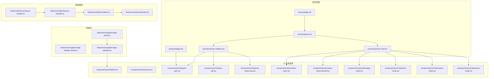
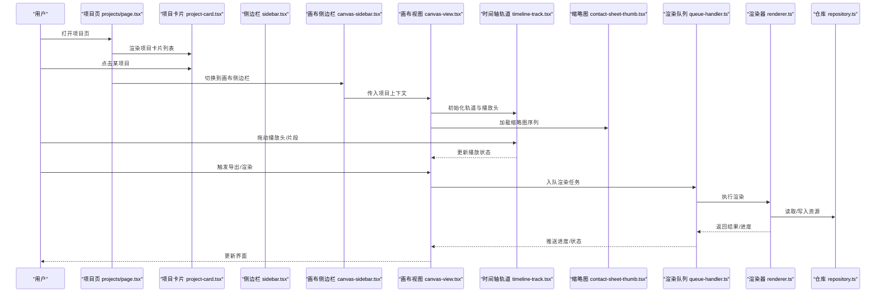
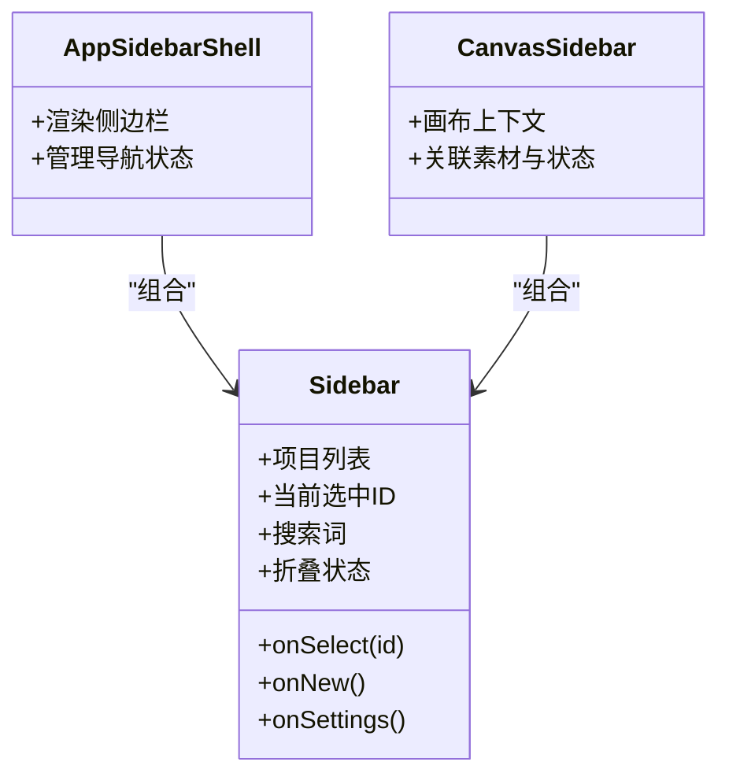
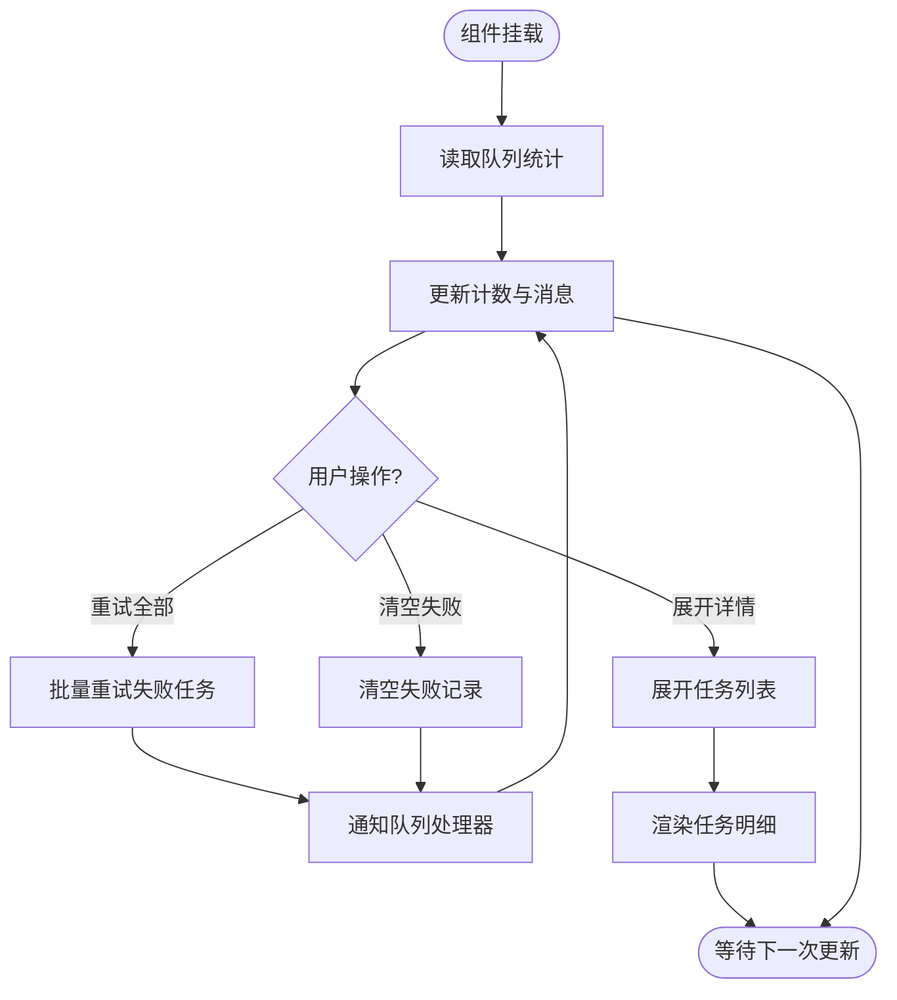
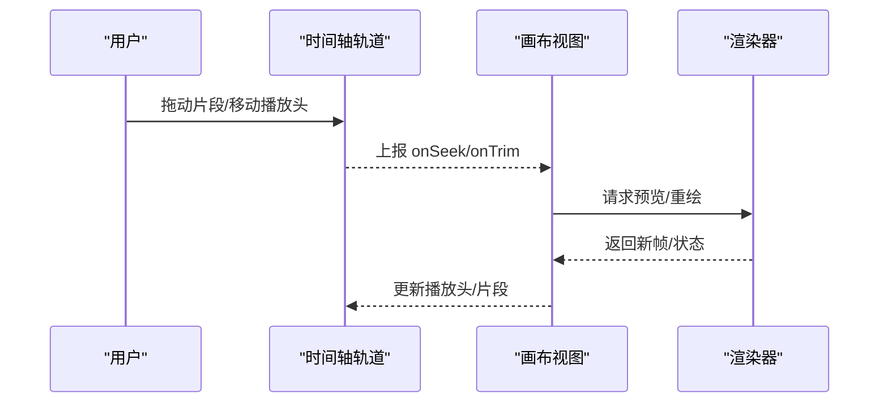
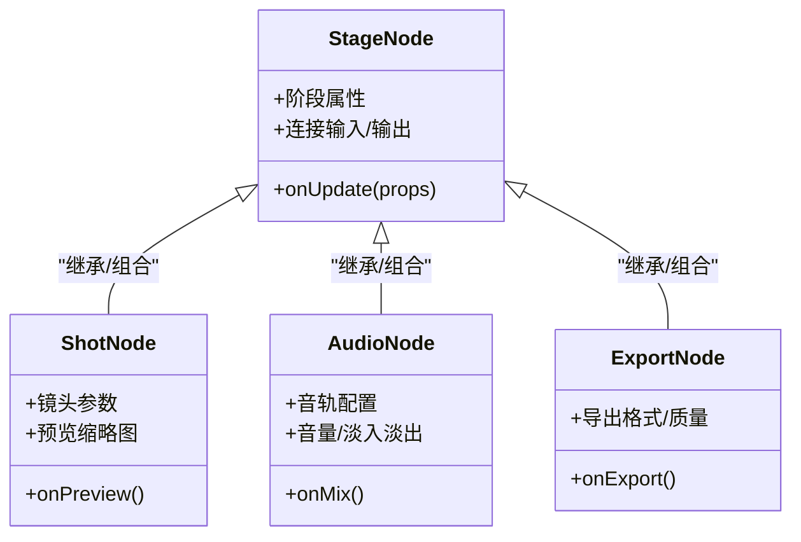
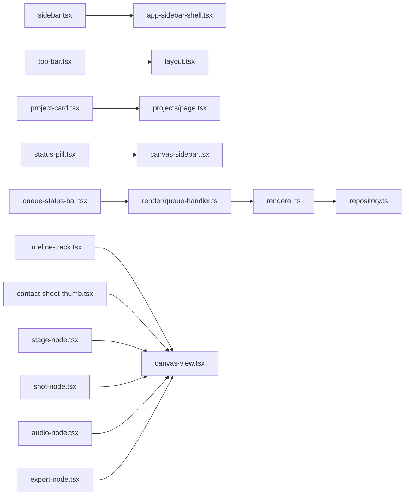

# 业务组件

<cite>
**本文引用的文件**   
- [src/components/ui/sidebar.tsx](file://src/components/ui/sidebar.tsx)
- [src/components/ui/top-bar.tsx](file://src/components/ui/top-bar.tsx)
- [src/components/ui/project-card.tsx](file://src/components/ui/project-card.tsx)
- [src/components/ui/status-pill.tsx](file://src/components/ui/status-pill.tsx)
- [src/components/ui/queue-status-bar.tsx](file://src/components/ui/queue-status-bar.tsx)
- [src/components/ui/timeline-track.tsx](file://src/components/ui/timeline-track.tsx)
- [src/components/ui/contact-sheet-thumb.tsx](file://src/components/ui/contact-sheet-thumb.tsx)
- [src/features/navigation/app-sidebar.tsx](file://src/features/navigation/app-sidebar.tsx)
- [src/features/navigation/app-sidebar-shell.tsx](file://src/features/navigation/app-sidebar-shell.tsx)
- [src/features/navigation/app-shell.tsx](file://src/features/navigation/app-shell.tsx)
- [src/app/canvas/canvas-sidebar.tsx](file://src/app/canvas/canvas-sidebar.tsx)
- [src/app/canvas/canvas-view.tsx](file://src/app/canvas/canvas-view.tsx)
- [src/app/canvas/layout.tsx](file://src/app/canvas/layout.tsx)
- [src/app/canvas/page.tsx](file://src/app/canvas/page.tsx)
- [src/app/projects/page.tsx](file://src/app/projects/page.tsx)
- [src/components/ui/node/stage-node.tsx](file://src/components/ui/node/stage-node.tsx)
- [src/components/ui/node/shot-node.tsx](file://src/components/ui/node/shot-node.tsx)
- [src/components/ui/node/audio-node.tsx](file://src/components/ui/node/audio-node.tsx)
- [src/components/ui/node/export-node.tsx](file://src/components/ui/node/export-node.tsx)
- [src/features/render/renderer.ts](file://src/features/render/renderer.ts)
- [src/features/render/repository.ts](file://src/features/render/repository.ts)
- [src/features/render/queue-handler.ts](file://src/features/render/queue-handler.ts)
- [src/features/director/queue-handler.ts](file://src/features/director/queue-handler.ts)
</cite>

## 目录
1. [简介](#简介)
2. [项目结构](#项目结构)
3. [核心组件](#核心组件)
4. [架构总览](#架构总览)
5. [详细组件分析](#详细组件分析)
6. [依赖分析](#依赖分析)
7. [性能考虑](#性能考虑)
8. [故障排查指南](#故障排查指南)
9. [结论](#结论)
10. [附录](#附录)

## 简介
本文件聚焦 CodeVideoCanvas 的业务相关 UI 组件，包括侧边栏、顶部导航栏、项目卡片、素材标签（状态指示器）、队列状态条、时间轴轨道与缩略图等。文档从业务逻辑、数据绑定、交互行为、集成模式、状态同步机制、复杂场景组合与扩展方法、以及性能优化策略等维度进行系统化说明，帮助开发者快速理解并高效使用这些组件。

## 项目结构
业务组件主要分布在以下位置：
- 通用 UI 层：位于 src/components/ui，提供可复用的业务组件，如侧边栏、顶部导航、项目卡片、状态标签、队列状态条、时间轴轨道、缩略图、节点等。
- 功能特性层：位于 src/features，封装领域能力（渲染、导演工作流、导航壳等），为 UI 提供数据源与行为。
- 应用页面层：位于 src/app，将业务组件组合成完整页面与布局，承载路由与页面级状态。

图表来源
- [src/app/canvas/page.tsx](file://src/app/canvas/page.tsx)
- [src/app/canvas/layout.tsx](file://src/app/canvas/layout.tsx)
- [src/app/canvas/canvas-view.tsx](file://src/app/canvas/canvas-view.tsx)
- [src/app/canvas/canvas-sidebar.tsx](file://src/app/canvas/canvas-sidebar.tsx)
- [src/app/projects/page.tsx](file://src/app/projects/page.tsx)
- [src/features/navigation/app-shell.tsx](file://src/features/navigation/app-shell.tsx)
- [src/features/navigation/app-sidebar-shell.tsx](file://src/features/navigation/app-sidebar-shell.tsx)
- [src/features/navigation/app-sidebar.tsx](file://src/features/navigation/app-sidebar.tsx)
- [src/components/ui/sidebar.tsx](file://src/components/ui/sidebar.tsx)
- [src/components/ui/top-bar.tsx](file://src/components/ui/top-bar.tsx)
- [src/components/ui/project-card.tsx](file://src/components/ui/project-card.tsx)
- [src/components/ui/status-pill.tsx](file://src/components/ui/status-pill.tsx)
- [src/components/ui/queue-status-bar.tsx](file://src/components/ui/queue-status-bar.tsx)
- [src/components/ui/timeline-track.tsx](file://src/components/ui/timeline-track.tsx)
- [src/components/ui/contact-sheet-thumb.tsx](file://src/components/ui/contact-sheet-thumb.tsx)
- [src/components/ui/node/stage-node.tsx](file://src/components/ui/node/stage-node.tsx)
- [src/components/ui/node/shot-node.tsx](file://src/components/ui/node/shot-node.tsx)
- [src/components/ui/node/audio-node.tsx](file://src/components/ui/node/audio-node.tsx)
- [src/components/ui/node/export-node.tsx](file://src/components/ui/node/export-node.tsx)
- [src/features/render/renderer.ts](file://src/features/render/renderer.ts)
- [src/features/render/repository.ts](file://src/features/render/repository.ts)
- [src/features/render/queue-handler.ts](file://src/features/render/queue-handler.ts)
- [src/features/director/queue-handler.ts](file://src/features/director/queue-handler.ts)

章节来源
- [src/app/canvas/page.tsx](file://src/app/canvas/page.tsx)
- [src/app/canvas/layout.tsx](file://src/app/canvas/layout.tsx)
- [src/app/canvas/canvas-view.tsx](file://src/app/canvas/canvas-view.tsx)
- [src/app/canvas/canvas-sidebar.tsx](file://src/app/canvas/canvas-sidebar.tsx)
- [src/app/projects/page.tsx](file://src/app/projects/page.tsx)
- [src/features/navigation/app-shell.tsx](file://src/features/navigation/app-shell.tsx)
- [src/features/navigation/app-sidebar-shell.tsx](file://src/features/navigation/app-sidebar-shell.tsx)
- [src/features/navigation/app-sidebar.tsx](file://src/features/navigation/app-sidebar.tsx)
- [src/components/ui/sidebar.tsx](file://src/components/ui/sidebar.tsx)
- [src/components/ui/top-bar.tsx](file://src/components/ui/top-bar.tsx)
- [src/components/ui/project-card.tsx](file://src/components/ui/project-card.tsx)
- [src/components/ui/status-pill.tsx](file://src/components/ui/status-pill.tsx)
- [src/components/ui/queue-status-bar.tsx](file://src/components/ui/queue-status-bar.tsx)
- [src/components/ui/timeline-track.tsx](file://src/components/ui/timeline-track.tsx)
- [src/components/ui/contact-sheet-thumb.tsx](file://src/components/ui/contact-sheet-thumb.tsx)
- [src/components/ui/node/stage-node.tsx](file://src/components/ui/node/stage-node.tsx)
- [src/components/ui/node/shot-node.tsx](file://src/components/ui/node/shot-node.tsx)
- [src/components/ui/node/audio-node.tsx](file://src/components/ui/node/audio-node.tsx)
- [src/components/ui/node/export-node.tsx](file://src/components/ui/node/export-node.tsx)
- [src/features/render/renderer.ts](file://src/features/render/renderer.ts)
- [src/features/render/repository.ts](file://src/features/render/repository.ts)
- [src/features/render/queue-handler.ts](file://src/features/render/queue-handler.ts)
- [src/features/director/queue-handler.ts](file://src/features/director/queue-handler.ts)

## 核心组件
本节概述各业务组件的职责、典型数据模型与交互约定，便于快速定位与集成。

- 侧边栏（Sidebar）
  - 职责：展示项目列表、导航入口、全局搜索与常用操作；承载“新建项目”、“设置”等入口。
  - 数据绑定：项目列表、当前选中项、搜索过滤条件。
  - 交互：点击切换项目、展开/收起、搜索过滤、右键菜单（如有）。
  - 集成点：由 app-sidebar-shell 或 canvas-sidebar 组合使用。

- 顶部导航栏（Top Bar）
  - 职责：面包屑、标题、全局操作（导出、分享、设置）。
  - 数据绑定：当前页面标题、可用操作集合、用户信息。
  - 交互：跳转、下拉菜单、快捷键响应。

- 项目卡片（Project Card）
  - 职责：以卡片形式展示项目元信息与关键指标（封面、名称、状态、创建时间）。
  - 数据绑定：项目实体、状态枚举、缩略图 URL。
  - 交互：点击进入详情、拖拽排序（可选）、批量选择。

- 素材标签/状态指示器（Status Pill）
  - 职责：统一的状态可视化（待处理、进行中、成功、失败、取消等）。
  - 数据绑定：状态值、辅助文案、是否可重试。
  - 交互：点击查看详情、触发重试（若支持）。

- 队列状态条（Queue Status Bar）
  - 职责：展示渲染/生成任务队列的进度、剩余数量、错误摘要。
  - 数据绑定：队列长度、完成数、失败数、最近错误消息。
  - 交互：展开详情、清空失败、暂停/恢复队列。

- 时间轴轨道（Timeline Track）
  - 职责：在画布中呈现多轨时间线（视频、音频、字幕、特效等），支持播放头移动、片段选择与缩放。
  - 数据绑定：轨道集合、片段区间、播放头位置、缩放级别。
  - 交互：拖拽片段、调整时长、插入/删除、对齐吸附。

- 缩略图（Contact Sheet Thumb）
  - 职责：以网格方式预览帧序列或素材集，支持点击放大与跳转。
  - 数据绑定：图片 URL 列表、选中索引、加载状态。
  - 交互：滚动懒加载、点击选中、双击跳转至对应时间点。

章节来源
- [src/components/ui/sidebar.tsx](file://src/components/ui/sidebar.tsx)
- [src/components/ui/top-bar.tsx](file://src/components/ui/top-bar.tsx)
- [src/components/ui/project-card.tsx](file://src/components/ui/project-card.tsx)
- [src/components/ui/status-pill.tsx](file://src/components/ui/status-pill.tsx)
- [src/components/ui/queue-status-bar.tsx](file://src/components/ui/queue-status-bar.tsx)
- [src/components/ui/timeline-track.tsx](file://src/components/ui/timeline-track.tsx)
- [src/components/ui/contact-sheet-thumb.tsx](file://src/components/ui/contact-sheet-thumb.tsx)

## 架构总览
CodeVideoCanvas 采用“页面-壳-组件-特性服务”的分层组织：
- 页面层负责路由与页面级装配。
- 导航壳负责整体布局与侧边栏/顶栏的挂载。
- UI 业务组件专注展示与交互，通过 props 接收数据与回调。
- 特性服务封装渲染、队列、仓库等能力，为 UI 提供数据与动作。

图表来源
- [src/app/projects/page.tsx](file://src/app/projects/page.tsx)
- [src/components/ui/project-card.tsx](file://src/components/ui/project-card.tsx)
- [src/components/ui/sidebar.tsx](file://src/components/ui/sidebar.tsx)
- [src/app/canvas/canvas-sidebar.tsx](file://src/app/canvas/canvas-sidebar.tsx)
- [src/app/canvas/canvas-view.tsx](file://src/app/canvas/canvas-view.tsx)
- [src/components/ui/timeline-track.tsx](file://src/components/ui/timeline-track.tsx)
- [src/components/ui/contact-sheet-thumb.tsx](file://src/components/ui/contact-sheet-thumb.tsx)
- [src/features/render/queue-handler.ts](file://src/features/render/queue-handler.ts)
- [src/features/render/renderer.ts](file://src/features/render/renderer.ts)
- [src/features/render/repository.ts](file://src/features/render/repository.ts)

## 详细组件分析

### 侧边栏（Sidebar）
- 业务逻辑
  - 维护项目列表、当前选中项、搜索词与折叠状态。
  - 根据权限或角色显示不同入口（如“设置”、“新建项目”）。
- 数据绑定
  - 输入：项目数组、当前项目 ID、搜索词、回调函数（切换、新建、设置）。
  - 输出：事件回调（onSelect、onNew、onSettings）。
- 交互行为
  - 点击项目行高亮并触发 onSelect。
  - 搜索框实时过滤项目列表。
  - 折叠按钮控制面板宽度。
- 集成示例
  - 在 app-sidebar-shell 中注入导航项与项目列表。
  - 在 canvas-sidebar 中结合画布上下文，展示与当前镜头相关的素材与状态。
- 状态同步
  - 通过受控模式（受父组件 state 驱动）保证与全局导航状态一致。
- 扩展建议
  - 增加分组/标签筛选。
  - 支持拖拽重排项目顺序。

图表来源
- [src/components/ui/sidebar.tsx](file://src/components/ui/sidebar.tsx)
- [src/features/navigation/app-sidebar-shell.tsx](file://src/features/navigation/app-sidebar-shell.tsx)
- [src/app/canvas/canvas-sidebar.tsx](file://src/app/canvas/canvas-sidebar.tsx)

章节来源
- [src/components/ui/sidebar.tsx](file://src/components/ui/sidebar.tsx)
- [src/features/navigation/app-sidebar-shell.tsx](file://src/features/navigation/app-sidebar-shell.tsx)
- [src/app/canvas/canvas-sidebar.tsx](file://src/app/canvas/canvas-sidebar.tsx)

### 顶部导航栏（Top Bar）
- 业务逻辑
  - 展示页面标题、面包屑路径与全局操作。
- 数据绑定
  - 输入：标题、操作数组、用户信息。
  - 输出：点击回调（跳转、导出、设置）。
- 交互行为
  - 下拉菜单、快捷键触发、移动端折叠。
- 集成示例
  - 在 layout.tsx 或 page.tsx 中作为页面头部固定区域。
- 状态同步
  - 与路由状态联动，自动更新面包屑。

章节来源
- [src/components/ui/top-bar.tsx](file://src/components/ui/top-bar.tsx)
- [src/app/canvas/layout.tsx](file://src/app/canvas/layout.tsx)

### 项目卡片（Project Card）
- 业务逻辑
  - 展示项目封面、名称、状态、创建时间等元信息。
- 数据绑定
  - 输入：项目对象、点击回调、可选的批量选择状态。
  - 输出：onSelect、onContextMenu。
- 交互行为
  - 点击进入详情、悬停显示操作按钮、支持多选。
- 集成示例
  - 在 projects/page.tsx 中以网格布局渲染多个项目卡片。
- 状态同步
  - 与项目列表状态保持同步，新增/删除后自动刷新。

章节来源
- [src/components/ui/project-card.tsx](file://src/components/ui/project-card.tsx)
- [src/app/projects/page.tsx](file://src/app/projects/page.tsx)

### 素材标签/状态指示器（Status Pill）
- 业务逻辑
  - 将状态枚举映射为颜色与文案，提供“可重试”等语义。
- 数据绑定
  - 输入：状态值、辅助文案、是否可重试。
  - 输出：onClick（用于重试或查看日志）。
- 交互行为
  - 点击弹出详情或触发重试。
- 集成示例
  - 在项目卡片、队列状态条、画布侧边栏中复用。
- 状态同步
  - 当底层状态变化时，自动更新外观与可用性。

章节来源
- [src/components/ui/status-pill.tsx](file://src/components/ui/status-pill.tsx)

### 队列状态条（Queue Status Bar）
- 业务逻辑
  - 聚合渲染/生成任务的队列统计与最近错误。
- 数据绑定
  - 输入：队列长度、完成数、失败数、最近错误消息、操作回调。
  - 输出：onExpand、onRetryAll、onClearFailed。
- 交互行为
  - 展开显示任务明细、一键重试失败、清空失败。
- 集成示例
  - 在画布视图底部常驻，或在侧边栏内按需显示。
- 状态同步
  - 订阅渲染队列处理器的事件，实时更新计数与消息。

图表来源
- [src/components/ui/queue-status-bar.tsx](file://src/components/ui/queue-status-bar.tsx)
- [src/features/render/queue-handler.ts](file://src/features/render/queue-handler.ts)

章节来源
- [src/components/ui/queue-status-bar.tsx](file://src/components/ui/queue-status-bar.tsx)
- [src/features/render/queue-handler.ts](file://src/features/render/queue-handler.ts)

### 时间轴轨道（Timeline Track）
- 业务逻辑
  - 管理多轨时间线，包含片段区间、播放头位置、缩放级别与对齐吸附。
- 数据绑定
  - 输入：轨道集合、片段数据、播放头位置、缩放级别、回调（onSeek、onTrim、onInsert、onDelete）。
  - 输出：事件回调。
- 交互行为
  - 拖拽片段调整时长/位置、点击移动播放头、滚轮缩放、键盘快捷键。
- 集成示例
  - 在 canvas-view 中作为主编辑区的时间轴。
- 状态同步
  - 与画布状态中心同步，确保播放头与片段变更双向一致。

图表来源
- [src/components/ui/timeline-track.tsx](file://src/components/ui/timeline-track.tsx)
- [src/app/canvas/canvas-view.tsx](file://src/app/canvas/canvas-view.tsx)
- [src/features/render/renderer.ts](file://src/features/render/renderer.ts)

章节来源
- [src/components/ui/timeline-track.tsx](file://src/components/ui/timeline-track.tsx)
- [src/app/canvas/canvas-view.tsx](file://src/app/canvas/canvas-view.tsx)
- [src/features/render/renderer.ts](file://src/features/render/renderer.ts)

### 缩略图（Contact Sheet Thumb）
- 业务逻辑
  - 以网格展示帧序列或素材集，支持懒加载与选中跳转。
- 数据绑定
  - 输入：图片 URL 列表、选中索引、加载状态、点击回调。
  - 输出：onSelect(index)、onDoubleClick(index)。
- 交互行为
  - 滚动懒加载、点击选中、双击跳转到对应时间点。
- 集成示例
  - 在画布视图右侧作为帧预览面板。
- 状态同步
  - 与时间轴播放头联动，自动高亮当前帧。

章节来源
- [src/components/ui/contact-sheet-thumb.tsx](file://src/components/ui/contact-sheet-thumb.tsx)
- [src/app/canvas/canvas-view.tsx](file://src/app/canvas/canvas-view.tsx)

### 节点组件（Stage/Shot/Audio/Export Node）
- 业务逻辑
  - 在画布中以节点形式表达阶段、镜头、音频与导出流程，支持连线与参数配置。
- 数据绑定
  - 输入：节点类型、属性、连接关系、事件回调。
  - 输出：onConnect、onDisconnect、onUpdate。
- 交互行为
  - 拖拽放置、连线、参数编辑、批量操作。
- 集成示例
  - 在画布视图中与时间轴协同，形成完整的创作流水线。
- 状态同步
  - 与渲染/导演队列处理器协作，提交任务并监听结果。

图表来源
- [src/components/ui/node/stage-node.tsx](file://src/components/ui/node/stage-node.tsx)
- [src/components/ui/node/shot-node.tsx](file://src/components/ui/node/shot-node.tsx)
- [src/components/ui/node/audio-node.tsx](file://src/components/ui/node/audio-node.tsx)
- [src/components/ui/node/export-node.tsx](file://src/components/ui/node/export-node.tsx)

章节来源
- [src/components/ui/node/stage-node.tsx](file://src/components/ui/node/stage-node.tsx)
- [src/components/ui/node/shot-node.tsx](file://src/components/ui/node/shot-node.tsx)
- [src/components/ui/node/audio-node.tsx](file://src/components/ui/node/audio-node.tsx)
- [src/components/ui/node/export-node.tsx](file://src/components/ui/node/export-node.tsx)

## 依赖分析
- 组件耦合
  - 侧边栏与导航壳强耦合，负责导航与项目选择。
  - 画布视图与时间轴、缩略图、节点组件松耦合，通过回调与状态中心通信。
- 外部依赖
  - 渲染器与仓库提供数据与计算能力。
  - 队列处理器协调渲染与导演工作流的任务调度。
- 潜在循环依赖
  - 避免 UI 直接依赖特性内部实现细节，应通过接口/回调解耦。

图表来源
- [src/components/ui/sidebar.tsx](file://src/components/ui/sidebar.tsx)
- [src/features/navigation/app-sidebar-shell.tsx](file://src/features/navigation/app-sidebar-shell.tsx)
- [src/components/ui/top-bar.tsx](file://src/components/ui/top-bar.tsx)
- [src/app/canvas/layout.tsx](file://src/app/canvas/layout.tsx)
- [src/components/ui/project-card.tsx](file://src/components/ui/project-card.tsx)
- [src/app/projects/page.tsx](file://src/app/projects/page.tsx)
- [src/components/ui/status-pill.tsx](file://src/components/ui/status-pill.tsx)
- [src/app/canvas/canvas-sidebar.tsx](file://src/app/canvas/canvas-sidebar.tsx)
- [src/components/ui/queue-status-bar.tsx](file://src/components/ui/queue-status-bar.tsx)
- [src/features/render/queue-handler.ts](file://src/features/render/queue-handler.ts)
- [src/components/ui/timeline-track.tsx](file://src/components/ui/timeline-track.tsx)
- [src/app/canvas/canvas-view.tsx](file://src/app/canvas/canvas-view.tsx)
- [src/components/ui/contact-sheet-thumb.tsx](file://src/components/ui/contact-sheet-thumb.tsx)
- [src/components/ui/node/stage-node.tsx](file://src/components/ui/node/stage-node.tsx)
- [src/components/ui/node/shot-node.tsx](file://src/components/ui/node/shot-node.tsx)
- [src/components/ui/node/audio-node.tsx](file://src/components/ui/node/audio-node.tsx)
- [src/components/ui/node/export-node.tsx](file://src/components/ui/node/export-node.tsx)
- [src/features/render/renderer.ts](file://src/features/render/renderer.ts)
- [src/features/render/repository.ts](file://src/features/render/repository.ts)

章节来源
- [src/components/ui/sidebar.tsx](file://src/components/ui/sidebar.tsx)
- [src/features/navigation/app-sidebar-shell.tsx](file://src/features/navigation/app-sidebar-shell.tsx)
- [src/components/ui/top-bar.tsx](file://src/components/ui/top-bar.tsx)
- [src/app/canvas/layout.tsx](file://src/app/canvas/layout.tsx)
- [src/components/ui/project-card.tsx](file://src/components/ui/project-card.tsx)
- [src/app/projects/page.tsx](file://src/app/projects/page.tsx)
- [src/components/ui/status-pill.tsx](file://src/components/ui/status-pill.tsx)
- [src/app/canvas/canvas-sidebar.tsx](file://src/app/canvas/canvas-sidebar.tsx)
- [src/components/ui/queue-status-bar.tsx](file://src/components/ui/queue-status-bar.tsx)
- [src/features/render/queue-handler.ts](file://src/features/render/queue-handler.ts)
- [src/components/ui/timeline-track.tsx](file://src/components/ui/timeline-track.tsx)
- [src/app/canvas/canvas-view.tsx](file://src/app/canvas/canvas-view.tsx)
- [src/components/ui/contact-sheet-thumb.tsx](file://src/components/ui/contact-sheet-thumb.tsx)
- [src/components/ui/node/stage-node.tsx](file://src/components/ui/node/stage-node.tsx)
- [src/components/ui/node/shot-node.tsx](file://src/components/ui/node/shot-node.tsx)
- [src/components/ui/node/audio-node.tsx](file://src/components/ui/node/audio-node.tsx)
- [src/components/ui/node/export-node.tsx](file://src/components/ui/node/export-node.tsx)
- [src/features/render/renderer.ts](file://src/features/render/renderer.ts)
- [src/features/render/repository.ts](file://src/features/render/repository.ts)

## 性能考虑
- 列表与网格渲染
  - 对长列表（项目卡片、缩略图）启用虚拟滚动或分页加载，减少首屏渲染压力。
- 图片与媒体资源
  - 缩略图使用懒加载与占位图，按需加载高分辨率资源。
- 状态更新频率
  - 时间轴与队列状态高频更新时，使用节流/防抖合并更新，降低重绘次数。
- 计算密集型任务
  - 将渲染与合成逻辑下沉到特性服务层，UI 仅消费结果，避免阻塞主线程。
- 缓存策略
  - 对频繁访问的项目元数据与缩略图进行本地缓存，提升二次访问速度。
- 组件粒度
  - 将大组件拆分为更小的子组件，配合 React.memo/useMemo/useCallback 减少不必要的重渲染。

[本节为通用性能指导，不直接分析具体文件]

## 故障排查指南
- 常见问题
  - 队列状态条无更新：检查队列处理器是否正确订阅事件与推送进度。
  - 时间轴播放头不同步：确认画布视图与时间轴之间的回调链路是否完整。
  - 缩略图加载失败：检查 URL 有效性、跨域与缓存策略。
  - 项目卡片点击无效：确认路由跳转与页面状态初始化逻辑。
- 调试建议
  - 在关键回调处添加日志，观察数据流向。
  - 使用浏览器性能面板分析重渲染热点。
  - 针对队列任务，查看失败原因与重试策略。

章节来源
- [src/components/ui/queue-status-bar.tsx](file://src/components/ui/queue-status-bar.tsx)
- [src/components/ui/timeline-track.tsx](file://src/components/ui/timeline-track.tsx)
- [src/components/ui/contact-sheet-thumb.tsx](file://src/components/ui/contact-sheet-thumb.tsx)
- [src/components/ui/project-card.tsx](file://src/components/ui/project-card.tsx)

## 结论
CodeVideoCanvas 的业务组件围绕“导航-画布-渲染”的核心链路构建，通过清晰的职责划分与松耦合设计，实现了良好的可扩展性与可维护性。遵循本文档的集成模式与性能策略，可在复杂场景中稳定组合与扩展这些组件，保障用户体验与系统性能。

## 附录
- 术语
  - 画布：指代视频/图像编辑的主工作区。
  - 轨道：时间线上的独立数据通道（视频、音频、字幕等）。
  - 队列：异步任务调度与执行的管理单元。
- 参考页面
  - 画布页面入口：[src/app/canvas/page.tsx](file://src/app/canvas/page.tsx)
  - 项目页面入口：[src/app/projects/page.tsx](file://src/app/projects/page.tsx)
  - 导航壳：[src/features/navigation/app-shell.tsx](file://src/features/navigation/app-shell.tsx)