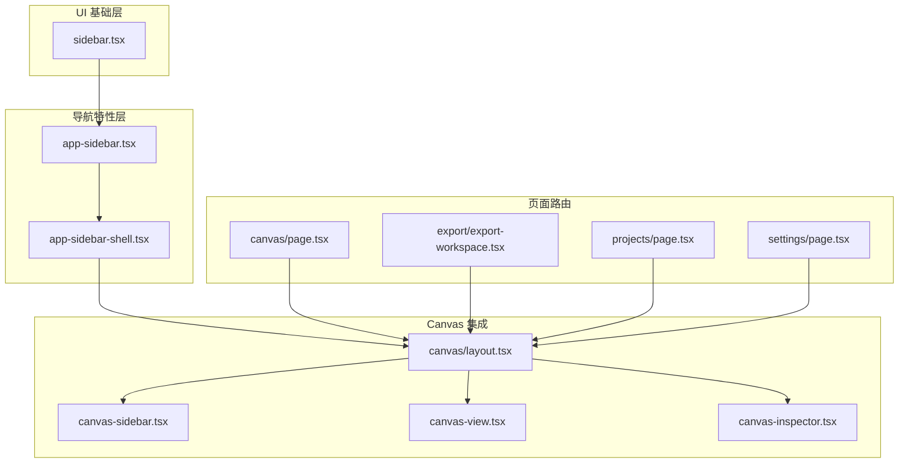
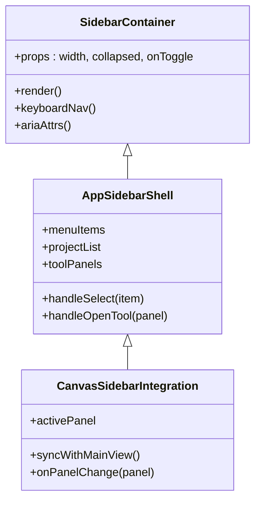
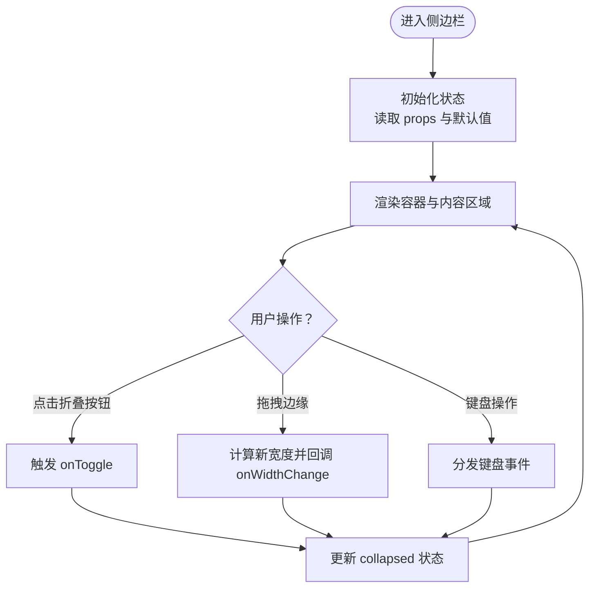
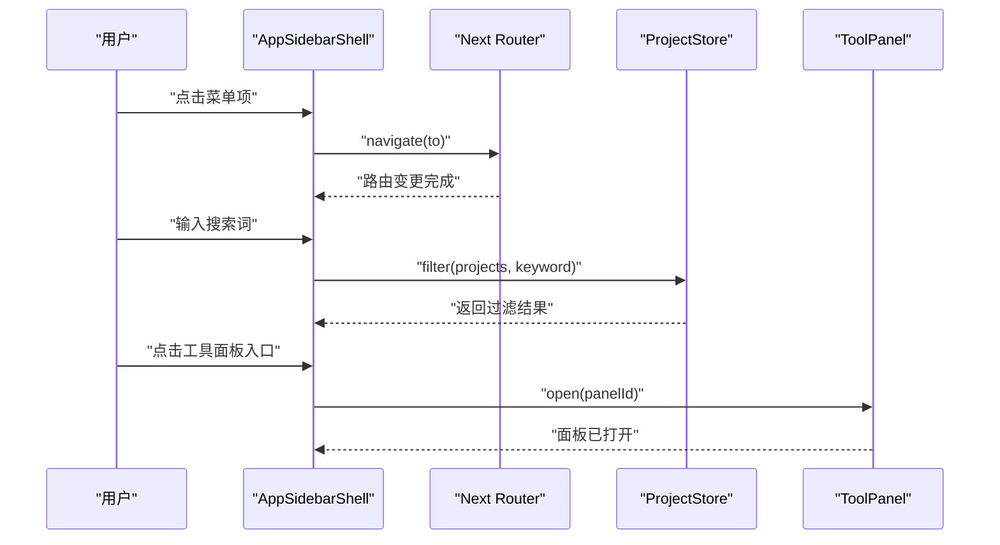
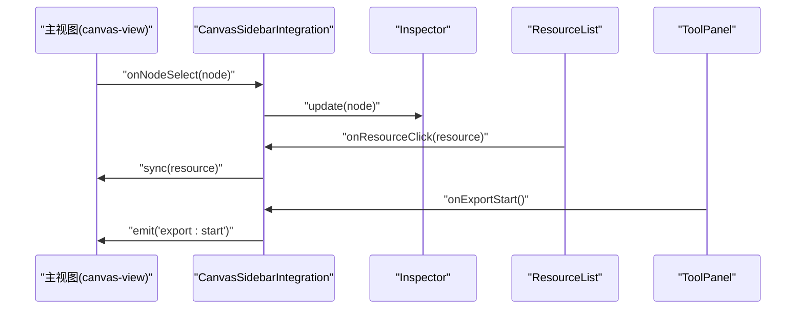
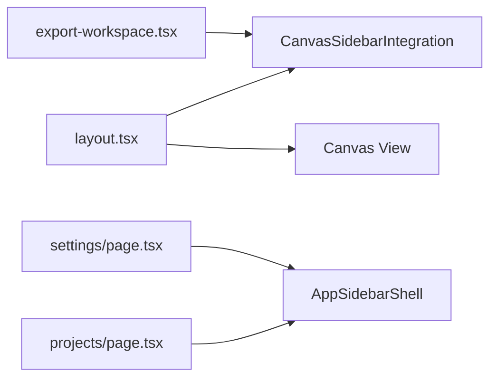
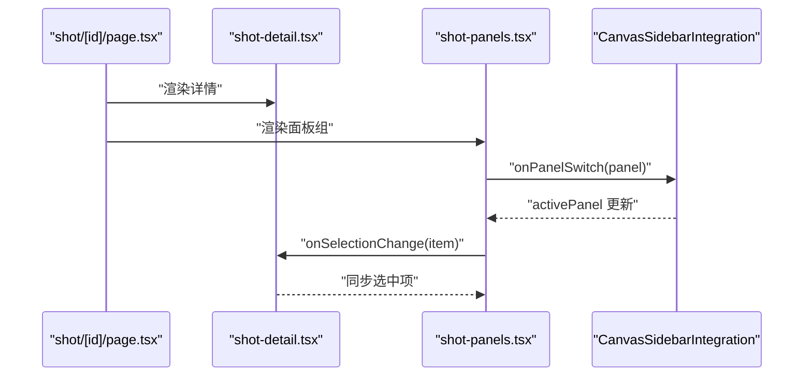
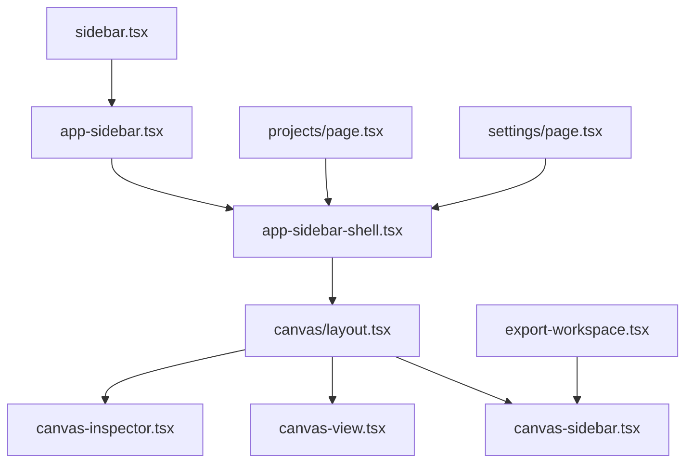

# 侧边栏组件

<cite>
**本文引用的文件**   
- [src/components/ui/sidebar.tsx](file://src/components/ui/sidebar.tsx)
- [src/features/navigation/app-sidebar.tsx](file://src/features/navigation/app-sidebar.tsx)
- [src/features/navigation/app-sidebar-shell.tsx](file://src/features/navigation/app-sidebar-shell.tsx)
- [src/app/canvas/layout.tsx](file://src/app/canvas/layout.tsx)
- [src/app/canvas/canvas-sidebar.tsx](file://src/app/canvas/canvas-sidebar.tsx)
- [src/app/canvas/shot/[id]/page.tsx](file://src/app/canvas/shot/[id]/page.tsx)
- [src/app/canvas/shot/[id]/shot-detail.tsx](file://src/app/canvas/shot/[id]/shot-detail.tsx)
- [src/app/canvas/shot/[id]/shot-panels.tsx](file://src/app/canvas/shot/[id]/shot-panels.tsx)
- [src/app/canvas/canvas-view.tsx](file://src/app/canvas/canvas-view.tsx)
- [src/app/canvas/canvas-inspector.tsx](file://src/app/canvas/canvas-inspector.tsx)
- [src/app/canvas/page.tsx](file://src/app/canvas/page.tsx)
- [src/app/canvas/export/export-workspace.tsx](file://src/app/canvas/export/export-workspace.tsx)
- [src/app/canvas/export/page.tsx](file://src/app/canvas/export/page.tsx)
- [src/app/projects/page.tsx](file://src/app/projects/page.tsx)
- [src/app/settings/page.tsx](file://src/app/settings/page.tsx)
- [src/app/settings/theme-control.tsx](file://src/app/settings/theme-control.tsx)
- [src/app/layout.tsx](file://src/app/layout.tsx)
</cite>

## 目录
1. [简介](#简介)
2. [项目结构](#项目结构)
3. [核心组件](#核心组件)
4. [架构总览](#架构总览)
5. [详细组件分析](#详细组件分析)
6. [依赖关系分析](#依赖关系分析)
7. [性能考量](#性能考量)
8. [故障排查指南](#故障排查指南)
9. [结论](#结论)
10. [附录](#附录)

## 简介
本文件为 CodeVideoCanvas 的“侧边栏组件”提供系统化文档，覆盖业务功能（导航菜单、项目列表、工具面板）、属性配置、状态管理、事件处理与用户交互、与主内容区域的通信机制和数据同步方式、响应式设计与可访问性支持，以及性能优化策略与最佳实践。文档面向不同技术背景的读者，既提供高层概览，也深入到代码级实现细节与可视化图示。

## 项目结构
侧边栏相关代码主要分布在以下位置：
- UI 基础层：通用侧边栏容器与布局能力
- 导航特性层：应用级侧边栏外壳与具体菜单项
- Canvas 页面集成：在画布工作区中嵌入侧边栏并联动主视图
- 导出与设置页：在不同路由下复用侧边栏或独立布局

图表来源
- [src/components/ui/sidebar.tsx](file://src/components/ui/sidebar.tsx)
- [src/features/navigation/app-sidebar.tsx](file://src/features/navigation/app-sidebar.tsx)
- [src/features/navigation/app-sidebar-shell.tsx](file://src/features/navigation/app-sidebar-shell.tsx)
- [src/app/canvas/layout.tsx](file://src/app/canvas/layout.tsx)
- [src/app/canvas/canvas-sidebar.tsx](file://src/app/canvas/canvas-sidebar.tsx)
- [src/app/canvas/canvas-view.tsx](file://src/app/canvas/canvas-view.tsx)
- [src/app/canvas/canvas-inspector.tsx](file://src/app/canvas/canvas-inspector.tsx)
- [src/app/canvas/page.tsx](file://src/app/canvas/page.tsx)
- [src/app/canvas/export/export-workspace.tsx](file://src/app/canvas/export/export-workspace.tsx)
- [src/app/projects/page.tsx](file://src/app/projects/page.tsx)
- [src/app/settings/page.tsx](file://src/app/settings/page.tsx)

章节来源
- [src/components/ui/sidebar.tsx](file://src/components/ui/sidebar.tsx)
- [src/features/navigation/app-sidebar.tsx](file://src/features/navigation/app-sidebar.tsx)
- [src/features/navigation/app-sidebar-shell.tsx](file://src/features/navigation/app-sidebar-shell.tsx)
- [src/app/canvas/layout.tsx](file://src/app/canvas/layout.tsx)
- [src/app/canvas/canvas-sidebar.tsx](file://src/app/canvas/canvas-sidebar.tsx)
- [src/app/canvas/canvas-view.tsx](file://src/app/canvas/canvas-view.tsx)
- [src/app/canvas/canvas-inspector.tsx](file://src/app/canvas/canvas-inspector.tsx)
- [src/app/canvas/page.tsx](file://src/app/canvas/page.tsx)
- [src/app/canvas/export/export-workspace.tsx](file://src/app/canvas/export/export-workspace.tsx)
- [src/app/projects/page.tsx](file://src/app/projects/page.tsx)
- [src/app/settings/page.tsx](file://src/app/settings/page.tsx)

## 核心组件
- 通用侧边栏容器（UI 基础层）
  - 职责：提供侧边栏的基础布局、折叠/展开、宽度控制、可访问性属性等
  - 关键能力：尺寸与定位、键盘导航、ARIA 语义、滚动区域
- 应用侧边栏外壳（导航特性层）
  - 职责：组合导航菜单、项目列表入口、工具面板入口；与路由系统协作
  - 关键能力：菜单分组、选中态、动态渲染、主题适配
- Canvas 侧边栏集成（Canvas 集成层）
  - 职责：在画布工作区中嵌入侧边栏，承载检查器、属性面板、资源列表等
  - 关键能力：与主视图双向通信、面板切换、数据同步

章节来源
- [src/components/ui/sidebar.tsx](file://src/components/ui/sidebar.tsx)
- [src/features/navigation/app-sidebar.tsx](file://src/features/navigation/app-sidebar.tsx)
- [src/features/navigation/app-sidebar-shell.tsx](file://src/features/navigation/app-sidebar-shell.tsx)
- [src/app/canvas/canvas-sidebar.tsx](file://src/app/canvas/canvas-sidebar.tsx)

## 架构总览
侧边栏采用分层设计：UI 基础层提供通用能力，导航特性层负责业务菜单与项目列表，Canvas 集成层将侧边栏与工作区主视图进行编排与通信。

图表来源
- [src/components/ui/sidebar.tsx](file://src/components/ui/sidebar.tsx)
- [src/features/navigation/app-sidebar.tsx](file://src/features/navigation/app-sidebar.tsx)
- [src/features/navigation/app-sidebar-shell.tsx](file://src/features/navigation/app-sidebar-shell.tsx)
- [src/app/canvas/canvas-sidebar.tsx](file://src/app/canvas/canvas-sidebar.tsx)

## 详细组件分析

### 通用侧边栏容器（UI 基础层）
- 属性配置
  - 宽度与折叠：通过 props 控制初始宽度与折叠状态，支持拖拽调整宽度
  - 可访问性：提供 role、aria-expanded、aria-label 等语义化属性
  - 键盘交互：支持 Tab、Enter、Esc 等常用快捷键
- 状态管理
  - 本地状态：collapsed、width、isFocused
  - 受控模式：父组件可通过 props 控制展开/收起与宽度
- 事件处理
  - onToggle：切换折叠状态
  - onWidthChange：宽度变化回调
  - onKeyDown：键盘事件分发
- 用户交互行为
  - 点击遮罩关闭（移动端）
  - 拖拽边缘调整宽度
  - 焦点管理与视觉反馈

图表来源
- [src/components/ui/sidebar.tsx](file://src/components/ui/sidebar.tsx)

章节来源
- [src/components/ui/sidebar.tsx](file://src/components/ui/sidebar.tsx)

### 应用侧边栏外壳（导航特性层）
- 业务功能
  - 导航菜单：按模块分组，支持高亮当前路由
  - 项目列表：展示项目卡片或条目，支持搜索与筛选
  - 工具面板入口：打开导出、设置等工具面板
- 属性配置
  - menuItems：菜单项数组，包含标题、路径、图标、子项
  - projects：项目数据源，支持分页与懒加载
  - theme：主题配置，影响颜色与样式
- 状态管理
  - 路由状态：基于 Next.js 路由获取当前路径
  - 搜索状态：本地搜索词与过滤结果
  - 面板状态：当前激活的工具面板
- 事件处理
  - onSelectItem：选择菜单项后跳转路由
  - onOpenTool：打开指定工具面板
  - onSearchChange：更新搜索词并刷新列表
- 用户交互行为
  - 点击菜单项切换路由
  - 输入框实时过滤项目列表
  - 工具面板切换时保持选中态

图表来源
- [src/features/navigation/app-sidebar.tsx](file://src/features/navigation/app-sidebar.tsx)
- [src/features/navigation/app-sidebar-shell.tsx](file://src/features/navigation/app-sidebar-shell.tsx)

章节来源
- [src/features/navigation/app-sidebar.tsx](file://src/features/navigation/app-sidebar.tsx)
- [src/features/navigation/app-sidebar-shell.tsx](file://src/features/navigation/app-sidebar-shell.tsx)

### Canvas 侧边栏集成（Canvas 集成层）
- 业务功能
  - 检查器面板：显示当前选中节点或资源的属性
  - 资源列表：素材、片段、时间线轨道等
  - 工具面板：导出、设置、队列状态等
- 属性配置
  - activePanel：当前激活的面板标识
  - data：主视图共享的数据模型引用
  - onPanelChange：面板切换回调
- 状态管理
  - 面板状态：activePanel、panelHistory
  - 数据同步：与主视图共享状态，避免重复请求
- 事件处理
  - onNodeSelect：节点选择后更新检查器
  - onResourceClick：资源点击后同步到主视图
  - onExportStart：触发导出流程
- 用户交互行为
  - 面板标签切换
  - 双击资源预览
  - 拖拽资源到时间线

图表来源
- [src/app/canvas/canvas-sidebar.tsx](file://src/app/canvas/canvas-sidebar.tsx)
- [src/app/canvas/canvas-view.tsx](file://src/app/canvas/canvas-view.tsx)
- [src/app/canvas/canvas-inspector.tsx](file://src/app/canvas/canvas-inspector.tsx)

章节来源
- [src/app/canvas/canvas-sidebar.tsx](file://src/app/canvas/canvas-sidebar.tsx)
- [src/app/canvas/canvas-view.tsx](file://src/app/canvas/canvas-view.tsx)
- [src/app/canvas/canvas-inspector.tsx](file://src/app/canvas/canvas-inspector.tsx)

### 页面集成与布局
- Canvas 页面布局
  - 使用 layout.tsx 编排侧边栏与主视图
  - 支持响应式：小屏自动隐藏侧边栏并提供抽屉式入口
- 导出工作区
  - 在 export-workspace.tsx 中复用侧边栏，聚焦导出任务与进度
- 项目与设置页
  - 在 projects/page.tsx 与 settings/page.tsx 中统一使用应用侧边栏外壳

图表来源
- [src/app/canvas/layout.tsx](file://src/app/canvas/layout.tsx)
- [src/app/canvas/canvas-sidebar.tsx](file://src/app/canvas/canvas-sidebar.tsx)
- [src/app/canvas/canvas-view.tsx](file://src/app/canvas/canvas-view.tsx)
- [src/app/canvas/export/export-workspace.tsx](file://src/app/canvas/export/export-workspace.tsx)
- [src/app/projects/page.tsx](file://src/app/projects/page.tsx)
- [src/app/settings/page.tsx](file://src/app/settings/page.tsx)

章节来源
- [src/app/canvas/layout.tsx](file://src/app/canvas/layout.tsx)
- [src/app/canvas/export/export-workspace.tsx](file://src/app/canvas/export/export-workspace.tsx)
- [src/app/projects/page.tsx](file://src/app/projects/page.tsx)
- [src/app/settings/page.tsx](file://src/app/settings/page.tsx)

### 分镜详情与面板
- 分镜详情页
  - shot/[id]/page.tsx 作为路由入口，组装 shot-detail.tsx 与 shot-panels.tsx
  - shot-panels.tsx 组织多个面板（如脚本、资产、预览），并与侧边栏联动
- 与侧边栏的通信
  - 通过回调与共享状态同步选中项与面板切换

图表来源
- [src/app/canvas/shot/[id]/page.tsx](file://src/app/canvas/shot/[id]/page.tsx)
- [src/app/canvas/shot/[id]/shot-detail.tsx](file://src/app/canvas/shot/[id]/shot-detail.tsx)
- [src/app/canvas/shot/[id]/shot-panels.tsx](file://src/app/canvas/shot/[id]/shot-panels.tsx)
- [src/app/canvas/canvas-sidebar.tsx](file://src/app/canvas/canvas-sidebar.tsx)

章节来源
- [src/app/canvas/shot/[id]/page.tsx](file://src/app/canvas/shot/[id]/page.tsx)
- [src/app/canvas/shot/[id]/shot-detail.tsx](file://src/app/canvas/shot/[id]/shot-detail.tsx)
- [src/app/canvas/shot/[id]/shot-panels.tsx](file://src/app/canvas/shot/[id]/shot-panels.tsx)
- [src/app/canvas/canvas-sidebar.tsx](file://src/app/canvas/canvas-sidebar.tsx)

### 主题与全局布局
- 全局布局
  - app/layout.tsx 提供根布局，确保侧边栏在全局一致性与可访问性
- 主题控制
  - settings/theme-control.tsx 提供主题切换，影响侧边栏颜色与对比度

章节来源
- [src/app/layout.tsx](file://src/app/layout.tsx)
- [src/app/settings/theme-control.tsx](file://src/app/settings/theme-control.tsx)

## 依赖关系分析
侧边栏组件之间的依赖关系如下：

图表来源
- [src/components/ui/sidebar.tsx](file://src/components/ui/sidebar.tsx)
- [src/features/navigation/app-sidebar.tsx](file://src/features/navigation/app-sidebar.tsx)
- [src/features/navigation/app-sidebar-shell.tsx](file://src/features/navigation/app-sidebar-shell.tsx)
- [src/app/canvas/layout.tsx](file://src/app/canvas/layout.tsx)
- [src/app/canvas/canvas-sidebar.tsx](file://src/app/canvas/canvas-sidebar.tsx)
- [src/app/canvas/canvas-view.tsx](file://src/app/canvas/canvas-view.tsx)
- [src/app/canvas/canvas-inspector.tsx](file://src/app/canvas/canvas-inspector.tsx)
- [src/app/canvas/export/export-workspace.tsx](file://src/app/canvas/export/export-workspace.tsx)
- [src/app/projects/page.tsx](file://src/app/projects/page.tsx)
- [src/app/settings/page.tsx](file://src/app/settings/page.tsx)

章节来源
- [src/components/ui/sidebar.tsx](file://src/components/ui/sidebar.tsx)
- [src/features/navigation/app-sidebar.tsx](file://src/features/navigation/app-sidebar.tsx)
- [src/features/navigation/app-sidebar-shell.tsx](file://src/features/navigation/app-sidebar-shell.tsx)
- [src/app/canvas/layout.tsx](file://src/app/canvas/layout.tsx)
- [src/app/canvas/canvas-sidebar.tsx](file://src/app/canvas/canvas-sidebar.tsx)
- [src/app/canvas/canvas-view.tsx](file://src/app/canvas/canvas-view.tsx)
- [src/app/canvas/canvas-inspector.tsx](file://src/app/canvas/canvas-inspector.tsx)
- [src/app/canvas/export/export-workspace.tsx](file://src/app/canvas/export/export-workspace.tsx)
- [src/app/projects/page.tsx](file://src/app/projects/page.tsx)
- [src/app/settings/page.tsx](file://src/app/settings/page.tsx)

## 性能考量
- 渲染优化
  - 对大型项目列表使用虚拟滚动或分页加载，减少首屏渲染压力
  - 菜单项与面板内容按需渲染，避免不必要的重绘
- 状态同步
  - 使用受控模式与最小化状态提升，避免深层嵌套导致的频繁更新
  - 对主视图与侧边栏的共享数据采用引用传递与不可变更新
- 交互体验
  - 拖拽宽度时使用节流或 requestAnimationFrame 降低计算频率
  - 键盘导航与焦点管理避免阻塞主线程
- 可访问性
  - 确保所有交互元素具备正确的 aria-* 属性与键盘可达性
  - 在高对比度与缩放模式下验证可读性与可用性

[本节为通用指导，不直接分析具体文件]

## 故障排查指南
- 常见问题
  - 侧边栏无法折叠：检查 onToggle 是否被正确调用与受控状态是否一致
  - 宽度异常：确认拖拽回调 onWidthChange 返回值与边界限制
  - 面板切换无效：核对 activePanel 与 onPanelChange 的绑定
  - 主视图不同步：检查共享数据引用与事件回调链路
- 调试建议
  - 在关键回调处添加日志输出，观察事件流
  - 使用浏览器开发者工具的 React DevTools 检查状态树
  - 针对键盘导航，模拟键盘事件验证焦点顺序

章节来源
- [src/components/ui/sidebar.tsx](file://src/components/ui/sidebar.tsx)
- [src/features/navigation/app-sidebar.tsx](file://src/features/navigation/app-sidebar.tsx)
- [src/features/navigation/app-sidebar-shell.tsx](file://src/features/navigation/app-sidebar-shell.tsx)
- [src/app/canvas/canvas-sidebar.tsx](file://src/app/canvas/canvas-sidebar.tsx)
- [src/app/canvas/canvas-view.tsx](file://src/app/canvas/canvas-view.tsx)

## 结论
侧边栏组件通过分层架构实现了清晰的职责划分与良好的扩展性。UI 基础层提供通用能力，导航特性层承载业务菜单与项目列表，Canvas 集成层则负责与工作区主视图的深度联动。配合响应式设计与可访问性支持，侧边栏能够在多设备与多场景下保持一致的用户体验。遵循本文的性能优化策略与最佳实践，可进一步提升整体应用的流畅度与稳定性。

[本节为总结性内容，不直接分析具体文件]

## 附录
- 使用示例与集成模式
  - 在 Canvas 工作区中嵌入侧边栏：参考 canvas/layout.tsx 与 canvas-sidebar.tsx 的组合方式
  - 在导出工作区中使用侧边栏：参考 export-workspace.tsx 的集成模式
  - 在项目与设置页中使用应用侧边栏外壳：参考 projects/page.tsx 与 settings/page.tsx
- 响应式设计要点
  - 小屏自动隐藏并提供抽屉式入口
  - 根据屏幕宽度动态调整侧边栏宽度与内容密度
- 可访问性清单
  - 所有交互元素具备键盘可达性
  - 提供合适的 aria-* 属性与焦点管理
  - 在高对比度与缩放模式下验证可读性

章节来源
- [src/app/canvas/layout.tsx](file://src/app/canvas/layout.tsx)
- [src/app/canvas/canvas-sidebar.tsx](file://src/app/canvas/canvas-sidebar.tsx)
- [src/app/canvas/export/export-workspace.tsx](file://src/app/canvas/export/export-workspace.tsx)
- [src/app/projects/page.tsx](file://src/app/projects/page.tsx)
- [src/app/settings/page.tsx](file://src/app/settings/page.tsx)