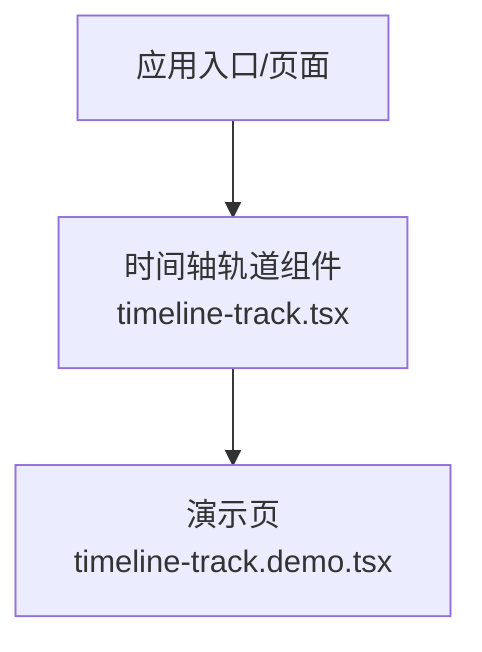
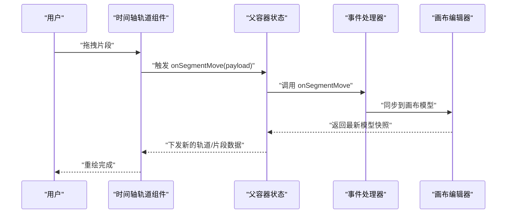
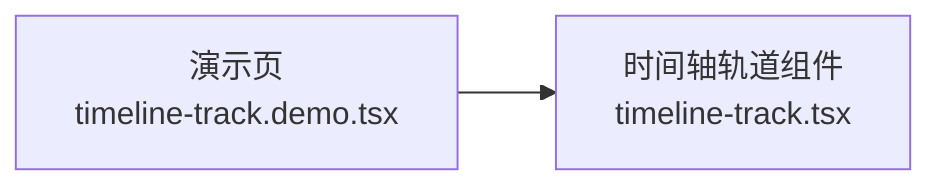

# 时间轴轨道组件

<cite>
**本文引用的文件**   
- [timeline-track.tsx](file://src/components/ui/timeline-track.tsx)
- [timeline-track.demo.tsx](file://src/components/ui/timeline-track.demo.tsx)
</cite>

## 目录
1. [简介](#简介)
2. [项目结构](#项目结构)
3. [核心组件](#核心组件)
4. [架构总览](#架构总览)
5. [详细组件分析](#详细组件分析)
6. [依赖分析](#依赖分析)
7. [性能考虑](#性能考虑)
8. [故障排查指南](#故障排查指南)
9. [结论](#结论)
10. [附录](#附录)

## 简介
本文件为 CodeVideoCanvas 的时间轴轨道组件提供系统化文档，聚焦以下目标：
- 业务功能：视频片段排列、音频轨道管理、关键帧编辑、缩放与平移等。
- 数据绑定与状态管理：组件如何消费外部状态、派发事件、与画布编辑器同步。
- 用户交互：选择、拖拽、对齐吸附、多轨同步操作。
- 集成模式：在项目中如何引入与配置，以及与画布编辑器的关联方式。
- 性能策略：虚拟滚动与大文件处理思路（概念性说明）。

## 项目结构
时间轴轨道相关代码位于 UI 组件层，主要包含：
- 实现文件：时间轴轨道组件
- 演示文件：用于展示基本用法与交互的示例页面



图表来源
- [timeline-track.tsx](file://src/components/ui/timeline-track.tsx)
- [timeline-track.demo.tsx](file://src/components/ui/timeline-track.demo.tsx)

章节来源
- [timeline-track.tsx](file://src/components/ui/timeline-track.tsx)
- [timeline-track.demo.tsx](file://src/components/ui/timeline-track.demo.tsx)

## 核心组件
本节概述时间轴轨道组件的职责边界与对外契约：
- 职责
  - 渲染多条轨道（视频/音频）并显示片段块
  - 支持片段选择、移动、调整时长
  - 提供缩放与平移能力
  - 暴露关键帧编辑入口（若实现）
  - 向父级派发事件以驱动上层状态更新
- 输入输出
  - 输入：轨道列表、当前播放位置、缩放级别、平移偏移、选中项集合、回调函数等
  - 输出：事件（如片段变更、选择变更、视图变换等）

章节来源
- [timeline-track.tsx](file://src/components/ui/timeline-track.tsx)

## 架构总览
时间轴轨道组件作为“视图层”的一部分，通常由上层容器负责：
- 容器：维护时间轴全局状态（轨道数据、选中项、视图变换、播放头位置等）
- 组件：仅负责渲染与交互，通过 props 接收数据，通过回调上报变化
- 画布编辑器：与时间轴共享同一份模型或双向同步，确保片段裁剪、关键帧、轨道顺序等一致

```mermaid
graph TB
subgraph "上层容器"
S["状态源<br/>轨道/选择/视图/播放头"]
H["事件处理器<br/>onXxx 回调"]
end
subgraph "时间轴轨道组件"
T["轨道渲染器"]
I["交互层<br/>选择/拖拽/缩放/平移"]
K["关键帧编辑入口"]
end
subgraph "画布编辑器"
C["画布模型"]
end
S --> T
S --> I
S --> K
T --> H
I --> H
K --> H
H --> S
S < --> C
```

图表来源
- [timeline-track.tsx](file://src/components/ui/timeline-track.tsx)
- [timeline-track.demo.tsx](file://src/components/ui/timeline-track.demo.tsx)

## 详细组件分析

### 组件接口与数据流
- 数据绑定
  - 轨道数据：以数组形式传入，每条轨道包含类型标识、片段集合等
  - 视图状态：缩放级别、水平平移偏移、垂直滚动位置
  - 选择状态：当前选中的片段 ID 集合
  - 播放头：当前时间线指针位置（秒或帧）
- 事件处理
  - 片段变更：新增、删除、移动、调整起止时间
  - 选择变更：单选/多选、取消选择
  - 视图变换：缩放、平移
  - 关键帧：新增、删除、拖动、插值切换
- 用户交互行为
  - 点击选择、Shift/Ctrl 多选
  - 拖拽移动片段、拖拽边缘调整时长
  - 滚轮缩放、鼠标拖拽平移
  - 键盘快捷键（如 Delete 删除、方向键微调）



图表来源
- [timeline-track.tsx](file://src/components/ui/timeline-track.tsx)
- [timeline-track.demo.tsx](file://src/components/ui/timeline-track.demo.tsx)

章节来源
- [timeline-track.tsx](file://src/components/ui/timeline-track.tsx)
- [timeline-track.demo.tsx](file://src/components/ui/timeline-track.demo.tsx)

### 视频片段排列与对齐
- 片段布局
  - 基于时间坐标映射到像素坐标
  - 自动检测重叠并提供冲突提示或阻止非法放置
- 对齐与吸附
  - 吸附到播放头、片段边缘、网格线
  - 可配置的吸附阈值
- 批量操作
  - 多选后整体移动、统一调整时长

章节来源
- [timeline-track.tsx](file://src/components/ui/timeline-track.tsx)

### 音频轨道管理
- 轨道类型区分
  - 视频轨道与音频轨道分别渲染，支持独立显隐与锁定
- 波形可视化（可选）
  - 根据采样率与窗口大小计算可见区域波形
- 静音/淡入淡出（可选）
  - 通过关键帧或属性控制音量曲线

章节来源
- [timeline-track.tsx](file://src/components/ui/timeline-track.tsx)

### 关键帧编辑
- 关键帧数据结构
  - 时间戳、属性名、数值、插值类型
- 编辑行为
  - 添加/删除关键帧、拖动关键帧、切换插值
- 预览与回放
  - 在时间轴上高亮当前关键帧，回放时实时更新属性

章节来源
- [timeline-track.tsx](file://src/components/ui/timeline-track.tsx)

### 缩放与平移
- 缩放
  - 以鼠标位置为中心进行缩放，保持视觉连续性
- 平移
  - 按住鼠标拖拽或中键拖拽实现水平平移
- 边界约束
  - 限制最小/最大缩放级别，防止过度放大/缩小

章节来源
- [timeline-track.tsx](file://src/components/ui/timeline-track.tsx)

### 多轨道同步与精确选择
- 多轨道同步
  - 跨轨道同时移动/调整时长
  - 播放头在所有轨道间保持一致
- 精确选择
  - 框选区域选择片段
  - 按名称/ID 快速定位片段

章节来源
- [timeline-track.tsx](file://src/components/ui/timeline-track.tsx)

### 与画布编辑器的关联与数据同步
- 数据源
  - 时间轴与画布共享同一份片段/轨道模型
- 同步策略
  - 单向：时间轴变更 -> 画布模型更新
  - 双向：画布模型变更 -> 时间轴刷新
- 一致性保障
  - 使用不可变更新与版本号/时间戳避免竞态

章节来源
- [timeline-track.tsx](file://src/components/ui/timeline-track.tsx)
- [timeline-track.demo.tsx](file://src/components/ui/timeline-track.demo.tsx)

### 实际使用示例与集成模式
- 基础集成
  - 在页面中引入组件，传入轨道数据与回调
- 演示参考
  - 查看演示文件了解典型 props 组合与事件处理流程

章节来源
- [timeline-track.demo.tsx](file://src/components/ui/timeline-track.demo.tsx)

## 依赖分析
- 内部依赖
  - 组件自身状态（本地临时状态，如拖拽中标志、选择集）
  - 父容器提供的数据与回调
- 外部依赖
  - 无重型第三方库依赖（具体以源码为准）



图表来源
- [timeline-track.tsx](file://src/components/ui/timeline-track.tsx)
- [timeline-track.demo.tsx](file://src/components/ui/timeline-track.demo.tsx)

章节来源
- [timeline-track.tsx](file://src/components/ui/timeline-track.tsx)
- [timeline-track.demo.tsx](file://src/components/ui/timeline-track.demo.tsx)

## 性能考虑
以下为通用优化建议（概念性说明），可根据实际实现进一步细化：
- 虚拟滚动
  - 仅渲染可视区域内的轨道与片段，按需加载
- 大文件处理
  - 分块读取与懒加载波形/缩略图
  - 使用 Web Worker 进行离线计算（如波形生成）
- 渲染优化
  - 减少不必要的重渲染，合并状态更新
  - 对长列表使用稳定 key，避免 DOM 抖动
- 交互优化
  - 防抖/节流缩放与平移
  - 增量更新而非全量重建

[本节为通用指导，不直接分析具体文件]

## 故障排查指南
- 常见问题
  - 片段无法选中：检查选择状态是否被外部覆盖
  - 拖拽无效：确认事件冒泡与捕获设置
  - 缩放异常：校验缩放中心点与边界约束
  - 关键帧不生效：核对属性路径与插值类型
- 调试建议
  - 打印事件载荷，验证数据流向
  - 使用演示页逐步替换数据，定位问题范围

章节来源
- [timeline-track.tsx](file://src/components/ui/timeline-track.tsx)
- [timeline-track.demo.tsx](file://src/components/ui/timeline-track.demo.tsx)

## 结论
时间轴轨道组件在 CodeVideoCanvas 中承担“时间维度”的可视化与交互职责。通过清晰的数据绑定与事件机制，它与画布编辑器形成稳定的双向同步关系。结合虚拟滚动与分块加载等策略，可在复杂工程下保持良好的交互体验与性能表现。

[本节为总结性内容，不直接分析具体文件]

## 附录
- 术语
  - 片段：时间轴上的一个媒体单元，具有起止时间与所属轨道
  - 轨道：承载片段的线性序列，分为视频轨道与音频轨道
  - 关键帧：描述属性随时间变化的离散标记点
  - 播放头：指示当前时间位置的指针
- 扩展建议
  - 增加右键菜单与上下文操作
  - 支持撤销/重做历史栈
  - 提供更丰富的对齐与吸附规则

[本节为补充信息，不直接分析具体文件]