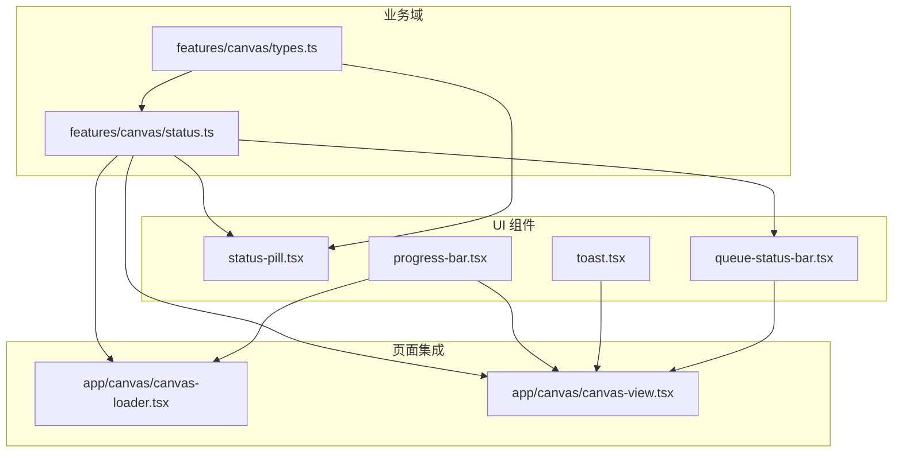
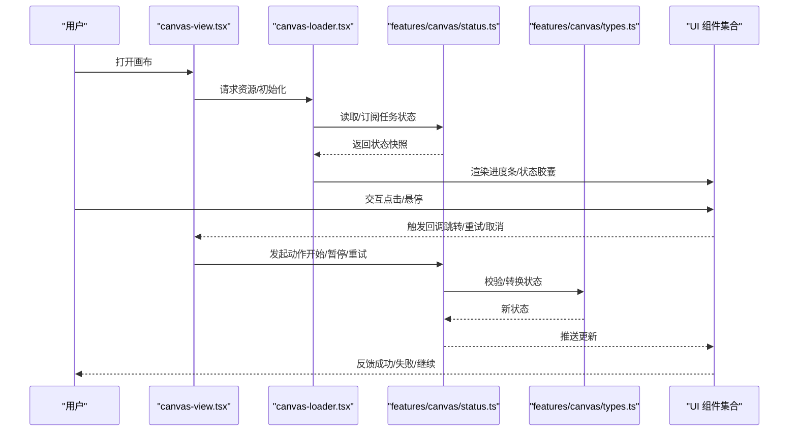
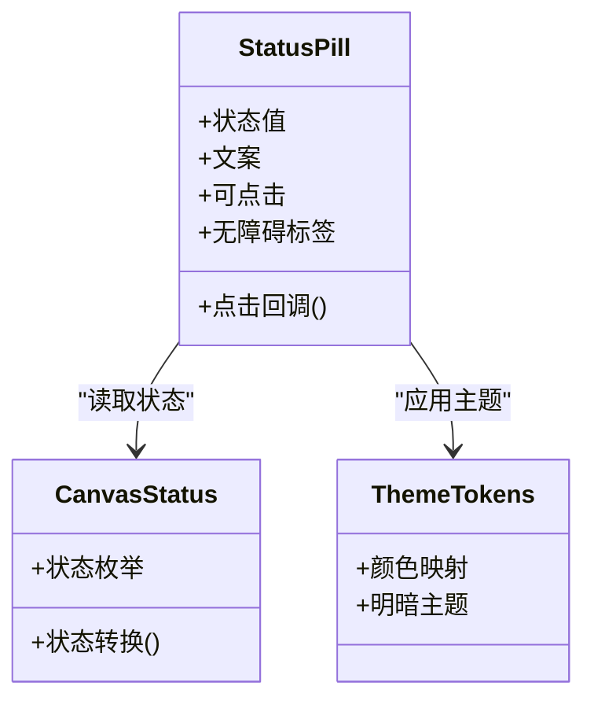
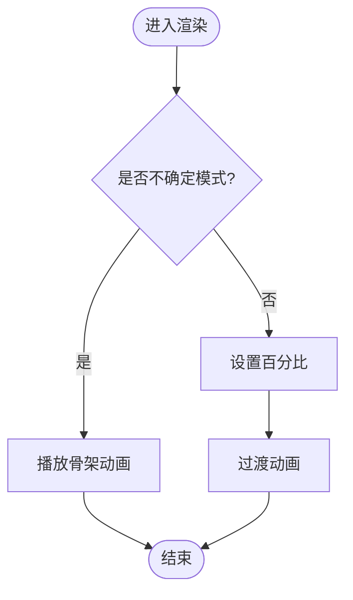
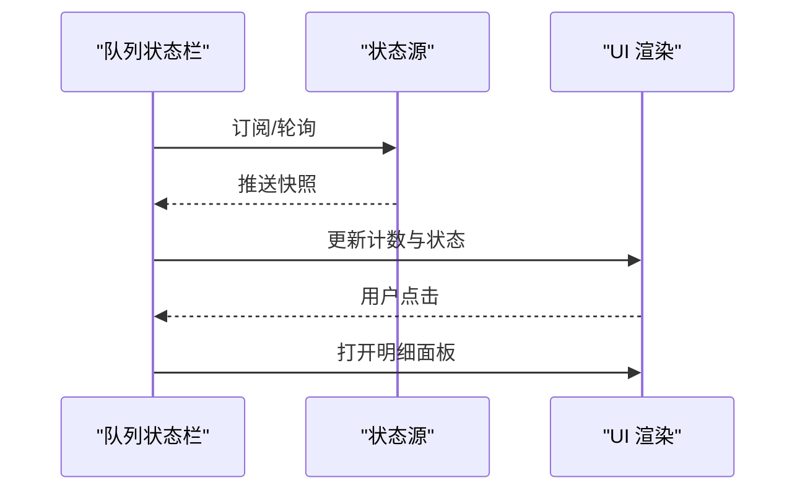
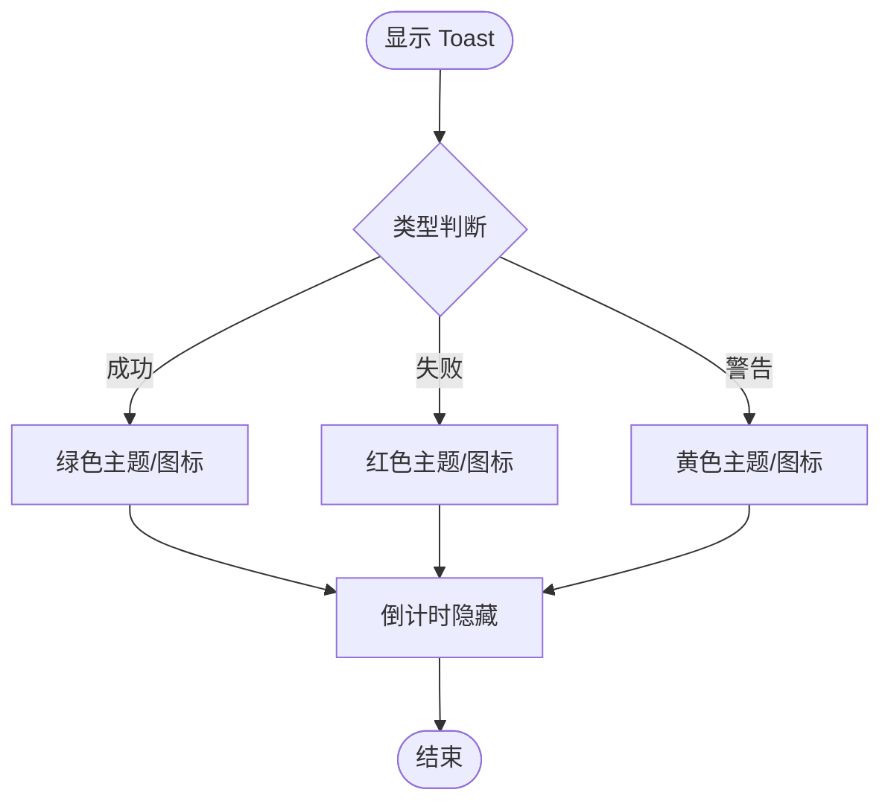
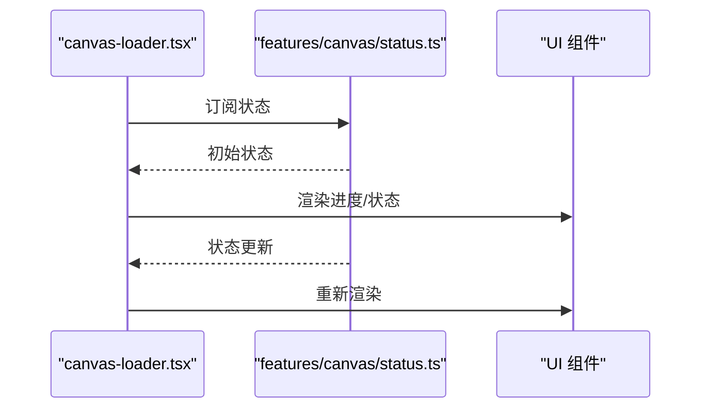
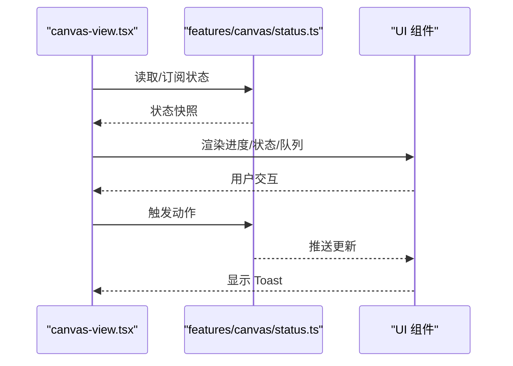
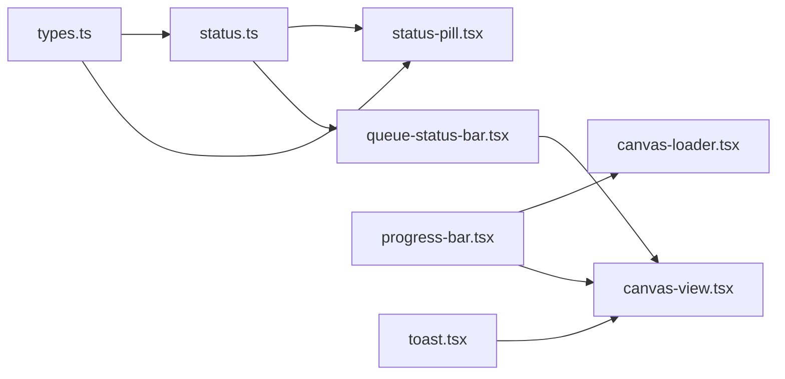

# 状态指示器组件

<cite>
**本文引用的文件**   
- [src/components/ui/status-pill.tsx](file://src/components/ui/status-pill.tsx)
- [src/components/ui/progress-bar.tsx](file://src/components/ui/progress-bar.tsx)
- [src/components/ui/toast.tsx](file://src/components/ui/toast.tsx)
- [src/components/ui/queue-status-bar.tsx](file://src/components/ui/queue-status-bar.tsx)
- [src/features/canvas/status.ts](file://src/features/canvas/status.ts)
- [src/features/canvas/types.ts](file://src/features/canvas/types.ts)
- [src/app/canvas/canvas-loader.tsx](file://src/app/canvas/canvas-loader.tsx)
- [src/app/canvas/canvas-view.tsx](file://src/app/canvas/canvas-view.tsx)
</cite>

## 目录
1. [简介](#简介)
2. [项目结构](#项目结构)
3. [核心组件](#核心组件)
4. [架构总览](#架构总览)
5. [详细组件分析](#详细组件分析)
6. [依赖关系分析](#依赖关系分析)
7. [性能考虑](#性能考虑)
8. [故障排查指南](#故障排查指南)
9. [结论](#结论)
10. [附录](#附录)

## 简介
本文件为 CodeVideoCanvas 的状态指示器组件提供系统化文档，覆盖任务状态显示、进度反馈、错误提示与成功确认等核心业务逻辑。文档同时说明组件的属性配置、状态管理、动画效果与用户交互行为，并提供集成示例、自定义状态类型与样式主题支持、无障碍访问与国际化策略，以及状态同步机制与业务流程关联方式。

## 项目结构
状态指示器相关代码主要分布在以下位置：
- UI 层：通用状态展示组件（状态胶囊、进度条、队列状态栏、Toast）
- 业务域：画布任务状态定义与转换
- 页面集成：画布加载与视图中的状态消费与联动

图表来源
- [src/components/ui/status-pill.tsx](file://src/components/ui/status-pill.tsx)
- [src/components/ui/progress-bar.tsx](file://src/components/ui/progress-bar.tsx)
- [src/components/ui/queue-status-bar.tsx](file://src/components/ui/queue-status-bar.tsx)
- [src/components/ui/toast.tsx](file://src/components/ui/toast.tsx)
- [src/features/canvas/status.ts](file://src/features/canvas/status.ts)
- [src/features/canvas/types.ts](file://src/features/canvas/types.ts)
- [src/app/canvas/canvas-loader.tsx](file://src/app/canvas/canvas-loader.tsx)
- [src/app/canvas/canvas-view.tsx](file://src/app/canvas/canvas-view.tsx)

章节来源
- [src/components/ui/status-pill.tsx](file://src/components/ui/status-pill.tsx)
- [src/components/ui/progress-bar.tsx](file://src/components/ui/progress-bar.tsx)
- [src/components/ui/queue-status-bar.tsx](file://src/components/ui/queue-status-bar.tsx)
- [src/components/ui/toast.tsx](file://src/components/ui/toast.tsx)
- [src/features/canvas/status.ts](file://src/features/canvas/status.ts)
- [src/features/canvas/types.ts](file://src/features/canvas/types.ts)
- [src/app/canvas/canvas-loader.tsx](file://src/app/canvas/canvas-loader.tsx)
- [src/app/canvas/canvas-view.tsx](file://src/app/canvas/canvas-view.tsx)

## 核心组件
- 状态胶囊（Status Pill）
  - 职责：以紧凑形式展示任务或实体的当前状态，如“进行中”“完成”“失败”等，并附带语义化图标与颜色。
  - 关键属性：状态值、可选文案、是否可点击、无障碍标签。
  - 交互：点击可触发详情弹窗或导航到状态页；悬停显示辅助信息。
  - 无障碍：通过 aria-label 与 role 暴露状态语义。
  - 主题：基于设计令牌的颜色映射，支持明暗主题切换。

- 进度条（Progress Bar）
  - 职责：可视化渲染任务执行进度，支持确定性与不确定性两种模式。
  - 关键属性：百分比、是否不确定、动画时长、尺寸、可读文本。
  - 动画：平滑过渡与骨架式不确定动画。
  - 无障碍：aria-valuenow、aria-valuemin、aria-valuemax、aria-label。

- 队列状态栏（Queue Status Bar）
  - 职责：聚合展示队列中任务的总体状态与概览，如排队数量、运行中、已完成、失败数。
  - 关键属性：队列快照、刷新间隔、点击跳转回调。
  - 交互：点击展开明细列表或跳转到任务管理页。
  - 更新：与后端或本地状态源轮询或事件驱动同步。

- Toast 通知
  - 职责：短时提示操作结果（成功、失败、警告），不阻塞主流程。
  - 关键属性：消息内容、类型、持续时间、关闭回调。
  - 交互：自动消失、手动关闭、重试入口。
  - 无障碍：role="alert" 或 role="status"，配合 live region 播报。

章节来源
- [src/components/ui/status-pill.tsx](file://src/components/ui/status-pill.tsx)
- [src/components/ui/progress-bar.tsx](file://src/components/ui/progress-bar.tsx)
- [src/components/ui/queue-status-bar.tsx](file://src/components/ui/queue-status-bar.tsx)
- [src/components/ui/toast.tsx](file://src/components/ui/toast.tsx)

## 架构总览
状态指示器在整体架构中承担“将业务状态转化为可感知界面”的职责，其数据流从业务域的类型与状态转换函数出发，经由 UI 组件渲染，并在页面层进行组合与交互。

图表来源
- [src/app/canvas/canvas-view.tsx](file://src/app/canvas/canvas-view.tsx)
- [src/app/canvas/canvas-loader.tsx](file://src/app/canvas/canvas-loader.tsx)
- [src/features/canvas/status.ts](file://src/features/canvas/status.ts)
- [src/features/canvas/types.ts](file://src/features/canvas/types.ts)
- [src/components/ui/status-pill.tsx](file://src/components/ui/status-pill.tsx)
- [src/components/ui/progress-bar.tsx](file://src/components/ui/progress-bar.tsx)
- [src/components/ui/queue-status-bar.tsx](file://src/components/ui/queue-status-bar.tsx)
- [src/components/ui/toast.tsx](file://src/components/ui/toast.tsx)

## 详细组件分析

### 状态胶囊（Status Pill）
- 业务功能
  - 显示任务或实体的当前状态，如“等待”“进行中”“完成”“失败”。
  - 提供快速识别与轻量交互入口。
- 属性配置
  - 状态值：来自业务域枚举或字符串。
  - 文案：可选，用于覆盖默认翻译。
  - 可点击：控制是否响应点击事件。
  - 无障碍标签：供屏幕阅读器读取。
- 状态管理
  - 由上层传入状态值，内部仅负责渲染与交互。
  - 可与全局状态或局部状态绑定，实现实时更新。
- 动画效果
  - 进入/退出淡入淡出。
  - 状态变化时的颜色过渡。
- 用户交互
  - 点击可打开详情、重试或跳转。
  - 悬停显示辅助信息（如错误原因）。
- 主题与样式
  - 基于设计令牌的颜色映射，支持明暗主题。
  - 可通过 className 或样式变量扩展。
- 无障碍与国际化
  - 使用 aria-* 属性描述状态。
  - 文案支持 i18n 键值替换。

图表来源
- [src/components/ui/status-pill.tsx](file://src/components/ui/status-pill.tsx)
- [src/features/canvas/status.ts](file://src/features/canvas/status.ts)
- [src/features/canvas/types.ts](file://src/features/canvas/types.ts)

章节来源
- [src/components/ui/status-pill.tsx](file://src/components/ui/status-pill.tsx)
- [src/features/canvas/status.ts](file://src/features/canvas/status.ts)
- [src/features/canvas/types.ts](file://src/features/canvas/types.ts)

### 进度条（Progress Bar）
- 业务功能
  - 展示任务执行的确定性进度或不确定性等待。
- 属性配置
  - 百分比：0-100。
  - 不确定模式：无具体数值时的骨架动画。
  - 尺寸与可读文本：适配不同布局与无障碍需求。
- 状态管理
  - 由上层驱动更新，内部保持最小状态。
- 动画效果
  - 平滑过渡与循环骨架动画。
- 用户交互
  - 通常只读，但可结合 Tooltip 展示详细信息。
- 无障碍与国际化
  - 使用 aria-valuenow/min/max 与 aria-label。
  - 文案支持 i18n。

图表来源
- [src/components/ui/progress-bar.tsx](file://src/components/ui/progress-bar.tsx)

章节来源
- [src/components/ui/progress-bar.tsx](file://src/components/ui/progress-bar.tsx)

### 队列状态栏（Queue Status Bar）
- 业务功能
  - 汇总队列任务的整体状态，便于用户快速了解系统负载与任务分布。
- 属性配置
  - 队列快照：包含各状态计数与时间戳。
  - 刷新间隔：定时拉取或事件驱动更新。
  - 点击回调：跳转到任务列表或详情页。
- 状态管理
  - 与后端或本地状态源同步，支持增量更新。
- 用户交互
  - 点击展开明细、筛选与排序。
- 无障碍与国际化
  - 使用 role="status" 与 aria-live 播报变更。
  - 文案支持 i18n。

图表来源
- [src/components/ui/queue-status-bar.tsx](file://src/components/ui/queue-status-bar.tsx)

章节来源
- [src/components/ui/queue-status-bar.tsx](file://src/components/ui/queue-status-bar.tsx)

### Toast 通知
- 业务功能
  - 短时提示操作结果，提升用户反馈效率。
- 属性配置
  - 消息内容、类型（成功/失败/警告）、持续时间、关闭回调。
- 状态管理
  - 集中式队列管理，避免重复与冲突。
- 用户交互
  - 自动消失、手动关闭、重试入口。
- 无障碍与国际化
  - role="alert"/"status"，配合 live region。
  - 文案支持 i18n。

图表来源
- [src/components/ui/toast.tsx](file://src/components/ui/toast.tsx)

章节来源
- [src/components/ui/toast.tsx](file://src/components/ui/toast.tsx)

### 画布加载器（Canvas Loader）
- 职责
  - 在画布初始化阶段协调资源加载、状态订阅与 UI 渲染。
- 与状态指示器的协作
  - 根据任务状态渲染进度条与状态胶囊。
  - 在错误时触发 Toast 提示。
- 状态同步
  - 订阅业务状态变化，确保 UI 实时一致。

图表来源
- [src/app/canvas/canvas-loader.tsx](file://src/app/canvas/canvas-loader.tsx)
- [src/features/canvas/status.ts](file://src/features/canvas/status.ts)
- [src/components/ui/progress-bar.tsx](file://src/components/ui/progress-bar.tsx)
- [src/components/ui/status-pill.tsx](file://src/components/ui/status-pill.tsx)

章节来源
- [src/app/canvas/canvas-loader.tsx](file://src/app/canvas/canvas-loader.tsx)

### 画布视图（Canvas View）
- 职责
  - 组合多个 UI 组件，呈现完整的画布工作区。
- 与状态指示器的协作
  - 消费任务状态，驱动进度条、状态胶囊与队列状态栏的显示。
  - 处理用户交互，触发重试、取消等操作。
- 错误与成功反馈
  - 通过 Toast 提示错误与成功结果。

图表来源
- [src/app/canvas/canvas-view.tsx](file://src/app/canvas/canvas-view.tsx)
- [src/features/canvas/status.ts](file://src/features/canvas/status.ts)
- [src/components/ui/progress-bar.tsx](file://src/components/ui/progress-bar.tsx)
- [src/components/ui/status-pill.tsx](file://src/components/ui/status-pill.tsx)
- [src/components/ui/queue-status-bar.tsx](file://src/components/ui/queue-status-bar.tsx)
- [src/components/ui/toast.tsx](file://src/components/ui/toast.tsx)

章节来源
- [src/app/canvas/canvas-view.tsx](file://src/app/canvas/canvas-view.tsx)

## 依赖关系分析
- 组件耦合
  - UI 组件低耦合，仅依赖业务状态类型与转换函数。
  - 页面层负责组合与交互，避免在 UI 组件内引入复杂逻辑。
- 外部依赖
  - 设计令牌与主题系统。
  - 国际化库（若存在）。
- 潜在循环依赖
  - 通过类型与状态模块解耦，避免 UI 与业务直接互相引用。

图表来源
- [src/features/canvas/types.ts](file://src/features/canvas/types.ts)
- [src/features/canvas/status.ts](file://src/features/canvas/status.ts)
- [src/components/ui/status-pill.tsx](file://src/components/ui/status-pill.tsx)
- [src/components/ui/queue-status-bar.tsx](file://src/components/ui/queue-status-bar.tsx)
- [src/components/ui/progress-bar.tsx](file://src/components/ui/progress-bar.tsx)
- [src/app/canvas/canvas-loader.tsx](file://src/app/canvas/canvas-loader.tsx)
- [src/app/canvas/canvas-view.tsx](file://src/app/canvas/canvas-view.tsx)
- [src/components/ui/toast.tsx](file://src/components/ui/toast.tsx)

章节来源
- [src/features/canvas/types.ts](file://src/features/canvas/types.ts)
- [src/features/canvas/status.ts](file://src/features/canvas/status.ts)
- [src/components/ui/status-pill.tsx](file://src/components/ui/status-pill.tsx)
- [src/components/ui/queue-status-bar.tsx](file://src/components/ui/queue-status-bar.tsx)
- [src/components/ui/progress-bar.tsx](file://src/components/ui/progress-bar.tsx)
- [src/app/canvas/canvas-loader.tsx](file://src/app/canvas/canvas-loader.tsx)
- [src/app/canvas/canvas-view.tsx](file://src/app/canvas/canvas-view.tsx)
- [src/components/ui/toast.tsx](file://src/components/ui/toast.tsx)

## 性能考虑
- 减少重渲染
  - 将状态切片与选择器结合，仅在相关状态变化时更新。
  - 对进度条与状态胶囊使用 memoization 或受控更新。
- 动画优化
  - 使用 CSS transform 与 opacity 进行硬件加速。
  - 不确定模式下限制动画帧率。
- 网络与状态同步
  - 队列状态栏采用增量更新与去抖策略，避免频繁刷新。
  - 错误重试与退避策略，防止雪崩。

[本节为通用指导，无需源码引用]

## 故障排查指南
- 常见问题
  - 状态未更新：检查订阅是否正确、状态源是否推送、组件是否被正确包裹在状态提供者中。
  - 进度条卡住：确认百分比边界与不确定模式切换逻辑。
  - Toast 不显示：检查队列是否被清空、生命周期是否被提前卸载。
  - 无障碍问题：验证 aria-* 属性与 live region 是否生效。
- 调试建议
  - 在状态转换处添加日志，观察状态流转。
  - 使用浏览器开发者工具检查 DOM 属性与 ARIA 状态。
  - 模拟异常路径，验证错误提示与恢复流程。

章节来源
- [src/components/ui/progress-bar.tsx](file://src/components/ui/progress-bar.tsx)
- [src/components/ui/toast.tsx](file://src/components/ui/toast.tsx)
- [src/components/ui/queue-status-bar.tsx](file://src/components/ui/queue-status-bar.tsx)
- [src/components/ui/status-pill.tsx](file://src/components/ui/status-pill.tsx)

## 结论
状态指示器组件通过清晰的职责划分与低耦合设计，将业务状态高效地转化为直观的用户反馈。借助类型与状态转换函数，组件具备良好的可扩展性，支持自定义状态类型与主题。结合无障碍与国际化能力，可在多语言与多设备环境下保持一致体验。建议在项目中统一使用这些组件，以确保一致的视觉与交互标准。

[本节为总结，无需源码引用]

## 附录
- 集成示例（步骤）
  - 在页面中订阅任务状态。
  - 根据状态渲染进度条与状态胶囊。
  - 在错误时调用 Toast 提示。
  - 在队列状态栏中展示总体情况。
- 自定义状态类型
  - 扩展类型定义，新增状态枚举。
  - 在状态转换函数中增加对应分支。
  - 在 UI 组件中补充颜色与文案映射。
- 样式主题
  - 基于设计令牌调整颜色与尺寸。
  - 支持明暗主题切换。
- 无障碍与国际化
  - 为所有状态元素添加 aria-* 属性。
  - 使用 i18n 键值替换文案。

[本节为概念性内容，无需源码引用]