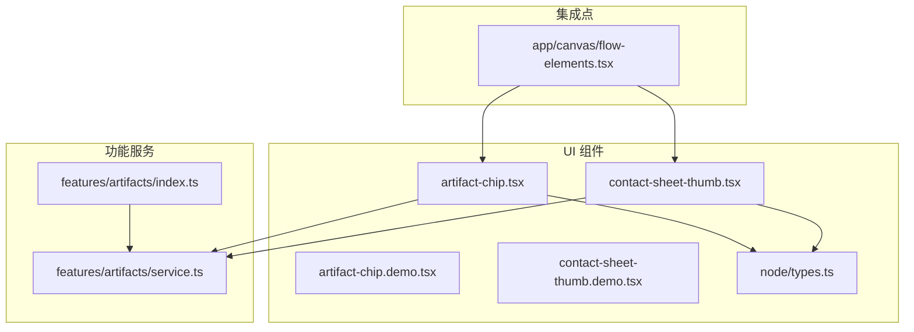
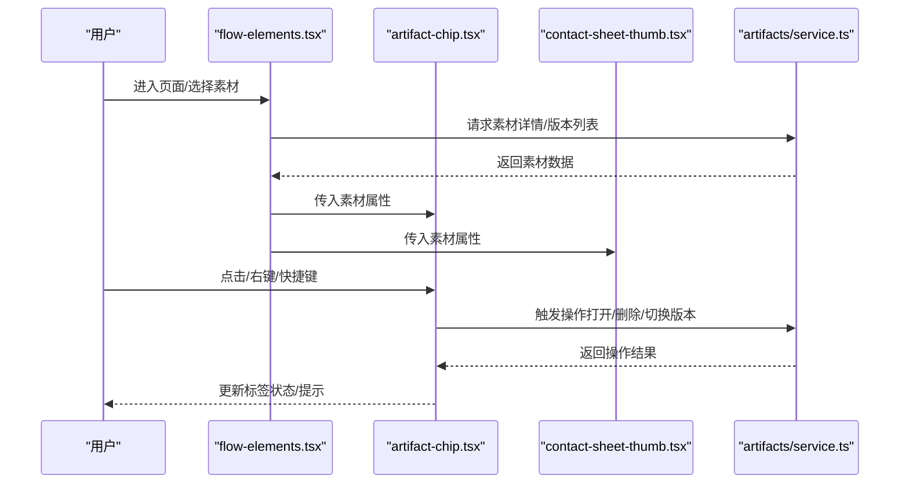
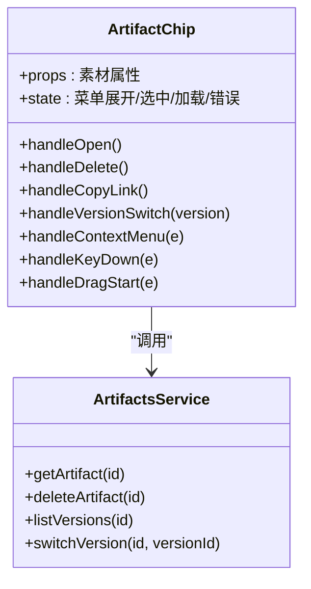
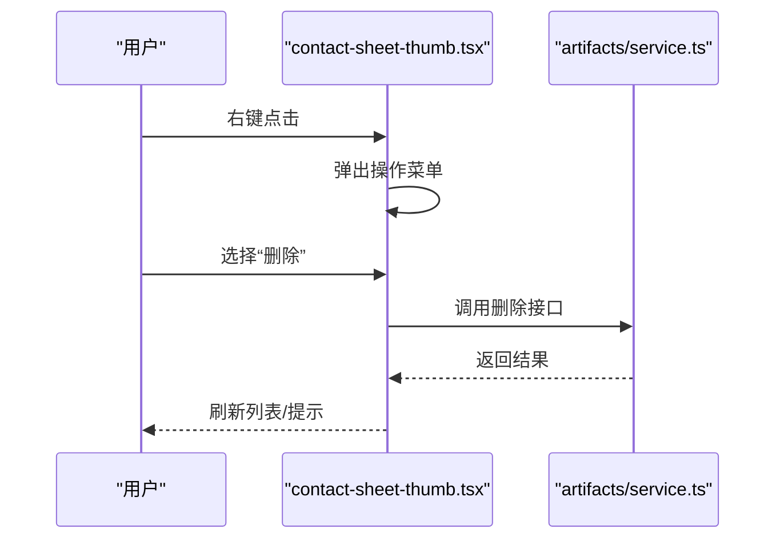
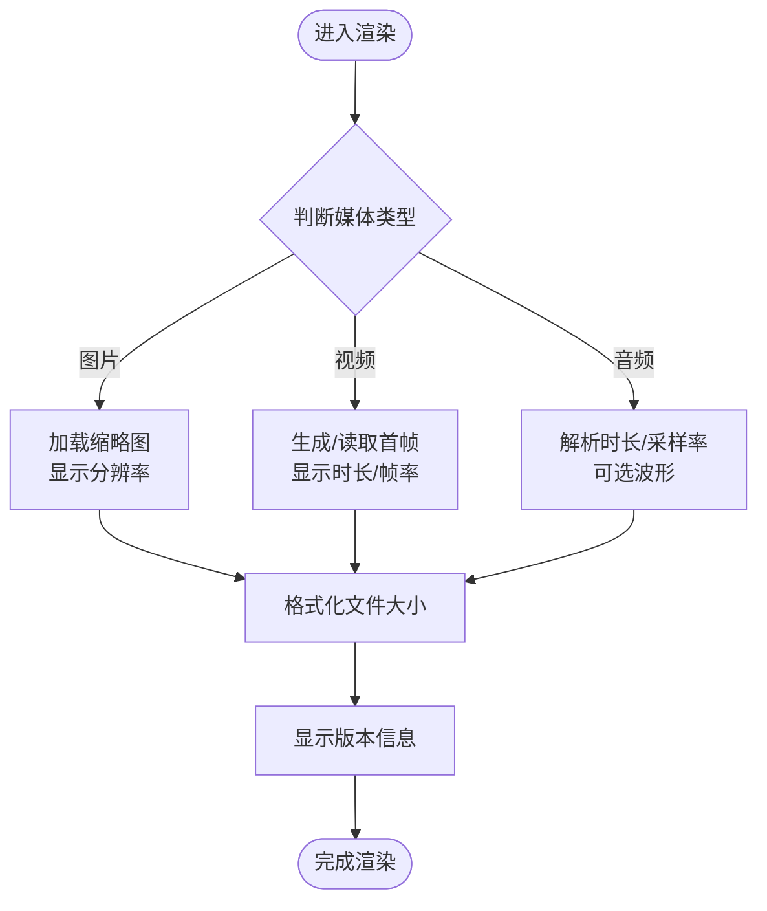
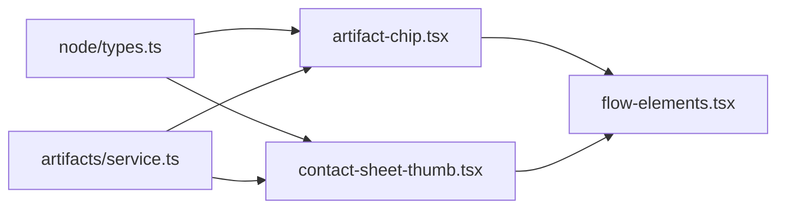
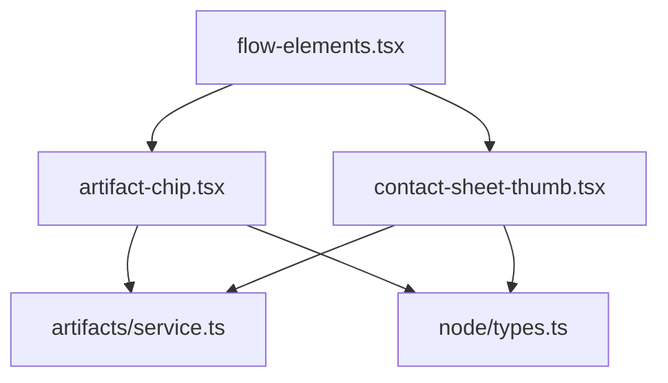

# 素材标签组件

<cite>
**本文引用的文件**   
- [artifact-chip.tsx](file://src/components/ui/artifact-chip.tsx)
- [artifact-chip.demo.tsx](file://src/components/ui/artifact-chip.demo.tsx)
- [contact-sheet-thumb.tsx](file://src/components/ui/contact-sheet-thumb.tsx)
- [contact-sheet-thumb.demo.tsx](file://src/components/ui/contact-sheet-thumb.demo.tsx)
- [node/types.ts](file://src/components/ui/node/types.ts)
- [canvas/flow-elements.tsx](file://src/app/canvas/flow-elements.tsx)
- [artifacts/service.ts](file://src/features/artifacts/service.ts)
- [artifacts/index.ts](file://src/features/artifacts/index.ts)
</cite>

## 目录
1. [简介](#简介)
2. [项目结构](#项目结构)
3. [核心组件](#核心组件)
4. [架构总览](#架构总览)
5. [详细组件分析](#详细组件分析)
6. [依赖关系分析](#依赖关系分析)
7. [性能考虑](#性能考虑)
8. [故障排查指南](#故障排查指南)
9. [结论](#结论)
10. [附录](#附录)

## 简介
本文件为 CodeVideoCanvas 的“素材标签组件”提供系统化文档，聚焦于以下业务与实现要点：
- 媒体类型标识（图片、视频、音频等）
- 文件大小显示与格式化
- 版本信息展示
- 操作菜单（右键菜单、快捷操作）
- 属性配置、状态管理、事件处理与用户交互
- 与素材管理系统的关联与数据同步机制
- 拖拽操作、右键菜单与快捷键支持
- 不同媒体类型的特殊显示逻辑与性能优化策略

该组件主要用于在画布、缩略图列表或侧边栏中直观呈现素材元数据并提供常用操作入口。

## 项目结构
与素材标签相关的代码主要位于 UI 组件层与功能服务层：
- UI 组件层
  - artifact-chip.tsx：素材标签主组件
  - artifact-chip.demo.tsx：演示用法
  - contact-sheet-thumb.tsx：缩略图卡片（常承载标签信息）
  - contact-sheet-thumb.demo.tsx：演示用法
  - node/types.ts：节点类型定义（用于画布节点与标签的数据契约）
- 功能服务层
  - features/artifacts/service.ts：素材服务（获取、更新、版本管理等）
  - features/artifacts/index.ts：对外导出
- 集成点
  - app/canvas/flow-elements.tsx：画布流程元素（可能消费标签组件）

图表来源
- [artifact-chip.tsx](file://src/components/ui/artifact-chip.tsx)
- [artifact-chip.demo.tsx](file://src/components/ui/artifact-chip.demo.tsx)
- [contact-sheet-thumb.tsx](file://src/components/ui/contact-sheet-thumb.tsx)
- [contact-sheet-thumb.demo.tsx](file://src/components/ui/contact-sheet-thumb.demo.tsx)
- [node/types.ts](file://src/components/ui/node/types.ts)
- [artifacts/service.ts](file://src/features/artifacts/service.ts)
- [artifacts/index.ts](file://src/features/artifacts/index.ts)
- [canvas/flow-elements.tsx](file://src/app/canvas/flow-elements.tsx)

章节来源
- [artifact-chip.tsx](file://src/components/ui/artifact-chip.tsx)
- [artifact-chip.demo.tsx](file://src/components/ui/artifact-chip.demo.tsx)
- [contact-sheet-thumb.tsx](file://src/components/ui/contact-sheet-thumb.tsx)
- [contact-sheet-thumb.demo.tsx](file://src/components/ui/contact-sheet-thumb.demo.tsx)
- [node/types.ts](file://src/components/ui/node/types.ts)
- [artifacts/service.ts](file://src/features/artifacts/service.ts)
- [artifacts/index.ts](file://src/features/artifacts/index.ts)
- [canvas/flow-elements.tsx](file://src/app/canvas/flow-elements.tsx)

## 核心组件
- 素材标签（artifact-chip）
  - 职责：以紧凑形式展示素材的关键信息（类型、大小、版本），并提供操作入口（如打开、删除、复制链接、查看历史等）。
  - 关键能力：
    - 媒体类型图标与文案
    - 文件大小格式化显示
    - 版本信息展示（当前版本、历史版本切换）
    - 操作菜单（右键菜单或下拉菜单）
    - 键盘快捷键支持（如 Enter 打开、Delete 删除、Esc 关闭菜单）
    - 拖拽支持（将素材拖入时间轴或画布）
- 缩略图卡片（contact-sheet-thumb）
  - 职责：在缩略图网格中展示素材预览与标签信息，常用于批量浏览与管理。
  - 关键能力：
    - 预览图加载与占位
    - 悬停/选中态高亮
    - 右键菜单与快捷键
    - 拖拽排序与多选联动

章节来源
- [artifact-chip.tsx](file://src/components/ui/artifact-chip.tsx)
- [contact-sheet-thumb.tsx](file://src/components/ui/contact-sheet-thumb.tsx)

## 架构总览
从数据到视图的链路如下：
- 数据源：素材服务（features/artifacts/service.ts）负责拉取素材详情、版本列表、大小等信息。
- 类型契约：node/types.ts 定义节点与素材相关的数据结构，确保 UI 与服务端一致。
- 视图层：artifact-chip.tsx 与 contact-sheet-thumb.tsx 消费上述数据并渲染标签与交互。
- 集成点：flow-elements.tsx 在画布流程中组合使用这些组件，完成更复杂的编排场景。

图表来源
- [canvas/flow-elements.tsx](file://src/app/canvas/flow-elements.tsx)
- [artifact-chip.tsx](file://src/components/ui/artifact-chip.tsx)
- [contact-sheet-thumb.tsx](file://src/components/ui/contact-sheet-thumb.tsx)
- [artifacts/service.ts](file://src/features/artifacts/service.ts)

## 详细组件分析

### 素材标签（artifact-chip）
- 属性配置
  - 素材基础信息：名称、媒体类型、大小、版本、创建/更新时间等
  - 行为开关：是否允许删除、是否允许复制链接、是否允许切换版本
  - 样式控制：尺寸、密度、是否显示缩略图
- 状态管理
  - 本地状态：菜单展开、选中态、加载态、错误态
  - 外部状态：由父级或全局状态驱动（如选中、禁用）
- 事件处理
  - 点击：打开素材或进入编辑
  - 右键：弹出操作菜单
  - 键盘：Enter/Space 打开、Delete 删除、Esc 关闭菜单、方向键导航
  - 拖拽：onDragStart/onDragEnd 暴露素材 ID 与类型
- 用户交互行为
  - 操作菜单项：打开、删除、复制链接、查看历史、切换版本
  - 反馈：成功/失败 Toast 提示
  - 无障碍：aria-label、role、tabIndex 设置

图表来源
- [artifact-chip.tsx](file://src/components/ui/artifact-chip.tsx)
- [artifacts/service.ts](file://src/features/artifacts/service.ts)

章节来源
- [artifact-chip.tsx](file://src/components/ui/artifact-chip.tsx)
- [artifact-chip.demo.tsx](file://src/components/ui/artifact-chip.demo.tsx)
- [artifacts/service.ts](file://src/features/artifacts/service.ts)

### 缩略图卡片（contact-sheet-thumb）
- 属性配置
  - 素材预览图 URL、占位图、宽高比
  - 标签信息：名称、类型、大小、版本
  - 交互开关：是否可多选、是否可拖拽
- 状态管理
  - 选中态、悬停态、加载态、错误态
  - 与列表多选状态联动
- 事件处理
  - 点击：选中/取消选中
  - 右键：弹出操作菜单（同标签）
  - 键盘：空格选中、方向键移动焦点
  - 拖拽：支持多素材拖拽
- 用户交互行为
  - 批量操作：批量删除、批量复制链接
  - 快速预览：悬停预览大图或弹窗

图表来源
- [contact-sheet-thumb.tsx](file://src/components/ui/contact-sheet-thumb.tsx)
- [artifacts/service.ts](file://src/features/artifacts/service.ts)

章节来源
- [contact-sheet-thumb.tsx](file://src/components/ui/contact-sheet-thumb.tsx)
- [contact-sheet-thumb.demo.tsx](file://src/components/ui/contact-sheet-thumb.demo.tsx)

### 媒体类型特殊显示逻辑
- 图片
  - 显示缩略图与分辨率（若可用）
  - 支持懒加载与占位图
- 视频
  - 显示时长、帧率（若可用）
  - 首帧预览生成与缓存
- 音频
  - 显示时长、采样率（若可用）
  - 波形预览（可选）
- 通用
  - 文件大小统一格式化（B/KB/MB/GB）
  - 版本信息展示与切换入口

图表来源
- [artifact-chip.tsx](file://src/components/ui/artifact-chip.tsx)
- [contact-sheet-thumb.tsx](file://src/components/ui/contact-sheet-thumb.tsx)

章节来源
- [artifact-chip.tsx](file://src/components/ui/artifact-chip.tsx)
- [contact-sheet-thumb.tsx](file://src/components/ui/contact-sheet-thumb.tsx)

### 与素材管理系统的关联与数据同步
- 数据契约
  - 通过 node/types.ts 定义节点与素材字段，保证前后端一致
- 数据流
  - 初始化：从 artifacts/service.ts 拉取素材详情与版本列表
  - 变更：执行删除/切换版本等操作后，回调刷新本地状态或通知父级更新
  - 同步：在画布或列表中多处引用同一素材时，采用集中式状态或事件总线进行同步

图表来源
- [node/types.ts](file://src/components/ui/node/types.ts)
- [artifact-chip.tsx](file://src/components/ui/artifact-chip.tsx)
- [contact-sheet-thumb.tsx](file://src/components/ui/contact-sheet-thumb.tsx)
- [artifacts/service.ts](file://src/features/artifacts/service.ts)
- [canvas/flow-elements.tsx](file://src/app/canvas/flow-elements.tsx)

章节来源
- [node/types.ts](file://src/components/ui/node/types.ts)
- [artifacts/service.ts](file://src/features/artifacts/service.ts)
- [canvas/flow-elements.tsx](file://src/app/canvas/flow-elements.tsx)

## 依赖关系分析
- 组件内聚性
  - artifact-chip.tsx 与 contact-sheet-thumb.tsx 各自封装了独立的交互与状态，便于复用
- 耦合点
  - 两者均依赖 artifacts/service.ts 提供的素材 API
  - 通过 node/types.ts 保持数据结构一致性
- 外部依赖
  - 可能的 UI 库（按钮、菜单、Tooltip 等）与系统 Toast 提示
  - 浏览器原生事件（键盘、鼠标、拖拽）

图表来源
- [artifact-chip.tsx](file://src/components/ui/artifact-chip.tsx)
- [contact-sheet-thumb.tsx](file://src/components/ui/contact-sheet-thumb.tsx)
- [artifacts/service.ts](file://src/features/artifacts/service.ts)
- [node/types.ts](file://src/components/ui/node/types.ts)
- [canvas/flow-elements.tsx](file://src/app/canvas/flow-elements.tsx)

章节来源
- [artifact-chip.tsx](file://src/components/ui/artifact-chip.tsx)
- [contact-sheet-thumb.tsx](file://src/components/ui/contact-sheet-thumb.tsx)
- [artifacts/service.ts](file://src/features/artifacts/service.ts)
- [node/types.ts](file://src/components/ui/node/types.ts)
- [canvas/flow-elements.tsx](file://src/app/canvas/flow-elements.tsx)

## 性能考虑
- 图片/视频预览
  - 懒加载与占位图，避免首屏阻塞
  - 缩略图尺寸适配与缓存策略
- 大列表渲染
  - 虚拟滚动或分页加载，减少 DOM 数量
  - 节流/防抖右键菜单与搜索过滤
- 网络请求
  - 并发限制与重试策略
  - 版本列表按需加载，避免一次性拉取过多数据
- 内存与 GC
  - 及时释放不再使用的预览对象
  - 避免闭包持有大对象引用

[本节为通用性能建议，不直接分析具体文件]

## 故障排查指南
- 常见问题
  - 预览图无法加载：检查 URL 有效性、跨域策略与占位图回退
  - 文件大小显示异常：确认单位换算逻辑与数值范围
  - 版本切换无效：核对版本 ID 与服务端返回结构
  - 右键菜单不出现：检查事件冒泡与 z-index 层级
  - 快捷键冲突：确认全局监听器优先级与目标元素焦点
- 定位步骤
  - 打开控制台查看网络请求与错误日志
  - 在组件内部增加调试输出（仅开发环境）
  - 复现最小用例，逐步缩小问题范围

章节来源
- [artifact-chip.tsx](file://src/components/ui/artifact-chip.tsx)
- [contact-sheet-thumb.tsx](file://src/components/ui/contact-sheet-thumb.tsx)

## 结论
素材标签组件通过清晰的职责划分与稳定的数据契约，实现了媒体类型标识、大小与版本信息的直观展示，以及丰富的交互能力（右键菜单、快捷键、拖拽）。结合缩略图卡片，可在多种场景下高效管理与操作素材。建议在后续迭代中持续优化预览加载、列表渲染与错误恢复体验。

[本节为总结性内容，不直接分析具体文件]

## 附录
- 使用示例与集成模式
  - 在画布流程中引入 artifact-chip 与 contact-sheet-thumb，并通过 flow-elements.tsx 组织布局与交互
  - 通过 artifacts/service.ts 统一管理素材数据的获取与变更
  - 参考 demo 文件了解基本用法与常见配置

章节来源
- [artifact-chip.demo.tsx](file://src/components/ui/artifact-chip.demo.tsx)
- [contact-sheet-thumb.demo.tsx](file://src/components/ui/contact-sheet-thumb.demo.tsx)
- [canvas/flow-elements.tsx](file://src/app/canvas/flow-elements.tsx)
- [artifacts/index.ts](file://src/features/artifacts/index.ts)