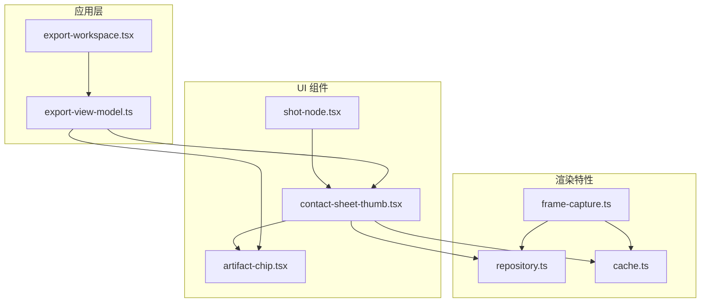
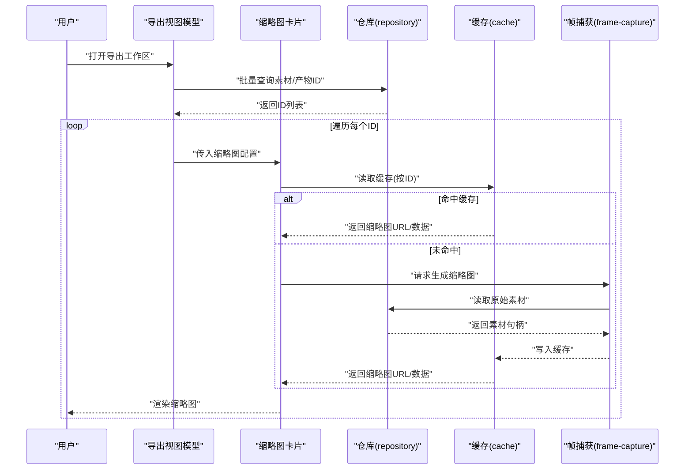
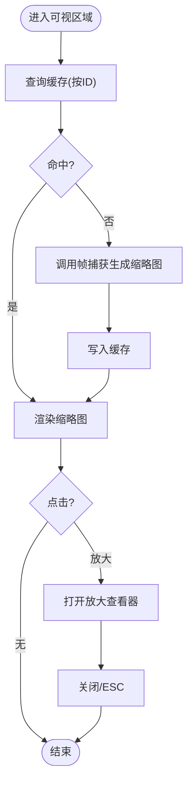
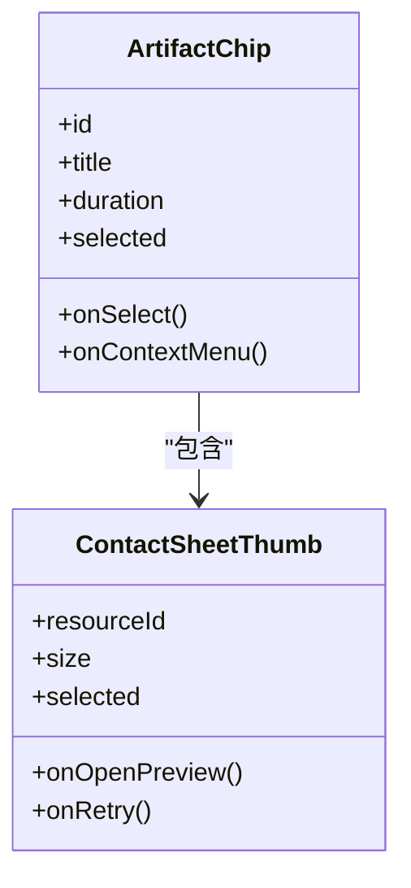
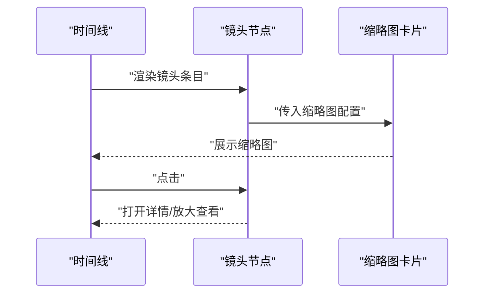
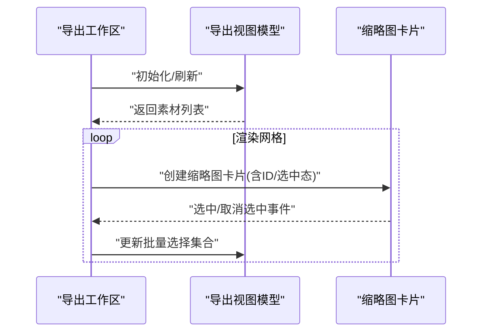
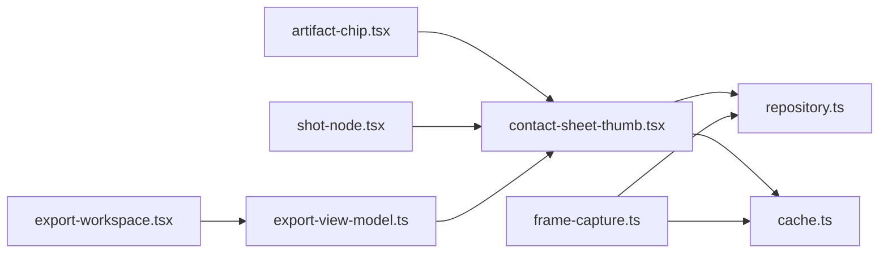

# 缩略图组件

<cite>
**本文引用的文件**   
- [contact-sheet-thumb.tsx](file://src/components/ui/contact-sheet-thumb.tsx)
- [contact-sheet-thumb.demo.tsx](file://src/components/ui/contact-sheet-thumb.demo.tsx)
- [artifact-chip.tsx](file://src/components/ui/artifact-chip.tsx)
- [artifact-chip.demo.tsx](file://src/components/ui/artifact-chip.demo.tsx)
- [shot-node.tsx](file://src/components/ui/node/shot-node.tsx)
- [shot-node.demo.tsx](file://src/components/ui/node/shot-node.demo.tsx)
- [export-view-model.ts](file://src/app/canvas/export/export-view-model.ts)
- [export-workspace.tsx](file://src/app/canvas/export/export-workspace.tsx)
- [frame-capture.ts](file://src/features/render/frame-capture.ts)
- [repository.ts](file://src/features/render/repository.ts)
- [cache.ts](file://src/features/render/cache.ts)
</cite>

## 目录
1. [简介](#简介)
2. [项目结构](#项目结构)
3. [核心组件](#核心组件)
4. [架构总览](#架构总览)
5. [详细组件分析](#详细组件分析)
6. [依赖关系分析](#依赖关系分析)
7. [性能与内存管理](#性能与内存管理)
8. [故障排查指南](#故障排查指南)
9. [结论](#结论)
10. [附录：使用示例与集成模式](#附录使用示例与集成模式)

## 简介
本文件为 CodeVideoCanvas 的“缩略图组件”提供系统化文档，聚焦以下业务目标：
- 视频帧预览与图片加载：支持从素材库或渲染产物中获取缩略图资源，完成高效加载与展示。
- 懒加载与放大查看：在网格布局中按需加载可见区域缩略图，并提供点击放大查看能力。
- 批量选择与交互：支持多选、全选、反选等常见操作，适配复杂工作流。
- 与素材库关联及缓存机制：对接渲染仓库与缓存层，保障一致性与性能。
- 响应式布局与网格：在不同屏幕尺寸下自适应列数与间距。
- 图片优化与内存管理：通过尺寸裁剪、格式优化、去重与生命周期回收降低内存占用。

## 项目结构
缩略图相关代码主要分布在 UI 组件层与渲染特性层：
- UI 层
  - contact-sheet-thumb.tsx：缩略图卡片组件，负责单张缩略图的展示、占位、错误态、放大查看与选中状态。
  - artifact-chip.tsx：素材芯片（可复用），用于在列表/网格中承载缩略图与元信息。
  - shot-node.tsx：镜头节点中的缩略图入口，常用于时间线或画布侧边栏。
  - demo 文件：演示用法与交互样例。
- 渲染特性层
  - frame-capture.ts：从视频帧生成缩略图的核心逻辑。
  - repository.ts：素材/渲染产物的仓库接口，提供按 ID 查询与批量读取。
  - cache.ts：本地缓存策略（键值、过期、容量控制）。
- 应用层
  - export-view-model.ts / export-workspace.tsx：导出工作区聚合多张缩略图，组织批量选择与网格布局。

图表来源
- [contact-sheet-thumb.tsx](file://src/components/ui/contact-sheet-thumb.tsx)
- [artifact-chip.tsx](file://src/components/ui/artifact-chip.tsx)
- [shot-node.tsx](file://src/components/ui/node/shot-node.tsx)
- [export-view-model.ts](file://src/app/canvas/export/export-view-model.ts)
- [export-workspace.tsx](file://src/app/canvas/export/export-workspace.tsx)
- [frame-capture.ts](file://src/features/render/frame-capture.ts)
- [repository.ts](file://src/features/render/repository.ts)
- [cache.ts](file://src/features/render/cache.ts)

章节来源
- [contact-sheet-thumb.tsx](file://src/components/ui/contact-sheet-thumb.tsx)
- [artifact-chip.tsx](file://src/components/ui/artifact-chip.tsx)
- [shot-node.tsx](file://src/components/ui/node/shot-node.tsx)
- [export-view-model.ts](file://src/app/canvas/export/export-view-model.ts)
- [export-workspace.tsx](file://src/app/canvas/export/export-workspace.tsx)
- [frame-capture.ts](file://src/features/render/frame-capture.ts)
- [repository.ts](file://src/features/render/repository.ts)
- [cache.ts](file://src/features/render/cache.ts)

## 核心组件
- 缩略图卡片（contact-sheet-thumb）
  - 职责：单张缩略图的渲染、占位与错误处理、点击放大、选中态反馈、懒加载触发。
  - 关键属性（概念性说明）：资源标识、显示尺寸、是否选中、是否禁用、放大回调、懒加载阈值、占位与错误态文案。
  - 事件：点击放大、双击编辑、键盘导航、拖拽选择（若启用）。
- 素材芯片（artifact-chip）
  - 职责：承载缩略图与基础元数据（名称、时长、标签等），作为列表/网格项。
  - 交互：选中、悬停高亮、右键菜单（视集成而定）。
- 镜头节点（shot-node）
  - 职责：在时间线或节点图中嵌入缩略图入口，便于快速定位与预览。
- 导出视图模型（export-view-model）
  - 职责：聚合素材与缩略图数据，维护批量选择集合、排序与过滤。
- 导出工作区（export-workspace）
  - 职责：组织网格布局、分页/虚拟滚动、批量操作工具栏。

章节来源
- [contact-sheet-thumb.tsx](file://src/components/ui/contact-sheet-thumb.tsx)
- [artifact-chip.tsx](file://src/components/ui/artifact-chip.tsx)
- [shot-node.tsx](file://src/components/ui/node/shot-node.tsx)
- [export-view-model.ts](file://src/app/canvas/export/export-view-model.ts)
- [export-workspace.tsx](file://src/app/canvas/export/export-workspace.tsx)

## 架构总览
缩略图的数据流遵循“仓库→缓存→渲染→展示”的分层设计：
- 仓库层（repository）：统一访问素材/渲染产物，提供按 ID 查询与批量读取。
- 缓存层（cache）：对已生成的缩略图进行本地缓存，避免重复计算与网络请求。
- 渲染层（frame-capture）：从视频源抽取帧并生成缩略图，写入缓存。
- UI 层：组件消费缓存结果，实现懒加载、放大查看与批量选择。

图表来源
- [export-view-model.ts](file://src/app/canvas/export/export-view-model.ts)
- [contact-sheet-thumb.tsx](file://src/components/ui/contact-sheet-thumb.tsx)
- [repository.ts](file://src/features/render/repository.ts)
- [cache.ts](file://src/features/render/cache.ts)
- [frame-capture.ts](file://src/features/render/frame-capture.ts)

## 详细组件分析

### 缩略图卡片（contact-sheet-thumb）
- 功能要点
  - 懒加载：仅在进入可视区域时发起加载，减少首屏压力。
  - 放大查看：点击后以弹窗或浮层形式展示大图，支持关闭与键盘 ESC。
  - 选中态：与上层批量选择联动，提供视觉反馈。
  - 错误与占位：网络失败或资源不可用时降级到占位图与重试提示。
- 交互流程
  - 首次加载：检查缓存→未命中则调用帧捕获→写入缓存→渲染。
  - 二次加载：直接命中缓存，秒级展示。
  - 放大查看：将当前缩略图 URL/数据传递给放大容器。
- 状态管理
  - 内部状态：加载中、成功、失败、选中、放大中。
  - 外部状态：由父组件（如导出视图模型）驱动选中集合与批量操作。

图表来源
- [contact-sheet-thumb.tsx](file://src/components/ui/contact-sheet-thumb.tsx)
- [cache.ts](file://src/features/render/cache.ts)
- [frame-capture.ts](file://src/features/render/frame-capture.ts)

章节来源
- [contact-sheet-thumb.tsx](file://src/components/ui/contact-sheet-thumb.tsx)
- [contact-sheet-thumb.demo.tsx](file://src/components/ui/contact-sheet-thumb.demo.tsx)

### 素材芯片（artifact-chip）
- 功能要点
  - 承载缩略图与元信息（名称、时长、标签等）。
  - 支持悬停高亮、选中态、上下文菜单（视集成）。
- 与缩略图卡片的协作
  - 通常作为外层容器，内嵌缩略图卡片，传递选中与交互事件。

图表来源
- [artifact-chip.tsx](file://src/components/ui/artifact-chip.tsx)
- [contact-sheet-thumb.tsx](file://src/components/ui/contact-sheet-thumb.tsx)

章节来源
- [artifact-chip.tsx](file://src/components/ui/artifact-chip.tsx)
- [artifact-chip.demo.tsx](file://src/components/ui/artifact-chip.demo.tsx)

### 镜头节点（shot-node）
- 功能要点
  - 在时间线或节点图中嵌入缩略图入口，便于快速定位与预览。
  - 点击可跳转至对应镜头详情或打开放大查看器。
- 与缩略图卡片的协作
  - 复用缩略图卡片渲染逻辑，保持视觉一致性。

图表来源
- [shot-node.tsx](file://src/components/ui/node/shot-node.tsx)
- [contact-sheet-thumb.tsx](file://src/components/ui/contact-sheet-thumb.tsx)

章节来源
- [shot-node.tsx](file://src/components/ui/node/shot-node.tsx)
- [shot-node.demo.tsx](file://src/components/ui/node/shot-node.demo.tsx)

### 导出视图模型与工作区（export-view-model / export-workspace）
- 职责分工
  - 视图模型：维护素材清单、批量选择集合、排序与过滤；暴露给 UI 层消费。
  - 工作区：组织网格布局、分页/虚拟滚动、批量操作工具栏与快捷键。
- 与缩略图组件的协作
  - 为每个素材实例化一个缩略图卡片，传入选中态与交互回调。
  - 监听批量选择变化，同步更新所有卡片选中态。

图表来源
- [export-view-model.ts](file://src/app/canvas/export/export-view-model.ts)
- [export-workspace.tsx](file://src/app/canvas/export/export-workspace.tsx)
- [contact-sheet-thumb.tsx](file://src/components/ui/contact-sheet-thumb.tsx)

章节来源
- [export-view-model.ts](file://src/app/canvas/export/export-view-model.ts)
- [export-workspace.tsx](file://src/app/canvas/export/export-workspace.tsx)

## 依赖关系分析
- 组件耦合
  - 缩略图卡片依赖仓库与缓存，尽量解耦于具体业务页面。
  - 素材芯片与镜头节点仅组合缩略图卡片，不直接访问仓库/缓存。
- 外部依赖
  - 仓库：统一数据源，屏蔽底层存储差异。
  - 缓存：本地持久化与内存缓存，提升二次访问速度。
  - 帧捕获：将视频帧转换为缩略图，可能涉及解码与编码。

图表来源
- [contact-sheet-thumb.tsx](file://src/components/ui/contact-sheet-thumb.tsx)
- [artifact-chip.tsx](file://src/components/ui/artifact-chip.tsx)
- [shot-node.tsx](file://src/components/ui/node/shot-node.tsx)
- [export-view-model.ts](file://src/app/canvas/export/export-view-model.ts)
- [export-workspace.tsx](file://src/app/canvas/export/export-workspace.tsx)
- [frame-capture.ts](file://src/features/render/frame-capture.ts)
- [repository.ts](file://src/features/render/repository.ts)
- [cache.ts](file://src/features/render/cache.ts)

章节来源
- [contact-sheet-thumb.tsx](file://src/components/ui/contact-sheet-thumb.tsx)
- [artifact-chip.tsx](file://src/components/ui/artifact-chip.tsx)
- [shot-node.tsx](file://src/components/ui/node/shot-node.tsx)
- [export-view-model.ts](file://src/app/canvas/export/export-view-model.ts)
- [export-workspace.tsx](file://src/app/canvas/export/export-workspace.tsx)
- [frame-capture.ts](file://src/features/render/frame-capture.ts)
- [repository.ts](file://src/features/render/repository.ts)
- [cache.ts](file://src/features/render/cache.ts)

## 性能与内存管理
- 懒加载
  - 基于可视区域触发加载，避免一次性渲染大量缩略图导致卡顿。
- 缓存策略
  - 本地缓存缩略图 URL/数据，避免重复生成与网络请求。
  - 建议设置合理的过期时间与容量上限，防止内存膨胀。
- 图片优化
  - 根据展示尺寸生成合适分辨率的缩略图，避免过大图片占用带宽与内存。
  - 优先使用现代格式（如 WebP/AVIF），兼顾兼容性与体积。
- 去重与共享
  - 同一素材的多处引用应共享同一份缩略图实例，减少重复渲染。
- 生命周期回收
  - 组件卸载时清理定时器、观察者与临时对象，避免内存泄漏。
- 批量加载节流
  - 批量场景下对并发请求进行限流，避免瞬时峰值影响主线程。

[本节为通用指导，无需特定文件来源]

## 故障排查指南
- 缩略图无法加载
  - 检查仓库是否正确返回素材 ID 与路径。
  - 确认缓存键是否唯一且未被污染。
  - 观察帧捕获是否因解码失败抛出异常。
- 放大查看器不显示
  - 确认传入的 URL/数据有效。
  - 检查放大容器的 z-index 与遮罩层样式。
- 批量选择不同步
  - 核对视图模型的选中集合是否与 UI 层双向绑定。
  - 确保事件冒泡未被阻止。
- 性能问题
  - 开启浏览器性能面板，定位长任务与内存峰值。
  - 调整懒加载阈值与并发限制。

章节来源
- [contact-sheet-thumb.tsx](file://src/components/ui/contact-sheet-thumb.tsx)
- [artifact-chip.tsx](file://src/components/ui/artifact-chip.tsx)
- [export-view-model.ts](file://src/app/canvas/export/export-view-model.ts)
- [export-workspace.tsx](file://src/app/canvas/export/export-workspace.tsx)
- [frame-capture.ts](file://src/features/render/frame-capture.ts)
- [repository.ts](file://src/features/render/repository.ts)
- [cache.ts](file://src/features/render/cache.ts)

## 结论
缩略图组件通过“仓库+缓存+帧捕获”的分层架构，结合懒加载、放大查看与批量选择，提供了高性能、可扩展的视频帧预览体验。配合导出视图模型与工作区的协作，可在复杂场景中稳定运行。建议在后续迭代中持续优化图片格式、缓存策略与内存回收，以提升整体性能与用户体验。

[本节为总结，无需特定文件来源]

## 附录：使用示例与集成模式
- 基本用法
  - 在网格中为每个素材创建一个缩略图卡片，传入资源 ID 与选中态。
  - 监听选中事件，将结果回传给视图模型以维护批量选择集合。
- 放大查看集成
  - 为缩略图卡片注册点击放大回调，打开放大查看器并传入当前缩略图数据。
- 批量选择
  - 在工作区顶部提供全选/反选按钮，调用视图模型方法更新选中集合。
  - 支持 Shift/Ctrl 多选与键盘导航。
- 响应式布局
  - 根据屏幕宽度动态调整网格列数与间距，保证移动端可用性。
- 与素材库关联
  - 通过仓库按 ID 查询素材，再交由帧捕获生成缩略图并写入缓存。
- 参考 Demo
  - 参见各组件的 demo 文件，了解最小可用集成方式与交互细节。

章节来源
- [contact-sheet-thumb.demo.tsx](file://src/components/ui/contact-sheet-thumb.demo.tsx)
- [artifact-chip.demo.tsx](file://src/components/ui/artifact-chip.demo.tsx)
- [shot-node.demo.tsx](file://src/components/ui/node/shot-node.demo.tsx)
- [export-workspace.tsx](file://src/app/canvas/export/export-workspace.tsx)