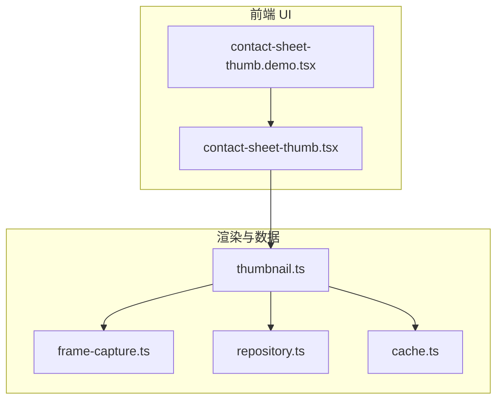
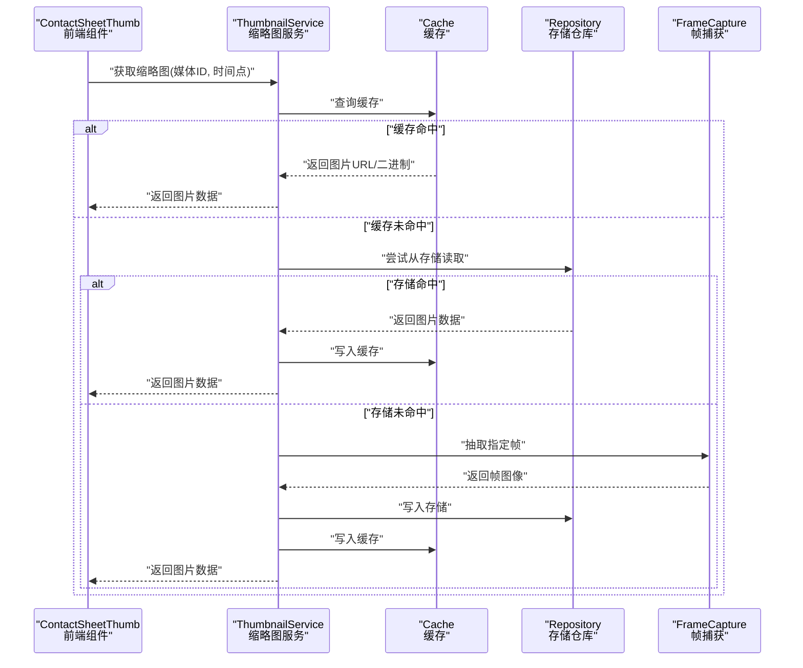
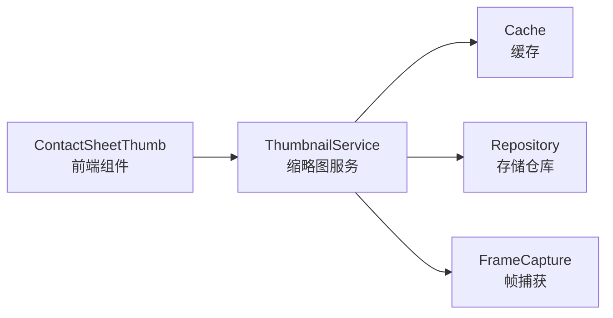

# 缩略图组件

<cite>
**本文引用的文件**   
- [contact-sheet-thumb.tsx](file://src/components/ui/contact-sheet-thumb.tsx)
- [contact-sheet-thumb.demo.tsx](file://src/components/ui/contact-sheet-thumb.demo.tsx)
- [thumbnail.ts](file://src/features/render/thumbnail.ts)
- [thumbnail.test.ts](file://src/features/render/thumbnail.test.ts)
- [thumbnail.integration.test.ts](file://src/features/render/thumbnail.integration.test.ts)
- [frame-capture.ts](file://src/features/render/frame-capture.ts)
- [repository.ts](file://src/features/render/repository.ts)
- [cache.ts](file://src/features/render/cache.ts)
</cite>

## 目录
1. [简介](#简介)
2. [项目结构](#项目结构)
3. [核心组件](#核心组件)
4. [架构总览](#架构总览)
5. [详细组件分析](#详细组件分析)
6. [依赖分析](#依赖分析)
7. [性能考虑](#性能考虑)
8. [故障排查指南](#故障排查指南)
9. [结论](#结论)
10. [附录](#附录)

## 简介
本文件聚焦于“缩略图组件”的端到端实现与使用，涵盖前端展示层（Contact Sheet 缩略图卡片）与后端/渲染层（帧捕获、缓存、存储仓库）之间的协作关系。文档旨在帮助开发者快速理解：
- 如何在前端使用缩略图组件进行展示
- 缩略图的生成流程（从视频帧到图片资源）
- 缓存与存储策略对性能的影响
- 常见问题定位与优化建议

## 项目结构
与缩略图相关的代码主要分布在两个层次：
- 前端 UI 层：位于 src/components/ui 下的 contact-sheet-thumb 组件及其演示文件
- 渲染与数据层：位于 src/features/render 下的 thumbnail、frame-capture、repository、cache 等模块

图表来源
- [contact-sheet-thumb.tsx](file://src/components/ui/contact-sheet-thumb.tsx)
- [contact-sheet-thumb.demo.tsx](file://src/components/ui/contact-sheet-thumb.demo.tsx)
- [thumbnail.ts](file://src/features/render/thumbnail.ts)
- [frame-capture.ts](file://src/features/render/frame-capture.ts)
- [repository.ts](file://src/features/render/repository.ts)
- [cache.ts](file://src/features/render/cache.ts)

章节来源
- [contact-sheet-thumb.tsx](file://src/components/ui/contact-sheet-thumb.tsx)
- [contact-sheet-thumb.demo.tsx](file://src/components/ui/contact-sheet-thumb.demo.tsx)
- [thumbnail.ts](file://src/features/render/thumbnail.ts)
- [frame-capture.ts](file://src/features/render/frame-capture.ts)
- [repository.ts](file://src/features/render/repository.ts)
- [cache.ts](file://src/features/render/cache.ts)

## 核心组件
- Contact Sheet 缩略图卡片（前端）
  - 负责以网格或列表形式展示多个缩略图，支持点击交互、占位骨架屏、错误态展示等
  - 数据来源通常来自上层状态或 API，内部仅做展示与轻量交互
- 缩略图生成管线（渲染层）
  - 从媒体源抽取指定时间点的帧
  - 将帧编码为图片格式并写入缓存/存储
  - 提供统一的获取接口供 UI 消费

章节来源
- [contact-sheet-thumb.tsx](file://src/components/ui/contact-sheet-thumb.tsx)
- [thumbnail.ts](file://src/features/render/thumbnail.ts)
- [frame-capture.ts](file://src/features/render/frame-capture.ts)
- [repository.ts](file://src/features/render/repository.ts)
- [cache.ts](file://src/features/render/cache.ts)

## 架构总览
下图展示了从 UI 请求到最终渲染出缩略图的完整调用链，包括缓存命中、帧捕获、编码与持久化路径。

图表来源
- [thumbnail.ts](file://src/features/render/thumbnail.ts)
- [cache.ts](file://src/features/render/cache.ts)
- [repository.ts](file://src/features/render/repository.ts)
- [frame-capture.ts](file://src/features/render/frame-capture.ts)

## 详细组件分析

### 前端组件：Contact Sheet 缩略图卡片
- 职责
  - 接收一组缩略图数据（如 URL、标题、时长等），以网格布局渲染
  - 处理加载态（骨架屏）、错误态（重试/提示）、空态（无数据）
  - 提供点击跳转、预览等交互入口
- 关键特性
  - 懒加载与按需渲染，避免首屏压力
  - 统一尺寸与裁剪策略，保证视觉一致性
  - 可配置的主题与样式覆盖点
- 使用方式
  - 通过 demo 文件了解基本用法与常见场景组合
  - 在业务页面中传入数据源与回调即可集成

章节来源
- [contact-sheet-thumb.tsx](file://src/components/ui/contact-sheet-thumb.tsx)
- [contact-sheet-thumb.demo.tsx](file://src/components/ui/contact-sheet-thumb.demo.tsx)

### 渲染服务：缩略图生成管线
- 职责
  - 对外暴露统一的缩略图获取接口
  - 协调缓存、存储与帧捕获，确保一致性与性能
- 关键流程
  - 先查缓存，命中则直接返回
  - 未命中时尝试从存储读取，命中则回写缓存并返回
  - 仍未命中则触发帧捕获，编码后写入存储与缓存，再返回结果
- 数据结构
  - 输入：媒体标识、时间点、目标尺寸/格式等
  - 输出：图片数据（URL 或二进制）
- 错误处理
  - 捕获捕获失败、编码异常、存储异常等，向上抛出明确错误信息
  - 提供降级策略（如返回占位图）

章节来源
- [thumbnail.ts](file://src/features/render/thumbnail.ts)
- [thumbnail.test.ts](file://src/features/render/thumbnail.test.ts)
- [thumbnail.integration.test.ts](file://src/features/render/thumbnail.integration.test.ts)

### 帧捕获：从媒体源抽取帧
- 职责
  - 根据媒体源与时间点，抽取对应帧图像
  - 将原始帧转换为可编码的图像对象
- 关键点
  - 时间容差与对齐策略，确保取帧稳定
  - 跨平台兼容性与性能优化（如复用解码器上下文）
- 异常边界
  - 媒体不可用、时间越界、解码失败等情况需明确报错

章节来源
- [frame-capture.ts](file://src/features/render/frame-capture.ts)

### 存储仓库：缩略图持久化
- 职责
  - 提供统一的读写接口，屏蔽底层存储差异
  - 管理键空间与命名规范，避免冲突
- 关键点
  - 读写原子性、并发安全
  - 过期策略与清理机制（可选）
- 扩展性
  - 可通过适配器模式接入不同存储后端

章节来源
- [repository.ts](file://src/features/render/repository.ts)

### 缓存：内存/本地缓存层
- 职责
  - 加速重复访问的缩略图读取
  - 控制缓存大小与淘汰策略
- 关键点
  - 键设计（媒体ID+时间点+规格）
  - TTL 与失效策略
  - 内存占用监控与告警（可选）

章节来源
- [cache.ts](file://src/features/render/cache.ts)

## 依赖分析
- 组件耦合
  - 前端组件仅依赖缩略图服务的统一接口，不关心具体实现细节
  - 缩略图服务依赖缓存、存储与帧捕获三个子模块，形成清晰的单向依赖
- 外部依赖
  - 媒体解码/编码能力（浏览器 API 或服务端库）
  - 存储后端（本地文件系统、对象存储等）
- 潜在循环依赖
  - 当前分层清晰，未见循环引用；若新增模块需注意保持单向依赖

图表来源
- [contact-sheet-thumb.tsx](file://src/components/ui/contact-sheet-thumb.tsx)
- [thumbnail.ts](file://src/features/render/thumbnail.ts)
- [cache.ts](file://src/features/render/cache.ts)
- [repository.ts](file://src/features/render/repository.ts)
- [frame-capture.ts](file://src/features/render/frame-capture.ts)

章节来源
- [contact-sheet-thumb.tsx](file://src/components/ui/contact-sheet-thumb.tsx)
- [thumbnail.ts](file://src/features/render/thumbnail.ts)
- [cache.ts](file://src/features/render/cache.ts)
- [repository.ts](file://src/features/render/repository.ts)
- [frame-capture.ts](file://src/features/render/frame-capture.ts)

## 性能考虑
- 缓存优先
  - 充分利用缓存命中，减少重复解码与 I/O
  - 合理设置 TTL 与容量上限，避免内存膨胀
- 懒加载与分页
  - 前端按视口与滚动位置懒加载缩略图
  - 批量请求合并与去重，降低抖动
- 编码与尺寸
  - 按需生成目标尺寸，避免大图浪费
  - 选择合适的编码格式与质量参数，平衡体积与清晰度
- 并发控制
  - 限制并发任务数，防止瞬时峰值压垮解码器或存储
- 错误重试与降级
  - 对网络与 I/O 错误实施指数退避重试
  - 失败时返回占位图，保障界面可用性

[本节为通用指导，无需源码引用]

## 故障排查指南
- 症状：缩略图一直显示加载中
  - 检查缓存是否被清空或键不一致
  - 确认存储仓库是否可写且路径正确
  - 查看帧捕获日志，确认媒体源可用与时间点有效
- 症状：缩略图模糊或失真
  - 调整目标尺寸与编码质量
  - 检查帧抽取时间点是否落在关键帧附近
- 症状：内存占用过高
  - 检查缓存淘汰策略与最大条目数
  - 评估是否存在未释放的图像对象或监听器
- 症状：并发导致卡顿
  - 降低并发度，增加节流/防抖
  - 对大任务拆分执行

章节来源
- [thumbnail.test.ts](file://src/features/render/thumbnail.test.ts)
- [thumbnail.integration.test.ts](file://src/features/render/thumbnail.integration.test.ts)

## 结论
缩略图组件由前端展示层与渲染数据层协同完成。通过“缓存优先 + 存储兜底 + 帧捕获生成”的分层设计，系统在易用性、性能与可扩展性之间取得良好平衡。建议在后续迭代中持续完善缓存策略、错误恢复与可观测性指标，以提升整体稳定性与用户体验。

[本节为总结性内容，无需源码引用]

## 附录
- 相关测试用例
  - 单元测试：验证缩略图服务在不同分支逻辑下的行为
  - 集成测试：验证端到端流程（缓存、存储、帧捕获）的正确性
- 参考文件
  - 前端组件与演示：见 contact-sheet-thumb 相关文件
  - 渲染管线：见 thumbnail、frame-capture、repository、cache 相关文件

章节来源
- [thumbnail.test.ts](file://src/features/render/thumbnail.test.ts)
- [thumbnail.integration.test.ts](file://src/features/render/thumbnail.integration.test.ts)
- [contact-sheet-thumb.tsx](file://src/components/ui/contact-sheet-thumb.tsx)
- [contact-sheet-thumb.demo.tsx](file://src/components/ui/contact-sheet-thumb.demo.tsx)
- [thumbnail.ts](file://src/features/render/thumbnail.ts)
- [frame-capture.ts](file://src/features/render/frame-capture.ts)
- [repository.ts](file://src/features/render/repository.ts)
- [cache.ts](file://src/features/render/cache.ts)