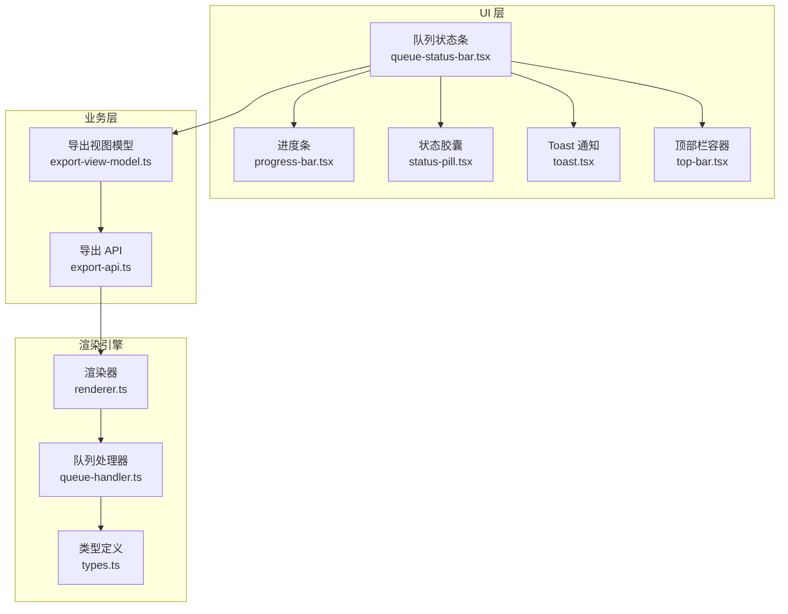
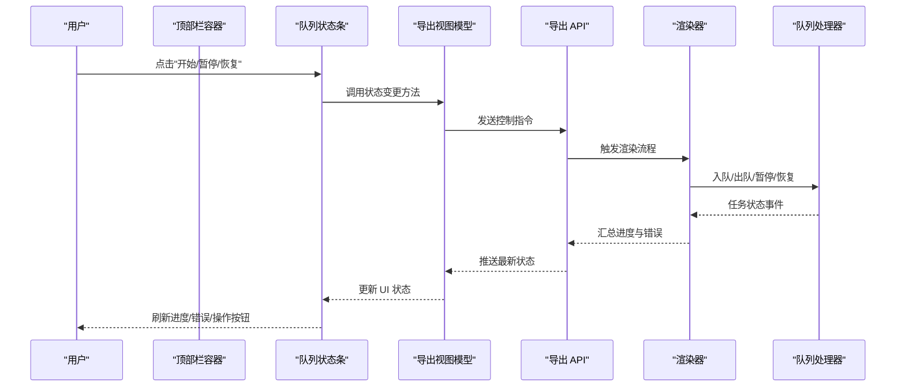
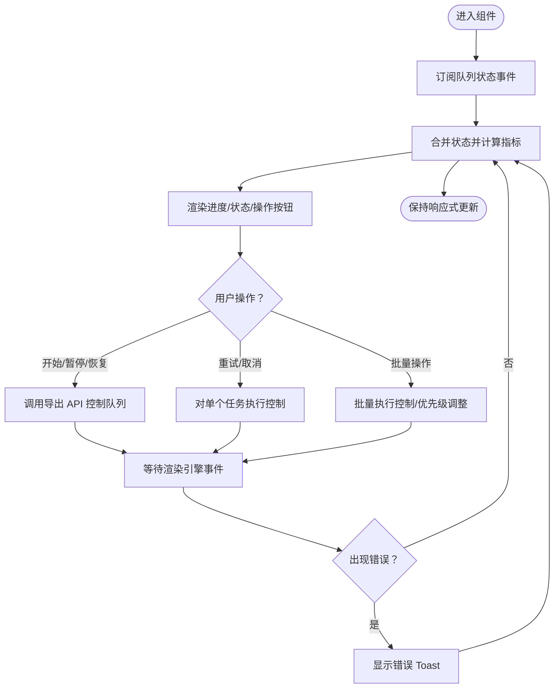
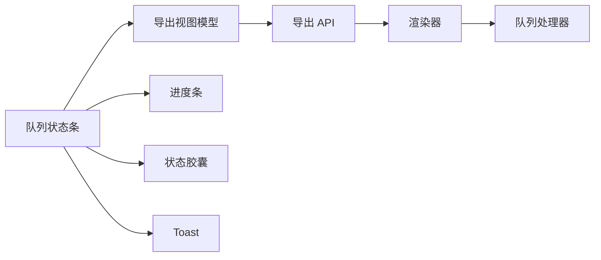

# 队列状态条组件

<cite>
**本文引用的文件**   
- [queue-status-bar.tsx](file://src/components/ui/queue-status-bar.tsx)
- [queue-status-bar.demo.tsx](file://src/components/ui/queue-status-bar.demo.tsx)
- [queue-status-bar.test.ts](file://src/components/ui/queue-status-bar.test.ts)
- [progress-bar.tsx](file://src/components/ui/progress-bar.tsx)
- [status-pill.tsx](file://src/components/ui/status-pill.tsx)
- [toast.tsx](file://src/components/ui/toast.tsx)
- [top-bar.tsx](file://src/components/ui/top-bar.tsx)
- [export-view-model.ts](file://src/app/canvas/export/export-view-model.ts)
- [export-api.ts](file://src/app/canvas/export/export-api.ts)
- [renderer.ts](file://src/features/render/renderer.ts)
- [queue-handler.ts](file://src/features/render/queue-handler.ts)
- [types.ts](file://src/features/render/types.ts)
</cite>

## 更新摘要
**所做更改**
- 增强了后台任务排队和状态显示功能
- 改进了状态管理机制，提供更准确的状态报告
- 优化了用户体验，包括更好的错误处理和用户交互
- 更新了组件架构以支持更复杂的队列操作

## 目录
1. [简介](#简介)
2. [项目结构](#项目结构)
3. [核心组件](#核心组件)
4. [架构总览](#架构总览)
5. [详细组件分析](#详细组件分析)
6. [依赖关系分析](#依赖关系分析)
7. [性能与内存管理](#性能与内存管理)
8. [故障排查指南](#故障排查指南)
9. [结论](#结论)
10. [附录：集成示例与最佳实践](#附录集成示例与最佳实践)

## 简介
本文件为 CodeVideoCanvas 的"队列状态条"组件提供系统化文档。该组件用于在应用顶部或侧边栏中展示渲染任务队列的整体状态，包括任务进度、错误提示、暂停/恢复控制等。经过最新更新，组件增强了后台任务排队和状态显示功能，包括更好的状态管理、更准确的状态报告和增强的用户体验。它通过数据绑定与状态管理，将渲染引擎的队列事件实时反映到 UI，并提供用户交互能力（如批量操作、优先级调整、资源监控）。同时，文档说明了与渲染引擎的消息通信机制、错误处理策略、性能优化与内存管理建议，以及在实际项目中的集成模式与使用示例。

## 项目结构
队列状态条位于 UI 层，属于通用组件库的一部分，可被页面或布局组件复用。其相关实现与演示如下：
- 组件实现：src/components/ui/queue-status-bar.tsx
- 演示入口：src/components/ui/queue-status-bar.demo.tsx
- 测试文件：src/components/ui/queue-status-bar.test.ts
- 子组件：进度条、状态胶囊、Toast 通知、顶部栏容器
- 集成位置：导出视图模型、侧边栏、顶部栏等

**图表来源**
- [queue-status-bar.tsx:1-200](file://src/components/ui/queue-status-bar.tsx#L1-L200)
- [progress-bar.tsx:1-200](file://src/components/ui/progress-bar.tsx#L1-L200)
- [status-pill.tsx:1-200](file://src/components/ui/status-pill.tsx#L1-L200)
- [toast.tsx:1-200](file://src/components/ui/toast.tsx#L1-L200)
- [top-bar.tsx:1-200](file://src/components/ui/top-bar.tsx#L1-L200)
- [export-view-model.ts:1-200](file://src/app/canvas/export/export-view-model.ts#L1-L200)
- [export-api.ts:1-200](file://src/app/canvas/export/export-api.ts#L1-L200)
- [renderer.ts:1-200](file://src/features/render/renderer.ts#L1-L200)
- [queue-handler.ts:1-200](file://src/features/render/queue-handler.ts#L1-L200)
- [types.ts:1-200](file://src/features/render/types.ts#L1-L200)

## 核心组件
- 队列状态条（QueueStatusBar）
  - 职责：聚合渲染队列的全局状态，展示总体进度、当前任务、错误摘要、暂停/恢复按钮；支持批量操作与优先级提示；与渲染引擎通过消息通道同步更新。
  - 关键行为：订阅队列事件、计算汇总指标、触发用户动作、显示 Toast 通知、与父级布局集成。
  - **新增功能**：增强的状态管理、更准确的状态报告、改进的用户交互体验。
- 进度条（ProgressBar）
  - 职责：可视化百分比进度，支持动画与无障碍标签。
- 状态胶囊（StatusPill）
  - 职责：以紧凑形式展示任务状态（进行中、等待、失败、完成等），并支持点击展开详情。
- Toast 通知（Toast）
  - 职责：非阻塞式提示错误、成功与警告信息，支持自动消失与手动关闭。
- 顶部栏容器（TopBar）
  - 职责：作为全局容器承载队列状态条，确保在不同页面保持一致的可见性与交互体验。

**章节来源**
- [queue-status-bar.tsx:1-200](file://src/components/ui/queue-status-bar.tsx#L1-L200)
- [queue-status-bar.demo.tsx:1-200](file://src/components/ui/queue-status-bar.demo.tsx#L1-L200)
- [queue-status-bar.test.ts:1-200](file://src/components/ui/queue-status-bar.test.ts#L1-200)
- [progress-bar.tsx:1-200](file://src/components/ui/progress-bar.tsx#L1-L200)
- [status-pill.tsx:1-200](file://src/components/ui/status-pill.tsx#L1-L200)
- [toast.tsx:1-200](file://src/components/ui/toast.tsx#L1-L200)
- [top-bar.tsx:1-200](file://src/components/ui/top-bar.tsx#L1-L200)

## 架构总览
队列状态条处于 UI 层，向上对接布局容器（顶部栏），向下通过导出视图模型与导出 API 与渲染引擎交互。渲染引擎内部维护队列处理器，负责任务调度、执行与事件上报。

**图表来源**
- [queue-status-bar.tsx:1-200](file://src/components/ui/queue-status-bar.tsx#L1-L200)
- [export-view-model.ts:1-200](file://src/app/canvas/export/export-view-model.ts#L1-L200)
- [export-api.ts:1-200](file://src/app/canvas/export/export-api.ts#L1-L200)
- [renderer.ts:1-200](file://src/features/render/renderer.ts#L1-L200)
- [queue-handler.ts:1-200](file://src/features/render/queue-handler.ts#L1-L200)

## 详细组件分析

### 队列状态条（QueueStatusBar）
- 数据绑定与状态管理
  - 从导出视图模型订阅队列状态，包含：总任务数、已完成数、进行中数、失败数、整体进度百分比、当前任务标识、错误列表、是否暂停。
  - 本地状态：用户交互触发的操作（开始、暂停、恢复、重试、取消）、批量选择集合、优先级筛选结果。
  - **增强功能**：改进了状态管理机制，提供更准确的状态报告和更好的用户体验。
- 实时更新
  - 基于事件驱动的状态更新，避免轮询；当渲染引擎上报任务状态变化时，视图模型合并增量更新，组件按需重渲染。
- 用户交互
  - 开始/暂停/恢复：控制队列运行态。
  - 重试/取消：针对失败或待执行任务进行细粒度控制。
  - 批量操作：多选任务后统一执行重试/取消/提升优先级。
  - 优先级管理：对选中任务设置高/低优先级，影响调度顺序。
- 错误处理
  - 捕获渲染异常与网络错误，转换为 Toast 提示；保留错误上下文以便后续诊断。
  - 失败任务提供"重试"入口，支持指数退避与最大重试次数限制。
- 与渲染引擎的关联与消息通信
  - 通过导出 API 向渲染器下发控制指令；渲染器经队列处理器调度任务，并将状态事件回传至导出 API，再由视图模型分发到 UI。
- 资源监控
  - 展示 CPU/GPU/内存占用概览（由渲染引擎上报），并在阈值超限时给出告警提示。

**图表来源**
- [queue-status-bar.tsx:1-200](file://src/components/ui/queue-status-bar.tsx#L1-L200)
- [export-api.ts:1-200](file://src/app/canvas/export/export-api.ts#L1-L200)
- [queue-handler.ts:1-200](file://src/features/render/queue-handler.ts#L1-L200)

**章节来源**
- [queue-status-bar.tsx:1-200](file://src/components/ui/queue-status-bar.tsx#L1-L200)
- [queue-status-bar.demo.tsx:1-200](file://src/components/ui/queue-status-bar.demo.tsx#L1-L200)
- [queue-status-bar.test.ts:1-200](file://src/components/ui/queue-status-bar.test.ts#L1-200)
- [export-view-model.ts:1-200](file://src/app/canvas/export/export-view-model.ts#L1-L200)
- [export-api.ts:1-200](file://src/app/canvas/export/export-api.ts#L1-L200)
- [queue-handler.ts:1-200](file://src/features/render/queue-handler.ts#L1-L200)

### 进度条（ProgressBar）
- 功能要点
  - 接收 0-100 的进度值，支持动画过渡与键盘无障碍访问。
  - 可选显示当前任务名称与预计剩余时间。
- 性能考虑
  - 使用 requestAnimationFrame 平滑更新，避免频繁重排。
  - 大数值任务采用节流更新，降低渲染压力。

**章节来源**
- [progress-bar.tsx:1-200](file://src/components/ui/progress-bar.tsx#L1-L200)

### 状态胶囊（StatusPill）
- 功能要点
  - 以颜色与图标区分不同状态（进行中、等待、失败、完成）。
  - 点击可展开任务详情（ID、耗时、错误堆栈摘要）。
- 可访问性
  - 提供 aria-label 与焦点管理，确保屏幕阅读器友好。

**章节来源**
- [status-pill.tsx:1-200](file://src/components/ui/status-pill.tsx#L1-L200)

### Toast 通知（Toast）
- 功能要点
  - 非阻塞提示，支持成功、警告、错误三类。
  - 自动消失与手动关闭，支持队列化显示避免遮挡。
- 错误处理
  - 对渲染错误进行分级提示，重要错误需用户确认后再继续。

**章节来源**
- [toast.tsx:1-200](file://src/components/ui/toast.tsx#L1-L200)

### 顶部栏容器（TopBar）
- 功能要点
  - 作为全局容器承载队列状态条，保证跨页面一致性。
  - 提供折叠/展开能力，减少视觉干扰。

**章节来源**
- [top-bar.tsx:1-200](file://src/components/ui/top-bar.tsx#L1-L200)

## 依赖关系分析
- 组件耦合
  - 队列状态条依赖导出视图模型与导出 API，间接依赖渲染器与队列处理器。
  - 子组件（进度条、状态胶囊、Toast）为纯展示型，低耦合、高内聚。
- 外部依赖
  - 渲染引擎通过队列处理器暴露事件接口，UI 仅消费事件，不直接调度任务。
- 潜在循环依赖
  - UI 层不反向依赖渲染引擎，避免循环引用；通过中间层（视图模型/API）解耦。

**图表来源**
- [queue-status-bar.tsx:1-200](file://src/components/ui/queue-status-bar.tsx#L1-L200)
- [export-view-model.ts:1-200](file://src/app/canvas/export/export-view-model.ts#L1-L200)
- [export-api.ts:1-200](file://src/app/canvas/export/export-api.ts#L1-L200)
- [renderer.ts:1-200](file://src/features/render/renderer.ts#L1-L200)
- [queue-handler.ts:1-200](file://src/features/render/queue-handler.ts#L1-L200)

**章节来源**
- [queue-status-bar.tsx:1-200](file://src/components/ui/queue-status-bar.tsx#L1-L200)
- [export-view-model.ts:1-200](file://src/app/canvas/export/export-view-model.ts#L1-L200)
- [export-api.ts:1-200](file://src/app/canvas/export/export-api.ts#L1-L200)
- [renderer.ts:1-200](file://src/features/render/renderer.ts#L1-L200)
- [queue-handler.ts:1-200](file://src/features/render/queue-handler.ts#L1-L200)

## 性能与内存管理
- 渲染优化
  - 使用惰性更新与节流策略，仅在必要字段变化时触发重渲染。
  - 进度条动画基于帧回调，避免主线程阻塞。
- 事件订阅管理
  - 组件卸载时清理订阅，防止内存泄漏。
  - 对高频事件进行去抖与批处理，降低状态合并开销。
- 内存管理
  - 错误堆栈与日志仅保留摘要，避免长期持有大对象。
  - 批量操作完成后及时释放临时集合与缓存。
- 资源监控
  - 对 CPU/GPU/内存使用率进行采样，超过阈值时降级渲染质量或提示用户。

## 故障排查指南
- 常见问题
  - 进度不更新：检查事件订阅是否正确挂载与清理；确认导出 API 是否正常转发事件。
  - 错误未显示：确认 Toast 队列是否被覆盖；检查错误级别配置。
  - 暂停/恢复无效：验证渲染器与队列处理器状态机转换是否合法。
- 定位步骤
  - 打开控制台查看错误摘要与堆栈；核对任务 ID 与状态流转。
  - 在导出视图模型中添加调试日志，追踪状态合并过程。
  - 使用演示入口复现问题，隔离环境差异。

**章节来源**
- [queue-status-bar.tsx:1-200](file://src/components/ui/queue-status-bar.tsx#L1-L200)
- [queue-status-bar.test.ts:1-200](file://src/components/ui/queue-status-bar.test.ts#L1-200)
- [toast.tsx:1-200](file://src/components/ui/toast.tsx#L1-L200)
- [export-api.ts:1-200](file://src/app/canvas/export/export-api.ts#L1-L200)
- [queue-handler.ts:1-200](file://src/features/render/queue-handler.ts#L1-L200)

## 结论
队列状态条组件通过清晰的分层与事件驱动机制，实现了渲染任务队列的可观测性与可控性。经过最新更新，组件增强了后台任务排队和状态显示功能，包括更好的状态管理、更准确的状态报告和增强的用户体验。它在 UI 层提供直观的状态反馈与便捷的用户交互，同时借助导出视图模型与 API 与渲染引擎解耦，具备良好的扩展性与可维护性。配合性能优化与内存管理策略，可在大规模任务场景下保持稳定与流畅的体验。

## 附录：集成示例与最佳实践
- 集成位置
  - 在顶部栏容器中引入队列状态条，作为全局可见的控制面板。
- 使用示例
  - 参考演示入口，快速搭建最小可用界面，验证事件流与交互逻辑。
- 最佳实践
  - 始终在组件卸载时清理事件订阅。
  - 对批量操作增加二次确认与撤销能力。
  - 对错误信息进行分级提示，避免打扰用户但确保关键问题可见。
  - 结合资源监控动态调整渲染策略，保障系统稳定性。
  - **新增**：利用增强的状态管理功能，提供更准确的实时状态反馈。

**章节来源**
- [queue-status-bar.demo.tsx:1-200](file://src/components/ui/queue-status-bar.demo.tsx#L1-L200)
- [queue-status-bar.test.ts:1-200](file://src/components/ui/queue-status-bar.test.ts#L1-200)
- [top-bar.tsx:1-200](file://src/components/ui/top-bar.tsx#L1-L200)