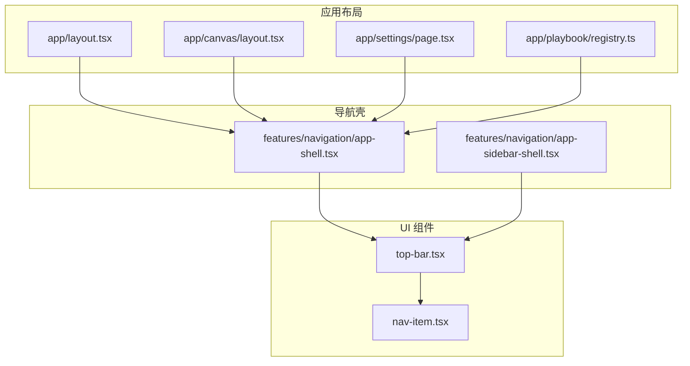
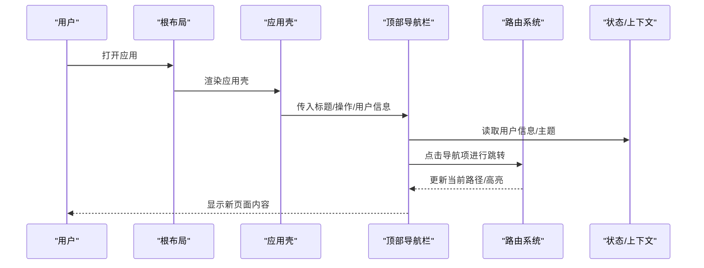
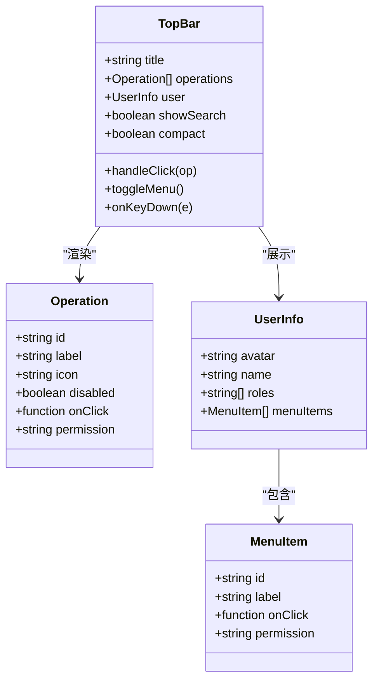
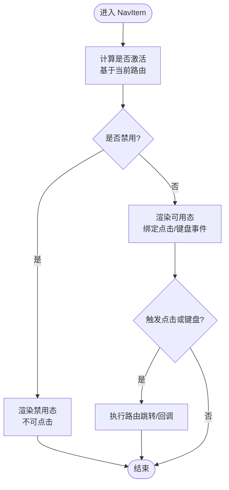
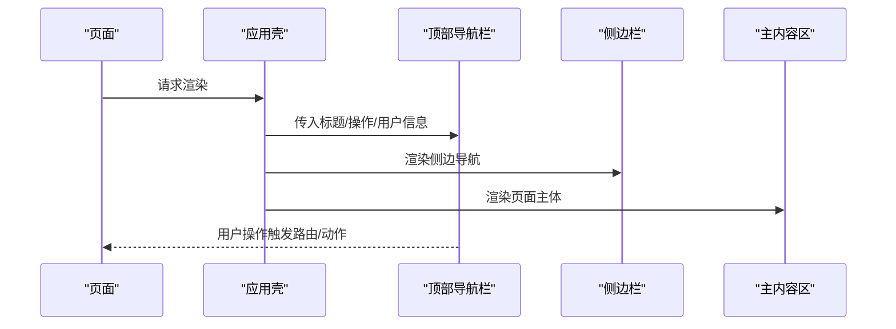
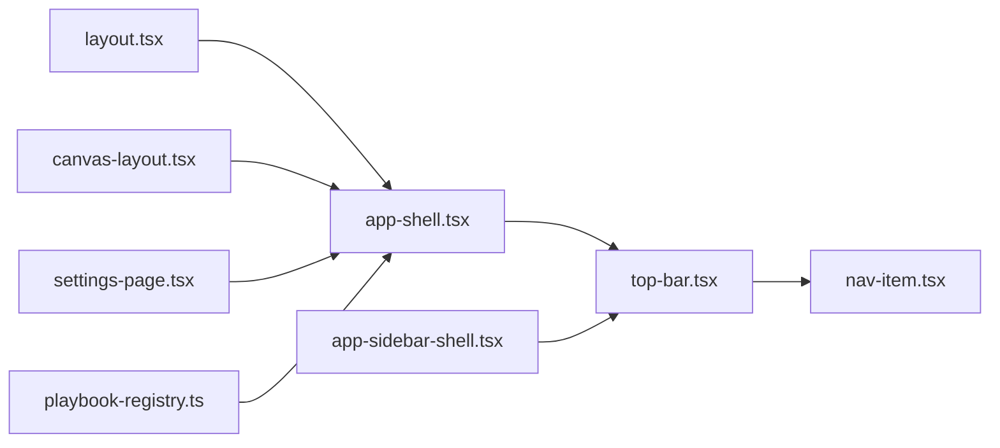

# 顶部导航栏组件

<cite>
**本文引用的文件**   
- [top-bar.tsx](file://src/components/ui/top-bar.tsx)
- [top-bar.demo.tsx](file://src/components/ui/top-bar.demo.tsx)
- [nav-item.tsx](file://src/components/ui/nav-item.tsx)
- [nav-item.demo.tsx](file://src/components/ui/nav-item.demo.tsx)
- [app-shell.tsx](file://src/features/navigation/app-shell.tsx)
- [app-sidebar-shell.tsx](file://src/features/navigation/app-sidebar-shell.tsx)
- [layout.tsx](file://src/app/layout.tsx)
- [canvas-layout.tsx](file://src/app/canvas/layout.tsx)
- [settings-page.tsx](file://src/app/settings/page.tsx)
- [playbook-registry.ts](file://src/app/playbook/registry.ts)
</cite>

## 目录
1. [简介](#简介)
2. [项目结构](#项目结构)
3. [核心组件](#核心组件)
4. [架构总览](#架构总览)
5. [详细组件分析](#详细组件分析)
6. [依赖关系分析](#依赖关系分析)
7. [性能与可访问性](#性能与可访问性)
8. [故障排查指南](#故障排查指南)
9. [结论](#结论)
10. [附录：使用示例与集成模式](#附录使用示例与集成模式)

## 简介
本文件为 CodeVideoCanvas 的“顶部导航栏”组件提供完整文档，覆盖业务功能、属性配置、状态管理、事件处理、用户交互行为、路由关联、权限控制、移动端适配、键盘导航支持以及主题定制与样式扩展方法。目标是帮助开发者快速理解并正确集成该组件，同时满足多端一致体验与可维护性要求。

## 项目结构
顶部导航栏位于 UI 层，属于通用组件；在应用壳（App Shell）中组合使用，并与页面布局、侧边栏等协作完成整体导航体验。

图表来源
- [top-bar.tsx](file://src/components/ui/top-bar.tsx)
- [nav-item.tsx](file://src/components/ui/nav-item.tsx)
- [app-shell.tsx](file://src/features/navigation/app-shell.tsx)
- [app-sidebar-shell.tsx](file://src/features/navigation/app-sidebar-shell.tsx)
- [layout.tsx](file://src/app/layout.tsx)
- [canvas-layout.tsx](file://src/app/canvas/layout.tsx)
- [settings-page.tsx](file://src/app/settings/page.tsx)
- [playbook-registry.ts](file://src/app/playbook/registry.ts)

章节来源
- [top-bar.tsx](file://src/components/ui/top-bar.tsx)
- [nav-item.tsx](file://src/components/ui/nav-item.tsx)
- [app-shell.tsx](file://src/features/navigation/app-shell.tsx)
- [app-sidebar-shell.tsx](file://src/features/navigation/app-sidebar-shell.tsx)
- [layout.tsx](file://src/app/layout.tsx)
- [canvas-layout.tsx](file://src/app/canvas/layout.tsx)
- [settings-page.tsx](file://src/app/settings/page.tsx)
- [playbook-registry.ts](file://src/app/playbook/registry.ts)

## 核心组件
- 顶部导航栏（TopBar）
  - 职责：承载应用标题、全局操作按钮、用户信息展示、搜索入口、通知入口等。
  - 关键能力：响应式布局、键盘可达、无障碍标签、主题变量接入、可插拔插槽（如右侧操作区）。
- 导航项（NavItem）
  - 职责：渲染单个导航链接或按钮，支持激活态、禁用态、图标与文本组合。
  - 关键能力：路由联动、焦点管理、ARIA 语义。

章节来源
- [top-bar.tsx](file://src/components/ui/top-bar.tsx)
- [nav-item.tsx](file://src/components/ui/nav-item.tsx)

## 架构总览
顶部导航栏作为应用壳的一部分，由根布局注入到各页面容器。导航项通过路由库驱动高亮与跳转；用户信息与全局操作通常由上层状态管理或上下文提供。

图表来源
- [layout.tsx](file://src/app/layout.tsx)
- [app-shell.tsx](file://src/features/navigation/app-shell.tsx)
- [top-bar.tsx](file://src/components/ui/top-bar.tsx)
- [nav-item.tsx](file://src/components/ui/nav-item.tsx)

## 详细组件分析

### 顶部导航栏（TopBar）
- 业务功能
  - 应用标题：居中或左侧固定，支持品牌标识与文案。
  - 全局操作按钮：如新建、导出、设置、帮助等，支持分组与分隔。
  - 用户信息展示：头像、用户名、下拉菜单（退出、账户设置等）。
  - 搜索与通知：可选入口，支持快捷键触发。
- 属性配置（Props）
  - 标题与副标题：用于品牌与页面上下文提示。
  - 操作列表：包含按钮类型、图标、提示文本、是否禁用、点击回调、权限标识等。
  - 用户信息：头像 URL、名称、角色/权限集合、下拉菜单项。
  - 布局选项：是否显示搜索框、通知角标、紧凑模式、最大宽度等。
  - 主题与样式：颜色变量、尺寸比例、圆角、阴影等。
- 状态管理
  - 本地状态：下拉菜单展开、搜索输入、通知面板开关。
  - 外部状态：用户登录态、权限集、主题模式、语言环境。
- 事件处理
  - 点击导航项：触发路由跳转与埋点上报。
  - 点击全局操作：调用对应服务（如创建项目、导出任务）。
  - 用户下拉：切换菜单、执行账户相关操作。
  - 键盘事件：Tab 顺序、Enter/Space 激活、Esc 关闭下拉。
- 用户交互行为
  - 响应式：小屏隐藏次要操作，折叠为更多菜单。
  - 焦点可见：聚焦态清晰，符合 WCAG 对比度要求。
  - 防抖/节流：对高频操作（如搜索）进行节流。
- 与路由的关联
  - 根据当前路径自动高亮对应导航项。
  - 支持外链与内部路由混合。
- 权限控制机制
  - 基于用户角色/权限集合过滤操作按钮与导航项。
  - 未授权时隐藏或禁用，并可记录审计日志。
- 移动端适配
  - 汉堡菜单、抽屉式操作面板、触摸友好的点击区域。
- 键盘导航支持
  - Tab/Shift+Tab 遍历、方向键在菜单内移动、Enter/Space 确认、Esc 关闭。
- 主题定制与样式扩展
  - 通过 CSS 变量或主题对象覆盖主色、背景、字体、间距。
  - 提供变体类名或数据属性以区分不同场景（如深色模式、紧凑模式）。

图表来源
- [top-bar.tsx](file://src/components/ui/top-bar.tsx)

章节来源
- [top-bar.tsx](file://src/components/ui/top-bar.tsx)

### 导航项（NavItem）
- 职责与能力
  - 渲染单个导航元素，支持图标+文本、激活态、禁用态。
  - 与路由联动，自动匹配当前路径并高亮。
  - 提供键盘可达性与 ARIA 标签。
- 属性配置（Props）
  - 目标路径、文本、图标、是否激活、是否禁用、点击回调、权限标识。
- 交互与事件
  - 点击跳转、键盘 Enter/Space 激活、Focus 可见。
- 与权限控制
  - 根据权限决定是否渲染或禁用。

图表来源
- [nav-item.tsx](file://src/components/ui/nav-item.tsx)

章节来源
- [nav-item.tsx](file://src/components/ui/nav-item.tsx)

### 应用壳（App Shell）中的集成
- 应用壳负责将顶部导航栏与侧边栏、主内容区组合，统一注入用户信息与全局操作。
- 在不同页面布局（如画布页、设置页、Playbook 页）中复用同一导航栏，保证一致性。

图表来源
- [app-shell.tsx](file://src/features/navigation/app-shell.tsx)
- [app-sidebar-shell.tsx](file://src/features/navigation/app-sidebar-shell.tsx)
- [top-bar.tsx](file://src/components/ui/top-bar.tsx)

章节来源
- [app-shell.tsx](file://src/features/navigation/app-shell.tsx)
- [app-sidebar-shell.tsx](file://src/features/navigation/app-sidebar-shell.tsx)

## 依赖关系分析
- 组件耦合
  - TopBar 依赖 NavItem 进行导航项渲染。
  - TopBar 依赖应用壳提供的用户信息与全局操作。
- 外部依赖
  - 路由库：用于跳转与高亮。
  - 状态/上下文：用户信息、权限、主题。
  - 图标库：导航项与操作按钮图标。
- 潜在循环依赖
  - 避免 TopBar 反向导入页面逻辑，保持单向依赖。

图表来源
- [top-bar.tsx](file://src/components/ui/top-bar.tsx)
- [nav-item.tsx](file://src/components/ui/nav-item.tsx)
- [app-shell.tsx](file://src/features/navigation/app-shell.tsx)
- [app-sidebar-shell.tsx](file://src/features/navigation/app-sidebar-shell.tsx)
- [layout.tsx](file://src/app/layout.tsx)
- [canvas-layout.tsx](file://src/app/canvas/layout.tsx)
- [settings-page.tsx](file://src/app/settings/page.tsx)
- [playbook-registry.ts](file://src/app/playbook/registry.ts)

章节来源
- [top-bar.tsx](file://src/components/ui/top-bar.tsx)
- [nav-item.tsx](file://src/components/ui/nav-item.tsx)
- [app-shell.tsx](file://src/features/navigation/app-shell.tsx)
- [app-sidebar-shell.tsx](file://src/features/navigation/app-sidebar-shell.tsx)
- [layout.tsx](file://src/app/layout.tsx)
- [canvas-layout.tsx](file://src/app/canvas/layout.tsx)
- [settings-page.tsx](file://src/app/settings/page.tsx)
- [playbook-registry.ts](file://src/app/playbook/registry.ts)

## 性能与可访问性
- 性能
  - 懒加载：仅在需要时加载重型操作（如导出弹窗）。
  - 列表优化：操作项与导航项采用稳定 key，减少重渲染。
  - 事件节流：搜索输入与滚动相关事件进行节流。
- 可访问性
  - 语义化标签：header、nav、button、a 等正确使用。
  - 键盘可达：完整的 Tab 顺序与快捷键支持。
  - ARIA：aria-label、aria-expanded、aria-current 等标注。
  - 对比度与焦点可见：遵循 WCAG 标准。

[本节为通用指导，不直接分析具体文件]

## 故障排查指南
- 常见问题
  - 导航项未高亮：检查当前路径与路由匹配规则是否正确。
  - 操作按钮无响应：确认权限校验与回调绑定。
  - 移动端布局错乱：检查断点与折叠菜单逻辑。
  - 键盘无法操作：验证焦点管理与事件监听。
- 调试建议
  - 打印用户信息与权限集合，确认过滤逻辑。
  - 使用浏览器开发者工具检查 ARIA 属性与焦点顺序。
  - 在测试用例中模拟路由变化与用户操作。

章节来源
- [top-bar.tsx](file://src/components/ui/top-bar.tsx)
- [nav-item.tsx](file://src/components/ui/nav-item.tsx)

## 结论
顶部导航栏作为应用壳的关键组成部分，提供了统一的导航与全局操作入口。通过清晰的属性配置、稳健的状态管理、完善的键盘与无障碍支持，以及与路由和权限系统的紧密集成，能够在多端环境下保持一致的用户体验。结合主题定制与样式扩展，能够灵活适配不同品牌与业务需求。

[本节为总结，不直接分析具体文件]

## 附录：使用示例与集成模式
- 基础用法
  - 在应用壳中引入顶部导航栏，传入标题、操作列表与用户信息。
  - 导航项使用路由路径与权限标识，确保高亮与访问控制。
- 高级用法
  - 动态操作：根据用户角色或页面上下文生成操作列表。
  - 主题切换：通过主题上下文切换导航栏配色与尺寸。
  - 国际化：为标题、操作文案与提示文本提供多语言支持。
- 参考示例
  - 演示文件展示了常见组合与交互方式，可作为集成起点。

章节来源
- [top-bar.demo.tsx](file://src/components/ui/top-bar.demo.tsx)
- [nav-item.demo.tsx](file://src/components/ui/nav-item.demo.tsx)