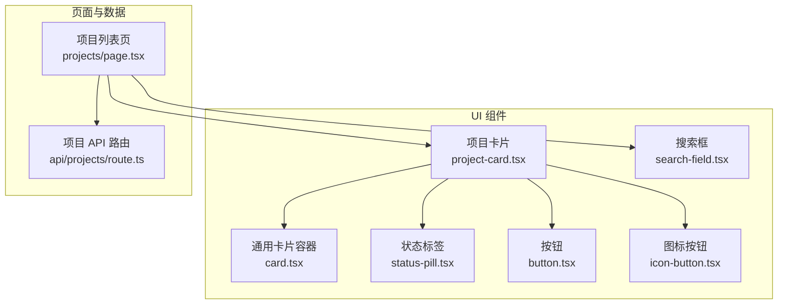
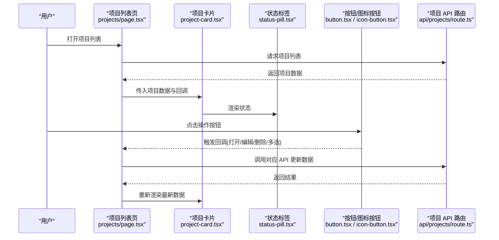
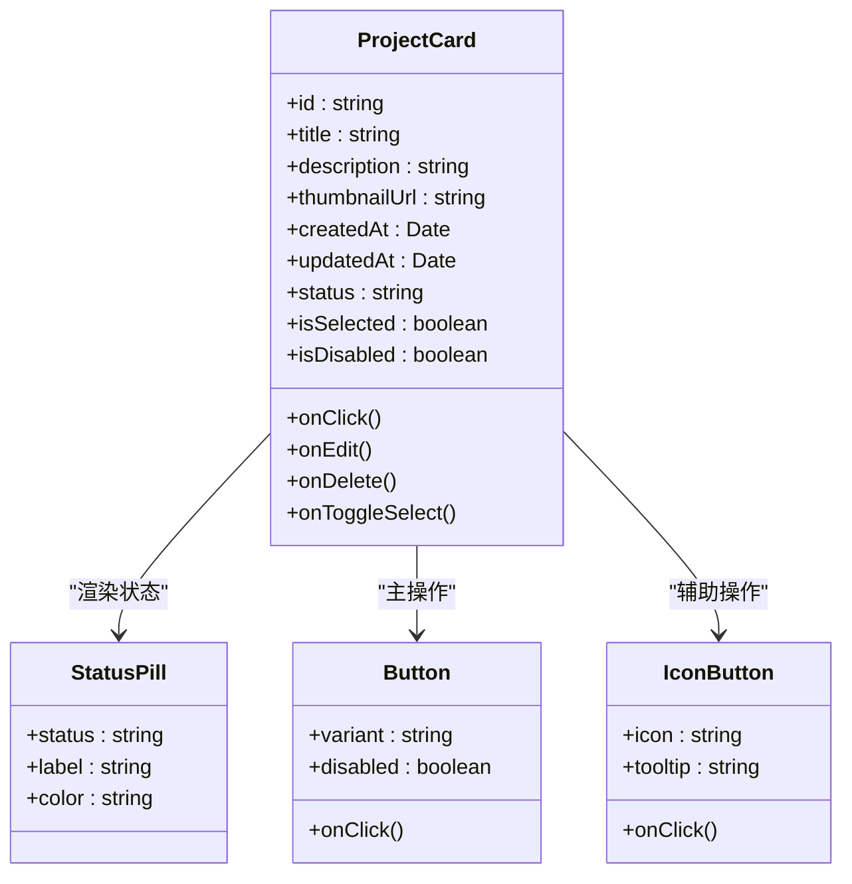
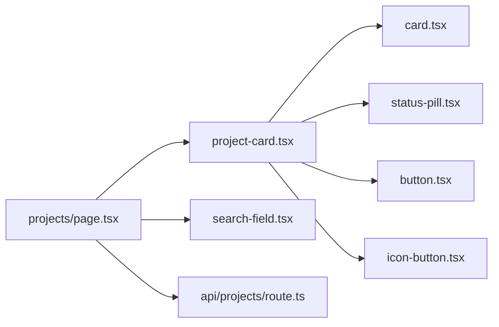

# 项目卡片组件

<cite>
**本文引用的文件**   
- [project-card.tsx](file://src/components/ui/project-card.tsx)
- [project-card.demo.tsx](file://src/components/ui/project-card.demo.tsx)
- [card.tsx](file://src/components/ui/card.tsx)
- [status-pill.tsx](file://src/components/ui/status-pill.tsx)
- [button.tsx](file://src/components/ui/button.tsx)
- [icon-button.tsx](file://src/components/ui/icon-button.tsx)
- [search-field.tsx](file://src/components/ui/search-field.tsx)
- [projects/page.tsx](file://src/app/projects/page.tsx)
- [api/projects/route.ts](file://src/app/api/projects/route.ts)
</cite>

## 目录
1. [简介](#简介)
2. [项目结构](#项目结构)
3. [核心组件与职责](#核心组件与职责)
4. [架构总览](#架构总览)
5. [详细组件分析](#详细组件分析)
6. [依赖关系分析](#依赖关系分析)
7. [性能考虑](#性能考虑)
8. [故障排查指南](#故障排查指南)
9. [结论](#结论)
10. [附录：使用示例与集成模式](#附录使用示例与集成模式)

## 简介
本项目卡片组件用于在“项目管理”场景中展示单个项目的关键信息，包括项目名称、描述、缩略图、状态标识以及常用操作按钮。该组件强调可复用性与可组合性，通过受控数据绑定与事件回调机制，与上层页面或列表容器协作完成搜索过滤、拖拽排序、批量操作等交互。同时，组件与后端 API 解耦，由上层负责数据获取与同步，确保 UI 层专注表现与交互。

## 项目结构
- 组件位于 UI 基础库目录中，便于跨页面复用。
- 演示文件提供最小可用示例，帮助快速上手。
- 页面与 API 路由作为集成参考，说明数据如何流入与流出组件。

图表来源
- [project-card.tsx](file://src/components/ui/project-card.tsx)
- [card.tsx](file://src/components/ui/card.tsx)
- [status-pill.tsx](file://src/components/ui/status-pill.tsx)
- [button.tsx](file://src/components/ui/button.tsx)
- [icon-button.tsx](file://src/components/ui/icon-button.tsx)
- [search-field.tsx](file://src/components/ui/search-field.tsx)
- [projects/page.tsx](file://src/app/projects/page.tsx)
- [api/projects/route.ts](file://src/app/api/projects/route.ts)

章节来源
- [project-card.tsx](file://src/components/ui/project-card.tsx)
- [project-card.demo.tsx](file://src/components/ui/project-card.demo.tsx)
- [projects/page.tsx](file://src/app/projects/page.tsx)
- [api/projects/route.ts](file://src/app/api/projects/route.ts)

## 核心组件与职责
- 项目卡片（project-card.tsx）
  - 展示项目基本信息（名称、描述、时间戳等）。
  - 显示项目缩略图（支持占位与加载态）。
  - 渲染状态指示器（如进行中、已完成、失败等）。
  - 提供操作按钮（打开、编辑、删除、更多等），通过回调与上层交互。
  - 支持选中态、悬停态、焦点态等视觉反馈。
- 通用卡片容器（card.tsx）
  - 提供统一的卡片外观、阴影、圆角、内边距等样式基座。
- 状态标签（status-pill.tsx）
  - 将业务状态映射为可读的文本与颜色标识。
- 按钮与图标按钮（button.tsx, icon-button.tsx）
  - 提供标准点击行为与可访问性支持。
- 搜索框（search-field.tsx）
  - 提供关键词输入与清除能力，供列表页进行过滤。

章节来源
- [project-card.tsx](file://src/components/ui/project-card.tsx)
- [card.tsx](file://src/components/ui/card.tsx)
- [status-pill.tsx](file://src/components/ui/status-pill.tsx)
- [button.tsx](file://src/components/ui/button.tsx)
- [icon-button.tsx](file://src/components/ui/icon-button.tsx)
- [search-field.tsx](file://src/components/ui/search-field.tsx)

## 架构总览
项目卡片采用“受控 + 回调”的模式：
- 数据侧：由页面层从 API 拉取并缓存，以 props 形式传入卡片。
- 交互侧：卡片通过回调函数通知上层执行具体动作（打开、编辑、删除、批量选择等）。
- 状态侧：状态值由外部管理，卡片仅做展示与触发。

图表来源
- [projects/page.tsx](file://src/app/projects/page.tsx)
- [project-card.tsx](file://src/components/ui/project-card.tsx)
- [status-pill.tsx](file://src/components/ui/status-pill.tsx)
- [button.tsx](file://src/components/ui/button.tsx)
- [icon-button.tsx](file://src/components/ui/icon-button.tsx)
- [api/projects/route.ts](file://src/app/api/projects/route.ts)

## 详细组件分析

### 项目卡片（project-card.tsx）
- 数据绑定
  - 接收项目实体对象作为 props，包含 id、标题、描述、封面图 URL、创建/更新时间、状态等字段。
  - 可选属性：是否选中、是否禁用、自定义类名等。
- 状态管理
  - 无内部可变状态；所有状态由父级控制，保证单向数据流。
- 事件处理
  - 暴露 onClick、onEdit、onDelete、onToggleSelect 等回调，由父级实现业务逻辑。
- 用户交互
  - 支持键盘可达性（Tab 聚焦、Enter/Space 触发）、鼠标悬停高亮、选中边框变化。
- 缩略图显示
  - 支持图片加载成功/失败回退到占位图；懒加载可通过外层容器优化。
- 状态指示
  - 通过状态标签组件将枚举状态映射为可视化徽章。
- 操作按钮
  - 提供主操作（打开/预览）与次要操作（编辑/删除/更多），按需显隐。

图表来源
- [project-card.tsx](file://src/components/ui/project-card.tsx)
- [status-pill.tsx](file://src/components/ui/status-pill.tsx)
- [button.tsx](file://src/components/ui/button.tsx)
- [icon-button.tsx](file://src/components/ui/icon-button.tsx)

章节来源
- [project-card.tsx](file://src/components/ui/project-card.tsx)
- [status-pill.tsx](file://src/components/ui/status-pill.tsx)
- [button.tsx](file://src/components/ui/button.tsx)
- [icon-button.tsx](file://src/components/ui/icon-button.tsx)

### 状态标签（status-pill.tsx）
- 功能
  - 将状态码映射为人类可读的文本与颜色。
- 扩展点
  - 新增状态时只需在映射表中添加条目，无需改动卡片。

章节来源
- [status-pill.tsx](file://src/components/ui/status-pill.tsx)

### 按钮与图标按钮（button.tsx, icon-button.tsx）
- 功能
  - 提供一致的点击体验、禁用态与可访问性支持。
- 使用建议
  - 主操作使用 Button，辅助操作使用 IconButton，避免界面拥挤。

章节来源
- [button.tsx](file://src/components/ui/button.tsx)
- [icon-button.tsx](file://src/components/ui/icon-button.tsx)

### 搜索框（search-field.tsx）
- 功能
  - 提供受控输入、清空、防抖提示等能力。
- 集成方式
  - 由列表页监听 onChange，对本地数据进行过滤后传递给卡片列表。

章节来源
- [search-field.tsx](file://src/components/ui/search-field.tsx)

## 依赖关系分析
- 组件内聚
  - 项目卡片依赖通用卡片容器、状态标签、按钮与图标按钮，形成低耦合、高内聚的 UI 单元。
- 外部依赖
  - 与 API 路由无直接耦合，通过页面层桥接，利于测试与替换数据源。
- 可能的循环依赖
  - 当前结构为单向依赖，未发现循环引用风险。

图表来源
- [project-card.tsx](file://src/components/ui/project-card.tsx)
- [card.tsx](file://src/components/ui/card.tsx)
- [status-pill.tsx](file://src/components/ui/status-pill.tsx)
- [button.tsx](file://src/components/ui/button.tsx)
- [icon-button.tsx](file://src/components/ui/icon-button.tsx)
- [search-field.tsx](file://src/components/ui/search-field.tsx)
- [projects/page.tsx](file://src/app/projects/page.tsx)
- [api/projects/route.ts](file://src/app/api/projects/route.ts)

章节来源
- [project-card.tsx](file://src/components/ui/project-card.tsx)
- [projects/page.tsx](file://src/app/projects/page.tsx)
- [api/projects/route.ts](file://src/app/api/projects/route.ts)

## 性能考虑
- 虚拟化渲染
  - 当项目数量较大时，建议使用虚拟列表（如 react-window/react-virtuoso）包裹卡片列表，仅渲染可视区域项，降低 DOM 节点数量与重排成本。
- 图片优化
  - 缩略图启用懒加载与尺寸裁剪；失败时回退到占位图，避免阻塞渲染。
- 不可变更新
  - 列表数据采用不可变更新策略，减少不必要的重渲染。
- 事件节流/防抖
  - 搜索输入与滚动事件进行防抖/节流，降低计算压力。
- 子组件拆分
  - 将卡片拆分为更小的纯展示组件，结合 React.memo 提升渲染效率。

[本节为通用性能建议，不直接分析具体文件]

## 故障排查指南
- 卡片不显示或空白
  - 检查传入的项目数据是否为空或缺少必要字段。
  - 确认缩略图 URL 是否有效，必要时查看控制台网络请求。
- 状态不正确
  - 核对状态枚举映射表，确保后端返回的状态值在映射范围内。
- 按钮点击无效
  - 确认父级是否正确传递回调函数，且未因禁用态导致拦截。
- 搜索过滤不生效
  - 检查搜索框的受控值与过滤逻辑是否一致，注意大小写与空格处理。
- 拖拽排序异常
  - 确认列表容器是否启用拖拽、是否维护了正确的索引顺序，并在拖拽结束后持久化新顺序。

章节来源
- [project-card.tsx](file://src/components/ui/project-card.tsx)
- [search-field.tsx](file://src/components/ui/search-field.tsx)
- [api/projects/route.ts](file://src/app/api/projects/route.ts)

## 结论
项目卡片组件以清晰的数据契约与事件回调为核心，配合通用 UI 组件构建出稳定、可复用的展示单元。通过页面层统一管理数据与状态，组件专注于表现与交互，易于扩展与维护。结合虚拟化、图片优化与不可变更新等策略，可在大数据量场景下保持良好性能。

[本节为总结性内容，不直接分析具体文件]

## 附录：使用示例与集成模式

### 基本用法
- 在页面中引入项目卡片与搜索框。
- 从 API 获取项目列表，按搜索词过滤后渲染卡片网格。
- 为每个卡片绑定打开、编辑、删除与选择回调。

章节来源
- [project-card.demo.tsx](file://src/components/ui/project-card.demo.tsx)
- [projects/page.tsx](file://src/app/projects/page.tsx)
- [api/projects/route.ts](file://src/app/api/projects/route.ts)

### 拖拽排序
- 使用原生 HTML5 拖拽或第三方库（如 dnd-kit）包裹卡片列表。
- 在 onDragEnd 中根据目标位置交换数组元素，并持久化新顺序。
- 为被拖拽项添加临时样式以提升用户体验。

章节来源
- [projects/page.tsx](file://src/app/projects/page.tsx)
- [project-card.tsx](file://src/components/ui/project-card.tsx)

### 批量操作
- 在卡片上增加复选框或点击卡片头部进入多选模式。
- 顶部工具栏提供“全选/反选/取消”和“批量删除/导出”等操作。
- 提交前二次确认，成功后刷新列表并清空选择。

章节来源
- [project-card.tsx](file://src/components/ui/project-card.tsx)
- [projects/page.tsx](file://src/app/projects/page.tsx)

### 搜索与过滤
- 搜索框变更时，对本地项目列表进行关键词匹配（标题、描述、状态等）。
- 支持清空按钮与最近搜索记录（可选）。
- 大列表建议结合虚拟列表与分页/无限滚动。

章节来源
- [search-field.tsx](file://src/components/ui/search-field.tsx)
- [projects/page.tsx](file://src/app/projects/page.tsx)

### 与项目管理系统的关联与数据同步
- 数据流向
  - 页面层发起 API 请求获取项目列表。
  - 将数据与回调注入卡片，卡片只读展示与触发事件。
  - 事件回调驱动页面层再次请求 API，更新本地状态并重新渲染。
- 一致性保障
  - 使用乐观更新与错误回滚策略，提升交互流畅度。
  - 在网络失败时给出明确提示，并提供重试入口。

章节来源
- [projects/page.tsx](file://src/app/projects/page.tsx)
- [api/projects/route.ts](file://src/app/api/projects/route.ts)
- [project-card.tsx](file://src/components/ui/project-card.tsx)