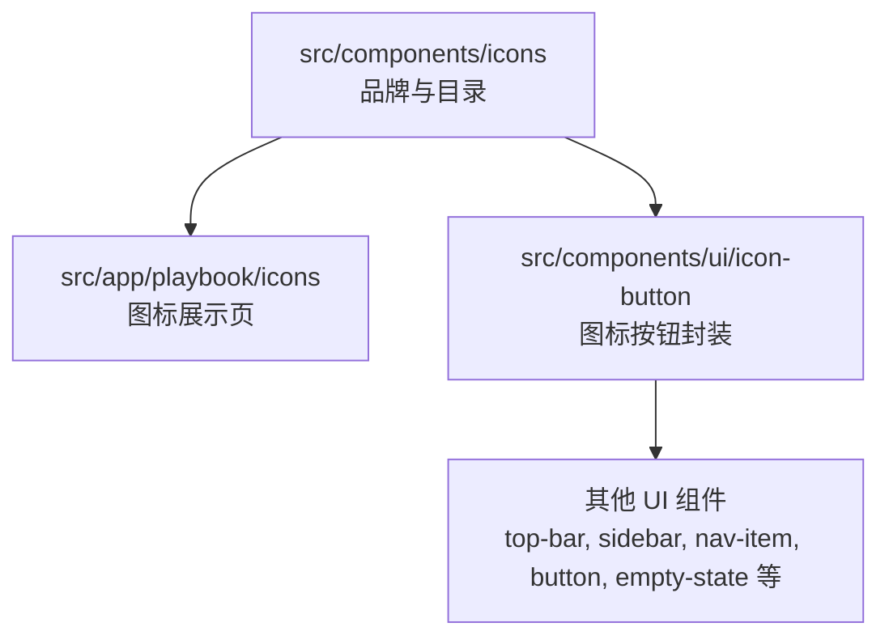
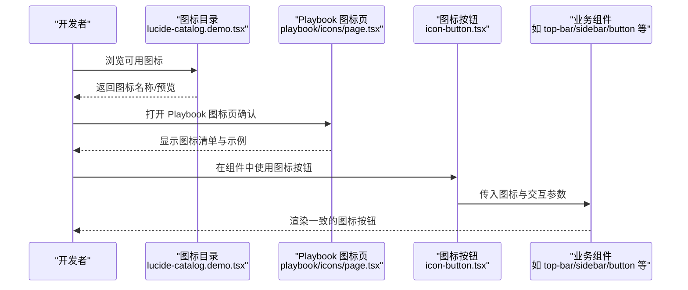
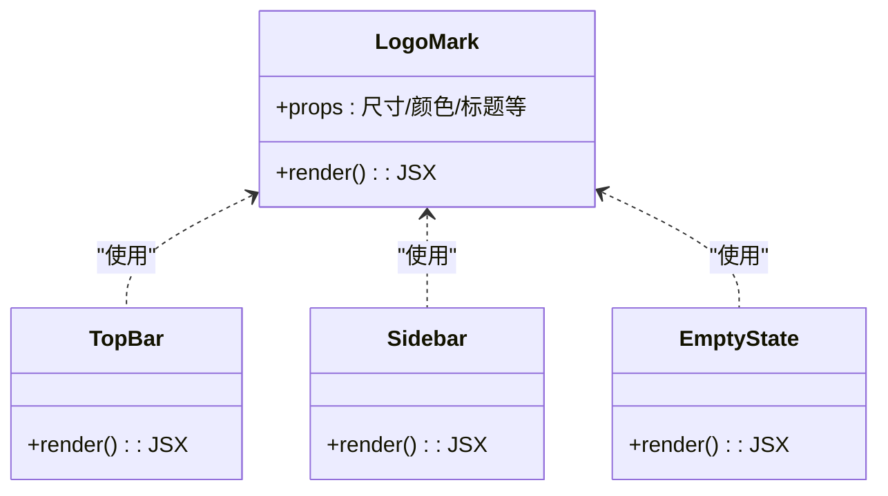
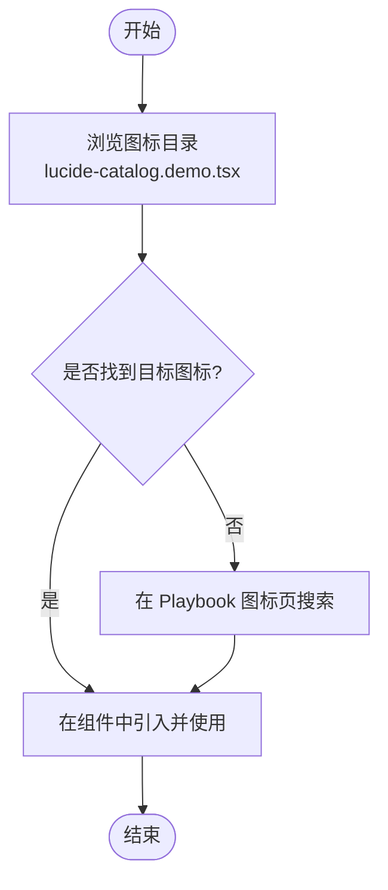
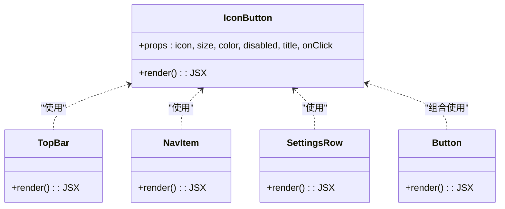
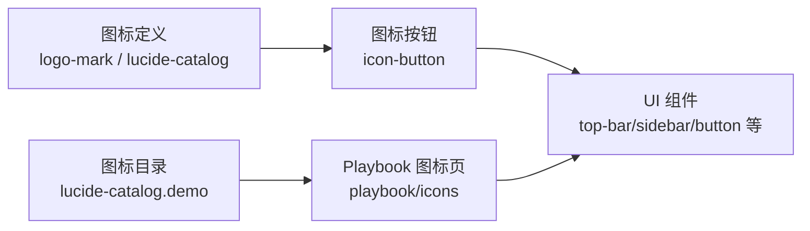

# 图标系统

<cite>
**本文引用的文件**   
- [src/components/icons/logo-mark.tsx](file://src/components/icons/logo-mark.tsx)
- [src/components/icons/logo-mark.demo.tsx](file://src/components/icons/logo-mark.demo.tsx)
- [src/components/icons/lucide-catalog.demo.tsx](file://src/components/icons/lucide-catalog.demo.tsx)
- [src/app/playbook/icons/page.tsx](file://src/app/playbook/icons/page.tsx)
- [src/components/ui/icon-button.tsx](file://src/components/ui/icon-button.tsx)
- [src/components/ui/icon-button.demo.tsx](file://src/components/ui/icon-button.demo.tsx)
- [src/components/ui/top-bar.tsx](file://src/components/ui/top-bar.tsx)
- [src/components/ui/sidebar.tsx](file://src/components/ui/sidebar.tsx)
- [src/components/ui/nav-item.tsx](file://src/components/ui/nav-item.tsx)
- [src/components/ui/button.tsx](file://src/components/ui/button.tsx)
- [src/components/ui/empty-state.tsx](file://src/components/ui/empty-state.tsx)
- [src/components/ui/status-pill.tsx](file://src/components/ui/status-pill.tsx)
- [src/components/ui/dialog.tsx](file://src/components/ui/dialog.tsx)
- [src/components/ui/search-field.tsx](file://src/components/ui/search-field.tsx)
- [src/components/ui/timeline-track.tsx](file://src/components/ui/timeline-track.tsx)
- [src/components/ui/card.tsx](file://src/components/ui/card.tsx)
- [src/components/ui/toast.tsx](file://src/components/ui/toast.tsx)
- [src/components/ui/settings-row.tsx](file://src/components/ui/settings-row.tsx)
- [src/components/ui/settings-group.tsx](file://src/components/ui/settings-group.tsx)
- [src/components/ui/tooltip.tsx](file://src/components/ui/tooltip.tsx)
- [src/components/ui/progress-bar.tsx](file://src/components/ui/progress-bar.tsx)
- [src/components/ui/resize-handle.tsx](file://src/components/ui/resize-handle.tsx)
- [src/components/ui/toggle.tsx](file://src/components/ui/toggle.tsx)
- [src/components/ui/text-field.tsx](file://src/components/ui/text-field.tsx)
- [src/components/ui/text-area.tsx](file://src/components/ui/text-area.tsx)
- [src/components/ui/project-card.tsx](file://src/components/ui/project-card.tsx)
- [src/components/ui/contact-sheet-thumb.tsx](file://src/components/ui/contact-sheet-thumb.tsx)
- [src/components/ui/node/audio-node.tsx](file://src/components/ui/node/audio-node.tsx)
- [src/components/ui/node/export-node.tsx](file://src/components/ui/node/export-node.tsx)
- [src/components/ui/node/shot-node.tsx](file://src/components/ui/node/shot-node.tsx)
- [src/components/ui/node/stage-node.tsx](file://src/components/ui/node/stage-node.tsx)
</cite>

## 目录
1. [简介](#简介)
2. [项目结构](#项目结构)
3. [核心组件](#核心组件)
4. [架构总览](#架构总览)
5. [详细组件分析](#详细组件分析)
6. [依赖关系分析](#依赖关系分析)
7. [性能与优化](#性能与优化)
8. [故障排查指南](#故障排查指南)
9. [结论](#结论)
10. [附录](#附录)

## 简介
本文件为 CodeVideoCanvas 的图标系统提供系统化文档，覆盖品牌图标、通用图标库（Lucide）的使用与管理、命名规范、SVG 格式管理与优化策略、尺寸与响应式适配、搜索与分类最佳实践，以及在 UI 组件中的应用模式与一致性要求。目标是帮助开发者快速理解并正确使用图标，确保视觉一致性与可维护性。

## 项目结构
图标相关代码主要分布在以下位置：
- 品牌图标：src/components/icons
- 通用图标目录与演示：src/components/icons
- 图标使用示例页面：src/app/playbook/icons
- 图标按钮封装与演示：src/components/ui/icon-button.*
- 广泛在 UI 组件中使用的图标入口：各 UI 组件文件

图表来源
- [src/components/icons/logo-mark.tsx](file://src/components/icons/logo-mark.tsx)
- [src/components/icons/lucide-catalog.demo.tsx](file://src/components/icons/lucide-catalog.demo.tsx)
- [src/app/playbook/icons/page.tsx](file://src/app/playbook/icons/page.tsx)
- [src/components/ui/icon-button.tsx](file://src/components/ui/icon-button.tsx)
- [src/components/ui/top-bar.tsx](file://src/components/ui/top-bar.tsx)
- [src/components/ui/sidebar.tsx](file://src/components/ui/sidebar.tsx)
- [src/components/ui/nav-item.tsx](file://src/components/ui/nav-item.tsx)
- [src/components/ui/button.tsx](file://src/components/ui/button.tsx)
- [src/components/ui/empty-state.tsx](file://src/components/ui/empty-state.tsx)

章节来源
- [src/components/icons/logo-mark.tsx](file://src/components/icons/logo-mark.tsx)
- [src/components/icons/lucide-catalog.demo.tsx](file://src/components/icons/lucide-catalog.demo.tsx)
- [src/app/playbook/icons/page.tsx](file://src/app/playbook/icons/page.tsx)
- [src/components/ui/icon-button.tsx](file://src/components/ui/icon-button.tsx)
- [src/components/ui/top-bar.tsx](file://src/components/ui/top-bar.tsx)
- [src/components/ui/sidebar.tsx](file://src/components/ui/sidebar.tsx)
- [src/components/ui/nav-item.tsx](file://src/components/ui/nav-item.tsx)
- [src/components/ui/button.tsx](file://src/components/ui/button.tsx)
- [src/components/ui/empty-state.tsx](file://src/components/ui/empty-state.tsx)

## 核心组件
- 品牌图标 LogoMark
  - 职责：渲染品牌标识图形，作为产品主视觉元素。
  - 典型用法：顶部栏、侧边栏、空状态、设置页等需要品牌露出的场景。
  - 参考路径：[src/components/icons/logo-mark.tsx](file://src/components/icons/logo-mark.tsx)、[src/components/icons/logo-mark.demo.tsx](file://src/components/icons/logo-mark.demo.tsx)

- Lucide 图标目录与演示
  - 职责：集中展示可用的 Lucide 图标集合，便于检索与选择。
  - 典型用法：通过演示页面浏览图标名称，再在业务组件中按需引入对应图标。
  - 参考路径：[src/components/icons/lucide-catalog.demo.tsx](file://src/components/icons/lucide-catalog.demo.tsx)、[src/app/playbook/icons/page.tsx](file://src/app/playbook/icons/page.tsx)

- 图标按钮 IconButton
  - 职责：将任意图标与按钮交互能力结合，统一尺寸、颜色、悬停态与无障碍属性。
  - 典型用法：工具栏、操作列、导航项、设置行等。
  - 参考路径：[src/components/ui/icon-button.tsx](file://src/components/ui/icon-button.tsx)、[src/components/ui/icon-button.demo.tsx](file://src/components/ui/icon-button.demo.tsx)

章节来源
- [src/components/icons/logo-mark.tsx](file://src/components/icons/logo-mark.tsx)
- [src/components/icons/logo-mark.demo.tsx](file://src/components/icons/logo-mark.demo.tsx)
- [src/components/icons/lucide-catalog.demo.tsx](file://src/components/icons/lucide-catalog.demo.tsx)
- [src/app/playbook/icons/page.tsx](file://src/app/playbook/icons/page.tsx)
- [src/components/ui/icon-button.tsx](file://src/components/ui/icon-button.tsx)
- [src/components/ui/icon-button.demo.tsx](file://src/components/ui/icon-button.demo.tsx)

## 架构总览
图标系统的整体使用流程如下：设计者或开发者在“图标目录”中查找所需图标，然后在业务组件中通过“图标按钮”或直接嵌入的方式使用；品牌图标用于关键界面以强化品牌识别。

图表来源
- [src/components/icons/lucide-catalog.demo.tsx](file://src/components/icons/lucide-catalog.demo.tsx)
- [src/app/playbook/icons/page.tsx](file://src/app/playbook/icons/page.tsx)
- [src/components/ui/icon-button.tsx](file://src/components/ui/icon-button.tsx)
- [src/components/ui/top-bar.tsx](file://src/components/ui/top-bar.tsx)
- [src/components/ui/sidebar.tsx](file://src/components/ui/sidebar.tsx)
- [src/components/ui/button.tsx](file://src/components/ui/button.tsx)

## 详细组件分析

### 品牌图标 LogoMark
- 角色定位：品牌标识，强调品牌一致性。
- 常见使用位置：顶部栏、侧边栏、空状态、设置页等。
- 建议：
  - 保持最小安全间距与对比度。
  - 避免过度缩放导致边缘模糊。
  - 在深色/浅色主题下分别校验可读性。

图表来源
- [src/components/icons/logo-mark.tsx](file://src/components/icons/logo-mark.tsx)
- [src/components/ui/top-bar.tsx](file://src/components/ui/top-bar.tsx)
- [src/components/ui/sidebar.tsx](file://src/components/ui/sidebar.tsx)
- [src/components/ui/empty-state.tsx](file://src/components/ui/empty-state.tsx)

章节来源
- [src/components/icons/logo-mark.tsx](file://src/components/icons/logo-mark.tsx)
- [src/components/ui/top-bar.tsx](file://src/components/ui/top-bar.tsx)
- [src/components/ui/sidebar.tsx](file://src/components/ui/sidebar.tsx)
- [src/components/ui/empty-state.tsx](file://src/components/ui/empty-state.tsx)

### 通用图标库 Lucide
- 管理方式：通过演示目录集中展示，便于检索与选择。
- 使用方式：在业务组件中直接引用具体图标组件。
- 建议：
  - 优先使用官方 Lucide 图标，保证风格一致。
  - 新增自定义图标时遵循命名与尺寸规范。

图表来源
- [src/components/icons/lucide-catalog.demo.tsx](file://src/components/icons/lucide-catalog.demo.tsx)
- [src/app/playbook/icons/page.tsx](file://src/app/playbook/icons/page.tsx)

章节来源
- [src/components/icons/lucide-catalog.demo.tsx](file://src/components/icons/lucide-catalog.demo.tsx)
- [src/app/playbook/icons/page.tsx](file://src/app/playbook/icons/page.tsx)

### 图标按钮 IconButton
- 职责：封装图标与按钮行为，统一尺寸、颜色、悬停态与无障碍属性。
- 典型属性：图标、尺寸、颜色、禁用态、提示文本、点击回调等。
- 使用模式：在工具栏、导航项、设置行、卡片操作区等高频场景复用。

图表来源
- [src/components/ui/icon-button.tsx](file://src/components/ui/icon-button.tsx)
- [src/components/ui/top-bar.tsx](file://src/components/ui/top-bar.tsx)
- [src/components/ui/nav-item.tsx](file://src/components/ui/nav-item.tsx)
- [src/components/ui/settings-row.tsx](file://src/components/ui/settings-row.tsx)
- [src/components/ui/button.tsx](file://src/components/ui/button.tsx)

章节来源
- [src/components/ui/icon-button.tsx](file://src/components/ui/icon-button.tsx)
- [src/components/ui/icon-button.demo.tsx](file://src/components/ui/icon-button.demo.tsx)
- [src/components/ui/top-bar.tsx](file://src/components/ui/top-bar.tsx)
- [src/components/ui/nav-item.tsx](file://src/components/ui/nav-item.tsx)
- [src/components/ui/settings-row.tsx](file://src/components/ui/settings-row.tsx)
- [src/components/ui/button.tsx](file://src/components/ui/button.tsx)

### 图标在 UI 组件中的分布
- 导航与布局：top-bar、sidebar、nav-item
- 表单与反馈：search-field、text-field、text-area、dialog、toast、tooltip、status-pill、progress-bar
- 媒体与节点：timeline-track、contact-sheet-thumb、audio-node、export-node、shot-node、stage-node
- 通用容器：card、button、empty-state、toggle、resize-handle、project-card

这些组件通过统一的图标按钮或直接嵌入图标，确保一致的视觉语言与交互体验。

章节来源
- [src/components/ui/top-bar.tsx](file://src/components/ui/top-bar.tsx)
- [src/components/ui/sidebar.tsx](file://src/components/ui/sidebar.tsx)
- [src/components/ui/nav-item.tsx](file://src/components/ui/nav-item.tsx)
- [src/components/ui/search-field.tsx](file://src/components/ui/search-field.tsx)
- [src/components/ui/text-field.tsx](file://src/components/ui/text-field.tsx)
- [src/components/ui/text-area.tsx](file://src/components/ui/text-area.tsx)
- [src/components/ui/dialog.tsx](file://src/components/ui/dialog.tsx)
- [src/components/ui/toast.tsx](file://src/components/ui/toast.tsx)
- [src/components/ui/tooltip.tsx](file://src/components/ui/tooltip.tsx)
- [src/components/ui/status-pill.tsx](file://src/components/ui/status-pill.tsx)
- [src/components/ui/progress-bar.tsx](file://src/components/ui/progress-bar.tsx)
- [src/components/ui/timeline-track.tsx](file://src/components/ui/timeline-track.tsx)
- [src/components/ui/contact-sheet-thumb.tsx](file://src/components/ui/contact-sheet-thumb.tsx)
- [src/components/ui/card.tsx](file://src/components/ui/card.tsx)
- [src/components/ui/button.tsx](file://src/components/ui/button.tsx)
- [src/components/ui/empty-state.tsx](file://src/components/ui/empty-state.tsx)
- [src/components/ui/toggle.tsx](file://src/components/ui/toggle.tsx)
- [src/components/ui/resize-handle.tsx](file://src/components/ui/resize-handle.tsx)
- [src/components/ui/project-card.tsx](file://src/components/ui/project-card.tsx)
- [src/components/ui/node/audio-node.tsx](file://src/components/ui/node/audio-node.tsx)
- [src/components/ui/node/export-node.tsx](file://src/components/ui/node/export-node.tsx)
- [src/components/ui/node/shot-node.tsx](file://src/components/ui/node/shot-node.tsx)
- [src/components/ui/node/stage-node.tsx](file://src/components/ui/node/stage-node.tsx)

## 依赖关系分析
- 品牌图标与通用图标均被 UI 组件广泛消费，形成“图标定义 -> 图标按钮 -> 业务组件”的单向依赖链。
- 图标目录与 Playbook 页面作为“发现层”，不直接参与运行时渲染，仅辅助开发与设计。

图表来源
- [src/components/icons/logo-mark.tsx](file://src/components/icons/logo-mark.tsx)
- [src/components/icons/lucide-catalog.demo.tsx](file://src/components/icons/lucide-catalog.demo.tsx)
- [src/app/playbook/icons/page.tsx](file://src/app/playbook/icons/page.tsx)
- [src/components/ui/icon-button.tsx](file://src/components/ui/icon-button.tsx)
- [src/components/ui/top-bar.tsx](file://src/components/ui/top-bar.tsx)
- [src/components/ui/sidebar.tsx](file://src/components/ui/sidebar.tsx)
- [src/components/ui/button.tsx](file://src/components/ui/button.tsx)

章节来源
- [src/components/icons/logo-mark.tsx](file://src/components/icons/logo-mark.tsx)
- [src/components/icons/lucide-catalog.demo.tsx](file://src/components/icons/lucide-catalog.demo.tsx)
- [src/app/playbook/icons/page.tsx](file://src/app/playbook/icons/page.tsx)
- [src/components/ui/icon-button.tsx](file://src/components/ui/icon-button.tsx)
- [src/components/ui/top-bar.tsx](file://src/components/ui/top-bar.tsx)
- [src/components/ui/sidebar.tsx](file://src/components/ui/sidebar.tsx)
- [src/components/ui/button.tsx](file://src/components/ui/button.tsx)

## 性能与优化
- SVG 优化
  - 移除冗余节点与属性，压缩体积。
  - 使用单色填充与描边，减少渲染复杂度。
  - 避免过大的 viewBox 与不必要的滤镜。
- 加载与缓存
  - 对常用图标进行静态导入，减少动态解析开销。
  - 对大型图标集采用懒加载或按路由拆分。
- 渲染性能
  - 控制图标尺寸，避免过大像素导致的重绘。
  - 在列表或网格中复用图标实例，减少重复创建。
- 可访问性
  - 为图标按钮提供有意义的标题与键盘支持。
  - 在纯装饰性图标上忽略屏幕阅读器读取。

[本节为通用指导，无需特定文件来源]

## 故障排查指南
- 图标未显示
  - 检查是否正确引入图标组件。
  - 确认父容器尺寸与背景色是否影响可见性。
- 图标模糊或变形
  - 检查 viewBox 与尺寸比例是否匹配。
  - 避免在非整数像素边界绘制细线。
- 颜色不一致
  - 确认当前主题下的颜色变量是否生效。
  - 检查是否覆盖了默认颜色样式。
- 交互无响应
  - 对于图标按钮，检查 onClick 与 disabled 状态。
  - 确认焦点顺序与键盘可达性。

章节来源
- [src/components/ui/icon-button.tsx](file://src/components/ui/icon-button.tsx)
- [src/components/ui/icon-button.demo.tsx](file://src/components/ui/icon-button.demo.tsx)

## 结论
CodeVideoCanvas 的图标系统以品牌图标与 Lucide 通用图标为核心，通过图标按钮统一交互与外观，并在广泛的 UI 组件中保持一致的应用模式。配合演示目录与 Playbook 页面，开发者可以快速检索与选用图标，同时遵循命名、尺寸与可访问性规范，确保视觉一致性与可维护性。

[本节为总结性内容，无需特定文件来源]

## 附录

### 图标命名规范
- 品牌图标
  - 使用语义化名称，如 logo-mark。
  - 文件名与组件名保持一致，便于导入与检索。
- 通用图标
  - 使用小写连字符命名，如 arrow-left、settings。
  - 与 Lucide 官方命名保持一致，降低学习成本。
- 组合图标
  - 复合图标以功能命名，如 export-icon、shot-thumbnail。

[本节为通用规范说明，无需特定文件来源]

### SVG 格式管理与优化策略
- 源文件管理
  - 将 SVG 源文件纳入版本控制，保留可编辑源。
  - 导出优化后的 SVG 到 src/components/icons 目录。
- 优化步骤
  - 清理无用节点与属性。
  - 合并路径与形状，减少层级。
  - 统一描边宽度与圆角半径。
- 质量检查
  - 在不同主题与尺寸下验证清晰度与对比度。
  - 使用 Lighthouse 或类似工具评估资源大小与加载时间。

[本节为通用流程说明，无需特定文件来源]

### 使用方法与自定义指南
- 使用方法
  - 在业务组件中直接引入图标组件或通过图标按钮封装使用。
  - 在 Playbook 图标页检索图标名称，复制组件名到代码中。
- 自定义图标
  - 遵循现有命名与尺寸规范。
  - 在图标目录中添加演示条目，便于团队检索。
  - 提交前完成多主题与多尺寸的视觉校验。

章节来源
- [src/app/playbook/icons/page.tsx](file://src/app/playbook/icons/page.tsx)
- [src/components/icons/lucide-catalog.demo.tsx](file://src/components/icons/lucide-catalog.demo.tsx)

### 尺寸规范与响应式适配
- 基础尺寸
  - 小：16px
  - 中：20px
  - 大：24px
- 响应式策略
  - 在小屏设备上优先使用中等尺寸，避免过小不可点击。
  - 在大屏设备上根据信息密度调整尺寸。
- 对齐与留白
  - 图标与文字基线对齐，保持视觉平衡。
  - 为图标按钮提供足够的点击区域（至少 24x24）。

[本节为通用规范说明，无需特定文件来源]

### 图标搜索与分类最佳实践
- 分类维度
  - 功能类：导航、操作、状态、媒体、数据可视化。
  - 场景类：播放器、编辑器、设置、反馈。
- 检索技巧
  - 在 Playbook 图标页使用关键词过滤。
  - 在图标目录中按字母序浏览，提高命中率。
- 团队协作
  - 新增图标需同步更新目录与演示。
  - 建立图标评审机制，确保风格一致。

章节来源
- [src/app/playbook/icons/page.tsx](file://src/app/playbook/icons/page.tsx)
- [src/components/icons/lucide-catalog.demo.tsx](file://src/components/icons/lucide-catalog.demo.tsx)

### 组件应用模式与一致性要求
- 应用模式
  - 导航与工具栏：使用图标按钮承载操作意图。
  - 状态与反馈：使用小型图标增强可读性。
  - 媒体与节点：使用具象图标表达领域概念。
- 一致性要求
  - 统一尺寸、颜色与悬停态。
  - 为所有可交互图标提供标题与键盘支持。
  - 在深色/浅色主题下分别校验对比度与可读性。

章节来源
- [src/components/ui/icon-button.tsx](file://src/components/ui/icon-button.tsx)
- [src/components/ui/top-bar.tsx](file://src/components/ui/top-bar.tsx)
- [src/components/ui/sidebar.tsx](file://src/components/ui/sidebar.tsx)
- [src/components/ui/nav-item.tsx](file://src/components/ui/nav-item.tsx)
- [src/components/ui/status-pill.tsx](file://src/components/ui/status-pill.tsx)
- [src/components/ui/toast.tsx](file://src/components/ui/toast.tsx)
- [src/components/ui/timeline-track.tsx](file://src/components/ui/timeline-track.tsx)
- [src/components/ui/node/audio-node.tsx](file://src/components/ui/node/audio-node.tsx)
- [src/components/ui/node/export-node.tsx](file://src/components/ui/node/export-node.tsx)
- [src/components/ui/node/shot-node.tsx](file://src/components/ui/node/shot-node.tsx)
- [src/components/ui/node/stage-node.tsx](file://src/components/ui/node/stage-node.tsx)