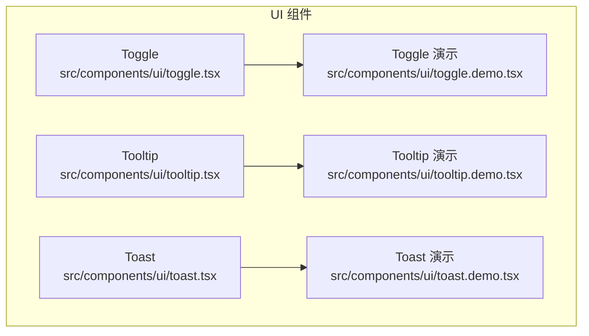
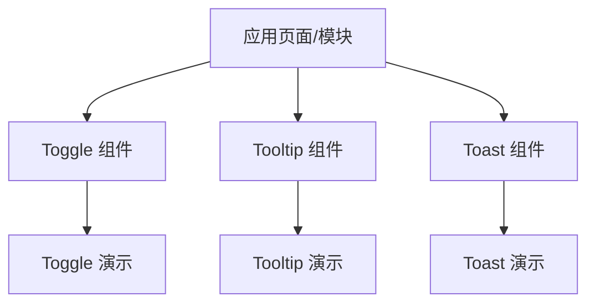
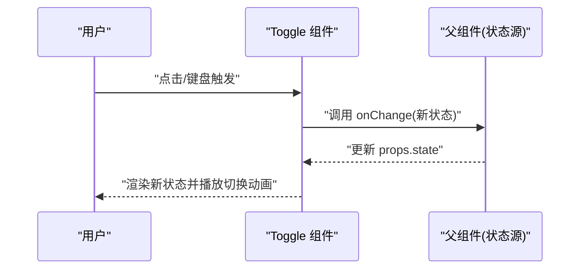
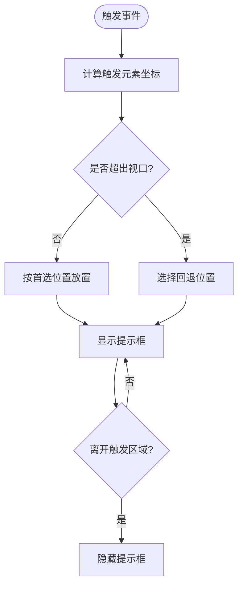
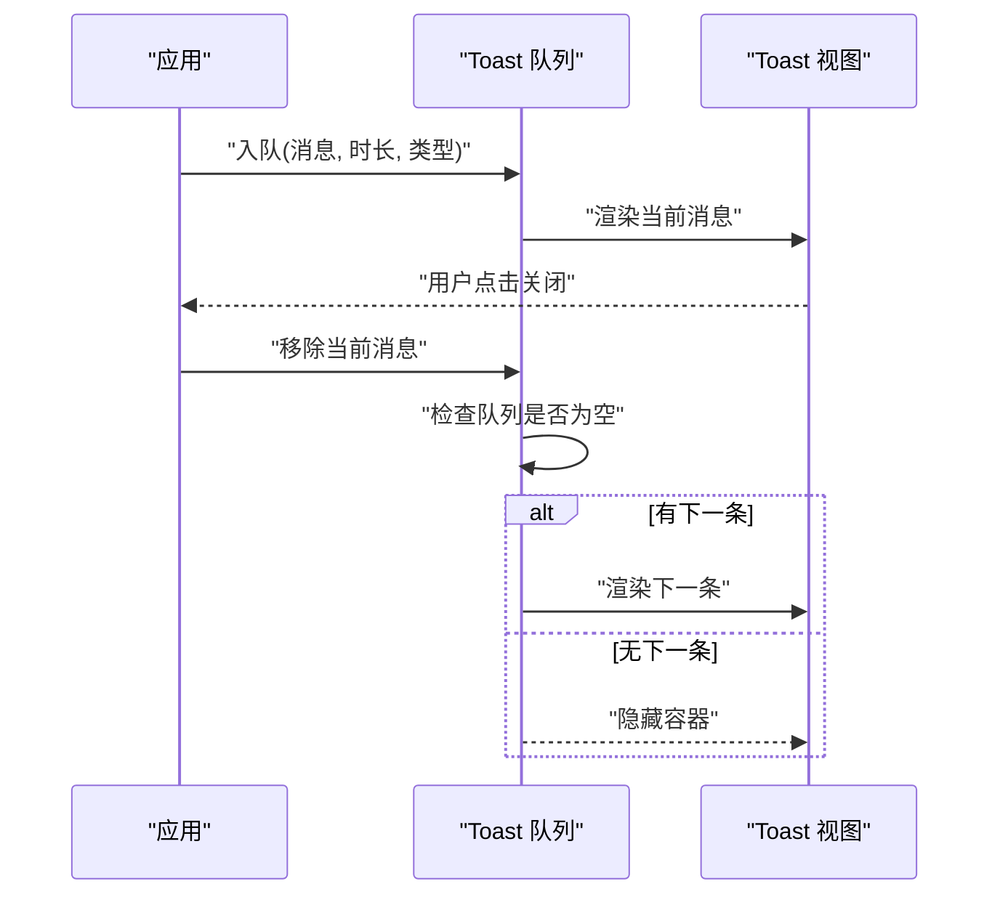
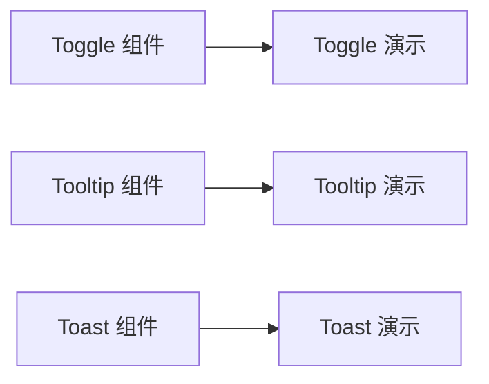

# 交互反馈组件

<cite>
**本文引用的文件**   
- [toggle.tsx](file://src/components/ui/toggle.tsx)
- [toggle.demo.tsx](file://src/components/ui/toggle.demo.tsx)
- [tooltip.tsx](file://src/components/ui/tooltip.tsx)
- [tooltip.demo.tsx](file://src/components/ui/tooltip.demo.tsx)
- [toast.tsx](file://src/components/ui/toast.tsx)
- [toast.demo.tsx](file://src/components/ui/toast.demo.tsx)
</cite>

## 目录
1. [简介](#简介)
2. [项目结构](#项目结构)
3. [核心组件](#核心组件)
4. [架构总览](#架构总览)
5. [详细组件分析](#详细组件分析)
6. [依赖分析](#依赖分析)
7. [性能考虑](#性能考虑)
8. [故障排查指南](#故障排查指南)
9. [结论](#结论)
10. [附录](#附录)

## 简介
本文件面向 CodeVideoCanvas 的交互反馈组件系列，聚焦 Toggle、Tooltip 与 Toast 三个基础 UI 组件。文档从功能特性、使用场景、状态管理、定位算法、消息队列、可访问性与最佳实践等维度进行系统化说明，并提供丰富的示例路径，帮助读者快速上手并高质量集成到业务中。

## 项目结构
交互反馈组件位于 src/components/ui 目录下，每个组件均提供实现与演示文件：
- Toggle：开关控件，用于二选一的状态切换
- Tooltip：悬停提示框，用于补充说明或快捷操作
- Toast：轻量通知，用于成功、警告、错误等即时反馈

图表来源
- [toggle.tsx:1-200](file://src/components/ui/toggle.tsx#L1-L200)
- [toggle.demo.tsx:1-200](file://src/components/ui/toggle.demo.tsx#L1-L200)
- [tooltip.tsx:1-200](file://src/components/ui/tooltip.tsx#L1-L200)
- [tooltip.demo.tsx:1-200](file://src/components/ui/tooltip.demo.tsx#L1-L200)
- [toast.tsx:1-200](file://src/components/ui/toast.tsx#L1-L200)
- [toast.demo.tsx:1-200](file://src/components/ui/toast.demo.tsx#L1-L200)

章节来源
- [toggle.tsx:1-200](file://src/components/ui/toggle.tsx#L1-L200)
- [toggle.demo.tsx:1-200](file://src/components/ui/toggle.demo.tsx#L1-L200)
- [tooltip.tsx:1-200](file://src/components/ui/tooltip.tsx#L1-L200)
- [tooltip.demo.tsx:1-200](file://src/components/ui/tooltip.demo.tsx#L1-L200)
- [toast.tsx:1-200](file://src/components/ui/toast.tsx#L1-L200)
- [toast.demo.tsx:1-200](file://src/components/ui/toast.demo.tsx#L1-L200)

## 核心组件
本节概述三大组件的职责与典型用法：
- Toggle：受控或非受控的开关状态，支持切换动画与自定义样式，常用于设置项、筛选器、模式切换等
- Tooltip：围绕触发元素显示提示内容，支持多种触发方式（悬停、点击、焦点）与位置策略，适合辅助说明与快捷操作
- Toast：轻量消息通知，具备消息队列、显示时长控制、自动消失与手动关闭能力，适用于操作结果反馈与系统提醒

章节来源
- [toggle.tsx:1-200](file://src/components/ui/toggle.tsx#L1-L200)
- [tooltip.tsx:1-200](file://src/components/ui/tooltip.tsx#L1-L200)
- [toast.tsx:1-200](file://src/components/ui/toast.tsx#L1-L200)

## 架构总览
三个组件在 UI 层职责清晰、相互独立，通过各自的演示文件展示组合与扩展方式。整体关系如下：

图表来源
- [toggle.tsx:1-200](file://src/components/ui/toggle.tsx#L1-L200)
- [toggle.demo.tsx:1-200](file://src/components/ui/toggle.demo.tsx#L1-L200)
- [tooltip.tsx:1-200](file://src/components/ui/tooltip.tsx#L1-L200)
- [tooltip.demo.tsx:1-200](file://src/components/ui/tooltip.demo.tsx#L1-L200)
- [toast.tsx:1-200](file://src/components/ui/toast.tsx#L1-L200)
- [toast.demo.tsx:1-200](file://src/components/ui/toast.demo.tsx#L1-L200)

## 详细组件分析

### Toggle 组件
- 功能特性
  - 支持受控与非受控两种状态管理模式
  - 提供切换动画与可定制外观（尺寸、颜色、禁用态等）
  - 暴露常用回调以响应状态变化
- 状态管理与数据流
  - 内部维护布尔型状态；若为受控模式，由父组件驱动
  - 切换时触发回调，便于上层同步业务状态
- 动画与样式
  - 基于过渡动画实现平滑切换
  - 可通过属性覆盖默认样式，适配不同主题
- 可访问性
  - 语义化标签与键盘可达性（空格/回车切换）
  - 合适的 aria-* 属性，确保屏幕阅读器友好
- 使用示例
  - 参考演示文件中的常见用法与组合方式

图表来源
- [toggle.tsx:1-200](file://src/components/ui/toggle.tsx#L1-L200)
- [toggle.demo.tsx:1-200](file://src/components/ui/toggle.demo.tsx#L1-L200)

章节来源
- [toggle.tsx:1-200](file://src/components/ui/toggle.tsx#L1-L200)
- [toggle.demo.tsx:1-200](file://src/components/ui/toggle.demo.tsx#L1-L200)

### Tooltip 组件
- 功能特性
  - 围绕触发元素显示提示内容，支持多位置策略（上、下、左、右及偏移）
  - 支持多种触发方式：悬停、点击、焦点
  - 内容可定制，支持富文本或插槽
- 定位算法
  - 计算触发元素与视口边界，避免溢出
  - 根据可用空间选择最优位置，必要时回退到备选位置
  - 支持跟随滚动与窗口缩放的重算
- 触发方式与生命周期
  - 进入触发区域显示，离开隐藏
  - 点击模式下，点击外部区域或按 Esc 关闭
- 可访问性
  - 使用合适的 role 与 aria-* 属性
  - 焦点管理与 Tab 顺序合理
- 使用示例
  - 参考演示文件中的不同触发方式与内容定制

图表来源
- [tooltip.tsx:1-200](file://src/components/ui/tooltip.tsx#L1-L200)
- [tooltip.demo.tsx:1-200](file://src/components/ui/tooltip.demo.tsx#L1-L200)

章节来源
- [tooltip.tsx:1-200](file://src/components/ui/tooltip.tsx#L1-L200)
- [tooltip.demo.tsx:1-200](file://src/components/ui/tooltip.demo.tsx#L1-L200)

### Toast 组件
- 功能特性
  - 轻量消息通知，支持成功、警告、错误等类型
  - 消息队列管理，支持同时显示多条
  - 显示时长可控，支持自动消失与手动关闭
- 消息队列与显示机制
  - 入队：新增消息加入队列末尾
  - 出队：当前显示完成后，自动取出下一条
  - 超时：到达显示时长后自动移除
  - 手动关闭：用户点击关闭按钮立即移除
- 可访问性
  - 使用适当的 role 与 aria-live 策略，确保读屏器播报
  - 提供明确的关闭操作与焦点管理
- 使用示例
  - 参考演示文件中的入队、关闭与组合用法

图表来源
- [toast.tsx:1-200](file://src/components/ui/toast.tsx#L1-L200)
- [toast.demo.tsx:1-200](file://src/components/ui/toast.demo.tsx#L1-L200)

章节来源
- [toast.tsx:1-200](file://src/components/ui/toast.tsx#L1-L200)
- [toast.demo.tsx:1-200](file://src/components/ui/toast.demo.tsx#L1-L200)

## 依赖分析
- 组件间耦合度低，各自独立，便于单独升级与维护
- 演示文件仅用于展示用法，不引入额外运行时依赖
- 建议在上层统一封装 Toast 管理器，集中处理入队与生命周期

图表来源
- [toggle.tsx:1-200](file://src/components/ui/toggle.tsx#L1-L200)
- [toggle.demo.tsx:1-200](file://src/components/ui/toggle.demo.tsx#L1-L200)
- [tooltip.tsx:1-200](file://src/components/ui/tooltip.tsx#L1-L200)
- [tooltip.demo.tsx:1-200](file://src/components/ui/tooltip.demo.tsx#L1-L200)
- [toast.tsx:1-200](file://src/components/ui/toast.tsx#L1-L200)
- [toast.demo.tsx:1-200](file://src/components/ui/toast.demo.tsx#L1-L200)

章节来源
- [toggle.tsx:1-200](file://src/components/ui/toggle.tsx#L1-L200)
- [tooltip.tsx:1-200](file://src/components/ui/tooltip.tsx#L1-L200)
- [toast.tsx:1-200](file://src/components/ui/toast.tsx#L1-L200)

## 性能考虑
- Toggle
  - 切换动画应使用 GPU 加速属性，避免重排重绘
  - 频繁切换时建议使用受控模式减少内部状态抖动
- Tooltip
  - 定位计算应避免高频重复，使用防抖/节流或仅在可见时计算
  - 大量 Tooltip 时按需渲染，避免一次性挂载过多 DOM
- Toast
  - 队列渲染采用虚拟列表或限制最大显示数量，防止长列表卡顿
  - 自动消失定时器需正确清理，避免内存泄漏

[本节为通用指导，无需源码引用]

## 故障排查指南
- Toggle
  - 现象：点击无效或状态不同步
    - 排查：确认是否受控且 props.state 已更新；检查 onChange 是否被调用
    - 参考：[toggle.tsx:1-200](file://src/components/ui/toggle.tsx#L1-L200)、[toggle.demo.tsx:1-200](file://src/components/ui/toggle.demo.tsx#L1-L200)
- Tooltip
  - 现象：提示框被遮挡或位置异常
    - 排查：检查视口边界计算与回退策略；确认滚动监听是否生效
    - 参考：[tooltip.tsx:1-200](file://src/components/ui/tooltip.tsx#L1-L200)、[tooltip.demo.tsx:1-200](file://src/components/ui/tooltip.demo.tsx#L1-L200)
- Toast
  - 现象：消息未消失或重复显示
    - 排查：检查定时器清理逻辑与队列出队条件；确认手动关闭是否中断了后续渲染
    - 参考：[toast.tsx:1-200](file://src/components/ui/toast.tsx#L1-L200)、[toast.demo.tsx:1-200](file://src/components/ui/toast.demo.tsx#L1-L200)

章节来源
- [toggle.tsx:1-200](file://src/components/ui/toggle.tsx#L1-L200)
- [toggle.demo.tsx:1-200](file://src/components/ui/toggle.demo.tsx#L1-L200)
- [tooltip.tsx:1-200](file://src/components/ui/tooltip.tsx#L1-L200)
- [tooltip.demo.tsx:1-200](file://src/components/ui/tooltip.demo.tsx#L1-L200)
- [toast.tsx:1-200](file://src/components/ui/toast.tsx#L1-L200)
- [toast.demo.tsx:1-200](file://src/components/ui/toast.demo.tsx#L1-L200)

## 结论
Toggle、Tooltip 与 Toast 构成了 CodeVideoCanvas 的基础交互反馈体系。三者职责明确、易于组合，配合演示文件可快速落地到各类业务场景。遵循可访问性与性能优化原则，可在保证用户体验的同时提升系统的稳定性与可维护性。

[本节为总结性内容，无需源码引用]

## 附录
- 使用示例路径
  - 开关控制：[toggle.demo.tsx:1-200](file://src/components/ui/toggle.demo.tsx#L1-L200)
  - 悬停提示：[tooltip.demo.tsx:1-200](file://src/components/ui/tooltip.demo.tsx#L1-L200)
  - 消息通知：[toast.demo.tsx:1-200](file://src/components/ui/toast.demo.tsx#L1-L200)
- 最佳实践
  - 统一主题与样式变量，保持视觉一致性
  - 将 Toast 入队逻辑抽象为服务，集中管理生命周期
  - 对 Tooltip 的定位计算进行缓存与增量更新，降低开销
  - 为所有交互元素提供键盘可达性与清晰的焦点指示

[本节为补充信息，无需源码引用]