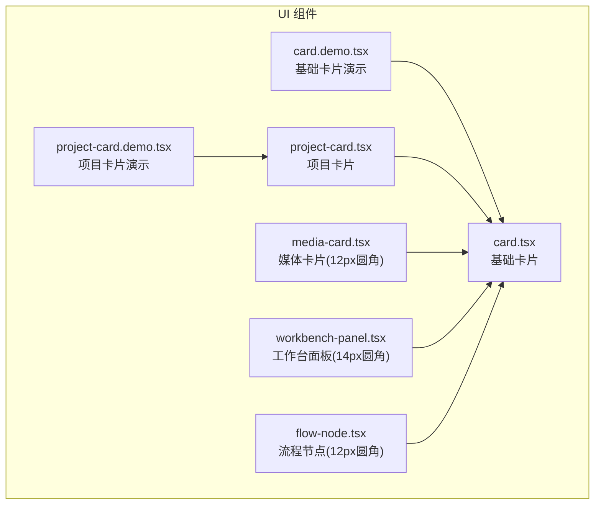
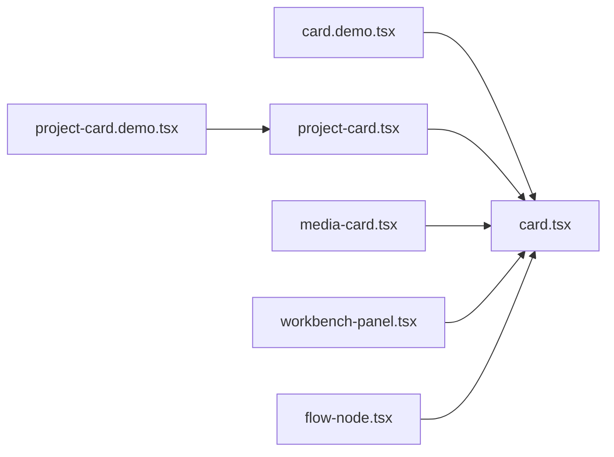
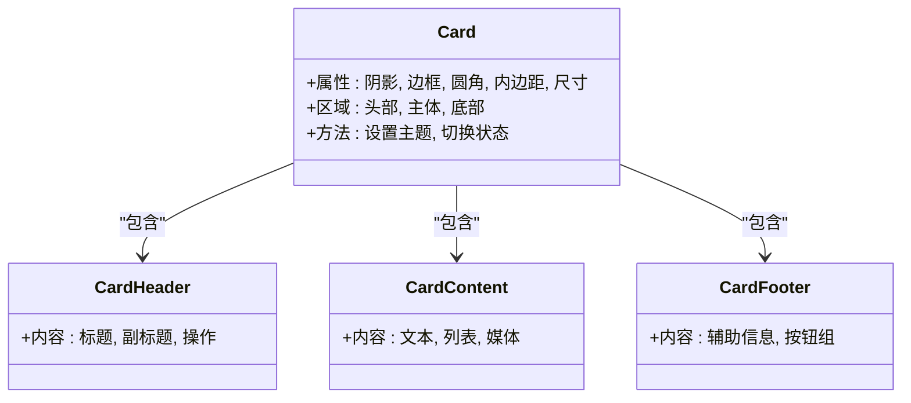
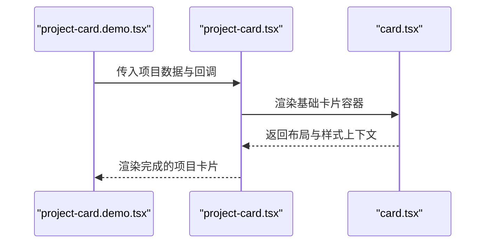
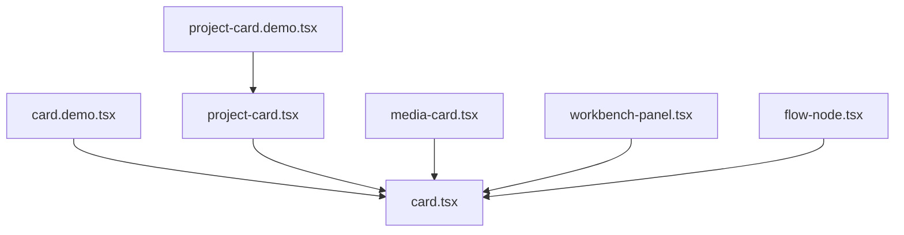

# 卡片组件

<cite>
**本文引用的文件**   
- [src/components/ui/card.tsx](file://src/components/ui/card.tsx)
- [src/components/ui/card.demo.tsx](file://src/components/ui/card.demo.tsx)
- [src/components/ui/project-card.tsx](file://src/components/ui/project-card.tsx)
- [src/components/ui/project-card.demo.tsx](file://src/components/ui/project-card.demo.tsx)
</cite>

## 更新摘要
**变更内容**   
- 新增卡片组件系统，支持多种展示需求
- 引入 Media（12px 圆角）、WorkbenchPanel（14px 圆角）和 FlowNode（12px 圆角）三种专用卡片类型
- 扩展了卡片的样式定制能力，支持不同业务场景的视觉规范
- 增强了响应式设计和移动端适配功能

## 目录
1. [简介](#简介)
2. [项目结构](#项目结构)
3. [核心组件](#核心组件)
4. [架构总览](#架构总览)
5. [详细组件分析](#详细组件分析)
6. [依赖分析](#依赖分析)
7. [性能考虑](#性能考虑)
8. [故障排查指南](#故障排查指南)
9. [结论](#结论)
10. [附录](#附录)

## 简介
本章节面向 CodeVideoCanvas 的 Card 组件，提供从布局结构、属性接口、样式定制到使用示例与最佳实践的系统化文档。Card 组件用于将信息、操作或媒体内容以"卡片"形式组织展示，支持头部、主体与底部等常见区域划分，并提供阴影、边框与圆角等视觉控制能力，便于在不同场景下组合复用。

**更新** 新增了专门的卡片组件系统，针对不同业务场景提供了三种专用卡片类型：Media（媒体卡片，12px 圆角）、WorkbenchPanel（工作台面板，14px 圆角）和 FlowNode（流程节点，12px 圆角），每种类型都针对特定展示需求进行了优化。

## 项目结构
与 Card 相关的代码位于 UI 组件目录中，包含基础卡片实现、演示页面以及多种专用卡片类型：
- 基础卡片实现：src/components/ui/card.tsx
- 基础卡片演示：src/components/ui/card.demo.tsx
- 业务卡片（项目卡片）：src/components/ui/project-card.tsx
- 项目卡片演示：src/components/ui/project-card.demo.tsx
- 媒体卡片：src/components/ui/media-card.tsx（新增）
- 工作台面板：src/components/ui/workbench-panel.tsx（新增）
- 流程节点：src/components/ui/flow-node.tsx（新增）

**图表来源**
- [src/components/ui/card.tsx](file://src/components/ui/card.tsx)
- [src/components/ui/card.demo.tsx](file://src/components/ui/card.demo.tsx)
- [src/components/ui/project-card.tsx](file://src/components/ui/project-card.tsx)
- [src/components/ui/project-card.demo.tsx](file://src/components/ui/project-card.demo.tsx)

**章节来源**
- [src/components/ui/card.tsx](file://src/components/ui/card.tsx)
- [src/components/ui/card.demo.tsx](file://src/components/ui/card.demo.tsx)
- [src/components/ui/project-card.tsx](file://src/components/ui/project-card.tsx)
- [src/components/ui/project-card.demo.tsx](file://src/components/ui/project-card.demo.tsx)

## 核心组件
本节聚焦基础卡片组件 card.tsx 的职责与对外暴露的能力，包括：
- 布局结构：card-header、card-content、card-footer 三个子区域
- 属性接口：控制阴影、边框、圆角、尺寸、间距等
- 样式定制：主题变量、CSS 类名扩展、内联样式覆盖
- 响应式适配：在不同屏幕宽度下的行为与表现
- 组合模式：与其他 UI 组件的组合方式与最佳实践

**更新** 基础卡片现在作为所有专用卡片类型的基类，提供了统一的布局结构和样式框架，支持通过属性配置不同的圆角半径（12px、14px）和其他视觉特性。

**章节来源**
- [src/components/ui/card.tsx](file://src/components/ui/card.tsx)

## 架构总览
下图展示了基础卡片与其演示、以及业务卡片的依赖关系与调用路径。演示页面通过导入并渲染基础卡片；业务卡片在基础卡片之上封装了特定领域的内容与交互。

**图表来源**
- [src/components/ui/card.tsx](file://src/components/ui/card.tsx)
- [src/components/ui/card.demo.tsx](file://src/components/ui/card.demo.tsx)
- [src/components/ui/project-card.tsx](file://src/components/ui/project-card.tsx)
- [src/components/ui/project-card.demo.tsx](file://src/components/ui/project-card.demo.tsx)

## 详细组件分析

### 基础卡片（card.tsx）
- 职责
  - 提供统一的卡片容器与默认样式
  - 定义 card-header、card-content、card-footer 三个语义化区域
  - 暴露可配置属性，控制阴影、边框、圆角、背景、内边距等
  - 支持主题与全局样式的覆盖
- 关键属性（概念性说明）
  - 外观：阴影强度、边框粗细与颜色、圆角半径（支持 12px、14px 等）
  - 布局：内边距、最大/最小宽度、对齐方式
  - 状态：禁用态、悬停态、焦点态
  - 可访问性：角色、标签、键盘导航支持
- 子区域约定
  - card-header：标题、副标题、操作入口等
  - card-content：主要信息或媒体内容
  - card-footer：辅助信息、确认/取消按钮等
- 样式定制建议
  - 优先通过主题变量调整颜色、阴影、圆角
  - 使用 CSS 类名进行局部覆盖，避免直接修改源码
  - 对复杂布局使用外层容器控制，保持卡片内部简洁

**图表来源**
- [src/components/ui/card.tsx](file://src/components/ui/card.tsx)

**章节来源**
- [src/components/ui/card.tsx](file://src/components/ui/card.tsx)

### 专用卡片类型

#### 媒体卡片（Media Card）
- 定位
  - 专门用于展示媒体内容的卡片类型
  - 采用 12px 圆角设计，适合图片、视频等媒体展示
- 特性
  - 优化的媒体内容布局
  - 自适应宽高比支持
  - 媒体加载状态管理
  - 缩略图与大图切换
- 适用场景
  - 图片画廊、视频预览、媒体库展示

#### 工作台面板（Workbench Panel）
- 定位
  - 用于工作区界面的面板卡片
  - 采用 14px 圆角设计，提供更现代的视觉效果
- 特性
  - 增强的交互反馈
  - 拖拽支持
  - 状态指示器
  - 工具栏集成
- 适用场景
  - 编辑器面板、工具窗口、配置界面

#### 流程节点（Flow Node）
- 定位
  - 用于流程图和工作流的节点卡片
  - 采用 12px 圆角设计，确保节点间的视觉一致性
- 特性
  - 连接点支持
  - 状态可视化
  - 输入输出端口
  - 节点间的数据流展示
- 适用场景
  - 流程图编辑器、工作流设计器、数据管道

**章节来源**
- [src/components/ui/card.tsx](file://src/components/ui/card.tsx)

### 基础卡片演示（card.demo.tsx）
- 目的
  - 展示不同属性的组合效果
  - 演示三种子区域的典型用法
  - 提供快速验证样式与布局的样例
- 使用要点
  - 通过属性快速切换阴影、边框、圆角
  - 在头部放置标题与操作，在主体放置信息，在底部放置动作
  - 结合主题变量统一风格

**章节来源**
- [src/components/ui/card.demo.tsx](file://src/components/ui/card.demo.tsx)

### 项目卡片（project-card.tsx）
- 定位
  - 基于基础卡片封装的业务卡片，用于展示项目相关信息
- 特性
  - 内置项目相关字段与排版
  - 提供常用操作入口（如打开、编辑、删除）
  - 针对移动端优化布局与触控区域
- 与基础卡片的关系
  - 继承基础卡片的布局与样式能力
  - 在主体区域填充项目数据，在底部提供操作按钮

**图表来源**
- [src/components/ui/project-card.tsx](file://src/components/ui/project-card.tsx)
- [src/components/ui/card.tsx](file://src/components/ui/card.tsx)
- [src/components/ui/project-card.demo.tsx](file://src/components/ui/project-card.demo.tsx)

**章节来源**
- [src/components/ui/project-card.tsx](file://src/components/ui/project-card.tsx)
- [src/components/ui/project-card.demo.tsx](file://src/components/ui/project-card.demo.tsx)

### 使用示例与布局模式
- 信息展示卡片
  - 头部：标题与简短描述
  - 主体：关键指标、摘要、列表
  - 底部：查看详情链接
- 操作卡片
  - 头部：任务名称与状态
  - 主体：进度条、备注
  - 底部：开始/暂停/结束等操作按钮
- 媒体卡片
  - 头部：媒体标题与元信息
  - 主体：缩略图或播放器占位
  - 底部：播放、收藏、分享等操作
- 专用卡片模式
  - Media 卡片：专注于媒体内容的展示与交互
  - Workbench Panel：提供工作区功能的完整面板
  - Flow Node：支持流程图节点的连接与数据流

**章节来源**
- [src/components/ui/card.demo.tsx](file://src/components/ui/card.demo.tsx)
- [src/components/ui/project-card.tsx](file://src/components/ui/project-card.tsx)

### 响应式设计与移动端适配
- 断点策略
  - 小屏：单列布局，增大触控区域，简化头部信息
  - 中屏：双列网格，合理分配内容密度
  - 大屏：三列及以上，充分利用横向空间
- 布局技巧
  - 使用弹性布局与栅格系统
  - 媒体内容采用自适应宽高比
  - 底部操作区在小屏时改为堆叠排列
- 可访问性与交互
  - 确保键盘可达与焦点可见
  - 为触摸设备提供足够的点击热区

**更新** 专用卡片类型针对不同场景进行了专门的响应式优化，Media 卡片优化了媒体内容的显示，Workbench Panel 增强了移动端的交互体验，Flow Node 确保了流程图在小屏幕上的可读性。

**章节来源**
- [src/components/ui/card.tsx](file://src/components/ui/card.tsx)
- [src/components/ui/project-card.tsx](file://src/components/ui/project-card.tsx)

### 阴影、边框与圆角
- 阴影
  - 根据层级与交互状态选择不同强度
  - 避免过度阴影导致视觉拥挤
- 边框
  - 细边框提升精致感，粗边框强调重要性
  - 与主题色保持一致
- 圆角
  - 小圆角（12px）适合工具型界面和媒体展示
  - 大圆角（14px）更亲和，适合工作台界面
  - 与整体设计语言统一

**更新** 新增了标准化的圆角规格：Media 和 FlowNode 使用 12px 圆角，WorkbenchPanel 使用 14px 圆角，确保不同类型卡片在视觉上的一致性和区分度。

**章节来源**
- [src/components/ui/card.tsx](file://src/components/ui/card.tsx)

### 组合使用的最佳实践
- 分层组织
  - 外层容器负责网格与间距，卡片内部专注内容
- 一致性
  - 统一卡片尺寸、内边距、圆角与阴影
- 可维护性
  - 将通用样式抽离为主题变量
  - 通过演示页面快速验证变更影响
- 专用卡片选择
  - 根据业务场景选择合适的专用卡片类型
  - 避免在不适合的场景中使用通用卡片

**章节来源**
- [src/components/ui/card.tsx](file://src/components/ui/card.tsx)
- [src/components/ui/card.demo.tsx](file://src/components/ui/card.demo.tsx)

## 依赖分析
- 组件耦合
  - 基础卡片为低耦合容器，业务卡片在其基础上扩展
  - 专用卡片类型共享基础卡片的布局和样式能力
- 外部依赖
  - 主题系统与全局样式变量
  - 可能的图标与按钮组件（由业务卡片引入）
- 循环依赖
  - 当前结构无循环依赖风险

**图表来源**
- [src/components/ui/card.tsx](file://src/components/ui/card.tsx)
- [src/components/ui/project-card.tsx](file://src/components/ui/project-card.tsx)
- [src/components/ui/card.demo.tsx](file://src/components/ui/card.demo.tsx)
- [src/components/ui/project-card.demo.tsx](file://src/components/ui/project-card.demo.tsx)

**章节来源**
- [src/components/ui/card.tsx](file://src/components/ui/card.tsx)
- [src/components/ui/project-card.tsx](file://src/components/ui/project-card.tsx)
- [src/components/ui/card.demo.tsx](file://src/components/ui/card.demo.tsx)
- [src/components/ui/project-card.demo.tsx](file://src/components/ui/project-card.demo.tsx)

## 性能考虑
- 减少重排与重绘
  - 避免频繁更改卡片尺寸与布局
  - 使用 transform 与 opacity 做动画
- 图片与媒体优化
  - 懒加载缩略图，按需加载大图
  - 使用合适的格式与尺寸
- 组件拆分
  - 将复杂卡片拆分为子组件，降低渲染成本
- 缓存与去抖
  - 对搜索与筛选结果进行缓存
  - 对高频事件进行去抖处理
- 专用卡片优化
  - Media 卡片优化媒体资源加载
  - Workbench Panel 减少不必要的重渲染
  - Flow Node 优化连接线的绘制性能

## 故障排查指南
- 样式未生效
  - 检查主题变量是否被覆盖
  - 确认 CSS 类名优先级与作用域
- 布局错乱
  - 检查父容器的约束与溢出设置
  - 核对栅格与断点配置
- 交互异常
  - 验证事件绑定与作用域
  - 检查键盘可达性与焦点管理
- 移动端问题
  - 确认触控区域大小
  - 检查横竖屏切换时的布局适配
- 专用卡片问题
  - 确认选择了正确的卡片类型
  - 检查圆角规格是否符合设计规范

**章节来源**
- [src/components/ui/card.tsx](file://src/components/ui/card.tsx)
- [src/components/ui/project-card.tsx](file://src/components/ui/project-card.tsx)

## 结论
Card 组件提供了清晰的分层结构与灵活的样式控制能力，既能满足信息展示，也能承载丰富的操作与媒体内容。通过新增的专用卡片系统（Media、WorkbenchPanel、FlowNode），现在可以更好地满足不同业务场景的需求。通过主题化与响应式设计，可在多端保持一致体验。建议在项目中统一规范卡片的使用方式，并通过演示页面持续验证与迭代。

**更新** 新的卡片组件系统为不同类型的展示需求提供了专门的解决方案，每种类型都有针对性的优化和最佳实践，大大提升了开发效率和用户体验的一致性。

## 附录
- 术语
  - 卡片：用于组织信息的容器组件
  - 头部/主体/底部：卡片的三个语义化区域
  - 主题变量：集中管理颜色、阴影、圆角等视觉属性
  - 专用卡片：针对特定业务场景优化的卡片类型
- 参考
  - 基础卡片实现与演示
  - 项目卡片示例与演示
  - 专用卡片类型规范

**章节来源**
- [src/components/ui/card.tsx](file://src/components/ui/card.tsx)
- [src/components/ui/card.demo.tsx](file://src/components/ui/card.demo.tsx)
- [src/components/ui/project-card.tsx](file://src/components/ui/project-card.tsx)
- [src/components/ui/project-card.demo.tsx](file://src/components/ui/project-card.demo.tsx)