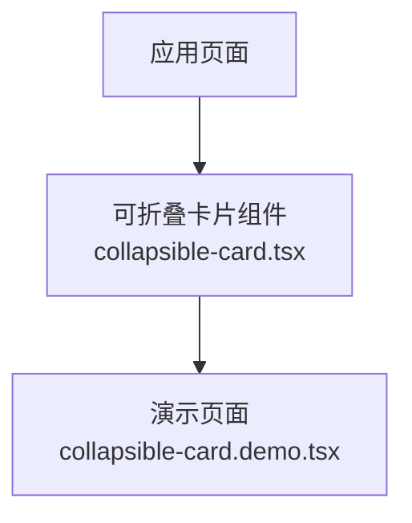
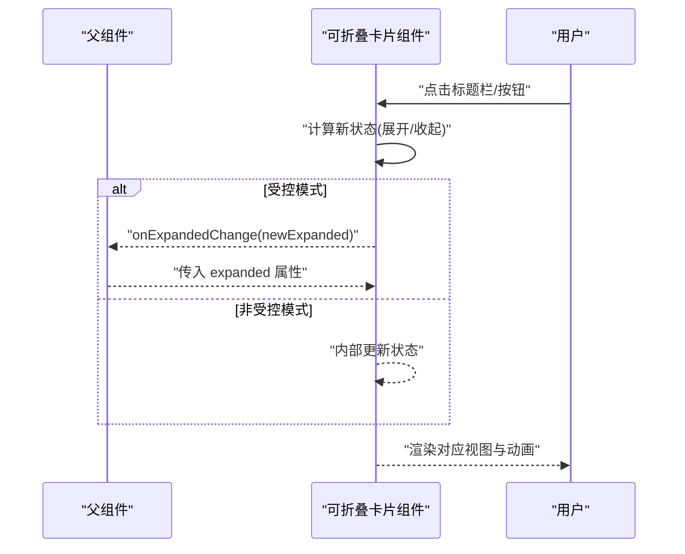
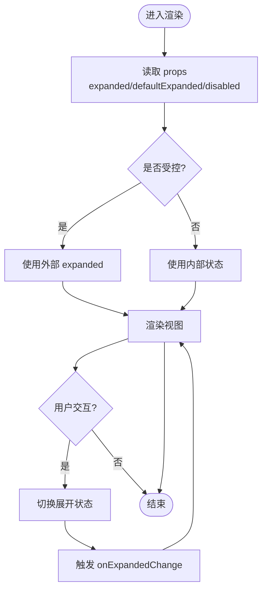
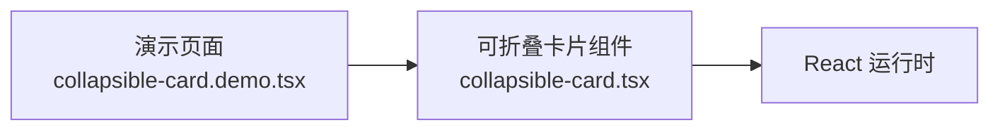

# 可折叠卡片组件

<cite>
**本文引用的文件**   
- [collapsible-card.tsx](file://src/components/ui/collapsible-card.tsx)
- [collapsible-card.demo.tsx](file://src/components/ui/collapsible-card.demo.tsx)
</cite>

## 目录
1. [简介](#简介)
2. [项目结构](#项目结构)
3. [核心组件](#核心组件)
4. [架构总览](#架构总览)
5. [详细组件分析](#详细组件分析)
6. [依赖分析](#依赖分析)
7. [性能考虑](#性能考虑)
8. [故障排查指南](#故障排查指南)
9. [结论](#结论)
10. [附录](#附录)

## 简介
本文件聚焦于“可折叠卡片”UI 组件，提供从整体到代码级的系统化说明。内容涵盖组件职责、API 设计、交互流程、状态管理、样式与动画、无障碍访问、测试与示例、以及常见问题排查建议。目标是帮助开发者快速理解并正确使用该组件，同时为后续扩展与维护提供参考。

## 项目结构
可折叠卡片组件位于 UI 组件库中，采用“功能/组件 + 演示”的组织方式：
- 组件实现：src/components/ui/collapsible-card.tsx
- 演示页面：src/components/ui/collapsible-card.demo.tsx

图表来源
- [collapsible-card.tsx](file://src/components/ui/collapsible-card.tsx)
- [collapsible-card.demo.tsx](file://src/components/ui/collapsible-card.demo.tsx)

章节来源
- [collapsible-card.tsx](file://src/components/ui/collapsible-card.tsx)
- [collapsible-card.demo.tsx](file://src/components/ui/collapsible-card.demo.tsx)

## 核心组件
- 组件名称：可折叠卡片（Collapsible Card）
- 主要职责：
  - 提供标题栏与内容区域的折叠/展开能力
  - 管理展开/收起状态与过渡动画
  - 暴露受控与非受控两种使用模式
  - 支持自定义头部、内容区域与触发行为
- 关键特性：
  - 受控模式：通过外部状态控制展开与否
  - 非受控模式：内部维护默认展开状态
  - 键盘与屏幕阅读器友好
  - 可配置动画时长与缓动
  - 可禁用交互或锁定状态

章节来源
- [collapsible-card.tsx](file://src/components/ui/collapsible-card.tsx)

## 架构总览
下图展示组件在应用中的调用关系与数据流向：父组件通过 props 传递展开状态与回调，组件内部处理用户交互并更新状态，必要时通知父组件进行同步。

图表来源
- [collapsible-card.tsx](file://src/components/ui/collapsible-card.tsx)
- [collapsible-card.demo.tsx](file://src/components/ui/collapsible-card.demo.tsx)

## 详细组件分析

### 组件类型与接口
- 公开属性（Props）
  - expanded：是否展开（受控）
  - defaultExpanded：默认展开（非受控）
  - onExpandedChange：展开状态变化回调
  - title：标题文本或节点
  - disabled：是否禁用交互
  - animationDuration：动画时长
  - children：内容区域
- 事件与副作用
  - 展开/收起切换时触发 onExpandedChange
  - 动画开始/结束可用于埋点或联动
- 无障碍
  - 提供 aria-expanded、aria-controls 等语义属性
  - 支持键盘操作（如 Enter/Space 切换）

章节来源
- [collapsible-card.tsx](file://src/components/ui/collapsible-card.tsx)

### 状态与数据流
- 状态维度
  - 展开状态：boolean
  - 动画状态：inTransition（可选）
  - 禁用状态：disabled（来自 props）
- 数据流
  - 父组件 -> 组件：expanded/defaultExpanded/disabled/children/title
  - 组件 -> 父组件：onExpandedChange
  - 内部：根据交互与 props 计算最终渲染状态

图表来源
- [collapsible-card.tsx](file://src/components/ui/collapsible-card.tsx)

### 交互与动画
- 交互入口
  - 点击标题栏或指定触发元素
  - 键盘 Enter/Space 切换
- 动画策略
  - 高度自适应过渡
  - 可配置时长与缓动函数
  - 避免布局抖动（使用 transform/max-height 等方案）

章节来源
- [collapsible-card.tsx](file://src/components/ui/collapsible-card.tsx)

### 无障碍与可访问性
- 语义化标签与属性
  - 使用合适的角色与 aria-* 属性
- 焦点管理
  - 切换后保持焦点合理
- 屏幕阅读器
  - 明确告知当前展开/收起状态

章节来源
- [collapsible-card.tsx](file://src/components/ui/collapsible-card.tsx)

### 示例与用法
- 演示页面展示了常见用法：
  - 基础折叠卡片
  - 受控模式集成
  - 禁用与只读场景
  - 自定义标题与内容
- 参考路径
  - [collapsible-card.demo.tsx](file://src/components/ui/collapsible-card.demo.tsx)

章节来源
- [collapsible-card.demo.tsx](file://src/components/ui/collapsible-card.demo.tsx)

## 依赖分析
- 组件内依赖
  - React Hooks（用于状态与副作用）
  - 可能的动画/过渡工具（若存在）
- 外部依赖
  - 无强耦合第三方 UI 库（以轻量实现为主）
- 被引用情况
  - 演示页面引用组件进行展示
  - 业务页面可按需引入使用

图表来源
- [collapsible-card.tsx](file://src/components/ui/collapsible-card.tsx)
- [collapsible-card.demo.tsx](file://src/components/ui/collapsible-card.demo.tsx)

章节来源
- [collapsible-card.tsx](file://src/components/ui/collapsible-card.tsx)
- [collapsible-card.demo.tsx](file://src/components/ui/collapsible-card.demo.tsx)

## 性能考虑
- 避免不必要的重渲染
  - 将展开状态提升到合适层级，减少子树更新
- 动画优化
  - 使用 GPU 加速的 CSS 属性
  - 合理设置动画时长，避免阻塞主线程
- 懒加载内容
  - 对重型内容按需加载，提升首屏体验

[本节为通用指导，不直接分析具体文件]

## 故障排查指南
- 现象：点击无效
  - 检查 disabled 属性
  - 确认事件绑定未被覆盖
- 现象：状态不同步
  - 受控模式下确保父组件正确更新 expanded
  - 非受控模式下检查 defaultExpanded 初始值
- 现象：动画异常或闪烁
  - 检查容器尺寸与 overflow 设置
  - 调整动画时长与缓动
- 现象：键盘不可用
  - 确认焦点管理与键盘事件处理
- 现象：屏幕阅读器未播报状态
  - 检查 aria-expanded 与相关描述

章节来源
- [collapsible-card.tsx](file://src/components/ui/collapsible-card.tsx)

## 结论
可折叠卡片组件提供了稳定、易用且可访问的折叠/展开能力，支持受控与非受控两种模式，便于在不同业务场景中复用。通过合理的状态设计与动画策略，可在保证用户体验的同时兼顾性能与可维护性。建议在复杂页面中结合路由与懒加载进一步优化渲染性能。

[本节为总结性内容，不直接分析具体文件]

## 附录
- 相关文件
  - 组件实现：[collapsible-card.tsx](file://src/components/ui/collapsible-card.tsx)
  - 演示页面：[collapsible-card.demo.tsx](file://src/components/ui/collapsible-card.demo.tsx)