# 基础组件

<cite>
**本文引用的文件**
- [button.tsx](file://src/components/ui/button.tsx)
- [button.demo.tsx](file://src/components/ui/button.demo.tsx)
- [card.tsx](file://src/components/ui/card.tsx)
- [card.demo.tsx](file://src/components/ui/card.demo.tsx)
- [dialog.tsx](file://src/components/ui/dialog.tsx)
- [dialog.demo.tsx](file://src/components/ui/dialog.demo.tsx)
- [text-field.tsx](file://src/components/ui/text-field.tsx)
- [text-field.demo.tsx](file://src/components/ui/text-field.demo.tsx)
- [text-area.tsx](file://src/components/ui/text-area.tsx)
- [text-area.demo.tsx](file://src/components/ui/text-area.demo.tsx)
- [toggle.tsx](file://src/components/ui/toggle.tsx)
- [toggle.demo.tsx](file://src/components/ui/toggle.demo.tsx)
- [toast.tsx](file://src/components/ui/toast.tsx)
- [toast.demo.tsx](file://src/components/ui/toast.demo.tsx)
- [tooltip.tsx](file://src/components/ui/tooltip.tsx)
- [tooltip.demo.tsx](file://src/components/ui/tooltip.tsx)
</cite>

## 目录
1. [简介](#简介)
2. [项目结构](#项目结构)
3. [核心组件](#核心组件)
4. [架构总览](#架构总览)
5. [详细组件分析](#详细组件分析)
6. [依赖关系分析](#依赖关系分析)
7. [性能考量](#性能考量)
8. [故障排查指南](#故障排查指南)
9. [结论](#结论)
10. [附录](#附录)

## 简介
本章节为 CodeVideoCanvas 的基础 UI 组件文档，覆盖按钮、卡片、对话框、输入框、文本域、开关、提示框与通知等核心组件。文档面向开发者与设计师，提供属性接口、事件处理、插槽使用、状态管理、样式定制与主题支持、响应式设计与无障碍访问实现细节，以及性能优化与最佳实践建议。所有说明均基于仓库中实际实现的组件源码与演示文件。

## 项目结构
基础 UI 组件位于 src/components/ui 目录下，每个组件通常包含：
- 组件实现文件（如 button.tsx）
- 对应的演示文件（如 button.demo.tsx），用于展示不同变体与组合用法

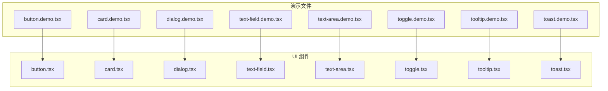

图表来源
- [button.tsx](file://src/components/ui/button.tsx)
- [button.demo.tsx](file://src/components/ui/button.demo.tsx)
- [card.tsx](file://src/components/ui/card.tsx)
- [card.demo.tsx](file://src/components/ui/card.demo.tsx)
- [dialog.tsx](file://src/components/ui/dialog.tsx)
- [dialog.demo.tsx](file://src/components/ui/dialog.demo.tsx)
- [text-field.tsx](file://src/components/ui/text-field.tsx)
- [text-field.demo.tsx](file://src/components/ui/text-field.demo.tsx)
- [text-area.tsx](file://src/components/ui/text-area.tsx)
- [text-area.demo.tsx](file://src/components/ui/text-area.demo.tsx)
- [toggle.tsx](file://src/components/ui/toggle.tsx)
- [toggle.demo.tsx](file://src/components/ui/toggle.demo.tsx)
- [tooltip.tsx](file://src/components/ui/tooltip.tsx)
- [tooltip.demo.tsx](file://src/components/ui/tooltip.demo.tsx)
- [toast.tsx](file://src/components/ui/toast.tsx)
- [toast.demo.tsx](file://src/components/ui/toast.demo.tsx)

章节来源
- [button.tsx](file://src/components/ui/button.tsx)
- [button.demo.tsx](file://src/components/ui/button.demo.tsx)
- [card.tsx](file://src/components/ui/card.tsx)
- [card.demo.tsx](file://src/components/ui/card.demo.tsx)
- [dialog.tsx](file://src/components/ui/dialog.tsx)
- [dialog.demo.tsx](file://src/components/ui/dialog.demo.tsx)
- [text-field.tsx](file://src/components/ui/text-field.tsx)
- [text-field.demo.tsx](file://src/components/ui/text-field.demo.tsx)
- [text-area.tsx](file://src/components/ui/text-area.tsx)
- [text-area.demo.tsx](file://src/components/ui/text-area.demo.tsx)
- [toggle.tsx](file://src/components/ui/toggle.tsx)
- [toggle.demo.tsx](file://src/components/ui/toggle.demo.tsx)
- [tooltip.tsx](file://src/components/ui/tooltip.tsx)
- [tooltip.demo.tsx](file://src/components/ui/tooltip.demo.tsx)
- [toast.tsx](file://src/components/ui/toast.tsx)
- [toast.demo.tsx](file://src/components/ui/toast.demo.tsx)

## 核心组件
本节概述各组件的职责与典型用法，后续章节将深入分析每个组件的属性、事件、插槽、状态管理与可访问性。

- 按钮 Button：触发操作的核心交互元素，支持多种视觉变体与尺寸，具备禁用态与加载态。
- 卡片 Card：内容容器，常用于信息分组与布局组织。
- 对话框 Dialog：模态窗口，用于重要确认或复杂表单输入。
- 输入框 TextField：单行文本输入，支持占位符、前缀/后缀图标、只读与禁用。
- 文本域 TextArea：多行文本输入，支持自动高度与字数限制。
- 开关 Toggle：布尔值切换控件，适合设置项的即时反馈。
- 提示框 Tooltip：悬停或聚焦时显示简短说明。
- 通知 Toast：轻量级非阻塞消息提示，支持成功、警告、错误等类型。

章节来源
- [button.tsx](file://src/components/ui/button.tsx)
- [card.tsx](file://src/components/ui/card.tsx)
- [dialog.tsx](file://src/components/ui/dialog.tsx)
- [text-field.tsx](file://src/components/ui/text-field.tsx)
- [text-area.tsx](file://src/components/ui/text-area.tsx)
- [toggle.tsx](file://src/components/ui/toggle.tsx)
- [tooltip.tsx](file://src/components/ui/tooltip.tsx)
- [toast.tsx](file://src/components/ui/toast.tsx)

## 架构总览
基础 UI 组件遵循统一的职责划分：
- 组件层：封装交互逻辑、状态与可访问性行为
- 演示层：通过 demo 文件展示不同变体与组合
- 样式与主题：通过 CSS 变量与类名控制外观，便于主题化

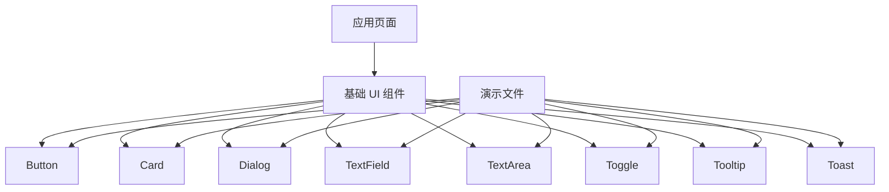

图表来源
- [button.tsx](file://src/components/ui/button.tsx)
- [button.demo.tsx](file://src/components/ui/button.demo.tsx)
- [card.tsx](file://src/components/ui/card.tsx)
- [card.demo.tsx](file://src/components/ui/card.demo.tsx)
- [dialog.tsx](file://src/components/ui/dialog.tsx)
- [dialog.demo.tsx](file://src/components/ui/dialog.demo.tsx)
- [text-field.tsx](file://src/components/ui/text-field.tsx)
- [text-field.demo.tsx](file://src/components/ui/text-field.demo.tsx)
- [text-area.tsx](file://src/components/ui/text-area.tsx)
- [text-area.demo.tsx](file://src/components/ui/text-area.demo.tsx)
- [toggle.tsx](file://src/components/ui/toggle.tsx)
- [toggle.demo.tsx](file://src/components/ui/toggle.demo.tsx)
- [tooltip.tsx](file://src/components/ui/tooltip.tsx)
- [tooltip.demo.tsx](file://src/components/ui/tooltip.demo.tsx)
- [toast.tsx](file://src/components/ui/toast.tsx)
- [toast.demo.tsx](file://src/components/ui/toast.demo.tsx)

## 详细组件分析

### 按钮 Button
- 属性接口
  - 变体：主按钮、次按钮、危险按钮等
  - 尺寸：默认、小、大
  - 状态：禁用、加载
  - 事件：点击回调
  - 插槽：图标、前置/后置内容
- 事件处理
  - onClick：统一拦截原生 click，支持异步任务与防抖
- 插槽使用
  - 支持在按钮内嵌入图标或自定义内容
- 状态管理
  - 内部维护 loading 与 disabled 状态，避免外部重复控制
- 样式定制与主题
  - 通过类名与 CSS 变量控制颜色、圆角、阴影
- 响应式设计
  - 在小屏下自动调整尺寸与间距
- 无障碍访问
  - 正确的 role、aria-disabled、aria-busy 与键盘导航

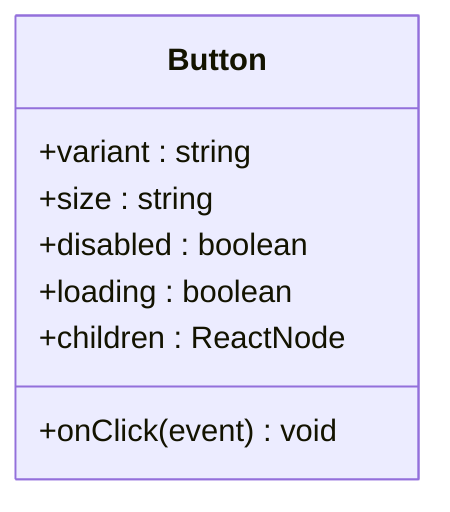

图表来源
- [button.tsx](file://src/components/ui/button.tsx)

章节来源
- [button.tsx](file://src/components/ui/button.tsx)
- [button.demo.tsx](file://src/components/ui/button.demo.tsx)

### 卡片 Card
- 属性接口
  - 布局：内边距、边框、圆角、阴影
  - 状态：选中、悬停
  - 事件：点击、悬停
  - 插槽：标题、描述、操作区、图片
- 事件处理
  - onClick/onMouseEnter/onMouseLeave：提供交互钩子
- 插槽使用
  - 灵活的头部、主体与底部插槽
- 状态管理
  - 可选受控选中态
- 样式定制与主题
  - 通过 CSS 变量与类名进行主题适配
- 响应式设计
  - 自适应宽度与堆叠布局
- 无障碍访问
  - 语义化标签与焦点管理

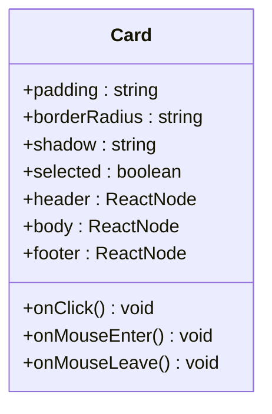

图表来源
- [card.tsx](file://src/components/ui/card.tsx)

章节来源
- [card.tsx](file://src/components/ui/card.tsx)
- [card.demo.tsx](file://src/components/ui/card.demo.tsx)

### 对话框 Dialog
- 属性接口
  - 可见性：open、onClose
  - 布局：标题、内容、页脚
  - 行为：关闭方式（点击遮罩、ESC）、阻止滚动
  - 事件：打开、关闭、确认、取消
  - 插槽：自定义头部、内容、操作按钮
- 事件处理
  - 统一处理键盘与点击事件，确保焦点锁与返回键行为
- 插槽使用
  - 支持完全自定义内容区域
- 状态管理
  - 内部维护 open 状态与焦点恢复
- 样式定制与主题
  - 通过类名与 CSS 变量控制背景、层级、动画
- 响应式设计
  - 移动端全屏、桌面端居中弹窗
- 无障碍访问
  - aria-modal、role="dialog"、焦点陷阱与屏幕阅读器支持

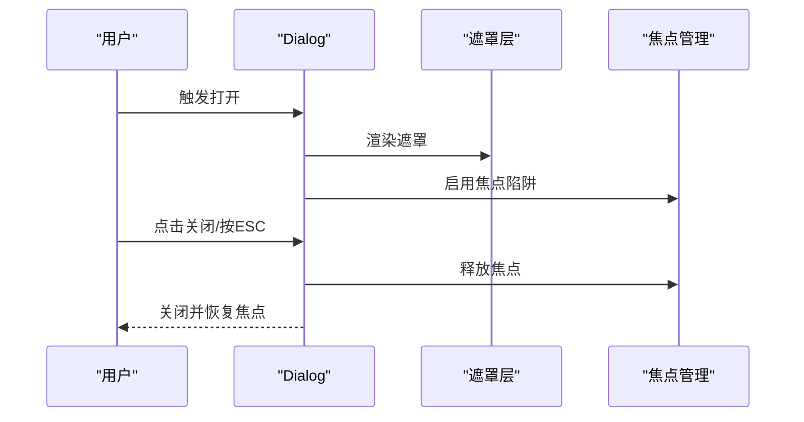

图表来源
- [dialog.tsx](file://src/components/ui/dialog.tsx)
- [dialog.demo.tsx](file://src/components/ui/dialog.demo.tsx)

章节来源
- [dialog.tsx](file://src/components/ui/dialog.tsx)
- [dialog.demo.tsx](file://src/components/ui/dialog.demo.tsx)

### 输入框 TextField
- 属性接口
  - 值与状态：value、onChange、placeholder、readOnly、disabled
  - 校验：error、helperText
  - 事件：focus、blur、input、change
  - 插槽：前缀/后缀图标、辅助说明
- 事件处理
  - 统一处理输入变更与失焦校验
- 插槽使用
  - 支持在输入框前后插入图标或操作按钮
- 状态管理
  - 受控与非受控模式均可
- 样式定制与主题
  - 通过类名与 CSS 变量控制边框、颜色、错误态
- 响应式设计
  - 在小屏下自动调整字号与间距
- 无障碍访问
  - label 关联、aria-invalid、aria-describedby

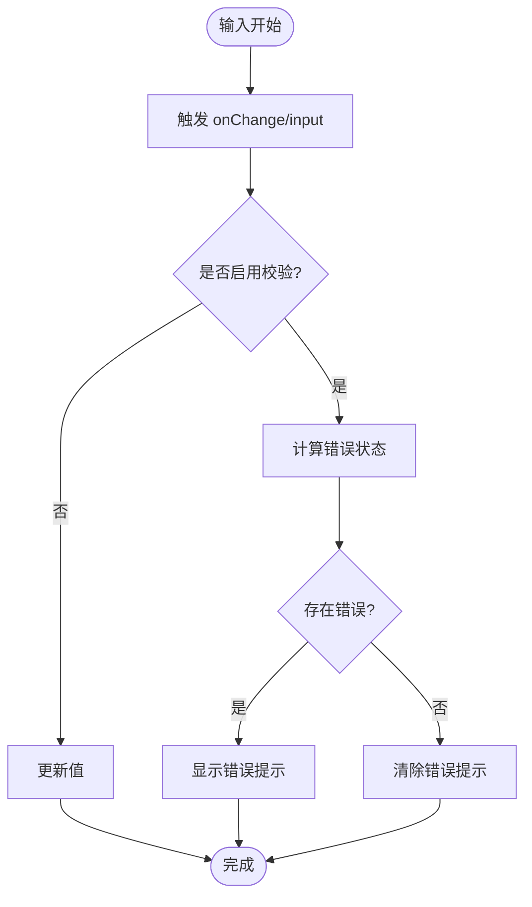

图表来源
- [text-field.tsx](file://src/components/ui/text-field.tsx)
- [text-field.demo.tsx](file://src/components/ui/text-field.demo.tsx)

章节来源
- [text-field.tsx](file://src/components/ui/text-field.tsx)
- [text-field.demo.tsx](file://src/components/ui/text-field.demo.tsx)

### 文本域 TextArea
- 属性接口
  - 值与状态：value、onChange、placeholder、rows、autoSize、maxLength
  - 事件：focus、blur、input、change
  - 插槽：辅助说明、字符计数
- 事件处理
  - 支持自动高度与字数限制
- 插槽使用
  - 可在下方显示帮助文本或计数器
- 状态管理
  - 受控与非受控模式
- 样式定制与主题
  - 通过类名与 CSS 变量控制样式
- 响应式设计
  - 根据容器宽度调整行高与内边距
- 无障碍访问
  - aria-multiline、aria-describedby

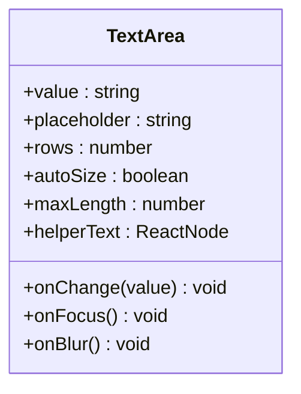

图表来源
- [text-area.tsx](file://src/components/ui/text-area.tsx)

章节来源
- [text-area.tsx](file://src/components/ui/text-area.tsx)
- [text-area.demo.tsx](file://src/components/ui/text-area.demo.tsx)

### 开关 Toggle
- 属性接口
  - 值与状态：checked、onChange、disabled、label
  - 事件：切换回调
  - 插槽：自定义标签或图标
- 事件处理
  - 支持键盘空格切换与点击切换
- 插槽使用
  - 允许在开关旁显示说明文字
- 状态管理
  - 受控 checked 状态
- 样式定制与主题
  - 通过类名与 CSS 变量控制轨道与滑块
- 响应式设计
  - 在小屏下增大触控区域
- 无障碍访问
  - role="switch"、aria-checked、aria-label

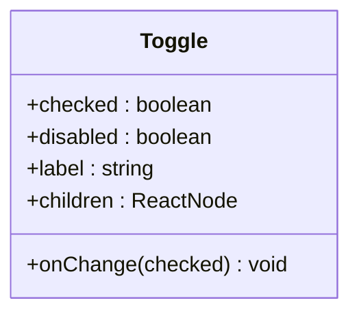

图表来源
- [toggle.tsx](file://src/components/ui/toggle.tsx)

章节来源
- [toggle.tsx](file://src/components/ui/toggle.tsx)
- [toggle.demo.tsx](file://src/components/ui/toggle.demo.tsx)

### 提示框 Tooltip
- 属性接口
  - 触发方式：hover、focus、click
  - 位置：top、bottom、left、right
  - 延迟：showDelay、hideDelay
  - 事件：显示、隐藏
  - 插槽：触发器与提示内容
- 事件处理
  - 统一管理显示与隐藏时机
- 插槽使用
  - 支持任意触发器与内容
- 状态管理
  - 内部维护 visible 状态
- 样式定制与主题
  - 通过类名与 CSS 变量控制背景、箭头与阴影
- 响应式设计
  - 在窄屏下自动调整位置以避免溢出
- 无障碍访问
  - aria-describedby 与角色映射

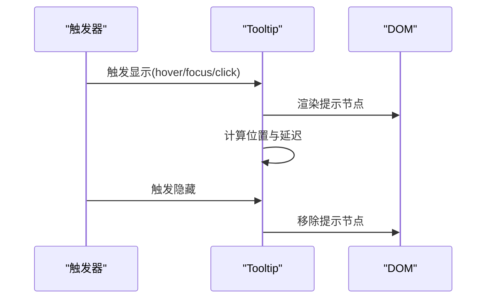

图表来源
- [tooltip.tsx](file://src/components/ui/tooltip.tsx)
- [tooltip.demo.tsx](file://src/components/ui/tooltip.demo.tsx)

章节来源
- [tooltip.tsx](file://src/components/ui/tooltip.tsx)
- [tooltip.demo.tsx](file://src/components/ui/tooltip.demo.tsx)

### 通知 Toast
- 属性接口
  - 类型：success、warning、error、info
  - 行为：自动关闭、手动关闭、持久显示
  - 事件：显示、隐藏、点击
  - 插槽：标题、描述、操作按钮
- 事件处理
  - 统一队列管理与生命周期
- 插槽使用
  - 支持自定义内容与操作
- 状态管理
  - 内部维护显示列表与定时器
- 样式定制与主题
  - 通过类名与 CSS 变量控制颜色与动画
- 响应式设计
  - 在移动端固定底部或顶部显示
- 无障碍访问
  - aria-live 与角色映射

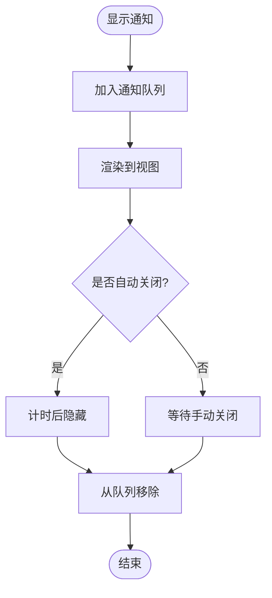

图表来源
- [toast.tsx](file://src/components/ui/toast.tsx)
- [toast.demo.tsx](file://src/components/ui/toast.demo.tsx)

章节来源
- [toast.tsx](file://src/components/ui/toast.tsx)
- [toast.demo.tsx](file://src/components/ui/toast.demo.tsx)

## 依赖关系分析
基础 UI 组件之间保持低耦合，主要通过 props、事件与插槽进行通信；演示文件仅作为示例入口，不引入业务逻辑。

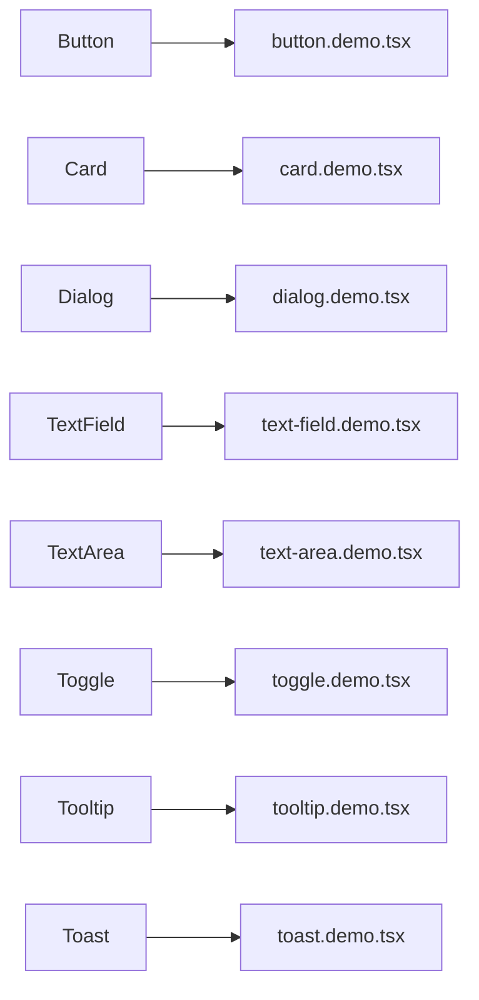

图表来源
- [button.tsx](file://src/components/ui/button.tsx)
- [button.demo.tsx](file://src/components/ui/button.demo.tsx)
- [card.tsx](file://src/components/ui/card.tsx)
- [card.demo.tsx](file://src/components/ui/card.demo.tsx)
- [dialog.tsx](file://src/components/ui/dialog.tsx)
- [dialog.demo.tsx](file://src/components/ui/dialog.demo.tsx)
- [text-field.tsx](file://src/components/ui/text-field.tsx)
- [text-field.demo.tsx](file://src/components/ui/text-field.demo.tsx)
- [text-area.tsx](file://src/components/ui/text-area.tsx)
- [text-area.demo.tsx](file://src/components/ui/text-area.demo.tsx)
- [toggle.tsx](file://src/components/ui/toggle.tsx)
- [toggle.demo.tsx](file://src/components/ui/toggle.demo.tsx)
- [tooltip.tsx](file://src/components/ui/tooltip.tsx)
- [tooltip.demo.tsx](file://src/components/ui/tooltip.demo.tsx)
- [toast.tsx](file://src/components/ui/toast.tsx)
- [toast.demo.tsx](file://src/components/ui/toast.demo.tsx)

章节来源
- [button.tsx](file://src/components/ui/button.tsx)
- [button.demo.tsx](file://src/components/ui/button.demo.tsx)
- [card.tsx](file://src/components/ui/card.tsx)
- [card.demo.tsx](file://src/components/ui/card.demo.tsx)
- [dialog.tsx](file://src/components/ui/dialog.tsx)
- [dialog.demo.tsx](file://src/components/ui/dialog.demo.tsx)
- [text-field.tsx](file://src/components/ui/text-field.tsx)
- [text-field.demo.tsx](file://src/components/ui/text-field.demo.tsx)
- [text-area.tsx](file://src/components/ui/text-area.tsx)
- [text-area.demo.tsx](file://src/components/ui/text-area.demo.tsx)
- [toggle.tsx](file://src/components/ui/toggle.tsx)
- [toggle.demo.tsx](file://src/components/ui/toggle.demo.tsx)
- [tooltip.tsx](file://src/components/ui/tooltip.tsx)
- [tooltip.demo.tsx](file://src/components/ui/tooltip.demo.tsx)
- [toast.tsx](file://src/components/ui/toast.tsx)
- [toast.demo.tsx](file://src/components/ui/toast.demo.tsx)

## 性能考量
- 减少重排与重绘：避免频繁修改布局相关样式，优先使用 transform 与 opacity 做动画
- 事件节流与防抖：对高频输入与滚动事件进行节流/防抖处理
- 懒加载与按需渲染：对话框与通知仅在需要时渲染，必要时使用虚拟列表
- 状态最小化：将状态提升到必要层级，避免不必要的重新渲染
- 样式隔离与复用：通过 CSS 变量与类名复用样式，减少重复计算

[本节为通用指导，无需特定文件引用]

## 故障排查指南
- 对话框焦点丢失
  - 检查是否正确启用焦点陷阱与焦点恢复逻辑
- 输入框校验未生效
  - 确认 onChange 与校验逻辑绑定正确，且 error/helperText 已传递
- 通知未自动关闭
  - 检查定时器清理逻辑与队列状态
- 提示框位置异常
  - 验证位置计算与视口边界检测

章节来源
- [dialog.tsx](file://src/components/ui/dialog.tsx)
- [text-field.tsx](file://src/components/ui/text-field.tsx)
- [toast.tsx](file://src/components/ui/toast.tsx)
- [tooltip.tsx](file://src/components/ui/tooltip.tsx)

## 结论
CodeVideoCanvas 的基础 UI 组件以清晰的职责划分、完善的属性与事件接口、灵活的插槽机制与良好的无障碍支持为核心，配合演示文件提供了丰富的变体与组合用法。通过统一的样式与主题策略，组件具备良好的可扩展性与一致性。遵循性能优化与最佳实践，可在保证用户体验的同时提升整体性能。

[本节为总结性内容，无需特定文件引用]

## 附录
- 使用示例路径
  - 按钮：[button.demo.tsx](file://src/components/ui/button.demo.tsx)
  - 卡片：[card.demo.tsx](file://src/components/ui/card.demo.tsx)
  - 对话框：[dialog.demo.tsx](file://src/components/ui/dialog.demo.tsx)
  - 输入框：[text-field.demo.tsx](file://src/components/ui/text-field.demo.tsx)
  - 文本域：[text-area.demo.tsx](file://src/components/ui/text-area.demo.tsx)
  - 开关：[toggle.demo.tsx](file://src/components/ui/toggle.demo.tsx)
  - 提示框：[tooltip.demo.tsx](file://src/components/ui/tooltip.demo.tsx)
  - 通知：[toast.demo.tsx](file://src/components/ui/toast.demo.tsx)