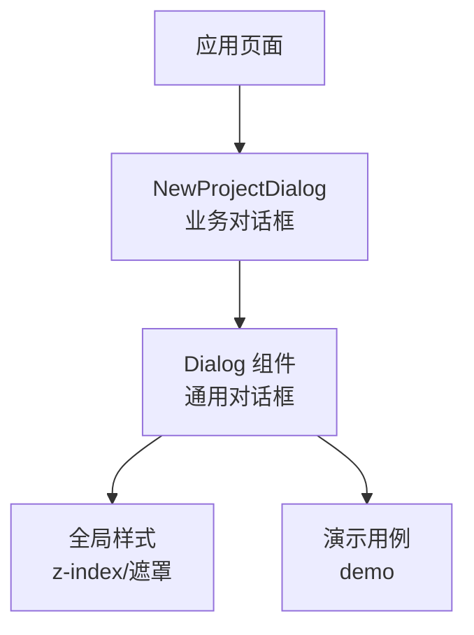
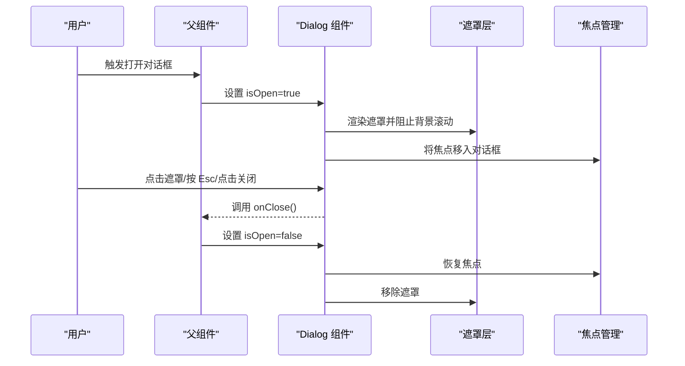
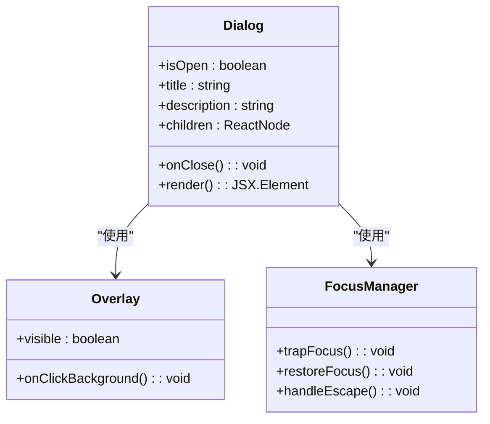
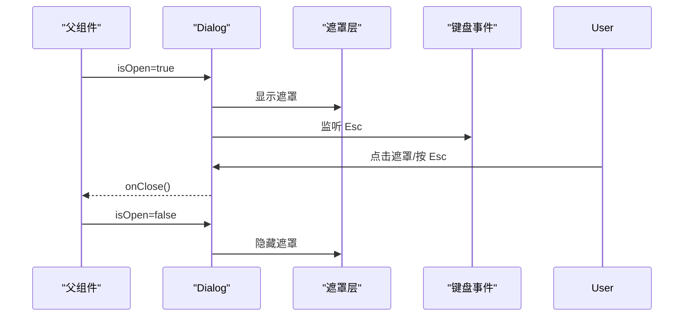
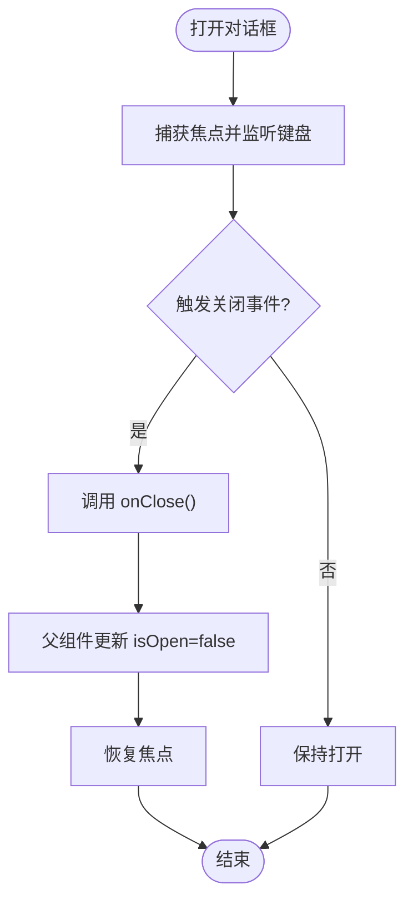
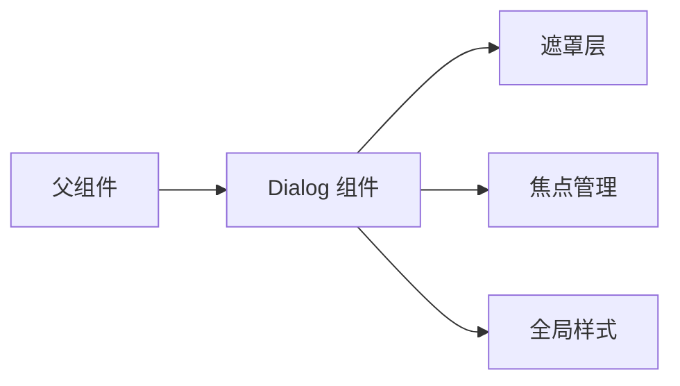

# 对话框组件

<cite>
**本文引用的文件**   
- [dialog.tsx](file://src/components/ui/dialog.tsx)
- [dialog.demo.tsx](file://src/components/ui/dialog.demo.tsx)
- [new-project-dialog.tsx](file://src/app/_components/new-project-dialog.tsx)
- [globals.css](file://src/app/globals.css)
</cite>

## 目录
1. [简介](#简介)
2. [项目结构](#项目结构)
3. [核心组件](#核心组件)
4. [架构总览](#架构总览)
5. [详细组件分析](#详细组件分析)
6. [依赖关系分析](#依赖关系分析)
7. [性能考量](#性能考量)
8. [故障排查指南](#故障排查指南)
9. [结论](#结论)
10. [附录](#附录)

## 简介
本文件为 CodeVideoCanvas 的 Dialog（对话框）组件提供系统化文档。内容覆盖对话框类型与使用场景、属性接口说明、焦点管理与键盘导航、动画与过渡效果、层级与 z-index 管理，以及响应式与移动端适配策略。同时提供确认对话框、表单对话框、信息提示对话框等丰富示例的使用指引，帮助开发者快速、正确地集成与扩展该组件。

## 项目结构
Dialog 组件位于 UI 组件库中，并通过演示页面和实际业务对话框进行验证与使用：
- 组件实现：src/components/ui/dialog.tsx
- 演示用例：src/components/ui/dialog.demo.tsx
- 业务用法示例：src/app/_components/new-project-dialog.tsx
- 全局样式（含可能的遮罩/层级相关样式）：src/app/globals.css

图表来源
- [dialog.tsx](file://src/components/ui/dialog.tsx)
- [dialog.demo.tsx](file://src/components/ui/dialog.demo.tsx)
- [new-project-dialog.tsx](file://src/app/_components/new-project-dialog.tsx)
- [globals.css](file://src/app/globals.css)

章节来源
- [dialog.tsx](file://src/components/ui/dialog.tsx)
- [dialog.demo.tsx](file://src/components/ui/dialog.demo.tsx)
- [new-project-dialog.tsx](file://src/app/_components/new-project-dialog.tsx)
- [globals.css](file://src/app/globals.css)

## 核心组件
- 组件名称：Dialog
- 职责：提供可复用的模态对话框能力，支持标题、描述、自定义内容区域、关闭回调等；通过 isOpen 控制显隐，onClose 处理关闭事件。
- 典型属性（基于组件实现与使用方式归纳）：
  - isOpen: boolean，控制对话框是否可见
  - onClose: () => void，关闭回调
  - title: string，对话框标题
  - description: string，辅助描述文本
  - children: ReactNode，对话框主体内容
- 常见使用模式：
  - 信息提示（alert）：仅展示信息，无交互或仅“确定”
  - 确认操作（confirm）：包含“取消/确认”等操作按钮
  - 表单输入：在 children 中嵌入表单控件，提交后触发 onClose

章节来源
- [dialog.tsx](file://src/components/ui/dialog.tsx)
- [dialog.demo.tsx](file://src/components/ui/dialog.demo.tsx)
- [new-project-dialog.tsx](file://src/app/_components/new-project-dialog.tsx)

## 架构总览
Dialog 作为基础 UI 组件，被业务对话框直接复用。其内部通常包含：
- 遮罩层（Overlay）：拦截背景交互，支持点击遮罩关闭
- 容器（Container）：承载标题、描述、内容区域与操作区
- 焦点管理：打开时聚焦到合适元素，Esc 键关闭
- 动画与过渡：进入/离开时的淡入淡出或缩放效果
- 层级管理：通过 z-index 确保对话框处于顶层

图表来源
- [dialog.tsx](file://src/components/ui/dialog.tsx)
- [globals.css](file://src/app/globals.css)

## 详细组件分析

### 组件属性与行为
- isOpen：布尔值，控制显示/隐藏。外部状态驱动，避免内部状态与外部不一致。
- onClose：关闭回调，由父组件提供，用于更新 isOpen 或其他副作用。
- title/description：用于构建对话框头部与辅助信息，提升可读性与无障碍性。
- children：自由插槽，支持任意内容（文本、表单、列表等）。

建议的最佳实践：
- 始终通过外部状态控制 isOpen，避免在组件内维护显示状态
- 在 onClose 中统一处理副作用（如重置表单、埋点上报）
- 为复杂内容提供合理的滚动区域与尺寸约束

章节来源
- [dialog.tsx](file://src/components/ui/dialog.tsx)
- [dialog.demo.tsx](file://src/components/ui/dialog.demo.tsx)

### 焦点管理与键盘导航
- 打开时自动聚焦：优先聚焦到标题或第一个可交互元素，保证键盘可达性
- Esc 键关闭：按下 Escape 触发 onClose
- Tab 循环：在对话框内的可聚焦元素间循环，防止焦点逃逸到背景
- 关闭后恢复焦点：回到触发打开的元素，保持可访问性体验

章节来源
- [dialog.tsx](file://src/components/ui/dialog.tsx)

### 动画与过渡
- 进入/离开动画：常见的淡入淡出、缩放或位移，提升视觉连贯性
- 动画时机：在 isOpen 变化时触发，配合 CSS transition 或动画库
- 性能优化：避免重排重绘，尽量使用 transform/opacity 等合成属性

章节来源
- [dialog.tsx](file://src/components/ui/dialog.tsx)
- [globals.css](file://src/app/globals.css)

### 层级管理与 z-index
- 遮罩层与对话框容器需置于较高层级，确保不被其他元素遮挡
- 多实例场景：若存在多个对话框，应动态计算 z-index，保证最新打开的在最上层
- 与全局布局冲突：检查全局样式中的 z-index 定义，必要时调整堆叠上下文

章节来源
- [dialog.tsx](file://src/components/ui/dialog.tsx)
- [globals.css](file://src/app/globals.css)

### 响应式设计与移动端适配
- 宽度自适应：在小屏设备上全宽显示，在大屏设备上居中固定宽度
- 底部操作区：移动端将操作按钮固定在底部，便于拇指操作
- 手势支持：可选滑动关闭（谨慎实现，避免误触）
- 安全区域：考虑刘海屏、底部横条等安全区域，避免内容被遮挡

章节来源
- [dialog.tsx](file://src/components/ui/dialog.tsx)
- [globals.css](file://src/app/globals.css)

### 使用示例与场景

#### 确认对话框（Confirm）
- 场景：删除、退出、不可逆操作前的二次确认
- 要点：明确文案与风险提示，提供“取消/确认”两个主操作
- 交互：点击遮罩或按 Esc 不关闭（可选），强调必须主动确认

章节来源
- [dialog.demo.tsx](file://src/components/ui/dialog.demo.tsx)

#### 表单对话框（Form）
- 场景：新建项目、编辑资料、批量设置
- 要点：children 中嵌入表单控件，提交后校验并关闭
- 交互：默认聚焦到第一个输入框，Enter 提交（可选）

章节来源
- [new-project-dialog.tsx](file://src/app/_components/new-project-dialog.tsx)
- [dialog.demo.tsx](file://src/components/ui/dialog.demo.tsx)

#### 信息提示对话框（Alert）
- 场景：成功/失败/警告提示，无需复杂交互
- 要点：简洁明了的标题与描述，单一主操作（如“确定”）

章节来源
- [dialog.demo.tsx](file://src/components/ui/dialog.demo.tsx)

### 类图（概念映射）
以下类图用于概念化理解组件结构与关系（非代码级继承关系）：

图表来源
- [dialog.tsx](file://src/components/ui/dialog.tsx)

### 序列图（打开/关闭流程）

图表来源
- [dialog.tsx](file://src/components/ui/dialog.tsx)

### 流程图（键盘与点击关闭决策）

图表来源
- [dialog.tsx](file://src/components/ui/dialog.tsx)

## 依赖关系分析
- 组件内部依赖：
  - 遮罩层与容器渲染
  - 焦点管理与键盘事件监听
  - 动画与过渡（CSS 或动画库）
- 外部依赖：
  - 父组件的状态管理（isOpen/onClose）
  - 全局样式（z-index、遮罩背景色等）

图表来源
- [dialog.tsx](file://src/components/ui/dialog.tsx)
- [globals.css](file://src/app/globals.css)

章节来源
- [dialog.tsx](file://src/components/ui/dialog.tsx)
- [globals.css](file://src/app/globals.css)

## 性能考量
- 避免不必要的重渲染：仅在 isOpen 变化或必要数据变更时更新
- 懒加载内容：对大型表单或复杂内容，按需渲染
- 动画性能：优先使用 transform/opacity，减少布局抖动
- 事件监听：及时清理键盘与点击事件，防止内存泄漏

[本节为通用指导，不直接分析具体文件]

## 故障排查指南
- 无法关闭：
  - 检查 onClose 是否正确绑定并更新 isOpen
  - 确认是否有其他事件阻止了关闭逻辑
- 焦点异常：
  - 检查可聚焦元素顺序与 trapFocus 实现
  - 确认关闭后焦点恢复逻辑
- 层级遮挡：
  - 检查全局 z-index 定义，确保对话框高于其他元素
  - 避免嵌套在不同堆叠上下文中导致遮挡
- 动画卡顿：
  - 避免在动画过程中进行大量 DOM 操作
  - 使用 GPU 加速属性（transform/opacity）

章节来源
- [dialog.tsx](file://src/components/ui/dialog.tsx)
- [globals.css](file://src/app/globals.css)

## 结论
Dialog 组件为 CodeVideoCanvas 提供了稳定、可访问、易扩展的对话框能力。通过合理的外部状态管理、完善的焦点与键盘支持、流畅的动画与层级控制，以及响应式适配，可满足从简单提示到复杂表单的多场景需求。建议在业务中使用统一的属性约定与交互规范，确保一致的用户体验。

[本节为总结性内容，不直接分析具体文件]

## 附录
- 最佳实践清单：
  - 始终通过外部状态控制 isOpen
  - 提供清晰的标题与描述，增强可访问性
  - 在 onClose 中集中处理副作用
  - 关注焦点与键盘交互，确保无障碍
  - 注意 z-index 与全局样式冲突
  - 针对移动端优化布局与操作区

[本节为补充信息，不直接分析具体文件]