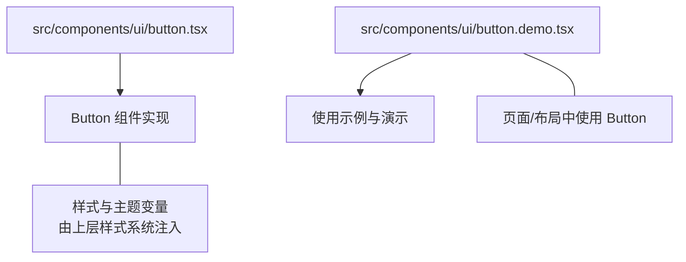
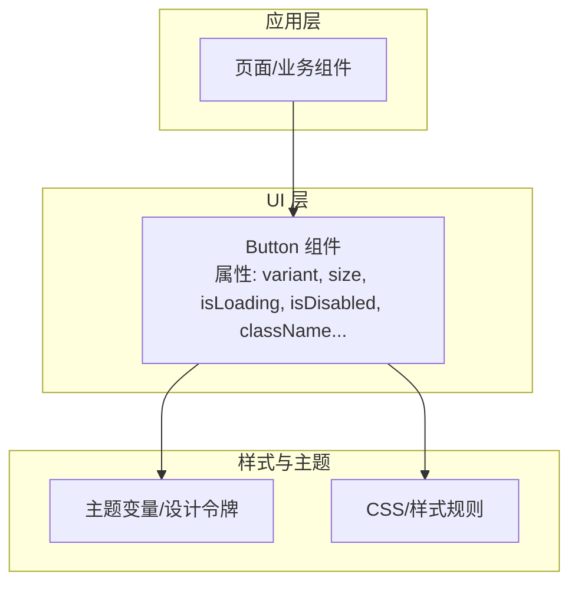
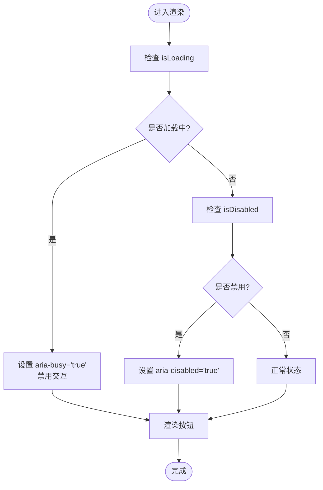
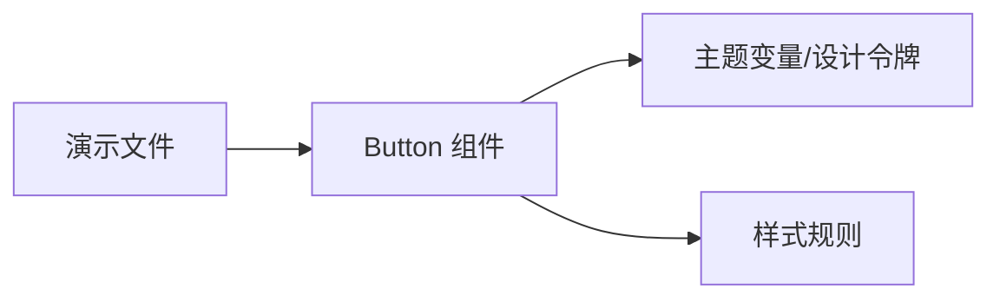

# 按钮组件

<cite>
**本文引用的文件**   
- [button.tsx](file://src/components/ui/button.tsx)
- [button.demo.tsx](file://src/components/ui/button.demo.tsx)
</cite>

## 目录
1. [简介](#简介)
2. [项目结构](#项目结构)
3. [核心组件](#核心组件)
4. [架构总览](#架构总览)
5. [详细组件分析](#详细组件分析)
6. [依赖分析](#依赖分析)
7. [性能考虑](#性能考虑)
8. [故障排查指南](#故障排查指南)
9. [结论](#结论)
10. [附录](#附录)

## 简介
本文件为 CodeVideoCanvas 的 Button 组件提供完整文档，涵盖变体、尺寸、状态、属性接口、事件处理、样式定制与主题支持、无障碍访问与键盘导航等。目标是帮助开发者快速理解并正确使用该组件，在不同业务场景（表单提交、导航操作、危险操作等）中保持一致的交互体验。

## 项目结构
Button 组件位于 UI 基础组件目录，配套演示文件用于展示常见用法与组合方式。

图表来源
- [button.tsx:1-200](file://src/components/ui/button.tsx#L1-L200)
- [button.demo.tsx:1-200](file://src/components/ui/button.demo.tsx#L1-L200)

章节来源
- [button.tsx:1-200](file://src/components/ui/button.tsx#L1-L200)
- [button.demo.tsx:1-200](file://src/components/ui/button.demo.tsx#L1-L200)

## 核心组件
- 组件职责：提供统一的按钮外观与交互行为，支持多种视觉变体、尺寸与状态，具备可访问性与键盘导航能力。
- 关键特性：
  - 变体：primary、secondary、ghost、destructive
  - 尺寸：sm、md、lg
  - 状态：loading、disabled
  - 事件：onClick、onKeyDown 等标准 DOM 事件透传
  - 样式：className 透传、主题变量驱动、可覆盖默认样式
  - 无障碍：语义化标签、ARIA 属性、焦点管理、键盘可达

章节来源
- [button.tsx:1-200](file://src/components/ui/button.tsx#L1-L200)

## 架构总览
Button 组件作为原子级 UI 组件，向上层页面与业务组件暴露简洁的属性接口；向下通过样式系统与主题变量渲染不同变体与尺寸。演示文件集中展示典型用法，便于快速上手与回归验证。

图表来源
- [button.tsx:1-200](file://src/components/ui/button.tsx#L1-L200)

## 详细组件分析

### 属性接口
- className: string | undefined
  - 作用：透传给根元素，允许外部覆盖或追加样式类名。
- variant: "primary" | "secondary" | "ghost" | "destructive"
  - 作用：控制按钮视觉风格。
  - 默认值：通常为 primary（以实际实现为准）。
- size: "sm" | "md" | "lg"
  - 作用：控制按钮尺寸（高度、内边距、字号等）。
  - 默认值：通常为 md（以实际实现为准）。
- isLoading: boolean
  - 作用：显示加载态（如禁用交互、显示加载指示器）。
- isDisabled: boolean
  - 作用：禁用按钮交互与键盘操作。
- 其他标准 HTML 按钮属性
  - 例如 type、aria-*、data-* 等，通常透传给底层原生按钮元素，保持浏览器兼容性与可访问性。

章节来源
- [button.tsx:1-200](file://src/components/ui/button.tsx#L1-L200)

### 变体与尺寸矩阵
- 变体
  - primary：强调主操作，常用于表单提交、创建等。
  - secondary：次要操作，常用于取消、返回等。
  - ghost：轻量背景透明，常用于工具栏、辅助操作。
  - destructive：危险操作，常用于删除、清空等。
- 尺寸
  - sm：紧凑空间下的按钮。
  - md：默认尺寸，适用于大多数场景。
  - lg：大尺寸，突出重要操作或在移动端提升点击区域。

章节来源
- [button.tsx:1-200](file://src/components/ui/button.tsx#L1-L200)

### 状态说明
- loading
  - 表现：禁用交互、显示加载指示器（若实现包含图标槽位）。
  - 建议：在异步请求期间启用，避免重复提交。
- disabled
  - 表现：不可点击、不可聚焦、视觉上弱化。
  - 建议：在条件不满足时禁用，配合提示文案说明原因。

章节来源
- [button.tsx:1-200](file://src/components/ui/button.tsx#L1-L200)

### 事件处理机制
- onClick
  - 触发时机：用户点击按钮时。
  - 注意事项：在 loading 或 disabled 状态下应阻止默认行为。
- onKeyDown
  - 触发时机：键盘操作（Enter、Space 等）时。
  - 无障碍要求：确保 Enter/Space 可触发主要动作，符合 WAI-ARIA 规范。
- 其他事件
  - 所有标准 DOM 事件均可透传，便于上层自定义逻辑。

章节来源
- [button.tsx:1-200](file://src/components/ui/button.tsx#L1-L200)

### 样式定制与主题支持
- 主题变量
  - 颜色、圆角、阴影、字体大小等通过主题变量驱动，保证全局一致性。
- 覆盖策略
  - 通过 className 追加类名进行局部覆盖。
  - 优先顺序遵循样式系统的层叠规则（具体以样式实现为准）。
- 响应式与暗色模式
  - 若主题系统支持，按钮将自动适配暗色模式与不同屏幕尺寸。

章节来源
- [button.tsx:1-200](file://src/components/ui/button.tsx#L1-L200)

### 无障碍访问与键盘导航
- 语义化标签
  - 使用原生 button 元素，确保正确的角色与默认行为。
- ARIA 属性
  - 根据状态设置 aria-disabled、aria-busy 等，增强读屏器支持。
- 键盘可达
  - 支持 Tab 聚焦、Enter/Space 激活，必要时提供 Esc 关闭相关弹窗（由父组件负责）。
- 焦点可见性
  - 保留浏览器默认焦点样式或通过主题变量强化焦点环。

章节来源
- [button.tsx:1-200](file://src/components/ui/button.tsx#L1-L200)

### 使用示例与最佳实践
以下为常见场景的使用思路与要点（不包含代码内容，仅给出路径参考）：
- 表单提交
  - 使用 primary 变体，结合 isLoading 防止重复提交。
  - 参考示例路径：[button.demo.tsx](file://src/components/ui/button.demo.tsx)
- 导航操作
  - 使用 secondary 或 ghost 变体，搭配路由跳转逻辑。
  - 参考示例路径：[button.demo.tsx](file://src/components/ui/button.demo.tsx)
- 危险操作
  - 使用 destructive 变体，明确风险语义，必要时二次确认。
  - 参考示例路径：[button.demo.tsx](file://src/components/ui/button.demo.tsx)
- 工具栏/辅助操作
  - 使用 ghost 变体，减少视觉干扰。
  - 参考示例路径：[button.demo.tsx](file://src/components/ui/button.demo.tsx)

章节来源
- [button.demo.tsx:1-200](file://src/components/ui/button.demo.tsx#L1-L200)

### 流程图：加载与禁用状态处理

图表来源
- [button.tsx:1-200](file://src/components/ui/button.tsx#L1-L200)

## 依赖分析
- 内部依赖
  - 无直接第三方库依赖（以实际实现为准），主要通过样式系统与主题变量渲染。
- 外部依赖
  - 样式系统：CSS/主题变量（由项目样式配置提供）。
  - 运行时：React 组件模型（以实际实现为准）。

图表来源
- [button.tsx:1-200](file://src/components/ui/button.tsx#L1-L200)
- [button.demo.tsx:1-200](file://src/components/ui/button.demo.tsx#L1-L200)

章节来源
- [button.tsx:1-200](file://src/components/ui/button.tsx#L1-L200)
- [button.demo.tsx:1-200](file://src/components/ui/button.demo.tsx#L1-L200)

## 性能考虑
- 最小重渲染
  - 将 isLoading、isDisabled 等布尔值稳定化，避免不必要的重渲染。
- 事件节流
  - 在高频触发的场景中（如搜索框内的“搜索”按钮），对 onClick 做防抖或节流。
- 懒加载与按需引入
  - 若 Button 体积较大，可在需要时再导入，减少首屏资源。

[本节为通用指导，无需源码引用]

## 故障排查指南
- 问题：点击无效
  - 检查是否处于 loading 或 disabled 状态。
  - 确认 onClick 是否正确绑定且未提前 return。
- 问题：键盘无法触发
  - 确认使用原生 button 元素，并确保 Enter/Space 未被拦截。
- 问题：样式未生效
  - 检查 className 是否被覆盖，确认主题变量是否正确注入。
- 问题：读屏器未正确播报
  - 检查 aria-disabled、aria-busy 等属性是否正确设置。

章节来源
- [button.tsx:1-200](file://src/components/ui/button.tsx#L1-L200)

## 结论
Button 组件提供了完整的变体、尺寸与状态能力，并通过主题系统与无障碍支持保障一致的用户体验。建议在业务中统一使用该组件，以获得一致的视觉与交互体验，同时降低维护成本。

[本节为总结，无需源码引用]

## 附录
- 快速上手
  - 在页面中引入 Button，并根据场景选择 variant 与 size。
  - 参考演示文件中的示例组织方式，逐步扩展更多用例。
- 变更建议
  - 新增变体或尺寸时，同步更新演示文件与文档，确保回归测试覆盖。

[本节为补充信息，无需源码引用]