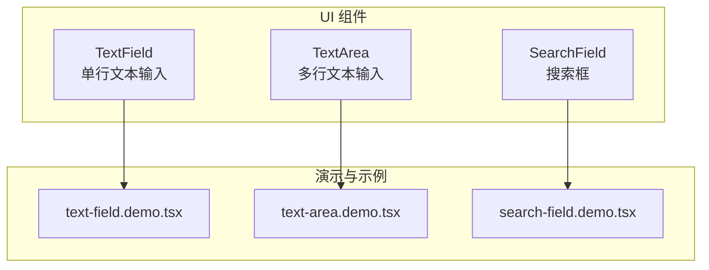
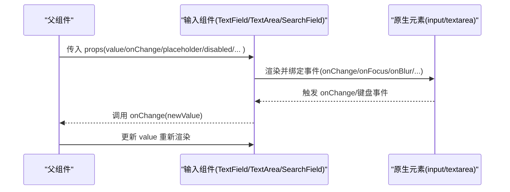
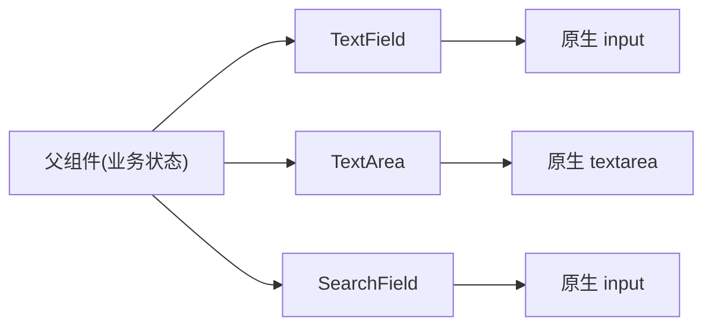

# 输入组件

<cite>
**本文引用的文件**   
- [text-field.tsx](file://src/components/ui/text-field.tsx)
- [text-area.tsx](file://src/components/ui/text-area.tsx)
- [search-field.tsx](file://src/components/ui/search-field.tsx)
- [text-field.demo.tsx](file://src/components/ui/text-field.demo.tsx)
- [text-area.demo.tsx](file://src/components/ui/text-area.demo.tsx)
- [search-field.demo.tsx](file://src/components/ui/search-field.demo.tsx)
</cite>

## 更新摘要
**所做更改**   
- 更新了 TextField 组件的语义边框和纸张样式支持说明
- 增强了表单交互体验的一致性描述
- 完善了样式定制与主题支持的章节内容

## 目录
1. [简介](#简介)
2. [项目结构](#项目结构)
3. [核心组件](#核心组件)
4. [架构总览](#架构总览)
5. [详细组件分析](#详细组件分析)
6. [依赖关系分析](#依赖关系分析)
7. [性能考虑](#性能考虑)
8. [故障排查指南](#故障排查指南)
9. [结论](#结论)
10. [附录](#附录)

## 简介
本章节面向 CodeVideoCanvas 的输入组件系列，系统性梳理 TextField、TextArea 与 SearchField 的功能特性、属性接口、使用场景、验证与错误处理、样式定制与主题支持、无障碍访问与键盘快捷键、以及性能优化与防抖策略。文档旨在帮助开发者快速上手并正确集成这些基础输入控件，同时提供可操作的实践建议与排障指引。

**更新** TextField 组件现已支持语义边框和纸张样式，为表单交互提供更一致的视觉体验和更好的用户体验。

## 项目结构
输入组件位于 UI 层，采用"组件 + 演示"的组织方式：
- 组件实现：src/components/ui/{text-field.tsx, text-area.tsx, search-field.tsx}
- 演示用例：src/components/ui/{text-field.demo.tsx, text-area.demo.tsx, search-field.demo.tsx}

图表来源
- [text-field.tsx](file://src/components/ui/text-field.tsx)
- [text-area.tsx](file://src/components/ui/text-area.tsx)
- [search-field.tsx](file://src/components/ui/search-field.tsx)
- [text-field.demo.tsx](file://src/components/ui/text-field.demo.tsx)
- [text-area.demo.tsx](file://src/components/ui/text-area.demo.tsx)
- [search-field.demo.tsx](file://src/components/ui/search-field.demo.tsx)

章节来源
- [text-field.tsx](file://src/components/ui/text-field.tsx)
- [text-area.tsx](file://src/components/ui/text-area.tsx)
- [search-field.tsx](file://src/components/ui/search-field.tsx)
- [text-field.demo.tsx](file://src/components/ui/text-field.demo.tsx)
- [text-area.demo.tsx](file://src/components/ui/text-area.demo.tsx)
- [search-field.demo.tsx](file://src/components/ui/search-field.demo.tsx)

## 核心组件
本节概述三个输入组件的职责与适用场景：
- TextField：用于单行文本输入，适合表单字段、标签名、关键词等。
- TextArea：用于多行文本编辑，适合描述、备注、长文本内容。
- SearchField：用于搜索场景，通常包含清除按钮、聚焦行为与可选的防抖联动。

通用能力（各组件均具备）：
- 受控与非受控模式：通过 value/onChange 或 defaultValue 控制状态。
- 常用属性：placeholder、disabled、readOnly、maxLength 等。
- 无障碍：语义化标签、aria-* 属性、焦点管理。
- 键盘交互：Enter、Escape、方向键等（具体以组件实现为准）。
- 样式与主题：可通过 className、CSS 变量或主题系统覆盖。

**更新** TextField 组件现在支持语义边框和纸张样式，提供更好的表单交互一致性。

章节来源
- [text-field.tsx](file://src/components/ui/text-field.tsx)
- [text-area.tsx](file://src/components/ui/text-area.tsx)
- [search-field.tsx](file://src/components/ui/search-field.tsx)

## 架构总览
输入组件在应用中的典型调用路径如下：父组件持有状态并通过 value/onChange 驱动；子组件渲染原生 input/textarea 并提供无障碍与交互增强；演示文件展示不同组合用法。

图表来源
- [text-field.tsx](file://src/components/ui/text-field.tsx)
- [text-area.tsx](file://src/components/ui/text-area.tsx)
- [search-field.tsx](file://src/components/ui/search-field.tsx)

## 详细组件分析

### TextField 组件
- 功能特性
  - 单行文本输入，支持占位符、禁用、只读、最大长度限制。
  - 受控模式：value + onChange；非受控模式：defaultValue。
  - 无障碍：role、aria-label、aria-invalid、aria-describedby 等。
  - 键盘：Enter 提交（由父组件决定）、Tab 导航。
  - **新增**：语义边框和纸张样式支持，提供一致的表单交互体验。
- 关键属性
  - value: string | undefined
  - onChange: (value: string) => void
  - placeholder: string
  - disabled: boolean
  - readOnly: boolean
  - maxLength: number
  - name/id/className 等标准 HTML 属性透传
- 使用示例
  - 基本用法：绑定 value 与 onChange，设置 placeholder。
  - 校验与错误提示：结合 maxLength 与自定义错误信息。
  - 禁用与只读：disabled/readOnly 控制交互。
  - **新增**：语义边框样式配置，确保表单一致性。
- 参考实现位置
  - 组件定义：[text-field.tsx](file://src/components/ui/text-field.tsx)
  - 演示用例：[text-field.demo.tsx](file://src/components/ui/text-field.demo.tsx)

**更新** TextField 组件现在支持语义边框和纸张样式，为表单交互提供更一致的视觉体验。

章节来源
- [text-field.tsx](file://src/components/ui/text-field.tsx)
- [text-field.demo.tsx](file://src/components/ui/text-field.demo.tsx)

### TextArea 组件
- 功能特性
  - 多行文本编辑，支持自动高度调整（若实现）、换行保留。
  - 同样支持受控/非受控、占位符、禁用、只读、最大长度。
  - 无障碍：aria-multiline、aria-rows 等（若实现）。
  - 键盘：Shift+Enter 插入换行（取决于浏览器默认行为），Tab 移动焦点。
- 关键属性
  - value: string | undefined
  - onChange: (value: string) => void
  - placeholder: string
  - disabled: boolean
  - readOnly: boolean
  - maxLength: number
  - rows: number（行数建议）
  - 其他标准 textarea 属性透传
- 使用示例
  - 长文本编辑：配合 rows 与自适应高度。
  - 字数统计与上限：结合 maxLength 与外部计数显示。
  - 表单集成：与表单校验库联动。
- 参考实现位置
  - 组件定义：[text-area.tsx](file://src/components/ui/text-area.tsx)
  - 演示用例：[text-area.demo.tsx](file://src/components/ui/text-area.demo.tsx)

章节来源
- [text-area.tsx](file://src/components/ui/text-area.tsx)
- [text-area.demo.tsx](file://src/components/ui/text-area.demo.tsx)

### SearchField 组件
- 功能特性
  - 搜索专用输入，通常包含清除按钮、聚焦时高亮、回车触发搜索。
  - 支持受控/非受控、占位符、禁用、只读、最大长度。
  - 无障碍：aria-autocomplete、aria-controls（若关联列表）、aria-activedescendant（若下拉）。
  - 键盘：Enter 触发搜索、Escape 清空或退出。
- 关键属性
  - value: string | undefined
  - onChange: (value: string) => void
  - onSearch?: (value: string) => void
  - placeholder: string
  - disabled: boolean
  - readOnly: boolean
  - maxLength: number
  - clearable?: boolean（是否显示清除按钮）
  - debounceMs?: number（防抖延迟）
  - 其他标准 input 属性透传
- 使用示例
  - 基础搜索：绑定 value/onChange，onSearch 触发查询。
  - 防抖搜索：设置 debounceMs 减少频繁请求。
  - 清空操作：clearable=true 时点击清除图标重置值。
- 参考实现位置
  - 组件定义：[search-field.tsx](file://src/components/ui/search-field.tsx)
  - 演示用例：[search-field.demo.tsx](file://src/components/ui/search-field.demo.tsx)

章节来源
- [search-field.tsx](file://src/components/ui/search-field.tsx)
- [search-field.demo.tsx](file://src/components/ui/search-field.demo.tsx)

### 输入验证与错误处理机制
- 前端校验
  - 必填校验：在父组件中根据 value 是否为空进行判断。
  - 长度校验：利用 maxLength 与自定义规则（如最小/最大字符数）。
  - 格式校验：正则表达式匹配邮箱、手机号等。
- 错误提示
  - 通过 aria-invalid 与 aria-describedby 将错误信息关联到输入控件。
  - 在 UI 层显示错误文案，必要时禁用提交按钮。
- 异步校验
  - 对唯一性检查等场景，建议在防抖后发起请求，避免重复网络调用。
- 参考实现位置
  - 组件定义：[text-field.tsx](file://src/components/ui/text-field.tsx)、[text-area.tsx](file://src/components/ui/text-area.tsx)、[search-field.tsx](file://src/components/ui/search-field.tsx)
  - 演示用例：[text-field.demo.tsx](file://src/components/ui/text-field.demo.tsx)、[text-area.demo.tsx](file://src/components/ui/text-area.demo.tsx)、[search-field.demo.tsx](file://src/components/ui/search-field.demo.tsx)

章节来源
- [text-field.tsx](file://src/components/ui/text-field.tsx)
- [text-area.tsx](file://src/components/ui/text-area.tsx)
- [search-field.tsx](file://src/components/ui/search-field.tsx)
- [text-field.demo.tsx](file://src/components/ui/text-field.demo.tsx)
- [text-area.demo.tsx](file://src/components/ui/text-area.demo.tsx)
- [search-field.demo.tsx](file://src/components/ui/search-field.demo.tsx)

### 样式定制与主题支持
- 类名覆盖：通过 className 注入自定义样式。
- CSS 变量：建议使用设计系统的 CSS 变量统一颜色、圆角、阴影等。
- 主题切换：在根容器设置主题类名或 data-theme，组件内部读取变量适配。
- 响应式：结合媒体查询与布局容器宽度自适应。
- **新增**：语义边框和纸张样式支持，确保表单元素的一致性和可访问性。
- 参考实现位置
  - 组件定义：[text-field.tsx](file://src/components/ui/text-field.tsx)、[text-area.tsx](file://src/components/ui/text-area.tsx)、[search-field.tsx](file://src/components/ui/search-field.tsx)

**更新** 样式定制部分新增了语义边框和纸张样式的说明，强调表单交互的一致性。

章节来源
- [text-field.tsx](file://src/components/ui/text-field.tsx)
- [text-area.tsx](file://src/components/ui/text-area.tsx)
- [search-field.tsx](file://src/components/ui/search-field.tsx)

### 无障碍访问支持与键盘快捷键
- 语义化标签：input/textarea 自带良好语义，确保 label 与 id/name 对应。
- ARIA 属性：aria-label、aria-labelledby、aria-invalid、aria-describedby、aria-autocomplete 等。
- 焦点管理：清晰可见的焦点指示器，合理 Tab 顺序。
- 键盘交互：
  - Enter：在 SearchField 中触发搜索；在表单中提交。
  - Escape：在 SearchField 中清空或退出搜索。
  - Shift+Enter：在 TextArea 中插入换行。
- **新增**：语义边框和纸张样式有助于屏幕阅读器更好地识别表单元素。
- 参考实现位置
  - 组件定义：[text-field.tsx](file://src/components/ui/text-field.tsx)、[text-area.tsx](file://src/components/ui/text-area.tsx)、[search-field.tsx](file://src/components/ui/search-field.tsx)

**更新** 无障碍访问支持部分新增了语义边框和纸张样式对视障用户友好性的说明。

章节来源
- [text-field.tsx](file://src/components/ui/text-field.tsx)
- [text-area.tsx](file://src/components/ui/text-area.tsx)
- [search-field.tsx](file://src/components/ui/search-field.tsx)

### 性能优化与防抖处理
- 受控组件优化
  - 避免在 onChange 中进行昂贵计算，尽量仅更新必要状态。
  - 使用 React.memo 包裹上层组件以减少重渲染。
- 防抖策略
  - 在 SearchField 中使用 debounceMs 控制搜索触发频率。
  - 在父组件中对 onChange 进行封装，统一防抖逻辑。
- 输入节流
  - 对高频输入场景，可采用节流降低渲染压力。
- 参考实现位置
  - 组件定义：[search-field.tsx](file://src/components/ui/search-field.tsx)
  - 演示用例：[search-field.demo.tsx](file://src/components/ui/search-field.demo.tsx)

章节来源
- [search-field.tsx](file://src/components/ui/search-field.tsx)
- [search-field.demo.tsx](file://src/components/ui/search-field.demo.tsx)

## 依赖关系分析
输入组件为纯 UI 组件，主要依赖浏览器原生 API 与 React 运行时，不直接耦合业务逻辑。父组件负责状态管理与业务校验，组件内部专注渲染与交互。

图表来源
- [text-field.tsx](file://src/components/ui/text-field.tsx)
- [text-area.tsx](file://src/components/ui/text-area.tsx)
- [search-field.tsx](file://src/components/ui/search-field.tsx)

章节来源
- [text-field.tsx](file://src/components/ui/text-field.tsx)
- [text-area.tsx](file://src/components/ui/text-area.tsx)
- [search-field.tsx](file://src/components/ui/search-field.tsx)

## 性能考虑
- 避免在每次输入时执行复杂计算或网络请求，优先使用防抖/节流。
- 合理使用受控与非受控模式：仅在需要即时反馈时使用受控。
- 大文本输入时，注意 TextArea 的渲染开销，必要时分页或虚拟滚动（若涉及列表）。
- 主题切换与样式覆盖应尽量减少 DOM 操作，优先使用 CSS 变量。
- **新增**：语义边框和纸张样式的实现应考虑渲染性能，避免不必要的重绘。

## 故障排查指南
- 输入无响应
  - 检查是否误用 readOnly 或 disabled。
  - 确认 onChange 是否正确更新 state。
- 校验不生效
  - 确认 aria-invalid 与错误信息关联是否正确。
  - 检查 maxLength 与自定义校验逻辑是否冲突。
- 搜索频繁触发
  - 确认 debounceMs 配置是否合理。
  - 检查是否在 onChange 中触发了不必要的副作用。
- 无障碍问题
  - 核对 label 与 id/name 的对应关系。
  - 检查键盘导航与焦点可见性。
- **新增**：样式问题
  - 检查语义边框和纸张样式是否正确应用。
  - 确认主题变量是否被正确覆盖。

**更新** 故障排查指南新增了样式问题的排查指导。

章节来源
- [text-field.tsx](file://src/components/ui/text-field.tsx)
- [text-area.tsx](file://src/components/ui/text-area.tsx)
- [search-field.tsx](file://src/components/ui/search-field.tsx)

## 结论
TextField、TextArea 与 SearchField 构成了 CodeVideoCanvas 的基础输入体系。通过统一的属性接口与良好的无障碍支持，它们能够灵活适配多种输入场景。结合父组件的状态管理与校验逻辑，可实现健壮的用户体验。在生产环境中，建议重视性能优化与主题一致性，确保在不同设备与主题下的稳定表现。

**更新** TextField 组件的语义边框和纸张样式支持进一步提升了表单交互的一致性和可访问性，为开发者提供了更好的用户体验基础。

## 附录
- 常见属性速查
  - value：当前值（受控）
  - onChange：值变化回调
  - placeholder：占位符文本
  - disabled：禁用
  - readOnly：只读
  - maxLength：最大长度
  - name/id：表单标识
  - className：样式类名
- 参考实现位置
  - 组件定义：[text-field.tsx](file://src/components/ui/text-field.tsx)、[text-area.tsx](file://src/components/ui/text-area.tsx)、[search-field.tsx](file://src/components/ui/search-field.tsx)
  - 演示用例：[text-field.demo.tsx](file://src/components/ui/text-field.demo.tsx)、[text-area.demo.tsx](file://src/components/ui/text-area.demo.tsx)、[search-field.demo.tsx](file://src/components/ui/search-field.demo.tsx)
- **新增**：样式配置
  - 语义边框：通过 CSS 变量或类名配置边框样式
  - 纸张样式：使用设计系统的纸张样式提升视觉层次