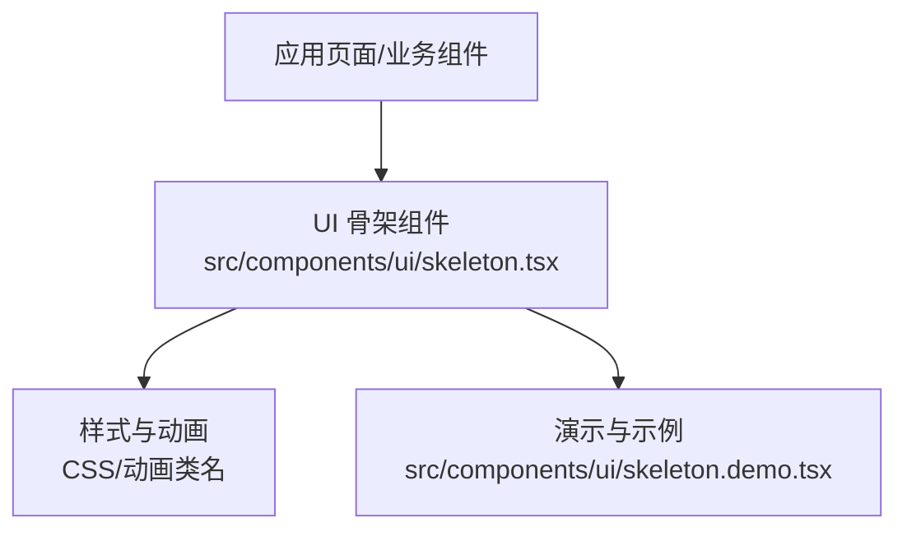
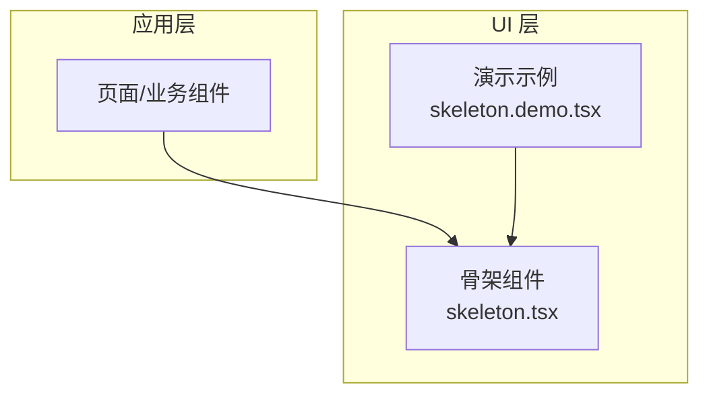
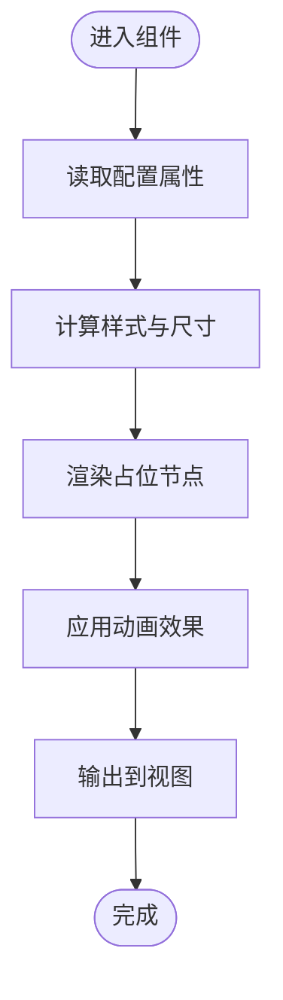
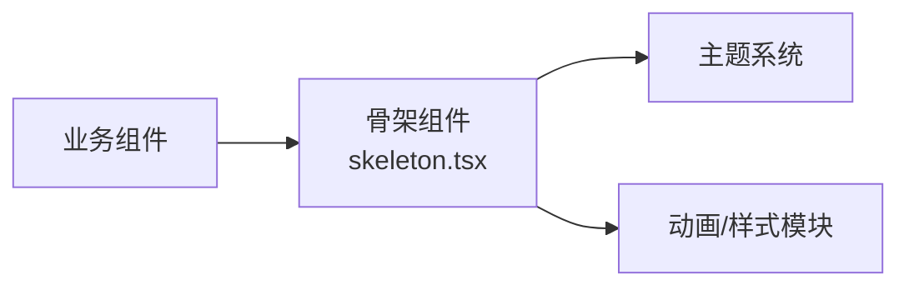

# 骨架加载组件

<cite>
**本文档引用的文件**   
- [skeleton.tsx](file://src/components/ui/skeleton.tsx)
- [skeleton.demo.tsx](file://src/components/ui/skeleton.demo.tsx)
</cite>

## 目录
1. [简介](#简介)
2. [项目结构](#项目结构)
3. [核心组件](#核心组件)
4. [架构总览](#架构总览)
5. [详细组件分析](#详细组件分析)
6. [依赖关系分析](#依赖关系分析)
7. [性能考量](#性能考量)
8. [故障排查指南](#故障排查指南)
9. [结论](#结论)
10. [附录](#附录)

## 简介
本章节聚焦于“骨架加载组件”的实现与使用，旨在为开发者提供清晰、可操作的文档。骨架加载（Skeleton）用于在数据尚未就绪时展示占位图形，提升用户感知性能与体验。该组件位于 UI 基础组件库中，具备轻量、可配置、易组合的特点，适用于卡片、列表、表单等常见布局场景。

## 项目结构
骨架加载组件属于 UI 层的基础组件，遵循“按功能组织”的目录结构：
- 组件实现：位于 src/components/ui/skeleton.tsx
- 演示用例：位于 src/components/ui/skeleton.demo.tsx

图表来源 
- [skeleton.tsx](file://src/components/ui/skeleton.tsx)
- [skeleton.demo.tsx](file://src/components/ui/skeleton.demo.tsx)

章节来源
- [skeleton.tsx](file://src/components/ui/skeleton.tsx)
- [skeleton.demo.tsx](file://src/components/ui/skeleton.demo.tsx)

## 核心组件
- 组件职责
  - 渲染骨架占位图形，避免内容闪烁或空白
  - 支持多种形状与尺寸，适配不同布局
  - 提供动画效果，增强过渡自然性
- 关键能力
  - 形状控制：矩形、圆形、圆角等
  - 尺寸控制：宽度、高度、间距
  - 动画控制：脉冲、渐变流动等
  - 主题适配：跟随全局主题色与明暗模式
- 典型用法
  - 列表项骨架：配合列表容器快速呈现行级占位
  - 卡片骨架：覆盖标题、缩略图、描述区域
  - 表单骨架：输入框、选择器、按钮等控件占位

章节来源
- [skeleton.tsx](file://src/components/ui/skeleton.tsx)
- [skeleton.demo.tsx](file://src/components/ui/skeleton.demo.tsx)

## 架构总览
骨架组件作为原子级 UI 元素，被上层页面或业务组件按需引入。其内部通过样式与动画类名驱动视觉效果，不耦合具体业务逻辑，保证高内聚、低耦合。

图表来源 
- [skeleton.tsx](file://src/components/ui/skeleton.tsx)
- [skeleton.demo.tsx](file://src/components/ui/skeleton.demo.tsx)

## 详细组件分析
### 组件设计与接口
- 设计原则
  - 无状态优先：仅负责渲染与样式，不包含复杂状态管理
  - 可组合性：通过 props 组合出多样形态
  - 可访问性：保持语义化结构与键盘可达性
- 主要属性（概念说明）
  - 形状：矩形、圆形、圆角矩形等
  - 尺寸：宽、高、间距
  - 动画：是否启用、动画类型
  - 主题：颜色、透明度、对比度
- 渲染流程
  - 接收 props → 计算样式 → 生成占位节点 → 应用动画 → 输出到 DOM

章节来源
- [skeleton.tsx](file://src/components/ui/skeleton.tsx)
- [skeleton.demo.tsx](file://src/components/ui/skeleton.demo.tsx)

### 使用示例与最佳实践
- 列表骨架
  - 将多个骨架节点按行排列，模拟真实列表结构
  - 建议根据数据量动态调整行数，避免过度渲染
- 卡片骨架
  - 标题区、图片区、描述区分别使用不同尺寸的骨架节点
  - 注意对齐与间距，确保与真实内容一致
- 表单骨架
  - 输入框、下拉框、按钮等控件对应不同形状的骨架
  - 保持交互区域的视觉一致性

章节来源
- [skeleton.demo.tsx](file://src/components/ui/skeleton.demo.tsx)

## 依赖关系分析
- 内部依赖
  - 样式与动画：通过 CSS 类名或动画库驱动
  - 主题系统：继承全局主题变量（颜色、明暗模式）
- 外部依赖
  - 无强依赖；若使用第三方动画库，需确保版本兼容
- 耦合度
  - 与业务组件解耦，仅通过 props 通信
  - 与主题系统松耦合，便于替换与扩展

图表来源 
- [skeleton.tsx](file://src/components/ui/skeleton.tsx)

章节来源
- [skeleton.tsx](file://src/components/ui/skeleton.tsx)

## 性能考量
- 渲染优化
  - 避免不必要的重绘：合理拆分骨架节点，减少父级更新
  - 懒加载：仅在可视区域内渲染骨架节点
- 动画性能
  - 使用 GPU 加速的动画属性（如 transform、opacity）
  - 控制动画时长与频率，避免卡顿
- 内存占用
  - 及时清理未使用的骨架节点
  - 避免过深的嵌套层级

## 故障排查指南
- 常见问题
  - 骨架显示异常：检查 props 传入的尺寸与形状是否正确
  - 动画不生效：确认样式与动画类名是否被覆盖
  - 主题不一致：核对主题变量与组件默认值
- 调试建议
  - 使用浏览器开发者工具检查 DOM 结构与样式
  - 逐步简化 props 定位问题根因
  - 参考演示用例对比差异

章节来源
- [skeleton.demo.tsx](file://src/components/ui/skeleton.demo.tsx)

## 结论
骨架加载组件以简洁的 API 与灵活的配置，为应用提供了稳定的占位体验。通过合理的组合与优化，可在不同场景下显著提升用户感知性能。建议在数据加载路径中统一使用该组件，确保一致的视觉反馈。

## 附录
- 相关资源
  - 组件实现：[skeleton.tsx](file://src/components/ui/skeleton.tsx)
  - 演示用例：[skeleton.demo.tsx](file://src/components/ui/skeleton.demo.tsx)
- 扩展方向
  - 增加更多形状与动画预设
  - 集成无障碍特性（ARIA 标签）
  - 支持响应式布局自适应