# 导出节点

<cite>
**本文引用的文件**   
- [export-node.tsx](file://src/components/ui/node/export-node.tsx)
- [export-node.demo.tsx](file://src/components/ui/node/export-node.demo.tsx)
- [export-workspace.tsx](file://src/app/canvas/export/export-workspace.tsx)
- [page.tsx](file://src/app/canvas/export/page.tsx)
- [export-api.ts](file://src/app/canvas/export/export-api.ts)
- [export-view-model.ts](file://src/app/canvas/export/export-view-model.ts)
- [route.ts](file://src/app/api/render/export/route.ts)
- [export-service.ts](file://src/features/render/export-service.ts)
- [queue-handler.ts](file://src/features/render/queue-handler.ts)
- [repository.ts](file://src/features/render/repository.ts)
- [encode.ts](file://src/features/render/encode.ts)
- [frame-capture.ts](file://src/features/render/frame-capture.ts)
- [concat.ts](file://src/features/render/concat.ts)
- [types.ts](file://src/features/render/types.ts)
- [index.ts](file://src/features/render/index.ts)
</cite>

## 目录
1. [简介](#简介)
2. [项目结构](#项目结构)
3. [核心组件](#核心组件)
4. [架构总览](#架构总览)
5. [详细组件分析](#详细组件分析)
6. [依赖关系分析](#依赖关系分析)
7. [性能与渲染参数优化](#性能与渲染参数优化)
8. [队列管理与进度监控](#队列管理与进度监控)
9. [状态跟踪与错误处理](#状态跟踪与错误处理)
10. [批量导出与定时任务](#批量导出与定时任务)
11. [结果文件管理与版本控制集成](#结果文件管理与版本控制集成)
12. [故障排查指南](#故障排查指南)
13. [结论](#结论)

## 简介
本章节面向“导出节点”功能，系统性说明视频导出配置（输出格式、分辨率、质量）、渲染参数与性能调优、导出队列与进度监控、任务状态与错误处理、批量与定时导出、以及结果文件管理与版本控制集成。文档以代码仓库中的实际实现为依据，提供可视化图表与路径引用，便于快速定位源码与扩展开发。

## 项目结构
导出相关能力横跨前端 UI、页面工作区、API 路由与服务层：
- 节点 UI：导出节点在画布中作为可配置的节点存在，支持用户设置输出参数并触发导出。
- 导出工作区：提供导出任务的创建、列表、详情与操作入口。
- API 路由：接收导出请求，调度服务层执行渲染与编码。
- 渲染服务：封装帧捕获、编码、拼接等流程，管理任务与持久化。
- 类型定义：统一导出任务、渲染配置、队列项等数据结构。

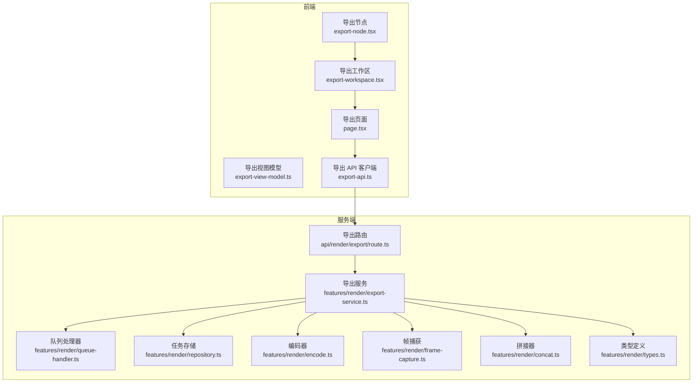

**图示来源**
- [export-node.tsx:1-200](file://src/components/ui/node/export-node.tsx#L1-L200)
- [export-workspace.tsx:1-200](file://src/app/canvas/export/export-workspace.tsx#L1-L200)
- [page.tsx:1-200](file://src/app/canvas/export/page.tsx#L1-L200)
- [export-api.ts:1-200](file://src/app/canvas/export/export-api.ts#L1-L200)
- [route.ts:1-200](file://src/app/api/render/export/route.ts#L1-L200)
- [export-service.ts:1-200](file://src/features/render/export-service.ts#L1-L200)
- [queue-handler.ts:1-200](file://src/features/render/queue-handler.ts#L1-L200)
- [repository.ts:1-200](file://src/features/render/repository.ts#L1-L200)
- [encode.ts:1-200](file://src/features/render/encode.ts#L1-L200)
- [frame-capture.ts:1-200](file://src/features/render/frame-capture.ts#L1-L200)
- [concat.ts:1-200](file://src/features/render/concat.ts#L1-L200)
- [types.ts:1-200](file://src/features/render/types.ts#L1-L200)

**章节来源**
- [export-node.tsx:1-200](file://src/components/ui/node/export-node.tsx#L1-L200)
- [export-workspace.tsx:1-200](file://src/app/canvas/export/export-workspace.tsx#L1-L200)
- [page.tsx:1-200](file://src/app/canvas/export/page.tsx#L1-L200)
- [export-api.ts:1-200](file://src/app/canvas/export/export-api.ts#L1-L200)
- [route.ts:1-200](file://src/app/api/render/export/route.ts#L1-L200)
- [export-service.ts:1-200](file://src/features/render/export-service.ts#L1-L200)
- [queue-handler.ts:1-200](file://src/features/render/queue-handler.ts#L1-L200)
- [repository.ts:1-200](file://src/features/render/repository.ts#L1-L200)
- [encode.ts:1-200](file://src/features/render/encode.ts#L1-L200)
- [frame-capture.ts:1-200](file://src/features/render/frame-capture.ts#L1-L200)
- [concat.ts:1-200](file://src/features/render/concat.ts#L1-L200)
- [types.ts:1-200](file://src/features/render/types.ts#L1-L200)

## 核心组件
- 导出节点（UI）：负责展示导出配置表单、校验输入、发起导出请求、显示节点级进度与状态。
- 导出工作区（页面）：集中管理导出任务列表、筛选、重试、删除、下载等操作。
- 导出视图模型：聚合导出任务数据、计算汇总指标、驱动 UI 刷新。
- 导出 API 客户端：封装与后端导出路由的交互，包括创建任务、查询状态、获取结果。
- 导出路由：解析请求体、校验参数、入队任务、返回任务 ID。
- 导出服务：编排帧捕获、编码、拼接、落盘与元数据更新。
- 队列处理器：消费队列任务、并发控制、失败重试、进度上报。
- 任务存储：持久化任务、进度、结果与错误信息。
- 编码器/帧捕获/拼接器：具体渲染管线实现。
- 类型定义：统一导出任务、渲染配置、队列项等数据结构。

**章节来源**
- [export-node.tsx:1-200](file://src/components/ui/node/export-node.tsx#L1-L200)
- [export-workspace.tsx:1-200](file://src/app/canvas/export/export-workspace.tsx#L1-L200)
- [export-view-model.ts:1-200](file://src/app/canvas/export/export-view-model.ts#L1-L200)
- [export-api.ts:1-200](file://src/app/canvas/export/export-api.ts#L1-L200)
- [route.ts:1-200](file://src/app/api/render/export/route.ts#L1-L200)
- [export-service.ts:1-200](file://src/features/render/export-service.ts#L1-L200)
- [queue-handler.ts:1-200](file://src/features/render/queue-handler.ts#L1-L200)
- [repository.ts:1-200](file://src/features/render/repository.ts#L1-L200)
- [encode.ts:1-200](file://src/features/render/encode.ts#L1-L200)
- [frame-capture.ts:1-200](file://src/features/render/frame-capture.ts#L1-L200)
- [concat.ts:1-200](file://src/features/render/concat.ts#L1-L200)
- [types.ts:1-200](file://src/features/render/types.ts#L1-L200)

## 架构总览
导出链路从前端节点到后端服务，再到渲染管线与存储，形成端到端闭环。

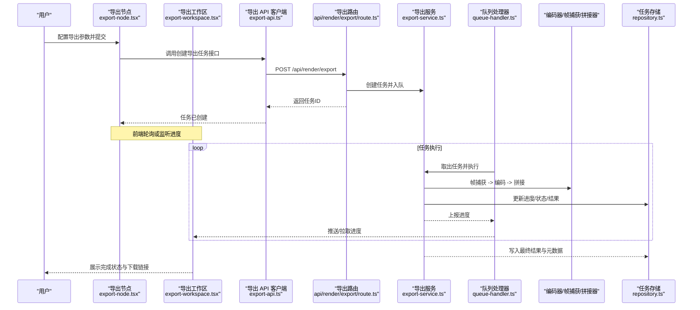

**图示来源**
- [export-node.tsx:1-200](file://src/components/ui/node/export-node.tsx#L1-L200)
- [export-workspace.tsx:1-200](file://src/app/canvas/export/export-workspace.tsx#L1-L200)
- [export-api.ts:1-200](file://src/app/canvas/export/export-api.ts#L1-L200)
- [route.ts:1-200](file://src/app/api/render/export/route.ts#L1-L200)
- [export-service.ts:1-200](file://src/features/render/export-service.ts#L1-L200)
- [queue-handler.ts:1-200](file://src/features/render/queue-handler.ts#L1-L200)
- [repository.ts:1-200](file://src/features/render/repository.ts#L1-L200)
- [encode.ts:1-200](file://src/features/render/encode.ts#L1-L200)
- [frame-capture.ts:1-200](file://src/features/render/frame-capture.ts#L1-L200)
- [concat.ts:1-200](file://src/features/render/concat.ts#L1-L200)

## 详细组件分析

### 导出节点（UI）
- 职责
  - 展示导出配置：输出格式、分辨率、质量、码率、帧率等。
  - 校验与提示：对非法参数进行拦截与反馈。
  - 触发导出：调用导出 API 创建任务。
  - 节点内进度与状态：显示当前节点的运行状态与百分比。
- 关键交互
  - 提交后进入“排队/执行/完成/失败”等状态。
  - 支持取消与重试（若实现）。
- 可扩展点
  - 新增输出格式或预设。
  - 接入更细粒度的渲染参数开关。

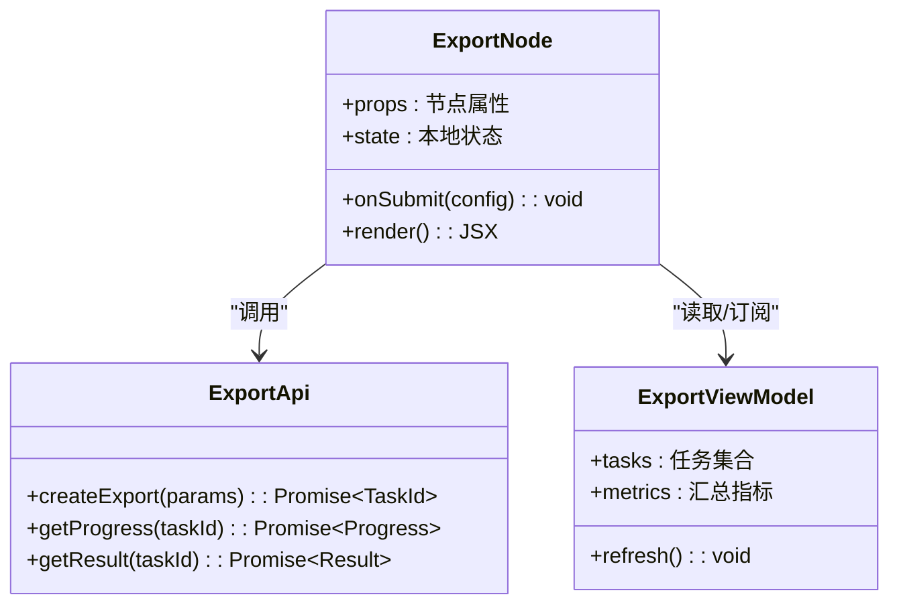

**图示来源**
- [export-node.tsx:1-200](file://src/components/ui/node/export-node.tsx#L1-L200)
- [export-view-model.ts:1-200](file://src/app/canvas/export/export-view-model.ts#L1-L200)
- [export-api.ts:1-200](file://src/app/canvas/export/export-api.ts#L1-L200)

**章节来源**
- [export-node.tsx:1-200](file://src/components/ui/node/export-node.tsx#L1-L200)
- [export-view-model.ts:1-200](file://src/app/canvas/export/export-view-model.ts#L1-L200)
- [export-api.ts:1-200](file://src/app/canvas/export/export-api.ts#L1-L200)

### 导出工作区与页面
- 职责
  - 列出所有导出任务，支持筛选、排序、分页。
  - 查看任务详情、进度、错误信息。
  - 重试失败任务、删除无效任务、下载成功结果。
- 与视图模型协作
  - 通过视图模型聚合任务数据与指标，驱动 UI 刷新。
- 与 API 协作
  - 使用导出 API 客户端进行增删改查与进度拉取。

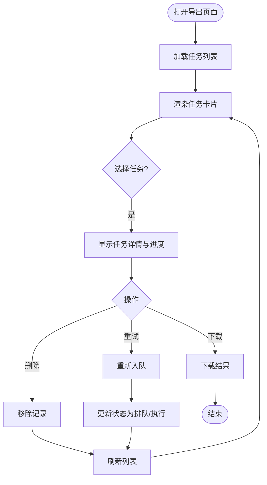

**图示来源**
- [export-workspace.tsx:1-200](file://src/app/canvas/export/export-workspace.tsx#L1-L200)
- [page.tsx:1-200](file://src/app/canvas/export/page.tsx#L1-L200)
- [export-view-model.ts:1-200](file://src/app/canvas/export/export-view-model.ts#L1-L200)
- [export-api.ts:1-200](file://src/app/canvas/export/export-api.ts#L1-L200)

**章节来源**
- [export-workspace.tsx:1-200](file://src/app/canvas/export/export-workspace.tsx#L1-L200)
- [page.tsx:1-200](file://src/app/canvas/export/page.tsx#L1-L200)
- [export-view-model.ts:1-200](file://src/app/canvas/export/export-view-model.ts#L1-L200)
- [export-api.ts:1-200](file://src/app/canvas/export/export-api.ts#L1-L200)

### 导出路由与服务
- 路由职责
  - 接收导出请求，校验参数，创建任务并返回任务 ID。
  - 将任务交由队列处理器执行。
- 服务职责
  - 编排渲染管线：帧捕获 → 编码 → 拼接 → 落盘。
  - 维护任务状态机与进度上报。
  - 与任务存储交互，持久化元数据与结果。

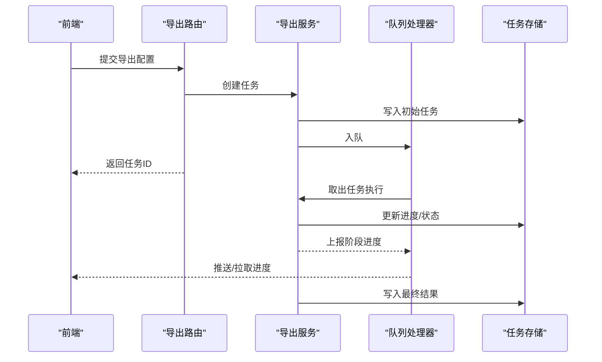

**图示来源**
- [route.ts:1-200](file://src/app/api/render/export/route.ts#L1-L200)
- [export-service.ts:1-200](file://src/features/render/export-service.ts#L1-L200)
- [queue-handler.ts:1-200](file://src/features/render/queue-handler.ts#L1-L200)
- [repository.ts:1-200](file://src/features/render/repository.ts#L1-L200)

**章节来源**
- [route.ts:1-200](file://src/app/api/render/export/route.ts#L1-L200)
- [export-service.ts:1-200](file://src/features/render/export-service.ts#L1-L200)
- [queue-handler.ts:1-200](file://src/features/render/queue-handler.ts#L1-L200)
- [repository.ts:1-200](file://src/features/render/repository.ts#L1-L200)

### 渲染管线（帧捕获、编码、拼接）
- 帧捕获
  - 从画布或时间线按帧抓取图像数据。
  - 支持分辨率缩放、裁剪、滤镜等预处理。
- 编码
  - 根据输出格式与质量参数进行编码。
  - 支持码率、帧率、色彩空间等参数。
- 拼接
  - 将编码片段合并为最终媒体文件。
  - 处理音频轨道与字幕轨（如适用）。

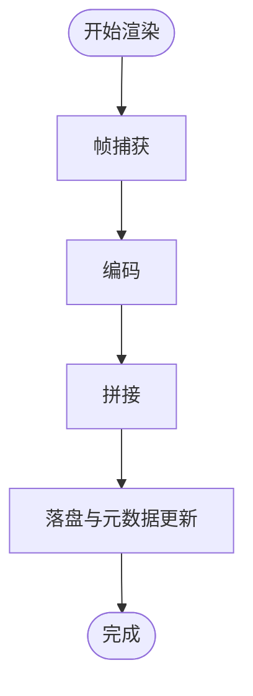

**图示来源**
- [frame-capture.ts:1-200](file://src/features/render/frame-capture.ts#L1-L200)
- [encode.ts:1-200](file://src/features/render/encode.ts#L1-L200)
- [concat.ts:1-200](file://src/features/render/concat.ts#L1-L200)
- [export-service.ts:1-200](file://src/features/render/export-service.ts#L1-L200)

**章节来源**
- [frame-capture.ts:1-200](file://src/features/render/frame-capture.ts#L1-L200)
- [encode.ts:1-200](file://src/features/render/encode.ts#L1-L200)
- [concat.ts:1-200](file://src/features/render/concat.ts#L1-L200)
- [export-service.ts:1-200](file://src/features/render/export-service.ts#L1-L200)

### 类型定义与索引
- 类型定义
  - 导出任务、渲染配置、队列项、进度、结果等统一类型。
- 索引
  - 对外暴露模块入口，简化导入。

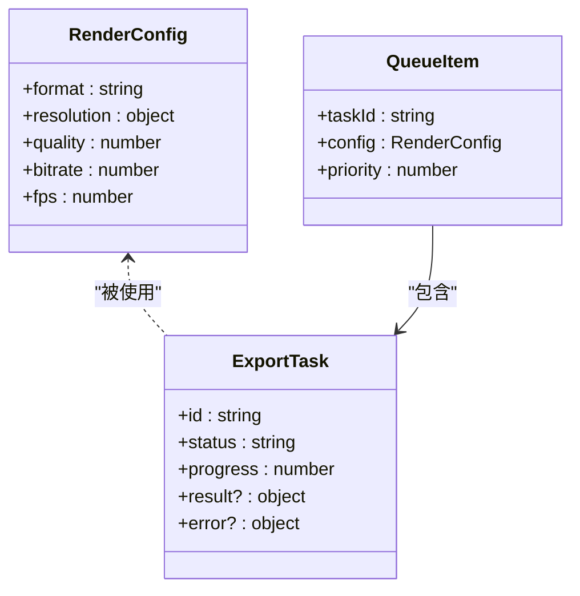

**图示来源**
- [types.ts:1-200](file://src/features/render/types.ts#L1-L200)
- [index.ts:1-200](file://src/features/render/index.ts#L1-L200)

**章节来源**
- [types.ts:1-200](file://src/features/render/types.ts#L1-L200)
- [index.ts:1-200](file://src/features/render/index.ts#L1-L200)

## 依赖关系分析
- 组件耦合
  - 导出节点与工作区、视图模型、API 客户端解耦良好，通过类型约束保证一致性。
  - 路由与服务之间通过明确的请求/响应契约交互。
- 外部依赖
  - 渲染管线可能依赖底层编解码库与文件系统。
- 循环依赖
  - 未发现明显循环依赖；各模块职责清晰。

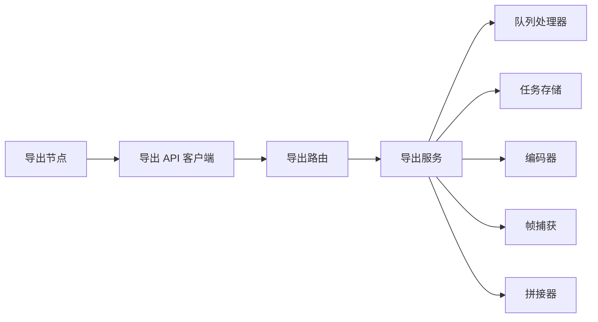

**图示来源**
- [export-node.tsx:1-200](file://src/components/ui/node/export-node.tsx#L1-L200)
- [export-api.ts:1-200](file://src/app/canvas/export/export-api.ts#L1-L200)
- [route.ts:1-200](file://src/app/api/render/export/route.ts#L1-L200)
- [export-service.ts:1-200](file://src/features/render/export-service.ts#L1-L200)
- [queue-handler.ts:1-200](file://src/features/render/queue-handler.ts#L1-L200)
- [repository.ts:1-200](file://src/features/render/repository.ts#L1-L200)
- [encode.ts:1-200](file://src/features/render/encode.ts#L1-L200)
- [frame-capture.ts:1-200](file://src/features/render/frame-capture.ts#L1-L200)
- [concat.ts:1-200](file://src/features/render/concat.ts#L1-L200)

**章节来源**
- [export-node.tsx:1-200](file://src/components/ui/node/export-node.tsx#L1-L200)
- [export-api.ts:1-200](file://src/app/canvas/export/export-api.ts#L1-L200)
- [route.ts:1-200](file://src/app/api/render/export/route.ts#L1-L200)
- [export-service.ts:1-200](file://src/features/render/export-service.ts#L1-L200)
- [queue-handler.ts:1-200](file://src/features/render/queue-handler.ts#L1-L200)
- [repository.ts:1-200](file://src/features/render/repository.ts#L1-L200)
- [encode.ts:1-200](file://src/features/render/encode.ts#L1-L200)
- [frame-capture.ts:1-200](file://src/features/render/frame-capture.ts#L1-L200)
- [concat.ts:1-200](file://src/features/render/concat.ts#L1-L200)

## 性能与渲染参数优化
- 输出格式
  - 选择合适的容器与编码格式，平衡兼容性与体积。
- 分辨率与质量
  - 分辨率影响内存与 I/O 压力；质量与码率共同决定体积与清晰度。
- 帧率与时长
  - 高帧率提升流畅度但增加编码成本；合理裁剪时长可减少资源消耗。
- 并行与缓存
  - 利用队列并发控制与中间结果缓存，避免重复计算。
- 内存与磁盘
  - 分块处理与临时文件清理，防止内存泄漏与磁盘爆满。
- 建议
  - 针对目标平台调整参数；优先保障稳定性，再追求极致体积。

[本节为通用指导，不直接分析具体文件]

## 队列管理与进度监控
- 队列机制
  - 任务入队、出队、重试、优先级与并发限制。
- 进度上报
  - 阶段粒度上报（准备、帧捕获、编码、拼接、落盘），前端轮询或长连接拉取。
- 监控面板
  - 显示队列长度、吞吐、失败率与平均耗时。

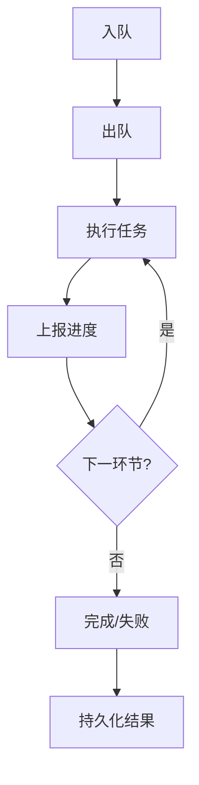

**图示来源**
- [queue-handler.ts:1-200](file://src/features/render/queue-handler.ts#L1-L200)
- [export-service.ts:1-200](file://src/features/render/export-service.ts#L1-L200)
- [repository.ts:1-200](file://src/features/render/repository.ts#L1-L200)

**章节来源**
- [queue-handler.ts:1-200](file://src/features/render/queue-handler.ts#L1-L200)
- [export-service.ts:1-200](file://src/features/render/export-service.ts#L1-L200)
- [repository.ts:1-200](file://src/features/render/repository.ts#L1-L200)

## 状态跟踪与错误处理
- 状态机
  - 常见状态：排队、执行中、完成、失败、取消。
- 错误分类
  - 参数错误、渲染异常、IO 错误、超时等。
- 恢复策略
  - 自动重试、降级参数、断点续传（如适用）、人工干预入口。
- 日志与追踪
  - 任务级日志、阶段标记、错误堆栈与上下文。

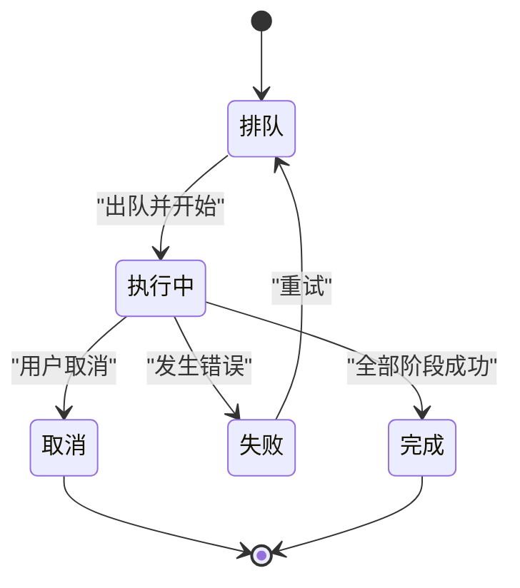

**图示来源**
- [types.ts:1-200](file://src/features/render/types.ts#L1-L200)
- [export-service.ts:1-200](file://src/features/render/export-service.ts#L1-L200)
- [queue-handler.ts:1-200](file://src/features/render/queue-handler.ts#L1-L200)

**章节来源**
- [types.ts:1-200](file://src/features/render/types.ts#L1-L200)
- [export-service.ts:1-200](file://src/features/render/export-service.ts#L1-L200)
- [queue-handler.ts:1-200](file://src/features/render/queue-handler.ts#L1-L200)

## 批量导出与定时任务
- 批量导出
  - 支持一次提交多个导出任务，统一队列管理。
  - 提供批量操作：批量重试、批量删除、批量下载。
- 定时任务
  - 基于计划任务或外部调度器触发导出。
  - 支持周期性与一次性任务，结合模板参数生成不同导出。
- 配置方法
  - 通过导出工作区或 API 传入任务清单与调度策略。

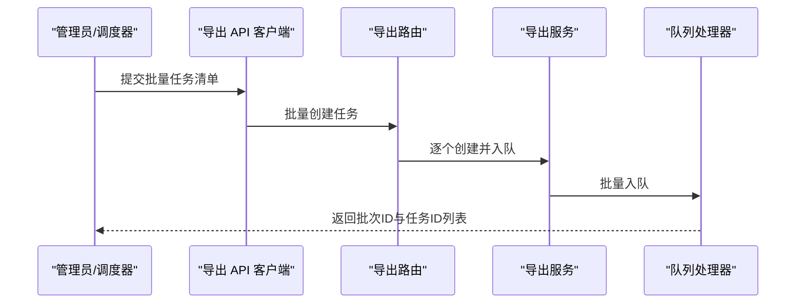

**图示来源**
- [export-api.ts:1-200](file://src/app/canvas/export/export-api.ts#L1-L200)
- [route.ts:1-200](file://src/app/api/render/export/route.ts#L1-L200)
- [export-service.ts:1-200](file://src/features/render/export-service.ts#L1-L200)
- [queue-handler.ts:1-200](file://src/features/render/queue-handler.ts#L1-L200)

**章节来源**
- [export-api.ts:1-200](file://src/app/canvas/export/export-api.ts#L1-L200)
- [route.ts:1-200](file://src/app/api/render/export/route.ts#L1-L200)
- [export-service.ts:1-200](file://src/features/render/export-service.ts#L1-L200)
- [queue-handler.ts:1-200](file://src/features/render/queue-handler.ts#L1-L200)

## 结果文件管理与版本控制集成
- 文件管理
  - 结果落盘路径、命名规范、元数据记录（大小、哈希、时间戳）。
  - 清理策略：保留最近 N 个版本、按项目归档。
- 版本控制
  - 与版本系统对接，记录导出产物与变更。
  - 支持回滚至历史版本、对比差异。
- 访问与分享
  - 提供下载链接、预览缩略图、权限控制。

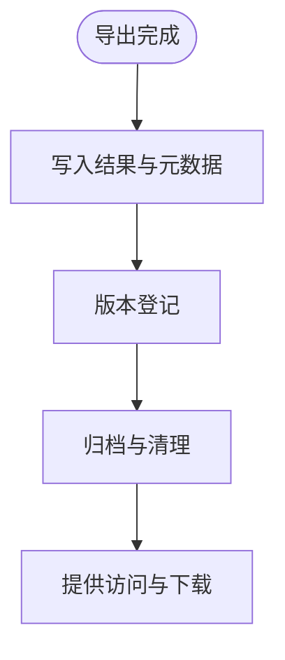

**图示来源**
- [repository.ts:1-200](file://src/features/render/repository.ts#L1-L200)
- [export-service.ts:1-200](file://src/features/render/export-service.ts#L1-L200)

**章节来源**
- [repository.ts:1-200](file://src/features/render/repository.ts#L1-L200)
- [export-service.ts:1-200](file://src/features/render/export-service.ts#L1-L200)

## 故障排查指南
- 常见问题
  - 参数校验失败：检查输出格式、分辨率、码率范围。
  - 渲染中断：关注帧捕获与编码阶段的错误日志。
  - 队列堆积：检查并发限制与消费者健康状态。
  - 磁盘不足：清理临时文件与旧结果。
- 诊断步骤
  - 查看任务详情与阶段进度。
  - 检索错误信息与堆栈。
  - 复现最小用例并逐步放宽参数。
- 恢复措施
  - 重试失败任务、降低质量或分辨率、扩容资源。

**章节来源**
- [export-service.ts:1-200](file://src/features/render/export-service.ts#L1-L200)
- [queue-handler.ts:1-200](file://src/features/render/queue-handler.ts#L1-L200)
- [repository.ts:1-200](file://src/features/render/repository.ts#L1-L200)

## 结论
导出节点提供了从配置到执行的完整能力，涵盖输出格式、分辨率与质量设置，渲染参数优化与性能调优，队列管理与进度监控，任务状态与错误处理，批量与定时导出，以及结果文件管理与版本控制集成。通过清晰的模块划分与类型约束，系统具备良好的可扩展性与可维护性。建议在生产环境中结合业务需求细化参数预设、完善监控告警与容错策略。