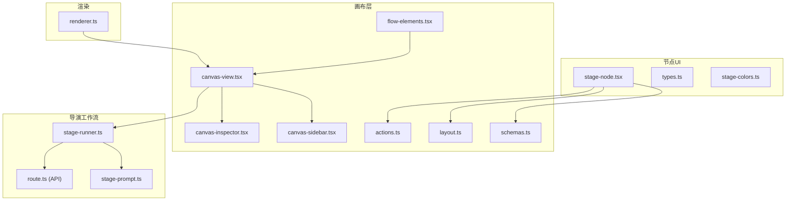
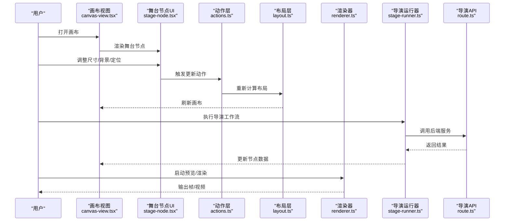
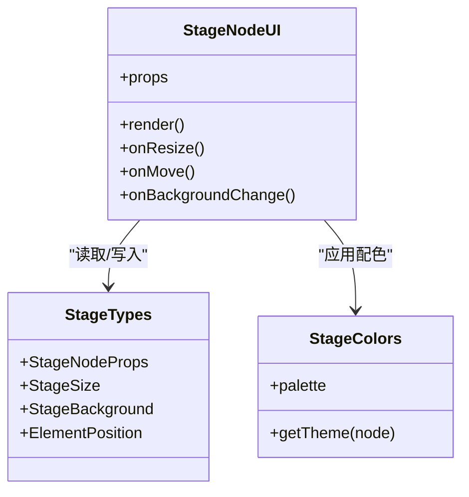
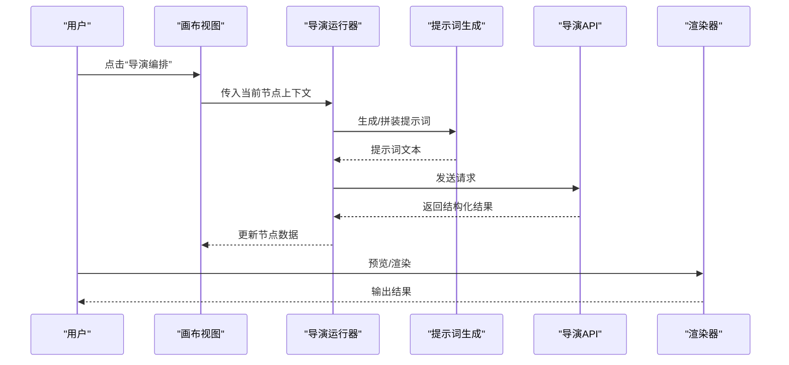
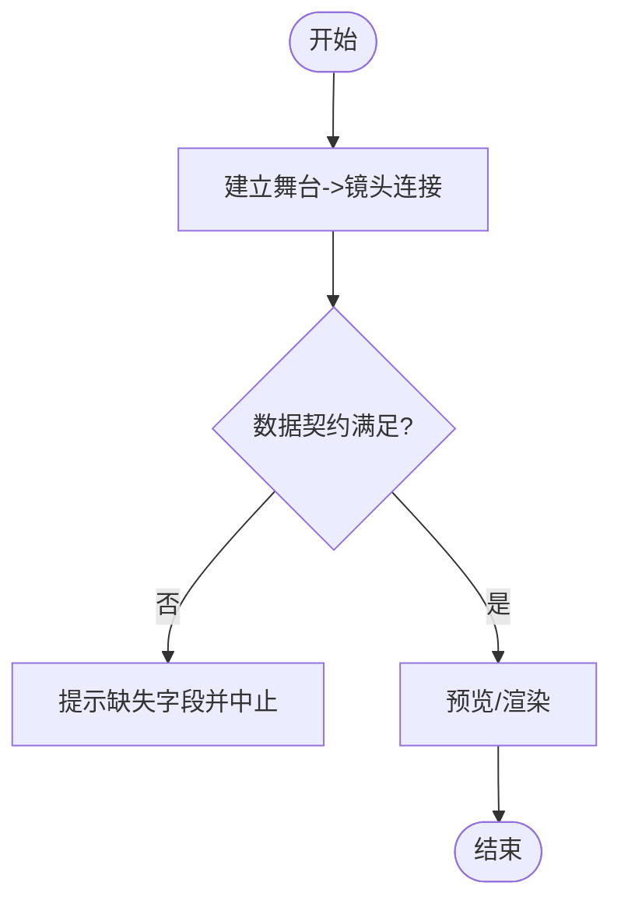
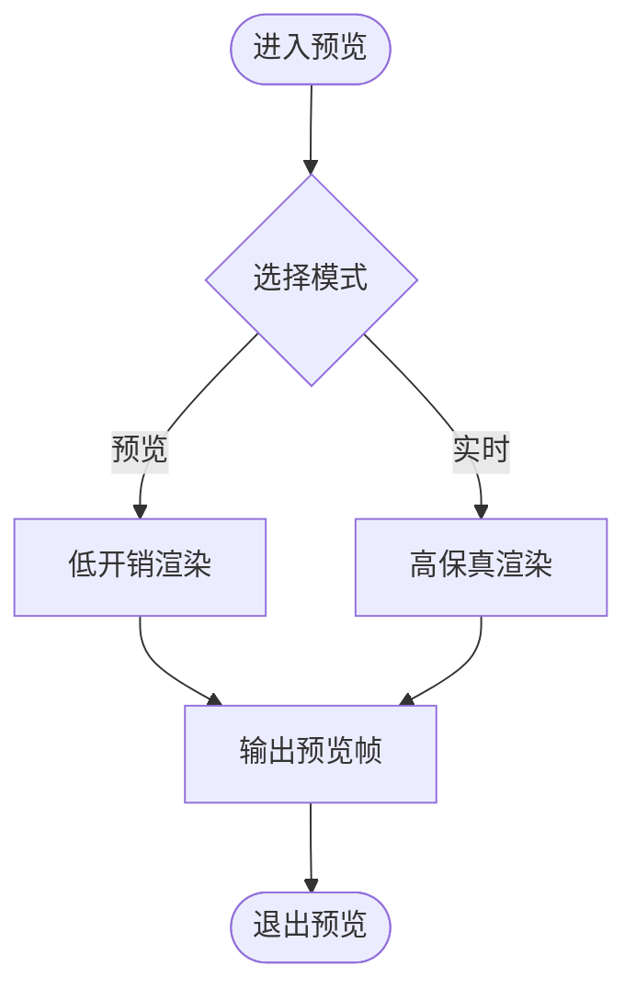
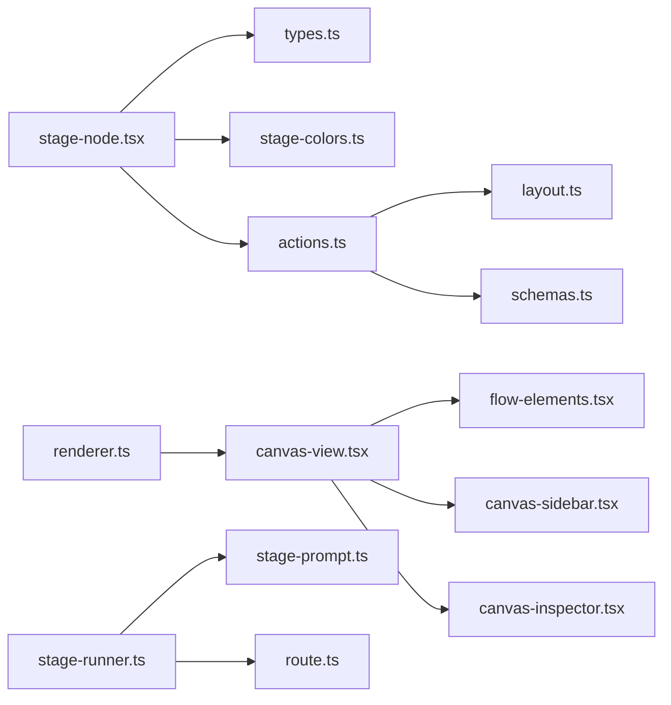

# 舞台节点

<cite>
**本文引用的文件**
- [src/components/ui/node/stage-node.tsx](file://src/components/ui/node/stage-node.tsx)
- [src/components/ui/node/stage-colors.ts](file://src/components/ui/node/stage-colors.ts)
- [src/components/ui/node/types.ts](file://src/components/ui/node/types.ts)
- [src/features/canvas/schemas.ts](file://src/features/canvas/schemas.ts)
- [src/features/canvas/layout.ts](file://src/features/canvas/layout.ts)
- [src/features/canvas/actions.ts](file://src/features/canvas/actions.ts)
- [src/app/canvas/flow-elements.tsx](file://src/app/canvas/flow-elements.tsx)
- [src/app/canvas/canvas-view.tsx](file://src/app/canvas/canvas-view.tsx)
- [src/app/canvas/canvas-sidebar.tsx](file://src/app/canvas/canvas-sidebar.tsx)
- [src/app/canvas/canvas-inspector.tsx](file://src/app/canvas/canvas-inspector.tsx)
- [src/app/api/director/stage/route.ts](file://src/app/api/director/stage/route.ts)
- [src/features/director/stage-runner.ts](file://src/features/director/stage-runner.ts)
- [src/features/director/stage-prompt.ts](file://src/features/director/stage-prompt.ts)
- [src/features/render/renderer.ts](file://src/features/render/renderer.ts)
</cite>

## 目录
1. [简介](#简介)
2. [项目结构](#项目结构)
3. [核心组件](#核心组件)
4. [架构总览](#架构总览)
5. [详细组件分析](#详细组件分析)
6. [依赖关系分析](#依赖关系分析)
7. [性能考虑](#性能考虑)
8. [故障排查指南](#故障排查指南)
9. [结论](#结论)
10. [附录](#附录)

## 简介
本章节面向使用“舞台节点”的创作者与开发者，系统性介绍其在可视化编辑中的能力：场景布局、背景设置、元素定位；舞台尺寸与分辨率配置；画布属性；在导演工作流中的使用示例；舞台与镜头节点的连接与数据传递；预览与实时渲染选项；以及模板与预设的使用方法。文档同时提供架构图、流程图和时序图，帮助快速上手与深入理解。

## 项目结构
围绕舞台节点的相关代码主要分布在以下位置：
- 节点 UI 与类型定义：src/components/ui/node/*
- 画布行为与布局：src/features/canvas/*
- 页面集成（入口、侧边栏、检查器）：src/app/canvas/*
- 导演工作流（阶段编排、提示词生成）：src/features/director/*
- 渲染管线（帧捕获、导出）：src/features/render/*

图表来源
- [src/components/ui/node/stage-node.tsx](file://src/components/ui/node/stage-node.tsx)
- [src/components/ui/node/types.ts](file://src/components/ui/node/types.ts)
- [src/components/ui/node/stage-colors.ts](file://src/components/ui/node/stage-colors.ts)
- [src/features/canvas/schemas.ts](file://src/features/canvas/schemas.ts)
- [src/features/canvas/layout.ts](file://src/features/canvas/layout.ts)
- [src/features/canvas/actions.ts](file://src/features/canvas/actions.ts)
- [src/app/canvas/flow-elements.tsx](file://src/app/canvas/flow-elements.tsx)
- [src/app/canvas/canvas-view.tsx](file://src/app/canvas/canvas-view.tsx)
- [src/app/canvas/canvas-sidebar.tsx](file://src/app/canvas/canvas-sidebar.tsx)
- [src/app/canvas/canvas-inspector.tsx](file://src/app/canvas/canvas-inspector.tsx)
- [src/features/director/stage-runner.ts](file://src/features/director/stage-runner.ts)
- [src/features/director/stage-prompt.ts](file://src/features/director/stage-prompt.ts)
- [src/app/api/director/stage/route.ts](file://src/app/api/director/stage/route.ts)
- [src/features/render/renderer.ts](file://src/features/render/renderer.ts)

章节来源
- [src/components/ui/node/stage-node.tsx](file://src/components/ui/node/stage-node.tsx)
- [src/components/ui/node/types.ts](file://src/components/ui/node/types.ts)
- [src/components/ui/node/stage-colors.ts](file://src/components/ui/node/stage-colors.ts)
- [src/features/canvas/schemas.ts](file://src/features/canvas/schemas.ts)
- [src/features/canvas/layout.ts](file://src/features/canvas/layout.ts)
- [src/features/canvas/actions.ts](file://src/features/canvas/actions.ts)
- [src/app/canvas/flow-elements.tsx](file://src/app/canvas/flow-elements.tsx)
- [src/app/canvas/canvas-view.tsx](file://src/app/canvas/canvas-view.tsx)
- [src/app/canvas/canvas-sidebar.tsx](file://src/app/canvas/canvas-sidebar.tsx)
- [src/app/canvas/canvas-inspector.tsx](file://src/app/canvas/canvas-inspector.tsx)
- [src/features/director/stage-runner.ts](file://src/features/director/stage-runner.ts)
- [src/features/director/stage-prompt.ts](file://src/features/director/stage-prompt.ts)
- [src/app/api/director/stage/route.ts](file://src/app/api/director/stage/route.ts)
- [src/features/render/renderer.ts](file://src/features/render/renderer.ts)

## 核心组件
- 舞台节点 UI：负责在画布中展示舞台节点，支持拖拽、缩放、选中态等交互，并暴露属性面板以调整舞台尺寸、背景、元素定位等。
- 类型与颜色：集中定义舞台节点的数据结构与配色方案，确保跨模块一致性与可维护性。
- 画布模式与校验：通过 schema 对节点数据进行校验与默认值填充，保障输入合法性。
- 布局与动作：提供布局计算与状态变更动作，驱动节点在画布中的排列与更新。
- 页面集成：将舞台节点注册到画布视图、侧边栏与检查器中，形成完整的编辑体验。

章节来源
- [src/components/ui/node/stage-node.tsx](file://src/components/ui/node/stage-node.tsx)
- [src/components/ui/node/types.ts](file://src/components/ui/node/types.ts)
- [src/components/ui/node/stage-colors.ts](file://src/components/ui/node/stage-colors.ts)
- [src/features/canvas/schemas.ts](file://src/features/canvas/schemas.ts)
- [src/features/canvas/layout.ts](file://src/features/canvas/layout.ts)
- [src/features/canvas/actions.ts](file://src/features/canvas/actions.ts)
- [src/app/canvas/flow-elements.tsx](file://src/app/canvas/flow-elements.tsx)
- [src/app/canvas/canvas-view.tsx](file://src/app/canvas/canvas-view.tsx)
- [src/app/canvas/canvas-sidebar.tsx](file://src/app/canvas/canvas-sidebar.tsx)
- [src/app/canvas/canvas-inspector.tsx](file://src/app/canvas/canvas-inspector.tsx)

## 架构总览
下图展示了从用户操作到渲染输出的端到端流程：用户在画布中编辑舞台节点，系统通过动作更新状态，必要时调用导演工作流生成或优化内容，最终由渲染器输出帧序列或视频。

图表来源
- [src/app/canvas/canvas-view.tsx](file://src/app/canvas/canvas-view.tsx)
- [src/components/ui/node/stage-node.tsx](file://src/components/ui/node/stage-node.tsx)
- [src/features/canvas/actions.ts](file://src/features/canvas/actions.ts)
- [src/features/canvas/layout.ts](file://src/features/canvas/layout.ts)
- [src/features/render/renderer.ts](file://src/features/render/renderer.ts)
- [src/features/director/stage-runner.ts](file://src/features/director/stage-runner.ts)
- [src/app/api/director/stage/route.ts](file://src/app/api/director/stage/route.ts)

## 详细组件分析

### 舞台节点类图
该图展示舞台节点相关的类型与组件关系，包括节点数据结构、颜色主题与 UI 组件之间的依赖。

图表来源
- [src/components/ui/node/stage-node.tsx](file://src/components/ui/node/stage-node.tsx)
- [src/components/ui/node/types.ts](file://src/components/ui/node/types.ts)
- [src/components/ui/node/stage-colors.ts](file://src/components/ui/node/stage-colors.ts)

章节来源
- [src/components/ui/node/stage-node.tsx](file://src/components/ui/node/stage-node.tsx)
- [src/components/ui/node/types.ts](file://src/components/ui/node/types.ts)
- [src/components/ui/node/stage-colors.ts](file://src/components/ui/node/stage-colors.ts)

### 舞台尺寸与分辨率配置
- 舞台尺寸：通过节点属性定义画布的宽度和高度，影响所有子元素的相对定位与缩放。
- 分辨率：与导出/渲染相关，通常与像素密度、目标设备匹配，避免模糊或裁剪。
- 建议：在创作时优先确定目标分辨率，再统一调整舞台尺寸，保证一致性。

章节来源
- [src/components/ui/node/types.ts](file://src/components/ui/node/types.ts)
- [src/features/canvas/schemas.ts](file://src/features/canvas/schemas.ts)
- [src/features/render/renderer.ts](file://src/features/render/renderer.ts)

### 背景设置与元素定位
- 背景设置：支持纯色、渐变或图片背景，可在属性面板中切换与预览。
- 元素定位：基于舞台坐标系进行 x/y 偏移、宽高与层级控制，配合布局算法实现自适应。
- 最佳实践：先设定背景与舞台尺寸，再放置元素，最后微调定位与层级。

章节来源
- [src/components/ui/node/stage-node.tsx](file://src/components/ui/node/stage-node.tsx)
- [src/features/canvas/layout.ts](file://src/features/canvas/layout.ts)
- [src/features/canvas/actions.ts](file://src/features/canvas/actions.ts)

### 画布属性与校验
- 属性模型：通过 schema 定义节点字段、默认值与约束条件，确保数据完整性。
- 校验策略：在保存、提交或渲染前进行强校验，失败则回滚或提示修正。
- 扩展点：新增属性需同步更新 schema、UI 表单与校验逻辑。

章节来源
- [src/features/canvas/schemas.ts](file://src/features/canvas/schemas.ts)
- [src/features/canvas/actions.ts](file://src/features/canvas/actions.ts)

### 导演工作流中的使用示例
- 典型流程：在画布中布置舞台节点与镜头节点，选择“导演编排”，系统根据提示词生成或优化舞台内容，并将结果写回节点。
- 关键步骤：
  - 准备舞台参数（尺寸、背景、元素清单）。
  - 调用导演运行器，内部生成提示词并请求后端服务。
  - 接收返回的结构化结果，更新节点数据。
  - 进入预览或导出阶段。

图表来源
- [src/features/director/stage-runner.ts](file://src/features/director/stage-runner.ts)
- [src/features/director/stage-prompt.ts](file://src/features/director/stage-prompt.ts)
- [src/app/api/director/stage/route.ts](file://src/app/api/director/stage/route.ts)
- [src/app/canvas/canvas-view.tsx](file://src/app/canvas/canvas-view.tsx)
- [src/features/render/renderer.ts](file://src/features/render/renderer.ts)

章节来源
- [src/features/director/stage-runner.ts](file://src/features/director/stage-runner.ts)
- [src/features/director/stage-prompt.ts](file://src/features/director/stage-prompt.ts)
- [src/app/api/director/stage/route.ts](file://src/app/api/director/stage/route.ts)
- [src/app/canvas/canvas-view.tsx](file://src/app/canvas/canvas-view.tsx)

### 舞台与镜头节点的连接关系和数据传递
- 连接方式：在画布中将舞台节点作为上游，镜头节点作为下游，建立有向边表示数据流向。
- 数据契约：舞台输出包含画面内容、时间轴信息、音频轨道等；镜头节点消费这些数据并进行裁剪、转场与合成。
- 校验与容错：若下游缺少必要字段，应给出明确错误提示并阻止渲染。

图表来源
- [src/app/canvas/flow-elements.tsx](file://src/app/canvas/flow-elements.tsx)
- [src/features/canvas/schemas.ts](file://src/features/canvas/schemas.ts)

章节来源
- [src/app/canvas/flow-elements.tsx](file://src/app/canvas/flow-elements.tsx)
- [src/features/canvas/schemas.ts](file://src/features/canvas/schemas.ts)

### 舞台预览与实时渲染选项
- 预览模式：低开销渲染，适合快速查看效果，减少资源占用。
- 实时渲染：高保真输出，用于最终质量验证，可能涉及更复杂的解码与编码。
- 切换策略：根据设备性能与网络状况自动降级或提升质量。

图表来源
- [src/features/render/renderer.ts](file://src/features/render/renderer.ts)
- [src/app/canvas/canvas-view.tsx](file://src/app/canvas/canvas-view.tsx)

章节来源
- [src/features/render/renderer.ts](file://src/features/render/renderer.ts)
- [src/app/canvas/canvas-view.tsx](file://src/app/canvas/canvas-view.tsx)

### 舞台模板与预设配置
- 模板：预置的舞台尺寸、背景与元素布局，便于快速创建相似场景。
- 预设：常用参数组合（如分辨率、帧率、码率），一键应用到多个节点。
- 管理方式：在侧边栏或检查器中浏览、选择与覆盖现有配置。

章节来源
- [src/app/canvas/canvas-sidebar.tsx](file://src/app/canvas/canvas-sidebar.tsx)
- [src/app/canvas/canvas-inspector.tsx](file://src/app/canvas/canvas-inspector.tsx)
- [src/components/ui/node/stage-node.tsx](file://src/components/ui/node/stage-node.tsx)

## 依赖关系分析
- 组件耦合：舞台节点 UI 依赖类型与颜色模块，保持职责单一；动作与布局模块解耦，便于测试与替换。
- 外部集成：导演工作流通过 API 路由与后端服务通信；渲染器独立于编辑器，可复用。
- 潜在风险：避免在 UI 层直接调用后端，确保通过动作与运行器中转，降低循环依赖。

图表来源
- [src/components/ui/node/stage-node.tsx](file://src/components/ui/node/stage-node.tsx)
- [src/components/ui/node/types.ts](file://src/components/ui/node/types.ts)
- [src/components/ui/node/stage-colors.ts](file://src/components/ui/node/stage-colors.ts)
- [src/features/canvas/actions.ts](file://src/features/canvas/actions.ts)
- [src/features/canvas/layout.ts](file://src/features/canvas/layout.ts)
- [src/features/canvas/schemas.ts](file://src/features/canvas/schemas.ts)
- [src/app/canvas/canvas-view.tsx](file://src/app/canvas/canvas-view.tsx)
- [src/app/canvas/flow-elements.tsx](file://src/app/canvas/flow-elements.tsx)
- [src/app/canvas/canvas-sidebar.tsx](file://src/app/canvas/canvas-sidebar.tsx)
- [src/app/canvas/canvas-inspector.tsx](file://src/app/canvas/canvas-inspector.tsx)
- [src/features/director/stage-runner.ts](file://src/features/director/stage-runner.ts)
- [src/features/director/stage-prompt.ts](file://src/features/director/stage-prompt.ts)
- [src/app/api/director/stage/route.ts](file://src/app/api/director/stage/route.ts)
- [src/features/render/renderer.ts](file://src/features/render/renderer.ts)

章节来源
- [src/components/ui/node/stage-node.tsx](file://src/components/ui/node/stage-node.tsx)
- [src/features/canvas/actions.ts](file://src/features/canvas/actions.ts)
- [src/features/canvas/layout.ts](file://src/features/canvas/layout.ts)
- [src/features/canvas/schemas.ts](file://src/features/canvas/schemas.ts)
- [src/app/canvas/canvas-view.tsx](file://src/app/canvas/canvas-view.tsx)
- [src/features/director/stage-runner.ts](file://src/features/director/stage-runner.ts)
- [src/features/render/renderer.ts](file://src/features/render/renderer.ts)

## 性能考虑
- 预览模式优先：在复杂场景中启用低开销渲染，避免卡顿。
- 批量更新：合并多次属性变更，减少重排与重绘。
- 缓存策略：对静态背景与已渲染帧进行缓存，提高回放速度。
- 资源限制：限制并发渲染任务数量，防止内存溢出。

[本节为通用指导，不直接分析具体文件]

## 故障排查指南
- 常见错误：
  - 尺寸非法：宽度或高度小于阈值，导致布局异常。
  - 背景加载失败：图片或渐变资源不可用，显示占位色。
  - 数据契约不满足：镜头节点缺少必需字段，渲染中断。
- 定位方法：
  - 检查器日志：查看最近一次动作与校验结果。
  - 侧边栏模板：对比预设配置差异。
  - 渲染器状态：确认是否处于预览或实时模式。

章节来源
- [src/app/canvas/canvas-inspector.tsx](file://src/app/canvas/canvas-inspector.tsx)
- [src/app/canvas/canvas-sidebar.tsx](file://src/app/canvas/canvas-sidebar.tsx)
- [src/features/render/renderer.ts](file://src/features/render/renderer.ts)

## 结论
舞台节点为可视化编辑的核心构件，提供灵活的尺寸、背景与定位能力，并与导演工作流和渲染管线紧密协作。遵循本文的配置与最佳实践，可显著提升创作效率与输出质量。

[本节为总结，不直接分析具体文件]

## 附录
- 术语表：
  - 舞台节点：定义画布尺寸、背景与元素布局的基础节点。
  - 镜头节点：对舞台内容进行裁剪、转场与合成的下游节点。
  - 导演工作流：基于提示词与后端服务的自动化编排过程。
  - 预览/实时渲染：不同质量与性能的渲染模式。

[本节为概念说明，不直接分析具体文件]