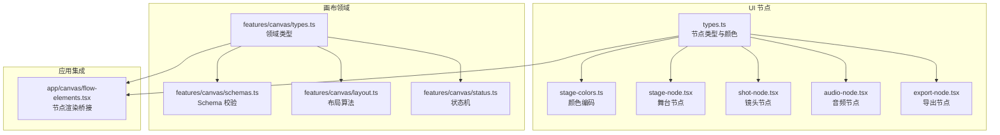
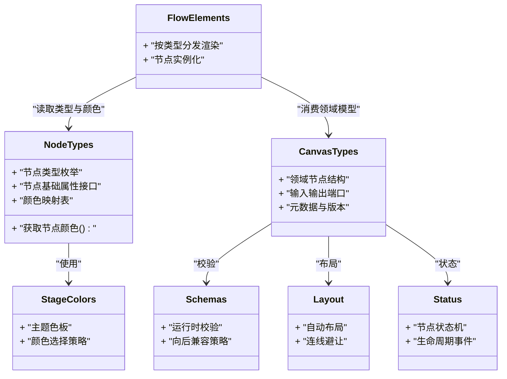
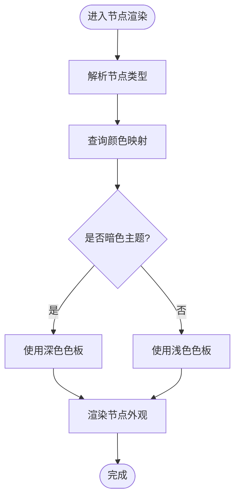
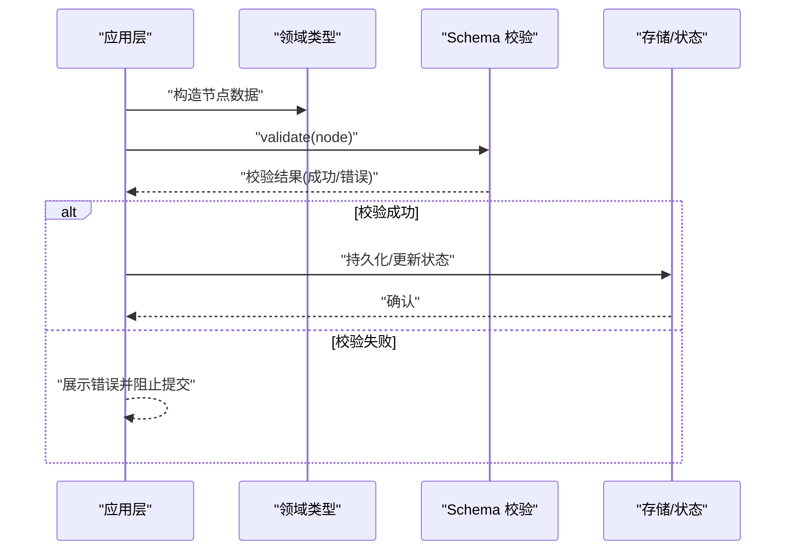
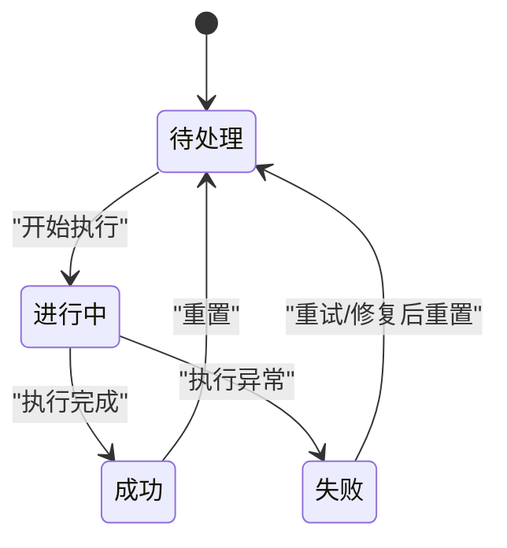
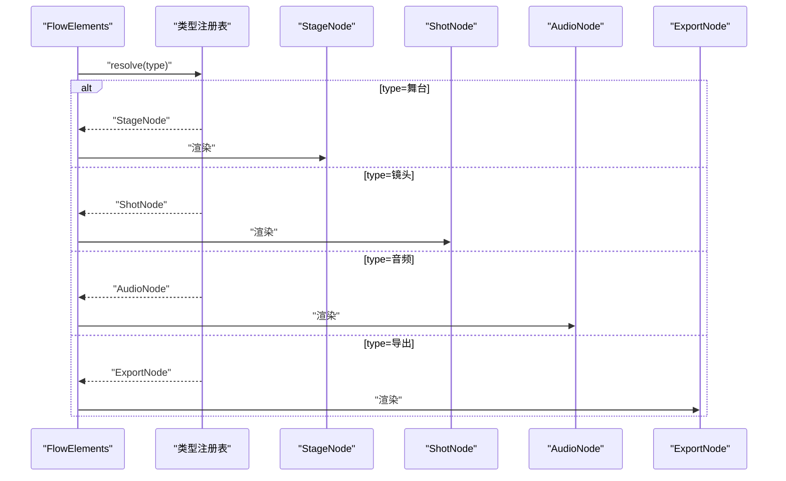
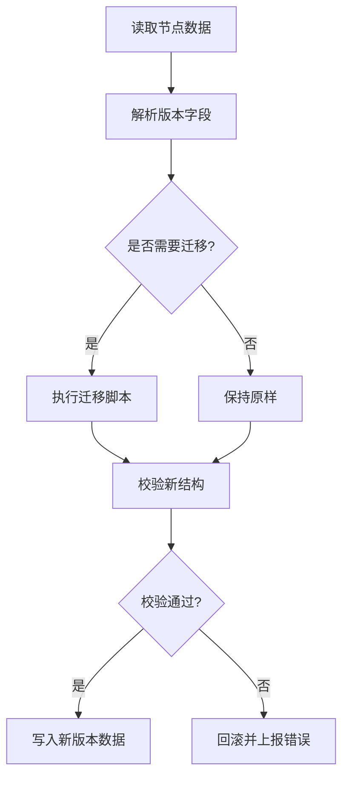
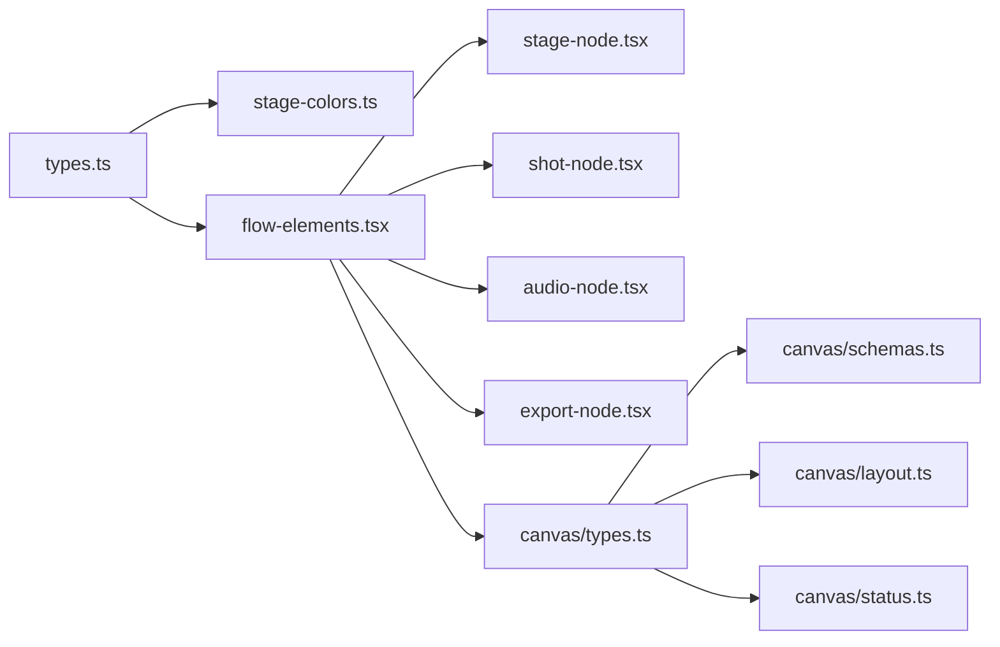

# 节点类型系统

<cite>
**本文引用的文件**
- [src/components/ui/node/types.ts](file://src/components/ui/node/types.ts)
- [src/components/ui/node/stage-colors.ts](file://src/components/ui/node/stage-colors.ts)
- [src/components/ui/node/stage-node.tsx](file://src/components/ui/node/stage-node.tsx)
- [src/components/ui/node/shot-node.tsx](file://src/components/ui/node/shot-node.tsx)
- [src/components/ui/node/audio-node.tsx](file://src/components/ui/node/audio-node.tsx)
- [src/components/ui/node/export-node.tsx](file://src/components/ui/node/export-node.tsx)
- [src/features/canvas/types.ts](file://src/features/canvas/types.ts)
- [src/features/canvas/schemas.ts](file://src/features/canvas/schemas.ts)
- [src/features/canvas/layout.ts](file://src/features/canvas/layout.ts)
- [src/features/canvas/status.ts](file://src/features/canvas/status.ts)
- [src/app/canvas/flow-elements.tsx](file://src/app/canvas/flow-elements.tsx)
</cite>

## 目录
1. [简介](#简介)
2. [项目结构](#项目结构)
3. [核心组件](#核心组件)
4. [架构总览](#架构总览)
5. [详细组件分析](#详细组件分析)
6. [依赖关系分析](#依赖关系分析)
7. [性能考量](#性能考量)
8. [故障排查指南](#故障排查指南)
9. [结论](#结论)
10. [附录](#附录)

## 简介
本文件面向 CodeVideoCanvas 的“节点类型系统”，系统性阐述节点类型的定义、属性接口与数据模型，节点颜色编码与视觉标识机制，节点注册与动态加载的实现原理，节点验证规则与类型安全检查，以及如何扩展新的节点类型和自定义属性。同时说明节点间的依赖关系与版本兼容性管理策略，帮助读者从概念到实现全面理解并安全地扩展系统。

## 项目结构
与节点类型系统直接相关的代码主要分布在以下位置：
- 节点类型与颜色体系：位于 UI 层 node 子目录，集中定义节点类型、颜色映射与通用渲染逻辑
- 画布领域模型与校验：位于 features/canvas 目录，提供领域类型、Schema 校验、布局与状态等能力
- 画布视图集成：位于 app/canvas 目录，负责将领域模型与 UI 节点进行桥接与渲染

图表来源
- [src/components/ui/node/types.ts](file://src/components/ui/node/types.ts)
- [src/components/ui/node/stage-colors.ts](file://src/components/ui/node/stage-colors.ts)
- [src/components/ui/node/stage-node.tsx](file://src/components/ui/node/stage-node.tsx)
- [src/components/ui/node/shot-node.tsx](file://src/components/ui/node/shot-node.tsx)
- [src/components/ui/node/audio-node.tsx](file://src/components/ui/node/audio-node.tsx)
- [src/components/ui/node/export-node.tsx](file://src/components/ui/node/export-node.tsx)
- [src/features/canvas/types.ts](file://src/features/canvas/types.ts)
- [src/features/canvas/schemas.ts](file://src/features/canvas/schemas.ts)
- [src/features/canvas/layout.ts](file://src/features/canvas/layout.ts)
- [src/features/canvas/status.ts](file://src/features/canvas/status.ts)
- [src/app/canvas/flow-elements.tsx](file://src/app/canvas/flow-elements.tsx)

章节来源
- [src/components/ui/node/types.ts](file://src/components/ui/node/types.ts)
- [src/components/ui/node/stage-colors.ts](file://src/components/ui/node/stage-colors.ts)
- [src/features/canvas/types.ts](file://src/features/canvas/types.ts)
- [src/features/canvas/schemas.ts](file://src/features/canvas/schemas.ts)
- [src/features/canvas/layout.ts](file://src/features/canvas/layout.ts)
- [src/features/canvas/status.ts](file://src/features/canvas/status.ts)
- [src/app/canvas/flow-elements.tsx](file://src/app/canvas/flow-elements.tsx)

## 核心组件
本节聚焦节点类型系统的核心构件：类型定义、颜色编码、领域模型与校验、以及渲染桥接。

- 节点类型与颜色编码
  - types.ts 定义了节点类型枚举、节点基础属性接口、颜色映射表及获取函数，用于统一节点的视觉标识
  - stage-colors.ts 提供主题色板与颜色选择策略，确保不同节点在明暗主题下保持一致的可读性与对比度
- 领域模型与校验
  - features/canvas/types.ts 定义画布领域的节点数据结构、输入输出端口、元数据与版本字段
  - features/canvas/schemas.ts 使用 Schema 对节点数据进行运行时校验，保证数据完整性与向后兼容
- 布局与状态
  - features/canvas/layout.ts 提供节点布局计算（如自动排列、连线避让）
  - features/canvas/status.ts 维护节点生命周期与运行状态（如待处理、进行中、成功、失败）
- 渲染桥接
  - app/canvas/flow-elements.tsx 根据节点类型分发到具体 UI 节点组件，完成可视化呈现与交互

章节来源
- [src/components/ui/node/types.ts](file://src/components/ui/node/types.ts)
- [src/components/ui/node/stage-colors.ts](file://src/components/ui/node/stage-colors.ts)
- [src/features/canvas/types.ts](file://src/features/canvas/types.ts)
- [src/features/canvas/schemas.ts](file://src/features/canvas/schemas.ts)
- [src/features/canvas/layout.ts](file://src/features/canvas/layout.ts)
- [src/features/canvas/status.ts](file://src/features/canvas/status.ts)
- [src/app/canvas/flow-elements.tsx](file://src/app/canvas/flow-elements.tsx)

## 架构总览
下图展示了节点类型系统在 UI 层、领域层与应用集成层的协作关系。

图表来源
- [src/components/ui/node/types.ts](file://src/components/ui/node/types.ts)
- [src/components/ui/node/stage-colors.ts](file://src/components/ui/node/stage-colors.ts)
- [src/features/canvas/types.ts](file://src/features/canvas/types.ts)
- [src/features/canvas/schemas.ts](file://src/features/canvas/schemas.ts)
- [src/features/canvas/layout.ts](file://src/features/canvas/layout.ts)
- [src/features/canvas/status.ts](file://src/features/canvas/status.ts)
- [src/app/canvas/flow-elements.tsx](file://src/app/canvas/flow-elements.tsx)

## 详细组件分析

### 节点类型与颜色编码
- 类型定义
  - 通过统一的节点类型枚举与基础属性接口，确保所有节点具备一致的元数据、ID、名称、描述、版本等字段
  - 颜色映射表为每种节点类型绑定主色与强调色，便于快速识别
- 颜色编码与视觉标识
  - 颜色选择遵循可访问性原则，支持明暗主题切换
  - 节点边框、标题栏、连接点等视觉元素采用一致的颜色语义，提升可读性

图表来源
- [src/components/ui/node/types.ts](file://src/components/ui/node/types.ts)
- [src/components/ui/node/stage-colors.ts](file://src/components/ui/node/stage-colors.ts)

章节来源
- [src/components/ui/node/types.ts](file://src/components/ui/node/types.ts)
- [src/components/ui/node/stage-colors.ts](file://src/components/ui/node/stage-colors.ts)

### 领域模型与校验
- 领域模型
  - 节点包含输入/输出端口定义、参数对象、执行上下文、结果缓存与版本信息
  - 版本字段用于控制迁移与兼容性策略
- 校验规则
  - 使用 Schema 对节点数据进行强类型校验，包括必填字段、类型约束、取值范围与关联引用
  - 校验失败时返回结构化错误，便于上层提示与回滚

图表来源
- [src/features/canvas/types.ts](file://src/features/canvas/types.ts)
- [src/features/canvas/schemas.ts](file://src/features/canvas/schemas.ts)

章节来源
- [src/features/canvas/types.ts](file://src/features/canvas/types.ts)
- [src/features/canvas/schemas.ts](file://src/features/canvas/schemas.ts)

### 布局与状态
- 布局
  - 基于节点拓扑关系计算坐标，避免连线交叉与重叠
  - 支持拖拽后的增量重排与局部刷新
- 状态
  - 节点状态机涵盖待处理、进行中、成功、失败等状态
  - 状态变更触发副作用（如日志记录、重试策略、UI 反馈）

图表来源
- [src/features/canvas/status.ts](file://src/features/canvas/status.ts)
- [src/features/canvas/layout.ts](file://src/features/canvas/layout.ts)

章节来源
- [src/features/canvas/status.ts](file://src/features/canvas/status.ts)
- [src/features/canvas/layout.ts](file://src/features/canvas/layout.ts)

### 渲染桥接与动态加载
- 渲染桥接
  - flow-elements.tsx 根据节点类型分派到对应 UI 组件（如舞台、镜头、音频、导出）
  - 每个 UI 组件负责自身属性面板、预览与交互行为
- 动态加载
  - 通过类型枚举与工厂式注册机制，新增节点类型无需修改核心分发逻辑
  - 支持按需加载大型节点组件，降低首屏体积

图表来源
- [src/app/canvas/flow-elements.tsx](file://src/app/canvas/flow-elements.tsx)
- [src/components/ui/node/stage-node.tsx](file://src/components/ui/node/stage-node.tsx)
- [src/components/ui/node/shot-node.tsx](file://src/components/ui/node/shot-node.tsx)
- [src/components/ui/node/audio-node.tsx](file://src/components/ui/node/audio-node.tsx)
- [src/components/ui/node/export-node.tsx](file://src/components/ui/node/export-node.tsx)

章节来源
- [src/app/canvas/flow-elements.tsx](file://src/app/canvas/flow-elements.tsx)
- [src/components/ui/node/stage-node.tsx](file://src/components/ui/node/stage-node.tsx)
- [src/components/ui/node/shot-node.tsx](file://src/components/ui/node/shot-node.tsx)
- [src/components/ui/node/audio-node.tsx](file://src/components/ui/node/audio-node.tsx)
- [src/components/ui/node/export-node.tsx](file://src/components/ui/node/export-node.tsx)

### 节点间依赖与版本兼容性
- 依赖关系
  - 节点通过输入/输出端口建立有向图依赖，布局与执行引擎据此确定顺序
  - 循环依赖检测与警告有助于早期发现设计问题
- 版本兼容
  - 节点数据包含版本字段，升级时可进行数据迁移或降级适配
  - Schema 校验支持多版本共存，逐步淘汰旧字段

图表来源
- [src/features/canvas/types.ts](file://src/features/canvas/types.ts)
- [src/features/canvas/schemas.ts](file://src/features/canvas/schemas.ts)

章节来源
- [src/features/canvas/types.ts](file://src/features/canvas/types.ts)
- [src/features/canvas/schemas.ts](file://src/features/canvas/schemas.ts)

## 依赖关系分析
- 耦合与内聚
  - UI 节点组件仅依赖类型与颜色模块，保持高内聚
  - 领域模型与校验解耦，便于替换校验库或增加规则
- 外部依赖
  - 无重型第三方依赖，主要依赖 TypeScript 类型系统与 React 生态
- 潜在循环依赖
  - 通过注册表与工厂模式避免循环导入，确保稳定初始化顺序

图表来源
- [src/components/ui/node/types.ts](file://src/components/ui/node/types.ts)
- [src/components/ui/node/stage-colors.ts](file://src/components/ui/node/stage-colors.ts)
- [src/app/canvas/flow-elements.tsx](file://src/app/canvas/flow-elements.tsx)
- [src/components/ui/node/stage-node.tsx](file://src/components/ui/node/stage-node.tsx)
- [src/components/ui/node/shot-node.tsx](file://src/components/ui/node/shot-node.tsx)
- [src/components/ui/node/audio-node.tsx](file://src/components/ui/node/audio-node.tsx)
- [src/components/ui/node/export-node.tsx](file://src/components/ui/node/export-node.tsx)
- [src/features/canvas/types.ts](file://src/features/canvas/types.ts)
- [src/features/canvas/schemas.ts](file://src/features/canvas/schemas.ts)
- [src/features/canvas/layout.ts](file://src/features/canvas/layout.ts)
- [src/features/canvas/status.ts](file://src/features/canvas/status.ts)

章节来源
- [src/components/ui/node/types.ts](file://src/components/ui/node/types.ts)
- [src/components/ui/node/stage-colors.ts](file://src/components/ui/node/stage-colors.ts)
- [src/app/canvas/flow-elements.tsx](file://src/app/canvas/flow-elements.tsx)
- [src/components/ui/node/stage-node.tsx](file://src/components/ui/node/stage-node.tsx)
- [src/components/ui/node/shot-node.tsx](file://src/components/ui/node/shot-node.tsx)
- [src/components/ui/node/audio-node.tsx](file://src/components/ui/node/audio-node.tsx)
- [src/components/ui/node/export-node.tsx](file://src/components/ui/node/export-node.tsx)
- [src/features/canvas/types.ts](file://src/features/canvas/types.ts)
- [src/features/canvas/schemas.ts](file://src/features/canvas/schemas.ts)
- [src/features/canvas/layout.ts](file://src/features/canvas/layout.ts)
- [src/features/canvas/status.ts](file://src/features/canvas/status.ts)

## 性能考量
- 渲染优化
  - 节点组件按需加载，减少初始包体
  - 大列表场景使用虚拟滚动与增量更新
- 布局计算
  - 增量重排避免全量重算
  - 复杂拓扑使用分层布局与并行计算
- 校验成本
  - 批量校验与懒校验结合，仅在必要时触发深度校验

[本节为通用指导，不直接分析具体文件]

## 故障排查指南
- 常见错误
  - 类型不匹配：检查节点类型枚举与输入输出端口定义
  - 颜色缺失：确认颜色映射表是否包含该类型
  - 校验失败：查看 Schema 错误详情，定位字段与约束
- 调试建议
  - 打印节点版本与元数据，确认数据来源
  - 使用浏览器开发者工具观察状态机转换
  - 在关键路径添加断点，追踪渲染与布局流程

章节来源
- [src/features/canvas/schemas.ts](file://src/features/canvas/schemas.ts)
- [src/features/canvas/status.ts](file://src/features/canvas/status.ts)
- [src/components/ui/node/types.ts](file://src/components/ui/node/types.ts)

## 结论
CodeVideoCanvas 的节点类型系统以清晰的类型定义、严格的 Schema 校验、稳定的颜色编码与灵活的渲染桥接为核心，实现了可扩展、可维护且高性能的节点生态。通过版本兼容与依赖管理，系统能够在演进中保持稳定性；通过注册与动态加载机制，新增节点类型成本低、风险可控。

[本节为总结性内容，不直接分析具体文件]

## 附录
- 扩展新节点类型步骤
  - 在类型系统中注册新类型与颜色
  - 在领域模型中定义输入/输出端口与参数
  - 编写 Schema 校验规则
  - 实现 UI 节点组件并在渲染桥接中注册
  - 编写单元测试覆盖校验与渲染路径
- 最佳实践
  - 保持节点幂等与可重入
  - 明确版本迁移策略
  - 使用可访问性友好的颜色与标签

[本节为概念性内容，不直接分析具体文件]