# 节点组件

<cite>
**本文引用的文件**   
- [src/components/ui/node/stage-node.tsx](file://src/components/ui/node/stage-node.tsx)
- [src/components/ui/node/shot-node.tsx](file://src/components/ui/node/shot-node.tsx)
- [src/components/ui/node/audio-node.tsx](file://src/components/ui/node/audio-node.tsx)
- [src/components/ui/node/export-node.tsx](file://src/components/ui/node/export-node.tsx)
- [src/components/ui/node/types.ts](file://src/components/ui/node/types.ts)
- [src/components/ui/node/stage-colors.ts](file://src/components/ui/node/stage-colors.ts)
- [src/features/canvas/types.ts](file://src/features/canvas/types.ts)
- [src/features/canvas/actions.ts](file://src/features/canvas/actions.ts)
- [src/features/canvas/fan-out.ts](file://src/features/canvas/fan-out.ts)
- [src/features/canvas/status.ts](file://src/features/canvas/status.ts)
- [src/app/canvas/flow-elements.tsx](file://src/app/canvas/flow-elements.tsx)
</cite>

## 目录
1. [简介](#简介)
2. [项目结构](#项目结构)
3. [核心组件](#核心组件)
4. [架构总览](#架构总览)
5. [详细组件分析](#详细组件分析)
6. [依赖关系分析](#依赖关系分析)
7. [性能考虑](#性能考虑)
8. [故障排查指南](#故障排查指南)
9. [结论](#结论)
10. [附录](#附录)

## 简介
本章节面向 CodeVideoCanvas 的可视化编程“节点”体系，聚焦以下四类节点：舞台节点、镜头节点、音频节点与导出节点。文档将系统阐述：
- 节点属性面板与连接端口设计
- 数据流处理与节点间通信协议
- 节点类型系统与动态注册机制
- 节点创建、配置与连接的完整示例流程
- 颜色编码与视觉反馈系统
- 自定义节点开发指南与最佳实践

## 项目结构
节点相关代码主要分布在 UI 层与特性层：
- UI 层：具体节点组件（舞台、镜头、音频、导出）及其类型定义、颜色主题
- 特性层：画布类型、动作、扇出计算、状态机与渲染编排
- 应用层：画布页面中集成节点元素

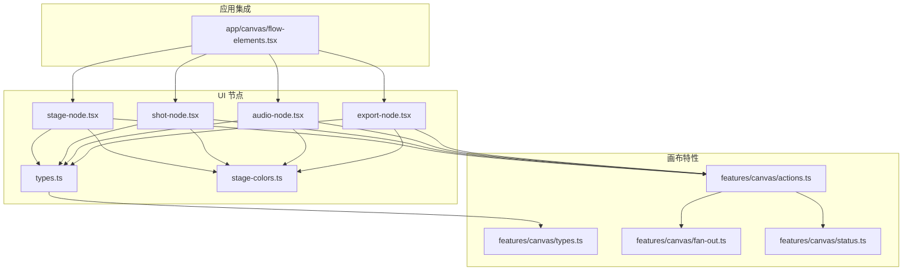

图表来源
- [src/components/ui/node/stage-node.tsx](file://src/components/ui/node/stage-node.tsx)
- [src/components/ui/node/shot-node.tsx](file://src/components/ui/node/shot-node.tsx)
- [src/components/ui/node/audio-node.tsx](file://src/components/ui/node/audio-node.tsx)
- [src/components/ui/node/export-node.tsx](file://src/components/ui/node/export-node.tsx)
- [src/components/ui/node/types.ts](file://src/components/ui/node/types.ts)
- [src/components/ui/node/stage-colors.ts](file://src/components/ui/node/stage-colors.ts)
- [src/features/canvas/types.ts](file://src/features/canvas/types.ts)
- [src/features/canvas/actions.ts](file://src/features/canvas/actions.ts)
- [src/features/canvas/fan-out.ts](file://src/features/canvas/fan-out.ts)
- [src/features/canvas/status.ts](file://src/features/canvas/status.ts)
- [src/app/canvas/flow-elements.tsx](file://src/app/canvas/flow-elements.tsx)

章节来源
- [src/components/ui/node/stage-node.tsx](file://src/components/ui/node/stage-node.tsx)
- [src/components/ui/node/shot-node.tsx](file://src/components/ui/node/shot-node.tsx)
- [src/components/ui/node/audio-node.tsx](file://src/components/ui/node/audio-node.tsx)
- [src/components/ui/node/export-node.tsx](file://src/components/ui/node/export-node.tsx)
- [src/components/ui/node/types.ts](file://src/components/ui/node/types.ts)
- [src/components/ui/node/stage-colors.ts](file://src/components/ui/node/stage-colors.ts)
- [src/features/canvas/types.ts](file://src/features/canvas/types.ts)
- [src/features/canvas/actions.ts](file://src/features/canvas/actions.ts)
- [src/features/canvas/fan-out.ts](file://src/features/canvas/fan-out.ts)
- [src/features/canvas/status.ts](file://src/features/canvas/status.ts)
- [src/app/canvas/flow-elements.tsx](file://src/app/canvas/flow-elements.tsx)

## 核心组件
本节概述四类节点的职责与交互方式：
- 舞台节点：定义场景、布局与全局参数，作为内容生产的起点
- 镜头节点：描述拍摄视角、转场与时间线片段，承接舞台输出并产生中间产物
- 音频节点：管理音轨、音效与配音，可与镜头或导出阶段组合
- 导出节点：聚合上游产物，执行编码与输出到目标格式

节点通过统一的类型系统与端口契约进行连接，数据以结构化对象在节点间传递。

章节来源
- [src/components/ui/node/stage-node.tsx](file://src/components/ui/node/stage-node.tsx)
- [src/components/ui/node/shot-node.tsx](file://src/components/ui/node/shot-node.tsx)
- [src/components/ui/node/audio-node.tsx](file://src/components/ui/node/audio-node.tsx)
- [src/components/ui/node/export-node.tsx](file://src/components/ui/node/export-node.tsx)
- [src/components/ui/node/types.ts](file://src/components/ui/node/types.ts)

## 架构总览
节点架构围绕“类型定义—动作编排—扇出调度—状态驱动”的闭环展开：
- 类型定义：统一节点输入/输出结构与端口语义
- 动作编排：对节点图执行增删改查与拓扑校验
- 扇出调度：根据连接关系计算下游影响范围
- 状态驱动：为每个节点维护运行态与错误态，提供可视化反馈

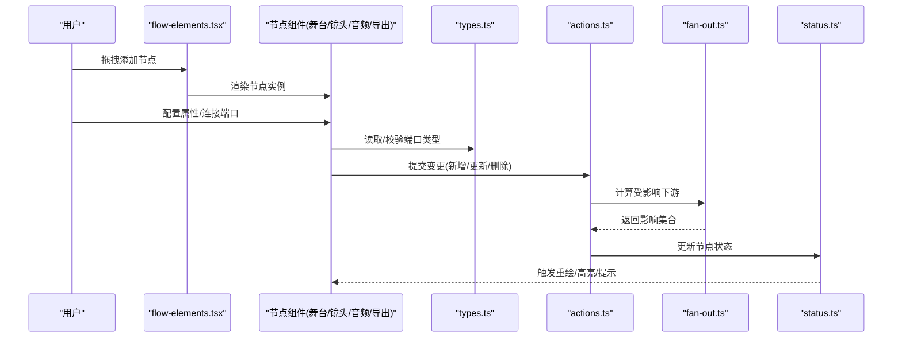

图表来源
- [src/app/canvas/flow-elements.tsx](file://src/app/canvas/flow-elements.tsx)
- [src/components/ui/node/types.ts](file://src/components/ui/node/types.ts)
- [src/features/canvas/actions.ts](file://src/features/canvas/actions.ts)
- [src/features/canvas/fan-out.ts](file://src/features/canvas/fan-out.ts)
- [src/features/canvas/status.ts](file://src/features/canvas/status.ts)

## 详细组件分析

### 节点类型系统与端口契约
- 节点类型：每种节点对应一个类型标识，用于区分行为与渲染
- 端口契约：输入/输出端口具有名称、数据类型与可选默认值
- 连接规则：仅允许同构或兼容的数据类型连接；跨类型需显式转换
- 验证策略：在连接建立时进行静态校验，运行时进行动态校验

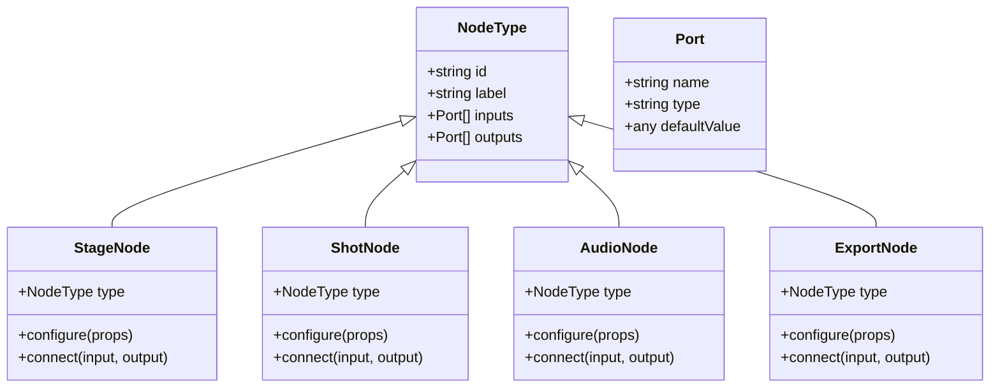

图表来源
- [src/components/ui/node/types.ts](file://src/components/ui/node/types.ts)
- [src/components/ui/node/stage-node.tsx](file://src/components/ui/node/stage-node.tsx)
- [src/components/ui/node/shot-node.tsx](file://src/components/ui/node/shot-node.tsx)
- [src/components/ui/node/audio-node.tsx](file://src/components/ui/node/audio-node.tsx)
- [src/components/ui/node/export-node.tsx](file://src/components/ui/node/export-node.tsx)

章节来源
- [src/components/ui/node/types.ts](file://src/components/ui/node/types.ts)

### 舞台节点
- 职责：定义场景元信息、背景、尺寸、帧率等全局参数
- 属性面板：场景名、分辨率、帧率、背景色、默认样式等
- 输入端口：通常无输入或接收外部配置
- 输出端口：场景上下文、资源清单、初始状态
- 连接示例：将舞台输出连接到镜头节点，形成生产管线起点

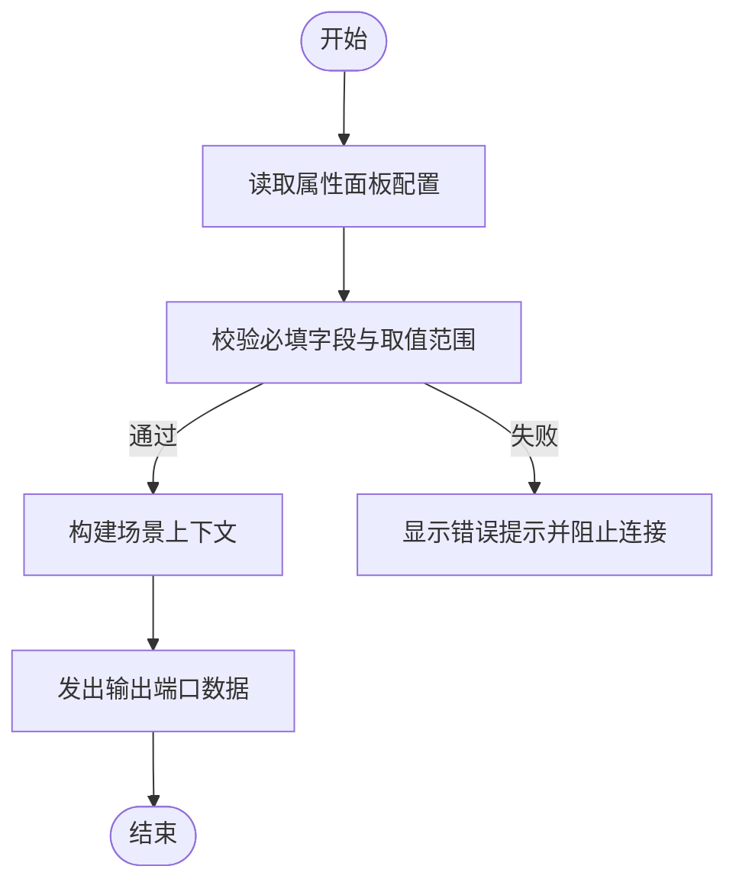

图表来源
- [src/components/ui/node/stage-node.tsx](file://src/components/ui/node/stage-node.tsx)

章节来源
- [src/components/ui/node/stage-node.tsx](file://src/components/ui/node/stage-node.tsx)

### 镜头节点
- 职责：描述镜头时长、转场、关键帧与素材引用
- 属性面板：时长、入点/出点、转场类型、叠加层、滤镜等
- 输入端口：上游场景上下文、媒体资源
- 输出端口：镜头片段、时间轴标记、中间产物
- 连接示例：从舞台节点接收上下文，输出至导出节点或后续镜头

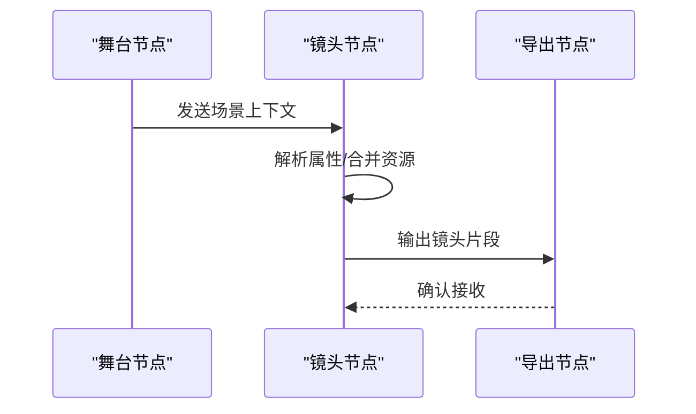

图表来源
- [src/components/ui/node/shot-node.tsx](file://src/components/ui/node/shot-node.tsx)
- [src/components/ui/node/stage-node.tsx](file://src/components/ui/node/stage-node.tsx)
- [src/components/ui/node/export-node.tsx](file://src/components/ui/node/export-node.tsx)

章节来源
- [src/components/ui/node/shot-node.tsx](file://src/components/ui/node/shot-node.tsx)

### 音频节点
- 职责：管理音轨、音效、配音与字幕轨道
- 属性面板：音量、淡入淡出、对齐策略、语言/声道
- 输入端口：媒体片段、时间戳、文本/语音源
- 输出端口：合成后的音频轨道、字幕轨道
- 连接示例：与镜头节点并行或串联，最终汇入导出节点

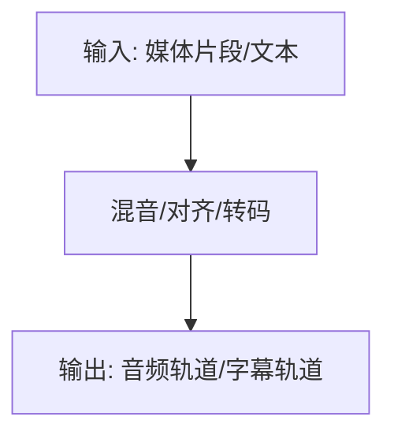

图表来源
- [src/components/ui/node/audio-node.tsx](file://src/components/ui/node/audio-node.tsx)

章节来源
- [src/components/ui/node/audio-node.tsx](file://src/components/ui/node/audio-node.tsx)

### 导出节点
- 职责：聚合上游视频与音频，执行编码与输出
- 属性面板：容器格式、码率、分辨率、水印、目标平台
- 输入端口：视频片段、音频轨道、字幕轨道
- 输出端口：导出任务 ID、进度、结果链接
- 连接示例：汇聚舞台→镜头→音频的输出，完成最终渲染

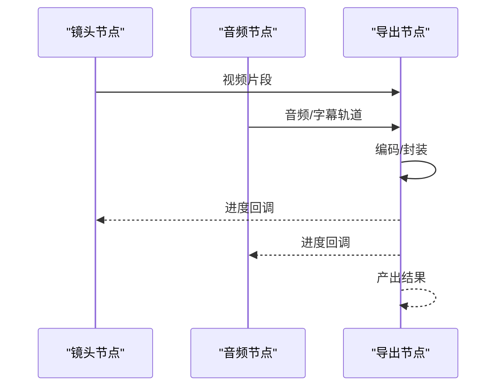

图表来源
- [src/components/ui/node/export-node.tsx](file://src/components/ui/node/export-node.tsx)
- [src/components/ui/node/shot-node.tsx](file://src/components/ui/node/shot-node.tsx)
- [src/components/ui/node/audio-node.tsx](file://src/components/ui/node/audio-node.tsx)

章节来源
- [src/components/ui/node/export-node.tsx](file://src/components/ui/node/export-node.tsx)

### 节点间的通信协议与数据传递
- 消息载体：节点间通过结构化对象传递数据，包含元数据与负载
- 端口映射：输入/输出端口按名称与类型匹配，支持多对一/一对多
- 事件通知：节点状态变化通过事件总线广播，驱动 UI 与调度器
- 错误传播：上游错误沿连接向下游传播，便于快速定位问题

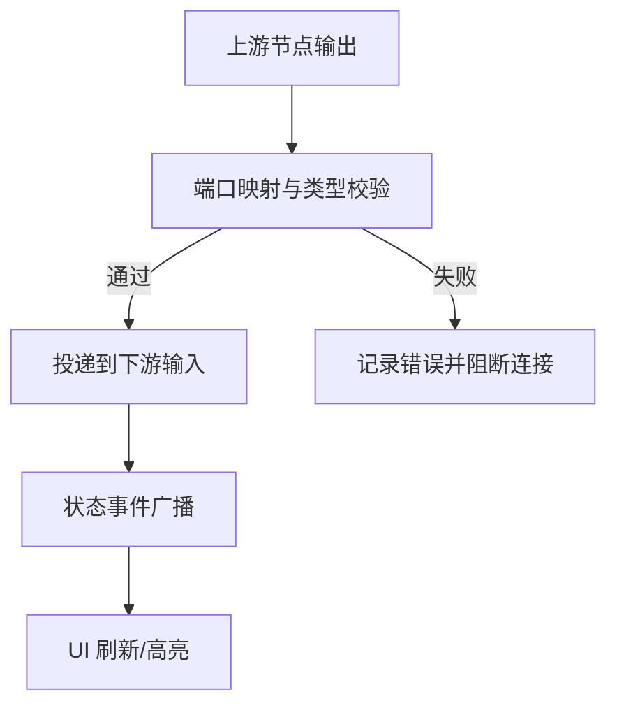

图表来源
- [src/features/canvas/types.ts](file://src/features/canvas/types.ts)
- [src/features/canvas/actions.ts](file://src/features/canvas/actions.ts)
- [src/features/canvas/status.ts](file://src/features/canvas/status.ts)

章节来源
- [src/features/canvas/types.ts](file://src/features/canvas/types.ts)
- [src/features/canvas/actions.ts](file://src/features/canvas/actions.ts)
- [src/features/canvas/status.ts](file://src/features/canvas/status.ts)

### 节点颜色编码与视觉反馈
- 颜色编码：不同节点类型使用不同主色，便于快速识别
- 状态反馈：运行中、成功、失败、等待等状态通过边框/阴影/动画呈现
- 连接反馈：有效连接高亮，无效连接抖动或变红
- 主题适配：颜色基于主题变量，确保明暗模式一致体验

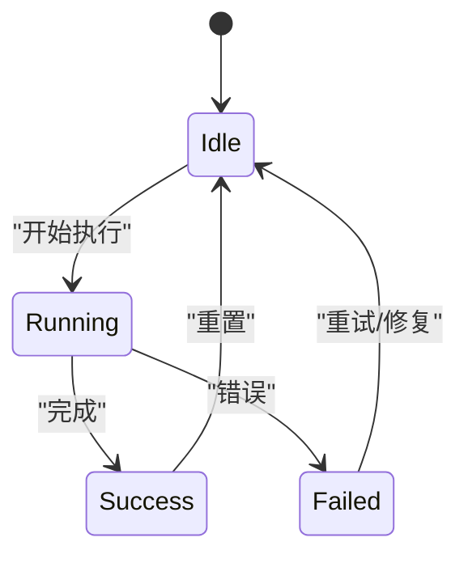

图表来源
- [src/components/ui/node/stage-colors.ts](file://src/components/ui/node/stage-colors.ts)
- [src/features/canvas/status.ts](file://src/features/canvas/status.ts)

章节来源
- [src/components/ui/node/stage-colors.ts](file://src/components/ui/node/stage-colors.ts)
- [src/features/canvas/status.ts](file://src/features/canvas/status.ts)

### 节点创建、配置与连接示例
- 创建：从侧边栏拖拽节点到画布，生成默认配置
- 配置：打开属性面板填写必填项，选择资源或调整参数
- 连接：从输出端口拖拽到输入端口，系统自动校验类型与可达性
- 验证：连接成功后进入可执行状态，失败则给出明确错误提示

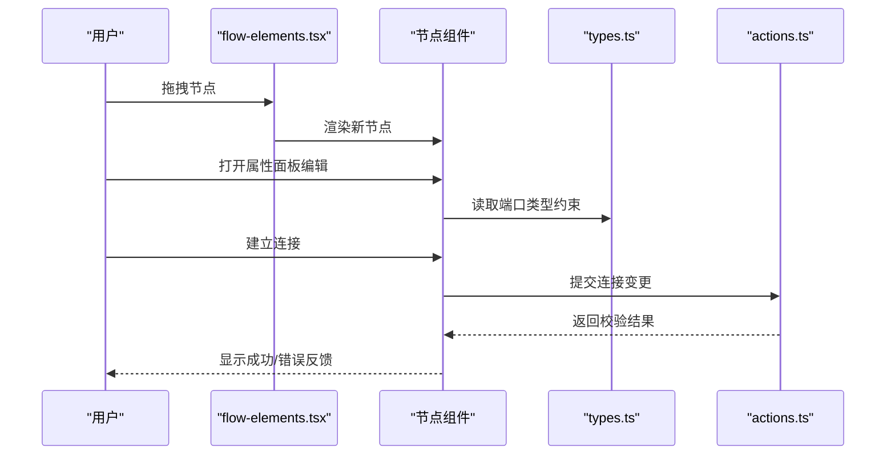

图表来源
- [src/app/canvas/flow-elements.tsx](file://src/app/canvas/flow-elements.tsx)
- [src/components/ui/node/types.ts](file://src/components/ui/node/types.ts)
- [src/features/canvas/actions.ts](file://src/features/canvas/actions.ts)

章节来源
- [src/app/canvas/flow-elements.tsx](file://src/app/canvas/flow-elements.tsx)
- [src/components/ui/node/types.ts](file://src/components/ui/node/types.ts)
- [src/features/canvas/actions.ts](file://src/features/canvas/actions.ts)

### 动态注册机制与扩展点
- 注册入口：在应用启动时集中注册节点类型与渲染器
- 配置项：节点元数据（名称、图标、端口定义）、默认属性、校验函数
- 生命周期：初始化、挂载、卸载、热重载
- 扩展建议：遵循最小接口原则，避免在注册逻辑中承载业务细节

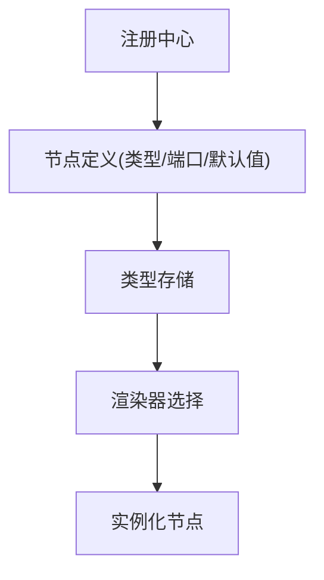

图表来源
- [src/components/ui/node/types.ts](file://src/components/ui/node/types.ts)
- [src/app/canvas/flow-elements.tsx](file://src/app/canvas/flow-elements.tsx)

章节来源
- [src/components/ui/node/types.ts](file://src/components/ui/node/types.ts)
- [src/app/canvas/flow-elements.tsx](file://src/app/canvas/flow-elements.tsx)

### 自定义节点开发指南与最佳实践
- 步骤
  - 定义节点类型与端口契约
  - 实现属性面板与校验逻辑
  - 接入动作系统与扇出计算
  - 编写单元测试覆盖边界条件
- 最佳实践
  - 保持幂等：相同输入应得到相同输出
  - 明确错误：错误信息要可操作且可定位
  - 控制副作用：尽量纯函数化处理，副作用集中在调度层
  - 性能优先：大对象采用引用传递，避免重复序列化

章节来源
- [src/components/ui/node/types.ts](file://src/components/ui/node/types.ts)
- [src/features/canvas/actions.ts](file://src/features/canvas/actions.ts)
- [src/features/canvas/fan-out.ts](file://src/features/canvas/fan-out.ts)

## 依赖关系分析
节点组件依赖类型定义与动作系统，并通过扇出与状态模块协同工作。

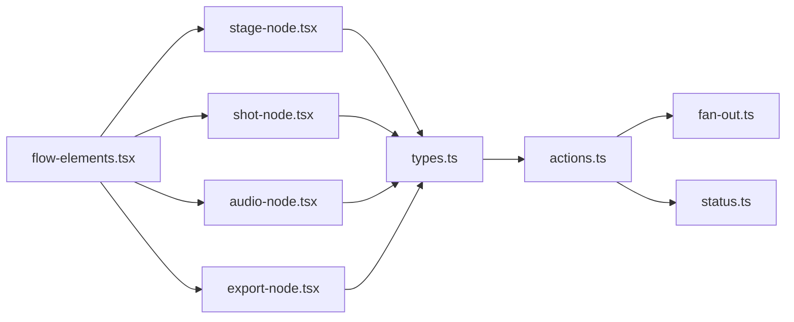

图表来源
- [src/components/ui/node/types.ts](file://src/components/ui/node/types.ts)
- [src/features/canvas/actions.ts](file://src/features/canvas/actions.ts)
- [src/features/canvas/fan-out.ts](file://src/features/canvas/fan-out.ts)
- [src/features/canvas/status.ts](file://src/features/canvas/status.ts)
- [src/components/ui/node/stage-node.tsx](file://src/components/ui/node/stage-node.tsx)
- [src/components/ui/node/shot-node.tsx](file://src/components/ui/node/shot-node.tsx)
- [src/components/ui/node/audio-node.tsx](file://src/components/ui/node/audio-node.tsx)
- [src/components/ui/node/export-node.tsx](file://src/components/ui/node/export-node.tsx)
- [src/app/canvas/flow-elements.tsx](file://src/app/canvas/flow-elements.tsx)

章节来源
- [src/components/ui/node/types.ts](file://src/components/ui/node/types.ts)
- [src/features/canvas/actions.ts](file://src/features/canvas/actions.ts)
- [src/features/canvas/fan-out.ts](file://src/features/canvas/fan-out.ts)
- [src/features/canvas/status.ts](file://src/features/canvas/status.ts)
- [src/components/ui/node/stage-node.tsx](file://src/components/ui/node/stage-node.tsx)
- [src/components/ui/node/shot-node.tsx](file://src/components/ui/node/shot-node.tsx)
- [src/components/ui/node/audio-node.tsx](file://src/components/ui/node/audio-node.tsx)
- [src/components/ui/node/export-node.tsx](file://src/components/ui/node/export-node.tsx)
- [src/app/canvas/flow-elements.tsx](file://src/app/canvas/flow-elements.tsx)

## 性能考虑
- 减少不必要的重渲染：仅在属性或连接变更时触发局部更新
- 延迟计算：对复杂计算引入缓存与惰性求值
- 批量更新：合并多次连接变更，降低动作系统压力
- 内存管理：及时释放大对象引用，避免泄漏

[本节为通用指导，不直接分析具体文件]

## 故障排查指南
- 连接失败：检查端口类型是否匹配，查看动作系统的校验日志
- 数据为空：确认上游节点已正确输出，必要时增加空值保护
- 状态异常：观察状态机的当前状态与转移路径，定位卡住环节
- 性能问题：监控扇出范围与重渲染次数，优化计算路径

章节来源
- [src/features/canvas/actions.ts](file://src/features/canvas/actions.ts)
- [src/features/canvas/status.ts](file://src/features/canvas/status.ts)
- [src/features/canvas/fan-out.ts](file://src/features/canvas/fan-out.ts)

## 结论
CodeVideoCanvas 的节点体系通过清晰的类型契约、稳健的动作编排与直观的视觉反馈，实现了可扩展、可维护的可视化编程体验。遵循本文的开发指南与最佳实践，可高效构建高质量自定义节点并保障整体稳定性与性能。

## 附录
- 术语表
  - 节点：具备输入/输出端口的可复用处理单元
  - 端口：节点间数据交换的接口点
  - 扇出：单个节点变更影响的下游节点集合
  - 状态机：节点运行状态的有限状态模型

[本节为概念性补充，不直接分析具体文件]