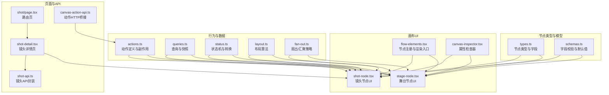
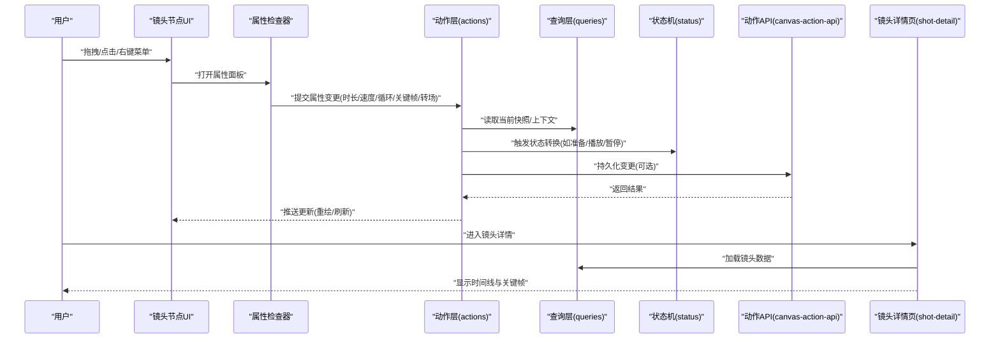
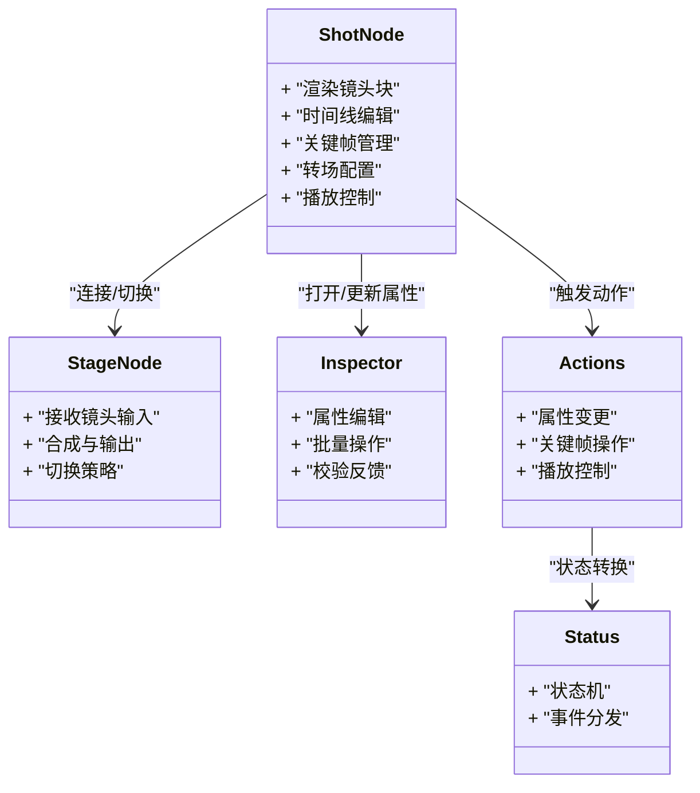
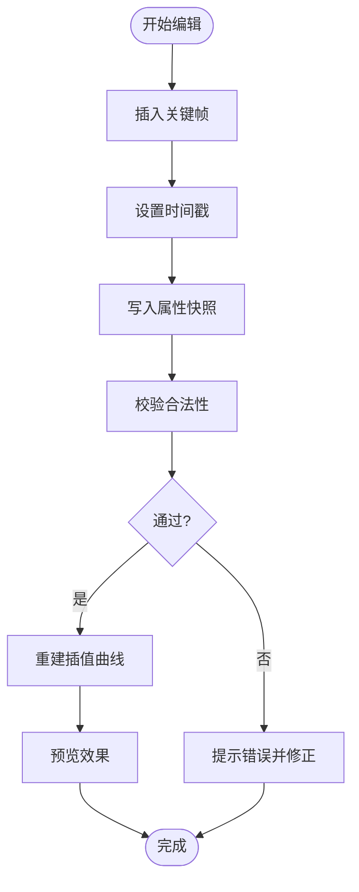
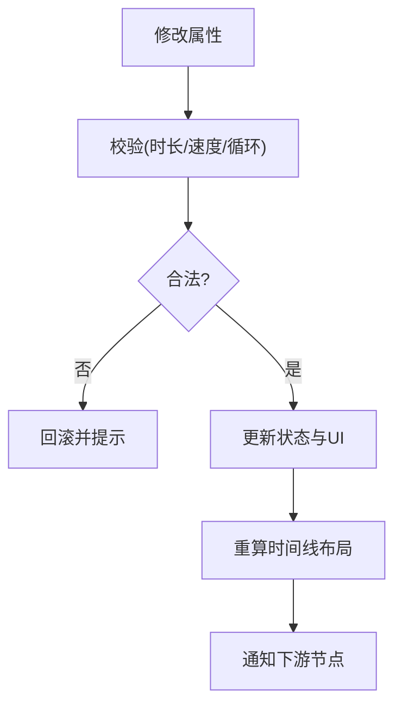
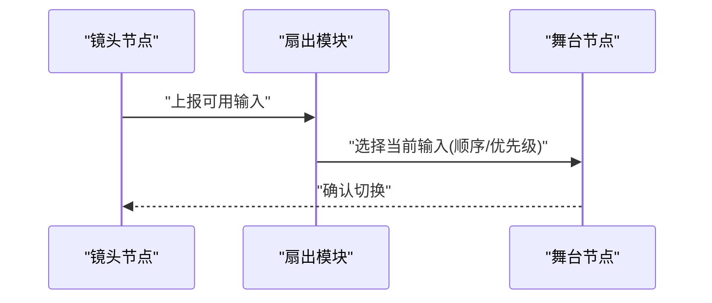
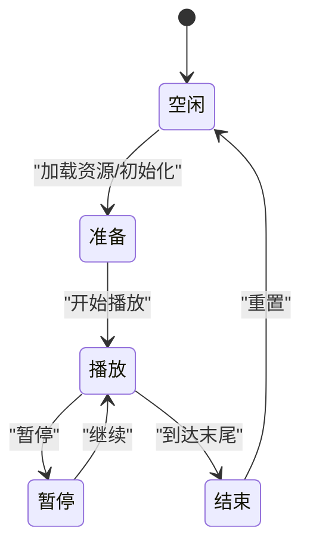
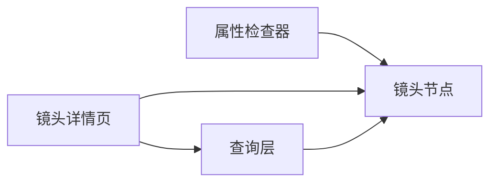
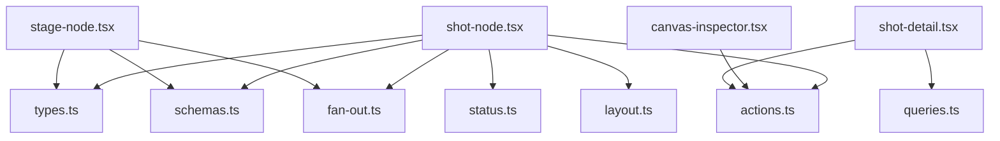

# 镜头节点

<cite>
**本文引用的文件**   
- [src/components/ui/node/shot-node.tsx](file://src/components/ui/node/shot-node.tsx)
- [src/components/ui/node/stage-node.tsx](file://src/components/ui/node/stage-node.tsx)
- [src/components/ui/node/types.ts](file://src/components/ui/node/types.ts)
- [src/app/canvas/flow-elements.tsx](file://src/app/canvas/flow-elements.tsx)
- [src/features/canvas/actions.ts](file://src/features/canvas/actions.ts)
- [src/features/canvas/queries.ts](file://src/features/canvas/queries.ts)
- [src/features/canvas/schemas.ts](file://src/features/canvas/schemas.ts)
- [src/features/canvas/status.ts](file://src/features/canvas/status.ts)
- [src/features/canvas/layout.ts](file://src/features/canvas/layout.ts)
- [src/features/canvas/fan-out.ts](file://src/features/canvas/fan-out.ts)
- [src/app/canvas/canvas-action-api.ts](file://src/app/canvas/canvas-action-api.ts)
- [src/app/canvas/canvas-inspector.tsx](file://src/app/canvas/canvas-inspector.tsx)
- [src/app/canvas/shot/[id]/shot-detail.tsx](file://src/app/canvas/shot/[id]/shot-detail.tsx)
- [src/app/canvas/shot/[id]/shot-api.ts](file://src/app/canvas/shot/[id]/shot-api.ts)
- [src/app/canvas/shot/[id]/page.tsx](file://src/app/canvas/shot/[id]/page.tsx)
</cite>

## 目录
1. [简介](#简介)
2. [项目结构](#项目结构)
3. [核心组件](#核心组件)
4. [架构总览](#架构总览)
5. [详细组件分析](#详细组件分析)
6. [依赖关系分析](#依赖关系分析)
7. [性能考量](#性能考量)
8. [故障排查指南](#故障排查指南)
9. [结论](#结论)
10. [附录](#附录)

## 简介
本文件面向“镜头节点”（Shot Node）的完整文档，聚焦以下目标：
- 时间线编辑能力：关键帧设置、动画控制与转场效果
- 属性配置：持续时间、播放速度、循环选项等
- 与舞台节点的连接与切换逻辑
- 状态管理与播放控制接口
- 预览与调试工具使用指南
- 复杂镜头序列编排技巧与最佳实践

## 项目结构
镜头节点位于前端可视化画布体系中，围绕“节点类型定义—UI渲染—动作与查询—数据校验—布局与调度”分层组织。下图给出与镜头节点相关的关键文件与职责概览。

图表来源
- [src/components/ui/node/types.ts](file://src/components/ui/node/types.ts)
- [src/components/ui/node/shot-node.tsx](file://src/components/ui/node/shot-node.tsx)
- [src/components/ui/node/stage-node.tsx](file://src/components/ui/node/stage-node.tsx)
- [src/app/canvas/flow-elements.tsx](file://src/app/canvas/flow-elements.tsx)
- [src/features/canvas/actions.ts](file://src/features/canvas/actions.ts)
- [src/features/canvas/queries.ts](file://src/features/canvas/queries.ts)
- [src/features/canvas/schemas.ts](file://src/features/canvas/schemas.ts)
- [src/features/canvas/status.ts](file://src/features/canvas/status.ts)
- [src/features/canvas/layout.ts](file://src/features/canvas/layout.ts)
- [src/features/canvas/fan-out.ts](file://src/features/canvas/fan-out.ts)
- [src/app/canvas/shot/[id]/shot-detail.tsx](file://src/app/canvas/shot/[id]/shot-detail.tsx)
- [src/app/canvas/shot/[id]/shot-api.ts](file://src/app/canvas/shot/[id]/shot-api.ts)
- [src/app/canvas/shot/[id]/page.tsx](file://src/app/canvas/shot/[id]/page.tsx)
- [src/app/canvas/canvas-action-api.ts](file://src/app/canvas/canvas-action-api.ts)

章节来源
- [src/components/ui/node/types.ts](file://src/components/ui/node/types.ts)
- [src/components/ui/node/shot-node.tsx](file://src/components/ui/node/shot-node.tsx)
- [src/components/ui/node/stage-node.tsx](file://src/components/ui/node/stage-node.tsx)
- [src/app/canvas/flow-elements.tsx](file://src/app/canvas/flow-elements.tsx)
- [src/features/canvas/actions.ts](file://src/features/canvas/actions.ts)
- [src/features/canvas/queries.ts](file://src/features/canvas/queries.ts)
- [src/features/canvas/schemas.ts](file://src/features/canvas/schemas.ts)
- [src/features/canvas/status.ts](file://src/features/canvas/status.ts)
- [src/features/canvas/layout.ts](file://src/features/canvas/layout.ts)
- [src/features/canvas/fan-out.ts](file://src/features/canvas/fan-out.ts)
- [src/app/canvas/shot/[id]/shot-detail.tsx](file://src/app/canvas/shot/[id]/shot-detail.tsx)
- [src/app/canvas/shot/[id]/shot-api.ts](file://src/app/canvas/shot/[id]/shot-api.ts)
- [src/app/canvas/shot/[id]/page.tsx](file://src/app/canvas/shot/[id]/page.tsx)
- [src/app/canvas/canvas-action-api.ts](file://src/app/canvas/canvas-action-api.ts)

## 核心组件
- 镜头节点（Shot Node）
  - 负责在画布上呈现单个镜头的可视化块，承载时间线编辑、关键帧标记、转场配置、播放控制等交互。
  - 与舞台节点存在明确的连接语义：镜头作为输入源，舞台作为合成输出。
- 舞台节点（Stage Node）
  - 负责接收一个或多个镜头输入，进行合成与输出；支持多路输入时的接入顺序与切换策略。
- 属性检查器（Inspector）
  - 提供对镜头属性的集中编辑界面，包括持续时间、播放速度、循环、关键帧列表、转场参数等。
- 动作与查询层
  - 动作层定义增删改查、播放控制、关键帧操作、转场变更等；查询层提供快照与增量更新。
- 状态机
  - 管理镜头的播放状态（如空闲、准备、播放、暂停、结束），并驱动UI同步。
- 布局与扇出
  - 布局模块计算节点位置与连线；扇出模块处理多输入/多输出的连接策略。

章节来源
- [src/components/ui/node/shot-node.tsx](file://src/components/ui/node/shot-node.tsx)
- [src/components/ui/node/stage-node.tsx](file://src/components/ui/node/stage-node.tsx)
- [src/app/canvas/canvas-inspector.tsx](file://src/app/canvas/canvas-inspector.tsx)
- [src/features/canvas/actions.ts](file://src/features/canvas/actions.ts)
- [src/features/canvas/queries.ts](file://src/features/canvas/queries.ts)
- [src/features/canvas/status.ts](file://src/features/canvas/status.ts)
- [src/features/canvas/layout.ts](file://src/features/canvas/layout.ts)
- [src/features/canvas/fan-out.ts](file://src/features/canvas/fan-out.ts)

## 架构总览
下图展示从用户交互到数据持久化的端到端流程，涵盖镜头节点的时间线编辑、播放控制与与舞台的连接切换。

图表来源
- [src/components/ui/node/shot-node.tsx](file://src/components/ui/node/shot-node.tsx)
- [src/app/canvas/canvas-inspector.tsx](file://src/app/canvas/canvas-inspector.tsx)
- [src/features/canvas/actions.ts](file://src/features/canvas/actions.ts)
- [src/features/canvas/queries.ts](file://src/features/canvas/queries.ts)
- [src/features/canvas/status.ts](file://src/features/canvas/status.ts)
- [src/app/canvas/canvas-action-api.ts](file://src/app/canvas/canvas-action-api.ts)
- [src/app/canvas/shot/[id]/shot-detail.tsx](file://src/app/canvas/shot/[id]/shot-detail.tsx)

## 详细组件分析

### 镜头节点（Shot Node）
- 职责
  - 渲染镜头块，显示时长、速度、循环标志、关键帧标记与转场指示。
  - 提供时间线编辑交互：添加/移动/删除关键帧，调整片段起止，设置转场类型与参数。
  - 响应播放控制：播放、暂停、跳转至指定时间点、步进/倒放。
- 关键属性（示例）
  - 持续时间：控制镜头片段的长度，影响时间轴占用与播放时长。
  - 播放速度：大于1加速、小于1减速，影响关键帧插值速率。
  - 循环选项：是否循环播放或仅一次。
  - 关键帧列表：包含时间戳与对应属性快照。
  - 转场配置：入/出场转场类型与时长。
- 与舞台节点的关系
  - 镜头作为输入连接到舞台节点；舞台根据接入顺序与策略选择当前可见镜头。
- 典型交互流程
  - 用户在时间线上拖动关键帧 → 更新关键帧时间戳 → 触发重绘与状态同步。
  - 修改转场参数 → 写入属性 → 预览时应用过渡效果。

图表来源
- [src/components/ui/node/shot-node.tsx](file://src/components/ui/node/shot-node.tsx)
- [src/components/ui/node/stage-node.tsx](file://src/components/ui/node/stage-node.tsx)
- [src/app/canvas/canvas-inspector.tsx](file://src/app/canvas/canvas-inspector.tsx)
- [src/features/canvas/actions.ts](file://src/features/canvas/actions.ts)
- [src/features/canvas/status.ts](file://src/features/canvas/status.ts)

章节来源
- [src/components/ui/node/shot-node.tsx](file://src/components/ui/node/shot-node.tsx)
- [src/components/ui/node/stage-node.tsx](file://src/components/ui/node/stage-node.tsx)
- [src/app/canvas/canvas-inspector.tsx](file://src/app/canvas/canvas-inspector.tsx)
- [src/features/canvas/actions.ts](file://src/features/canvas/actions.ts)
- [src/features/canvas/status.ts](file://src/features/canvas/status.ts)

### 时间线编辑与关键帧
- 关键帧数据结构
  - 通常包含时间戳与属性快照；时间戳以相对或绝对时间表示，用于插值与回放。
- 插入与移动
  - 在时间线上点击插入关键帧；拖拽移动关键帧会更新其时间戳并触发重算。
- 删除与合并
  - 删除关键帧后，相邻关键帧之间的插值将重新计算；必要时合并相邻同属性关键帧以减少冗余。
- 转场效果
  - 入/出场转场可配置类型与时长；转场期间按插值规则混合前后镜头属性。

图表来源
- [src/components/ui/node/shot-node.tsx](file://src/components/ui/node/shot-node.tsx)
- [src/features/canvas/schemas.ts](file://src/features/canvas/schemas.ts)

章节来源
- [src/components/ui/node/shot-node.tsx](file://src/components/ui/node/shot-node.tsx)
- [src/features/canvas/schemas.ts](file://src/features/canvas/schemas.ts)

### 属性配置：持续时间、播放速度与循环
- 持续时间
  - 决定镜头在时间轴上的占用长度；修改后需重新计算后续节点偏移。
- 播放速度
  - 改变关键帧插值的速率；速度为负可实现倒放。
- 循环选项
  - 开启循环后，播放到达末尾时回到起始点；关闭则停止于末尾。
- 校验与约束
  - 非负时长、合理速度范围、循环与单播互斥逻辑等由校验层保证。

图表来源
- [src/features/canvas/schemas.ts](file://src/features/canvas/schemas.ts)
- [src/features/canvas/layout.ts](file://src/features/canvas/layout.ts)

章节来源
- [src/features/canvas/schemas.ts](file://src/features/canvas/schemas.ts)
- [src/features/canvas/layout.ts](file://src/features/canvas/layout.ts)

### 与舞台节点的连接与切换逻辑
- 连接方式
  - 镜头节点输出端口连接到舞台节点输入端口；支持多镜头接入。
- 切换策略
  - 按接入顺序或优先级选择当前镜头；也可基于时间线自动切换。
- 扇出与汇聚
  - 当多个镜头汇聚到同一舞台时，扇出模块负责确定有效输入与冲突解决。

图表来源
- [src/features/canvas/fan-out.ts](file://src/features/canvas/fan-out.ts)
- [src/components/ui/node/stage-node.tsx](file://src/components/ui/node/stage-node.tsx)

章节来源
- [src/features/canvas/fan-out.ts](file://src/features/canvas/fan-out.ts)
- [src/components/ui/node/stage-node.tsx](file://src/components/ui/node/stage-node.tsx)

### 状态管理与播放控制接口
- 状态机
  - 常见状态：空闲、准备、播放、暂停、结束；状态转换受动作与外部事件驱动。
- 播放控制
  - 播放、暂停、跳转到指定时间、步进/倒放、循环开关。
- 事件与回调
  - 状态变化事件用于UI同步与日志记录；播放进度事件用于时间线指针更新。

图表来源
- [src/features/canvas/status.ts](file://src/features/canvas/status.ts)
- [src/features/canvas/actions.ts](file://src/features/canvas/actions.ts)

章节来源
- [src/features/canvas/status.ts](file://src/features/canvas/status.ts)
- [src/features/canvas/actions.ts](file://src/features/canvas/actions.ts)

### 预览与调试工具
- 属性检查器
  - 集中编辑镜头属性，实时预览变更；提供批量操作与撤销/重做。
- 镜头详情页
  - 提供时间线视图、关键帧列表、转场参数面板；支持快速定位与对比。
- 调试建议
  - 利用查询层获取快照，验证关键帧插值是否正确；观察状态机事件流，定位异常状态转换。

图表来源
- [src/app/canvas/canvas-inspector.tsx](file://src/app/canvas/canvas-inspector.tsx)
- [src/app/canvas/shot/[id]/shot-detail.tsx](file://src/app/canvas/shot/[id]/shot-detail.tsx)
- [src/features/canvas/queries.ts](file://src/features/canvas/queries.ts)

章节来源
- [src/app/canvas/canvas-inspector.tsx](file://src/app/canvas/canvas-inspector.tsx)
- [src/app/canvas/shot/[id]/shot-detail.tsx](file://src/app/canvas/shot/[id]/shot-detail.tsx)
- [src/features/canvas/queries.ts](file://src/features/canvas/queries.ts)

### 复杂镜头序列编排技巧与最佳实践
- 分段与复用
  - 将长镜头拆分为短片段，便于关键帧管理与转场组合。
- 节奏控制
  - 使用不同速度实现快慢镜头；配合循环选项制造重复强调。
- 转场设计
  - 入/出场转场统一风格；避免过度叠加导致视觉混乱。
- 连接策略
  - 明确接入顺序与优先级；在汇聚处使用扇出策略减少歧义。
- 性能优化
  - 减少不必要的关键帧数量；预计算常用插值曲线；按需加载资源。

[本节为概念性指导，不直接分析具体文件]

## 依赖关系分析
- 组件耦合
  - 镜头节点依赖类型与校验模型；与动作层和状态机紧密耦合；与舞台节点通过连接语义协作。
- 外部依赖
  - 查询层提供数据访问；动作API桥接后端持久化；布局与扇出模块提供辅助算法。
- 潜在循环依赖
  - 确保UI不直接依赖持久化层，而是通过动作与查询抽象，避免循环引用。

图表来源
- [src/components/ui/node/shot-node.tsx](file://src/components/ui/node/shot-node.tsx)
- [src/components/ui/node/stage-node.tsx](file://src/components/ui/node/stage-node.tsx)
- [src/components/ui/node/types.ts](file://src/components/ui/node/types.ts)
- [src/features/canvas/schemas.ts](file://src/features/canvas/schemas.ts)
- [src/features/canvas/actions.ts](file://src/features/canvas/actions.ts)
- [src/features/canvas/status.ts](file://src/features/canvas/status.ts)
- [src/features/canvas/layout.ts](file://src/features/canvas/layout.ts)
- [src/features/canvas/fan-out.ts](file://src/features/canvas/fan-out.ts)
- [src/app/canvas/canvas-inspector.tsx](file://src/app/canvas/canvas-inspector.tsx)
- [src/app/canvas/shot/[id]/shot-detail.tsx](file://src/app/canvas/shot/[id]/shot-detail.tsx)
- [src/features/canvas/queries.ts](file://src/features/canvas/queries.ts)

章节来源
- [src/components/ui/node/shot-node.tsx](file://src/components/ui/node/shot-node.tsx)
- [src/components/ui/node/stage-node.tsx](file://src/components/ui/node/stage-node.tsx)
- [src/components/ui/node/types.ts](file://src/components/ui/node/types.ts)
- [src/features/canvas/schemas.ts](file://src/features/canvas/schemas.ts)
- [src/features/canvas/actions.ts](file://src/features/canvas/actions.ts)
- [src/features/canvas/status.ts](file://src/features/canvas/status.ts)
- [src/features/canvas/layout.ts](file://src/features/canvas/layout.ts)
- [src/features/canvas/fan-out.ts](file://src/features/canvas/fan-out.ts)
- [src/app/canvas/canvas-inspector.tsx](file://src/app/canvas/canvas-inspector.tsx)
- [src/app/canvas/shot/[id]/shot-detail.tsx](file://src/app/canvas/shot/[id]/shot-detail.tsx)
- [src/features/canvas/queries.ts](file://src/features/canvas/queries.ts)

## 性能考量
- 关键帧数量控制：过多关键帧会增加插值计算与渲染开销，建议合并冗余关键帧。
- 插值缓存：对常用属性曲线进行缓存，避免重复计算。
- 按需加载：仅在需要时加载高分辨率资源或复杂转场效果。
- 批量更新：属性变更尽量批量化，减少UI重绘次数。
- 状态事件节流：高频状态事件应节流或合并，降低监听器压力。

[本节提供通用指导，不直接分析具体文件]

## 故障排查指南
- 常见问题
  - 关键帧时间戳非法：检查校验逻辑与边界条件。
  - 转场不生效：确认转场类型与时长配置，以及是否在正确时间段内应用。
  - 播放状态异常：查看状态机事件流，定位非法转换。
  - 连接切换错乱：检查扇出策略与接入顺序。
- 调试步骤
  - 使用属性检查器逐项验证属性。
  - 在镜头详情页查看时间线与关键帧列表。
  - 通过查询层获取快照，比对预期与实际差异。
  - 观察动作API调用与返回，确认持久化一致性。

章节来源
- [src/app/canvas/canvas-inspector.tsx](file://src/app/canvas/canvas-inspector.tsx)
- [src/app/canvas/shot/[id]/shot-detail.tsx](file://src/app/canvas/shot/[id]/shot-detail.tsx)
- [src/features/canvas/queries.ts](file://src/features/canvas/queries.ts)
- [src/app/canvas/canvas-action-api.ts](file://src/app/canvas/canvas-action-api.ts)

## 结论
镜头节点作为可视化画布的核心单元，提供了完善的时间线编辑、关键帧管理、转场配置与播放控制能力。通过与舞台节点的连接与切换逻辑、清晰的状态机与动作/查询分层，系统实现了高内聚低耦合的可维护架构。遵循最佳实践与性能优化建议，可在复杂镜头序列编排中获得稳定高效的体验。

[本节为总结性内容，不直接分析具体文件]

## 附录
- 术语表
  - 关键帧：时间线上的属性快照点，用于插值与回放。
  - 转场：镜头入/出场的过渡效果，可配置类型与时长。
  - 扇出：多输入汇聚时的选择策略。
  - 状态机：管理镜头播放状态的有限状态自动机。
- 参考路径
  - 镜头节点UI：[src/components/ui/node/shot-node.tsx](file://src/components/ui/node/shot-node.tsx)
  - 舞台节点UI：[src/components/ui/node/stage-node.tsx](file://src/components/ui/node/stage-node.tsx)
  - 类型与校验：[src/components/ui/node/types.ts](file://src/components/ui/node/types.ts)、[src/features/canvas/schemas.ts](file://src/features/canvas/schemas.ts)
  - 动作与查询：[src/features/canvas/actions.ts](file://src/features/canvas/actions.ts)、[src/features/canvas/queries.ts](file://src/features/canvas/queries.ts)
  - 状态与布局：[src/features/canvas/status.ts](file://src/features/canvas/status.ts)、[src/features/canvas/layout.ts](file://src/features/canvas/layout.ts)
  - 扇出策略：[src/features/canvas/fan-out.ts](file://src/features/canvas/fan-out.ts)
  - 预览与调试：[src/app/canvas/canvas-inspector.tsx](file://src/app/canvas/canvas-inspector.tsx)、[src/app/canvas/shot/[id]/shot-detail.tsx](file://src/app/canvas/shot/[id]/shot-detail.tsx)
  - 路由与API：[src/app/canvas/shot/[id]/page.tsx](file://src/app/canvas/shot/[id]/page.tsx)、[src/app/canvas/shot/[id]/shot-api.ts](file://src/app/canvas/shot/[id]/shot-api.ts)、[src/app/canvas/canvas-action-api.ts](file://src/app/canvas/canvas-action-api.ts)