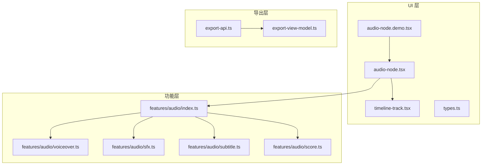
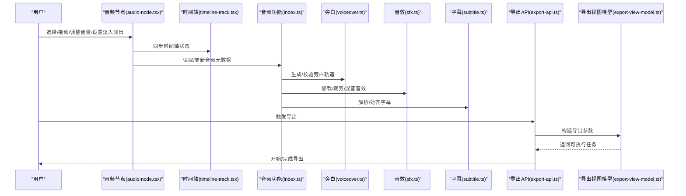
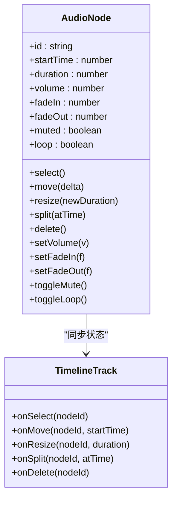
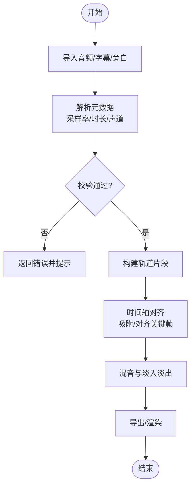
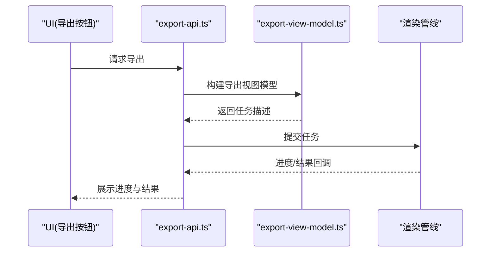
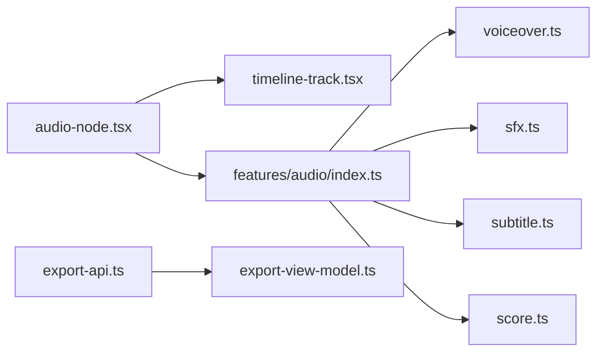

# 音频节点

<cite>
**本文引用的文件**   
- [audio-node.tsx](file://src/components/ui/node/audio-node.tsx)
- [audio-node.demo.tsx](file://src/components/ui/node/audio-node.demo.tsx)
- [types.ts](file://src/components/ui/node/types.ts)
- [index.ts](file://src/features/audio/index.ts)
- [score.ts](file://src/features/audio/score.ts)
- [sfx.ts](file://src/features/audio/sfx.ts)
- [subtitle.ts](file://src/features/audio/subtitle.ts)
- [voiceover.ts](file://src/features/audio/voiceover.ts)
- [timeline-track.tsx](file://src/components/ui/timeline-track.tsx)
- [export-api.ts](file://src/app/canvas/export/export-api.ts)
- [export-view-model.ts](file://src/app/canvas/export/export-view-model.ts)
</cite>

## 目录
1. [简介](#简介)
2. [项目结构](#项目结构)
3. [核心组件](#核心组件)
4. [架构总览](#架构总览)
5. [详细组件分析](#详细组件分析)
6. [依赖关系分析](#依赖关系分析)
7. [性能考量](#性能考量)
8. [故障排查指南](#故障排查指南)
9. [结论](#结论)
10. [附录](#附录)

## 简介
本文件为“音频节点”组件的权威文档，覆盖以下能力：
- 语音合成（旁白）与字幕、音效管理
- 背景音乐控制与轨道编辑
- 音量调节与淡入淡出效果
- 与其他节点的集成方式（时间轴、导出管线等）
- 音频同步机制与时间轴对齐
- 支持的音频格式与编解码选项
- 素材管理与批处理流程

该组件位于 UI 层（节点渲染与交互），并与 features/audio 业务模块协同，提供从编辑到导出的完整链路。

## 项目结构
音频相关代码主要分布在两个层次：
- UI 层：音频节点组件与演示入口
- 功能层：音频领域模型与工具（旁白、音效、字幕、评分）

图表来源 
- [audio-node.tsx](file://src/components/ui/node/audio-node.tsx)
- [audio-node.demo.tsx](file://src/components/ui/node/audio-node.demo.tsx)
- [timeline-track.tsx](file://src/components/ui/timeline-track.tsx)
- [types.ts](file://src/components/ui/node/types.ts)
- [index.ts](file://src/features/audio/index.ts)
- [voiceover.ts](file://src/features/audio/voiceover.ts)
- [sfx.ts](file://src/features/audio/sfx.ts)
- [subtitle.ts](file://src/features/audio/subtitle.ts)
- [score.ts](file://src/features/audio/score.ts)
- [export-api.ts](file://src/app/canvas/export/export-api.ts)
- [export-view-model.ts](file://src/app/canvas/export/export-view-model.ts)

章节来源
- [audio-node.tsx](file://src/components/ui/node/audio-node.tsx)
- [audio-node.demo.tsx](file://src/components/ui/node/audio-node.demo.tsx)
- [timeline-track.tsx](file://src/components/ui/timeline-track.tsx)
- [types.ts](file://src/components/ui/node/types.ts)
- [index.ts](file://src/features/audio/index.ts)
- [voiceover.ts](file://src/features/audio/voiceover.ts)
- [sfx.ts](file://src/features/audio/sfx.ts)
- [subtitle.ts](file://src/features/audio/subtitle.ts)
- [score.ts](file://src/features/audio/score.ts)
- [export-api.ts](file://src/app/canvas/export/export-api.ts)
- [export-view-model.ts](file://src/app/canvas/export/export-view-model.ts)

## 核心组件
- 音频节点（Audio Node）
  - 负责在画布中展示音频轨道片段，支持选择、移动、缩放、分割、删除等编辑操作
  - 暴露音量、淡入淡出、静音、播放预览等常用属性
  - 与时间轴组件联动，实现拖拽对齐与帧级定位
- 演示入口（Demo）
  - 用于本地快速验证音频节点行为与交互
- 类型定义（Types）
  - 统一音频节点的数据结构与约束，确保跨模块一致性

章节来源
- [audio-node.tsx](file://src/components/ui/node/audio-node.tsx)
- [audio-node.demo.tsx](file://src/components/ui/node/audio-node.demo.tsx)
- [types.ts](file://src/components/ui/node/types.ts)

## 架构总览
音频节点处于“编辑—渲染—导出”的关键路径上：
- 编辑阶段：用户在时间轴上编辑音频片段（位置、时长、音量、淡入淡出）
- 渲染阶段：根据节点配置生成媒体流或帧序列
- 导出阶段：将多轨音频混合并编码输出

图表来源 
- [audio-node.tsx](file://src/components/ui/node/audio-node.tsx)
- [timeline-track.tsx](file://src/components/ui/timeline-track.tsx)
- [index.ts](file://src/features/audio/index.ts)
- [voiceover.ts](file://src/features/audio/voiceover.ts)
- [sfx.ts](file://src/features/audio/sfx.ts)
- [subtitle.ts](file://src/features/audio/subtitle.ts)
- [export-api.ts](file://src/app/canvas/export/export-api.ts)
- [export-view-model.ts](file://src/app/canvas/export/export-view-model.ts)

## 详细组件分析

### 音频节点（Audio Node）
- 职责
  - 渲染音频片段在时间轴上的可视化表示
  - 处理用户交互（选择、拖拽、缩放、分割、删除）
  - 维护节点属性（起始时间、时长、音量、淡入淡出、静音、循环等）
  - 与时间轴组件双向同步位置与选中状态
- 关键交互
  - 拖拽对齐：吸附到网格或关键帧
  - 音量调节：实时预览与数值显示
  - 淡入淡出：线性或曲线过渡，自动计算包络
- 错误处理
  - 非法时长/负值边界保护
  - 资源不可用时的降级提示

图表来源 
- [audio-node.tsx](file://src/components/ui/node/audio-node.tsx)
- [timeline-track.tsx](file://src/components/ui/timeline-track.tsx)

章节来源
- [audio-node.tsx](file://src/components/ui/node/audio-node.tsx)
- [timeline-track.tsx](file://src/components/ui/timeline-track.tsx)

### 音频功能模块（features/audio）
- 模块组织
  - index.ts：聚合导出各子模块能力，提供统一的 API 入口
  - voiceover.ts：旁白文本转语音、时长估算、轨道拼接
  - sfx.ts：音效加载、裁剪、混音、音量归一化
  - subtitle.ts：字幕解析、时间对齐、与音频轨道绑定
  - score.ts：音频质量评分、节拍检测、节奏对齐辅助
- 典型流程
  - 导入素材 → 解析元数据 → 生成轨道片段 → 对齐时间轴 → 导出前校验

图表来源 
- [index.ts](file://src/features/audio/index.ts)
- [voiceover.ts](file://src/features/audio/voiceover.ts)
- [sfx.ts](file://src/features/audio/sfx.ts)
- [subtitle.ts](file://src/features/audio/subtitle.ts)
- [score.ts](file://src/features/audio/score.ts)

章节来源
- [index.ts](file://src/features/audio/index.ts)
- [voiceover.ts](file://src/features/audio/voiceover.ts)
- [sfx.ts](file://src/features/audio/sfx.ts)
- [subtitle.ts](file://src/features/audio/subtitle.ts)
- [score.ts](file://src/features/audio/score.ts)

### 导出与渲染集成
- 导出 API
  - 接收节点配置与渲染参数，生成导出任务
- 视图模型
  - 将 UI 状态转换为可执行的导出描述（轨道列表、编码参数、输出格式）

图表来源 
- [export-api.ts](file://src/app/canvas/export/export-api.ts)
- [export-view-model.ts](file://src/app/canvas/export/export-view-model.ts)

章节来源
- [export-api.ts](file://src/app/canvas/export/export-api.ts)
- [export-view-model.ts](file://src/app/canvas/export/export-view-model.ts)

## 依赖关系分析
- 组件耦合
  - audio-node.tsx 依赖 timeline-track.tsx 进行时间轴同步
  - features/audio 模块被 UI 层调用以获取/处理音频数据
  - 导出模块依赖视图模型将 UI 状态转为可执行任务
- 外部依赖
  - 浏览器媒体 API（Web Audio / MediaRecorder）用于播放与录制
  - 第三方编解码库（如 ffmpeg.wasm）用于离线编码与格式转换

图表来源 
- [audio-node.tsx](file://src/components/ui/node/audio-node.tsx)
- [timeline-track.tsx](file://src/components/ui/timeline-track.tsx)
- [index.ts](file://src/features/audio/index.ts)
- [voiceover.ts](file://src/features/audio/voiceover.ts)
- [sfx.ts](file://src/features/audio/sfx.ts)
- [subtitle.ts](file://src/features/audio/subtitle.ts)
- [score.ts](file://src/features/audio/score.ts)
- [export-api.ts](file://src/app/canvas/export/export-api.ts)
- [export-view-model.ts](file://src/app/canvas/export/export-view-model.ts)

章节来源
- [audio-node.tsx](file://src/components/ui/node/audio-node.tsx)
- [timeline-track.tsx](file://src/components/ui/timeline-track.tsx)
- [index.ts](file://src/features/audio/index.ts)
- [voiceover.ts](file://src/features/audio/voiceover.ts)
- [sfx.ts](file://src/features/audio/sfx.ts)
- [subtitle.ts](file://src/features/audio/subtitle.ts)
- [score.ts](file://src/features/audio/score.ts)
- [export-api.ts](file://src/app/canvas/export/export-api.ts)
- [export-view-model.ts](file://src/app/canvas/export/export-view-model.ts)

## 性能考量
- 播放与渲染
  - 使用 Web Audio API 进行低延迟播放；大文件采用分段解码与缓存
  - 视频渲染时按需解码帧，避免全量解码
- 内存与 CPU
  - 对长音频进行分块处理，减少峰值内存占用
  - 混音与淡入淡出在离屏线程或 Web Worker 中进行
- 导出优化
  - 并行编码与复用编码器实例
  - 增量导出与断点续传（视平台能力）

[本节为通用指导，不直接分析具体文件]

## 故障排查指南
- 常见问题
  - 音频无法播放：检查浏览器权限与 MIME 类型支持
  - 导出失败：确认输入格式与目标编码兼容
  - 时间轴错位：核对采样率与帧率换算
- 调试建议
  - 启用控制台日志与网络面板监控资源加载
  - 使用开发者工具查看 Web Audio 图与解码状态
  - 对导出任务添加步骤级日志与回滚策略

章节来源
- [audio-node.tsx](file://src/components/ui/node/audio-node.tsx)
- [export-api.ts](file://src/app/canvas/export/export-api.ts)
- [export-view-model.ts](file://src/app/canvas/export/export-view-model.ts)

## 结论
音频节点组件在 UI 层提供了完整的音频编辑体验，并通过 features/audio 模块实现了旁白、音效、字幕与评分等核心能力。结合导出模块，形成从编辑到输出的闭环。建议在后续迭代中持续优化性能与兼容性，完善错误恢复与用户体验。

[本节为总结性内容，不直接分析具体文件]

## 附录
- 音频格式支持与编解码
  - 输入支持：常见容器与编码（如 MP3、AAC、WAV、FLAC、OGG）
  - 输出支持：MP4/AAC、WebM/Vorbis、WAV 无损等（取决于平台与库）
  - 编解码选项：采样率、比特率、声道数、码率模式（CBR/VBR）、标签元数据
- 素材管理与批处理
  - 批量导入：按文件夹或清单文件导入，自动生成轨道片段
  - 批量处理：统一音量归一化、批量淡入淡出、批量格式转换
  - 版本与回滚：保留历史版本，支持撤销与重做

[本节为概念性说明，不直接分析具体文件]