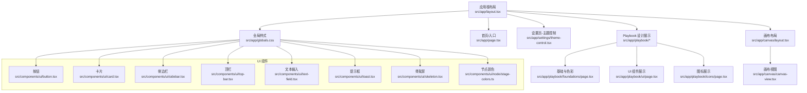
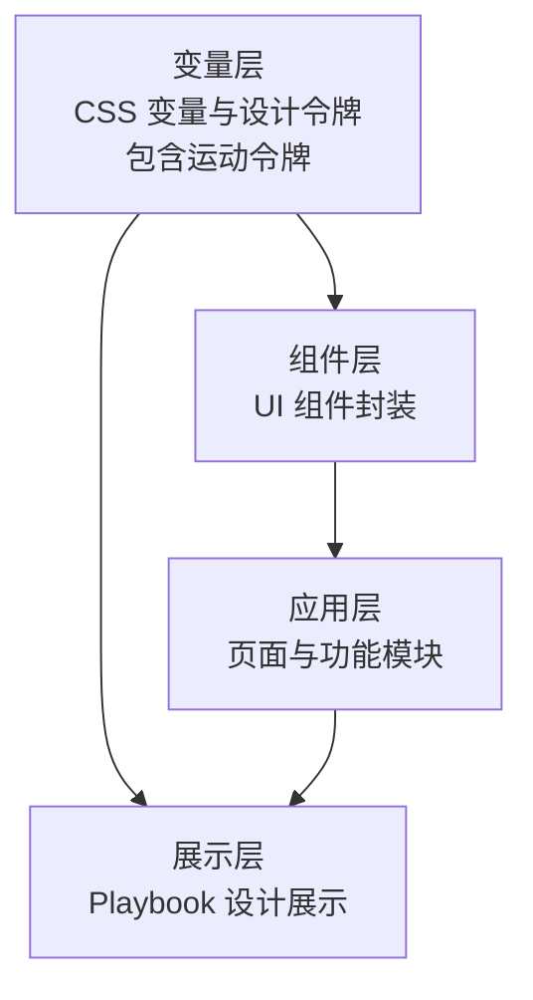
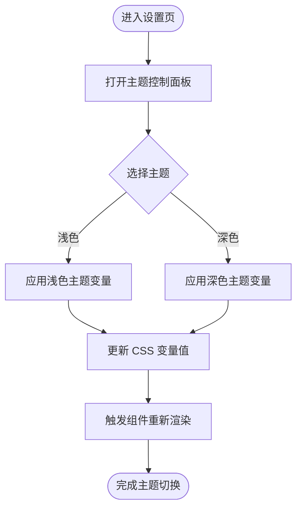
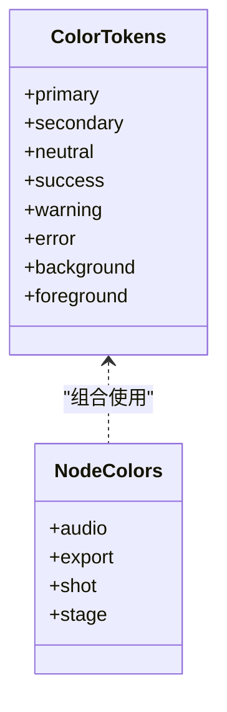
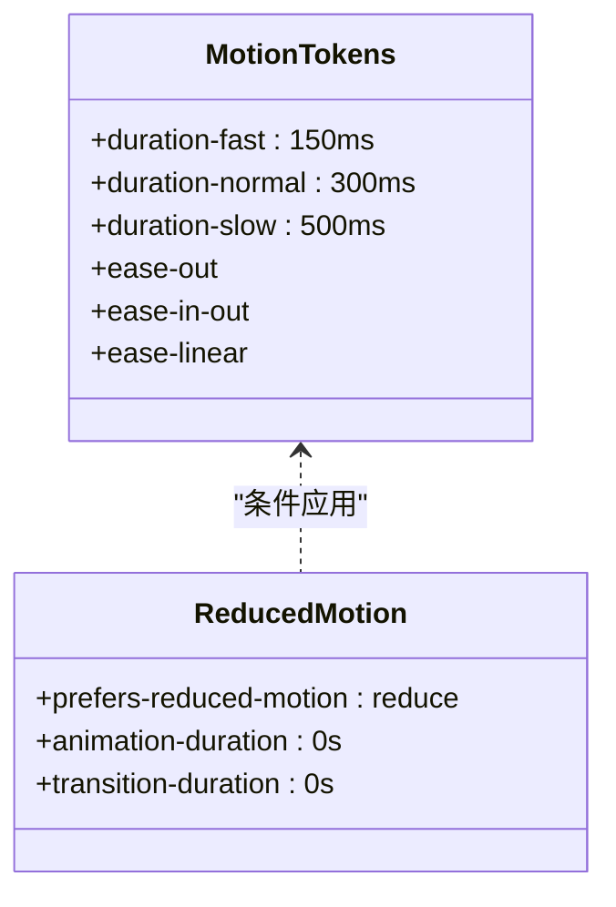
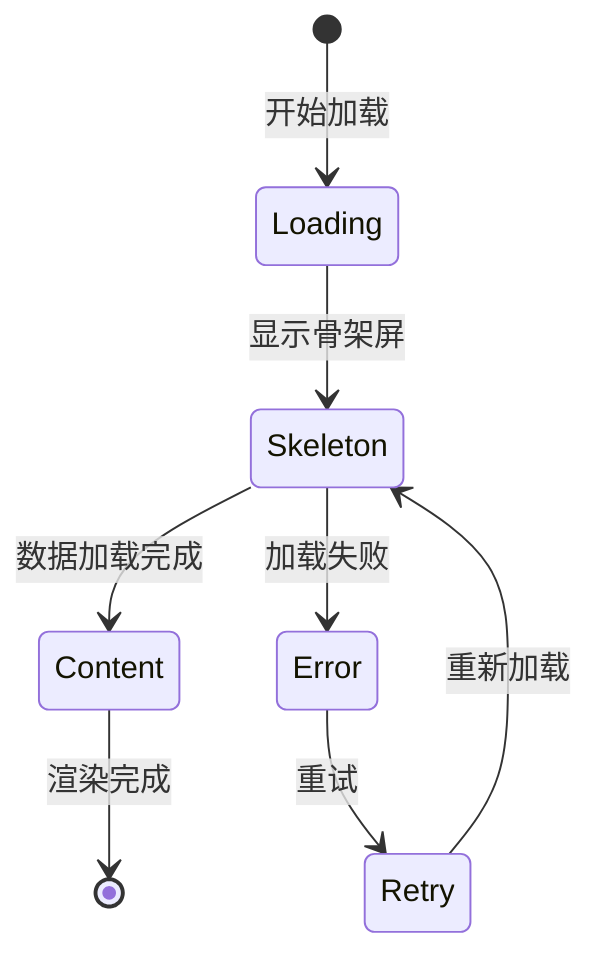
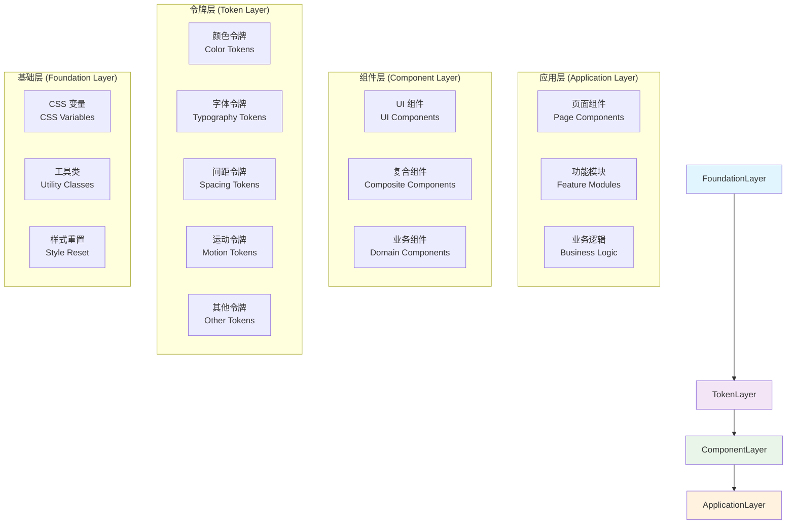
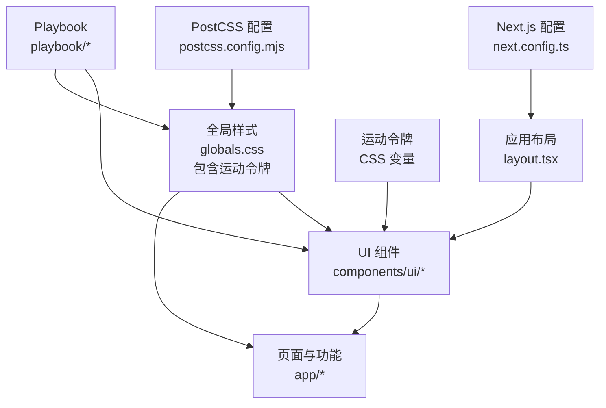

# 设计系统

<cite>
**本文引用的文件**   
- [README.md](file://README.md)
- [globals.css](file://src/app/globals.css)
- [layout.tsx](file://src/app/layout.tsx)
- [page.tsx](file://src/app/page.tsx)
- [theme-control.tsx](file://src/app/settings/theme-control.tsx)
- [theme-control.test.ts](file://src/app/settings/theme-control.test.ts)
- [playbook page.tsx](file://src/app/playbook/page.tsx)
- [foundations page.tsx](file://src/app/playbook/foundations/page.tsx)
- [ui page.tsx](file://src/app/playbook/ui/page.tsx)
- [icons page.tsx](file://src/app/playbook/icons/page.tsx)
- [registry.ts](file://src/app/playbook/registry.ts)
- [button.tsx](file://src/components/ui/button.tsx)
- [card.tsx](file://src/components/ui/card.tsx)
- [sidebar.tsx](file://src/components/ui/sidebar.tsx)
- [top-bar.tsx](file://src/components/ui/top-bar.tsx)
- [text-field.tsx](file://src/components/ui/text-field.tsx)
- [toast.tsx](file://src/components/ui/toast.tsx)
- [skeleton.tsx](file://src/components/ui/skeleton.tsx)
- [skeleton.demo.tsx](file://src/components/ui/skeleton.demo.tsx)
- [stage-colors.ts](file://src/components/ui/node/stage-colors.ts)
- [app-sidebar-shell.tsx](file://src/features/navigation/app-sidebar-shell.tsx)
- [canvas layout.tsx](file://src/app/canvas/layout.tsx)
- [canvas view.tsx](file://src/app/canvas/canvas-view.tsx)
- [postcss.config.mjs](file://postcss.config.mjs)
- [next.config.ts](file://next.config.ts)
</cite>

## 更新摘要
**变更内容**   
- 新增设计系统分层表（3.8节），提供更清晰的设计系统层级交互和依赖关系可视化
- 增强设计系统架构说明，明确各层之间的职责划分和数据流向
- 更新依赖关系分析章节，反映新的分层架构设计

## 目录
1. [简介](#简介)
2. [项目结构](#项目结构)
3. [核心组件](#核心组件)
4. [架构总览](#架构总览)
5. [详细组件分析](#详细组件分析)
6. [设计系统分层架构](#设计系统分层架构)
7. [依赖关系分析](#依赖关系分析)
8. [性能考量](#性能考量)
9. [故障排查指南](#故障排查指南)
10. [结论](#结论)
11. [附录](#附录)

## 简介
本设计系统文档面向 CodeVideoCanvas 的设计与实现，覆盖设计原则、色彩体系、字体规范、间距系统与布局网格、主题配置与样式变量管理、设计令牌使用与自定义方法、响应式断点与移动端适配策略、无障碍访问标准与实现方式，以及在实际页面与组件中的应用示例与最佳实践。目标是帮助开发者与设计师在统一的设计语言下高效协作，确保产品体验一致性与可维护性。

**更新** 新增设计系统分层架构说明，提供更清晰的层级交互和依赖关系可视化。

## 项目结构
CodeVideoCanvas 采用 Next.js App Router 组织应用层，UI 组件集中在 src/components/ui，功能特性按领域划分于 src/features，全局样式与主题入口位于 src/app 下的全局文件。Playbook（设计展示页）用于可视化呈现设计系统的各维度。

图表来源
- [layout.tsx](file://src/app/layout.tsx)
- [globals.css](file://src/app/globals.css)
- [page.tsx](file://src/app/page.tsx)
- [theme-control.tsx](file://src/app/settings/theme-control.tsx)
- [playbook page.tsx](file://src/app/playbook/page.tsx)
- [foundations page.tsx](file://src/app/playbook/foundations/page.tsx)
- [ui page.tsx](file://src/app/playbook/ui/page.tsx)
- [icons page.tsx](file://src/app/playbook/icons/page.tsx)
- [canvas layout.tsx](file://src/app/canvas/layout.tsx)
- [canvas view.tsx](file://src/app/canvas/canvas-view.tsx)
- [button.tsx](file://src/components/ui/button.tsx)
- [card.tsx](file://src/components/ui/card.tsx)
- [sidebar.tsx](file://src/components/ui/sidebar.tsx)
- [top-bar.tsx](file://src/components/ui/top-bar.tsx)
- [text-field.tsx](file://src/components/ui/text-field.tsx)
- [toast.tsx](file://src/components/ui/toast.tsx)
- [skeleton.tsx](file://src/components/ui/skeleton.tsx)
- [stage-colors.ts](file://src/components/ui/node/stage-colors.ts)

章节来源
- [README.md](file://README.md)
- [layout.tsx](file://src/app/layout.tsx)
- [page.tsx](file://src/app/page.tsx)
- [globals.css](file://src/app/globals.css)

## 核心组件
本节聚焦设计系统的基础构件与它们在应用中的角色：
- 全局样式与主题变量：通过 CSS 变量集中管理颜色、字体、间距等设计令牌，便于主题切换与一致性复用。
- 基础 UI 组件：按钮、卡片、侧边栏、顶栏、文本输入、提示框、骨架屏等，均基于设计令牌构建，保证视觉与交互一致性。
- 业务节点颜色：针对视频制作流程的节点类型提供语义化配色，增强信息层级与可读性。
- Playbook 展示：将设计系统以"色板、字体、组件"等形式可视化，便于团队对齐与验收。

**更新** 新增骨架屏组件，用于加载状态的用户反馈，提升用户体验。

章节来源
- [globals.css](file://src/app/globals.css)
- [button.tsx](file://src/components/ui/button.tsx)
- [card.tsx](file://src/components/ui/card.tsx)
- [sidebar.tsx](file://src/components/ui/sidebar.tsx)
- [top-bar.tsx](file://src/components/ui/top-bar.tsx)
- [text-field.tsx](file://src/components/ui/text-field.tsx)
- [toast.tsx](file://src/components/ui/toast.tsx)
- [skeleton.tsx](file://src/components/ui/skeleton.tsx)
- [stage-colors.ts](file://src/components/ui/node/stage-colors.ts)
- [playbook page.tsx](file://src/app/playbook/page.tsx)

## 架构总览
设计系统采用"CSS 变量 + 组件封装 + 展示页"的分层架构：
- 变量层：在 CSS 中定义设计令牌（颜色、字体、间距、圆角、阴影、运动参数等），并通过媒体查询支持暗色模式与响应式。
- 组件层：UI 组件通过 CSS 变量引用设计令牌，避免硬编码样式，提升可维护性与主题扩展能力。
- 展示层：Playbook 页面聚合展示设计令牌与组件用法，作为设计与开发的共同参考。

**更新** 运动令牌系统现已集成到变量层，为所有组件提供一致的动画行为。

图表来源
- [globals.css](file://src/app/globals.css)
- [button.tsx](file://src/components/ui/button.tsx)
- [card.tsx](file://src/components/ui/card.tsx)
- [skeleton.tsx](file://src/components/ui/skeleton.tsx)
- [playbook page.tsx](file://src/app/playbook/page.tsx)

## 详细组件分析

### 主题与样式变量管理
- 变量定义位置：全局样式文件中集中声明设计令牌，包括颜色、字体、间距、圆角、阴影等。
- 主题切换机制：通过设置页的主题控制面板动态切换主题变量值，实现明暗主题或品牌主题的快速切换。
- 响应式与媒体查询：在变量层使用媒体查询为不同屏幕尺寸提供差异化取值，确保跨设备一致性。
- 最佳实践：
  - 所有组件仅通过 CSS 变量引用设计令牌，禁止硬编码具体数值。
  - 命名遵循语义化（如 --color-primary、--spacing-md），便于理解与维护。
  - 对关键令牌添加注释说明用途与约束。

图表来源
- [theme-control.tsx](file://src/app/settings/theme-control.tsx)
- [globals.css](file://src/app/globals.css)

章节来源
- [theme-control.tsx](file://src/app/settings/theme-control.tsx)
- [theme-control.test.ts](file://src/app/settings/theme-control.test.ts)
- [globals.css](file://src/app/globals.css)

### 色彩体系
- 语义化颜色：主色、强调色、中性色、状态色（成功、警告、错误）、背景与前景色分层管理。
- 对比度与可读性：遵循 WCAG 对比度要求，确保文本与背景的对比度满足 AA 级及以上。
- 节点颜色：针对视频制作流程的节点类型（如音频、导出、分镜等）提供语义化配色，提升识别效率。
- 使用建议：
  - 优先使用语义化颜色令牌，而非直接引用具体色值。
  - 状态色需配合图标与文案，确保多通道传达。
  - 在暗色模式下校验对比度，必要时调整亮度或透明度。

图表来源
- [stage-colors.ts](file://src/components/ui/node/stage-colors.ts)
- [globals.css](file://src/app/globals.css)

章节来源
- [stage-colors.ts](file://src/components/ui/node/stage-colors.ts)
- [globals.css](file://src/app/globals.css)

### 字体规范
- 字体族：定义主字体与备用字体，确保在不同平台与设备上的一致性。
- 字号与行高：建立从标题到正文、辅助文本的字号阶梯，配套合适的行高与字重。
- 可读性：确保最小字号与行高满足阅读需求，避免过密排版。
- 使用建议：
  - 通过 CSS 变量统一管理字体族、字号、行高、字重。
  - 在组件中引用字体令牌，避免重复定义。
  - 针对不同屏幕尺寸调整字号与行高，提升移动端可读性。

章节来源
- [globals.css](file://src/app/globals.css)

### 间距系统与布局网格
- 间距令牌：定义统一的间距刻度（如 4px、8px、12px、16px 等），贯穿组件内外边距。
- 布局网格：基于栅格系统组织页面内容，确保对齐与留白一致性。
- 响应式：通过媒体查询在不同断点调整间距与网格列数。
- 使用建议：
  - 组件内部与外部间距统一使用间距令牌。
  - 网格列数与间距随屏幕尺寸变化，保持视觉平衡。
  - 避免随意使用非标准间距，减少样式碎片化。

章节来源
- [globals.css](file://src/app/globals.css)

### 运动令牌系统
**新增** 运动令牌系统为设计系统提供了统一的动画和过渡效果管理。

- 持续时间令牌：定义标准的动画时长（如 --duration-fast: 150ms、--duration-normal: 300ms、--duration-slow: 500ms），确保动画节奏的一致性。
- 缓动函数令牌：预定义的缓动曲线（如 --ease-out、--ease-in-out、--ease-linear），提供自然的动画过渡效果。
- 减少运动支持：通过 prefers-reduced-motion 媒体查询检测用户偏好，自动禁用或简化动画效果，提升可访问性。
- 使用建议：
  - 所有动画都应使用运动令牌，避免硬编码时间值和缓动函数。
  - 重要交互反馈使用短持续时间（fast），页面级过渡使用中等持续时间（normal）。
  - 始终考虑减少运动用户的体验，提供无动画的降级方案。

图表来源
- [globals.css](file://src/app/globals.css)
- [skeleton.tsx](file://src/components/ui/skeleton.tsx)

章节来源
- [globals.css](file://src/app/globals.css)
- [skeleton.tsx](file://src/components/ui/skeleton.tsx)

### 骨架屏组件
**新增** 骨架屏组件为用户提供内容加载时的视觉反馈，提升用户体验。

- 组件功能：显示占位符形状和渐变动画，模拟真实内容的布局结构。
- 自定义选项：支持不同的形状（矩形、圆形、椭圆）、尺寸和动画速度。
- 无障碍支持：使用适当的 ARIA 属性标记加载状态，确保屏幕阅读器正确识别。
- 使用场景：数据加载、图片预览、列表项占位等需要即时反馈的场景。
- 最佳实践：
  - 骨架屏的形状应与实际内容布局保持一致，帮助用户建立心理预期。
  - 动画速度应适中，避免过于快速或缓慢影响用户体验。
  - 在减少运动模式下自动禁用动画，尊重用户偏好。

图表来源
- [skeleton.tsx](file://src/components/ui/skeleton.tsx)
- [skeleton.demo.tsx](file://src/components/ui/skeleton.demo.tsx)

章节来源
- [skeleton.tsx](file://src/components/ui/skeleton.tsx)
- [skeleton.demo.tsx](file://src/components/ui/skeleton.demo.tsx)

### 响应式断点与移动端适配
- 断点策略：定义小屏、中屏、大屏断点，覆盖主流设备尺寸。
- 移动端优先：默认样式面向移动端，逐步增强至大屏。
- 组件适配：侧边栏、顶栏、卡片等在移动端进行折叠、堆叠或全屏展示。
- 使用建议：
  - 使用媒体查询与 CSS 变量组合实现响应式。
  - 在小屏上简化导航与操作，提升可用性。
  - 测试常见设备与浏览器，确保兼容性。

章节来源
- [globals.css](file://src/app/globals.css)
- [sidebar.tsx](file://src/components/ui/sidebar.tsx)
- [top-bar.tsx](file://src/components/ui/top-bar.tsx)

### 无障碍访问（A11y）
- 语义化 HTML：使用正确的标签与属性，确保屏幕阅读器可理解。
- 键盘导航：确保所有交互元素可通过键盘操作，并提供可见焦点样式。
- 对比度与颜色：遵循 WCAG 对比度标准，避免仅用颜色传达信息。
- 替代文本：为图片与图标提供替代文本或 aria-label。
- 减少运动支持：尊重用户的运动偏好，自动禁用或简化动画效果。
- 加载状态反馈：使用骨架屏和适当的 ARIA 属性提供清晰的加载状态指示。
- 使用建议：
  - 在组件中添加必要的 aria-* 属性。
  - 测试键盘导航与屏幕阅读器兼容性。
  - 定期运行无障碍审计，修复问题。
  - 始终考虑减少运动用户的需求，提供无动画的降级方案。

**更新** 新增减少运动支持和骨架屏的无障碍实现指导。

章节来源
- [globals.css](file://src/app/globals.css)
- [button.tsx](file://src/components/ui/button.tsx)
- [text-field.tsx](file://src/components/ui/text-field.tsx)
- [skeleton.tsx](file://src/components/ui/skeleton.tsx)

### Playbook 设计展示
- 基础与色彩：展示色板、字体、间距等设计令牌的实际效果。
- UI 组件：展示按钮、卡片、侧边栏、顶栏、文本输入、提示框、骨架屏等组件的用法与变体。
- 图标：展示图标库的使用方式与命名规范。
- 使用建议：
  - 将 Playbook 作为设计与开发对齐的工具。
  - 新增或修改设计令牌后，同步更新 Playbook。
  - 在 Playbook 中记录使用场景与注意事项。

**更新** 新增骨架屏组件的展示和使用示例。

章节来源
- [playbook page.tsx](file://src/app/playbook/page.tsx)
- [foundations page.tsx](file://src/app/playbook/foundations/page.tsx)
- [ui page.tsx](file://src/app/playbook/ui/page.tsx)
- [icons page.tsx](file://src/app/playbook/icons/page.tsx)
- [registry.ts](file://src/app/playbook/registry.ts)

## 设计系统分层架构
**新增** 设计系统采用清晰的分层架构，每层都有明确的职责和依赖关系。

### 分层架构概览
设计系统分为四个主要层次，每层都承担特定的职责：

图表来源
- [globals.css](file://src/app/globals.css)
- [button.tsx](file://src/components/ui/button.tsx)
- [card.tsx](file://src/components/ui/card.tsx)
- [skeleton.tsx](file://src/components/ui/skeleton.tsx)

### 分层职责说明

#### 基础层 (Foundation Layer)
- **CSS 变量**：定义所有设计令牌的基础变量
- **工具类**：提供通用的样式工具类
- **样式重置**：确保跨浏览器的样式一致性

#### 令牌层 (Token Layer)
- **颜色令牌**：语义化的颜色定义（主色、强调色、状态色等）
- **字体令牌**：字体族、字号、行高、字重的标准化定义
- **间距令牌**：统一的间距系统和布局网格
- **运动令牌**：动画持续时间、缓动函数的标准化定义
- **其他令牌**：圆角、阴影、边框等其他设计属性

#### 组件层 (Component Layer)
- **UI 组件**：基础的原子组件（按钮、输入框、卡片等）
- **复合组件**：由多个基础组件组合而成的复杂组件
- **业务组件**：特定业务领域的专用组件

#### 应用层 (Application Layer)
- **页面组件**：具体的页面实现
- **功能模块**：业务功能的模块化封装
- **业务逻辑**：应用的业务规则和数据处理

### 层间依赖关系
- **单向依赖**：上层只能依赖下层，不能反向依赖
- **松耦合**：每层之间通过明确的接口进行通信
- **可替换性**：下层可以独立升级而不影响上层
- **可测试性**：每层都可以独立进行测试验证

**更新** 新增设计系统分层架构说明，提供更清晰的层级交互和依赖关系可视化。

## 依赖关系分析
设计系统的依赖关系清晰分层：
- 变量层被组件层引用，组件层被应用层使用。
- Playbook 展示层依赖变量层与组件层，用于可视化验证。
- 构建工具（PostCSS、Next.js）负责编译与优化样式。

**更新** 运动令牌系统现在被所有动画相关的组件共享使用。

图表来源
- [postcss.config.mjs](file://postcss.config.mjs)
- [next.config.ts](file://next.config.ts)
- [globals.css](file://src/app/globals.css)
- [layout.tsx](file://src/app/layout.tsx)
- [button.tsx](file://src/components/ui/button.tsx)
- [card.tsx](file://src/components/ui/card.tsx)
- [skeleton.tsx](file://src/components/ui/skeleton.tsx)
- [playbook page.tsx](file://src/app/playbook/page.tsx)

章节来源
- [postcss.config.mjs](file://postcss.config.mjs)
- [next.config.ts](file://next.config.ts)
- [globals.css](file://src/app/globals.css)
- [layout.tsx](file://src/app/layout.tsx)

## 性能考量
- 样式体积：通过 CSS 变量与组件封装减少重复样式，降低样式表体积。
- 主题切换：使用 CSS 变量切换主题，避免全量重绘，提升性能。
- 响应式：合理使用媒体查询，避免过多断点导致样式复杂化。
- 构建优化：利用 Next.js 与 PostCSS 的优化能力，压缩与合并样式资源。
- 动画性能：使用 GPU 加速的 CSS 属性（transform、opacity），避免触发布局重排。
- 骨架屏优化：使用轻量级的 CSS 动画，避免复杂的 JavaScript 计算。

**更新** 新增动画性能和骨架屏优化的指导。

## 故障排查指南
- 主题未生效：检查 CSS 变量是否正确注入与覆盖，确认主题控制面板的状态更新逻辑。
- 颜色对比度不足：使用无障碍工具检测对比度，调整颜色或透明度以满足标准。
- 响应式异常：检查媒体查询断点与组件样式，确保在不同屏幕尺寸下表现正常。
- 组件样式不一致：确认组件是否通过 CSS 变量引用设计令牌，避免硬编码样式。
- 动画不工作：检查运动令牌是否正确定义，确认浏览器是否支持相关 CSS 属性。
- 骨架屏显示异常：验证骨架屏的 CSS 类名是否正确应用，检查动画是否被意外禁用。

**更新** 新增运动和骨架屏相关的故障排查指导。

章节来源
- [theme-control.tsx](file://src/app/settings/theme-control.tsx)
- [globals.css](file://src/app/globals.css)
- [skeleton.tsx](file://src/components/ui/skeleton.tsx)

## 结论
CodeVideoCanvas 的设计系统以 CSS 变量为核心，结合组件封装与 Playbook 展示，实现了统一、可扩展、易维护的设计语言。通过严格的设计令牌管理与无障碍标准，确保了产品的一致性与可访问性。新增的运动令牌系统和骨架屏组件进一步丰富了设计系统的表达能力，提升了用户体验和无障碍支持。建议在后续迭代中持续完善设计令牌、组件库与展示页，以提升团队协作效率与用户体验。

**更新** 运动令牌系统和骨架屏组件的引入使设计系统更加完整和现代化。

## 附录
- 设计令牌命名规范：建议使用语义化命名，如 --color-primary、--spacing-md、--font-size-base、--duration-fast、--ease-out。
- 组件使用清单：按钮、卡片、侧边栏、顶栏、文本输入、提示框、骨架屏等组件应统一通过设计令牌构建。
- 无障碍检查清单：语义化 HTML、键盘导航、对比度、替代文本、减少运动支持等。
- 响应式断点建议：小屏（≤768px）、中屏（769–1024px）、大屏（≥1025px）。
- 运动令牌使用指南：选择合适的持续时间与缓动函数，始终考虑减少运动用户的需求。
- 骨架屏最佳实践：保持与实际内容布局的一致性，提供清晰的加载状态反馈。

**更新** 新增运动令牌和骨架屏的相关规范和指南。