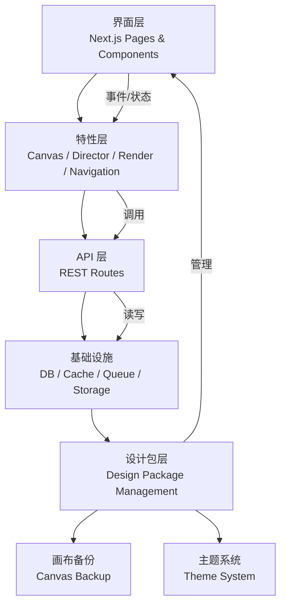
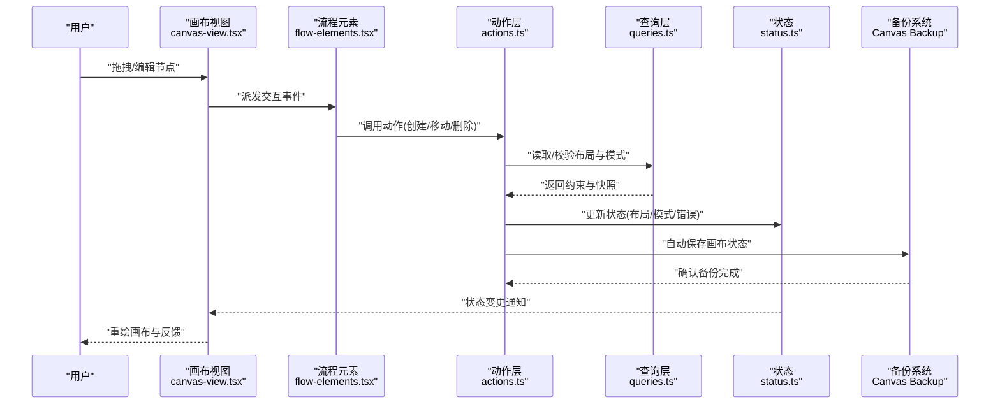
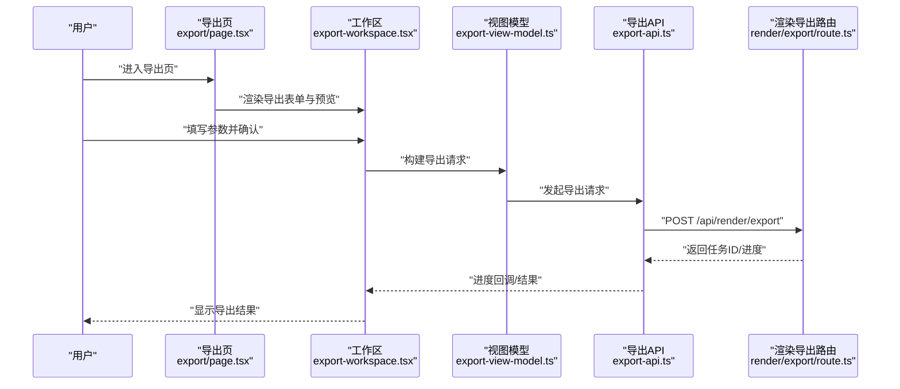
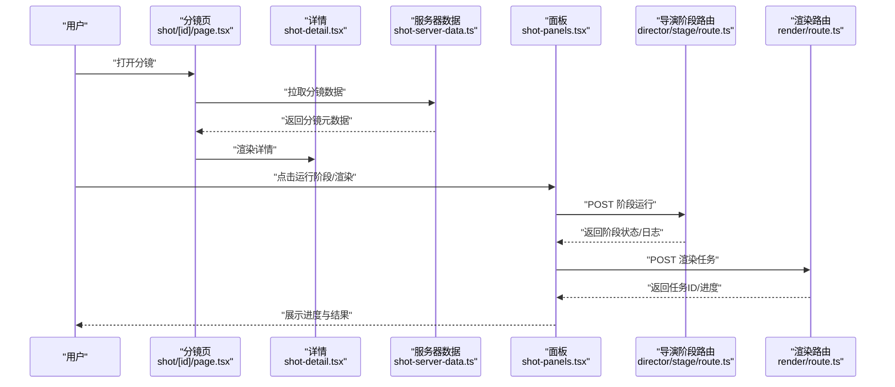
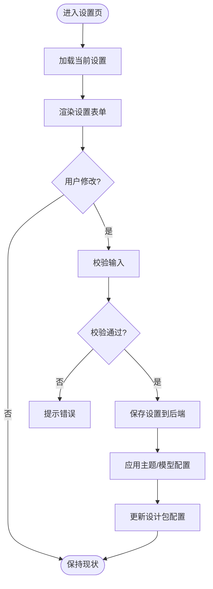
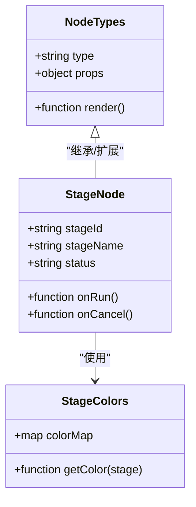
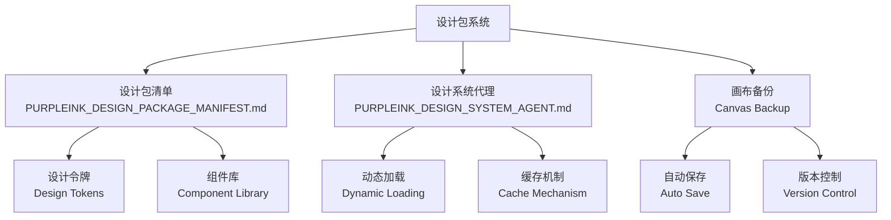
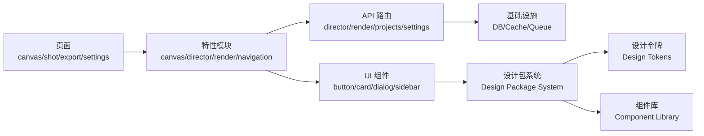

# PurpleInk v3 设计系统

<cite>
**本文引用的文件**   
- [README.md](file://README.md)
- [AGENTS.md](file://AGENTS.md)
- [package.json](file://package.json)
- [next.config.ts](file://next.config.ts)
- [drizzle.config.ts](file://drizzle.config.ts)
- [tsconfig.json](file://tsconfig.json)
- [vitest.config.ts](file://vitest.config.ts)
- [src/app/layout.tsx](file://src/app/layout.tsx)
- [src/app/(app)/layout.tsx](file://src/app/(app)/layout.tsx)
- [src/app/(app)/template.tsx](file://src/app/(app)/template.tsx)
- [src/app/(app)/page.tsx](file://src/app/(app)/page.tsx)
- [src/app/(app)/canvas/page.tsx](file://src/app/(app)/canvas/page.tsx)
- [src/app/(app)/canvas/canvas-view.tsx](file://src/app/(app)/canvas/canvas-view.tsx)
- [src/app/(app)/canvas/flow-elements.tsx](file://src/app/(app)/canvas/flow-elements.tsx)
- [src/app/(app)/canvas/canvas-inspector.tsx](file://src/app/(app)/canvas/canvas-inspector.tsx)
- [src/app/(app)/canvas/streaming-log-card.tsx](file://src/app/(app)/canvas/streaming-log-card.tsx)
- [src/app/(app)/canvas/export/page.tsx](file://src/app/(app)/canvas/export/page.tsx)
- [src/app/(app)/canvas/export/export-workspace.tsx](file://src/app/(app)/canvas/export/export-workspace.tsx)
- [src/app/(app)/canvas/export/export-api.ts](file://src/app/(app)/canvas/export/export-api.ts)
- [src/app/(app)/canvas/export/export-view-model.ts](file://src/app/(app)/canvas/export/export-view-model.ts)
- [src/app/(app)/canvas/shot/[id]/page.tsx](file://src/app/(app)/canvas/shot/[id]/page.tsx)
- [src/app/(app)/canvas/shot/[id]/shot-detail.tsx](file://src/app/(app)/canvas/shot/[id]/shot-detail.tsx)
- [src/app/(app)/canvas/shot/[id]/shot-panels.tsx](file://src/app/(app)/canvas/shot/[id]/shot-panels.tsx)
- [src/app/(app)/canvas/shot/[id]/shot-server-data.ts](file://src/app/(app)/canvas/shot/[id]/shot-server-data.ts)
- [src/app/(app)/projects/page.tsx](file://src/app/(app)/projects/page.tsx)
- [src/app/(app)/settings/page.tsx](file://src/app/(app)/settings/page.tsx)
- [src/app/(app)/settings/settings-form.tsx](file://src/app/(app)/settings/settings-form.tsx)
- [src/app/(app)/settings/theme-control.tsx](file://src/app/(app)/settings/theme-control.tsx)
- [src/app/(app)/settings/model-service-settings.tsx](file://src/app/(app)/settings/model-service-settings.tsx)
- [src/app/_components/new-project-dialog.tsx](file://src/app/_components/new-project-dialog.tsx)
- [src/app/api/artifacts/[id]/route.ts](file://src/app/api/artifacts/[id]/route.ts)
- [src/app/api/director/pipeline/route.ts](file://src/app/api/director/pipeline/route.ts)
- [src/app/api/director/stage/route.ts](file://src/app/api/director/stage/route.ts)
- [src/app/api/director/stream/[nodeId]/route.ts](file://src/app/api/director/stream/[nodeId]/route.ts)
- [src/app/api/jobs/[id]/route.ts](file://src/app/api/jobs/[id]/route.ts)
- [src/app/api/render/route.ts](file://src/app/api/render/route.ts)
- [src/app/api/render/export/route.ts](file://src/app/api/render/export/route.ts)
- [src/app/api/render/thumbnails/route.ts](file://src/app/api/render/thumbnails/route.ts)
- [src/app/api/projects/[id]/route.ts](file://src/app/api/projects/[id]/route.ts)
- [src/app/api/projects/route.ts](file://src/app/api/projects/route.ts)
- [src/app/api/settings/route.ts](file://src/app/api/settings/route.ts)
- [src/components/ui/button.tsx](file://src/components/ui/button.tsx)
- [src/components/ui/card.tsx](file://src/components/ui/card.tsx)
- [src/components/ui/dialog.tsx](file://src/components/ui/dialog.tsx)
- [src/components/ui/sidebar.tsx](file://src/components/ui/sidebar.tsx)
- [src/components/ui/top-bar.tsx](file://src/components/ui/top-bar.tsx)
- [src/components/ui/timeline-track.tsx](file://src/components/ui/timeline-track.tsx)
- [src/components/ui/node/types.ts](file://src/components/ui/node/types.ts)
- [src/components/ui/node/stage-node.tsx](file://src/components/ui/node/stage-node.tsx)
- [src/components/ui/node/stage-colors.ts](file://src/components/ui/node/stage-colors.ts)
- [src/features/navigation/app-shell.tsx](file://src/features/navigation/app-shell.tsx)
- [src/features/navigation/app-sidebar.tsx](file://src/features/navigation/app-sidebar.tsx)
- [src/features/navigation/nav-context.tsx](file://src/features/navigation/nav-context.tsx)
- [src/features/canvas/actions.ts](file://src/features/canvas/actions.ts)
- [src/features/canvas/layout.ts](file://src/features/canvas/layout.ts)
- [src/features/canvas/queries.ts](file://src/features/canvas/queries.ts)
- [src/features/canvas/schemas.ts](file://src/features/canvas/schemas.ts)
- [src/features/canvas/status.ts](file://src/features/canvas/status.ts)
- [src/features/director/index.ts](file://src/features/director/index.ts)
- [src/features/director/pipeline.ts](file://src/features/director/pipeline.ts)
- [src/features/director/stage-runner.ts](file://src/features/director/stage-runner.ts)
- [src/features/director/stage-result.ts](file://src/features/director/stage-result.ts)
- [src/features/director/stage-effects.ts](file://src/features/director/stage-effects.ts)
- [src/features/director/session-store.ts](file://src/features/director/session-store.ts)
- [src/features/director/runtime-repository.ts](file://src/features/director/runtime-repository.ts)
- [src/features/render/renderer.ts](file://src/features/render/renderer.ts)
- [src/features/render/export-service.ts](file://src/features/render/export-service.ts)
- [src/features/render/repository.ts](file://src/features/render/repository.ts)
- [src/features/render/cache.ts](file://src/features/render/cache.ts)
- [src/features/render/queue-handler.ts](file://src/features/render/queue-handler.ts)
- [src/lib/utils.ts](file://src/lib/utils.ts)
- [docs/designs/purpleink-new-design-package/PURPLEINK_DESIGN_PACKAGE_MANIFEST.md](file://docs/designs/purpleink-new-design-package/PURPLEINK_DESIGN_PACKAGE_MANIFEST.md)
- [docs/designs/purpleink-new-design-package/PURPLEINK_DESIGN_SYSTEM_AGENT.md](file://docs/designs/purpleink-new-design-package/PURPLEINK_DESIGN_SYSTEM_AGENT.md)
- [docs/designs/purpleink-new-design-package/source-reference/DESIGN.md](file://docs/designs/purpleink-new-design-package/source-reference/DESIGN.md)
- [docs/designs/purpleink-new-design-package/source-reference/PURPLEINK_COLOR_SYSTEM.md](file://docs/designs/purpleink-new-design-package/source-reference/PURPLEINK_COLOR_SYSTEM.md)
- [docs/specs/2026-07-24-refactor-v3-architecture-spec.md](file://docs/specs/2026-07-24-refactor-v3-architecture-spec.md)
- [docs/specs/2026-07-24-refactor-v3-product-spec.md](file://docs/specs/2026-07-24-refactor-v3-product-spec.md)
- [docs/plans/2026-07-24-refactor-blueprint-03-tracks.md](file://docs/plans/2026-07-24-refactor-blueprint-03-tracks.md)
</cite>

## 更新摘要
**变更内容**   
- 新增 PurpleInk 设计包集成，包含增强的画布备份支持
- 添加完整的设计系统代理和清单文档
- 更新设计系统架构以支持新的设计包管理
- 增强画布组件的备份与恢复功能

## 目录
1. [引言](#引言)
2. [项目结构](#项目结构)
3. [核心组件](#核心组件)
4. [架构总览](#架构总览)
5. [详细组件分析](#详细组件分析)
6. [依赖关系分析](#依赖关系分析)
7. [性能考量](#性能考量)
8. [故障排查指南](#故障排查指南)
9. [结论](#结论)
10. [附录](#附录)

## 引言
PurpleInk v3 设计系统是一个面向视频创作与导演的 Next.js 应用，围绕"画布（Canvas）—导演（Director）—渲染（Render）"三大能力构建。它提供：
- 可视化画布编排、分镜与阶段式工作流
- 基于阶段的流水线执行与结果提交
- 渲染导出、缩略图生成与队列管理
- 统一的 UI 组件与设计令牌（颜色、布局、交互）
- **新增** 完整的设计包管理与画布备份支持

本仓库同时包含设计系统文档与重构蓝图，用于指导 v3 的演进方向与落地路径。

**章节来源**
- [README.md](file://README.md)
- [AGENTS.md](file://AGENTS.md)
- [docs/specs/2026-07-24-refactor-v3-product-spec.md](file://docs/specs/2026-07-24-refactor-v3-product-spec.md)

## 项目结构
- 前端应用位于 src/app，采用 App Router 组织页面与路由；业务功能按 features 划分（ai、artifacts、audio、canvas、director、navigation、render）。
- 通用 UI 组件集中在 src/components/ui，节点类组件在 src/components/ui/node。
- API 路由位于 src/app/api，按资源域拆分（artifacts、director、jobs、render、projects、settings）。
- 配置与工程化：next.config.ts、tsconfig.json、drizzle.config.ts、vitest.config.ts、package.json。
- 设计与规范文档集中于 docs，包括设计系统包说明、颜色体系、架构规格与重构计划。
- **新增** 设计包文档位于 docs/designs/purpleink-new-design-package，包含完整的代理策略和清单管理。

```mermaid
graph TB
subgraph "应用入口"
L["src/app/layout.tsx"]
AL["src/app/(app)/layout.tsx"]
TPL["src/app/(app)/template.tsx"]
end
subgraph "页面与视图"
P["src/app/(app)/page.tsx"]
CPage["src/app/(app)/canvas/page.tsx"]
CV["src/app/(app)/canvas/canvas-view.tsx"]
FE["src/app/(app)/canvas/flow-elements.tsx"]
INS["src/app/(app)/canvas/canvas-inspector.tsx"]
SLG["src/app/(app)/canvas/streaming-log-card.tsx"]
EXPPage["src/app/(app)/canvas/export/page.tsx"]
EXPWS["src/app/(app)/canvas/export/export-workspace.tsx"]
SHOTPage["src/app/(app)/canvas/shot/[id]/page.tsx"]
SHOTDetail["src/app/(app)/canvas/shot/[id]/shot-detail.tsx"]
SHOTPanels["src/app/(app)/canvas/shot/[id]/shot-panels.tsx"]
PROJPage["src/app/(app)/projects/page.tsx"]
SETPage["src/app/(app)/settings/page.tsx"]
end
subgraph "UI 组件"
BTN["src/components/ui/button.tsx"]
CARD["src/components/ui/card.tsx"]
DIALOG["src/components/ui/dialog.tsx"]
SIDEBAR["src/components/ui/sidebar.tsx"]
TOPBAR["src/components/ui/top-bar.tsx"]
TIMELINE["src/components/ui/timeline-track.tsx"]
STAGENODE["src/components/ui/node/stage-node.tsx"]
STAGECOLORS["src/components/ui/node/stage-colors.ts"]
end
subgraph "特性模块"
NAV["src/features/navigation/app-shell.tsx"]
CANVAS["src/features/canvas/actions.ts<br/>layout.ts<br/>queries.ts<br/>schemas.ts<br/>status.ts"]
DIRECTOR["src/features/director/pipeline.ts<br/>stage-runner.ts<br/>stage-result.ts<br/>stage-effects.ts<br/>session-store.ts<br/>runtime-repository.ts"]
RENDER["src/features/render/renderer.ts<br/>export-service.ts<br/>repository.ts<br/>cache.ts<br/>queue-handler.ts"]
end
subgraph "API 路由"
A_ART["src/app/api/artifacts/[id]/route.ts"]
A_DIR_PIPE["src/app/api/director/pipeline/route.ts"]
A_DIR_STAGE["src/app/api/director/stage/route.ts"]
A_DIR_STREAM["src/app/api/director/stream/[nodeId]/route.ts"]
A_JOBS["src/app/api/jobs/[id]/route.ts"]
A_RENDER["src/app/api/render/route.ts"]
A_EXPORT["src/app/api/render/export/route.ts"]
A_THUMB["src/app/api/render/thumbnails/route.ts"]
A_PROJ["src/app/api/projects/route.ts"]
A_PROJ_ID["src/app/api/projects/[id]/route.ts"]
A_SETTINGS["src/app/api/settings/route.ts"]
end
subgraph "设计包文档"
MANIFEST["PURPLEINK_DESIGN_PACKAGE_MANIFEST.md"]
AGENT["PURPLEINK_DESIGN_SYSTEM_AGENT.md"]
DESIGN_REF["source-reference/DESIGN.md"]
COLOR_SYS["source-reference/PURPLEINK_COLOR_SYSTEM.md"]
end
L --> AL --> P
AL --> CPage --> CV --> FE
CV --> INS
CV --> SLG
CPage --> EXPPage --> EXPWS
CPage --> SHOTPage --> SHOTDetail --> SHOTPanels
AL --> PROJPage
AL --> SETPage
CV --> CANVAS
EXPWS --> RENDER
SHOTDetail --> DIRECTOR
SHOTPanels --> RENDER
NAV --> BTN
NAV --> CARD
NAV --> DIALOG
NAV --> SIDEBAR
NAV --> TOPBAR
NAV --> TIMELINE
NAV --> STAGENODE
STAGENODE --> STAGECOLORS
CV --> A_DIR_PIPE
EXPWS --> A_EXPORT
SHOTDetail --> A_DIR_STAGE
SHOTPanels --> A_RENDER
MANIFEST --> DESIGN_REF
AGENT --> COLOR_SYS
```

**图表来源**
- [src/app/layout.tsx](file://src/app/layout.tsx)
- [src/app/(app)/layout.tsx](file://src/app/(app)/layout.tsx)
- [src/app/(app)/template.tsx](file://src/app/(app)/template.tsx)
- [src/app/(app)/page.tsx](file://src/app/(app)/page.tsx)
- [src/app/(app)/canvas/page.tsx](file://src/app/(app)/canvas/page.tsx)
- [src/app/(app)/canvas/canvas-view.tsx](file://src/app/(app)/canvas/canvas-view.tsx)
- [src/app/(app)/canvas/flow-elements.tsx](file://src/app/(app)/canvas/flow-elements.tsx)
- [src/app/(app)/canvas/canvas-inspector.tsx](file://src/app/(app)/canvas/canvas-inspector.tsx)
- [src/app/(app)/canvas/streaming-log-card.tsx](file://src/app/(app)/canvas/streaming-log-card.tsx)
- [src/app/(app)/canvas/export/page.tsx](file://src/app/(app)/canvas/export/page.tsx)
- [src/app/(app)/canvas/export/export-workspace.tsx](file://src/app/(app)/canvas/export/export-workspace.tsx)
- [src/app/(app)/canvas/shot/[id]/page.tsx](file://src/app/(app)/canvas/shot/[id]/page.tsx)
- [src/app/(app)/canvas/shot/[id]/shot-detail.tsx](file://src/app/(app)/canvas/shot/[id]/shot-detail.tsx)
- [src/app/(app)/canvas/shot/[id]/shot-panels.tsx](file://src/app/(app)/canvas/shot/[id]/shot-panels.tsx)
- [src/app/(app)/projects/page.tsx](file://src/app/(app)/projects/page.tsx)
- [src/app/(app)/settings/page.tsx](file://src/app/(app)/settings/page.tsx)
- [src/components/ui/button.tsx](file://src/components/ui/button.tsx)
- [src/components/ui/card.tsx](file://src/components/ui/card.tsx)
- [src/components/ui/dialog.tsx](file://src/components/ui/dialog.tsx)
- [src/components/ui/sidebar.tsx](file://src/components/ui/sidebar.tsx)
- [src/components/ui/top-bar.tsx](file://src/components/ui/top-bar.tsx)
- [src/components/ui/timeline-track.tsx](file://src/components/ui/timeline-track.tsx)
- [src/components/ui/node/stage-node.tsx](file://src/components/ui/node/stage-node.tsx)
- [src/components/ui/node/stage-colors.ts](file://src/components/ui/node/stage-colors.ts)
- [src/features/navigation/app-shell.tsx](file://src/features/navigation/app-shell.tsx)
- [src/features/canvas/actions.ts](file://src/features/canvas/actions.ts)
- [src/features/canvas/layout.ts](file://src/features/canvas/layout.ts)
- [src/features/canvas/queries.ts](file://src/features/canvas/queries.ts)
- [src/features/canvas/schemas.ts](file://src/features/canvas/schemas.ts)
- [src/features/canvas/status.ts](file://src/features/canvas/status.ts)
- [src/features/director/pipeline.ts](file://src/features/director/pipeline.ts)
- [src/features/director/stage-runner.ts](file://src/features/director/stage-runner.ts)
- [src/features/director/stage-result.ts](file://src/features/director/stage-result.ts)
- [src/features/director/stage-effects.ts](file://src/features/director/stage-effects.ts)
- [src/features/director/session-store.ts](file://src/features/director/session-store.ts)
- [src/features/director/runtime-repository.ts](file://src/features/director/runtime-repository.ts)
- [src/features/render/renderer.ts](file://src/features/render/renderer.ts)
- [src/features/render/export-service.ts](file://src/features/render/export-service.ts)
- [src/features/render/repository.ts](file://src/features/render/repository.ts)
- [src/features/render/cache.ts](file://src/features/render/cache.ts)
- [src/features/render/queue-handler.ts](file://src/features/render/queue-handler.ts)
- [src/app/api/director/pipeline/route.ts](file://src/app/api/director/pipeline/route.ts)
- [src/app/api/director/stage/route.ts](file://src/app/api/director/stage/route.ts)
- [src/app/api/director/stream/[nodeId]/route.ts](file://src/app/api/director/stream/[nodeId]/route.ts)
- [src/app/api/render/route.ts](file://src/app/api/render/route.ts)
- [src/app/api/render/export/route.ts](file://src/app/api/render/export/route.ts)
- [src/app/api/render/thumbnails/route.ts](file://src/app/api/render/thumbnails/route.ts)
- [docs/designs/purpleink-new-design-package/PURPLEINK_DESIGN_PACKAGE_MANIFEST.md](file://docs/designs/purpleink-new-design-package/PURPLEINK_DESIGN_PACKAGE_MANIFEST.md)
- [docs/designs/purpleink-new-design-package/PURPLEINK_DESIGN_SYSTEM_AGENT.md](file://docs/designs/purpleink-new-design-package/PURPLEINK_DESIGN_SYSTEM_AGENT.md)
- [docs/designs/purpleink-new-design-package/source-reference/DESIGN.md](file://docs/designs/purpleink-new-design-package/source-reference/DESIGN.md)
- [docs/designs/purpleink-new-design-package/source-reference/PURPLEINK_COLOR_SYSTEM.md](file://docs/designs/purpleink-new-design-package/source-reference/PURPLEINK_COLOR_SYSTEM.md)

**章节来源**
- [package.json](file://package.json)
- [next.config.ts](file://next.config.ts)
- [tsconfig.json](file://tsconfig.json)
- [drizzle.config.ts](file://drizzle.config.ts)
- [vitest.config.ts](file://vitest.config.ts)

## 核心组件
- 导航与应用外壳：App Shell、侧边栏、顶部栏、导航上下文，统一承载页面布局与状态。
- 画布与流程元素：画布视图、流程图节点、检查器、流式日志卡片，支撑可视化编排与实时反馈。
- 导出工作台：导出页与工作区，封装导出参数、视图模型与 API 调用。
- 分镜详情与面板：分镜详情页与侧面板，集成导演阶段运行与渲染任务。
- 设置与主题：设置表单、主题控制、模型服务配置。
- UI 基础组件：按钮、卡片、对话框、侧边栏、时间轴轨道、节点类型与着色。
- **新增** 设计包管理：完整的设计系统代理和清单文档，支持画布备份与恢复。

**章节来源**
- [src/features/navigation/app-shell.tsx](file://src/features/navigation/app-shell.tsx)
- [src/features/navigation/app-sidebar.tsx](file://src/features/navigation/app-sidebar.tsx)
- [src/features/navigation/nav-context.tsx](file://src/features/navigation/nav-context.tsx)
- [src/components/ui/top-bar.tsx](file://src/components/ui/top-bar.tsx)
- [src/components/ui/sidebar.tsx](file://src/components/ui/sidebar.tsx)
- [src/app/(app)/canvas/canvas-view.tsx](file://src/app/(app)/canvas/canvas-view.tsx)
- [src/app/(app)/canvas/flow-elements.tsx](file://src/app/(app)/canvas/flow-elements.tsx)
- [src/app/(app)/canvas/canvas-inspector.tsx](file://src/app/(app)/canvas/canvas-inspector.tsx)
- [src/app/(app)/canvas/streaming-log-card.tsx](file://src/app/(app)/canvas/streaming-log-card.tsx)
- [src/app/(app)/canvas/export/export-workspace.tsx](file://src/app/(app)/canvas/export/export-workspace.tsx)
- [src/app/(app)/canvas/shot/[id]/shot-detail.tsx](file://src/app/(app)/canvas/shot/[id]/shot-detail.tsx)
- [src/app/(app)/canvas/shot/[id]/shot-panels.tsx](file://src/app/(app)/canvas/shot/[id]/shot-panels.tsx)
- [src/app/(app)/settings/settings-form.tsx](file://src/app/(app)/settings/settings-form.tsx)
- [src/app/(app)/settings/theme-control.tsx](file://src/app/(app)/settings/theme-control.tsx)
- [src/app/(app)/settings/model-service-settings.tsx](file://src/app/(app)/settings/model-service-settings.tsx)
- [src/components/ui/button.tsx](file://src/components/ui/button.tsx)
- [src/components/ui/card.tsx](file://src/components/ui/card.tsx)
- [src/components/ui/dialog.tsx](file://src/components/ui/dialog.tsx)
- [src/components/ui/timeline-track.tsx](file://src/components/ui/timeline-track.tsx)
- [src/components/ui/node/types.ts](file://src/components/ui/node/types.ts)
- [src/components/ui/node/stage-node.tsx](file://src/components/ui/node/stage-node.tsx)
- [src/components/ui/node/stage-colors.ts](file://src/components/ui/node/stage-colors.ts)
- [docs/designs/purpleink-new-design-package/PURPLEINK_DESIGN_PACKAGE_MANIFEST.md](file://docs/designs/purpleink-new-design-package/PURPLEINK_DESIGN_PACKAGE_MANIFEST.md)
- [docs/designs/purpleink-new-design-package/PURPLEINK_DESIGN_SYSTEM_AGENT.md](file://docs/designs/purpleink-new-design-package/PURPLEINK_DESIGN_SYSTEM_AGENT.md)

## 架构总览
PurpleInk v3 采用分层架构：
- 表现层：Next.js App Router 页面与组件，负责用户交互与数据展示。
- 特性层：按领域划分的 features（canvas、director、render、navigation 等），封装业务逻辑与状态。
- API 层：RESTful 路由，协调外部服务与持久化。
- 基础设施：数据库（Drizzle）、缓存、队列、存储适配器。
- **新增** 设计包层：统一管理设计令牌、组件库与画布备份配置。

**图表来源**
- [src/app/(app)/layout.tsx](file://src/app/(app)/layout.tsx)
- [src/features/canvas/actions.ts](file://src/features/canvas/actions.ts)
- [src/features/director/pipeline.ts](file://src/features/director/pipeline.ts)
- [src/features/render/renderer.ts](file://src/features/render/renderer.ts)
- [src/app/api/director/pipeline/route.ts](file://src/app/api/director/pipeline/route.ts)
- [src/app/api/render/route.ts](file://src/app/api/render/route.ts)
- [docs/designs/purpleink-new-design-package/PURPLEINK_DESIGN_PACKAGE_MANIFEST.md](file://docs/designs/purpleink-new-design-package/PURPLEINK_DESIGN_PACKAGE_MANIFEST.md)
- [docs/designs/purpleink-new-design-package/PURPLEINK_DESIGN_SYSTEM_AGENT.md](file://docs/designs/purpleink-new-design-package/PURPLEINK_DESIGN_SYSTEM_AGENT.md)

**章节来源**
- [docs/specs/2026-07-24-refactor-v3-architecture-spec.md](file://docs/specs/2026-07-24-refactor-v3-architecture-spec.md)

## 详细组件分析

### 画布与流程编排（Canvas）
- 画布视图与流程元素：负责渲染节点、连线与交互；通过查询与动作模块驱动状态更新。
- 检查器与流式日志：提供运行时调试与进度反馈。
- 关键数据流：用户操作触发 actions → 更新 layout/schema/status → 视图重绘。
- **新增** 画布备份支持：自动保存画布状态，支持版本回滚与恢复。

**图表来源**
- [src/app/(app)/canvas/canvas-view.tsx](file://src/app/(app)/canvas/canvas-view.tsx)
- [src/app/(app)/canvas/flow-elements.tsx](file://src/app/(app)/canvas/flow-elements.tsx)
- [src/features/canvas/actions.ts](file://src/features/canvas/actions.ts)
- [src/features/canvas/queries.ts](file://src/features/canvas/queries.ts)
- [src/features/canvas/status.ts](file://src/features/canvas/status.ts)
- [docs/designs/purpleink-new-design-package/PURPLEINK_DESIGN_PACKAGE_MANIFEST.md](file://docs/designs/purpleink-new-design-package/PURPLEINK_DESIGN_PACKAGE_MANIFEST.md)

**章节来源**
- [src/app/(app)/canvas/canvas-view.tsx](file://src/app/(app)/canvas/canvas-view.tsx)
- [src/app/(app)/canvas/flow-elements.tsx](file://src/app/(app)/canvas/flow-elements.tsx)
- [src/app/(app)/canvas/canvas-inspector.tsx](file://src/app/(app)/canvas/canvas-inspector.tsx)
- [src/app/(app)/canvas/streaming-log-card.tsx](file://src/app/(app)/canvas/streaming-log-card.tsx)
- [src/features/canvas/actions.ts](file://src/features/canvas/actions.ts)
- [src/features/canvas/layout.ts](file://src/features/canvas/layout.ts)
- [src/features/canvas/queries.ts](file://src/features/canvas/queries.ts)
- [src/features/canvas/schemas.ts](file://src/features/canvas/schemas.ts)
- [src/features/canvas/status.ts](file://src/features/canvas/status.ts)

### 导出工作台（Export Workspace）
- 导出页与工作区：收集导出参数、预览与进度，调用导出 API。
- 视图模型：将用户输入转换为导出请求体，处理错误与重试。

**图表来源**
- [src/app/(app)/canvas/export/page.tsx](file://src/app/(app)/canvas/export/page.tsx)
- [src/app/(app)/canvas/export/export-workspace.tsx](file://src/app/(app)/canvas/export/export-workspace.tsx)
- [src/app/(app)/canvas/export/export-view-model.ts](file://src/app/(app)/canvas/export/export-view-model.ts)
- [src/app/(app)/canvas/export/export-api.ts](file://src/app/(app)/canvas/export/export-api.ts)
- [src/app/api/render/export/route.ts](file://src/app/api/render/export/route.ts)

**章节来源**
- [src/app/(app)/canvas/export/page.tsx](file://src/app/(app)/canvas/export/page.tsx)
- [src/app/(app)/canvas/export/export-workspace.tsx](file://src/app/(app)/canvas/export/export-workspace.tsx)
- [src/app/(app)/canvas/export/export-view-model.ts](file://src/app/(app)/canvas/export/export-view-model.ts)
- [src/app/(app)/canvas/export/export-api.ts](file://src/app/(app)/canvas/export/export-api.ts)
- [src/app/api/render/export/route.ts](file://src/app/api/render/export/route.ts)

### 分镜详情与面板（Shot Detail & Panels）
- 分镜详情页：加载服务器数据、展示分镜信息与状态。
- 面板：集成导演阶段运行与渲染任务，支持启动、监控与结果查看。

**图表来源**
- [src/app/(app)/canvas/shot/[id]/page.tsx](file://src/app/(app)/canvas/shot/[id]/page.tsx)
- [src/app/(app)/canvas/shot/[id]/shot-detail.tsx](file://src/app/(app)/canvas/shot/[id]/shot-detail.tsx)
- [src/app/(app)/canvas/shot/[id]/shot-server-data.ts](file://src/app/(app)/canvas/shot/[id]/shot-server-data.ts)
- [src/app/(app)/canvas/shot/[id]/shot-panels.tsx](file://src/app/(app)/canvas/shot/[id]/shot-panels.tsx)
- [src/app/api/director/stage/route.ts](file://src/app/api/director/stage/route.ts)
- [src/app/api/render/route.ts](file://src/app/api/render/route.ts)

**章节来源**
- [src/app/(app)/canvas/shot/[id]/page.tsx](file://src/app/(app)/canvas/shot/[id]/page.tsx)
- [src/app/(app)/canvas/shot/[id]/shot-detail.tsx](file://src/app/(app)/canvas/shot/[id]/shot-detail.tsx)
- [src/app/(app)/canvas/shot/[id]/shot-panels.tsx](file://src/app/(app)/canvas/shot/[id]/shot-panels.tsx)
- [src/app/(app)/canvas/shot/[id]/shot-server-data.ts](file://src/app/(app)/canvas/shot/[id]/shot-server-data.ts)
- [src/app/api/director/stage/route.ts](file://src/app/api/director/stage/route.ts)
- [src/app/api/render/route.ts](file://src/app/api/render/route.ts)

### 设置与主题（Settings & Theme）
- 设置表单与主题控制：集中管理应用配置、主题切换与模型服务参数。
- 模型服务设置：对接 AI 模型配置与鉴权信息。
- **新增** 设计包配置：管理设计令牌、组件库版本与画布备份设置。

**图表来源**
- [src/app/(app)/settings/page.tsx](file://src/app/(app)/settings/page.tsx)
- [src/app/(app)/settings/settings-form.tsx](file://src/app/(app)/settings/settings-form.tsx)
- [src/app/(app)/settings/theme-control.tsx](file://src/app/(app)/settings/theme-control.tsx)
- [src/app/(app)/settings/model-service-settings.tsx](file://src/app/(app)/settings/model-service-settings.tsx)
- [src/app/api/settings/route.ts](file://src/app/api/settings/route.ts)
- [docs/designs/purpleink-new-design-package/PURPLEINK_DESIGN_PACKAGE_MANIFEST.md](file://docs/designs/purpleink-new-design-package/PURPLEINK_DESIGN_PACKAGE_MANIFEST.md)

**章节来源**
- [src/app/(app)/settings/page.tsx](file://src/app/(app)/settings/page.tsx)
- [src/app/(app)/settings/settings-form.tsx](file://src/app/(app)/settings/settings-form.tsx)
- [src/app/(app)/settings/theme-control.tsx](file://src/app/(app)/settings/theme-control.tsx)
- [src/app/(app)/settings/model-service-settings.tsx](file://src/app/(app)/settings/model-service-settings.tsx)
- [src/app/api/settings/route.ts](file://src/app/api/settings/route.ts)

### 节点与着色（Node Types & Stage Colors）
- 节点类型定义：统一节点数据结构与行为契约。
- 阶段着色：为不同阶段节点提供一致的视觉标识。

**图表来源**
- [src/components/ui/node/types.ts](file://src/components/ui/node/types.ts)
- [src/components/ui/node/stage-node.tsx](file://src/components/ui/node/stage-node.tsx)
- [src/components/ui/node/stage-colors.ts](file://src/components/ui/node/stage-colors.ts)

**章节来源**
- [src/components/ui/node/types.ts](file://src/components/ui/node/types.ts)
- [src/components/ui/node/stage-node.tsx](file://src/components/ui/node/stage-node.tsx)
- [src/components/ui/node/stage-colors.ts](file://src/components/ui/node/stage-colors.ts)

### 设计包管理系统（Design Package Management）
- **新增** 设计包清单：统一管理设计令牌、组件库版本与依赖关系。
- **新增** 设计系统代理：提供设计资源的动态加载与缓存机制。
- **新增** 画布备份支持：自动保存画布状态，支持版本回滚与恢复。

**图表来源**
- [docs/designs/purpleink-new-design-package/PURPLEINK_DESIGN_PACKAGE_MANIFEST.md](file://docs/designs/purpleink-new-design-package/PURPLEINK_DESIGN_PACKAGE_MANIFEST.md)
- [docs/designs/purpleink-new-design-package/PURPLEINK_DESIGN_SYSTEM_AGENT.md](file://docs/designs/purpleink-new-design-package/PURPLEINK_DESIGN_SYSTEM_AGENT.md)
- [docs/designs/purpleink-new-design-package/source-reference/DESIGN.md](file://docs/designs/purpleink-new-design-package/source-reference/DESIGN.md)
- [docs/designs/purpleink-new-design-package/source-reference/PURPLEINK_COLOR_SYSTEM.md](file://docs/designs/purpleink-new-design-package/source-reference/PURPLEINK_COLOR_SYSTEM.md)

**章节来源**
- [docs/designs/purpleink-new-design-package/PURPLEINK_DESIGN_PACKAGE_MANIFEST.md](file://docs/designs/purpleink-new-design-package/PURPLEINK_DESIGN_PACKAGE_MANIFEST.md)
- [docs/designs/purpleink-new-design-package/PURPLEINK_DESIGN_SYSTEM_AGENT.md](file://docs/designs/purpleink-new-design-package/PURPLEINK_DESIGN_SYSTEM_AGENT.md)
- [docs/designs/purpleink-new-design-package/source-reference/DESIGN.md](file://docs/designs/purpleink-new-design-package/source-reference/DESIGN.md)
- [docs/designs/purpleink-new-design-package/source-reference/PURPLEINK_COLOR_SYSTEM.md](file://docs/designs/purpleink-new-design-package/source-reference/PURPLEINK_COLOR_SYSTEM.md)

## 依赖关系分析
- 页面与特性模块耦合度低：页面仅负责装配与展示，业务逻辑下沉至 features。
- API 路由作为边界：隔离前后端契约，便于测试与替换实现。
- UI 组件复用度高：基础组件被导航壳与业务视图广泛引用。
- **新增** 设计包依赖：设计包系统统一管理设计资源，减少重复依赖。

**图表来源**
- [src/app/(app)/canvas/page.tsx](file://src/app/(app)/canvas/page.tsx)
- [src/app/(app)/canvas/shot/[id]/page.tsx](file://src/app/(app)/canvas/shot/[id]/page.tsx)
- [src/app/(app)/canvas/export/page.tsx](file://src/app/(app)/canvas/export/page.tsx)
- [src/app/(app)/settings/page.tsx](file://src/app/(app)/settings/page.tsx)
- [src/features/canvas/actions.ts](file://src/features/canvas/actions.ts)
- [src/features/director/pipeline.ts](file://src/features/director/pipeline.ts)
- [src/features/render/renderer.ts](file://src/features/render/renderer.ts)
- [src/app/api/director/pipeline/route.ts](file://src/app/api/director/pipeline/route.ts)
- [src/app/api/render/route.ts](file://src/app/api/render/route.ts)
- [docs/designs/purpleink-new-design-package/PURPLEINK_DESIGN_PACKAGE_MANIFEST.md](file://docs/designs/purpleink-new-design-package/PURPLEINK_DESIGN_PACKAGE_MANIFEST.md)

**章节来源**
- [src/app/(app)/canvas/page.tsx](file://src/app/(app)/canvas/page.tsx)
- [src/app/(app)/canvas/shot/[id]/page.tsx](file://src/app/(app)/canvas/shot/[id]/page.tsx)
- [src/app/(app)/canvas/export/page.tsx](file://src/app/(app)/canvas/export/page.tsx)
- [src/app/(app)/settings/page.tsx](file://src/app/(app)/settings/page.tsx)
- [src/features/canvas/actions.ts](file://src/features/canvas/actions.ts)
- [src/features/director/pipeline.ts](file://src/features/director/pipeline.ts)
- [src/features/render/renderer.ts](file://src/features/render/renderer.ts)
- [src/app/api/director/pipeline/route.ts](file://src/app/api/director/pipeline/route.ts)
- [src/app/api/render/route.ts](file://src/app/api/render/route.ts)

## 性能考量
- 渲染优化：避免不必要的重渲染，使用稳定的 key 与 memoization。
- 网络请求：合并请求、分页与缓存策略，减少重复 IO。
- 队列与并发：渲染与导出任务通过队列限流，防止过载。
- 资源加载：按需加载大型组件与媒体资源，提升首屏速度。
- **新增** 设计包缓存：设计令牌与组件库采用智能缓存，减少重复加载。
- **新增** 画布备份优化：增量备份与压缩存储，降低存储空间占用。

[本节为通用指导，不直接分析具体文件]

## 故障排查指南
- 常见问题定位：
  - 画布状态不一致：检查 actions 与 queries 的数据一致性。
  - 导出失败：查看导出工作区的视图模型与 API 响应。
  - 阶段运行异常：关注流式日志与阶段结果提交。
  - **新增** 设计包加载失败：检查设计包清单与代理配置。
  - **新增** 画布备份失败：查看备份状态与存储空间。
- 调试建议：
  - 启用流式日志卡片观察实时输出。
  - 使用检查器核对节点属性与连接关系。
  - 在设置页验证模型服务配置与鉴权。
  - **新增** 检查设计包清单文件的完整性。
  - **新增** 验证画布备份的自动保存状态。

**章节来源**
- [src/app/(app)/canvas/streaming-log-card.tsx](file://src/app/(app)/canvas/streaming-log-card.tsx)
- [src/app/(app)/canvas/canvas-inspector.tsx](file://src/app/(app)/canvas/canvas-inspector.tsx)
- [src/app/(app)/canvas/export/export-view-model.ts](file://src/app/(app)/canvas/export/export-view-model.ts)
- [src/app/(app)/canvas/export/export-api.ts](file://src/app/(app)/canvas/export/export-api.ts)
- [src/app/api/director/stage/route.ts](file://src/app/api/director/stage/route.ts)
- [src/app/api/render/export/route.ts](file://src/app/api/render/export/route.ts)
- [docs/designs/purpleink-new-design-package/PURPLEINK_DESIGN_PACKAGE_MANIFEST.md](file://docs/designs/purpleink-new-design-package/PURPLEINK_DESIGN_PACKAGE_MANIFEST.md)
- [docs/designs/purpleink-new-design-package/PURPLEINK_DESIGN_SYSTEM_AGENT.md](file://docs/designs/purpleink-new-design-package/PURPLEINK_DESIGN_SYSTEM_AGENT.md)

## 结论
PurpleInk v3 设计系统以清晰的层次结构与模块化特性组织代码，结合统一的 UI 组件与设计令牌，提供了可扩展的视频创作与导演平台。通过 API 边界与基础设施抽象，系统在可维护性与性能方面具备良好基础。**新增的设计包管理系统进一步增强了系统的可配置性与可维护性，画布备份功能确保了数据安全与版本控制。** 后续应继续完善错误处理、可观测性与性能基准，确保稳定交付。

[本节为总结性内容，不直接分析具体文件]

## 附录
- 设计系统包清单与代理说明：参考设计文档中的包清单与代理策略。
- 颜色体系：遵循设计系统的颜色命名与使用规范。
- 重构蓝图与架构规格：依据 v3 重构计划推进迭代。
- **新增** 画布备份配置：详细的备份策略与恢复流程。
- **新增** 设计包版本管理：组件库升级与兼容性管理。

**章节来源**
- [docs/designs/purpleink-new-design-package/PURPLEINK_DESIGN_PACKAGE_MANIFEST.md](file://docs/designs/purpleink-new-design-package/PURPLEINK_DESIGN_PACKAGE_MANIFEST.md)
- [docs/designs/purpleink-new-design-package/PURPLEINK_DESIGN_SYSTEM_AGENT.md](file://docs/designs/purpleink-new-design-package/PURPLEINK_DESIGN_SYSTEM_AGENT.md)
- [docs/designs/purpleink-new-design-package/source-reference/DESIGN.md](file://docs/designs/purpleink-new-design-package/source-reference/DESIGN.md)
- [docs/designs/purpleink-new-design-package/source-reference/PURPLEINK_COLOR_SYSTEM.md](file://docs/designs/purpleink-new-design-package/source-reference/PURPLEINK_COLOR_SYSTEM.md)
- [docs/plans/2026-07-24-refactor-blueprint-03-tracks.md](file://docs/plans/2026-07-24-refactor-blueprint-03-tracks.md)
- [docs/specs/2026-07-24-refactor-v3-architecture-spec.md](file://docs/specs/2026-07-24-refactor-v3-architecture-spec.md)
- [docs/specs/2026-07-24-refactor-v3-product-spec.md](file://docs/specs/2026-07-24-refactor-v3-product-spec.md)