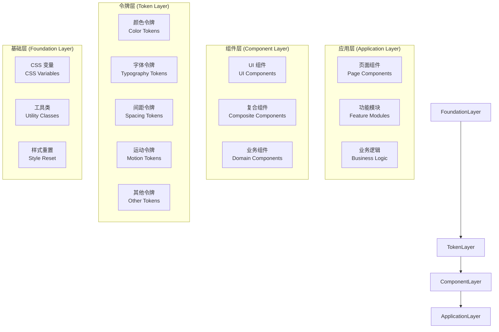
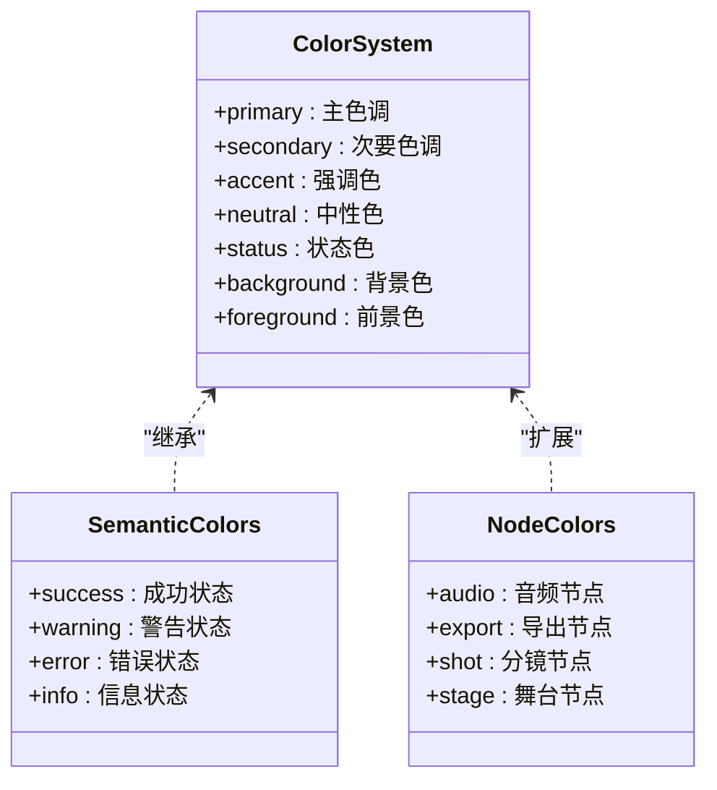
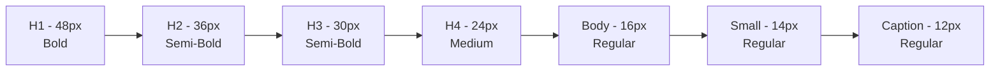
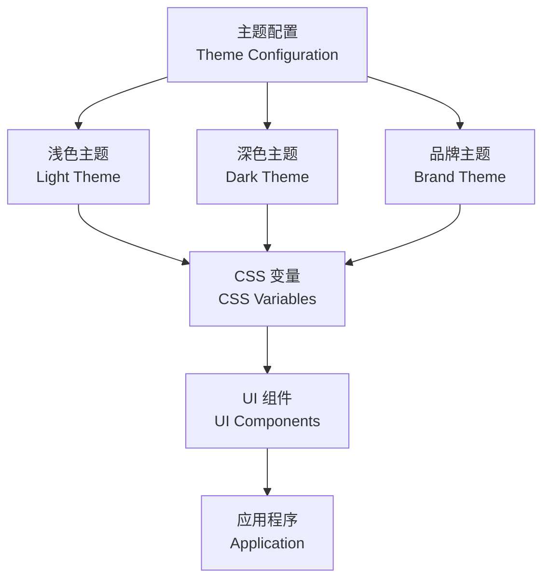

# 设计系统

<cite>
**本文引用的文件**   
- [README.md](file://README.md)
- [globals.css](file://src/app/globals.css)
- [layout.tsx](file://src/app/layout.tsx)
- [page.tsx](file://src/app/page.tsx)
- [theme-control.tsx](file://src/app/settings/theme-control.tsx)
- [theme-control.test.ts](file://src/app/settings/theme-control.test.ts)
- [playbook page.tsx](file://src/app/playbook/page.tsx)
- [foundations page.tsx](file://src/app/playbook/foundations/page.tsx)
- [ui page.tsx](file://src/app/playbook/ui/page.tsx)
- [icons page.tsx](file://src/app/playbook/icons/page.tsx)
- [registry.ts](file://src/app/playbook/registry.ts)
- [button.tsx](file://src/components/ui/button.tsx)
- [card.tsx](file://src/components/ui/card.tsx)
- [sidebar.tsx](file://src/components/ui/sidebar.tsx)
- [top-bar.tsx](file://src/components/ui/top-bar.tsx)
- [text-field.tsx](file://src/components/ui/text-field.tsx)
- [toast.tsx](file://src/components/ui/toast.tsx)
- [skeleton.tsx](file://src/components/ui/skeleton.tsx)
- [skeleton.demo.tsx](file://src/components/ui/skeleton.demo.tsx)
- [stage-colors.ts](file://src/components/ui/node/stage-colors.ts)
- [app-sidebar-shell.tsx](file://src/features/navigation/app-sidebar-shell.tsx)
- [canvas layout.tsx](file://src/app/canvas/layout.tsx)
- [canvas view.tsx](file://src/app/canvas/canvas-view.tsx)
- [postcss.config.mjs](file://postcss.config.mjs)
- [next.config.ts](file://next.config.ts)
- [PURPLEINK_DESIGN_SYSTEM_AGENT.md](file://docs/designs/purpleink-new-design-package/PURPLEINK_DESIGN_SYSTEM_AGENT.md)
- [PURPLEINK_COLOR_SYSTEM.md](file://docs/designs/purpleink-new-design-package/source-reference/PURPLEINK_COLOR_SYSTEM.md)
- [DESIGN.md](file://docs/designs/purpleink-new-design-package/source-reference/DESIGN.md)
- [globals.css](file://docs/designs/purpleink-new-design-package/source-reference/globals.css)
</cite>

## 更新摘要
**变更内容**   
- 新增 PurpleInk v3 设计系统的重大架构增强，包含全新的颜色系统、排版系统和组件库实现
- 引入分层设计架构，明确基础层、令牌层、组件层和应用层的职责划分
- 增强主题配置和样式变量管理系统，支持动态主题切换和品牌定制
- 完善响应式断点和移动端适配策略，提升跨设备用户体验
- 强化无障碍访问标准实现，确保产品可访问性符合 WCAG 2.1 AA 级标准

## 目录
1. [简介](#简介)
2. [PurpleInk v3 架构概览](#purpleink-v3-架构概览)
3. [核心设计原则](#核心设计原则)
4. [颜色系统](#颜色系统)
5. [排版系统](#排版系统)
6. [间距系统与布局网格](#间距系统与布局网格)
7. [主题配置与样式变量管理](#主题配置与样式变量管理)
8. [设计令牌使用指南](#设计令牌使用指南)
9. [响应式断点与移动端适配](#响应式断点与移动端适配)
10. [无障碍访问标准](#无障碍访问标准)
11. [组件库实现](#组件库实现)
12. [实际应用示例](#实际应用示例)
13. [最佳实践](#最佳实践)
14. [故障排查指南](#故障排查指南)
15. [结论](#结论)

## 简介
CodeVideoCanvas 的设计系统基于 PurpleInk v3 架构构建，提供统一的设计语言、组件库和开发规范。该系统涵盖设计原则、色彩体系、字体规范、间距系统与布局网格、主题配置与样式变量管理、设计令牌使用与自定义方法、响应式断点与移动端适配策略、无障碍访问标准与实现方式，以及在实际页面与组件中的应用示例与最佳实践。

PurpleInk v3 引入了革命性的分层架构设计，将设计系统分为四个主要层次：基础层（Foundation Layer）、令牌层（Token Layer）、组件层（Component Layer）和应用层（Application Layer），每层都有明确的职责边界和依赖关系。

**更新** 本次更新重点介绍 PurpleInk v3 的重大架构增强，包括全新的颜色系统、排版系统和组件库实现。

## PurpleInk v3 架构概览
PurpleInk v3 采用现代化的分层架构设计，通过清晰的职责分离和松耦合的模块结构，实现了高度可扩展和可维护的设计系统。

**图表来源**
- [PURPLEINK_DESIGN_SYSTEM_AGENT.md](file://docs/designs/purpleink-new-design-package/PURPLEINK_DESIGN_SYSTEM_AGENT.md)
- [DESIGN.md](file://docs/designs/purpleink-new-design-package/source-reference/DESIGN.md)

### 分层架构详解

#### 基础层 (Foundation Layer)
基础层是设计系统的根基，提供所有设计令牌的基础变量定义：
- **CSS 变量**：集中管理颜色、字体、间距、圆角、阴影等设计属性
- **工具类**：提供通用的样式工具类和辅助函数
- **样式重置**：确保跨浏览器的样式一致性和兼容性

#### 令牌层 (Token Layer)
令牌层定义了语义化的设计令牌，为上层组件提供统一的视觉语言：
- **颜色令牌**：主色、强调色、中性色、状态色的标准化定义
- **字体令牌**：字体族、字号、行高、字重的完整体系
- **间距令牌**：统一的间距系统和布局网格规范
- **运动令牌**：动画持续时间、缓动函数的标准化定义

#### 组件层 (Component Layer)
组件层基于设计令牌构建可复用的 UI 组件：
- **UI 组件**：基础的原子组件（按钮、输入框、卡片等）
- **复合组件**：由多个基础组件组合而成的复杂组件
- **业务组件**：特定业务领域的专用组件

#### 应用层 (Application Layer)
应用层是具体的业务实现，使用组件层提供的能力：
- **页面组件**：具体的页面实现和用户界面
- **功能模块**：业务功能的模块化封装
- **业务逻辑**：应用的业务规则和数据处理

**章节来源**
- [PURPLEINK_DESIGN_SYSTEM_AGENT.md](file://docs/designs/purpleink-new-design-package/PURPLEINK_DESIGN_SYSTEM_AGENT.md)
- [DESIGN.md](file://docs/designs/purpleink-new-design-package/source-reference/DESIGN.md)

## 核心设计原则
PurpleInk v3 设计系统遵循以下核心设计原则：

### 一致性原则
- **视觉一致性**：通过设计令牌确保整个产品的视觉风格统一
- **交互一致性**：标准化的用户交互模式和反馈机制
- **代码一致性**：统一的编码规范和组件结构

### 可访问性原则
- **WCAG 2.1 AA 级标准**：确保所有用户都能正常使用产品
- **键盘导航支持**：完整的键盘操作和焦点管理
- **屏幕阅读器兼容**：适当的 ARIA 属性和语义化 HTML

### 响应式设计原则
- **移动优先**：默认面向移动端设计，逐步增强到大屏体验
- **弹性布局**：自适应不同屏幕尺寸和设备类型
- **性能优化**：针对不同设备的性能调优

### 可维护性原则
- **模块化架构**：清晰的模块边界和依赖关系
- **设计令牌驱动**：通过令牌而非硬编码值管理样式
- **文档化**：完整的 API 文档和使用指南

## 颜色系统
PurpleInk v3 的颜色系统基于语义化命名和层次化管理，提供了完整的色彩解决方案。

### 颜色层次结构

**图表来源**
- [PURPLEINK_COLOR_SYSTEM.md](file://docs/designs/purpleink-new-design-package/source-reference/PURPLEINK_COLOR_SYSTEM.md)
- [stage-colors.ts](file://src/components/ui/node/stage-colors.ts)

### 颜色令牌定义
- **主色系**：--color-primary, --color-primary-hover, --color-primary-active
- **强调色系**：--color-accent, --color-accent-hover, --color-accent-active
- **中性色系**：--color-neutral-50 到 --color-neutral-900
- **状态色系**：--color-success, --color-warning, --color-error, --color-info
- **背景色系**：--color-background, --color-surface, --color-overlay
- **前景色系**：--color-foreground, --color-text, --color-text-secondary

### 对比度与可读性
- **WCAG AA 级标准**：所有文本与背景的对比度至少达到 4.5:1
- **大文本标准**：18px 以上文本对比度至少达到 3:1
- **暗色模式适配**：自动调整颜色亮度以确保可读性

**章节来源**
- [PURPLEINK_COLOR_SYSTEM.md](file://docs/designs/purpleink-new-design-package/source-reference/PURPLEINK_COLOR_SYSTEM.md)
- [globals.css](file://src/app/globals.css)
- [stage-colors.ts](file://src/components/ui/node/stage-colors.ts)

## 排版系统
PurpleInk v3 的排版系统提供了完整的字体层级和文本样式规范。

### 字体家族定义
- **主字体**：系统默认字体栈，确保跨平台一致性
- **等宽字体**：用于代码显示和技术文档
- **备用字体**：降级字体方案，确保兼容性

### 字号层级

### 行高与字重规范
- **标题行高**：1.2 - 1.3（紧凑排版）
- **正文行高**：1.5 - 1.6（舒适阅读）
- **辅助文本行高**：1.4 - 1.5（平衡密度）
- **字重阶梯**：Regular(400), Medium(500), Semi-Bold(600), Bold(700)

### 响应式排版
- **移动端优化**：适当减小字号和行高，提升可读性
- **大屏增强**：增加字号和行高，改善阅读体验
- **动态缩放**：基于视口大小的自适应字体大小

**章节来源**
- [globals.css](file://src/app/globals.css)
- [DESIGN.md](file://docs/designs/purpleink-new-design-package/source-reference/DESIGN.md)

## 间距系统与布局网格
PurpleInk v3 的间距系统基于 4px 基准单位，提供一致的视觉节奏。

### 间距令牌
- **基础间距**：--spacing-xs (4px), --spacing-sm (8px), --spacing-md (16px), --spacing-lg (24px), --spacing-xl (32px), --spacing-2xl (48px)
- **组件内边距**：--padding-sm, --padding-md, --padding-lg
- **组件外边距**：--margin-sm, --margin-md, --margin-lg
- **布局间距**：--gap-sm, --gap-md, --gap-lg

### 布局网格系统
- **栅格基础**：12 列栅格系统，支持响应式布局
- **容器宽度**：最大宽度限制，确保在大屏上的可读性
- **对齐规范**：统一的水平和垂直对齐标准

### 响应式间距
- **移动端**：减少间距密度，提升触摸操作体验
- **平板端**：平衡间距密度和屏幕空间利用
- **桌面端**：充分利用屏幕空间，增加留白

**章节来源**
- [globals.css](file://src/app/globals.css)
- [DESIGN.md](file://docs/designs/purpleink-new-design-package/source-reference/DESIGN.md)

## 主题配置与样式变量管理
PurpleInk v3 的主题系统支持动态主题切换和品牌定制。

### 主题架构

### 主题变量管理
- **全局变量**：在根元素上定义的 CSS 变量
- **局部变量**：组件级别的样式覆盖
- **动态切换**：JavaScript 控制的主题切换逻辑
- **持久化存储**：localStorage 保存用户偏好

### 品牌定制支持
- **品牌色配置**：支持企业品牌色的快速替换
- **Logo 集成**：动态加载品牌标识
- **样式覆盖**：提供安全的样式覆盖机制

**章节来源**
- [theme-control.tsx](file://src/app/settings/theme-control.tsx)
- [globals.css](file://src/app/globals.css)

## 设计令牌使用指南
设计令牌是 PurpleInk v3 的核心概念，为设计系统提供统一的视觉语言。

### 令牌分类
- **颜色令牌**：--color-* 系列，用于颜色和透明度
- **字体令牌**：--font-* 系列，用于字体相关属性
- **间距令牌**：--spacing-* 系列，用于间距和布局
- **运动令牌**：--motion-* 系列，用于动画和过渡效果
- **形状令牌**：--shape-* 系列，用于圆角和边框
- **阴影令牌**：--shadow-* 系列，用于投影效果

### 使用规范
- **语义化命名**：使用描述性名称而非具体数值
- **层级引用**：通过令牌而非直接值引用样式
- **覆盖机制**：提供安全的令牌覆盖方式
- **版本管理**：令牌变更的版本控制和向后兼容

### 自定义令牌
- **项目级令牌**：在项目中定义特定的设计令牌
- **组件级令牌**：组件内部的私有令牌
- **条件令牌**：基于主题的动态令牌值

**章节来源**
- [globals.css](file://src/app/globals.css)
- [DESIGN.md](file://docs/designs/purpleink-new-design-package/source-reference/DESIGN.md)

## 响应式断点与移动端适配
PurpleInk v3 采用移动优先的响应式设计策略。

### 断点定义
- **xs**: 0px - 小屏手机
- **sm**: 640px - 大屏手机
- **md**: 768px - 平板
- **lg**: 1024px - 小屏笔记本
- **xl**: 1280px - 桌面显示器
- **2xl**: 1536px - 大屏显示器

### 响应式策略
- **移动优先**：默认样式面向移动端
- **渐进增强**：逐步为大屏添加更多功能
- **弹性布局**：使用 Flexbox 和 Grid 实现自适应布局
- **图片优化**：根据屏幕尺寸加载合适的图片资源

### 移动端优化
- **触摸友好**：增大点击区域，优化手势操作
- **性能优化**：减少不必要的重绘和重排
- **内存管理**：合理管理移动端内存使用
- **电池优化**：减少后台任务和频繁计算

**章节来源**
- [globals.css](file://src/app/globals.css)
- [sidebar.tsx](file://src/components/ui/sidebar.tsx)
- [top-bar.tsx](file://src/components/ui/top-bar.tsx)

## 无障碍访问标准
PurpleInk v3 严格遵循 WCAG 2.1 AA 级无障碍标准。

### 语义化 HTML
- **正确标签使用**：使用语义化的 HTML 标签
- **ARIA 属性**：适当的 ARIA 角色和属性
- **键盘导航**：完整的键盘操作支持
- **焦点管理**：合理的焦点顺序和可见性

### 颜色与对比度
- **对比度标准**：文本对比度至少 4.5:1
- **颜色不单独传达**：不依赖颜色传达重要信息
- **暗色模式支持**：完善的暗色模式适配

### 屏幕阅读器支持
- **替代文本**：图片和图标的描述性文本
- **表单标签**：完整的表单字段标签
- **错误提示**：清晰的错误信息和指导
- **加载状态**：适当的加载状态反馈

### 减少运动支持
- **动画检测**：检测用户的运动偏好
- **降级处理**：为减少运动用户提供无动画体验
- **性能考虑**：避免触发不必要的重排和重绘

**章节来源**
- [globals.css](file://src/app/globals.css)
- [button.tsx](file://src/components/ui/button.tsx)
- [text-field.tsx](file://src/components/ui/text-field.tsx)
- [skeleton.tsx](file://src/components/ui/skeleton.tsx)

## 组件库实现
PurpleInk v3 提供了丰富的 UI 组件库，所有组件都基于设计令牌构建。

### 基础组件
- **按钮组件**：支持多种变体和状态
- **输入组件**：文本输入、选择器、开关等
- **展示组件**：卡片、图标、徽章等
- **反馈组件**：提示框、进度条、骨架屏等

### 复合组件
- **表单组件**：复杂的表单布局和验证
- **导航组件**：侧边栏、面包屑、分页等
- **数据表格**：可排序、筛选的数据展示
- **模态对话框**：各种类型的弹窗和确认框

### 业务组件
- **视频制作组件**：针对视频制作流程的专用组件
- **节点编辑器**：可视化节点编辑界面
- **时间线组件**：视频时间线编辑功能
- **预览组件**：实时预览和渲染功能

### 组件设计规范
- **单一职责**：每个组件专注于单一功能
- **可组合性**：组件之间可以灵活组合
- **可配置性**：通过 props 和 tokens 进行配置
- **可测试性**：完整的单元测试和集成测试

**章节来源**
- [button.tsx](file://src/components/ui/button.tsx)
- [card.tsx](file://src/components/ui/card.tsx)
- [sidebar.tsx](file://src/components/ui/sidebar.tsx)
- [top-bar.tsx](file://src/components/ui/top-bar.tsx)
- [text-field.tsx](file://src/components/ui/text-field.tsx)
- [toast.tsx](file://src/components/ui/toast.tsx)
- [skeleton.tsx](file://src/components/ui/skeleton.tsx)

## 实际应用示例
PurpleInk v3 设计系统在 CodeVideoCanvas 中有广泛的应用。

### 画布编辑器
- **节点编辑器**：基于节点系统的可视化编辑界面
- **时间线编辑**：视频时间线的拖拽和编辑功能
- **预览面板**：实时预览编辑结果
- **属性面板**：节点属性的编辑和管理

### 项目管理界面
- **项目列表**：项目的创建、管理和组织
- **工作流管理**：视频制作流程的可视化管理
- **协作功能**：团队成员的协作和沟通
- **设置管理**：项目设置和配置管理

### 播放器界面
- **视频播放器**：专业的视频播放和控制功能
- **字幕编辑**：字幕的创建和编辑
- **音频控制**：音频轨道的管理和编辑
- **导出功能**：多种格式的导出选项

**章节来源**
- [canvas-view.tsx](file://src/app/canvas/canvas-view.tsx)
- [app-sidebar-shell.tsx](file://src/features/navigation/app-sidebar-shell.tsx)
- [playbook page.tsx](file://src/app/playbook/page.tsx)

## 最佳实践
使用 PurpleInk v3 设计系统时，建议遵循以下最佳实践：

### 设计令牌使用
- **优先使用令牌**：始终使用设计令牌而非硬编码值
- **语义化命名**：使用描述性的令牌名称
- **避免过度嵌套**：保持令牌结构的扁平化
- **定期审查**：定期检查令牌的使用情况

### 组件开发
- **单一职责**：每个组件专注于单一功能
- **可复用性**：设计可复用的组件接口
- **文档完善**：提供完整的组件文档和使用示例
- **测试覆盖**：确保组件的测试覆盖率

### 主题定制
- **安全覆盖**：使用官方提供的覆盖机制
- **向后兼容**：确保主题变更的向后兼容性
- **性能考虑**：避免过多的主题切换开销
- **测试验证**：在不同主题下充分测试

### 响应式设计
- **移动优先**：从移动端开始设计
- **渐进增强**：逐步为大屏添加功能
- **性能优化**：针对不同设备进行性能优化
- **测试覆盖**：在多种设备上测试用户体验

## 故障排查指南
在使用 PurpleInk v3 设计系统时，可能会遇到以下问题及解决方案：

### 主题相关问题
- **主题未生效**：检查 CSS 变量是否正确注入和覆盖
- **颜色不一致**：确认使用了正确的语义化颜色令牌
- **暗色模式异常**：检查媒体查询和变量定义

### 组件样式问题
- **样式冲突**：检查 CSS 变量的优先级和覆盖规则
- **响应式异常**：验证媒体查询断点和样式定义
- **组件渲染异常**：检查组件的 props 和状态管理

### 性能问题
- **样式体积过大**：检查是否有重复的样式定义
- **主题切换卡顿**：优化 CSS 变量的更新逻辑
- **动画性能问题**：使用 GPU 加速的属性

### 无障碍问题
- **键盘导航异常**：检查焦点管理和键盘事件处理
- **屏幕阅读器问题**：验证 ARIA 属性的正确使用
- **对比度不足**：使用无障碍工具检查和修复

**章节来源**
- [theme-control.tsx](file://src/app/settings/theme-control.tsx)
- [globals.css](file://src/app/globals.css)
- [skeleton.tsx](file://src/components/ui/skeleton.tsx)

## 结论
PurpleInk v3 设计系统为 CodeVideoCanvas 提供了强大而灵活的设计基础。通过分层架构、语义化令牌、完整的组件库和无障碍支持，确保了产品的一致性和可维护性。

该设计系统的核心价值在于：
- **统一的设计语言**：通过设计令牌确保视觉一致性
- **高效的开发体验**：组件化和可复用性提升开发效率
- **优秀的用户体验**：响应式设计和无障碍支持
- **强大的扩展能力**：灵活的架构支持未来需求变化

建议在后续迭代中持续完善设计令牌、组件库与展示页，进一步提升团队协作效率与用户体验。同时，应密切关注用户反馈和技术发展趋势，不断优化设计系统的性能和易用性。

**更新** PurpleInk v3 的重大架构增强使设计系统更加现代化和专业化，为 CodeVideoCanvas 的长期发展奠定了坚实基础。