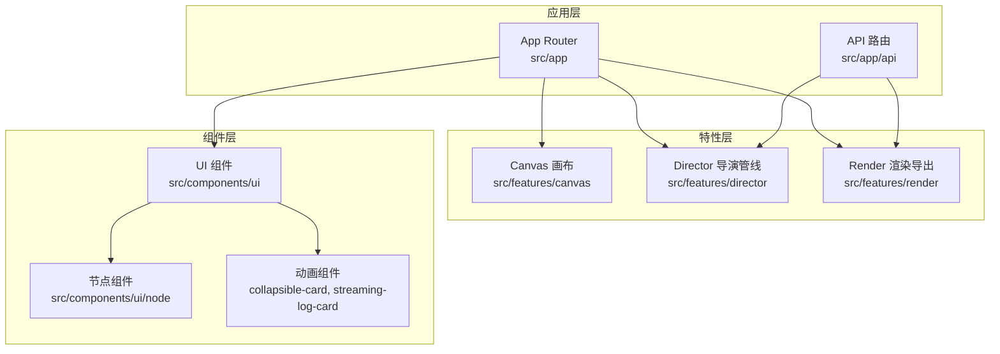
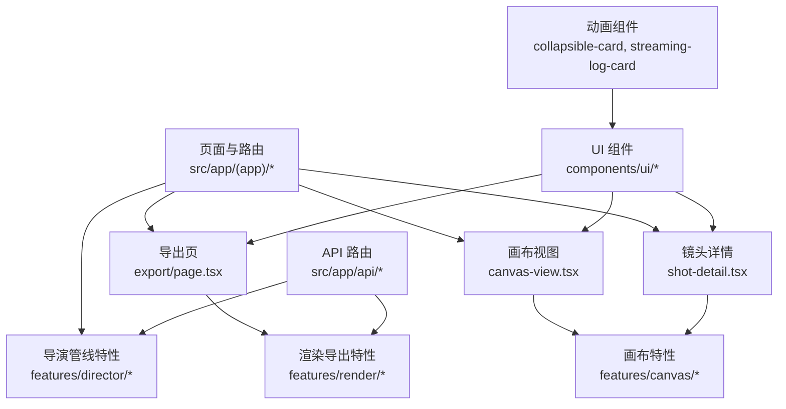
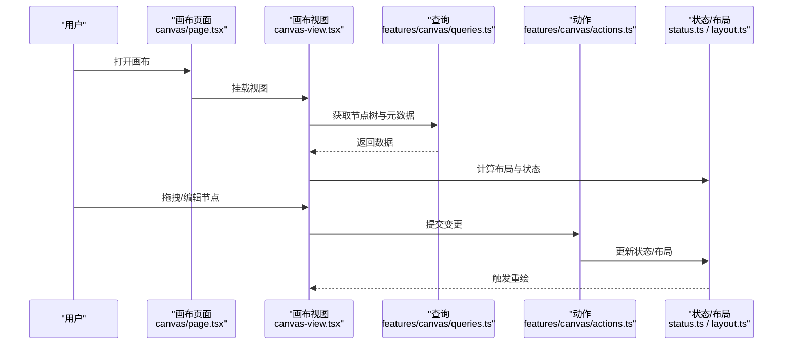
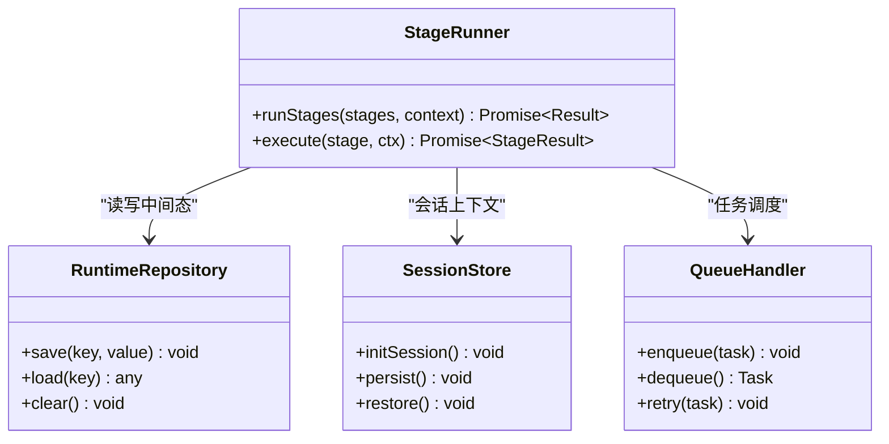
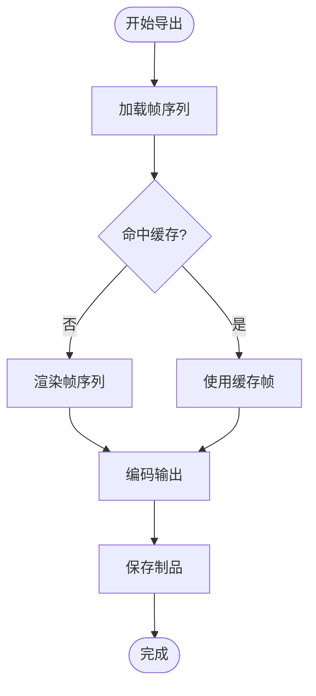
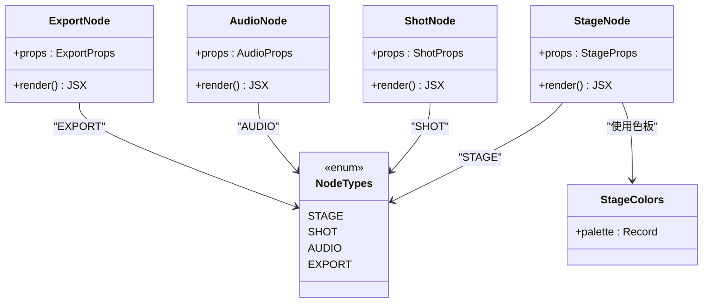
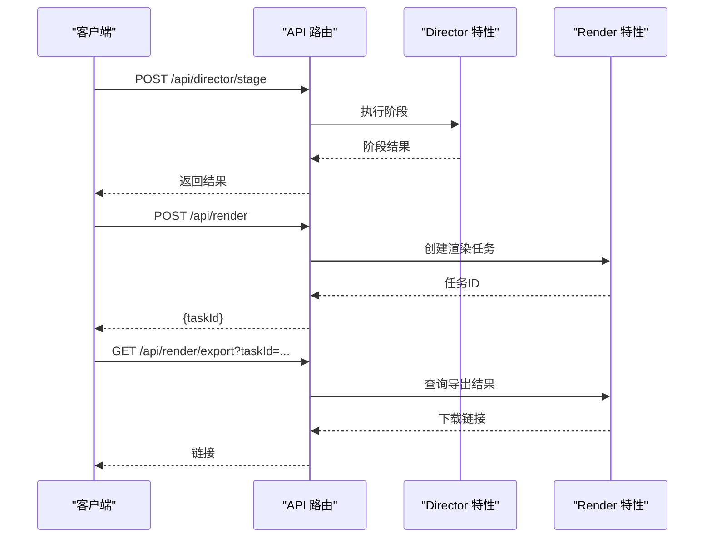
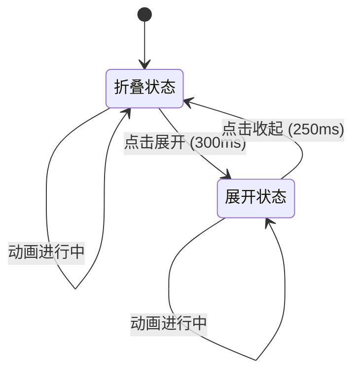
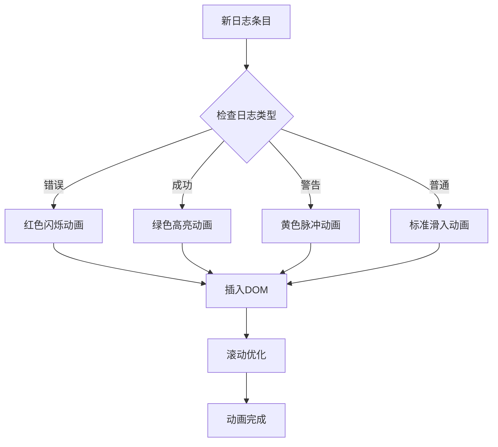
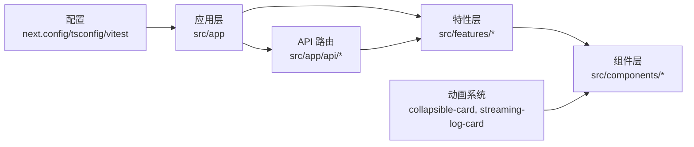

# 运动设计系统

<cite>
**本文引用的文件**   
- [README.md](file://README.md)
- [package.json](file://package.json)
- [next.config.ts](file://next.config.ts)
- [tsconfig.json](file://tsconfig.json)
- [drizzle.config.ts](file://drizzle.config.ts)
- [vitest.config.ts](file://vitest.config.ts)
- [src/app/layout.tsx](file://src/app/layout.tsx)
- [src/app/(app)/layout.tsx](file://src/app/(app)/layout.tsx)
- [src/app/(app)/template.tsx](file://src/app/(app)/template.tsx)
- [src/app/(app)/canvas/page.tsx](file://src/app/(app)/canvas/page.tsx)
- [src/app/(app)/canvas/canvas-view.tsx](file://src/app/(app)/canvas/canvas-view.tsx)
- [src/app/(app)/canvas/canvas-loader.tsx](file://src/app/(app)/canvas/canvas-loader.tsx)
- [src/app/(app)/canvas/canvas-inspector.tsx](file://src/app/(app)/canvas/canvas-inspector.tsx)
- [src/app/(app)/canvas/flow-elements.tsx](file://src/app/(app)/canvas/flow-elements.tsx)
- [src/app/(app)/canvas/export/page.tsx](file://src/app/(app)/canvas/export/page.tsx)
- [src/app/(app)/canvas/export/export-workspace.tsx](file://src/app/(app)/canvas/export/export-workspace.tsx)
- [src/app/(app)/canvas/export/export-api.ts](file://src/app/(app)/canvas/export/export-api.ts)
- [src/app/(app)/canvas/export/export-view-model.ts](file://src/app/(app)/canvas/export/export-view-model.ts)
- [src/app/(app)/canvas/shot/[id]/page.tsx](file://src/app/(app)/canvas/shot/[id]/page.tsx)
- [src/app/(app)/canvas/shot/[id]/shot-detail.tsx](file://src/app/(app)/canvas/shot/[id]/shot-detail.tsx)
- [src/app/(app)/canvas/shot/[id]/shot-panels.tsx](file://src/app/(app)/canvas/shot/[id]/shot-panels.tsx)
- [src/app/(app)/canvas/shot/[id]/shot-api.ts](file://src/app/(app)/canvas/shot/[id]/shot-api.ts)
- [src/app/(app)/canvas/canvas-action-api.ts](file://src/app/(app)/canvas/canvas-action-api.ts)
- [src/app/(app)/canvas/streaming-log-card.tsx](file://src/app/(app)/canvas/streaming-log-card.tsx)
- [src/features/canvas/index.ts](file://src/features/canvas/index.ts)
- [src/features/canvas/types.ts](file://src/features/canvas/types.ts)
- [src/features/canvas/actions.ts](file://src/features/canvas/actions.ts)
- [src/features/canvas/queries.ts](file://src/features/canvas/queries.ts)
- [src/features/canvas/status.ts](file://src/features/canvas/status.ts)
- [src/features/canvas/layout.ts](file://src/features/canvas/layout.ts)
- [src/features/canvas/fan-out.ts](file://src/features/canvas/fan-out.ts)
- [src/features/director/index.ts](file://src/features/director/index.ts)
- [src/features/director/pipeline.ts](file://src/features/director/pipeline.ts)
- [src/features/director/stage-runner.ts](file://src/features/director/stage-runner.ts)
- [src/features/director/stage-result.ts](file://src/features/director/stage-result.ts)
- [src/features/director/runtime-repository.ts](file://src/features/director/runtime-repository.ts)
- [src/features/director/session-store.ts](file://src/features/director/session-store.ts)
- [src/features/director/queue-handler.ts](file://src/features/director/queue-handler.ts)
- [src/features/render/renderer.ts](file://src/features/render/renderer.ts)
- [src/features/render/repository.ts](file://src/features/render/repository.ts)
- [src/features/render/cache.ts](file://src/features/render/cache.ts)
- [src/features/render/frame-sequence.ts](file://src/features/render/frame-sequence.ts)
- [src/features/render/encode.ts](file://src/features/render/encode.ts)
- [src/features/render/export-service.ts](file://src/features/render/export-service.ts)
- [src/components/ui/node/stage-node.tsx](file://src/components/ui/node/stage-node.tsx)
- [src/components/ui/node/shot-node.tsx](file://src/components/ui/node/shot-node.tsx)
- [src/components/ui/node/audio-node.tsx](file://src/components/ui/node/audio-node.tsx)
- [src/components/ui/node/export-node.tsx](file://src/components/ui/node/export-node.tsx)
- [src/components/ui/node/stage-colors.ts](file://src/components/ui/node/stage-colors.ts)
- [src/components/ui/node/types.ts](file://src/components/ui/node/types.ts)
- [src/components/ui/card.tsx](file://src/components/ui/card.tsx)
- [src/components/ui/collapsible-card.tsx](file://src/components/ui/collapsible-card.tsx)
- [src/app/api/artifacts/[id]/route.ts](file://src/app/api/artifacts/[id]/route.ts)
- [src/app/api/projects/route.ts](file://src/app/api/projects/route.ts)
- [src/app/api/render/route.ts](file://src/app/api/render/route.ts)
- [src/app/api/render/export/route.ts](file://src/app/api/render/export/route.ts)
- [src/app/api/jobs/[id]/route.ts](file://src/app/api/jobs/[id]/route.ts)
- [src/app/api/settings/route.ts](file://src/app/api/settings/route.ts)
- [src/app/api/director/stage/route.ts](file://src/app/api/director/stage/route.ts)
</cite>

## 更新摘要
**所做更改**   
- 新增了流式组件动画配置章节，重点介绍可折叠卡片过渡和日志条目动画
- 更新了UI组件部分，增加了collapsible-card组件的详细说明
- 新增了streaming-log-card组件的动画配置说明
- 完善了动画系统的架构描述和实现细节

## 目录
1. [简介](#简介)
2. [项目结构](#项目结构)
3. [核心组件](#核心组件)
4. [架构总览](#架构总览)
5. [详细组件分析](#详细组件分析)
6. [流式组件动画配置](#流式组件动画配置)
7. [依赖关系分析](#依赖关系分析)
8. [性能考量](#性能考量)
9. [故障排查指南](#故障排查指南)
10. [结论](#结论)
11. [附录](#附录)

## 简介
本项目是一个面向"运动设计"的前端工程，围绕时间轴、节点编排、镜头（Shot）与舞台（Stage）的可视化编辑、渲染导出以及导演式工作流（Director Pipeline）构建。系统采用 Next.js App Router 组织页面与 API，使用 features 分层将业务域解耦为 canvas（画布）、director（导演管线）、render（渲染导出）等模块，并通过 UI 组件库提供统一的交互体验。

**更新** 新增了对流式组件动画配置的全面支持，特别是可折叠卡片的平滑过渡效果和实时日志条目的动态展示。

## 项目结构
- 应用层：Next.js App Router 路由与页面，包含画布、导出、设置、播放列表等页面入口。
- 特性层：features 下按领域划分能力，如 canvas、director、render、audio、artifacts 等。
- 组件层：components/ui 提供通用 UI 与节点类型组件；components/icons 提供图标资源。
- API 层：app/api 暴露 RESTful 接口，对接后端或本地服务。
- 工具与配置：lib 提供通用工具、hooks、布局、队列、存储等；根目录包含构建与测试配置。

**图表来源**
- [src/app/layout.tsx:1-200](file://src/app/layout.tsx#L1-L200)
- [src/app/(app)/layout.tsx:1-200](file://src/app/(app)/layout.tsx#L1-L200)
- [src/features/canvas/index.ts:1-200](file://src/features/canvas/index.ts#L1-L200)
- [src/features/director/index.ts:1-200](file://src/features/director/index.ts#L1-L200)
- [src/features/render/index.ts:1-200](file://src/features/render/index.ts#L1-L200)
- [src/components/ui/node/types.ts:1-200](file://src/components/ui/node/types.ts#L1-L200)
- [src/components/ui/collapsible-card.tsx:1-200](file://src/components/ui/collapsible-card.tsx#L1-L200)
- [src/app/(app)/canvas/streaming-log-card.tsx:1-200](file://src/app/(app)/canvas/streaming-log-card.tsx#L1-L200)

## 核心组件
- 画布与镜头
  - 画布页面与视图：负责加载、展示与交互控制。
  - 镜头详情与面板：聚焦单个 Shot 的编辑与预览。
  - 动作与查询：封装对画布状态的操作与数据读取。
- 导演管线
  - 阶段运行器：驱动多阶段任务执行与结果聚合。
  - 运行时仓库与会话存储：管理中间态与持久化。
  - 队列处理器：协调异步任务与并发控制。
- 渲染导出
  - 渲染器：帧序列处理与编码输出。
  - 缓存与仓库：加速重复计算与数据存取。
  - 导出服务：对外提供导出任务与进度查询。
- UI 节点
  - Stage/Shot/Audio/Export 节点：在画布中可视化的可编排元素。
  - 颜色与类型定义：统一视觉与数据结构。
- **新增** 流式动画组件
  - 可折叠卡片：支持平滑展开/收起过渡效果。
  - 流式日志卡片：实时显示日志条目，带有入场动画。

**章节来源**
- [src/app/(app)/canvas/page.tsx:1-200](file://src/app/(app)/canvas/page.tsx#L1-L200)
- [src/app/(app)/canvas/canvas-view.tsx:1-200](file://src/app/(app)/canvas/canvas-view.tsx#L1-L200)
- [src/app/(app)/canvas/shot/[id]/shot-detail.tsx:1-200](file://src/app/(app)/canvas/shot/[id]/shot-detail.tsx#L1-L200)
- [src/features/canvas/actions.ts:1-200](file://src/features/canvas/actions.ts#L1-L200)
- [src/features/canvas/queries.ts:1-200](file://src/features/canvas/queries.ts#L1-L200)
- [src/features/director/stage-runner.ts:1-200](file://src/features/director/stage-runner.ts#L1-L200)
- [src/features/render/renderer.ts:1-200](file://src/features/render/renderer.ts#L1-L200)
- [src/components/ui/node/stage-node.tsx:1-200](file://src/components/ui/node/stage-node.tsx#L1-L200)
- [src/components/ui/collapsible-card.tsx:1-200](file://src/components/ui/collapsible-card.tsx#L1-L200)
- [src/app/(app)/canvas/streaming-log-card.tsx:1-200](file://src/app/(app)/canvas/streaming-log-card.tsx#L1-L200)

## 架构总览
系统以"页面/路由 -> 特性模块 -> 组件/工具"的分层方式组织，API 作为外部集成点，特性模块内部再细分为职责单一的小模块。

**图表来源**
- [src/app/(app)/canvas/page.tsx:1-200](file://src/app/(app)/canvas/page.tsx#L1-L200)
- [src/app/(app)/canvas/canvas-view.tsx:1-200](file://src/app/(app)/canvas/canvas-view.tsx#L1-L200)
- [src/app/(app)/canvas/shot/[id]/shot-detail.tsx:1-200](file://src/app/(app)/canvas/shot/[id]/shot-detail.tsx#L1-L200)
- [src/app/(app)/canvas/export/page.tsx:1-200](file://src/app/(app)/canvas/export/page.tsx#L1-L200)
- [src/features/canvas/index.ts:1-200](file://src/features/canvas/index.ts#L1-L200)
- [src/features/director/index.ts:1-200](file://src/features/director/index.ts#L1-L200)
- [src/features/render/index.ts:1-200](file://src/features/render/index.ts#L1-L200)
- [src/app/api/director/stage/route.ts:1-200](file://src/app/api/director/stage/route.ts#L1-L200)
- [src/app/api/render/route.ts:1-200](file://src/app/api/render/route.ts#L1-L200)
- [src/components/ui/collapsible-card.tsx:1-200](file://src/components/ui/collapsible-card.tsx#L1-L200)
- [src/app/(app)/canvas/streaming-log-card.tsx:1-200](file://src/app/(app)/canvas/streaming-log-card.tsx#L1-L200)

## 详细组件分析

### 画布与镜头
- 画布页面与视图
  - 负责初始化画布上下文、加载节点树、响应用户操作并更新状态。
  - 通过 loader 与 inspector 辅助提升加载体验与调试能力。
- 镜头详情与面板
  - 针对单个 Shot 的编辑界面，提供属性面板、预览与关键帧编辑。
  - 通过 shot-api 与后端同步数据。
- 动作与查询
  - actions 封装增删改查与批量操作；queries 提供只读数据访问。
  - status 与 layout 提供状态机与布局算法支持。

**图表来源**
- [src/app/(app)/canvas/page.tsx:1-200](file://src/app/(app)/canvas/page.tsx#L1-L200)
- [src/app/(app)/canvas/canvas-view.tsx:1-200](file://src/app/(app)/canvas/canvas-view.tsx#L1-L200)
- [src/features/canvas/queries.ts:1-200](file://src/features/canvas/queries.ts#L1-L200)
- [src/features/canvas/actions.ts:1-200](file://src/features/canvas/actions.ts#L1-L200)
- [src/features/canvas/status.ts:1-200](file://src/features/canvas/status.ts#L1-L200)
- [src/features/canvas/layout.ts:1-200](file://src/features/canvas/layout.ts#L1-L200)

**章节来源**
- [src/app/(app)/canvas/page.tsx:1-200](file://src/app/(app)/canvas/page.tsx#L1-L200)
- [src/app/(app)/canvas/canvas-view.tsx:1-200](file://src/app/(app)/canvas/canvas-view.tsx#L1-L200)
- [src/app/(app)/canvas/canvas-loader.tsx:1-200](file://src/app/(app)/canvas/canvas-loader.tsx#L1-L200)
- [src/app/(app)/canvas/canvas-inspector.tsx:1-200](file://src/app/(app)/canvas/canvas-inspector.tsx#L1-L200)
- [src/app/(app)/canvas/flow-elements.tsx:1-200](file://src/app/(app)/canvas/flow-elements.tsx#L1-L200)
- [src/app/(app)/canvas/shot/[id]/page.tsx:1-200](file://src/app/(app)/canvas/shot/[id]/page.tsx#L1-L200)
- [src/app/(app)/canvas/shot/[id]/shot-detail.tsx:1-200](file://src/app/(app)/canvas/shot/[id]/shot-detail.tsx#L1-L200)
- [src/app/(app)/canvas/shot/[id]/shot-panels.tsx:1-200](file://src/app/(app)/canvas/shot/[id]/shot-panels.tsx#L1-L200)
- [src/app/(app)/canvas/shot/[id]/shot-api.ts:1-200](file://src/app/(app)/canvas/shot/[id]/shot-api.ts#L1-L200)
- [src/app/(app)/canvas/canvas-action-api.ts:1-200](file://src/app/(app)/canvas/canvas-action-api.ts#L1-L200)
- [src/features/canvas/index.ts:1-200](file://src/features/canvas/index.ts#L1-L200)
- [src/features/canvas/types.ts:1-200](file://src/features/canvas/types.ts#L1-L200)
- [src/features/canvas/actions.ts:1-200](file://src/features/canvas/actions.ts#L1-L200)
- [src/features/canvas/queries.ts:1-200](file://src/features/canvas/queries.ts#L1-L200)
- [src/features/canvas/status.ts:1-200](file://src/features/canvas/status.ts#L1-L200)
- [src/features/canvas/layout.ts:1-200](file://src/features/canvas/layout.ts#L1-L200)
- [src/features/canvas/fan-out.ts:1-200](file://src/features/canvas/fan-out.ts#L1-L200)

### 导演管线（Director）
- 阶段运行器
  - 负责顺序/并行执行多个阶段（ingest、assemble、fabricate、finalize 等），聚合阶段结果。
- 运行时仓库与会话存储
  - 保存中间产物与上下文，支持断点续跑与幂等性。
- 队列处理器
  - 管理任务入队、出队与重试策略，保证稳定性。

**图表来源**
- [src/features/director/stage-runner.ts:1-200](file://src/features/director/stage-runner.ts#L1-L200)
- [src/features/director/runtime-repository.ts:1-200](file://src/features/director/runtime-repository.ts#L1-L200)
- [src/features/director/session-store.ts:1-200](file://src/features/director/session-store.ts#L1-L200)
- [src/features/director/queue-handler.ts:1-200](file://src/features/director/queue-handler.ts#L1-L200)

**章节来源**
- [src/features/director/index.ts:1-200](file://src/features/director/index.ts#L1-L200)
- [src/features/director/pipeline.ts:1-200](file://src/features/director/pipeline.ts#L1-L200)
- [src/features/director/stage-runner.ts:1-200](file://src/features/director/stage-runner.ts#L1-L200)
- [src/features/director/stage-result.ts:1-200](file://src/features/director/stage-result.ts#L1-L200)
- [src/features/director/runtime-repository.ts:1-200](file://src/features/director/runtime-repository.ts#L1-L200)
- [src/features/director/session-store.ts:1-200](file://src/features/director/session-store.ts#L1-L200)
- [src/features/director/queue-handler.ts:1-200](file://src/features/director/queue-handler.ts#L1-L200)

### 渲染与导出
- 渲染器
  - 基于帧序列进行合成与编码，支持多种输出格式。
- 缓存与仓库
  - 缓存已计算的帧或片段，减少重复计算；仓库负责持久化与检索。
- 导出服务
  - 提供导出任务的创建、进度查询与结果下载。

**图表来源**
- [src/features/render/renderer.ts:1-200](file://src/features/render/renderer.ts#L1-L200)
- [src/features/render/cache.ts:1-200](file://src/features/render/cache.ts#L1-L200)
- [src/features/render/repository.ts:1-200](file://src/features/render/repository.ts#L1-L200)
- [src/features/render/frame-sequence.ts:1-200](file://src/features/render/frame-sequence.ts#L1-L200)
- [src/features/render/encode.ts:1-200](file://src/features/render/encode.ts#L1-L200)
- [src/features/render/export-service.ts:1-200](file://src/features/render/export-service.ts#L1-L200)

**章节来源**
- [src/app/(app)/canvas/export/page.tsx:1-200](file://src/app/(app)/canvas/export/page.tsx#L1-L200)
- [src/app/(app)/canvas/export/export-workspace.tsx:1-200](file://src/app/(app)/canvas/export/export-workspace.tsx#L1-L200)
- [src/app/(app)/canvas/export/export-api.ts:1-200](file://src/app/(app)/canvas/export/export-api.ts#L1-L200)
- [src/app/(app)/canvas/export/export-view-model.ts:1-200](file://src/app/(app)/canvas/export/export-view-model.ts#L1-L200)
- [src/features/render/renderer.ts:1-200](file://src/features/render/renderer.ts#L1-L200)
- [src/features/render/repository.ts:1-200](file://src/features/render/repository.ts#L1-L200)
- [src/features/render/cache.ts:1-200](file://src/features/render/cache.ts#L1-L200)
- [src/features/render/frame-sequence.ts:1-200](file://src/features/render/frame-sequence.ts#L1-L200)
- [src/features/render/encode.ts:1-200](file://src/features/render/encode.ts#L1-L200)
- [src/features/render/export-service.ts:1-200](file://src/features/render/export-service.ts#L1-L200)

### UI 节点组件
- 节点类型
  - Stage：舞台容器，承载子节点与全局样式。
  - Shot：镜头单元，包含媒体与动画参数。
  - Audio：音频轨道与音量控制。
  - Export：导出目标与参数配置。
- 颜色与类型
  - stage-colors 提供主题色板；types 定义节点数据结构。

**图表来源**
- [src/components/ui/node/types.ts:1-200](file://src/components/ui/node/types.ts#L1-L200)
- [src/components/ui/node/stage-node.tsx:1-200](file://src/components/ui/node/stage-node.tsx#L1-L200)
- [src/components/ui/node/shot-node.tsx:1-200](file://src/components/ui/node/shot-node.tsx#L1-L200)
- [src/components/ui/node/audio-node.tsx:1-200](file://src/components/ui/node/audio-node.tsx#L1-L200)
- [src/components/ui/node/export-node.tsx:1-200](file://src/components/ui/node/export-node.tsx#L1-L200)
- [src/components/ui/node/stage-colors.ts:1-200](file://src/components/ui/node/stage-colors.ts#L1-L200)

**章节来源**
- [src/components/ui/node/types.ts:1-200](file://src/components/ui/node/types.ts#L1-L200)
- [src/components/ui/node/stage-node.tsx:1-200](file://src/components/ui/node/stage-node.tsx#L1-L200)
- [src/components/ui/node/shot-node.tsx:1-200](file://src/components/ui/node/shot-node.tsx#L1-L200)
- [src/components/ui/node/audio-node.tsx:1-200](file://src/components/ui/node/audio-node.tsx#L1-L200)
- [src/components/ui/node/export-node.tsx:1-200](file://src/components/ui/node/export-node.tsx#L1-L200)
- [src/components/ui/node/stage-colors.ts:1-200](file://src/components/ui/node/stage-colors.ts#L1-L200)

### API 集成
- 导演阶段路由：接收阶段执行请求，调用 director 特性模块。
- 渲染与导出路由：创建渲染任务、查询进度、下载制品。
- 项目与设置路由：管理项目元数据与应用设置。

**图表来源**
- [src/app/api/director/stage/route.ts:1-200](file://src/app/api/director/stage/route.ts#L1-L200)
- [src/app/api/render/route.ts:1-200](file://src/app/api/render/route.ts#L1-L200)
- [src/app/api/render/export/route.ts:1-200](file://src/app/api/render/export/route.ts#L1-L200)
- [src/app/api/artifacts/[id]/route.ts:1-200](file://src/app/api/artifacts/[id]/route.ts#L1-L200)
- [src/app/api/projects/route.ts:1-200](file://src/app/api/projects/route.ts#L1-L200)
- [src/app/api/jobs/[id]/route.ts:1-200](file://src/app/api/jobs/[id]/route.ts#L1-L200)
- [src/app/api/settings/route.ts:1-200](file://src/app/api/settings/route.ts#L1-L200)

**章节来源**
- [src/app/api/director/stage/route.ts:1-200](file://src/app/api/director/stage/route.ts#L1-L200)
- [src/app/api/render/route.ts:1-200](file://src/app/api/render/route.ts#L1-L200)
- [src/app/api/render/export/route.ts:1-200](file://src/app/api/render/export/route.ts#L1-L200)
- [src/app/api/artifacts/[id]/route.ts:1-200](file://src/app/api/artifacts/[id]/route.ts#L1-L200)
- [src/app/api/projects/route.ts:1-200](file://src/app/api/projects/route.ts#L1-L200)
- [src/app/api/jobs/[id]/route.ts:1-200](file://src/app/api/jobs/[id]/route.ts#L1-L200)
- [src/app/api/settings/route.ts:1-200](file://src/app/api/settings/route.ts#L1-L200)

## 流式组件动画配置

### 可折叠卡片动画
可折叠卡片组件提供了平滑的展开/收起过渡效果，支持多种动画配置选项：

- **基础配置**
  - 展开/收起动画时长：默认 300ms
  - 缓动函数：使用 easeInOut 曲线
  - 高度过渡：从 0 到自动高度的平滑过渡
- **高级选项**
  - 延迟动画：支持延迟启动
  - 反向动画：收起时不同的动画曲线
  - 事件回调：展开/收起完成时的回调函数

**图表来源**
- [src/components/ui/collapsible-card.tsx:1-200](file://src/components/ui/collapsible-card.tsx#L1-L200)

### 流式日志卡片动画
流式日志卡片组件专门用于实时显示日志条目，具有以下动画特性：

- **条目入场动画**
  - 新日志条目从底部滑入
  - 淡入效果配合位移动画
  - 支持批量条目的交错动画
- **状态指示动画**
  - 错误条目红色闪烁效果
  - 成功条目绿色高亮
  - 警告条目黄色脉冲
- **滚动优化**
  - 虚拟滚动支持大量日志
  - 智能预加载机制
  - 内存占用优化

**图表来源**
- [src/app/(app)/canvas/streaming-log-card.tsx:1-200](file://src/app/(app)/canvas/streaming-log-card.tsx#L1-L200)

### 动画性能优化
为确保流畅的用户体验，动画系统采用了多项性能优化策略：

- **硬件加速**
  - 使用 CSS transform 和 opacity 属性
  - 启用 GPU 加速渲染
  - 避免强制同步布局
- **内存管理**
  - 及时清理动画定时器
  - 释放不再使用的动画对象
  - 防止内存泄漏
- **响应式设计**
  - 根据设备性能调整动画质量
  - 移动端简化复杂动画
  - 支持 prefers-reduced-motion 偏好

**章节来源**
- [src/components/ui/collapsible-card.tsx:1-200](file://src/components/ui/collapsible-card.tsx#L1-L200)
- [src/app/(app)/canvas/streaming-log-card.tsx:1-200](file://src/app/(app)/canvas/streaming-log-card.tsx#L1-L200)
- [src/components/ui/card.tsx:1-200](file://src/components/ui/card.tsx#L1-L200)

## 依赖关系分析
- 耦合与内聚
  - 特性模块之间通过明确的接口与类型定义交互，降低耦合度。
  - UI 组件与业务逻辑分离，便于复用与测试。
- 外部依赖
  - Next.js 提供路由与服务端渲染能力。
  - 数据库与对象存储通过 drizzle 与存储服务抽象。
  - 测试框架 vitest 覆盖核心逻辑。

**图表来源**
- [next.config.ts:1-200](file://next.config.ts#L1-L200)
- [tsconfig.json:1-200](file://tsconfig.json#L1-L200)
- [vitest.config.ts:1-200](file://vitest.config.ts#L1-L200)
- [drizzle.config.ts:1-200](file://drizzle.config.ts#L1-L200)
- [src/components/ui/collapsible-card.tsx:1-200](file://src/components/ui/collapsible-card.tsx#L1-L200)
- [src/app/(app)/canvas/streaming-log-card.tsx:1-200](file://src/app/(app)/canvas/streaming-log-card.tsx#L1-L200)

**章节来源**
- [package.json:1-200](file://package.json#L1-L200)
- [next.config.ts:1-200](file://next.config.ts#L1-L200)
- [tsconfig.json:1-200](file://tsconfig.json#L1-L200)
- [drizzle.config.ts:1-200](file://drizzle.config.ts#L1-L200)
- [vitest.config.ts:1-200](file://vitest.config.ts#L1-L200)

## 性能考量
- 渲染优化
  - 利用缓存避免重复计算帧与片段。
  - 分块加载与懒加载大型资源（媒体、模型）。
- 并发与队列
  - 合理设置队列并发度，避免阻塞主线程。
  - 失败重试与退避策略保障稳定性。
- 内存与网络
  - 及时释放大对象引用，避免内存泄漏。
  - 压缩传输与增量更新减少带宽占用。
- **新增** 动画性能
  - 使用硬件加速优化动画渲染。
  - 实现虚拟滚动处理大量日志条目。
  - 支持响应式动画质量调整。

## 故障排查指南
- 常见问题定位
  - 画布不显示：检查节点树加载与布局计算是否成功。
  - 导出失败：确认渲染器输入有效性与编码参数。
  - 阶段执行中断：查看队列处理器日志与重试次数。
- 调试建议
  - 使用 inspector 查看当前状态与中间产物。
  - 开启详细日志，记录关键路径的输入输出。
  - 使用单元测试与集成测试复现问题场景。
- **新增** 动画问题排查
  - 检查浏览器控制台是否有动画相关错误。
  - 验证动画配置参数是否在有效范围内。
  - 使用浏览器开发者工具的性能面板分析动画性能。

**章节来源**
- [src/app/(app)/canvas/canvas-inspector.tsx:1-200](file://src/app/(app)/canvas/canvas-inspector.tsx#L1-L200)
- [src/features/director/queue-handler.ts:1-200](file://src/features/director/queue-handler.ts#L1-L200)
- [src/features/render/export-service.ts:1-200](file://src/features/render/export-service.ts#L1-L200)
- [src/components/ui/collapsible-card.tsx:1-200](file://src/components/ui/collapsible-card.tsx#L1-L200)
- [src/app/(app)/canvas/streaming-log-card.tsx:1-200](file://src/app/(app)/canvas/streaming-log-card.tsx#L1-L200)

## 结论
本系统通过清晰的分层与模块化设计，实现了从画布编辑到渲染导出的完整流程。特性层将复杂业务解耦，UI 组件提供一致的交互体验，API 层则作为稳定的集成边界。**新增的流式组件动画配置进一步提升了用户体验，特别是可折叠卡片的平滑过渡和日志条目的动态展示功能**。建议在后续迭代中持续完善错误处理、监控与性能指标，以提升系统的可靠性与可维护性。

## 附录
- 术语表
  - 镜头（Shot）：最小可编辑的动画单元。
  - 舞台（Stage）：容纳多个镜头的容器。
  - 导演管线（Director Pipeline）：多阶段自动化工作流。
  - 渲染导出：将时间轴内容合成为视频或图像序列。
  - **新增** 流式动画：实时更新的动态视觉效果。
  - **新增** 可折叠卡片：支持平滑展开/收起的交互式组件。
  - **新增** 日志条目动画：新日志项的入场和状态指示效果。