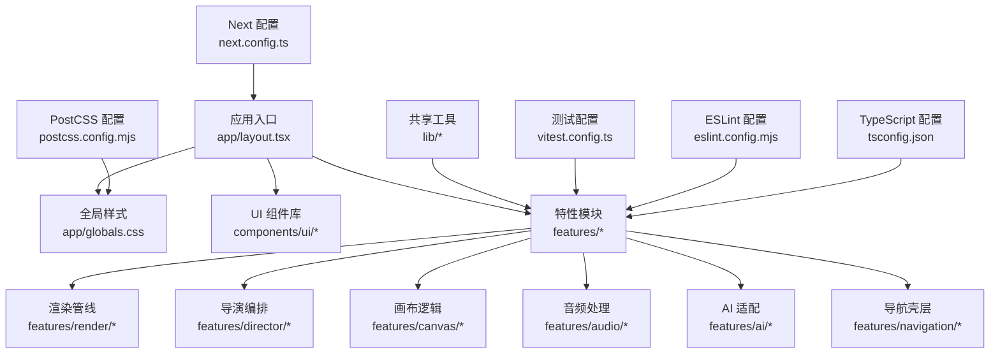
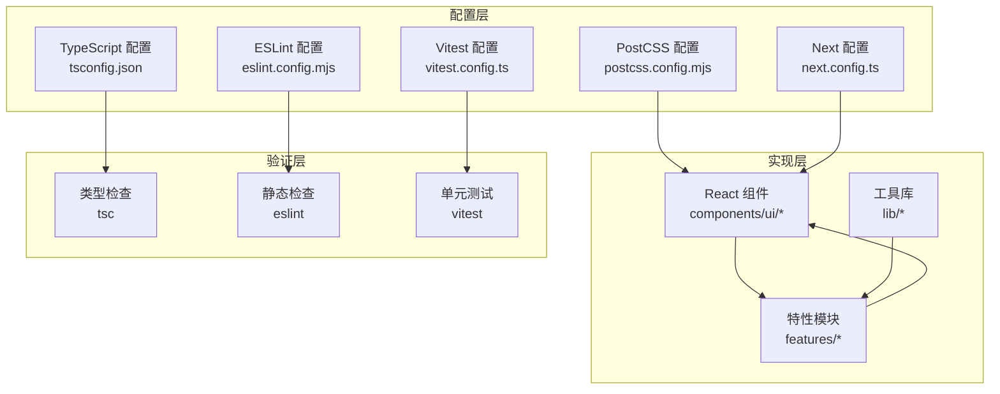
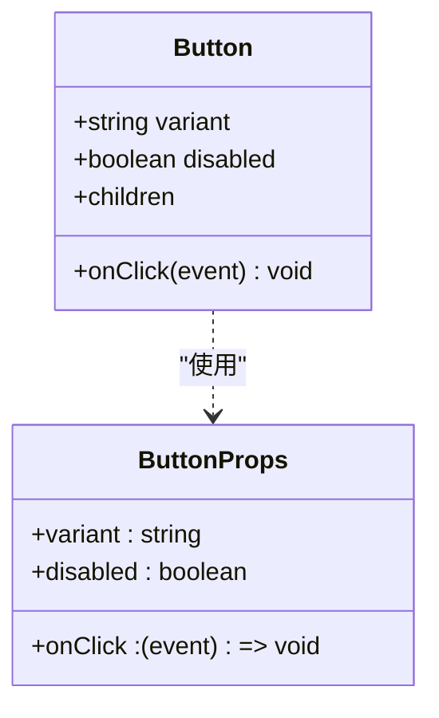
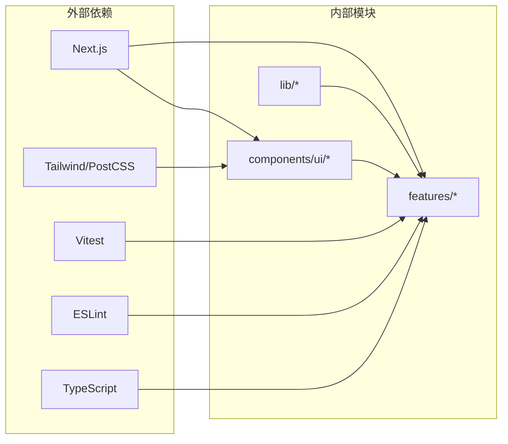

# 代码规范

<cite>
**本文引用的文件**   
- [eslint.config.mjs](file://eslint.config.mjs)
- [tsconfig.json](file://tsconfig.json)
- [next.config.ts](file://next.config.ts)
- [postcss.config.mjs](file://postcss.config.mjs)
- [vitest.config.ts](file://vitest.config.ts)
- [package.json](file://package.json)
- [src/app/globals.css](file://src/app/globals.css)
- [src/components/ui/button.tsx](file://src/components/ui/button.tsx)
- [src/features/canvas/types.ts](file://src/features/canvas/types.ts)
- [src/features/canvas/schemas.ts](file://src/features/canvas/schemas.ts)
- [src/features/director/stage-runner.ts](file://src/features/director/stage-runner.ts)
- [src/features/render/renderer.ts](file://src/features/render/renderer.ts)
- [src/lib/utils.ts](file://src/lib/utils.ts)
- [docs/conventions/git-workflow.md](file://docs/conventions/git-workflow.md)
</cite>

## 目录
1. [简介](#简介)
2. [项目结构](#项目结构)
3. [核心组件](#核心组件)
4. [架构总览](#架构总览)
5. [详细组件分析](#详细组件分析)
6. [依赖分析](#依赖分析)
7. [性能考虑](#性能考虑)
8. [故障排查指南](#故障排查指南)
9. [结论](#结论)
10. [附录](#附录)

## 简介
本规范面向 CodeVideoCanvas 项目的开发与维护，覆盖以下方面：
- ESLint 规则配置与自定义规则含义
- TypeScript 编码约定（类型定义、接口设计、泛型使用）
- React 组件开发规范（命名约定、文件组织、Props 设计）
- CSS/Tailwind CSS 使用规范（样式组织、主题变量使用）
- 代码格式化与编辑器配置建议
- Git 提交信息与分支管理约定

目标是在保证一致性与可维护性的同时，提升团队协作效率与交付质量。

## 项目结构
本项目采用 Next.js App Router 与功能域分层组织方式：
- app：页面路由、API 路由、全局布局与样式
- components：通用 UI 组件与图标
- features：按业务域划分的特性模块（如 canvas、director、render、audio、artifacts、ai、navigation）
- lib：跨领域工具库（hooks、utils、storage、queue、layout、determinism、gsap、db、config）
- scripts：构建/部署/迁移脚本
- docs：工程文档与规范

图表来源
- [next.config.ts](file://next.config.ts)
- [postcss.config.mjs](file://postcss.config.mjs)
- [vitest.config.ts](file://vitest.config.ts)
- [eslint.config.mjs](file://eslint.config.mjs)
- [tsconfig.json](file://tsconfig.json)
- [src/app/globals.css](file://src/app/globals.css)

章节来源
- [next.config.ts](file://next.config.ts)
- [postcss.config.mjs](file://postcss.config.mjs)
- [vitest.config.ts](file://vitest.config.ts)
- [eslint.config.mjs](file://eslint.config.mjs)
- [tsconfig.json](file://tsconfig.json)
- [src/app/globals.css](file://src/app/globals.css)

## 核心组件
本节聚焦于与“代码规范”直接相关的核心配置文件与约定点：
- ESLint 配置：集中式规则与插件集成
- TypeScript 配置：严格模式、路径映射、模块解析
- PostCSS/Tailwind：样式预处理与原子化样式策略
- 测试框架：Vitest 统一测试行为
- Next.js 配置：运行时与构建期约束

章节来源
- [eslint.config.mjs](file://eslint.config.mjs)
- [tsconfig.json](file://tsconfig.json)
- [postcss.config.mjs](file://postcss.config.mjs)
- [vitest.config.ts](file://vitest.config.ts)
- [next.config.ts](file://next.config.ts)

## 架构总览
从“规范落地”的角度，系统由“配置层 + 实现层 + 验证层”构成：
- 配置层：ESLint、TS、PostCSS、Next、Vitest
- 实现层：React 组件、特性模块、工具库
- 验证层：单元测试、集成测试、端到端测试（如有）

图表来源
- [eslint.config.mjs](file://eslint.config.mjs)
- [tsconfig.json](file://tsconfig.json)
- [postcss.config.mjs](file://postcss.config.mjs)
- [next.config.ts](file://next.config.ts)
- [vitest.config.ts](file://vitest.config.ts)

## 详细组件分析

### ESLint 规则与自定义规则
- 规则组织
  - 使用集中式配置，避免分散的 .eslintrc.* 文件
  - 将团队通用规则与项目特定规则分离，便于复用与维护
- 关键规则类别
  - 语言基础：禁止未使用变量、强制分号/引号风格、缩进与换行一致性
  - React 生态：JSX 语法、Hooks 调用顺序、组件导出与命名
  - 类型安全：与 TypeScript 联动的规则，确保类型推断与运行时代码一致
  - 导入排序：统一 import 顺序，减少 diff 噪音
  - 错误预防：禁止 console、限制 any、要求错误边界处理
- 自定义规则建议
  - 针对项目特有模式（如 feature 目录结构、API 路由命名）编写自定义规则或插件
  - 通过 ESLint 的 flat config 机制扩展规则集，保持可读性

章节来源
- [eslint.config.mjs](file://eslint.config.mjs)

### TypeScript 编码约定
- 编译选项
  - 启用严格模式，关闭宽松类型转换
  - 明确模块解析策略与路径映射，提高可读性与可维护性
- 类型定义
  - 优先使用 interface 描述对象形状；type 用于联合/交叉/计算类型
  - 为外部数据模型提供显式类型，避免隐式 any
- 泛型使用
  - 在可复用的函数/组件中引入泛型参数，增强类型表达力
  - 为泛型提供默认值与约束，降低调用方心智负担
- 错误处理
  - 使用 Result/Either 等模式替代异常抛出，保证类型安全
  - 对 API 响应进行结构化校验（结合 Zod 等方案）

章节来源
- [tsconfig.json](file://tsconfig.json)
- [src/features/canvas/types.ts](file://src/features/canvas/types.ts)
- [src/features/canvas/schemas.ts](file://src/features/canvas/schemas.ts)

### React 组件开发规范
- 命名约定
  - 组件文件名使用 PascalCase，导出默认组件
  - Props 接口以 ComponentNameProps 命名
- 文件组织
  - 每个组件一个文件，必要时附带 demo 与测试文件
  - 将演示文件命名为 component.demo.tsx，便于 Storybook 或本地预览
- Props 设计
  - 使用 TypeScript 接口声明 Props，避免解构丢失类型信息
  - 为可选属性提供默认值，保持组件健壮性
- 副作用与状态
  - 使用受控与非受控两种模式时保持一致的 API 设计
  - 复杂状态抽取到自定义 Hook，保持组件职责单一

图表来源
- [src/components/ui/button.tsx](file://src/components/ui/button.tsx)

章节来源
- [src/components/ui/button.tsx](file://src/components/ui/button.tsx)

### CSS/Tailwind CSS 使用规范
- 样式组织
  - 全局样式集中在 app/globals.css，组件级样式使用 Tailwind 原子类
  - 避免在组件内写大量内联样式，保持声明式与可维护性
- 主题变量
  - 使用 CSS 变量或 Tailwind 主题扩展来管理颜色、字号、间距
  - 将设计令牌（Design Tokens）抽象为变量，便于多主题切换
- 响应式与可访问性
  - 使用 Tailwind 断点实现响应式布局
  - 遵循对比度与键盘可达性要求

章节来源
- [src/app/globals.css](file://src/app/globals.css)
- [postcss.config.mjs](file://postcss.config.mjs)

### 代码格式化与编辑器配置
- 格式化器
  - 统一使用 Prettier 进行代码格式化，配合 ESLint 规则避免冲突
- 编辑器设置
  - VSCode 推荐安装 ESLint、Prettier、TypeScript 相关扩展
  - 保存时自动格式化与修复，减少人工差异
- 脚本命令
  - 在 package.json 中定义 lint、format、typecheck、test 等命令，统一团队工作流

章节来源
- [package.json](file://package.json)

### Git 提交信息与分支管理约定
- 提交信息
  - 使用约定式提交（Conventional Commits），包含 type、scope、subject
  - 示例类型：feat、fix、docs、style、refactor、test、chore
- 分支管理
  - 主分支保护，功能分支基于 main 创建，合并前需通过 CI
  - 发布分支与热修复分支遵循语义化版本控制
- 变更审查
  - Pull Request 需包含变更说明、影响范围、测试用例

章节来源
- [docs/conventions/git-workflow.md](file://docs/conventions/git-workflow.md)

## 依赖分析
- 内部依赖
  - features 模块之间通过 lib 工具库解耦，避免循环依赖
  - components 作为纯展示层，不直接依赖业务逻辑
- 外部依赖
  - Next.js 提供路由、SSR/CSR 能力
  - Tailwind/PostCSS 负责样式处理
  - Vitest 提供统一的测试执行环境
  - ESLint/TS 保障代码质量与类型安全

图表来源
- [next.config.ts](file://next.config.ts)
- [postcss.config.mjs](file://postcss.config.mjs)
- [vitest.config.ts](file://vitest.config.ts)
- [eslint.config.mjs](file://eslint.config.mjs)
- [tsconfig.json](file://tsconfig.json)

章节来源
- [next.config.ts](file://next.config.ts)
- [postcss.config.mjs](file://postcss.config.mjs)
- [vitest.config.ts](file://vitest.config.ts)
- [eslint.config.mjs](file://eslint.config.mjs)
- [tsconfig.json](file://tsconfig.json)

## 性能考虑
- 类型检查与构建
  - 合理配置 tsconfig 的 incremental 与 noEmitOnError，缩短反馈时间
- 组件渲染
  - 使用 React.memo、useMemo、useCallback 优化重渲染
  - 大列表虚拟化与懒加载
- 资源加载
  - 图片与媒体按需加载，使用 Next/Image 优化
- 网络请求
  - 缓存策略与去抖/节流，避免重复请求

[本节为通用指导，无需具体文件引用]

## 故障排查指南
- 类型错误
  - 定位 to-be-any 与 unknown 的使用，补充缺失类型
  - 检查泛型约束是否过宽或过严
- 运行时错误
  - 在特性模块中使用结构化错误处理，记录上下文信息
  - 对异步任务（渲染、导出）增加重试与超时控制
- 测试失败
  - 使用 Vitest 的 mock 与 fixture 隔离外部依赖
  - 关注断言消息，快速定位失败原因

章节来源
- [src/features/director/stage-runner.ts](file://src/features/director/stage-runner.ts)
- [src/features/render/renderer.ts](file://src/features/render/renderer.ts)
- [src/lib/utils.ts](file://src/lib/utils.ts)

## 结论
通过统一的 ESLint/TS/样式/测试/提交规范，CodeVideoCanvas 能够在规模化协作中保持高质量与高一致性。建议在持续演进中定期回顾并更新规范，确保与业务与技术栈同步。

## 附录
- 常用命令
  - 类型检查：见 package.json
  - 代码检查：见 package.json
  - 格式化：见 package.json
  - 测试：见 package.json
- 参考文档
  - 工作流与分支管理：见 docs/conventions/git-workflow.md

章节来源
- [package.json](file://package.json)
- [docs/conventions/git-workflow.md](file://docs/conventions/git-workflow.md)