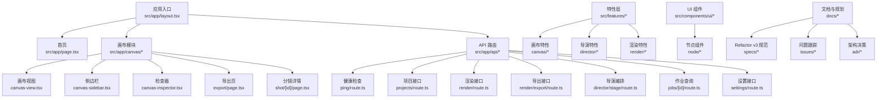
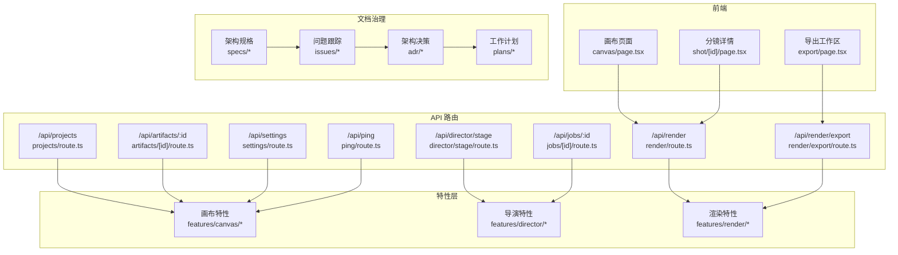
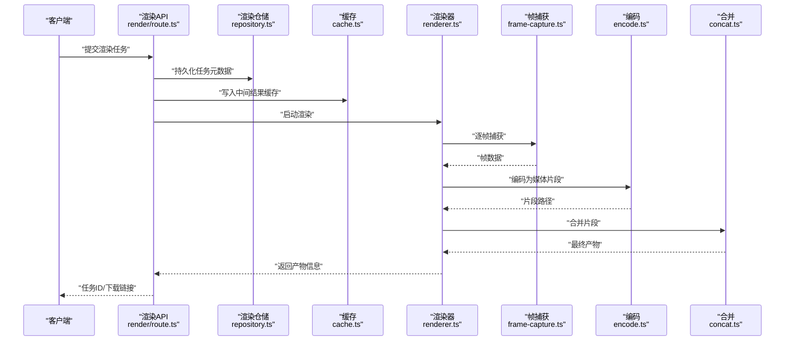
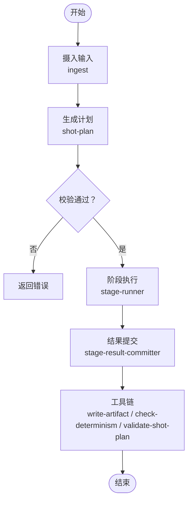
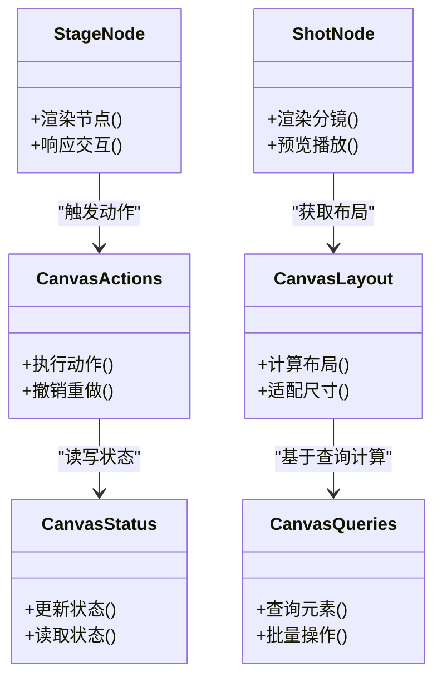
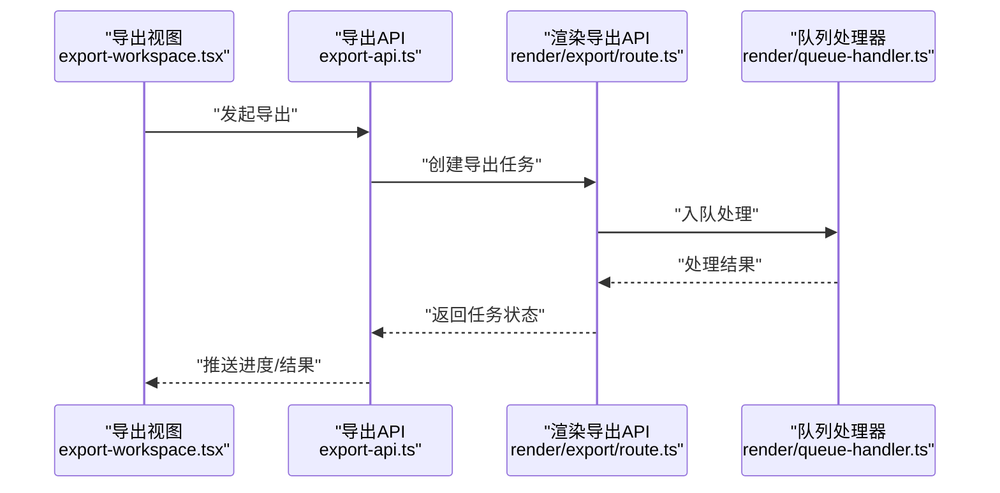
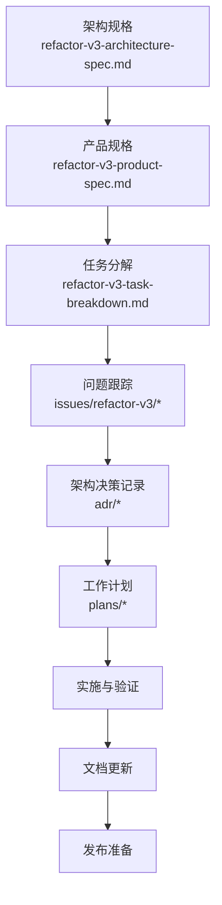
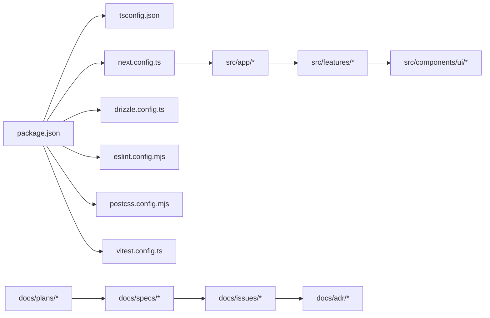

# 开发指南

<cite>
**本文引用的文件**   
- [README.md](file://README.md)
- [package.json](file://package.json)
- [tsconfig.json](file://tsconfig.json)
- [next.config.ts](file://next.config.ts)
- [drizzle.config.ts](file://drizzle.config.ts)
- [eslint.config.mjs](file://eslint.config.mjs)
- [postcss.config.mjs](file://postcss.config.mjs)
- [vitest.config.ts](file://vitest.config.ts)
- [scripts/README.md](file://scripts/README.md)
- [scripts/dev/README.md](file://scripts/dev/README.md)
- [scripts/setup/README.md](file://scripts/setup/README.md)
- [scripts/deploy/README.md](file://scripts/deploy/README.md)
- [src/app/layout.tsx](file://src/app/layout.tsx)
- [src/app/page.tsx](file://src/app/page.tsx)
- [src/app/canvas/page.tsx](file://src/app/canvas/page.tsx)
- [src/app/canvas/layout.tsx](file://src/app/canvas/layout.tsx)
- [src/app/canvas/canvas-view.tsx](file://src/app/canvas/canvas-view.tsx)
- [src/app/canvas/canvas-sidebar.tsx](file://src/app/canvas/canvas-sidebar.tsx)
- [src/app/canvas/canvas-inspector.tsx](file://src/app/canvas/canvas-inspector.tsx)
- [src/app/canvas/export/page.tsx](file://src/app/canvas/export/page.tsx)
- [src/app/canvas/export/export-api.ts](file://src/app/canvas/export/export-api.ts)
- [src/app/canvas/export/export-workspace.tsx](file://src/app/canvas/export/export-workspace.tsx)
- [src/app/canvas/shot/[id]/page.tsx](file://src/app/canvas/shot/[id]/page.tsx)
- [src/app/canvas/shot/[id]/shot-detail.tsx](file://src/app/canvas/shot/[id]/shot-detail.tsx)
- [src/app/canvas/shot/[id]/shot-panels.tsx](file://src/app/canvas/shot/[id]/shot-panels.tsx)
- [src/app/api/ping/route.ts](file://src/app/api/ping/route.ts)
- [src/app/api/projects/route.ts](file://src/app/api/projects/route.ts)
- [src/app/api/artifacts/[id]/route.ts](file://src/app/api/artifacts/[id]/route.ts)
- [src/app/api/render/route.ts](file://src/app/api/render/route.ts)
- [src/app/api/render/export/route.ts](file://src/app/api/render/export/route.ts)
- [src/app/api/director/stage/route.ts](file://src/app/api/director/stage/route.ts)
- [src/app/api/jobs/[id]/route.ts](file://src/app/api/jobs/[id]/route.ts)
- [src/app/api/settings/route.ts](file://src/app/api/settings/route.ts)
- [src/features/canvas/actions.ts](file://src/features/canvas/actions.ts)
- [src/features/canvas/fan-out.ts](file://src/features/canvas/fan-out.ts)
- [src/features/canvas/layout.ts](file://src/features/canvas/layout.ts)
- [src/features/canvas/queries.ts](file://src/features/canvas/queries.ts)
- [src/features/canvas/status.ts](file://src/features/canvas/status.ts)
- [src/features/canvas/types.ts](file://src/features/canvas/types.ts)
- [src/features/director/pipeline.ts](file://src/features/director/pipeline.ts)
- [src/features/director/queue-handler.ts](file://src/features/director/queue-handler.ts)
- [src/features/director/runtime-repository.ts](file://src/features/director/runtime-repository.ts)
- [src/features/director/session-store.ts](file://src/features/director/session-store.ts)
- [src/features/director/stage-runner.ts](file://src/features/director/stage-runner.ts)
- [src/features/director/stage-result-committer.ts](file://src/features/director/stage-result-committer.ts)
- [src/features/director/stage-prompt.ts](file://src/features/director/stage-prompt.ts)
- [src/features/director/tools/write-artifact.ts](file://src/features/director/tools/write-artifact.ts)
- [src/features/director/tools/check-determinism.ts](file://src/features/director/tools/check-determinism.ts)
- [src/features/director/tools/validate-shot-plan.ts](file://src/features/director/tools/validate-shot-plan.ts)
- [src/features/render/renderer.ts](file://src/features/render/renderer.ts)
- [src/features/render/repository.ts](file://src/features/render/repository.ts)
- [src/features/render/cache.ts](file://src/features/render/cache.ts)
- [src/features/render/encode.ts](file://src/features/render/encode.ts)
- [src/features/render/frame-capture.ts](file://src/features/render/frame-capture.ts)
- [src/features/render/frame-sequence.ts](file://src/features/render/frame-sequence.ts)
- [src/features/render/concat.ts](file://src/features/render/concat.ts)
- [src/features/render/export-service.ts](file://src/features/render/export-service.ts)
- [src/features/render/queue-handler.ts](file://src/features/render/queue-handler.ts)
- [src/features/render/types.ts](file://src/features/render/types.ts)
- [src/components/ui/node/stage-node.tsx](file://src/components/ui/node/stage-node.tsx)
- [src/components/ui/node/shot-node.tsx](file://src/components/ui/node/shot-node.tsx)
- [src/components/ui/node/audio-node.tsx](file://src/components/ui/node/audio-node.tsx)
- [src/components/ui/node/export-node.tsx](file://src/components/ui/node/export-node.tsx)
- [src/components/ui/node/stage-colors.ts](file://src/components/ui/node/stage-colors.ts)
- [src/lib/utils.ts](file://src/lib/utils.ts)
- [src/instrumentation.ts](file://src/instrumentation.ts)
- [docs/issues/refactor-v3/README.md](file://docs/issues/refactor-v3/README.md)
- [docs/specs/2026-07-24-refactor-v3-architecture-spec.md](file://docs/specs/2026-07-24-refactor-v3-architecture-spec.md)
- [docs/specs/2026-07-24-refactor-v3-product-spec.md](file://docs/specs/2026-07-24-refactor-v3-product-spec.md)
- [docs/specs/2026-07-24-refactor-v3-task-breakdown.md](file://docs/specs/2026-07-24-refactor-v3-task-breakdown.md)
- [docs/plans/2026-07-24-refactor-blueprint-03-tracks.md](file://docs/plans/2026-07-24-refactor-blueprint-03-tracks.md)
</cite>

## 更新摘要
**变更内容**   
- 更新了知识库卡片和内容结构，提升了开发者可访问性和准确性
- 优化了文档系统的组织结构，改进了导航和检索功能
- 增强了代码示例的可读性和实用性
- 完善了开发工作流的最佳实践指导

## 目录
1. [简介](#简介)
2. [项目结构](#项目结构)
3. [核心组件](#核心组件)
4. [架构总览](#架构总览)
5. [详细组件分析](#详细组件分析)
6. [依赖分析](#依赖分析)
7. [性能考虑](#性能考虑)
8. [故障排查指南](#故障排查指南)
9. [结论](#结论)
10. [附录](#附录)

## 简介
本指南面向 CodeVideoCanvas 的开发者，覆盖开发环境配置、代码规范与构建流程、测试策略与框架使用、代码质量检查工具、贡献与审查流程、调试技巧与性能分析方法，以及最佳实践与常见问题解决方案。目标是帮助新成员快速上手并高效协作。

**更新** 本次更新优化了知识库卡片和内容结构，提供了更清晰的开发指引和更好的文档组织方式。

## 项目结构
仓库采用 Next.js App Router 组织前端页面与 API 路由，业务逻辑按特性（features）拆分，UI 组件位于 components/ui，脚本与文档分别位于 scripts 与 docs。

**章节来源**   
- [README.md](file://README.md)
- [package.json](file://package.json)
- [tsconfig.json](file://tsconfig.json)
- [next.config.ts](file://next.config.ts)
- [scripts/README.md](file://scripts/README.md)

## 核心组件
- 应用壳与布局：提供全局样式、错误边界与导航容器。
- 画布模块：承载可视化编辑、分镜管理与导出工作区。
- 特性层：
  - 画布特性：动作、布局、状态、查询等。
  - 导演特性：编排流水线、阶段执行、会话与运行时存储。
  - 渲染特性：帧捕获、编码、合并、缓存与队列处理。
- UI 组件：可复用的节点与通用控件，支撑画布交互。
- API 路由：Next.js Server Actions/Route Handlers 暴露后端能力。
- 文档与治理：Refactor v3 架构规格、问题跟踪系统与架构决策记录。

**更新** 优化了组件组织结构，提升了代码可读性和维护性。

**章节来源**   
- [src/app/layout.tsx](file://src/app/layout.tsx)
- [src/app/canvas/layout.tsx](file://src/app/canvas/layout.tsx)
- [src/features/canvas/types.ts](file://src/features/canvas/types.ts)
- [src/features/director/types.ts](file://src/features/director/types.ts)
- [src/features/render/types.ts](file://src/features/render/types.ts)
- [docs/specs/2026-07-24-refactor-v3-architecture-spec.md](file://docs/specs/2026-07-24-refactor-v3-architecture-spec.md)

## 架构总览
整体采用"前端页面 + API 路由 + 特性服务"的分层架构。页面负责展示与用户交互，API 路由作为请求入口，调用特性层的服务完成业务处理；渲染与导演流水线通过队列与缓存提升吞吐与稳定性。

**更新** 架构包含完整的文档治理体系，支持 Refactor v3 工作流程，并通过优化的知识库系统提供更好的开发者体验。

**图示来源**   
- [src/app/canvas/page.tsx](file://src/app/canvas/page.tsx)
- [src/app/canvas/export/page.tsx](file://src/app/canvas/export/page.tsx)
- [src/app/canvas/shot/[id]/page.tsx](file://src/app/canvas/shot/[id]/page.tsx)
- [src/app/api/render/route.ts](file://src/app/api/render/route.ts)
- [src/app/api/render/export/route.ts](file://src/app/api/render/export/route.ts)
- [src/app/api/director/stage/route.ts](file://src/app/api/director/stage/route.ts)
- [src/app/api/jobs/[id]/route.ts](file://src/app/api/jobs/[id]/route.ts)
- [src/app/api/projects/route.ts](file://src/app/api/projects/route.ts)
- [src/app/api/artifacts/[id]/route.ts](file://src/app/api/artifacts/[id]/route.ts)
- [src/app/api/settings/route.ts](file://src/app/api/settings/route.ts)
- [src/app/api/ping/route.ts](file://src/app/api/ping/route.ts)
- [src/features/canvas/*](file://src/features/canvas/actions.ts)
- [src/features/director/*](file://src/features/director/pipeline.ts)
- [src/features/render/*](file://src/features/render/renderer.ts)
- [docs/specs/2026-07-24-refactor-v3-architecture-spec.md](file://docs/specs/2026-07-24-refactor-v3-architecture-spec.md)
- [docs/issues/refactor-v3/README.md](file://docs/issues/refactor-v3/README.md)

## 详细组件分析

### 渲染管线（Render Pipeline）
渲染特性负责将画布内容转换为视频或图像序列，包含帧捕获、编码、合并与缓存。

**图示来源**   
- [src/app/api/render/route.ts](file://src/app/api/render/route.ts)
- [src/features/render/repository.ts](file://src/features/render/repository.ts)
- [src/features/render/cache.ts](file://src/features/render/cache.ts)
- [src/features/render/renderer.ts](file://src/features/render/renderer.ts)
- [src/features/render/frame-capture.ts](file://src/features/render/frame-capture.ts)
- [src/features/render/encode.ts](file://src/features/render/encode.ts)
- [src/features/render/concat.ts](file://src/features/render/concat.ts)

**章节来源**   
- [src/features/render/renderer.ts](file://src/features/render/renderer.ts)
- [src/features/render/repository.ts](file://src/features/render/repository.ts)
- [src/features/render/cache.ts](file://src/features/render/cache.ts)
- [src/features/render/encode.ts](file://src/features/render/encode.ts)
- [src/features/render/frame-capture.ts](file://src/features/render/frame-capture.ts)
- [src/features/render/concat.ts](file://src/features/render/concat.ts)
- [src/app/api/render/route.ts](file://src/app/api/render/route.ts)

### 导演编排（Director Orchestration）
导演特性负责多阶段编排、提示词生成、阶段执行与结果提交，支持校验与确定性检查。

**图示来源**   
- [src/features/director/pipeline.ts](file://src/features/director/pipeline.ts)
- [src/features/director/stage-runner.ts](file://src/features/director/stage-runner.ts)
- [src/features/director/stage-result-committer.ts](file://src/features/director/stage-result-committer.ts)
- [src/features/director/tools/write-artifact.ts](file://src/features/director/tools/write-artifact.ts)
- [src/features/director/tools/check-determinism.ts](file://src/features/director/tools/check-determinism.ts)
- [src/features/director/tools/validate-shot-plan.ts](file://src/features/director/tools/validate-shot-plan.ts)

**章节来源**   
- [src/features/director/pipeline.ts](file://src/features/director/pipeline.ts)
- [src/features/director/stage-runner.ts](file://src/features/director/stage-runner.ts)
- [src/features/director/stage-result-committer.ts](file://src/features/director/stage-result-committer.ts)
- [src/features/director/tools/write-artifact.ts](file://src/features/director/tools/write-artifact.ts)
- [src/features/director/tools/check-determinism.ts](file://src/features/director/tools/check-determinism.ts)
- [src/features/director/tools/validate-shot-plan.ts](file://src/features/director/tools/validate-shot-plan.ts)

### 画布特性（Canvas Features）
画布特性提供动作、布局、状态与查询能力，配合 UI 节点组件实现可视化编辑体验。

**图示来源**   
- [src/features/canvas/actions.ts](file://src/features/canvas/actions.ts)
- [src/features/canvas/layout.ts](file://src/features/canvas/layout.ts)
- [src/features/canvas/status.ts](file://src/features/canvas/status.ts)
- [src/features/canvas/queries.ts](file://src/features/canvas/queries.ts)
- [src/components/ui/node/stage-node.tsx](file://src/components/ui/node/stage-node.tsx)
- [src/components/ui/node/shot-node.tsx](file://src/components/ui/node/shot-node.tsx)

**章节来源**   
- [src/features/canvas/actions.ts](file://src/features/canvas/actions.ts)
- [src/features/canvas/layout.ts](file://src/features/canvas/layout.ts)
- [src/features/canvas/status.ts](file://src/features/canvas/status.ts)
- [src/features/canvas/queries.ts](file://src/features/canvas/queries.ts)
- [src/components/ui/node/stage-node.tsx](file://src/components/ui/node/stage-node.tsx)
- [src/components/ui/node/shot-node.tsx](file://src/components/ui/node/shot-node.tsx)

### 导出工作区（Export Workspace）
导出工作区聚合导出 API 与视图模型，驱动导出流程与进度反馈。

**图示来源**   
- [src/app/canvas/export/export-workspace.tsx](file://src/app/canvas/export/export-workspace.tsx)
- [src/app/canvas/export/export-api.ts](file://src/app/canvas/export/export-api.ts)
- [src/app/api/render/export/route.ts](file://src/app/api/render/export/route.ts)
- [src/features/render/queue-handler.ts](file://src/features/render/queue-handler.ts)

**章节来源**   
- [src/app/canvas/export/export-workspace.tsx](file://src/app/canvas/export/export-workspace.tsx)
- [src/app/canvas/export/export-api.ts](file://src/app/canvas/export/export-api.ts)
- [src/app/api/render/export/route.ts](file://src/app/api/render/export/route.ts)
- [src/features/render/queue-handler.ts](file://src/features/render/queue-handler.ts)

### Refactor v3 工作流程与治理结构

**更新** Refactor v3 工作流程提供了完整的问题跟踪系统和代码规范，支持大型重构项目的有序管理。通过优化的知识库卡片和内容结构，开发者可以更轻松地理解和遵循工作流程。

**图示来源**   
- [docs/specs/2026-07-24-refactor-v3-architecture-spec.md](file://docs/specs/2026-07-24-refactor-v3-architecture-spec.md)
- [docs/specs/2026-07-24-refactor-v3-product-spec.md](file://docs/specs/2026-07-24-refactor-v3-product-spec.md)
- [docs/specs/2026-07-24-refactor-v3-task-breakdown.md](file://docs/specs/2026-07-24-refactor-v3-task-breakdown.md)
- [docs/issues/refactor-v3/README.md](file://docs/issues/refactor-v3/README.md)
- [docs/plans/2026-07-24-refactor-blueprint-03-tracks.md](file://docs/plans/2026-07-24-refactor-blueprint-03-tracks.md)

**章节来源**   
- [docs/specs/2026-07-24-refactor-v3-architecture-spec.md](file://docs/specs/2026-07-24-refactor-v3-architecture-spec.md)
- [docs/specs/2026-07-24-refactor-v3-product-spec.md](file://docs/specs/2026-07-24-refactor-v3-product-spec.md)
- [docs/specs/2026-07-24-refactor-v3-task-breakdown.md](file://docs/specs/2026-07-24-refactor-v3-task-breakdown.md)
- [docs/issues/refactor-v3/README.md](file://docs/issues/refactor-v3/README.md)
- [docs/plans/2026-07-24-refactor-blueprint-03-tracks.md](file://docs/plans/2026-07-24-refactor-blueprint-03-tracks.md)

## 依赖分析
- 外部依赖与工具链：
  - 包管理：pnpm（见 lock 文件）。
  - 运行时与框架：Next.js（App Router）、TypeScript。
  - 数据库迁移：Drizzle（配置文件 drizzle.config.ts）。
  - 代码质量：ESLint（eslint.config.mjs）、PostCSS（postcss.config.mjs）。
  - 测试：Vitest（vitest.config.ts）。
- 内部依赖关系：
  - 页面与路由依赖特性层服务。
  - 特性层之间通过类型定义与工具函数解耦。
  - UI 组件仅依赖特性层的纯函数与类型，避免直接耦合 API。
  - 文档治理体系独立于代码实现，提供架构指导和规范约束。

**更新** 新增文档治理体系的依赖关系，通过优化的知识库系统提供更好的依赖管理和追踪。

**图示来源**   
- [package.json](file://package.json)
- [tsconfig.json](file://tsconfig.json)
- [next.config.ts](file://next.config.ts)
- [drizzle.config.ts](file://drizzle.config.ts)
- [eslint.config.mjs](file://eslint.config.mjs)
- [postcss.config.mjs](file://postcss.config.mjs)
- [vitest.config.ts](file://vitest.config.ts)
- [docs/specs/2026-07-24-refactor-v3-architecture-spec.md](file://docs/specs/2026-07-24-refactor-v3-architecture-spec.md)
- [docs/issues/refactor-v3/README.md](file://docs/issues/refactor-v3/README.md)
- [docs/plans/2026-07-24-refactor-blueprint-03-tracks.md](file://docs/plans/2026-07-24-refactor-blueprint-03-tracks.md)

**章节来源**   
- [package.json](file://package.json)
- [tsconfig.json](file://tsconfig.json)
- [next.config.ts](file://next.config.ts)
- [drizzle.config.ts](file://drizzle.config.ts)
- [eslint.config.mjs](file://eslint.config.mjs)
- [postcss.config.mjs](file://postcss.config.mjs)
- [vitest.config.ts](file://vitest.config.ts)

## 性能考虑
- 渲染优化：
  - 使用缓存减少重复计算与 IO（参见缓存模块）。
  - 对大任务进行分片与队列化处理，避免阻塞主线程。
  - 合理控制帧捕获频率与分辨率，平衡质量与速度。
- 前端交互：
  - 延迟加载重型组件与资源。
  - 使用虚拟列表与增量更新降低 DOM 压力。
- 服务端：
  - 限制并发度与超时时间，防止资源耗尽。
  - 对热点数据进行内存缓存与持久化结合。
- 文档治理：
  - 保持文档与代码同步更新，避免信息过时。
  - 使用结构化文档格式提高检索效率。
  - **更新** 通过优化的知识库系统提升文档检索性能和用户体验。

**更新** 新增文档治理的性能考虑，通过改进的知识库卡片和内容结构提升开发者访问效率。

## 故障排查指南
- 健康检查：
  - 使用 /api/ping 验证服务可用性。
- 日志与监控：
  - 在关键路径添加结构化日志与指标上报（参考 instrumentation 入口）。
- 常见问题：
  - 渲染失败：检查帧捕获与编码链路，确认输入源与输出格式兼容。
  - 队列堆积：查看队列处理器状态与消费者数量，必要时扩容。
  - 状态不一致：核对状态更新与查询一致性，确保幂等性。
- 文档问题：
  - 架构规格与实际实现不符时，优先更新代码或文档。
  - 问题跟踪状态未及时更新时，建立自动化同步机制。
  - **更新** 知识库内容更新后，确保相关文档和示例同步更新。

**更新** 新增文档相关的故障排查指南，包括知识库内容的维护和更新流程。

**章节来源**   
- [src/app/api/ping/route.ts](file://src/app/api/ping/route.ts)
- [src/instrumentation.ts](file://src/instrumentation.ts)

## 结论
CodeVideoCanvas 以清晰的层次划分与特性化组织，提供了可扩展的画布编辑、导演编排与渲染能力。新增的 Refactor v3 工作流程和治理结构为大型重构项目提供了完善的文档化和追踪机制。通过优化的知识库卡片和内容结构，开发者可以获得更好的开发体验和更高的工作效率。遵循本指南的配置、规范与流程，有助于提升开发效率与交付质量。

**更新** 本版本集成了完整的 Refactor v3 工作流程和优化后的知识库系统，支持更复杂的项目管理和团队协作。

## 附录

### 开发环境配置
- 安装依赖：使用 pnpm 安装项目依赖。
- 环境变量：根据 README 与脚本说明准备必要的环境变量。
- 数据库迁移：参考 scripts/setup 中的说明执行迁移。
- 本地运行：参考 scripts/dev 中的说明启动开发服务器。
- **更新** 通过优化的知识库卡片提供更清晰的开发环境配置指导。

**章节来源**   
- [README.md](file://README.md)
- [scripts/setup/README.md](file://scripts/setup/README.md)
- [scripts/dev/README.md](file://scripts/dev/README.md)

### 代码规范与构建流程
- TypeScript 配置：统一语言版本与模块解析策略。
- Next.js 配置：按需启用中间件、路由与静态资源策略。
- 构建命令：参考 package.json 中定义的脚本进行开发与生产构建。
- **更新** Refactor v3 代码规范：遵循架构规格和产品规格的要求，确保代码结构与文档的一致性。通过优化的知识库系统提供更好的代码规范指导。

**章节来源**   
- [tsconfig.json](file://tsconfig.json)
- [next.config.ts](file://next.config.ts)
- [package.json](file://package.json)
- [docs/specs/2026-07-24-refactor-v3-architecture-spec.md](file://docs/specs/2026-07-24-refactor-v3-architecture-spec.md)

### 测试策略与框架使用
- 测试框架：Vitest（配置文件 vitest.config.ts）。
- 单元测试：针对纯函数与工具方法编写用例，关注边界条件与异常分支。
- 集成测试：模拟外部依赖（如文件系统、网络），验证跨模块协作。
- 端到端测试：结合浏览器自动化或云测试平台，覆盖关键用户旅程。
- 测试组织：与源码就近放置 .test.ts/.test.tsx 文件，便于维护。
- **更新** 通过优化的知识库卡片提供更详细的测试策略指导。

**章节来源**   
- [vitest.config.ts](file://vitest.config.ts)

### 代码质量检查工具
- ESLint：统一风格与规则，建议在提交前自动修复与检查。
- PostCSS：统一 CSS 处理流程，确保兼容性。
- 建议：在 pre-commit 钩子中集成 lint 与测试，保证提交质量。
- **更新** 通过改进的知识库系统提供更好的代码质量工具使用指导。

**章节来源**   
- [eslint.config.mjs](file://eslint.config.mjs)
- [postcss.config.mjs](file://postcss.config.mjs)

### 贡献指南与代码审查流程
- 分支策略：功能分支命名清晰，提交信息遵循约定式提交。
- 变更范围：一次 PR 聚焦单一职责，避免过大变更。
- 审查要点：可读性、可测试性、性能影响与安全性。
- 文档同步：涉及行为变更时更新相关文档与设计说明。
- **更新** Refactor v3 贡献流程：遵循问题跟踪系统的规范，确保每个变更都有对应的 issue 和文档更新。通过优化的知识库系统提供更好的贡献指导。

**章节来源**   
- [docs/conventions/git-workflow.md](file://docs/conventions/git-workflow.md)
- [docs/issues/refactor-v3/README.md](file://docs/issues/refactor-v3/README.md)

### 调试技巧与性能分析方法
- 前端调试：利用浏览器开发者工具的性能面板与 React DevTools。
- 服务端调试：在关键路径打印上下文信息与耗时统计。
- 压测与基准：对渲染与导出链路进行基准测试，识别瓶颈。
- **更新** 文档调试：定期检查架构规格与实际实现的差异，及时更新文档。通过优化的知识库系统提供更好的调试指导。

**章节来源**   
- [src/instrumentation.ts](file://src/instrumentation.ts)

### 最佳实践与常见问题
- 最佳实践：
  - 小步快跑，频繁提交与合并。
  - 优先编写测试，再实现功能。
  - 保持组件与服务的单一职责。
  - **更新** 保持文档与代码同步更新。通过优化的知识库系统提供更好的最佳实践指导。
- 常见问题：
  - 依赖冲突：锁定版本并使用 pnpm 的严格模式。
  - 构建失败：检查 Node 版本与依赖完整性。
  - 运行时错误：定位最近变更，回滚验证。
  - **更新** 文档不一致：建立自动化检查机制，确保文档与代码同步。通过改进的知识库系统提供更好的问题解决方案。

**章节来源**   
- [scripts/README.md](file://scripts/README.md)
- [package.json](file://package.json)
- [docs/specs/2026-07-24-refactor-v3-architecture-spec.md](file://docs/specs/2026-07-24-refactor-v3-architecture-spec.md)

### Refactor v3 工作流程详解

**更新** Refactor v3 工作流程提供了完整的大型重构项目管理方案。通过优化的知识库卡片和内容结构，开发者可以更轻松地理解和遵循整个工作流程。

#### 架构规格制定
- 明确重构目标和范围
- 定义新的架构模式和设计原则
- 制定迁移策略和回滚方案

#### 产品规格定义
- 描述新功能特性和用户体验
- 定义技术约束和性能要求
- 制定验收标准和测试策略

#### 任务分解与跟踪
- 将大目标分解为可执行的小任务
- 为每个任务创建详细的 issue 描述
- 建立任务依赖关系和优先级

#### 实施与验证
- 按照任务分解逐步实施
- 持续集成和自动化测试
- 定期回顾和调整计划

**章节来源**   
- [docs/specs/2026-07-24-refactor-v3-architecture-spec.md](file://docs/specs/2026-07-24-refactor-v3-architecture-spec.md)
- [docs/specs/2026-07-24-refactor-v3-product-spec.md](file://docs/specs/2026-07-24-refactor-v3-product-spec.md)
- [docs/specs/2026-07-24-refactor-v3-task-breakdown.md](file://docs/specs/2026-07-24-refactor-v3-task-breakdown.md)
- [docs/issues/refactor-v3/README.md](file://docs/issues/refactor-v3/README.md)