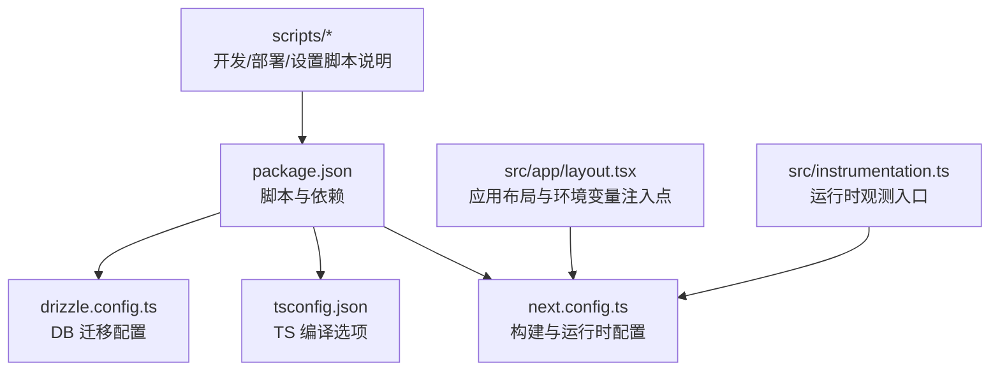
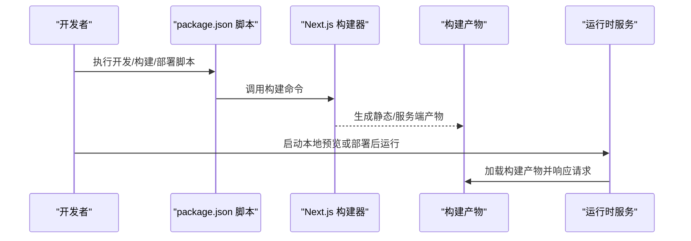
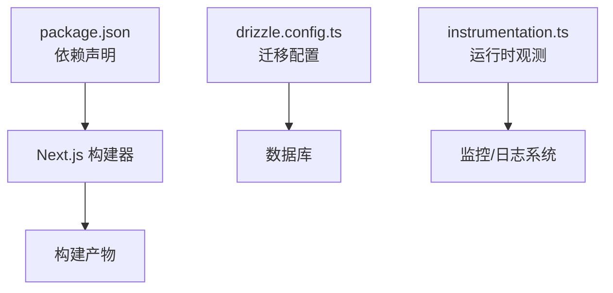

# 构建与部署

<cite>
**本文引用的文件**   
- [package.json](file://package.json)
- [next.config.ts](file://next.config.ts)
- [tsconfig.json](file://tsconfig.json)
- [drizzle.config.ts](file://drizzle.config.ts)
- [scripts/README.md](file://scripts/README.md)
- [scripts/deploy/README.md](file://scripts/deploy/README.md)
- [scripts/dev/README.md](file://scripts/dev/README.md)
- [scripts/setup/README.md](file://scripts/setup/README.md)
- [src/app/layout.tsx](file://src/app/layout.tsx)
- [src/instrumentation.ts](file://src/instrumentation.ts)
</cite>

## 目录
1. [简介](#简介)
2. [项目结构](#项目结构)
3. [核心组件](#核心组件)
4. [架构总览](#架构总览)
5. [详细组件分析](#详细组件分析)
6. [依赖分析](#依赖分析)
7. [性能考虑](#性能考虑)
8. [故障排查指南](#故障排查指南)
9. [结论](#结论)
10. [附录](#附录)

## 简介
本指南面向 CodeVideoCanvas 的构建与部署，覆盖开发环境构建流程、生产环境构建配置与优化（代码分割、资源压缩、缓存策略）、部署流程与自动化脚本使用、环境变量与配置文件管理，以及多平台适配（Vercel、Docker、传统服务器）和构建性能优化与排障方法。文档以仓库现有配置与脚本为依据，提供可操作的步骤与最佳实践建议。

## 项目结构
本项目基于 Next.js 应用，根目录包含关键构建与运行配置：
- package.json：定义脚本命令、依赖与构建入口
- next.config.ts：Next.js 构建与运行时配置
- tsconfig.json：TypeScript 编译选项
- drizzle.config.ts：数据库迁移工具配置
- scripts/*：开发与部署相关脚本说明与辅助脚本

图表来源
- [package.json](file://package.json)
- [next.config.ts](file://next.config.ts)
- [tsconfig.json](file://tsconfig.json)
- [drizzle.config.ts](file://drizzle.config.ts)
- [scripts/README.md](file://scripts/README.md)
- [src/app/layout.tsx](file://src/app/layout.tsx)
- [src/instrumentation.ts](file://src/instrumentation.ts)

章节来源
- [package.json](file://package.json)
- [next.config.ts](file://next.config.ts)
- [tsconfig.json](file://tsconfig.json)
- [drizzle.config.ts](file://drizzle.config.ts)
- [scripts/README.md](file://scripts/README.md)

## 核心组件
- 构建与运行脚本：通过 package.json 中的脚本命令组织开发、构建、预览与部署流程。
- Next.js 构建配置：next.config.ts 控制输出格式、路由行为、静态资源处理等。
- TypeScript 编译：tsconfig.json 决定模块解析、目标环境与类型检查范围。
- 数据库迁移：drizzle.config.ts 用于本地或 CI 中执行数据模型变更。
- 应用布局与运行时：src/app/layout.tsx 负责应用级布局与公共逻辑；src/instrumentation.ts 作为 Next.js 运行时观测入口。

章节来源
- [package.json](file://package.json)
- [next.config.ts](file://next.config.ts)
- [tsconfig.json](file://tsconfig.json)
- [drizzle.config.ts](file://drizzle.config.ts)
- [src/app/layout.tsx](file://src/app/layout.tsx)
- [src/instrumentation.ts](file://src/instrumentation.ts)

## 架构总览
下图展示从脚本到构建产物与运行时的整体关系，包括开发、构建、部署与运行阶段的关键节点。

图表来源
- [package.json](file://package.json)
- [next.config.ts](file://next.config.ts)

## 详细组件分析

### 构建与运行脚本（package.json）
- 作用：集中管理开发、构建、预览、测试与部署相关的命令入口。
- 建议用法：
  - 开发环境：使用提供的开发脚本启动热重载服务，便于快速迭代。
  - 构建生产版本：执行构建脚本生成优化后的产物。
  - 预览生产构建：在本地验证构建结果与路由行为。
  - 部署前准备：根据部署平台要求执行前置脚本（如迁移、清理）。
- 注意事项：
  - 确保 Node 与包管理器版本满足要求。
  - 若使用私有源或代理，请在执行脚本前配置网络环境。

章节来源
- [package.json](file://package.json)

### Next.js 构建配置（next.config.ts）
- 作用：控制构建输出、路由、中间件、静态资源与外部集成等。
- 常见优化项（结合项目需求调整）：
  - 输出格式：按需启用静态导出或服务端渲染模式。
  - 代码分割：利用 Next.js 默认的分块策略，必要时通过动态导入进一步拆分。
  - 资源压缩：开启图片、字体与静态资源的压缩与优化。
  - 缓存策略：为静态资源设置合适的缓存头，提升浏览器缓存命中率。
  - 环境变量：区分构建期与运行期变量，避免泄露敏感信息。
- 建议：
  - 在生产构建时启用增量构建与缓存加速。
  - 对大型第三方库进行按需引入或外部化，减少主包体积。

章节来源
- [next.config.ts](file://next.config.ts)

### TypeScript 编译（tsconfig.json）
- 作用：定义模块解析、目标环境、严格性与路径别名等。
- 建议：
  - 将目标环境设置为与运行时一致，避免兼容性问题。
  - 启用严格类型检查，提高构建期错误发现能力。
  - 合理配置路径别名，提升可读性与构建性能。

章节来源
- [tsconfig.json](file://tsconfig.json)

### 数据库迁移（drizzle.config.ts）
- 作用：定义数据库连接与迁移脚本执行方式。
- 建议：
  - 在 CI 或部署前执行迁移，确保数据模型与数据库一致。
  - 为不同环境提供独立配置，避免误操作。

章节来源
- [drizzle.config.ts](file://drizzle.config.ts)

### 应用布局与环境变量注入（src/app/layout.tsx）
- 作用：应用级布局与公共逻辑，适合在此处注入环境变量或全局状态。
- 建议：
  - 仅暴露必要的公开变量给前端，避免泄露密钥。
  - 对敏感配置在服务端处理，不直接传入客户端。

章节来源
- [src/app/layout.tsx](file://src/app/layout.tsx)

### 运行时观测入口（src/instrumentation.ts）
- 作用：Next.js 运行时观测与指标上报的入口点。
- 建议：
  - 在生产环境启用必要指标，便于监控与排障。
  - 控制采样率与上报频率，避免影响性能。

章节来源
- [src/instrumentation.ts](file://src/instrumentation.ts)

### 脚本说明（scripts/*）
- scripts/README.md：总体脚本说明与使用约定。
- scripts/dev/README.md：开发相关脚本的使用方法与参数。
- scripts/deploy/README.md：部署流程、平台适配与自动化步骤。
- scripts/setup/README.md：初始化与依赖安装、数据库迁移等设置步骤。

章节来源
- [scripts/README.md](file://scripts/README.md)
- [scripts/dev/README.md](file://scripts/dev/README.md)
- [scripts/deploy/README.md](file://scripts/deploy/README.md)
- [scripts/setup/README.md](file://scripts/setup/README.md)

## 依赖分析
- 构建期依赖：由 package.json 声明，包含框架、工具链与插件。
- 运行期依赖：生产构建产物仅保留运行所需的最小依赖集。
- 外部集成：
  - 数据库：通过 drizzle.config.ts 管理迁移与连接。
  - 运行时观测：通过 instrumentation.ts 接入指标与日志。

图表来源
- [package.json](file://package.json)
- [drizzle.config.ts](file://drizzle.config.ts)
- [src/instrumentation.ts](file://src/instrumentation.ts)

章节来源
- [package.json](file://package.json)
- [drizzle.config.ts](file://drizzle.config.ts)
- [src/instrumentation.ts](file://src/instrumentation.ts)

## 性能考虑
- 代码分割
  - 利用 Next.js 默认分块策略，对大组件与第三方库进行动态导入。
  - 按路由与功能域拆分页面与模块，减少首屏负载。
- 资源压缩与优化
  - 启用图片、字体与静态资源压缩，选择合适的格式与尺寸。
  - 对长尾资源启用 CDN 与强缓存策略。
- 构建缓存与增量构建
  - 在 CI 中缓存 node_modules 与构建缓存目录，缩短构建时间。
  - 合理使用 Next.js 的增量构建特性，避免全量重建。
- 运行时优化
  - 在 instrumentation.ts 中控制指标上报频率与采样率。
  - 在服务端渲染与静态导出之间权衡，选择合适模式。

[本节为通用指导，无需特定文件引用]

## 故障排查指南
- 构建失败
  - 检查 Node 与包管理器版本是否匹配。
  - 查看构建日志定位具体错误（TS 类型错误、依赖缺失、权限问题）。
  - 清理缓存并重试构建。
- 运行时异常
  - 确认环境变量是否正确注入且未泄露敏感信息。
  - 检查 instrumentation.ts 的指标上报是否被防火墙或代理拦截。
- 数据库迁移问题
  - 核对 drizzle.config.ts 的连接信息与迁移脚本一致性。
  - 在预发布环境先行验证迁移脚本。
- 部署失败
  - 参考 scripts/deploy/README.md 的步骤逐项核对。
  - 检查平台特定的环境变量与权限配置。

章节来源
- [scripts/deploy/README.md](file://scripts/deploy/README.md)
- [scripts/setup/README.md](file://scripts/setup/README.md)
- [drizzle.config.ts](file://drizzle.config.ts)
- [src/instrumentation.ts](file://src/instrumentation.ts)

## 结论
通过合理的脚本组织、Next.js 构建配置与 TS 编译选项，CodeVideoCanvas 可在开发与生产环境中获得一致的构建体验。配合数据库迁移与运行时观测，可实现稳定可靠的部署与运维。建议在 CI 中固化构建与部署流程，持续优化构建性能与资源体积，保障用户体验与服务稳定性。

[本节为总结性内容，无需特定文件引用]

## 附录

### 环境变量管理与配置文件处理
- 环境变量
  - 构建期与运行期变量分离，避免泄露敏感信息。
  - 在 src/app/layout.tsx 中仅注入必要的公开变量。
- 配置文件
  - 将平台差异化的配置放入环境变量或外部配置中心。
  - 在 CI 中注入不同环境的配置，保证构建产物的一致性。

章节来源
- [src/app/layout.tsx](file://src/app/layout.tsx)

### 多平台适配指南
- Vercel
  - 使用 Next.js 官方集成，自动识别构建脚本与输出目录。
  - 在平台设置中注入环境变量，并在部署前执行迁移脚本。
- Docker
  - 基于官方 Next.js 镜像构建，复制构建产物并暴露端口。
  - 在容器内执行迁移与启动命令，确保运行时依赖完整。
- 传统服务器
  - 使用 PM2 或 systemd 管理服务进程。
  - 将构建产物部署至指定目录，配置反向代理与 HTTPS。

章节来源
- [scripts/deploy/README.md](file://scripts/deploy/README.md)
- [package.json](file://package.json)

### 构建性能优化清单
- 启用增量构建与缓存
- 按需引入第三方库，避免打包无用代码
- 对大资源启用懒加载与预加载策略
- 在 CI 中并行执行任务，缩短流水线时长

[本节为通用指导，无需特定文件引用]