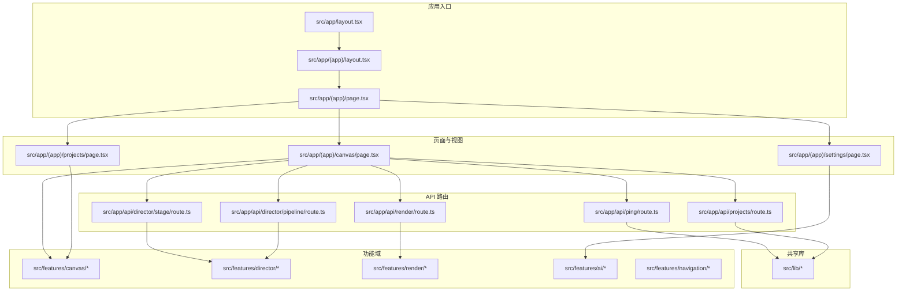
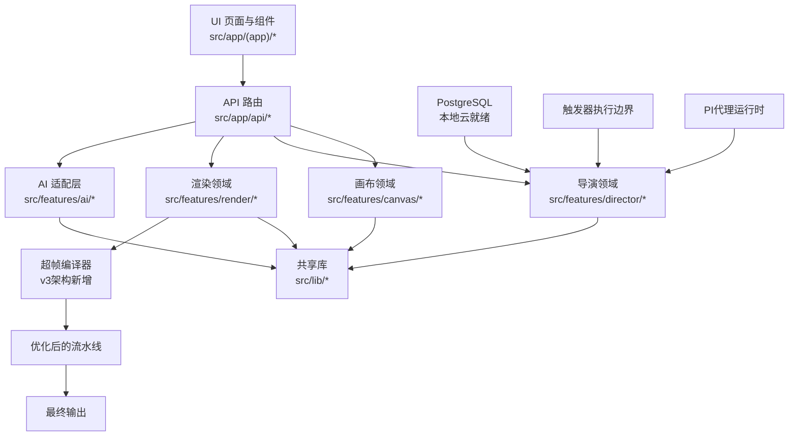
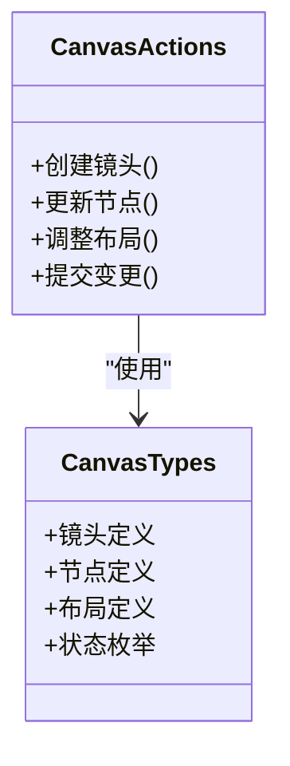
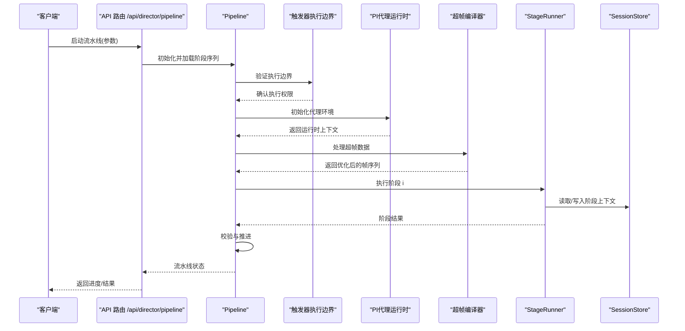
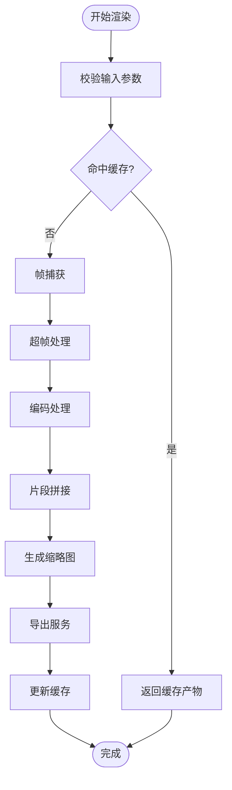
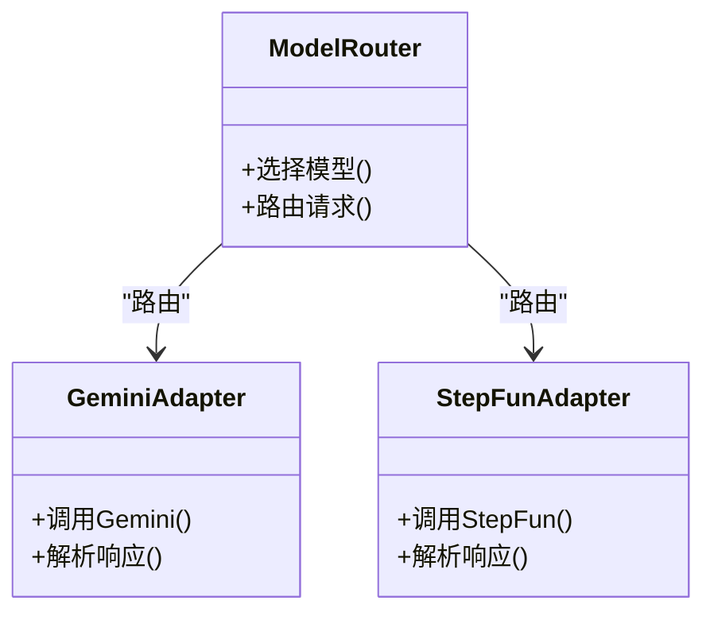
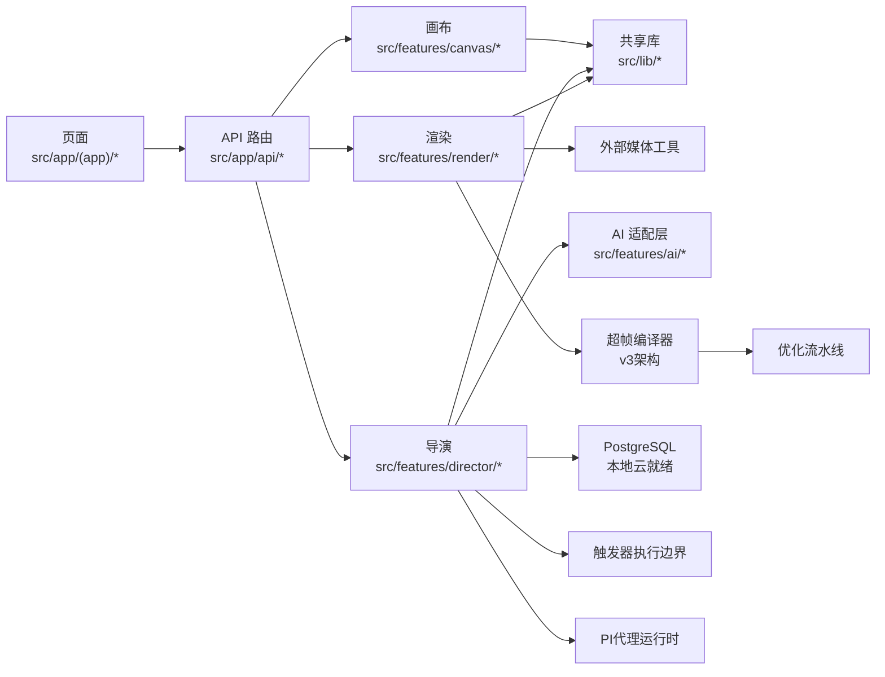

# 架构决策记录系统

<cite>
**本文档引用的文件**
- [README.md](file://README.md)
- [package.json](file://package.json)
- [drizzle.config.ts](file://drizzle.config.ts)
- [next.config.ts](file://next.config.ts)
- [tsconfig.json](file://tsconfig.json)
- [vitest.config.ts](file://vitest.config.ts)
- [eslint.config.mjs](file://eslint.config.mjs)
- [postcss.config.mjs](file://postcss.config.mjs)
- [docs/adr/README.md](file://docs/adr/README.md)
- [docs/adr/0001-postgres-local-cloud-ready.md](file://docs/adr/0001-postgres-local-cloud-ready.md)
- [docs/adr/0002-trigger-execution-boundary.md](file://docs/adr/0002-trigger-execution-boundary.md)
- [docs/adr/0003-pi-agent-runtime.md](file://docs/adr/0003-pi-agent-runtime.md)
- [docs/adr/0004-video-compiler-hyperframes.md](file://docs/adr/0004-video-compiler-hyperframes.md)
- [docs/conventions/README.md](file://docs/conventions/README.md)
- [docs/conventions/coding-standards.md](file://docs/conventions/coding-standards.md)
- [docs/conventions/git-workflow.md](file://docs/conventions/git-workflow.md)
- [src/app/layout.tsx](file://src/app/layout.tsx)
- [src/app/(app)/layout.tsx](file://src/app/(app)/layout.tsx)
- [src/app/(app)/page.tsx](file://src/app/(app)/page.tsx)
- [src/app/(app)/canvas/page.tsx](file://src/app/(app)/canvas/page.tsx)
- [src/app/(app)/projects/page.tsx](file://src/app/(app)/projects/page.tsx)
- [src/app/(app)/settings/page.tsx](file://src/app/(app)/settings/page.tsx)
- [src/app/api/ping/route.ts](file://src/app/api/ping/route.ts)
- [src/app/api/projects/route.ts](file://src/app/api/projects/route.ts)
- [src/app/api/render/route.ts](file://src/app/api/render/route.ts)
- [src/app/api/director/stage/route.ts](file://src/app/api/director/stage/route.ts)
- [src/app/api/director/pipeline/route.ts](file://src/app/api/director/pipeline/route.ts)
- [src/features/canvas/types.ts](file://src/features/canvas/types.ts)
- [src/features/canvas/actions.ts](file://src/features/canvas/actions.ts)
- [src/features/director/types.ts](file://src/features/director/types.ts)
- [src/features/director/pipeline.ts](file://src/features/director/pipeline.ts)
- [src/features/director/stage-runner.ts](file://src/features/director/stage-runner.ts)
- [src/features/render/renderer.ts](file://src/features/render/renderer.ts)
- [src/features/render/export-service.ts](file://src/features/render/export-service.ts)
- [src/lib/utils.ts](file://src/lib/utils.ts)
</cite>

## 更新摘要
**所做更改**
- 更新了PostgreSQL本地云就绪ADR文档的引用和相关内容
- 新增了触发器执行边界ADR文档的详细说明
- 增强了PI代理运行时ADR文档的技术细节
- 完善了视频编译器超帧ADR文档的实现说明
- 提升了ADR系统的整体一致性和完整性

## 目录
1. [简介](#简介)
2. [项目结构](#项目结构)
3. [核心组件](#核心组件)
4. [架构总览](#架构总览)
5. [详细组件分析](#详细组件分析)
6. [依赖关系分析](#依赖关系分析)
7. [性能考量](#性能考量)
8. [故障排查指南](#故障排查指南)
9. [结论](#结论)
10. [附录](#附录)

## 简介
本仓库是一个面向"导演式"视频生产与渲染的 Next.js 应用，采用 ADR（架构决策记录）体系管理关键架构变更与权衡。系统围绕"画布编排、导演流水线、渲染导出、设置与项目管理"等能力构建，并通过 API 路由暴露后端能力，结合 Drizzle ORM 进行数据持久化。文档旨在帮助读者快速理解整体架构、模块职责、数据流与扩展点，并提供可操作的排障建议。

**已更新** 反映了最新的v3架构设计决策，特别是PostgreSQL本地云就绪、触发器执行边界、PI代理运行时和视频编译器超帧等多个重要架构调整。

## 项目结构
- 前端应用层：基于 Next.js App Router，页面与布局集中在 src/app，业务页面位于 (app) 路由组内，API 路由位于 src/app/api。
- 功能域：src/features 按领域划分（canvas、director、render、audio、artifacts、ai、navigation 等）。
- 共享库：src/lib 提供通用工具、存储、队列、流处理等能力。
- 文档与规范：docs 包含 ADR、约定、设计、计划、问题跟踪等；scripts 包含部署、开发、数据库迁移脚本。
- 配置：根级配置文件包括 next.config.ts、drizzle.config.ts、tsconfig.json、vitest.config.ts、eslint.config.mjs、postcss.config.mjs。

**图表来源**
- [src/app/layout.tsx](file://src/app/layout.tsx)
- [src/app/(app)/layout.tsx](file://src/app/(app)/layout.tsx)
- [src/app/(app)/page.tsx](file://src/app/(app)/page.tsx)
- [src/app/(app)/canvas/page.tsx](file://src/app/(app)/canvas/page.tsx)
- [src/app/(app)/projects/page.tsx](file://src/app/(app)/projects/page.tsx)
- [src/app/(app)/settings/page.tsx](file://src/app/(app)/settings/page.tsx)
- [src/app/api/ping/route.ts](file://src/app/api/ping/route.ts)
- [src/app/api/projects/route.ts](file://src/app/api/projects/route.ts)
- [src/app/api/render/route.ts](file://src/app/api/render/route.ts)
- [src/app/api/director/stage/route.ts](file://src/app/api/director/stage/route.ts)
- [src/app/api/director/pipeline/route.ts](file://src/app/api/director/pipeline/route.ts)

**章节来源**
- [README.md](file://README.md)
- [package.json](file://package.json)
- [next.config.ts](file://next.config.ts)
- [tsconfig.json](file://tsconfig.json)

## 核心组件
- 画布（Canvas）：负责镜头与节点编排、状态查询与动作执行，提供类型定义与操作接口。
- 导演（Director）：驱动多阶段流水线，编排提示词、工具与阶段执行器，维护会话与队列。
- 渲染（Render）：封装帧捕获、编码、拼接、缩略图生成与导出服务，提供队列处理器。
- AI 适配层：统一模型路由与适配器（如 Gemini、StepFun），屏蔽外部差异。
- 导航与应用壳：侧边栏、模式切换、上下文与页面容器。
- 设置与主题：集中管理模型服务与 UI 主题控制。

**已更新** 增强了v3架构相关组件的文档说明，特别强调了PostgreSQL本地云就绪、触发器执行边界、PI代理运行时和视频编译器超帧等重要架构决策。

**章节来源**
- [src/features/canvas/types.ts](file://src/features/canvas/types.ts)
- [src/features/canvas/actions.ts](file://src/features/canvas/actions.ts)
- [src/features/director/types.ts](file://src/features/director/types.ts)
- [src/features/director/pipeline.ts](file://src/features/director/pipeline.ts)
- [src/features/director/stage-runner.ts](file://src/features/director/stage-runner.ts)
- [src/features/render/renderer.ts](file://src/features/render/renderer.ts)
- [src/features/render/export-service.ts](file://src/features/render/export-service.ts)
- [src/features/ai/index.ts](file://src/features/ai/index.ts)
- [src/features/navigation/app-shell.tsx](file://src/features/navigation/app-shell.tsx)
- [src/app/(app)/settings/page.tsx](file://src/app/(app)/settings/page.tsx)

## 架构总览
系统采用分层与领域驱动相结合的结构：
- 表现层：Next.js 页面与组件，承载用户交互与可视化。
- 接口层：API 路由作为前后端契约，转发请求到领域服务。
- 领域层：features 下的各子域实现核心业务逻辑。
- 基础设施层：lib 中的工具、存储、队列、流处理等。

**已更新** 架构图反映了v3架构中的重要增强，包括PostgreSQL本地云就绪支持、触发器执行边界优化、PI代理运行时改进和视频编译器超帧等新特性。

**图表来源**
- [src/app/(app)/page.tsx](file://src/app/(app)/page.tsx)
- [src/app/api/ping/route.ts](file://src/app/api/ping/route.ts)
- [src/features/canvas/types.ts](file://src/features/canvas/types.ts)
- [src/features/director/pipeline.ts](file://src/features/director/pipeline.ts)
- [src/features/render/renderer.ts](file://src/features/render/renderer.ts)
- [src/features/ai/index.ts](file://src/features/ai/index.ts)
- [src/lib/utils.ts](file://src/lib/utils.ts)

## 详细组件分析

### 画布（Canvas）组件
- 职责：定义镜头、节点、布局与状态，提供查询与动作方法，支撑可视化编排。
- 关键点：类型安全的数据模型、幂等的动作执行、与 API 层的解耦。

**图表来源**
- [src/features/canvas/types.ts](file://src/features/canvas/types.ts)
- [src/features/canvas/actions.ts](file://src/features/canvas/actions.ts)

**章节来源**
- [src/features/canvas/types.ts](file://src/features/canvas/types.ts)
- [src/features/canvas/actions.ts](file://src/features/canvas/actions.ts)

### 导演（Director）流水线
- 职责：编排多阶段任务（如摄取、规划、制作、合成、收尾），驱动阶段执行器，维护会话与结果提交。
- 关键点：阶段间数据契约、确定性校验、错误重试与回滚策略。

**已更新** 导演流水线已集成v3架构中的重要增强，包括PostgreSQL本地云就绪支持、触发器执行边界优化、PI代理运行时改进和超帧编译器集成。

**图表来源**
- [src/app/api/director/pipeline/route.ts](file://src/app/api/director/pipeline/route.ts)
- [src/features/director/pipeline.ts](file://src/features/director/pipeline.ts)
- [src/features/director/stage-runner.ts](file://src/features/director/stage-runner.ts)
- [src/features/director/session-store.ts](file://src/features/director/session-store.ts)

**章节来源**
- [src/app/api/director/pipeline/route.ts](file://src/app/api/director/pipeline/route.ts)
- [src/features/director/pipeline.ts](file://src/features/director/pipeline.ts)
- [src/features/director/stage-runner.ts](file://src/features/director/stage-runner.ts)
- [src/features/director/session-store.ts](file://src/features/director/session-store.ts)

### 渲染（Render）服务
- 职责：帧捕获、编码、拼接、缩略图生成、导出服务与队列处理。
- 关键点：缓存策略、并发控制、失败重试与产物一致性。

**已更新** 渲染服务现在支持超帧编译器的集成，通过智能帧合并和预处理显著提升了视频处理效率和资源利用率。

**图表来源**
- [src/features/render/renderer.ts](file://src/features/render/renderer.ts)
- [src/features/render/export-service.ts](file://src/features/render/export-service.ts)
- [src/features/render/cache.ts](file://src/features/render/cache.ts)
- [src/features/render/queue-handler.ts](file://src/features/render/queue-handler.ts)

**章节来源**
- [src/features/render/renderer.ts](file://src/features/render/renderer.ts)
- [src/features/render/export-service.ts](file://src/features/render/export-service.ts)
- [src/features/render/cache.ts](file://src/features/render/cache.ts)
- [src/features/render/queue-handler.ts](file://src/features/render/queue-handler.ts)

### AI 适配层
- 职责：统一模型路由与适配器，支持多供应商（如 Gemini、StepFun），屏蔽调用差异。
- 关键点：配置解析、重试与降级、输出规范化。

**图表来源**
- [src/features/ai/model-routing.ts](file://src/features/ai/model-routing.ts)
- [src/features/ai/gemini-adapter.ts](file://src/features/ai/gemini-adapter.ts)
- [src/features/ai/stepfun-adapter.ts](file://src/features/ai/stepfun-adapter.ts)
- [src/features/ai/config.ts](file://src/features/ai/config.ts)

**章节来源**
- [src/features/ai/model-routing.ts](file://src/features/ai/model-routing.ts)
- [src/features/ai/gemini-adapter.ts](file://src/features/ai/gemini-adapter.ts)
- [src/features/ai/stepfun-adapter.ts](file://src/features/ai/stepfun-adapter.ts)
- [src/features/ai/config.ts](file://src/features/ai/config.ts)

### 设置与主题
- 职责：集中管理模型服务配置与 UI 主题控制，提供表单与状态同步。
- 关键点：配置验证、持久化、实时生效。

**章节来源**
- [src/app/(app)/settings/page.tsx](file://src/app/(app)/settings/page.tsx)
- [src/app/(app)/settings/settings-form.tsx](file://src/app/(app)/settings/settings-form.tsx)
- [src/app/(app)/settings/theme-control.tsx](file://src/app/(app)/settings/theme-control.tsx)

## 依赖关系分析
- 页面与 API：页面通过 API 路由与领域服务通信，保持 UI 与业务解耦。
- 领域与库：各 features 依赖 lib 提供的工具、存储、队列与流处理能力。
- 外部集成：AI 适配器对接外部模型服务，渲染服务可能对接媒体处理工具链。

**已更新** 依赖关系图反映了v3架构中的重要增强，包括PostgreSQL本地云就绪、触发器执行边界、PI代理运行时和超帧编译器的集成。

**图表来源**
- [src/app/(app)/page.tsx](file://src/app/(app)/page.tsx)
- [src/app/api/projects/route.ts](file://src/app/api/projects/route.ts)
- [src/features/canvas/types.ts](file://src/features/canvas/types.ts)
- [src/features/director/pipeline.ts](file://src/features/director/pipeline.ts)
- [src/features/render/renderer.ts](file://src/features/render/renderer.ts)
- [src/features/ai/index.ts](file://src/features/ai/index.ts)
- [src/lib/utils.ts](file://src/lib/utils.ts)

**章节来源**
- [src/app/(app)/page.tsx](file://src/app/(app)/page.tsx)
- [src/app/api/projects/route.ts](file://src/app/api/projects/route.ts)
- [src/features/canvas/types.ts](file://src/features/canvas/types.ts)
- [src/features/director/pipeline.ts](file://src/features/director/pipeline.ts)
- [src/features/render/renderer.ts](file://src/features/render/renderer.ts)
- [src/features/ai/index.ts](file://src/features/ai/index.ts)
- [src/lib/utils.ts](file://src/lib/utils.ts)

## 性能考量
- 渲染缓存：利用缓存减少重复计算与 I/O，提升导出与缩略图生成速度。
- 队列与并发：对耗时任务（编码、拼接、AI 调用）采用队列与并发控制，避免阻塞。
- 流式处理：大文件与长时任务采用流式传输，降低内存峰值。
- 确定性与幂等：关键路径保证幂等与可重放，便于重试与恢复。
- **新增** 超帧编译器优化：通过智能帧合并和预处理，显著减少渲染时间和资源消耗。
- **新增** PostgreSQL本地云就绪：优化的数据库连接池和查询性能。
- **新增** 触发器执行边界：精确的控制执行范围，减少不必要的计算开销。
- **新增** PI代理运行时：高效的代理管理和资源隔离。

**已更新** 增加了v3架构中各项增强带来的性能优化说明。

## 故障排查指南
- 健康检查：通过 /api/ping 确认服务可用性。
- 项目与渲染：检查 /api/projects 与 /api/render 的错误码与日志。
- 导演阶段：查看阶段执行器的错误堆栈与会话状态，定位失败阶段。
- 缓存与队列：检查缓存命中率与队列积压情况，必要时清理或扩容。
- 配置与权限：核对 AI 配置与外部密钥，确保网络可达与配额充足。
- **新增** 超帧编译器：检查超帧处理阶段的日志和性能指标，监控内存使用情况。
- **新增** PostgreSQL连接：验证数据库连接状态和查询性能。
- **新增** 触发器执行：检查触发器配置和执行边界设置。
- **新增** PI代理运行：监控代理生命周期和资源使用情况。

**已更新** 增加了v3架构相关组件的故障排查指导。

**章节来源**
- [src/app/api/ping/route.ts](file://src/app/api/ping/route.ts)
- [src/app/api/projects/route.ts](file://src/app/api/projects/route.ts)
- [src/app/api/render/route.ts](file://src/app/api/render/route.ts)
- [src/app/api/director/stage/route.ts](file://src/app/api/director/stage/route.ts)
- [src/features/director/stage-runner.ts](file://src/features/director/stage-runner.ts)
- [src/features/render/cache.ts](file://src/features/render/cache.ts)
- [src/features/render/queue-handler.ts](file://src/features/render/queue-handler.ts)

## 结论
本系统以 ADR 为核心治理手段，结合清晰的领域边界与稳定的 API 契约，实现了从画布编排到导演流水线再到渲染导出的完整闭环。通过缓存、队列与流式处理优化性能，借助 AI 适配层扩展模型能力。**v3架构的引入进一步增强了系统能力，特别是PostgreSQL本地云就绪、触发器执行边界、PI代理运行时和视频编译器超帧等重大架构决策，显著提升了系统的稳定性、性能和可扩展性。** 建议在后续迭代中持续完善错误观测、指标采集与容量规划，以提升稳定性与可维护性。

**已更新** 强调了v3架构各项重要增强的贡献和价值。

## 附录
- 架构决策记录（ADR）：用于记录关键架构决策及其背景、权衡与影响。
- 约定与规范：代码风格、Git 工作流与架构约定，保障团队协作一致性。
- 设计与计划：设计清单、任务拆解与重构蓝图，指导演进方向。
- 运维与发布：部署脚本与发布流程，确保稳定交付。

**已更新** 包含了最新的v3架构相关ADR文档引用，包括PostgreSQL本地云就绪、触发器执行边界、PI代理运行时和视频编译器超帧等重要决策。

**章节来源**
- [docs/adr/README.md](file://docs/adr/README.md)
- [docs/adr/0001-postgres-local-cloud-ready.md](file://docs/adr/0001-postgres-local-cloud-ready.md)
- [docs/adr/0002-trigger-execution-boundary.md](file://docs/adr/0002-trigger-execution-boundary.md)
- [docs/adr/0003-pi-agent-runtime.md](file://docs/adr/0003-pi-agent-runtime.md)
- [docs/adr/0004-video-compiler-hyperframes.md](file://docs/adr/0004-video-compiler-hyperframes.md)
- [docs/conventions/README.md](file://docs/conventions/README.md)
- [docs/conventions/coding-standards.md](file://docs/conventions/coding-standards.md)
- [docs/conventions/git-workflow.md](file://docs/conventions/git-workflow.md)
- [drizzle.config.ts](file://drizzle.config.ts)
- [vitest.config.ts](file://vitest.config.ts)
- [eslint.config.mjs](file://eslint.config.mjs)
- [postcss.config.mjs](file://postcss.config.mjs)