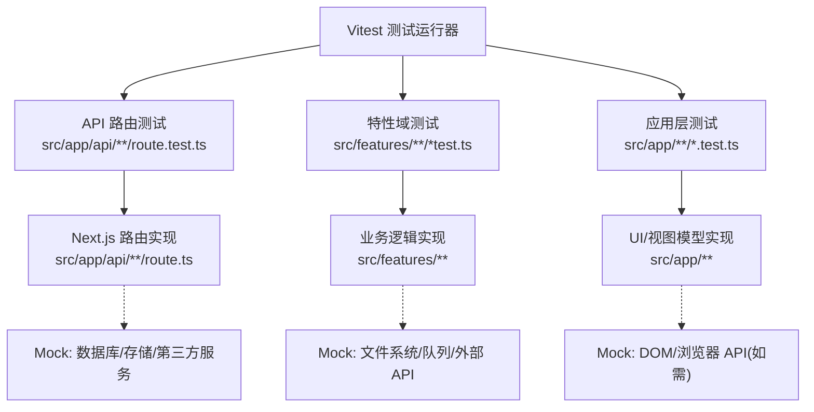
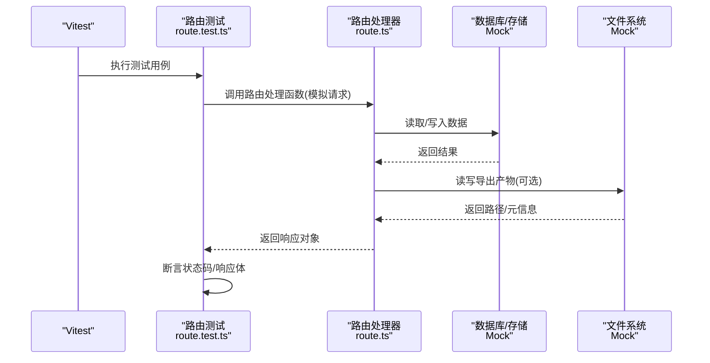
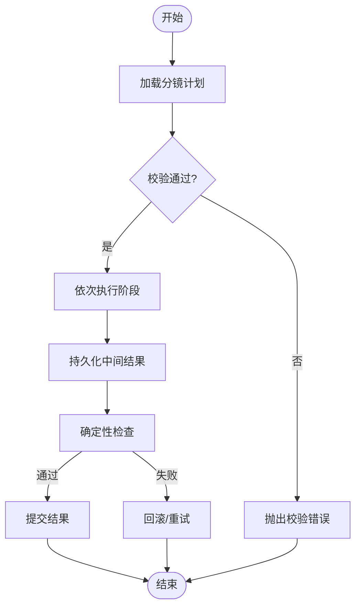
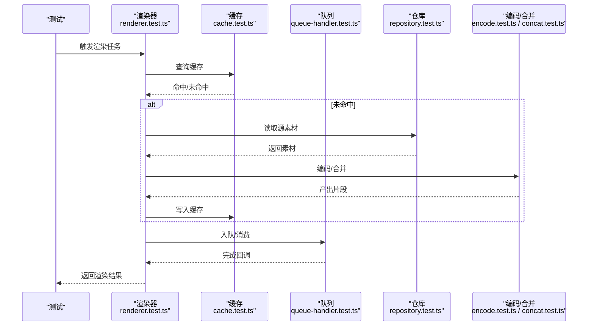
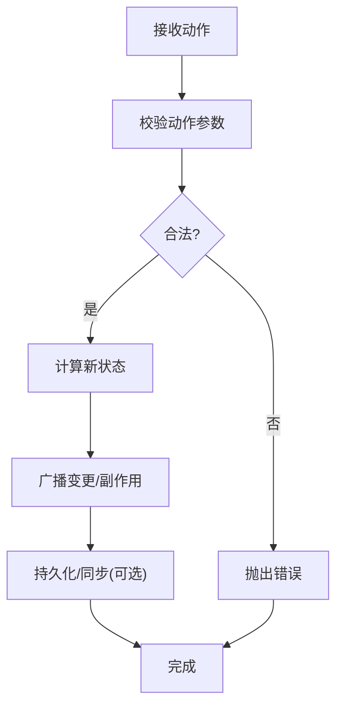
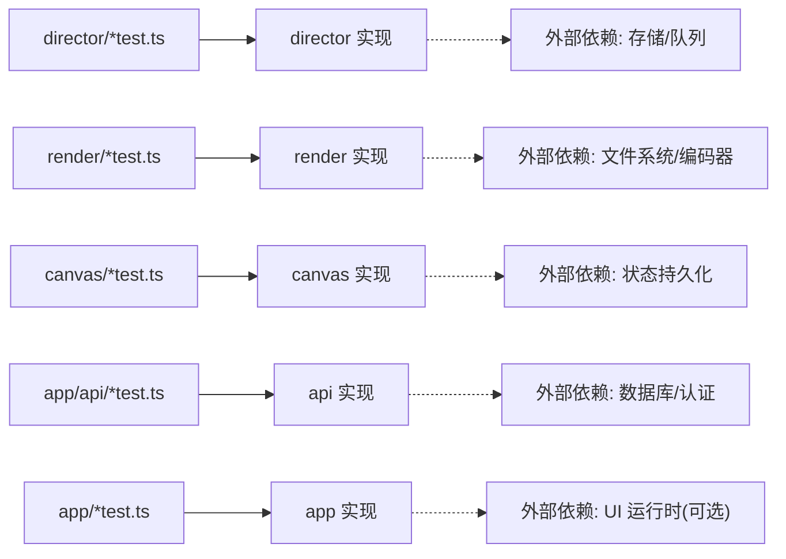

# 单元测试

<cite>
**本文引用的文件**   
- [vitest.config.ts](file://vitest.config.ts)
- [package.json](file://package.json)
- [README.md](file://README.md)
- [src/app/_components/new-project-dialog.test.ts](file://src/app/_components/new-project-dialog.test.ts)
- [src/app/api/artifacts/[id]/route.test.ts](file://src/app/api/artifacts/[id]/route.test.ts)
- [src/app/api/director/stage/route.test.ts](file://src/app/api/director/stage/route.test.ts)
- [src/app/api/jobs/[id]/route.test.ts](file://src/app/api/jobs/[id]/route.test.ts)
- [src/app/api/projects/route.test.ts](file://src/app/api/projects/route.test.ts)
- [src/app/api/render/export/route.test.ts](file://src/app/api/render/export/route.test.ts)
- [src/app/api/render/route.test.ts](file://src/app/api/render/route.test.ts)
- [src/app/api/settings/route.test.ts](file://src/app/api/settings/route.test.ts)
- [src/app/canvas/export/export-api.test.ts](file://src/app/canvas/export/export-api.test.ts)
- [src/app/canvas/export/export-view-model.test.ts](file://src/app/canvas/export/export-view-model.test.ts)
- [src/app/canvas/shot/[id]/shot-api.test.ts](file://src/app/canvas/shot/[id]/shot-api.test.ts)
- [src/app/canvas/canvas-action-api.test.ts](file://src/app/canvas/canvas-action-api.test.ts)
- [src/app/playbook/registry.test.ts](file://src/app/playbook/registry.test.ts)
- [src/app/settings/theme-control.test.ts](file://src/app/settings/theme-control.test.ts)
- [src/features/audio/score.test.ts](file://src/features/audio/score.test.ts)
- [src/features/audio/sfx.test.ts](file://src/features/audio/sfx.test.ts)
- [src/features/audio/subtitle.test.ts](file://src/features/audio/subtitle.test.ts)
- [src/features/audio/voiceover.test.ts](file://src/features/audio/voiceover.test.ts)
- [src/features/canvas/actions.test.ts](file://src/features/canvas/actions.test.ts)
- [src/features/canvas/fan-out.test.ts](file://src/features/canvas/fan-out.test.ts)
- [src/features/canvas/layout.test.ts](file://src/features/canvas/layout.test.ts)
- [src/features/canvas/queries.test.ts](file://src/features/canvas/queries.test.ts)
- [src/features/canvas/status.test.ts](file://src/features/canvas/status.test.ts)
- [src/features/director/prompts/prompts.test.ts](file://src/features/director/prompts/prompts.test.ts)
- [src/features/director/tools/check-determinism.test.ts](file://src/features/director/tools/check-determinism.test.ts)
- [src/features/director/tools/validate-shot-plan.test.ts](file://src/features/director/tools/validate-shot-plan.test.ts)
- [src/features/director/tools/write-artifact.test.ts](file://src/features/director/tools/write-artifact.test.ts)
- [src/features/director/pi-session.test.ts](file://src/features/director/pi-session.test.ts)
- [src/features/director/queue-handler.test.ts](file://src/features/director/queue-handler.test.ts)
- [src/features/director/runtime-repository.test.ts](file://src/features/director/runtime-repository.test.ts)
- [src/features/director/session-store.test.ts](file://src/features/director/session-store.test.ts)
- [src/features/director/stage-prompt.test.ts](file://src/features/director/stage-prompt.test.ts)
- [src/features/director/stage-result.test.ts](file://src/features/director/stage-result.test.ts)
- [src/features/director/stage-runner.test.ts](file://src/features/director/stage-runner.test.ts)
- [src/features/director/startup-boundary.test.ts](file://src/features/director/startup-boundary.test.ts)
- [src/features/navigation/app-shell.test.ts](file://src/features/navigation/app-shell.test.ts)
- [src/features/navigation/app-sidebar-shell.test.ts](file://src/features/navigation/app-sidebar-shell.test.ts)
- [src/features/render/cache.test.ts](file://src/features/render/cache.test.ts)
- [src/features/render/concat.test.ts](file://src/features/render/concat.test.ts)
- [src/features/render/encode.test.ts](file://src/features/render/encode.test.ts)
- [src/features/render/export-service.test.ts](file://src/features/render/export-service.test.ts)
- [src/features/render/frame-capture.test.ts](file://src/features/render/frame-capture.test.ts)
- [src/features/render/frame-sequence.test.ts](file://src/features/render/frame-sequence.test.ts)
- [src/features/render/queue-handler.test.ts](file://src/features/render/queue-handler.test.ts)
- [src/features/render/renderer.integration.test.ts](file://src/features/render/renderer.integration.test.ts)
- [src/features/render/renderer.test.ts](file://src/features/render/renderer.test.ts)
- [src/features/render/repository.test.ts](file://src/features/render/repository.test.ts)
</cite>

## 目录
1. [简介](#简介)
2. [项目结构](#项目结构)
3. [核心组件](#核心组件)
4. [架构总览](#架构总览)
5. [详细组件分析](#详细组件分析)
6. [依赖分析](#依赖分析)
7. [性能考虑](#性能考虑)
8. [故障排查指南](#故障排查指南)
9. [结论](#结论)
10. [附录](#附录)

## 简介
本文件为 CodeVideoCanvas 的单元测试文档，聚焦于 Vitest 测试框架的配置与使用、测试组织与命名约定、高质量用例编写方法（数据准备、Mock 策略、断言）、以及针对导演系统、渲染引擎、画布操作等核心业务模块的测试模式。同时提供组件单元测试最佳实践（纯函数、异步、错误处理），并给出覆盖率要求与性能优化建议。

## 项目结构
仓库采用“按功能域 + 就近测试”的组织方式：每个源文件与其对应的 .test.ts 相邻放置，便于定位与维护。测试覆盖范围包括：
- API 路由层：位于 src/app/api 下各路由的 route.test.ts
- 应用页面与视图模型：位于 src/app 下的 export、canvas、playbook、settings 等模块
- 特性域（features）：director、render、canvas、audio、navigation 等
- 工具与 UI 组件：部分组件与工具也包含独立测试

```mermaid
graph TB
A["根配置<br/>vitest.config.ts"] --> B["包脚本入口<br/>package.json"]
subgraph "API 路由测试"
R1["artifacts/[id]/route.test.ts"]
R2["director/stage/route.test.ts"]
R3["jobs/[id]/route.test.ts"]
R4["projects/route.test.ts"]
R5["render/route.test.ts"]
R6["render/export/route.test.ts"]
R7["settings/route.test.ts"]
end
subgraph "应用层测试"
C1["_components/new-project-dialog.test.ts"]
C2["canvas/export/*test.ts"]
C3["canvas/shot/[id]/shot-api.test.ts"]
C4["canvas/canvas-action-api.test.ts"]
C5["playbook/registry.test.ts"]
C6["settings/theme-control.test.ts"]
end
subgraph "特性域测试"
F1["director/*test.ts"]
F2["render/*test.ts"]
F3["canvas/*test.ts"]
F4["audio/*test.ts"]
F5["navigation/*test.ts"]
end
B --> R1
B --> R2
B --> R3
B --> R4
B --> R5
B --> R6
B --> R7
B --> C1
B --> C2
B --> C3
B --> C4
B --> C5
B --> C6
B --> F1
B --> F2
B --> F3
B --> F4
B --> F5
```

图表来源
- [vitest.config.ts](file://vitest.config.ts)
- [package.json](file://package.json)

章节来源
- [vitest.config.ts](file://vitest.config.ts)
- [package.json](file://package.json)

## 核心组件
本节概述测试基础设施与通用约定，确保团队在统一规范下高效协作。

- 测试运行器与配置
  - 使用 Vitest 作为测试框架，配置文件位于根目录 vitest.config.ts
  - 通过 package.json 的 scripts 暴露常用命令（如 test、coverage 等）
- 测试文件组织与命名
  - 与源码同目录或同级目录下以 .test.ts 结尾
  - 对复杂模块可拆分为多个 .test.ts，按职责划分（例如 render 模块拆分出 encode.test.ts、repository.test.ts 等）
- 测试环境
  - Node 环境为主；涉及浏览器 API 的测试需启用相应环境或 Mock
  - 对于 Next.js 路由测试，通常基于 Node 环境模拟请求上下文
- 断言库
  - 默认使用 Vitest 内置断言（expect）
- 覆盖率
  - 建议在 CI 中开启覆盖率报告，并对关键路径设置阈值

章节来源
- [vitest.config.ts](file://vitest.config.ts)
- [package.json](file://package.json)

## 架构总览
下图展示测试在整体系统中的位置与交互关系：测试驱动 API 路由、特性域服务与渲染管线，并通过 Mock 隔离外部依赖（数据库、文件系统、网络）。

图表来源
- [src/app/api/artifacts/[id]/route.test.ts](file://src/app/api/artifacts/[id]/route.test.ts)
- [src/app/api/director/stage/route.test.ts](file://src/app/api/director/stage/route.test.ts)
- [src/app/api/jobs/[id]/route.test.ts](file://src/app/api/jobs/[id]/route.test.ts)
- [src/app/api/projects/route.test.ts](file://src/app/api/projects/route.test.ts)
- [src/app/api/render/route.test.ts](file://src/app/api/render/route.test.ts)
- [src/app/api/render/export/route.test.ts](file://src/app/api/render/export/route.test.ts)
- [src/app/api/settings/route.test.ts](file://src/app/api/settings/route.test.ts)
- [src/features/director/stage-runner.test.ts](file://src/features/director/stage-runner.test.ts)
- [src/features/render/renderer.test.ts](file://src/features/render/renderer.test.ts)
- [src/features/render/repository.test.ts](file://src/features/render/repository.test.ts)

## 详细组件分析

### API 路由测试模式
- 目标
  - 验证 HTTP 行为、参数校验、错误码与响应体结构
  - 隔离数据库、存储与外部服务
- 常见策略
  - 使用 Node 环境构造最小化请求对象
  - Mock 数据库访问层与文件系统
  - 断言状态码、响应头与 JSON 主体
- 示例覆盖
  - artifacts、director stage、jobs、projects、render、export、settings 等路由

图表来源
- [src/app/api/artifacts/[id]/route.test.ts](file://src/app/api/artifacts/[id]/route.test.ts)
- [src/app/api/director/stage/route.test.ts](file://src/app/api/director/stage/route.test.ts)
- [src/app/api/jobs/[id]/route.test.ts](file://src/app/api/jobs/[id]/route.test.ts)
- [src/app/api/projects/route.test.ts](file://src/app/api/projects/route.test.ts)
- [src/app/api/render/route.test.ts](file://src/app/api/render/route.test.ts)
- [src/app/api/render/export/route.test.ts](file://src/app/api/render/export/route.test.ts)
- [src/app/api/settings/route.test.ts](file://src/app/api/settings/route.test.ts)

章节来源
- [src/app/api/artifacts/[id]/route.test.ts](file://src/app/api/artifacts/[id]/route.test.ts)
- [src/app/api/director/stage/route.test.ts](file://src/app/api/director/stage/route.test.ts)
- [src/app/api/jobs/[id]/route.test.ts](file://src/app/api/jobs/[id]/route.test.ts)
- [src/app/api/projects/route.test.ts](file://src/app/api/projects/route.test.ts)
- [src/app/api/render/route.test.ts](file://src/app/api/render/route.test.ts)
- [src/app/api/render/export/route.test.ts](file://src/app/api/render/export/route.test.ts)
- [src/app/api/settings/route.test.ts](file://src/app/api/settings/route.test.ts)

### 导演系统测试（Director）
- 关注点
  - 阶段编排（Stage Runner）、会话管理（Session Store）、运行时仓库（Runtime Repository）、队列处理（Queue Handler）、提示词与校验工具
- 测试要点
  - 阶段顺序与幂等性
  - 输入输出契约（Schema 校验）
  - 异常分支与重试/失败回滚
  - 确定性检查（check-determinism）
- 典型用例
  - 正常流程、缺失输入、非法状态、并发队列、持久化失败

图表来源
- [src/features/director/stage-runner.test.ts](file://src/features/director/stage-runner.test.ts)
- [src/features/director/session-store.test.ts](file://src/features/director/session-store.test.ts)
- [src/features/director/runtime-repository.test.ts](file://src/features/director/runtime-repository.test.ts)
- [src/features/director/queue-handler.test.ts](file://src/features/director/queue-handler.test.ts)
- [src/features/director/tools/check-determinism.test.ts](file://src/features/director/tools/check-determinism.test.ts)
- [src/features/director/tools/validate-shot-plan.test.ts](file://src/features/director/tools/validate-shot-plan.test.ts)

章节来源
- [src/features/director/stage-runner.test.ts](file://src/features/director/stage-runner.test.ts)
- [src/features/director/session-store.test.ts](file://src/features/director/session-store.test.ts)
- [src/features/director/runtime-repository.test.ts](file://src/features/director/runtime-repository.test.ts)
- [src/features/director/queue-handler.test.ts](file://src/features/director/queue-handler.test.ts)
- [src/features/director/tools/check-determinism.test.ts](file://src/features/director/tools/check-determinism.test.ts)
- [src/features/director/tools/validate-shot-plan.test.ts](file://src/features/director/tools/validate-shot-plan.test.ts)

### 渲染引擎测试（Render）
- 关注点
  - 帧捕获、序列生成、编码、合并、缓存、仓库存取、队列调度、集成场景
- 测试要点
  - 输入帧序列到最终输出的端到端链路
  - 缓存命中/失效与一致性
  - 编码失败与降级策略
  - 大样本与边界条件（空序列、超长序列、分辨率变化）
- 典型用例
  - 单帧/多帧渲染、编码参数组合、缓存命中路径、仓库读写失败、队列阻塞与恢复

图表来源
- [src/features/render/renderer.test.ts](file://src/features/render/renderer.test.ts)
- [src/features/render/cache.test.ts](file://src/features/render/cache.test.ts)
- [src/features/render/queue-handler.test.ts](file://src/features/render/queue-handler.test.ts)
- [src/features/render/repository.test.ts](file://src/features/render/repository.test.ts)
- [src/features/render/encode.test.ts](file://src/features/render/encode.test.ts)
- [src/features/render/concat.test.ts](file://src/features/render/concat.test.ts)

章节来源
- [src/features/render/renderer.test.ts](file://src/features/render/renderer.test.ts)
- [src/features/render/cache.test.ts](file://src/features/render/cache.test.ts)
- [src/features/render/queue-handler.test.ts](file://src/features/render/queue-handler.test.ts)
- [src/features/render/repository.test.ts](file://src/features/render/repository.test.ts)
- [src/features/render/encode.test.ts](file://src/features/render/encode.test.ts)
- [src/features/render/concat.test.ts](file://src/features/render/concat.test.ts)

### 画布操作测试（Canvas）
- 关注点
  - 动作（Actions）、布局（Layout）、查询（Queries）、状态（Status）、扇出（Fan-out）
- 测试要点
  - 动作副作用与不可变更新
  - 布局计算的正确性与稳定性
  - 查询过滤与排序
  - 状态机转换与不变式
- 典型用例
  - 新增/删除/移动元素、批量操作、撤销重做、约束冲突、并发更新

图表来源
- [src/features/canvas/actions.test.ts](file://src/features/canvas/actions.test.ts)
- [src/features/canvas/layout.test.ts](file://src/features/canvas/layout.test.ts)
- [src/features/canvas/queries.test.ts](file://src/features/canvas/queries.test.ts)
- [src/features/canvas/status.test.ts](file://src/features/canvas/status.test.ts)
- [src/features/canvas/fan-out.test.ts](file://src/features/canvas/fan-out.test.ts)

章节来源
- [src/features/canvas/actions.test.ts](file://src/features/canvas/actions.test.ts)
- [src/features/canvas/layout.test.ts](file://src/features/canvas/layout.test.ts)
- [src/features/canvas/queries.test.ts](file://src/features/canvas/queries.test.ts)
- [src/features/canvas/status.test.ts](file://src/features/canvas/status.test.ts)
- [src/features/canvas/fan-out.test.ts](file://src/features/canvas/fan-out.test.ts)

### 音频与媒体处理测试（Audio）
- 关注点
  - 音轨评分、音效合成、字幕解析、旁白处理
- 测试要点
  - 时间轴对齐、采样率/声道兼容、边界时长
  - 文本转语音与字幕格式互转
- 典型用例
  - 空输入、超长片段、特殊字符、静音段处理

章节来源
- [src/features/audio/score.test.ts](file://src/features/audio/score.test.ts)
- [src/features/audio/sfx.test.ts](file://src/features/audio/sfx.test.ts)
- [src/features/audio/subtitle.test.ts](file://src/features/audio/subtitle.test.ts)
- [src/features/audio/voiceover.test.ts](file://src/features/audio/voiceover.test.ts)

### 导航与应用壳测试（Navigation）
- 关注点
  - 应用外壳与侧边栏壳的路由与状态联动
- 测试要点
  - 路由切换后的 UI 状态一致性
  - 权限与可见性控制

章节来源
- [src/features/navigation/app-shell.test.ts](file://src/features/navigation/app-shell.test.ts)
- [src/features/navigation/app-sidebar-shell.test.ts](file://src/features/navigation/app-sidebar-shell.test.ts)

### 应用层与组件测试（App & Components）
- 关注点
  - 对话框、主题控件、注册表、导出视图模型、画布动作 API、Shot API
- 测试要点
  - 用户交互分支、表单校验、错误提示
  - 视图模型的数据映射与格式化
  - API 适配层的封装与错误传播

章节来源
- [src/app/_components/new-project-dialog.test.ts](file://src/app/_components/new-project-dialog.test.ts)
- [src/app/settings/theme-control.test.ts](file://src/app/settings/theme-control.test.ts)
- [src/app/playbook/registry.test.ts](file://src/app/playbook/registry.test.ts)
- [src/app/canvas/export/export-view-model.test.ts](file://src/app/canvas/export/export-view-model.test.ts)
- [src/app/canvas/export/export-api.test.ts](file://src/app/canvas/export/export-api.test.ts)
- [src/app/canvas/shot/[id]/shot-api.test.ts](file://src/app/canvas/shot/[id]/shot-api.test.ts)
- [src/app/canvas/canvas-action-api.test.ts](file://src/app/canvas/canvas-action-api.test.ts)

## 依赖分析
- 内聚与耦合
  - 测试与实现一一对应，降低跨模块耦合
  - 对外部依赖（数据库、文件系统、网络）通过 Mock 隔离
- 直接依赖
  - 测试文件依赖对应实现模块
  - 共享工具与类型定义被多处复用
- 潜在循环依赖
  - 避免在测试中引入实现层的双向依赖，优先使用接口/抽象进行解耦

图表来源
- [src/features/director/stage-runner.test.ts](file://src/features/director/stage-runner.test.ts)
- [src/features/render/renderer.test.ts](file://src/features/render/renderer.test.ts)
- [src/features/canvas/actions.test.ts](file://src/features/canvas/actions.test.ts)
- [src/app/api/render/route.test.ts](file://src/app/api/render/route.test.ts)
- [src/app/canvas/export/export-api.test.ts](file://src/app/canvas/export/export-api.test.ts)

章节来源
- [src/features/director/stage-runner.test.ts](file://src/features/director/stage-runner.test.ts)
- [src/features/render/renderer.test.ts](file://src/features/render/renderer.test.ts)
- [src/features/canvas/actions.test.ts](file://src/features/canvas/actions.test.ts)
- [src/app/api/render/route.test.ts](file://src/app/api/render/route.test.ts)
- [src/app/canvas/export/export-api.test.ts](file://src/app/canvas/export/export-api.test.ts)

## 性能考虑
- 并行执行
  - 利用 Vitest 的并行能力，合理拆分测试套件，避免共享全局状态
- 资源占用
  - 渲染与编码类测试尽量使用小样本与低分辨率，必要时使用固定种子保证确定性
- 缓存与重复工作
  - 对昂贵初始化（如解码器、模型加载）进行一次性 Mock 或延迟初始化
- 超时与重试
  - 为 IO 密集或网络相关测试设置合理超时，避免偶发失败影响流水线

[本节为通用指导，不直接分析具体文件]

## 故障排查指南
- 常见问题
  - 环境变量缺失：确认测试环境所需变量已注入
  - 外部依赖未 Mock：导致测试不稳定或失败
  - 时序问题：异步测试未正确等待 Promise 或事件
  - 快照不一致：平台差异导致的渲染差异
- 定位步骤
  - 缩小范围：仅运行单个测试文件或 describe 块
  - 增加日志：在关键路径打印必要上下文（避免泄露敏感信息）
  - 复现最小用例：抽取失败路径的最小可复现场景
- 修复建议
  - 将易变依赖替换为稳定 Mock
  - 使用确定性输入与固定随机种子
  - 明确断言粒度，避免过度匹配

章节来源
- [src/features/render/renderer.integration.test.ts](file://src/features/render/renderer.integration.test.ts)
- [src/features/director/stage-runner.test.ts](file://src/features/director/stage-runner.test.ts)

## 结论
通过统一的 Vitest 配置与就近测试组织，CodeVideoCanvas 实现了从 API 到特性域的全面测试覆盖。围绕导演系统、渲染引擎与画布操作的测试模式，结合严格的 Mock 与断言策略，有效保障了核心业务的稳定性与可维护性。建议持续完善覆盖率阈值与性能基准，并在 CI 中固化质量门禁。

[本节为总结性内容，不直接分析具体文件]

## 附录

### 测试运行与覆盖率
- 运行测试
  - 使用包脚本启动 Vitest（参考 package.json 中的 scripts）
- 覆盖率
  - 使用 Vitest 的覆盖率插件生成报告，建议对关键模块设定最低阈值
- 筛选与并行
  - 支持按文件名、描述关键字筛选；合理调整并行度以提升速度

章节来源
- [package.json](file://package.json)
- [vitest.config.ts](file://vitest.config.ts)

### 高质量用例编写清单
- 测试数据准备
  - 使用工厂函数或 fixtures 生成稳定输入
  - 区分正常、边界与异常三类数据
- Mock 策略
  - 隔离外部依赖（数据库、文件系统、网络）
  - 记录调用次数与参数，验证副作用
- 断言方法
  - 精确断言返回值、状态与副作用
  - 对异步代码使用 await 与超时保护
- 错误处理
  - 显式覆盖异常分支与降级路径
  - 断言错误类型与消息的关键字段

章节来源
- [src/features/director/tools/check-determinism.test.ts](file://src/features/director/tools/check-determinism.test.ts)
- [src/features/render/encode.test.ts](file://src/features/render/encode.test.ts)
- [src/features/canvas/actions.test.ts](file://src/features/canvas/actions.test.ts)