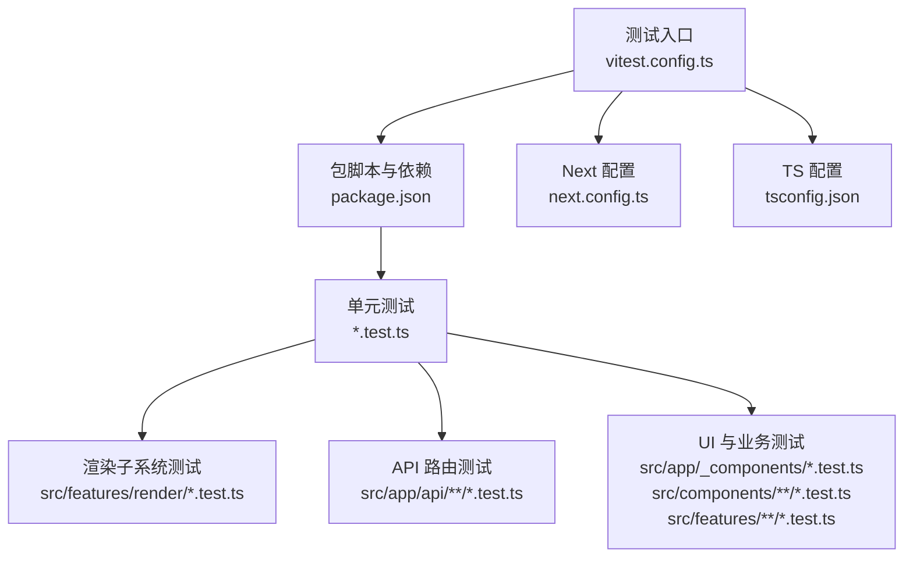
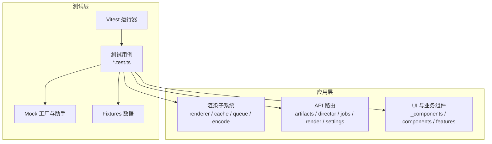
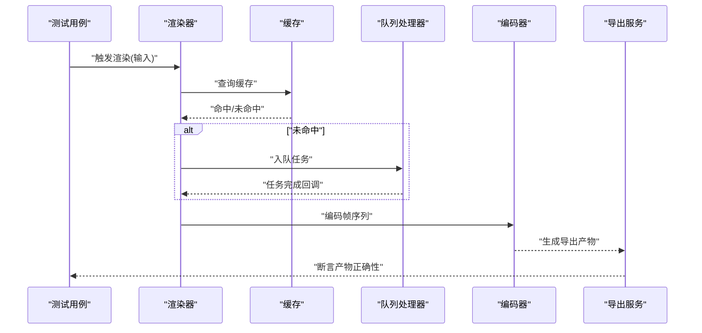
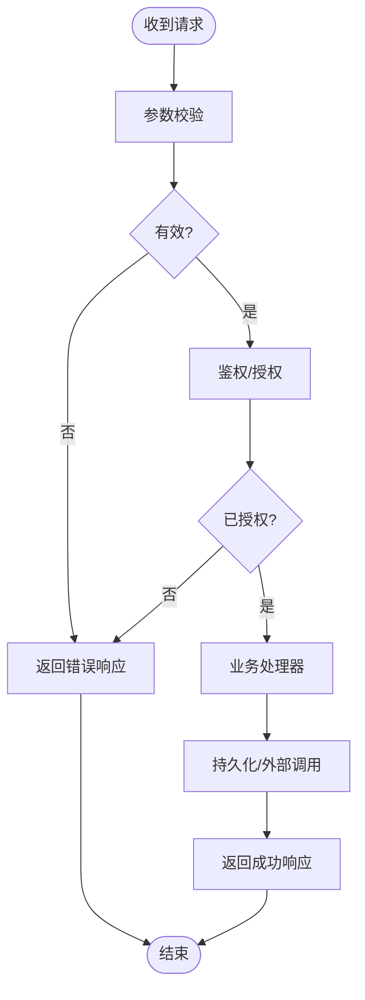
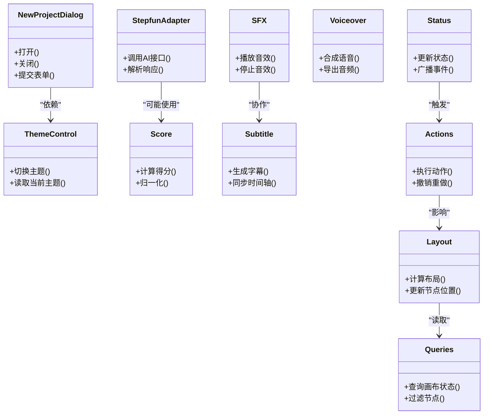
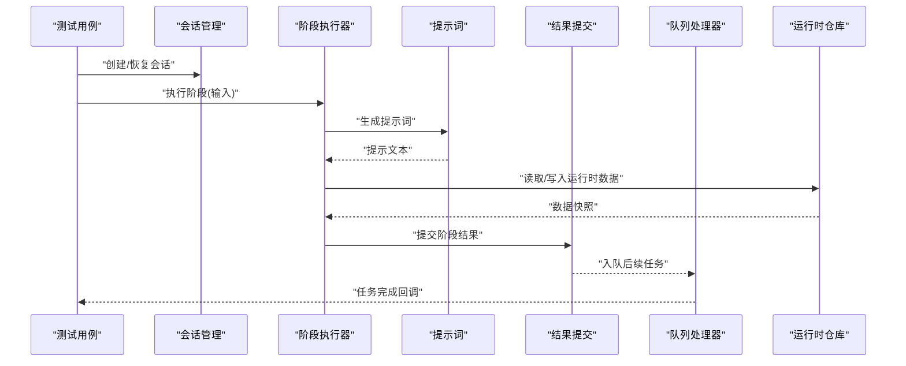
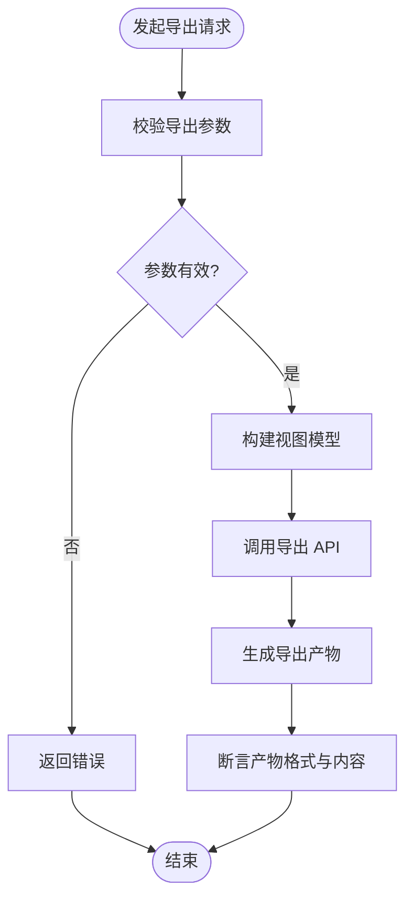
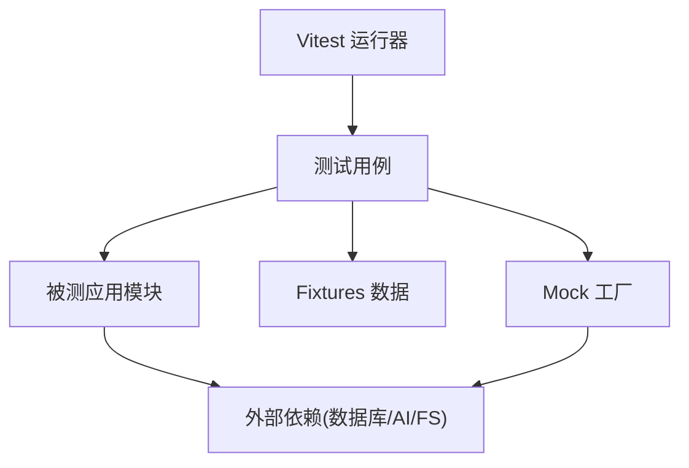

# 测试工具和辅助

<cite>
**本文引用的文件**   
- [vitest.config.ts](file://vitest.config.ts)
- [package.json](file://package.json)
- [next.config.ts](file://next.config.ts)
- [tsconfig.json](file://tsconfig.json)
- [src/features/render/renderer.test.ts](file://src/features/render/renderer.test.ts)
- [src/features/render/export-service.test.ts](file://src/features/render/export-service.test.ts)
- [src/features/render/queue-handler.test.ts](file://src/features/render/queue-handler.test.ts)
- [src/features/render/cache.test.ts](file://src/features/render/cache.test.ts)
- [src/features/render/frame-capture.test.ts](file://src/features/render/frame-capture.test.ts)
- [src/features/render/concat.test.ts](file://src/features/render/concat.test.ts)
- [src/features/render/encode.test.ts](file://src/features/render/encode.test.ts)
- [src/features/render/repository.test.ts](file://src/features/render/repository.test.ts)
- [src/app/canvas/canvas-action-api.test.ts](file://src/app/canvas/canvas-action-api.test.ts)
- [src/app/api/artifacts/[id]/route.test.ts](file://src/app/api/artifacts/[id]/route.test.ts)
- [src/app/api/director/stage/route.test.ts](file://src/app/api/director/stage/route.test.ts)
- [src/app/api/jobs/[id]/route.test.ts](file://src/app/api/jobs/[id]/route.test.ts)
- [src/app/api/projects/route.test.ts](file://src/app/api/projects/route.test.ts)
- [src/app/api/render/export/route.test.ts](file://src/app/api/render/export/route.test.ts)
- [src/app/api/render/route.test.ts](file://src/app/api/render/route.test.ts)
- [src/app/api/settings/route.test.ts](file://src/app/api/settings/route.test.ts)
- [src/app/_components/new-project-dialog.test.ts](file://src/app/_components/new-project-dialog.test.ts)
- [src/app/playbook/registry.test.ts](file://src/app/playbook/registry.test.ts)
- [src/components/ui/node/stage-colors.test.ts](file://src/components/ui/node/stage-colors.test.ts)
- [src/features/ai/stepfun-adapter.test.ts](file://src/features/ai/stepfun-adapter.test.ts)
- [src/features/audio/score.test.ts](file://src/features/audio/score.test.ts)
- [src/features/audio/sfx.test.ts](file://src/features/audio/sfx.test.ts)
- [src/features/audio/subtitle.test.ts](file://src/features/audio/subtitle.test.ts)
- [src/features/audio/voiceover.test.ts](file://src/features/audio/voiceover.test.ts)
- [src/features/canvas/actions.test.ts](file://src/features/canvas/actions.test.ts)
- [src/features/canvas/fan-out.test.ts](file://src/features/canvas/fan-out.test.ts)
- [src/features/canvas/layout.test.ts](file://src/features/canvas/layout.test.ts)
- [src/features/canvas/queries.test.ts](file://src/features/canvas/queries.test.ts)
- [src/features/canvas/status.test.ts](file://src/features/canvas/status.test.ts)
- [src/features/director/pi-session.test.ts](file://src/features/director/pi-session.test.ts)
- [src/features/director/queue-handler.test.ts](file://src/features/director/queue-handler.test.ts)
- [src/features/director/runtime-repository.test.ts](file://src/features/director/runtime-repository.test.ts)
- [src/features/director/session-store.test.ts](file://src/features/director/session-store.test.ts)
- [src/features/director/stage-prompt.test.ts](file://src/features/director/stage-prompt.test.ts)
- [src/features/director/stage-result.test.ts](file://src/features/director/stage-result.test.ts)
- [src/features/director/stage-runner.test.ts](file://src/features/director/stage-runner.test.ts)
- [src/features/director/startup-boundary.test.ts](file://src/features/director/startup-boundary.test.ts)
- [src/features/director/tools/check-determinism.test.ts](file://src/features/director/tools/check-determinism.test.ts)
- [src/features/director/tools/validate-shot-plan.test.ts](file://src/features/director/tools/validate-shot-plan.test.ts)
- [src/features/director/tools/write-artifact.test.ts](file://src/features/director/tools/write-artifact.test.ts)
- [src/features/navigation/app-shell.test.ts](file://src/features/navigation/app-shell.test.ts)
- [src/features/navigation/app-sidebar-shell.test.ts](file://src/features/navigation/app-sidebar-shell.test.ts)
- [src/app/canvas/export/export-api.test.ts](file://src/app/canvas/export/export-api.test.ts)
- [src/app/canvas/export/export-view-model.test.ts](file://src/app/canvas/export/export-view-model.test.ts)
- [src/app/canvas/shot/shot-api.test.ts](file://src/app/canvas/shot/shot-api.test.ts)
- [src/app/settings/theme-control.test.ts](file://src/app/settings/theme-control.test.ts)
</cite>

## 目录
1. [简介](#简介)
2. [项目结构](#项目结构)
3. [核心组件](#核心组件)
4. [架构总览](#架构总览)
5. [详细组件分析](#详细组件分析)
6. [依赖分析](#依赖分析)
7. [性能考虑](#性能考虑)
8. [故障排查指南](#故障排查指南)
9. [结论](#结论)
10. [附录](#附录)

## 简介
本文件为 CodeVideoCanvas 的“测试工具和辅助”文档，面向开发者与测试工程师，系统化说明如何在本仓库中编写、组织与执行测试。内容涵盖：
- 测试工具库使用方法：测试数据生成器、Mock 工厂、测试助手函数
- 固定数据（fixtures）管理与组织方式
- 性能测试工具：基准测试与压力测试实践
- 调试技巧与日志分析方法
- 测试环境配置与管理：环境变量、依赖服务模拟
- 测试脚本与自动化流程配置

本仓库采用 Vitest 作为统一测试框架，结合 Next.js 生态进行前后端一体化测试。测试用例广泛分布于功能模块与 API 路由中，便于快速定位问题并保障回归质量。

## 项目结构
测试相关的关键配置文件与用例分布如下：
- 测试框架与运行配置：vitest.config.ts、package.json、next.config.ts、tsconfig.json
- 单元测试与集成测试：各模块下的 *.test.ts 文件
- 渲染子系统测试：src/features/render/* 下包含渲染管线、缓存、队列、编码等测试
- API 层测试：src/app/api/* 下对路由进行请求级验证
- UI 与业务逻辑测试：src/app/_components、src/components、src/features 等

**图表来源**
- [vitest.config.ts](file://vitest.config.ts)
- [package.json](file://package.json)
- [next.config.ts](file://next.config.ts)
- [tsconfig.json](file://tsconfig.json)

**章节来源**
- [vitest.config.ts](file://vitest.config.ts)
- [package.json](file://package.json)
- [next.config.ts](file://next.config.ts)
- [tsconfig.json](file://tsconfig.json)

## 核心组件
本节聚焦测试基础设施与常用模式，帮助快速上手编写高质量测试。

- 测试框架与运行
  - 使用 Vitest 作为统一测试引擎，支持单元、集成与端到端场景
  - 通过 package.json 中的脚本命令启动测试、覆盖率与性能基准
  - 借助 next.config.ts 与 tsconfig.json 对齐运行时与类型检查行为

- 测试数据生成器与 Mock 工厂
  - 在测试文件中直接构造最小可用对象，避免对外部依赖的耦合
  - 将重复使用的数据结构抽取为工厂函数或常量，提升可读性与可维护性
  - 针对外部服务（如数据库、AI 适配器、文件系统）提供 Mock 实现，确保测试确定性

- 测试助手函数
  - 封装常见断言、等待策略、随机数据生成与校验逻辑
  - 统一错误处理与日志输出，便于定位失败原因

- 固定数据（fixtures）管理
  - 将稳定不变的输入输出样例集中存放，按模块划分目录
  - 命名规范建议以 .json 或 .html 等扩展名区分数据类型
  - 在测试中按需加载 fixtures，减少内存占用与初始化开销

**章节来源**
- [package.json](file://package.json)
- [vitest.config.ts](file://vitest.config.ts)
- [next.config.ts](file://next.config.ts)
- [tsconfig.json](file://tsconfig.json)

## 架构总览
下图展示了测试在系统中的位置与交互关系：测试驱动调用被测模块，必要时通过 Mock 替换外部依赖，最终通过断言验证结果。

[本图为概念性架构图，不直接映射具体源码文件]

## 详细组件分析

### 渲染子系统测试（src/features/render）
该模块覆盖渲染管线关键路径，包括渲染器、缓存、帧捕获、序列拼接、编码、导出服务与队列处理器等。测试重点在于：
- 渲染器在不同输入下的输出一致性
- 缓存命中与失效策略的正确性
- 帧捕获与序列生成的时序与边界条件
- 编码参数与导出服务的兼容性
- 队列任务调度与重试机制

**图表来源**
- [src/features/render/renderer.test.ts](file://src/features/render/renderer.test.ts)
- [src/features/render/cache.test.ts](file://src/features/render/cache.test.ts)
- [src/features/render/queue-handler.test.ts](file://src/features/render/queue-handler.test.ts)
- [src/features/render/encode.test.ts](file://src/features/render/encode.test.ts)
- [src/features/render/export-service.test.ts](file://src/features/render/export-service.test.ts)

**章节来源**
- [src/features/render/renderer.test.ts](file://src/features/render/renderer.test.ts)
- [src/features/render/export-service.test.ts](file://src/features/render/export-service.test.ts)
- [src/features/render/queue-handler.test.ts](file://src/features/render/queue-handler.test.ts)
- [src/features/render/cache.test.ts](file://src/features/render/cache.test.ts)
- [src/features/render/frame-capture.test.ts](file://src/features/render/frame-capture.test.ts)
- [src/features/render/concat.test.ts](file://src/features/render/concat.test.ts)
- [src/features/render/encode.test.ts](file://src/features/render/encode.test.ts)
- [src/features/render/repository.test.ts](file://src/features/render/repository.test.ts)

### API 路由测试（src/app/api）
API 层测试覆盖 artifacts、director stage、jobs、projects、render、settings 等路由。测试要点包括：
- 请求参数校验与错误响应
- 权限与鉴权流程（如有）
- 与后端服务或存储的交互（通过 Mock 隔离）
- 并发与幂等性验证

**图表来源**
- [src/app/api/artifacts/[id]/route.test.ts](file://src/app/api/artifacts/[id]/route.test.ts)
- [src/app/api/director/stage/route.test.ts](file://src/app/api/director/stage/route.test.ts)
- [src/app/api/jobs/[id]/route.test.ts](file://src/app/api/jobs/[id]/route.test.ts)
- [src/app/api/projects/route.test.ts](file://src/app/api/projects/route.test.ts)
- [src/app/api/render/export/route.test.ts](file://src/app/api/render/export/route.test.ts)
- [src/app/api/render/route.test.ts](file://src/app/api/render/route.test.ts)
- [src/app/api/settings/route.test.ts](file://src/app/api/settings/route.test.ts)

**章节来源**
- [src/app/api/artifacts/[id]/route.test.ts](file://src/app/api/artifacts/[id]/route.test.ts)
- [src/app/api/director/stage/route.test.ts](file://src/app/api/director/stage/route.test.ts)
- [src/app/api/jobs/[id]/route.test.ts](file://src/app/api/jobs/[id]/route.test.ts)
- [src/app/api/projects/route.test.ts](file://src/app/api/projects/route.test.ts)
- [src/app/api/render/export/route.test.ts](file://src/app/api/render/export/route.test.ts)
- [src/app/api/render/route.test.ts](file://src/app/api/render/route.test.ts)
- [src/app/api/settings/route.test.ts](file://src/app/api/settings/route.test.ts)

### UI 与业务组件测试（src/app/_components、src/components、src/features）
该部分覆盖对话框、状态控制、主题切换、导航壳层、AI 适配器、音频处理、画布动作与布局等。测试关注点：
- 用户交互与状态变化
- 副作用与异步操作（如网络请求、定时器）
- 边界条件与异常路径
- 可访问性与视觉一致性（如主题控制）

**图表来源**
- [src/app/_components/new-project-dialog.test.ts](file://src/app/_components/new-project-dialog.test.ts)
- [src/app/settings/theme-control.test.ts](file://src/app/settings/theme-control.test.ts)
- [src/features/ai/stepfun-adapter.test.ts](file://src/features/ai/stepfun-adapter.test.ts)
- [src/features/audio/score.test.ts](file://src/features/audio/score.test.ts)
- [src/features/audio/sfx.test.ts](file://src/features/audio/sfx.test.ts)
- [src/features/audio/subtitle.test.ts](file://src/features/audio/subtitle.test.ts)
- [src/features/audio/voiceover.test.ts](file://src/features/audio/voiceover.test.ts)
- [src/features/canvas/actions.test.ts](file://src/features/canvas/actions.test.ts)
- [src/features/canvas/layout.test.ts](file://src/features/canvas/layout.test.ts)
- [src/features/canvas/queries.test.ts](file://src/features/canvas/queries.test.ts)
- [src/features/canvas/status.test.ts](file://src/features/canvas/status.test.ts)

**章节来源**
- [src/app/_components/new-project-dialog.test.ts](file://src/app/_components/new-project-dialog.test.ts)
- [src/app/settings/theme-control.test.ts](file://src/app/settings/theme-control.test.ts)
- [src/features/ai/stepfun-adapter.test.ts](file://src/features/ai/stepfun-adapter.test.ts)
- [src/features/audio/score.test.ts](file://src/features/audio/score.test.ts)
- [src/features/audio/sfx.test.ts](file://src/features/audio/sfx.test.ts)
- [src/features/audio/subtitle.test.ts](file://src/features/audio/subtitle.test.ts)
- [src/features/audio/voiceover.test.ts](file://src/features/audio/voiceover.test.ts)
- [src/features/canvas/actions.test.ts](file://src/features/canvas/actions.test.ts)
- [src/features/canvas/layout.test.ts](file://src/features/canvas/layout.test.ts)
- [src/features/canvas/queries.test.ts](file://src/features/canvas/queries.test.ts)
- [src/features/canvas/status.test.ts](file://src/features/canvas/status.test.ts)

### 导演与工具链测试（src/features/director）
导演子系统涉及会话管理、阶段编排、提示词、结果提交、队列处理、运行时仓库与启动边界等。测试重点：
- 阶段执行顺序与依赖关系
- 提示词模板与参数注入
- 结果持久化与回滚
- 队列任务优先级与重试
- 启动边界条件与异常恢复

**图表来源**
- [src/features/director/pi-session.test.ts](file://src/features/director/pi-session.test.ts)
- [src/features/director/stage-runner.test.ts](file://src/features/director/stage-runner.test.ts)
- [src/features/director/stage-prompt.test.ts](file://src/features/director/stage-prompt.test.ts)
- [src/features/director/stage-result.test.ts](file://src/features/director/stage-result.test.ts)
- [src/features/director/queue-handler.test.ts](file://src/features/director/queue-handler.test.ts)
- [src/features/director/runtime-repository.test.ts](file://src/features/director/runtime-repository.test.ts)
- [src/features/director/session-store.test.ts](file://src/features/director/session-store.test.ts)
- [src/features/director/startup-boundary.test.ts](file://src/features/director/startup-boundary.test.ts)

**章节来源**
- [src/features/director/pi-session.test.ts](file://src/features/director/pi-session.test.ts)
- [src/features/director/stage-runner.test.ts](file://src/features/director/stage-runner.test.ts)
- [src/features/director/stage-prompt.test.ts](file://src/features/director/stage-prompt.test.ts)
- [src/features/director/stage-result.test.ts](file://src/features/director/stage-result.test.ts)
- [src/features/director/queue-handler.test.ts](file://src/features/director/queue-handler.test.ts)
- [src/features/director/runtime-repository.test.ts](file://src/features/director/runtime-repository.test.ts)
- [src/features/director/session-store.test.ts](file://src/features/director/session-store.test.ts)
- [src/features/director/startup-boundary.test.ts](file://src/features/director/startup-boundary.test.ts)

### 画布导出与镜头 API 测试（src/app/canvas）
画布导出与镜头 API 测试关注导出流程、视图模型转换与镜头数据的读写。测试要点：
- 导出参数的合法性与默认值
- 视图模型与导出格式的映射
- 镜头数据的完整性与一致性

**图表来源**
- [src/app/canvas/export/export-api.test.ts](file://src/app/canvas/export/export-api.test.ts)
- [src/app/canvas/export/export-view-model.test.ts](file://src/app/canvas/export/export-view-model.test.ts)
- [src/app/canvas/shot/shot-api.test.ts](file://src/app/canvas/shot/shot-api.test.ts)

**章节来源**
- [src/app/canvas/export/export-api.test.ts](file://src/app/canvas/export/export-api.test.ts)
- [src/app/canvas/export/export-view-model.test.ts](file://src/app/canvas/export/export-view-model.test.ts)
- [src/app/canvas/shot/shot-api.test.ts](file://src/app/canvas/shot/shot-api.test.ts)

### 其他测试模块
- 注册表测试（playbook registry）：验证组件注册与查找逻辑
- 节点颜色测试（stage colors）：验证颜色映射与主题适配
- 导航壳层测试（app shell / sidebar shell）：验证布局与路由联动

**章节来源**
- [src/app/playbook/registry.test.ts](file://src/app/playbook/registry.test.ts)
- [src/components/ui/node/stage-colors.test.ts](file://src/components/ui/node/stage-colors.test.ts)
- [src/features/navigation/app-shell.test.ts](file://src/features/navigation/app-shell.test.ts)
- [src/features/navigation/app-sidebar-shell.test.ts](file://src/features/navigation/app-sidebar-shell.test.ts)

## 依赖分析
测试与应用的依赖关系如下：
- 测试层依赖 Vitest 运行器与 Node 环境
- 应用层被测试模块通过导入暴露接口供测试调用
- Mock 与 fixtures 作为测试层的支撑，降低对外部系统的耦合

[本图为概念性依赖图，不直接映射具体源码文件]

**章节来源**
- [vitest.config.ts](file://vitest.config.ts)
- [package.json](file://package.json)

## 性能考虑
- 基准测试
  - 使用 Vitest 的基准能力对关键路径（如渲染、编码、队列调度）进行性能测量
  - 设置合理的迭代次数与预热轮次，避免冷启动偏差
  - 对比不同参数组合的性能差异，识别瓶颈

- 压力测试
  - 模拟高并发请求对 API 路由进行压测，观察吞吐与延迟
  - 对渲染队列进行负载注入，验证任务调度与资源释放
  - 监控内存与 CPU 使用率，防止泄漏与抖动

- 优化建议
  - 缓存热点数据，减少重复计算
  - 批量处理与流水线并行，提高吞吐
  - 限制并发度，避免资源争用

[本节为通用指导，不直接分析具体文件]

## 故障排查指南
- 常见问题
  - 测试环境不一致：确保 vitest.config.ts 与 tsconfig.json 配置一致
  - Mock 未生效：检查导入路径与作用域，确认替换时机
  - 异步超时：调整等待策略与超时阈值，避免竞态条件
  - 资源泄漏：清理定时器、监听器与临时文件

- 调试技巧
  - 使用控制台日志与断点定位失败路径
  - 缩小测试范围，逐步隔离问题模块
  - 打印关键中间状态，验证数据流转

- 日志分析
  - 统一日志格式，便于检索与聚合
  - 区分信息、警告与错误级别，避免噪音
  - 记录上下文信息（请求 ID、用户 ID、时间戳）

[本节为通用指导，不直接分析具体文件]

## 结论
通过统一的 Vitest 测试框架与完善的 Mock、fixtures 与助手函数，CodeVideoCanvas 实现了从渲染到 API 的全链路测试覆盖。建议在持续集成中引入性能基准与压力测试，配合日志与监控，进一步提升稳定性与可观测性。

[本节为总结，不直接分析具体文件]

## 附录
- 测试脚本与环境变量
  - 在 package.json 中定义测试脚本，便于本地与 CI 执行
  - 使用环境变量控制测试行为（如启用/禁用外部依赖、调整并发度）

- 依赖服务模拟
  - 使用内存数据库或文件系统进行替代
  - Mock AI 适配器与网络请求，确保测试确定性

- 自动化流程
  - 在 CI 中配置测试步骤，自动运行单元与集成测试
  - 生成覆盖率报告与性能基线，纳入质量门禁

[本节为通用指导，不直接分析具体文件]