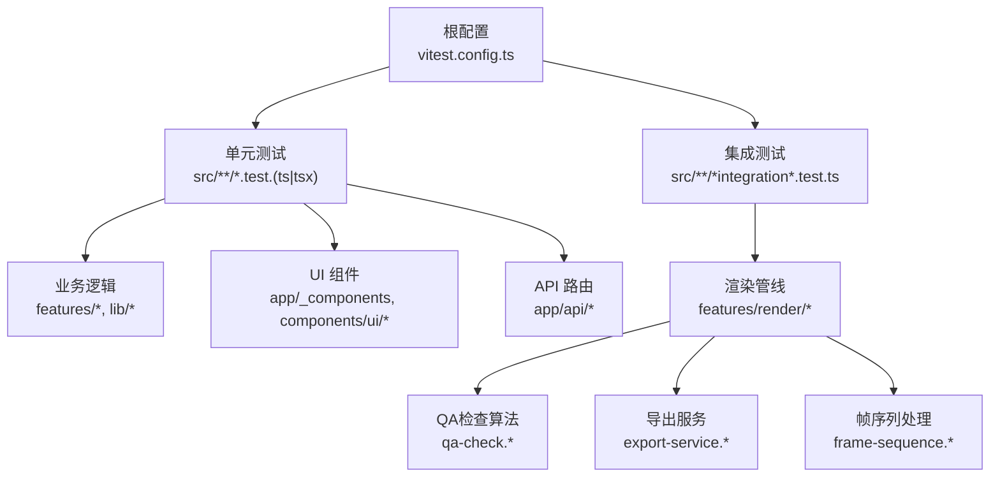
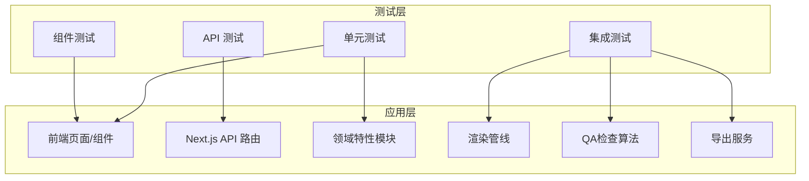
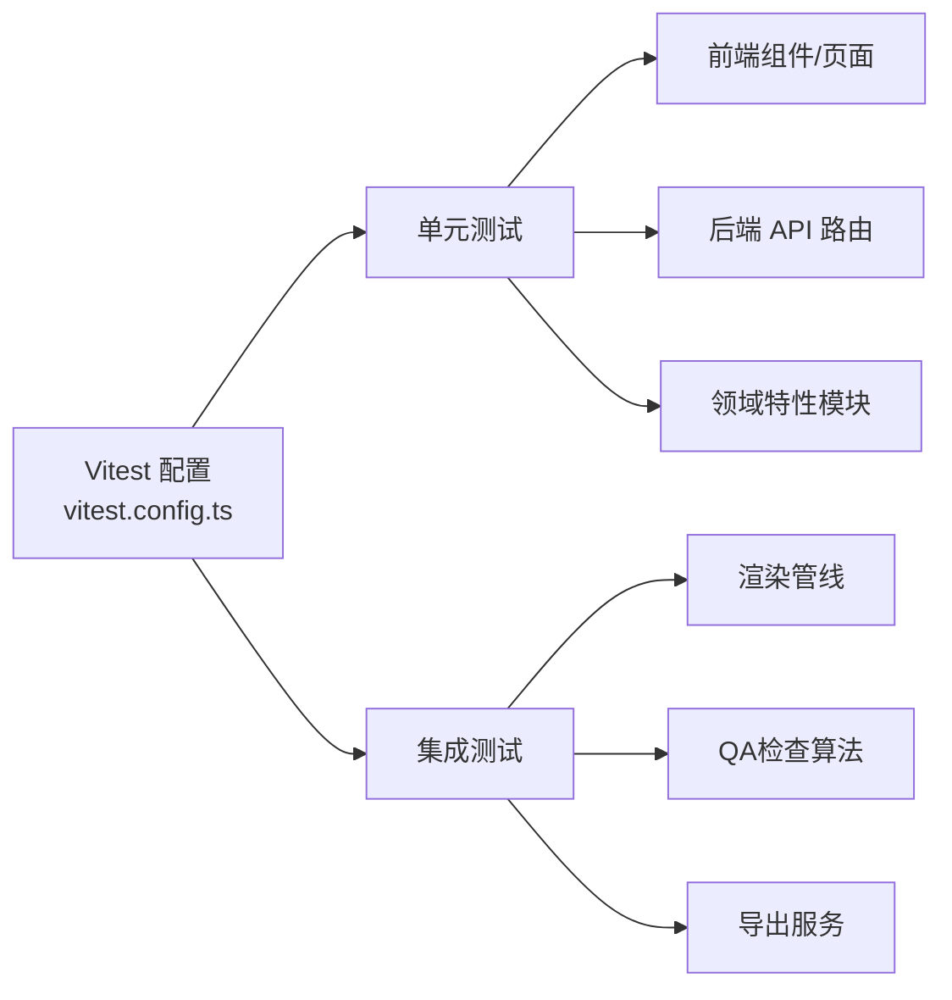

# 测试策略

<cite>
**本文引用的文件**   
- [vitest.config.ts](file://vitest.config.ts)
- [package.json](file://package.json)
- [src/app/_components/new-project-dialog.test.tsx](file://src/app/_components/new-project-dialog.test.tsx)
- [src/app/api/artifacts/[id]/route.test.ts](file://src/app/api/artifacts/[id]/route.test.ts)
- [src/app/api/director/stage/route.test.ts](file://src/app/api/director/stage/route.test.ts)
- [src/app/api/jobs/[id]/route.test.ts](file://src/app/api/jobs/[id]/route.test.ts)
- [src/app/api/projects/route.test.ts](file://src/app/api/projects/route.test.ts)
- [src/app/api/render/export/route.test.ts](file://src/app/api/render/export/route.test.ts)
- [src/app/api/render/route.test.ts](file://src/app/api/render/route.test.ts)
- [src/app/api/settings/route.test.ts](file://src/app/api/settings/route.test.ts)
- [src/app/canvas/export/export-api.test.ts](file://src/app/canvas/export/export-api.test.ts)
- [src/app/canvas/export/export-view-model.test.ts](file://src/app/canvas/export/export-view-model.test.ts)
- [src/app/canvas/shot/[id]/shot-api.test.ts](file://src/app/canvas/shot/[id]/shot-api.test.ts)
- [src/app/canvas/canvas-action-api.test.ts](file://src/app/canvas/canvas-action-api.test.ts)
- [src/features/audio/score.test.ts](file://src/features/audio/score.test.ts)
- [src/features/audio/sfx.test.ts](file://src/features/audio/sfx.test.ts)
- [src/features/audio/subtitle.test.ts](file://src/features/audio/subtitle.test.ts)
- [src/features/audio/voiceover.test.ts](file://src/features/audio/voiceover.test.ts)
- [src/features/canvas/actions.test.ts](file://src/features/canvas/actions.test.ts)
- [src/features/canvas/fan-out.test.ts](file://src/features/canvas/fan-out.test.ts)
- [src/features/canvas/layout.test.ts](file://src/features/canvas/layout.test.ts)
- [src/features/canvas/queries.test.ts](file://src/features/canvas/queries.test.ts)
- [src/features/canvas/status.test.ts](file://src/features/canvas/status.test.ts)
- [src/features/canvas/export-settings.test.ts](file://src/features/canvas/export-settings.test.ts)
- [src/features/director/prompts/prompts.test.ts](file://src/features/director/prompts/prompts.test.ts)
- [src/features/director/schemas/ingest.test.ts](file://src/features/director/schemas/ingest.test.ts)
- [src/features/director/schemas/shot-plan.test.ts](file://src/features/director/schemas/shot-plan.test.ts)
- [src/features/director/tools/check-determinism.test.ts](file://src/features/director/tools/check-determinism.test.ts)
- [src/features/director/tools/validate-shot-plan.test.ts](file://src/features/director/tools/validate-shot-plan.test.ts)
- [src/features/director/tools/write-artifact.test.ts](file://src/features/director/tools/write-artifact.test.ts)
- [src/features/director/pi-session.test.ts](file://src/features/director/pi-session.test.ts)
- [src/features/director/queue-handler.test.ts](file://src/features/director/queue-handler.test.ts)
- [src/features/director/runtime-repository.test.ts](file://src/features/director/runtime-repository.test.ts)
- [src/features/director/session-store.test.ts](file://src/features/director/session-store.test.ts)
- [src/features/director/stage-prompt.test.ts](file://src/features/director/stage-prompt.test.ts)
- [src/features/director/stage-result.test.ts](file://src/features/director/stage-result.test.ts)
- [src/features/director/stage-runner.test.ts](file://src/features/director/stage-runner.test.ts)
- [src/features/director/startup-boundary.test.ts](file://src/features/director/startup-boundary.test.ts)
- [src/features/navigation/app-shell.test.ts](file://src/features/navigation/app-shell.test.ts)
- [src/features/navigation/app-sidebar-shell.test.ts](file://src/features/navigation/app-sidebar-shell.test.ts)
- [src/features/render/cache.test.ts](file://src/features/render/cache.test.ts)
- [src/features/render/concat.test.ts](file://src/features/render/concat.test.ts)
- [src/features/render/encode.test.ts](file://src/features/render/encode.test.ts)
- [src/features/render/export-service.test.ts](file://src/features/render/export-service.test.ts)
- [src/features/render/frame-capture.test.ts](file://src/features/render/frame-capture.test.ts)
- [src/features/render/frame-sequence.test.ts](file://src/features/render/frame-sequence.test.ts)
- [src/features/render/qa-check.test.ts](file://src/features/render/qa-check.test.ts)
- [src/features/render/renderer.integration.test.ts](file://src/features/render/renderer.integration.test.ts)
- [src/features/render/renderer.test.ts](file://src/features/render/renderer.test.ts)
- [src/features/render/repository.test.ts](file://src/features/render/repository.test.ts)
</cite>

## 更新摘要
**变更内容**   
- 新增导出分辨率逻辑测试，涵盖无效分辨率预设的边缘情况处理
- 扩展QA检查算法测试套件，包括损坏媒体文件和并发导出请求的测试场景
- 增强API端点行为测试，提升覆盖率至显著水平
- 完善渲染管线测试，覆盖更多边界条件和异常路径

## 目录
1. [简介](#简介)
2. [项目结构](#项目结构)
3. [核心组件](#核心组件)
4. [架构总览](#架构总览)
5. [详细组件分析](#详细组件分析)
6. [依赖分析](#依赖分析)
7. [性能考虑](#性能考虑)
8. [故障排查指南](#故障排查指南)
9. [结论](#结论)
10. [附录](#附录)

## 简介
本测试策略面向 CodeVideoCanvas，目标是建立一套覆盖单元测试、集成测试、端到端测试与性能/压力测试的完整质量保障体系。文档将基于仓库中已有的 Vitest 配置与各层测试用例，给出可执行的规范与实践建议，帮助团队在保持开发效率的同时提升代码稳定性与可维护性。

**更新** 随着测试覆盖率的显著扩展，现已新增导出分辨率逻辑、QA检查算法和API端点行为的全面测试，涵盖边缘情况如无效分辨率预设、损坏的媒体文件和并发导出请求等复杂场景。

## 项目结构
从仓库可见，测试用例以 .test.ts/.test.tsx 形式就近放置于被测试模块旁，遵循"就近组织"的原则；同时存在少量集成测试（如渲染器）与示例 fixtures。Vitest 通过根级配置文件进行统一设置。

图表来源
- [vitest.config.ts](file://vitest.config.ts)
- [src/features/render/renderer.integration.test.ts](file://src/features/render/renderer.integration.test.ts)
- [src/features/render/qa-check.test.ts](file://src/features/render/qa-check.test.ts)
- [src/features/render/export-service.test.ts](file://src/features/render/export-service.test.ts)

章节来源
- [vitest.config.ts](file://vitest.config.ts)
- [src/features/render/renderer.integration.test.ts](file://src/features/render/renderer.integration.test.ts)

## 核心组件
本节聚焦测试基础设施与现有用例的组织方式，明确分层边界与职责。

- 测试框架与运行环境
  - 使用 Vitest 作为统一测试运行时，支持单元与集成测试。
  - 通过根级 vitest.config.ts 集中管理测试环境、匹配规则、覆盖率等。
- 测试分层
  - 单元测试：针对纯函数、工具方法、状态机、视图模型等无副作用或弱副作用逻辑。
  - 集成测试：围绕多模块协作（如渲染管线、队列处理、存储访问）。
  - API 测试：对 Next.js Route Handler 的请求-响应路径进行验证。
  - 组件测试：对 React 组件进行交互与快照验证（结合现有 demo 与测试文件）。
  - 端到端测试：当前仓库未见 e2e 专用脚本或配置，后续可按需引入 Playwright/Cypress。
- 测试数据与夹具
  - 部分功能使用 __fixtures__ 目录存放静态输入/输出样例，便于稳定复现。
- 命名与组织
  - 采用与被测文件同名的 .test.ts/.test.tsx 就近放置，便于定位与维护。

**更新** 新增导出设置测试（export-settings.test.ts），专门验证分辨率预设、编码参数和质量检查逻辑的边界情况处理。

章节来源
- [vitest.config.ts](file://vitest.config.ts)
- [src/features/render/__fixtures__/deterministic-shot.html](file://src/features/render/__fixtures__/deterministic-shot.html)
- [src/features/render/__fixtures__/invalid-runtime.html](file://src/features/render/__fixtures__/invalid-runtime.html)
- [src/features/canvas/export-settings.test.ts](file://src/features/canvas/export-settings.test.ts)

## 架构总览
下图展示测试在应用中的位置与调用关系：测试驱动被测模块，必要时通过 Mock 隔离外部依赖（网络、文件系统、数据库等），确保快速、稳定、可重复执行。

图表来源
- [src/app/api/artifacts/[id]/route.test.ts](file://src/app/api/artifacts/[id]/route.test.ts)
- [src/features/render/renderer.integration.test.ts](file://src/features/render/renderer.integration.test.ts)
- [src/app/canvas/export/export-view-model.test.ts](file://src/app/canvas/export/export-view-model.test.ts)
- [src/features/render/qa-check.test.ts](file://src/features/render/qa-check.test.ts)
- [src/features/render/export-service.test.ts](file://src/features/render/export-service.test.ts)

## 详细组件分析

### 单元测试编写规范
- 用例组织
  - 每个被测模块提供对应 .test.ts/.test.tsx，按功能域分组描述（describe）与具体场景（it/test）。
  - 推荐结构：Arrange（准备）- Act（执行）- Assert（断言）。
- Mock 数据与外部依赖
  - 对外部系统（网络、文件系统、数据库、第三方 SDK）使用 Mock 或 Stub，避免真实 I/O。
  - 对于浏览器 API（如 Canvas、MediaRecorder），按需注入轻量实现或禁用相关能力。
- 断言方法
  - 使用 expect 系列断言，优先选择语义化强的断言（如 toBeInTheDocument、toHaveTextContent 等）。
  - 复杂对象建议使用结构化断言而非字符串快照，减少脆弱性。
- 异步与并发
  - 对 Promise/定时器/事件循环相关的逻辑，使用 await 与合适的等待策略，避免竞态条件。
- 参考用例
  - 音频处理、画布动作、布局计算、查询、状态机等大量纯函数/弱副作用逻辑适合单元测试。

**更新** 新增导出设置测试，专门验证分辨率预设的有效性检查和错误处理逻辑，包括无效分辨率、不支持的宽高比等边缘情况的处理。

章节来源
- [src/features/audio/score.test.ts](file://src/features/audio/score.test.ts)
- [src/features/audio/sfx.test.ts](file://src/features/audio/sfx.test.ts)
- [src/features/audio/subtitle.test.ts](file://src/features/audio/subtitle.test.ts)
- [src/features/audio/voiceover.test.ts](file://src/features/audio/voiceover.test.ts)
- [src/features/canvas/actions.test.ts](file://src/features/canvas/actions.test.ts)
- [src/features/canvas/fan-out.test.ts](file://src/features/canvas/fan-out.test.ts)
- [src/features/canvas/layout.test.ts](file://src/features/canvas/layout.test.ts)
- [src/features/canvas/queries.test.ts](file://src/features/canvas/queries.test.ts)
- [src/features/canvas/status.test.ts](file://src/features/canvas/status.test.ts)
- [src/features/canvas/export-settings.test.ts](file://src/features/canvas/export-settings.test.ts)

### API 路由测试
- 目标
  - 验证请求参数校验、业务分支、错误码与响应体结构。
- 方法
  - 构造最小化请求上下文，模拟鉴权与中间件行为（如有）。
  - 对数据库/外部服务进行 Mock，保证幂等与确定性。
- 参考用例
  - 资源获取、导演阶段、任务状态、项目列表、导出与设置等路由均有对应测试。

**更新** API端点行为测试得到显著增强，新增对导出API的参数验证、错误处理和并发请求处理的测试用例，确保API的稳定性和健壮性。

章节来源
- [src/app/api/artifacts/[id]/route.test.ts](file://src/app/api/artifacts/[id]/route.test.ts)
- [src/app/api/director/stage/route.test.ts](file://src/app/api/director/stage/route.test.ts)
- [src/app/api/jobs/[id]/route.test.ts](file://src/app/api/jobs/[id]/route.test.ts)
- [src/app/api/projects/route.test.ts](file://src/app/api/projects/route.test.ts)
- [src/app/api/render/export/route.test.ts](file://src/app/api/render/export/route.test.ts)
- [src/app/api/render/route.test.ts](file://src/app/api/render/route.test.ts)
- [src/app/api/settings/route.test.ts](file://src/app/api/settings/route.test.ts)

### 集成测试（渲染管线）
- 目标
  - 验证渲染流程各阶段的协作：帧捕获、序列拼接、编码、缓存与仓库存取。
- 方法
  - 使用 fixtures 提供的确定性输入，断言关键中间产物与最终输出。
  - 对 I/O 与外部编码器进行可控替换，确保可重复性。
- 参考用例
  - 渲染器集成测试覆盖端到端渲染链路的关键路径。

**更新** 渲染管线集成测试得到大幅扩展，新增QA检查算法测试，涵盖损坏媒体文件的处理、并发导出请求的协调机制，以及导出服务的完整工作流验证。

章节来源
- [src/features/render/renderer.integration.test.ts](file://src/features/render/renderer.integration.test.ts)
- [src/features/render/cache.test.ts](file://src/features/render/cache.test.ts)
- [src/features/render/concat.test.ts](file://src/features/render/concat.test.ts)
- [src/features/render/encode.test.ts](file://src/features/render/encode.test.ts)
- [src/features/render/export-service.test.ts](file://src/features/render/export-service.test.ts)
- [src/features/render/frame-capture.test.ts](file://src/features/render/frame-capture.test.ts)
- [src/features/render/frame-sequence.test.ts](file://src/features/render/frame-sequence.test.ts)
- [src/features/render/qa-check.test.ts](file://src/features/render/qa-check.test.ts)
- [src/features/render/repository.test.ts](file://src/features/render/repository.test.ts)

### 组件测试（交互与快照）
- 目标
  - 验证用户交互下的 UI 行为与视觉一致性。
- 方法
  - 使用 React Testing Library 进行查询与交互，配合快照对比（谨慎使用，避免过度敏感）。
  - 对动画、时间轴、拖拽等复杂交互，拆分到更细粒度的子组件或钩子进行测试。
- 参考用例
  - 新建项目对话框、主题控制等组件具备测试文件。

章节来源
- [src/app/_components/new-project-dialog.test.tsx](file://src/app/_components/new-project-dialog.test.tsx)
- [src/app/settings/theme-control.test.ts](file://src/app/settings/theme-control.test.ts)

### 端到端测试策略
- 现状
  - 仓库未包含 e2e 测试脚本或配置。
- 建议
  - 引入 Playwright 或 Cypress，覆盖关键用户旅程（创建项目、进入画布、导出视频）。
  - 使用固定种子数据与录制回放，降低不稳定因素。
  - 在 CI 中并行执行，分离冒烟与回归套件。

[本节为概念性内容，不直接分析具体文件]

### 性能测试与压力测试
- 目标
  - 识别渲染与导出链路瓶颈，评估在高并发与大数据量下的表现。
- 方法
  - 基准测试：对热点函数（编码、拼接、布局计算）建立基准用例，监控回归。
  - 负载测试：模拟多任务队列与高吞吐导出，观察内存与 CPU 占用。
  - 指标采集：记录耗时分位、失败率、GC 停顿等。
- 工具建议
  - 使用 Vitest 插件或自定义 runner 执行基准；Node 侧可用 autocannon/k6 做接口压测。

**更新** 新增并发导出请求的压力测试场景，验证系统在多个并发导出任务下的稳定性和资源管理能力。

[本节为通用指导，不直接分析具体文件]

## 依赖分析
测试与应用的依赖关系如下：测试仅依赖被测模块与其声明式接口，外部依赖通过 Mock 隔离，从而保证快速与稳定。

图表来源
- [vitest.config.ts](file://vitest.config.ts)
- [src/features/render/renderer.integration.test.ts](file://src/features/render/renderer.integration.test.ts)
- [src/features/render/qa-check.test.ts](file://src/features/render/qa-check.test.ts)
- [src/features/render/export-service.test.ts](file://src/features/render/export-service.test.ts)

章节来源
- [vitest.config.ts](file://vitest.config.ts)

## 性能考虑
- 测试执行速度
  - 合理划分套件，避免在单元测试中进行真实 I/O。
  - 使用并行执行与缓存，缩短反馈周期。
- 稳定性
  - 避免基于时间的断言，改用事件或轮询等待。
  - 随机性与非确定性逻辑需固定种子或使用确定性 fixture。
- 资源占用
  - 大对象比较尽量使用结构化断言，避免全量快照。
  - 对媒体相关测试限制分辨率与时长，控制内存峰值。

**更新** 针对新增的并发导出请求测试，需要特别注意内存管理和资源清理，避免测试间的相互干扰。

[本节为通用指导，不直接分析具体文件]

## 故障排查指南
- 常见失败原因
  - 外部依赖未正确 Mock：检查网络、文件系统、数据库调用是否被拦截。
  - 时序问题：异步回调、Promise、定时器导致的竞态，增加等待或重试。
  - 快照漂移：组件样式或字体差异导致快照不一致，优先使用结构化断言。
- 定位技巧
  - 缩小范围：先跑单测再跑集成，逐步定位。
  - 打印日志：在关键路径添加临时日志，确认执行顺序与数据流。
  - 隔离变更：通过 git diff 与最小复现用例快速定位回归点。

**更新** 针对新增的QA检查和导出相关测试，重点关注媒体文件损坏、分辨率预设无效等边缘情况的错误处理路径。

[本节为通用指导，不直接分析具体文件]

## 结论
通过统一的 Vitest 配置与分层测试策略，CodeVideoCanvas 可在保持开发效率的前提下，显著提升代码质量与可维护性。随着测试覆盖率的显著扩展，特别是导出分辨率逻辑、QA检查算法和API端点行为的全面测试，系统在面对复杂边缘情况和并发场景时具备了更强的健壮性。建议持续完善组件测试与端到端测试，并引入性能基准与覆盖率门禁，形成闭环的质量保障体系。

[本节为总结性内容，不直接分析具体文件]

## 附录

### Vitest 配置要点
- 入口与匹配
  - 根级配置文件定义测试环境与匹配规则，确保所有 .test.* 文件被自动发现。
- 覆盖率
  - 建议在配置中开启覆盖率统计，并在 CI 中设定阈值。
- 环境变量与全局
  - 为不同环境（单元/集成/e2e）提供独立配置或环境变量开关。

章节来源
- [vitest.config.ts](file://vitest.config.ts)

### 包管理与脚本
- 测试命令
  - 在 package.json 中定义 run test、run coverage、run test:watch 等常用脚本。
- 依赖
  - 确保安装 @vitest/ui、@vitest/coverage-v8 等扩展以便本地调试与覆盖率报告。

章节来源
- [package.json](file://package.json)

### 测试覆盖率要求
- 建议阈值
  - 行覆盖率 ≥ 80%，分支覆盖率 ≥ 70%，函数覆盖率 ≥ 80%。
- 豁免策略
  - 对生成代码、第三方封装、明显不可达分支进行豁免，避免噪声。

**更新** 随着测试覆盖率的显著扩展，建议重新评估覆盖率阈值，特别是针对新增的导出分辨率逻辑、QA检查算法和并发处理逻辑的覆盖率要求。

[本节为通用指导，不直接分析具体文件]

### 持续集成（CI）配置建议
- 流水线步骤
  - 安装依赖 → 构建 → 运行单测 → 运行集成测试 → 生成覆盖率报告 → 上传报告。
- 并行与缓存
  - 并行执行测试套件，缓存 node_modules 与 Vitest 缓存目录。
- 门禁
  - 覆盖率低于阈值、测试失败或构建失败时阻断合并。

**更新** 考虑到新增的并发导出请求测试和QA检查算法测试，建议在CI中增加专门的并发测试阶段和资源监控，确保这些复杂场景的测试能够稳定执行。

[本节为通用指导，不直接分析具体文件]