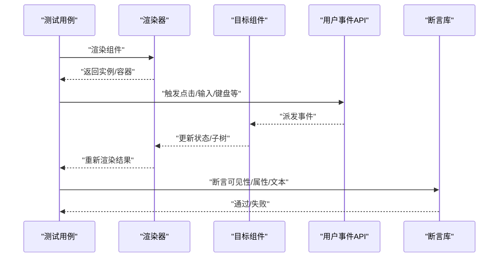
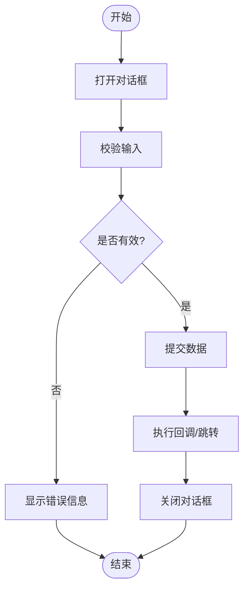
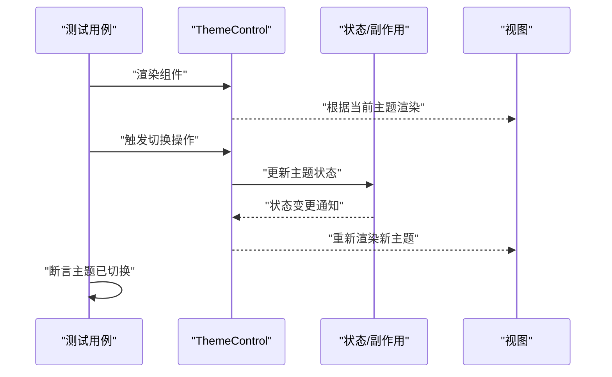
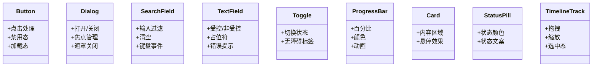
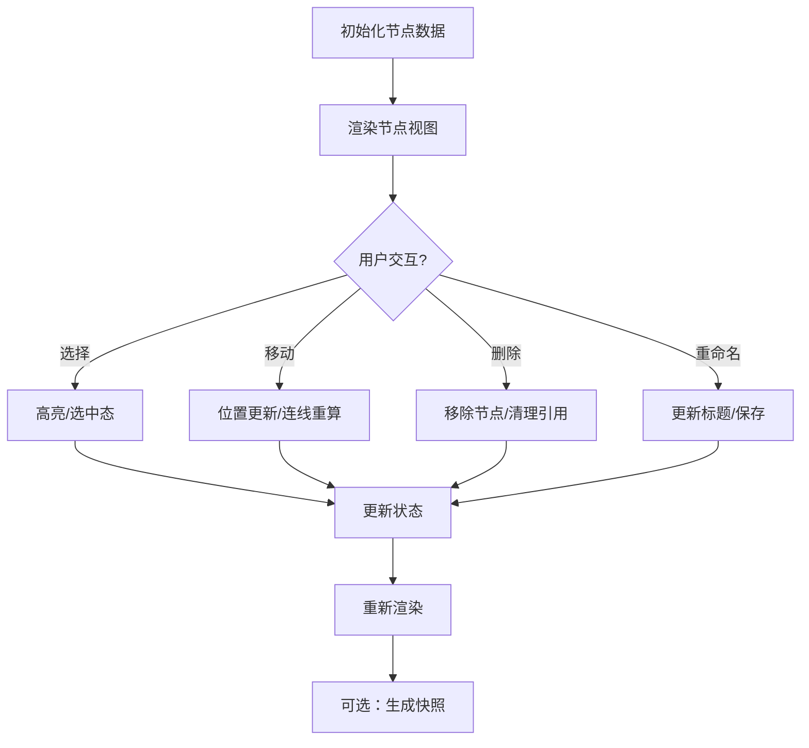
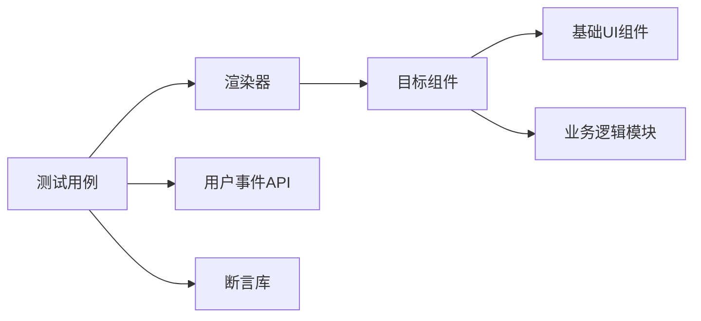

# 组件测试

<cite>
**本文引用的文件**   
- [new-project-dialog.test.ts](file://src/app/_components/new-project-dialog.test.ts)
- [new-project-dialog.tsx](file://src/app/_components/new-project-dialog.tsx)
- [theme-control.test.ts](file://src/app/settings/theme-control.test.ts)
- [theme-control.tsx](file://src/app/settings/theme-control.tsx)
- [button.demo.tsx](file://src/components/ui/button.demo.tsx)
- [button.tsx](file://src/components/ui/button.tsx)
- [dialog.demo.tsx](file://src/components/ui/dialog.demo.tsx)
- [dialog.tsx](file://src/components/ui/dialog.tsx)
- [search-field.demo.tsx](file://src/components/ui/search-field.demo.tsx)
- [text-field.demo.tsx](file://src/components/ui/text-field.demo.tsx)
- [toggle.demo.tsx](file://src/components/ui/toggle.demo.tsx)
- [progress-bar.demo.tsx](file://src/components/ui/progress-bar.demo.tsx)
- [card.demo.tsx](file://src/components/ui/card.demo.tsx)
- [status-pill.demo.tsx](file://src/components/ui/status-pill.demo.tsx)
- [timeline-track.demo.tsx](file://src/components/ui/timeline-track.demo.tsx)
- [stage-node.demo.tsx](file://src/components/ui/node/stage-node.demo.tsx)
- [audio-node.demo.tsx](file://src/components/ui/node/audio-node.demo.tsx)
- [export-node.demo.tsx](file://src/components/ui/node/export-node.demo.tsx)
- [shot-node.demo.tsx](file://src/components/ui/node/shot-node.demo.tsx)
</cite>

## 目录
1. [简介](#简介)
2. [项目结构](#项目结构)
3. [核心组件](#核心组件)
4. [架构总览](#架构总览)
5. [详细组件分析](#详细组件分析)
6. [依赖分析](#依赖分析)
7. [性能考虑](#性能考虑)
8. [故障排查指南](#故障排查指南)
9. [结论](#结论)
10. [附录](#附录)

## 简介
本文件面向 CodeVideoCanvas 的 React 组件测试，聚焦于用户交互、状态变化与事件处理的测试策略与方法。文档基于仓库中已有的单元测试与演示（demo）文件，总结 Testing Library 的查询方法、用户行为模拟与断言技巧，并给出复杂组件（图表、表单、模态框）的测试模式与快照测试最佳实践。目标是帮助团队建立稳定、可维护且可读性强的前端测试体系。

## 项目结构
仓库采用按功能域与页面组织的方式，组件位于 src/components/ui 与 src/components/ui/node 等目录；每个 UI 组件通常配有对应的 .demo.tsx 用于可视化展示与开发期验证；部分业务组件在 app 目录下包含独立的 .test.ts 文件进行交互与状态测试。

```mermaid
graph TB
subgraph "应用层"
A["app/_components/new-project-dialog.test.ts"]
B["app/settings/theme-control.test.ts"]
end
subgraph "UI 组件"
C["components/ui/button.tsx / button.demo.tsx"]
D["components/ui/dialog.tsx / dialog.demo.tsx"]
E["components/ui/search-field.demo.tsx"]
F["components/ui/text-field.demo.tsx"]
G["components/ui/toggle.demo.tsx"]
H["components/ui/progress-bar.demo.tsx"]
I["components/ui/card.demo.tsx"]
J["components/ui/status-pill.demo.tsx"]
K["components/ui/timeline-track.demo.tsx"]
end
subgraph "节点组件"
L["components/ui/node/stage-node.demo.tsx"]
M["components/ui/node/audio-node.demo.tsx"]
N["components/ui/node/export-node.demo.tsx"]
O["components/ui/node/shot-node.demo.tsx"]
end
A --> C
A --> D
B --> C
B --> G
E --> C
F --> C
H --> C
I --> C
J --> C
K --> C
L --> C
M --> C
N --> C
O --> C
```

图示来源
- [new-project-dialog.test.ts:1-200](file://src/app/_components/new-project-dialog.test.ts#L1-L200)
- [theme-control.test.ts:1-200](file://src/app/settings/theme-control.test.ts#L1-L200)
- [button.demo.tsx:1-200](file://src/components/ui/button.demo.tsx#L1-L200)
- [dialog.demo.tsx:1-200](file://src/components/ui/dialog.demo.tsx#L1-L200)
- [search-field.demo.tsx:1-200](file://src/components/ui/search-field.demo.tsx#L1-L200)
- [text-field.demo.tsx:1-200](file://src/components/ui/text-field.demo.tsx#L1-L200)
- [toggle.demo.tsx:1-200](file://src/components/ui/toggle.demo.tsx#L1-L200)
- [progress-bar.demo.tsx:1-200](file://src/components/ui/progress-bar.demo.tsx#L1-L200)
- [card.demo.tsx:1-200](file://src/components/ui/card.demo.tsx#L1-L200)
- [status-pill.demo.tsx:1-200](file://src/components/ui/status-pill.demo.tsx#L1-L200)
- [timeline-track.demo.tsx:1-200](file://src/components/ui/timeline-track.demo.tsx#L1-L200)
- [stage-node.demo.tsx:1-200](file://src/components/ui/node/stage-node.demo.tsx#L1-L200)
- [audio-node.demo.tsx:1-200](file://src/components/ui/node/audio-node.demo.tsx#L1-L200)
- [export-node.demo.tsx:1-200](file://src/components/ui/node/export-node.demo.tsx#L1-L200)
- [shot-node.demo.tsx:1-200](file://src/components/ui/node/shot-node.demo.tsx#L1-L200)

章节来源
- [new-project-dialog.test.ts:1-200](file://src/app/_components/new-project-dialog.test.ts#L1-L200)
- [theme-control.test.ts:1-200](file://src/app/settings/theme-control.test.ts#L1-L200)
- [button.demo.tsx:1-200](file://src/components/ui/button.demo.tsx#L1-L200)
- [dialog.demo.tsx:1-200](file://src/components/ui/dialog.demo.tsx#L1-L200)
- [search-field.demo.tsx:1-200](file://src/components/ui/search-field.demo.tsx#L1-L200)
- [text-field.demo.tsx:1-200](file://src/components/ui/text-field.demo.tsx#L1-L200)
- [toggle.demo.tsx:1-200](file://src/components/ui/toggle.demo.tsx#L1-L200)
- [progress-bar.demo.tsx:1-200](file://src/components/ui/progress-bar.demo.tsx#L1-L200)
- [card.demo.tsx:1-200](file://src/components/ui/card.demo.tsx#L1-L200)
- [status-pill.demo.tsx:1-200](file://src/components/ui/status-pill.demo.tsx#L1-L200)
- [timeline-track.demo.tsx:1-200](file://src/components/ui/timeline-track.demo.tsx#L1-L200)
- [stage-node.demo.tsx:1-200](file://src/components/ui/node/stage-node.demo.tsx#L1-L200)
- [audio-node.demo.tsx:1-200](file://src/components/ui/node/audio-node.demo.tsx#L1-L200)
- [export-node.demo.tsx:1-200](file://src/components/ui/node/export-node.demo.tsx#L1-L200)
- [shot-node.demo.tsx:1-200](file://src/components/ui/node/shot-node.demo.tsx#L1-L200)

## 核心组件
本节梳理仓库中与组件测试直接相关的核心文件：
- 应用级对话框与主题控制：包含用户交互与状态变化的测试用例，覆盖打开/关闭、输入校验、主题切换等场景。
- UI 基础组件与演示：按钮、对话框、搜索框、文本框、开关、进度条、卡片、状态标签、时间轴轨道等，均提供 demo 文件用于可视化验证与回归。
- 节点类复杂组件：舞台节点、音频节点、导出节点、镜头节点等，作为“图表/画布”类复杂组件的代表，适合用组合式测试与快照测试保障渲染稳定性。

章节来源
- [new-project-dialog.test.ts:1-200](file://src/app/_components/new-project-dialog.test.ts#L1-L200)
- [theme-control.test.ts:1-200](file://src/app/settings/theme-control.test.ts#L1-L200)
- [button.demo.tsx:1-200](file://src/components/ui/button.demo.tsx#L1-L200)
- [dialog.demo.tsx:1-200](file://src/components/ui/dialog.demo.tsx#L1-L200)
- [search-field.demo.tsx:1-200](file://src/components/ui/search-field.demo.tsx#L1-L200)
- [text-field.demo.tsx:1-200](file://src/components/ui/text-field.demo.tsx#L1-L200)
- [toggle.demo.tsx:1-200](file://src/components/ui/toggle.demo.tsx#L1-L200)
- [progress-bar.demo.tsx:1-200](file://src/components/ui/progress-bar.demo.tsx#L1-L200)
- [card.demo.tsx:1-200](file://src/components/ui/card.demo.tsx#L1-L200)
- [status-pill.demo.tsx:1-200](file://src/components/ui/status-pill.demo.tsx#L1-L200)
- [timeline-track.demo.tsx:1-200](file://src/components/ui/timeline-track.demo.tsx#L1-L200)
- [stage-node.demo.tsx:1-200](file://src/components/ui/node/stage-node.demo.tsx#L1-L200)
- [audio-node.demo.tsx:1-200](file://src/components/ui/node/audio-node.demo.tsx#L1-L200)
- [export-node.demo.tsx:1-200](file://src/components/ui/node/export-node.demo.tsx#L1-L200)
- [shot-node.demo.tsx:1-200](file://src/components/ui/node/shot-node.demo.tsx#L1-L200)

## 架构总览
下图展示了测试与组件之间的调用关系：测试文件通过渲染器挂载组件，使用 Testing Library 的查询与用户事件 API 驱动交互，并对输出进行断言。演示文件则用于开发期的可视化验证与回归。

图示来源
- [new-project-dialog.test.ts:1-200](file://src/app/_components/new-project-dialog.test.ts#L1-L200)
- [theme-control.test.ts:1-200](file://src/app/settings/theme-control.test.ts#L1-L200)

## 详细组件分析

### 新建项目对话框（应用级交互）
该组件负责创建项目的对话流程，包含打开/关闭、输入校验、提交回调等行为。测试应覆盖：
- 打开对话框后，关键元素可见
- 输入非法值时显示错误提示
- 提交成功后触发回调或导航
- 关闭对话框后状态恢复

图示来源
- [new-project-dialog.test.ts:1-200](file://src/app/_components/new-project-dialog.test.ts#L1-L200)
- [new-project-dialog.tsx:1-200](file://src/app/_components/new-project-dialog.tsx#L1-L200)

章节来源
- [new-project-dialog.test.ts:1-200](file://src/app/_components/new-project-dialog.test.ts#L1-L200)
- [new-project-dialog.tsx:1-200](file://src/app/_components/new-project-dialog.tsx#L1-L200)

### 主题控制（状态切换）
主题控件用于切换应用主题，测试重点在于：
- 初始状态正确
- 切换后状态与 UI 同步更新
- 副作用（如存储写入、样式类名变更）被触发

图示来源
- [theme-control.test.ts:1-200](file://src/app/settings/theme-control.test.ts#L1-L200)
- [theme-control.tsx:1-200](file://src/app/settings/theme-control.tsx#L1-L200)

章节来源
- [theme-control.test.ts:1-200](file://src/app/settings/theme-control.test.ts#L1-L200)
- [theme-control.tsx:1-200](file://src/app/settings/theme-control.tsx#L1-L200)

### 基础 UI 组件（按钮、对话框、搜索框、文本框、开关、进度条、卡片、状态标签、时间轴轨道）
这些组件提供稳定的交互与视觉反馈，测试建议：
- 按钮：点击、禁用态、加载态、图标与文本
- 对话框：打开/关闭、焦点管理、遮罩点击关闭
- 搜索框：输入过滤、清空、键盘事件
- 文本框：受控/非受控、占位符、错误提示
- 开关：切换状态、无障碍标签
- 进度条：百分比、颜色、动画
- 卡片：内容区域、悬停效果
- 状态标签：不同状态的颜色与文案
- 时间轴轨道：拖拽、缩放、选中态

图示来源
- [button.demo.tsx:1-200](file://src/components/ui/button.demo.tsx#L1-L200)
- [dialog.demo.tsx:1-200](file://src/components/ui/dialog.demo.tsx#L1-L200)
- [search-field.demo.tsx:1-200](file://src/components/ui/search-field.demo.tsx#L1-L200)
- [text-field.demo.tsx:1-200](file://src/components/ui/text-field.demo.tsx#L1-L200)
- [toggle.demo.tsx:1-200](file://src/components/ui/toggle.demo.tsx#L1-L200)
- [progress-bar.demo.tsx:1-200](file://src/components/ui/progress-bar.demo.tsx#L1-L200)
- [card.demo.tsx:1-200](file://src/components/ui/card.demo.tsx#L1-L200)
- [status-pill.demo.tsx:1-200](file://src/components/ui/status-pill.demo.tsx#L1-L200)
- [timeline-track.demo.tsx:1-200](file://src/components/ui/timeline-track.demo.tsx#L1-L200)

章节来源
- [button.demo.tsx:1-200](file://src/components/ui/button.demo.tsx#L1-L200)
- [dialog.demo.tsx:1-200](file://src/components/ui/dialog.demo.tsx#L1-L200)
- [search-field.demo.tsx:1-200](file://src/components/ui/search-field.demo.tsx#L1-L200)
- [text-field.demo.tsx:1-200](file://src/components/ui/text-field.demo.tsx#L1-L200)
- [toggle.demo.tsx:1-200](file://src/components/ui/toggle.demo.tsx#L1-L200)
- [progress-bar.demo.tsx:1-200](file://src/components/ui/progress-bar.demo.tsx#L1-L200)
- [card.demo.tsx:1-200](file://src/components/ui/card.demo.tsx#L1-L200)
- [status-pill.demo.tsx:1-200](file://src/components/ui/status-pill.demo.tsx#L1-L200)
- [timeline-track.demo.tsx:1-200](file://src/components/ui/timeline-track.demo.tsx#L1-L200)

### 节点类复杂组件（舞台、音频、导出、镜头）
节点组件常用于画布/流程图场景，具备丰富的交互与渲染逻辑。测试建议：
- 组合式测试：将多个节点组合渲染，验证布局与连接关系
- 交互测试：选择、移动、删除、重命名等操作
- 快照测试：对静态渲染结果进行快照，确保视觉一致性
- 边界条件：空数据、超长文本、异常状态下的降级表现

图示来源
- [stage-node.demo.tsx:1-200](file://src/components/ui/node/stage-node.demo.tsx#L1-L200)
- [audio-node.demo.tsx:1-200](file://src/components/ui/node/audio-node.demo.tsx#L1-L200)
- [export-node.demo.tsx:1-200](file://src/components/ui/node/export-node.demo.tsx#L1-L200)
- [shot-node.demo.tsx:1-200](file://src/components/ui/node/shot-node.demo.tsx#L1-L200)

章节来源
- [stage-node.demo.tsx:1-200](file://src/components/ui/node/stage-node.demo.tsx#L1-L200)
- [audio-node.demo.tsx:1-200](file://src/components/ui/node/audio-node.demo.tsx#L1-L200)
- [export-node.demo.tsx:1-200](file://src/components/ui/node/export-node.demo.tsx#L1-L200)
- [shot-node.demo.tsx:1-200](file://src/components/ui/node/shot-node.demo.tsx#L1-L200)

### 演示组件（demo）编写规范与用途
- 目的：为组件提供可视化的运行示例，便于开发期快速验证与回归；也可作为 Storybook 或其他文档系统的素材。
- 规范：
  - 单一职责：每个 demo 只展示一个组件或一组相关组件的最小可用示例
  - 固定输入：使用稳定的 props/fixtures，避免随机性与外部依赖
  - 可访问性：包含必要的 aria 标签与键盘交互
  - 可测试性：暴露关键标识（data-testid 或语义化标签），便于后续补充测试
- 与测试的关系：demo 不替代测试，但可作为测试用例的参考实现；当 demo 出现回归时，应尽快补充或修复对应测试。

章节来源
- [button.demo.tsx:1-200](file://src/components/ui/button.demo.tsx#L1-L200)
- [dialog.demo.tsx:1-200](file://src/components/ui/dialog.demo.tsx#L1-L200)
- [search-field.demo.tsx:1-200](file://src/components/ui/search-field.demo.tsx#L1-L200)
- [text-field.demo.tsx:1-200](file://src/components/ui/text-field.demo.tsx#L1-L200)
- [toggle.demo.tsx:1-200](file://src/components/ui/toggle.demo.tsx#L1-L200)
- [progress-bar.demo.tsx:1-200](file://src/components/ui/progress-bar.demo.tsx#L1-L200)
- [card.demo.tsx:1-200](file://src/components/ui/card.demo.tsx#L1-L200)
- [status-pill.demo.tsx:1-200](file://src/components/ui/status-pill.demo.tsx#L1-L200)
- [timeline-track.demo.tsx:1-200](file://src/components/ui/timeline-track.demo.tsx#L1-L200)
- [stage-node.demo.tsx:1-200](file://src/components/ui/node/stage-node.demo.tsx#L1-L200)
- [audio-node.demo.tsx:1-200](file://src/components/ui/node/audio-node.demo.tsx#L1-L200)
- [export-node.demo.tsx:1-200](file://src/components/ui/node/export-node.demo.tsx#L1-L200)
- [shot-node.demo.tsx:1-200](file://src/components/ui/node/shot-node.demo.tsx#L1-L200)

## 依赖分析
测试与组件的依赖关系如下：测试文件依赖渲染器与用户事件 API，组件可能依赖 UI 基础组件与业务逻辑模块。为避免耦合过紧，建议在测试中对第三方服务与副作用进行隔离（例如使用 jest.fn 或 vi.mock）。

图示来源
- [new-project-dialog.test.ts:1-200](file://src/app/_components/new-project-dialog.test.ts#L1-L200)
- [theme-control.test.ts:1-200](file://src/app/settings/theme-control.test.ts#L1-L200)
- [button.demo.tsx:1-200](file://src/components/ui/button.demo.tsx#L1-L200)
- [dialog.demo.tsx:1-200](file://src/components/ui/dialog.demo.tsx#L1-L200)

章节来源
- [new-project-dialog.test.ts:1-200](file://src/app/_components/new-project-dialog.test.ts#L1-L200)
- [theme-control.test.ts:1-200](file://src/app/settings/theme-control.test.ts#L1-L200)
- [button.demo.tsx:1-200](file://src/components/ui/button.demo.tsx#L1-L200)
- [dialog.demo.tsx:1-200](file://src/components/ui/dialog.demo.tsx#L1-L200)

## 性能考虑
- 最小化渲染：仅渲染被测组件及其必要上下文，避免全量应用挂载
- 异步等待：对网络请求、定时器、动画等使用合适的等待策略，避免不稳定
- 批量断言：减少多次 re-render，合并断言提升速度
- 快照优化：对大型组件使用局部快照或对比关键区域，降低快照体积与维护成本

[本节为通用指导，无需源码引用]

## 故障排查指南
- 查询不到元素：检查组件是否正确渲染、是否使用了正确的查询方法（文本、角色、占位符、标签名等）
- 事件未触发：确认用户事件 API 的使用顺序与等待时机，必要时增加等待或重试
- 状态不一致：检查副作用是否被正确模拟，避免真实网络或本地存储影响
- 快照差异：定位差异来源（时间戳、随机数、国际化文案），必要时使用自定义比较器或忽略字段

[本节为通用指导，无需源码引用]

## 结论
通过以用户为中心的测试策略、清晰的组件分层与合理的演示文件规范，CodeVideoCanvas 的前端测试体系能够兼顾稳定性与可维护性。结合 Testing Library 的查询与用户行为 API，配合快照测试与复杂组件的组合式测试，可有效覆盖交互、状态与渲染的关键路径，持续保障产品质量。

[本节为总结，无需源码引用]

## 附录
- 测试策略清单
  - 用户交互：点击、输入、键盘、拖拽
  - 状态变化：受控/非受控、副作用、异步流程
  - 事件处理：回调触发、错误分支、边界条件
- 演示文件清单
  - 基础 UI：按钮、对话框、搜索框、文本框、开关、进度条、卡片、状态标签、时间轴轨道
  - 节点组件：舞台、音频、导出、镜头

章节来源
- [button.demo.tsx:1-200](file://src/components/ui/button.demo.tsx#L1-L200)
- [dialog.demo.tsx:1-200](file://src/components/ui/dialog.demo.tsx#L1-L200)
- [search-field.demo.tsx:1-200](file://src/components/ui/search-field.demo.tsx#L1-L200)
- [text-field.demo.tsx:1-200](file://src/components/ui/text-field.demo.tsx#L1-L200)
- [toggle.demo.tsx:1-200](file://src/components/ui/toggle.demo.tsx#L1-L200)
- [progress-bar.demo.tsx:1-200](file://src/components/ui/progress-bar.demo.tsx#L1-L200)
- [card.demo.tsx:1-200](file://src/components/ui/card.demo.tsx#L1-L200)
- [status-pill.demo.tsx:1-200](file://src/components/ui/status-pill.demo.tsx#L1-L200)
- [timeline-track.demo.tsx:1-200](file://src/components/ui/timeline-track.demo.tsx#L1-L200)
- [stage-node.demo.tsx:1-200](file://src/components/ui/node/stage-node.demo.tsx#L1-L200)
- [audio-node.demo.tsx:1-200](file://src/components/ui/node/audio-node.demo.tsx#L1-L200)
- [export-node.demo.tsx:1-200](file://src/components/ui/node/export-node.demo.tsx#L1-L200)
- [shot-node.demo.tsx:1-200](file://src/components/ui/node/shot-node.demo.tsx#L1-L200)