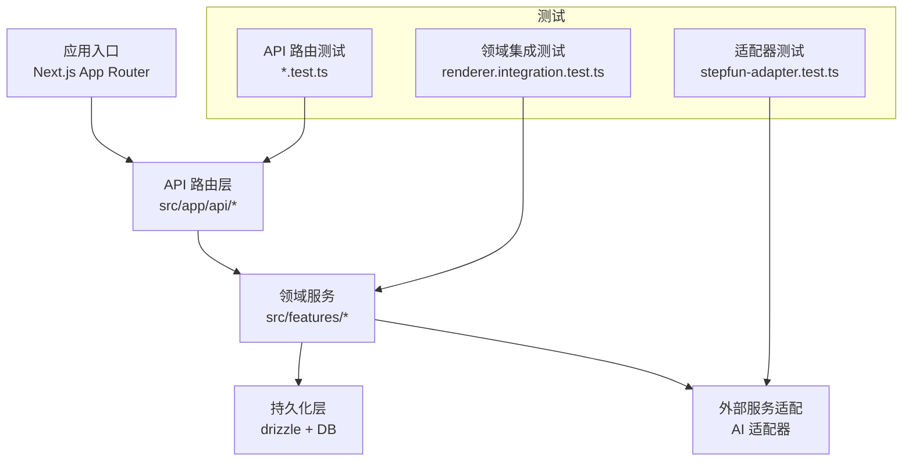
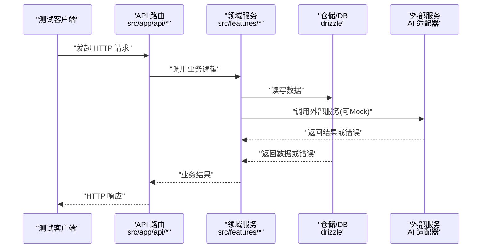
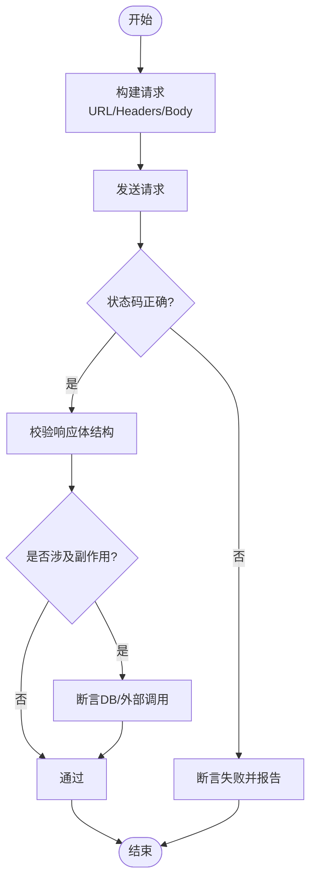
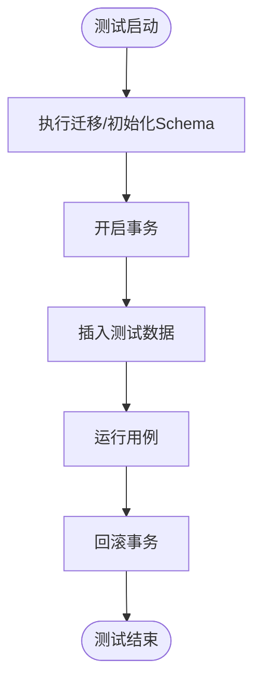
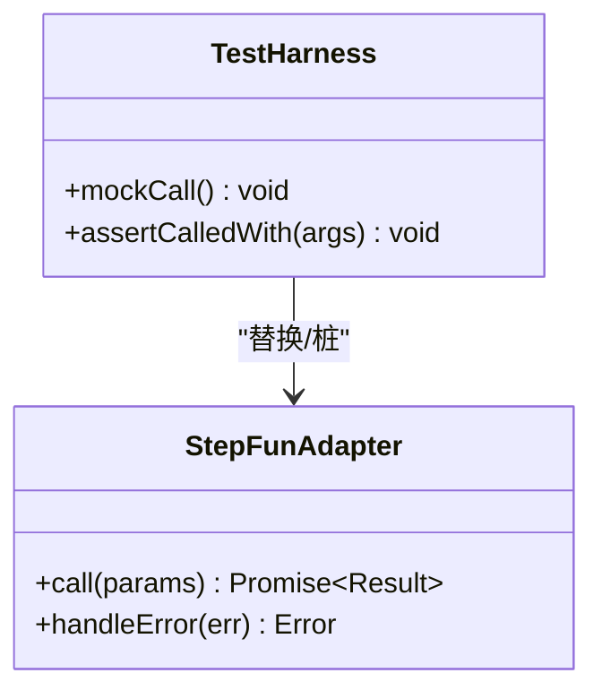
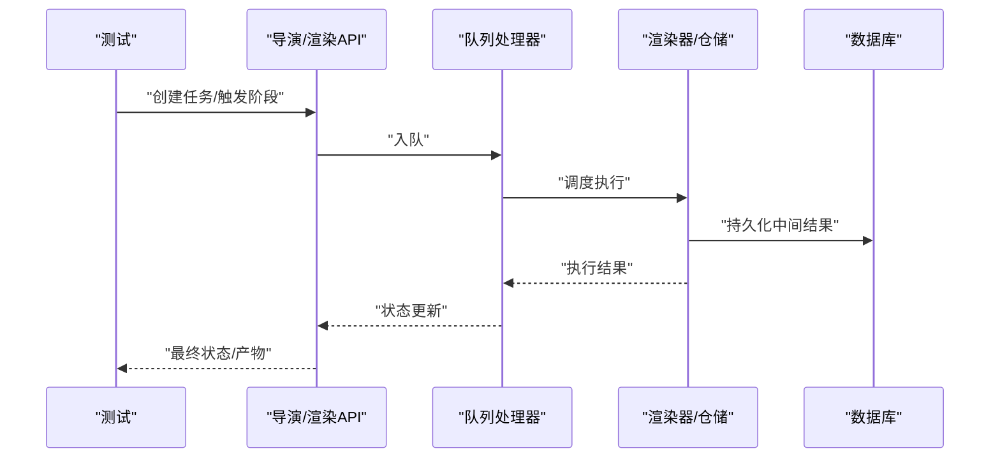
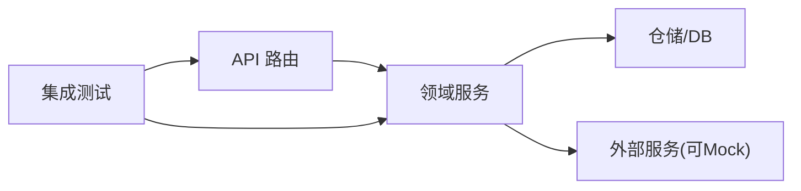

# 集成测试

<cite>
**本文引用的文件**   
- [vitest.config.ts](file://vitest.config.ts)
- [package.json](file://package.json)
- [src/app/api/artifacts/[id]/route.test.ts](file://src/app/api/artifacts/[id]/route.test.ts)
- [src/app/api/artifacts/[id]/route.ts](file://src/app/api/artifacts/[id]/route.ts)
- [src/app/api/director/stage/route.test.ts](file://src/app/api/director/stage/route.test.ts)
- [src/app/api/director/stage/route.ts](file://src/app/api/director/stage/route.ts)
- [src/app/api/jobs/[id]/route.test.ts](file://src/app/api/jobs/[id]/route.test.ts)
- [src/app/api/jobs/[id]/route.ts](file://src/app/api/jobs/[id]/route.ts)
- [src/app/api/projects/route.test.ts](file://src/app/api/projects/route.test.ts)
- [src/app/api/projects/route.ts](file://src/app/api/projects/route.ts)
- [src/app/api/render/export/route.test.ts](file://src/app/api/render/export/route.test.ts)
- [src/app/api/render/export/route.ts](file://src/app/api/render/export/route.ts)
- [src/app/api/render/route.test.ts](file://src/app/api/render/route.test.ts)
- [src/app/api/render/route.ts](file://src/app/api/render/route.ts)
- [src/app/api/settings/route.test.ts](file://src/app/api/settings/route.test.ts)
- [src/app/api/settings/route.ts](file://src/app/api/settings/route.ts)
- [src/features/ai/stepfun-adapter.test.ts](file://src/features/ai/stepfun-adapter.test.ts)
- [src/features/ai/stepfun-adapter.ts](file://src/features/ai/stepfun-adapter.ts)
- [src/features/canvas/actions.test.ts](file://src/features/canvas/actions.test.ts)
- [src/features/canvas/actions.ts](file://src/features/canvas/actions.ts)
- [src/features/director/pipeline.ts](file://src/features/director/pipeline.ts)
- [src/features/director/queue-handler.ts](file://src/features/director/queue-handler.ts)
- [src/features/director/runtime-repository.ts](file://src/features/director/runtime-repository.ts)
- [src/features/director/session-store.ts](file://src/features/director/session-store.ts)
- [src/features/director/stage-runner.ts](file://src/features/director/stage-runner.ts)
- [src/features/director/stage-result-committer.ts](file://src/features/director/stage-result-committer.ts)
- [src/features/render/renderer.integration.test.ts](file://src/features/render/renderer.integration.test.ts)
- [src/features/render/repository.ts](file://src/features/render/repository.ts)
- [src/features/render/export-service.ts](file://src/features/render/export-service.ts)
- [src/features/render/queue-handler.ts](file://src/features/render/queue-handler.ts)
- [drizzle.config.ts](file://drizzle.config.ts)
</cite>

## 目录
1. [简介](#简介)
2. [项目结构](#项目结构)
3. [核心组件](#核心组件)
4. [架构总览](#架构总览)
5. [详细组件分析](#详细组件分析)
6. [依赖分析](#依赖分析)
7. [性能考虑](#性能考虑)
8. [故障排查指南](#故障排查指南)
9. [结论](#结论)
10. [附录](#附录)

## 简介
本文件面向 CodeVideoCanvas 的集成测试实践，聚焦以下目标：
- API 路由的集成测试方法：请求模拟、响应验证与错误处理。
- 数据库操作的集成测试策略：测试数据准备、事务管理与数据清理。
- 外部服务集成的测试方法：以 AI 服务适配器为例的 Mock 策略。
- 端到端工作流测试模式：导演流程、渲染管道等复杂业务流程。
- 测试环境配置与数据隔离策略。

## 项目结构
本项目采用 Next.js App Router 组织 API 路由，并在各路由旁放置同名 .test.ts 文件进行集成测试；业务逻辑位于 src/features 下，按领域划分（如 ai、director、render、canvas）。测试框架使用 Vitest，配置文件位于仓库根目录。

图表来源
- [vitest.config.ts](file://vitest.config.ts)
- [src/app/api/artifacts/[id]/route.test.ts](file://src/app/api/artifacts/[id]/route.test.ts)
- [src/features/render/renderer.integration.test.ts](file://src/features/render/renderer.integration.test.ts)
- [src/features/ai/stepfun-adapter.test.ts](file://src/features/ai/stepfun-adapter.test.ts)

章节来源
- [vitest.config.ts](file://vitest.config.ts)
- [package.json](file://package.json)

## 核心组件
- API 路由集成测试：每个路由附带 route.test.ts，覆盖正常路径、参数校验失败、权限/状态异常等分支。
- 领域集成测试：针对渲染、导出、队列处理器等进行跨模块协作验证。
- 外部服务适配测试：对 AI 适配器进行网络调用替换与结果断言。
- 数据库集成：结合 drizzle 配置与测试数据库，提供数据准备、回滚与清理能力。

章节来源
- [src/app/api/artifacts/[id]/route.test.ts](file://src/app/api/artifacts/[id]/route.test.ts)
- [src/app/api/director/stage/route.test.ts](file://src/app/api/director/stage/route.test.ts)
- [src/app/api/jobs/[id]/route.test.ts](file://src/app/api/jobs/[id]/route.test.ts)
- [src/app/api/projects/route.test.ts](file://src/app/api/projects/route.test.ts)
- [src/app/api/render/export/route.test.ts](file://src/app/api/render/export/route.test.ts)
- [src/app/api/render/route.test.ts](file://src/app/api/render/route.test.ts)
- [src/app/api/settings/route.test.ts](file://src/app/api/settings/route.test.ts)
- [src/features/render/renderer.integration.test.ts](file://src/features/render/renderer.integration.test.ts)
- [src/features/ai/stepfun-adapter.test.ts](file://src/features/ai/stepfun-adapter.test.ts)

## 架构总览
下图展示从 API 到领域服务、再到持久化与外部服务的调用链，以及集成测试在各层的落点。

图表来源
- [src/app/api/artifacts/[id]/route.ts](file://src/app/api/artifacts/[id]/route.ts)
- [src/features/director/pipeline.ts](file://src/features/director/pipeline.ts)
- [src/features/render/repository.ts](file://src/features/render/repository.ts)
- [src/features/ai/stepfun-adapter.ts](file://src/features/ai/stepfun-adapter.ts)

## 详细组件分析

### API 路由集成测试
- 测试要点
  - 构造请求：使用测试框架提供的 HTTP 客户端或 Next.js 测试工具，设置路径、查询参数、请求体与头部。
  - 响应断言：检查状态码、响应体结构与关键字段、分页/排序字段等。
  - 错误处理：注入无效输入、缺失资源、权限不足等场景，验证错误码与错误消息。
  - 副作用验证：在需要时断言数据库变更或外部服务调用次数。
- 典型覆盖范围
  - artifacts 路由：按 ID 获取/更新制品元数据。
  - director stage 路由：触发导演阶段编排。
  - jobs 路由：任务生命周期查询与状态推进。
  - projects 路由：项目 CRUD 与关联关系。
  - render/export 路由：渲染与导出任务的创建与结果拉取。
  - settings 路由：系统设置读取与更新。

章节来源
- [src/app/api/artifacts/[id]/route.test.ts](file://src/app/api/artifacts/[id]/route.test.ts)
- [src/app/api/director/stage/route.test.ts](file://src/app/api/director/stage/route.test.ts)
- [src/app/api/jobs/[id]/route.test.ts](file://src/app/api/jobs/[id]/route.test.ts)
- [src/app/api/projects/route.test.ts](file://src/app/api/projects/route.test.ts)
- [src/app/api/render/export/route.test.ts](file://src/app/api/render/export/route.test.ts)
- [src/app/api/render/route.test.ts](file://src/app/api/render/route.test.ts)
- [src/app/api/settings/route.test.ts](file://src/app/api/settings/route.test.ts)

### 数据库操作集成测试
- 测试数据准备
  - 使用 drizzle 迁移后的测试库，在测试前插入最小必要数据集。
  - 为每条用例准备独立的数据快照，避免相互影响。
- 事务管理
  - 在测试套件启动时开启事务，用例结束后统一回滚，保证数据一致性。
- 数据清理
  - 若无法使用事务，则在 afterAll 中执行清理脚本，删除测试表或重置序列。
- 断言策略
  - 直接查询数据库断言记录存在性、字段值与约束生效情况。
  - 对并发写入场景，增加重试与幂等断言。

章节来源
- [drizzle.config.ts](file://drizzle.config.ts)

### 外部服务集成测试（AI 适配器）
- Mock 策略
  - 使用测试框架的模块替换或函数桩，拦截对外部 AI 服务的真实网络调用。
  - 根据输入参数返回确定性结果，便于断言下游逻辑。
- 错误注入
  - 模拟超时、鉴权失败、限流等异常，验证上层容错与重试逻辑。
- 行为契约
  - 明确适配器的输入输出类型与错误码约定，确保上下游稳定。

图表来源
- [src/features/ai/stepfun-adapter.ts](file://src/features/ai/stepfun-adapter.ts)
- [src/features/ai/stepfun-adapter.test.ts](file://src/features/ai/stepfun-adapter.test.ts)

章节来源
- [src/features/ai/stepfun-adapter.test.ts](file://src/features/ai/stepfun-adapter.test.ts)
- [src/features/ai/stepfun-adapter.ts](file://src/features/ai/stepfun-adapter.ts)

### 端到端工作流测试（导演流程与渲染管道）
- 导演流程
  - 通过 API 触发导演阶段，验证阶段编排、中间产物生成与状态流转。
  - 结合队列处理器，断言任务入队、出队与完成回调。
- 渲染管道
  - 从渲染任务创建到帧捕获、编码与导出的完整链路。
  - 使用仓储层断言渲染产物与元数据一致性。
- 关键断言点
  - 阶段状态机转换正确。
  - 中间产物可被后续阶段消费。
  - 失败路径具备可恢复性与告警。

图表来源
- [src/app/api/director/stage/route.ts](file://src/app/api/director/stage/route.ts)
- [src/features/director/queue-handler.ts](file://src/features/director/queue-handler.ts)
- [src/features/render/queue-handler.ts](file://src/features/render/queue-handler.ts)
- [src/features/render/repository.ts](file://src/features/render/repository.ts)
- [src/features/render/renderer.integration.test.ts](file://src/features/render/renderer.integration.test.ts)

章节来源
- [src/features/director/pipeline.ts](file://src/features/director/pipeline.ts)
- [src/features/director/queue-handler.ts](file://src/features/director/queue-handler.ts)
- [src/features/director/runtime-repository.ts](file://src/features/director/runtime-repository.ts)
- [src/features/director/session-store.ts](file://src/features/director/session-store.ts)
- [src/features/director/stage-runner.ts](file://src/features/director/stage-runner.ts)
- [src/features/director/stage-result-committer.ts](file://src/features/director/stage-result-committer.ts)
- [src/features/render/renderer.integration.test.ts](file://src/features/render/renderer.integration.test.ts)
- [src/features/render/repository.ts](file://src/features/render/repository.ts)
- [src/features/render/export-service.ts](file://src/features/render/export-service.ts)
- [src/features/render/queue-handler.ts](file://src/features/render/queue-handler.ts)

### Canvas 动作集成测试
- 关注点
  - 动作组合与副作用：如节点布局、状态同步、事件派发。
  - 并发与幂等：重复提交同一动作应产生一致结果。
- 断言方式
  - 通过仓储或内存状态断言前后差异。
  - 对 UI 相关副作用，可在必要时引入轻量级视图断言。

章节来源
- [src/features/canvas/actions.test.ts](file://src/features/canvas/actions.test.ts)
- [src/features/canvas/actions.ts](file://src/features/canvas/actions.ts)

## 依赖分析
- 耦合关系
  - API 路由依赖领域服务与仓储，测试需同时准备 DB 与可选的外部服务桩。
  - 领域服务之间通过接口或仓储解耦，便于替换实现进行测试。
- 外部依赖
  - AI 适配器作为外部服务，应在测试中完全替换为桩。
  - 队列处理器可能依赖消息中间件，测试中可用内存队列替代。

图表来源
- [src/app/api/artifacts/[id]/route.ts](file://src/app/api/artifacts/[id]/route.ts)
- [src/features/director/pipeline.ts](file://src/features/director/pipeline.ts)
- [src/features/render/repository.ts](file://src/features/render/repository.ts)
- [src/features/ai/stepfun-adapter.ts](file://src/features/ai/stepfun-adapter.ts)

章节来源
- [src/app/api/artifacts/[id]/route.test.ts](file://src/app/api/artifacts/[id]/route.test.ts)
- [src/features/render/renderer.integration.test.ts](file://src/features/render/renderer.integration.test.ts)
- [src/features/ai/stepfun-adapter.test.ts](file://src/features/ai/stepfun-adapter.test.ts)

## 性能考虑
- 控制测试规模：仅插入必要数据，避免全量导入。
- 并行执行：将无共享状态的用例分组并行，缩短整体耗时。
- 缓存与复用：对不可变的基础数据（字典、枚举）在测试间复用。
- I/O 优化：优先使用内存队列与内存仓储用于快速路径，仅在关键路径使用真实 DB。

## 故障排查指南
- 常见问题
  - 数据库连接失败：检查 drizzle 配置与测试库可用性。
  - 外部服务不稳定：确认桩已生效且未发生真实网络访问。
  - 用例互相污染：确认事务回滚或清理逻辑生效。
- 定位步骤
  - 缩小范围：先复现单条用例，再逐步扩大。
  - 打印上下文：在关键断言前输出必要上下文（ID、状态、时间戳）。
  - 对比基线：与已知通过的用例对比差异。

## 结论
通过围绕 API 路由、数据库、外部服务与端到端工作流的系统化集成测试，CodeVideoCanvas 能够在持续集成环境中快速发现回归问题，保障导演流程与渲染管道的稳定性。建议持续完善错误注入与边界条件用例，并强化数据隔离与清理策略，以提升测试的可维护性与可靠性。

## 附录
- 测试运行命令与配置参考
  - 测试框架：Vitest（见 vitest.config.ts）
  - 包脚本：参见 package.json 中的 test 相关脚本
- 参考文件清单
  - API 路由与测试：src/app/api/*/*.ts 与 *.test.ts
  - 领域集成测试：src/features/render/renderer.integration.test.ts
  - 外部服务适配测试：src/features/ai/stepfun-adapter.test.ts
  - 数据库配置：drizzle.config.ts