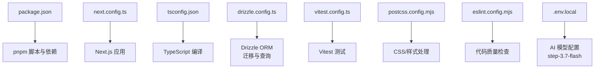
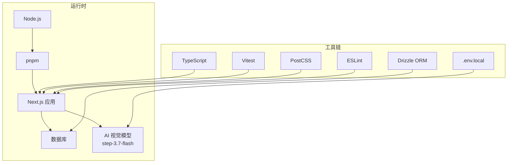
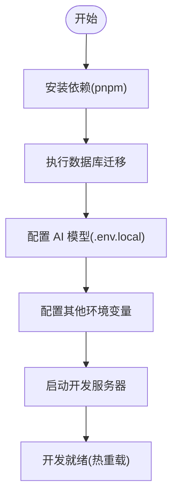
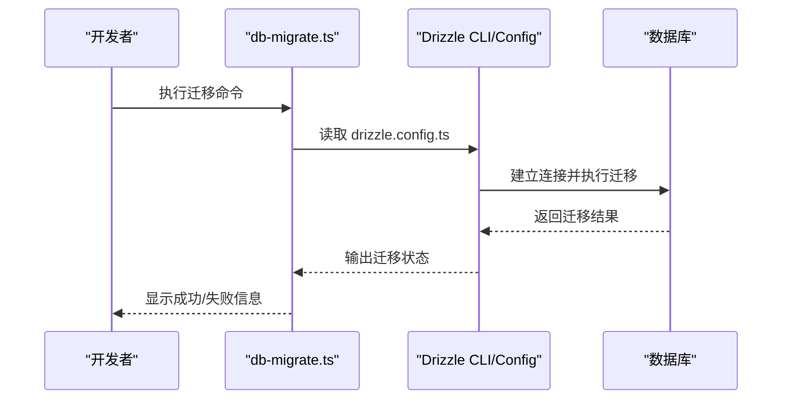
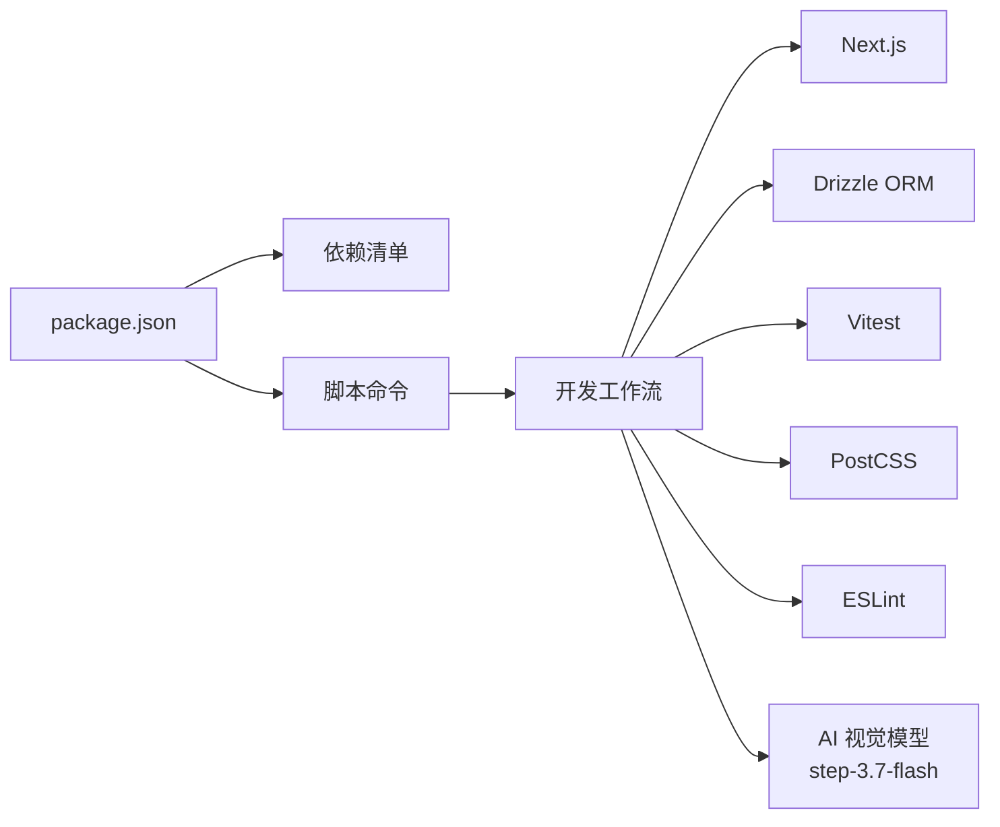

# 环境配置

<cite>
**本文引用的文件**   
- [package.json](file://package.json)
- [next.config.ts](file://next.config.ts)
- [tsconfig.json](file://tsconfig.json)
- [drizzle.config.ts](file://drizzle.config.ts)
- [vitest.config.ts](file://vitest.config.ts)
- [postcss.config.mjs](file://postcss.config.mjs)
- [eslint.config.mjs](file://eslint.config.mjs)
- [scripts/setup/db-migrate.ts](file://scripts/setup/db-migrate.ts)
- [scripts/dev/README.md](file://scripts/dev/README.md)
- [scripts/setup/README.md](file://scripts/setup/README.md)
- [src/app/layout.tsx](file://src/app/layout.tsx)
- [src/instrumentation.ts](file://src/instrumentation.ts)
</cite>

## 更新摘要
**变更内容**   
- 更新了 AI 视觉模型配置说明，反映从之前版本升级到 step-3.7-flash 的变更
- 增强了环境变量配置部分，包含新的 AI 模型相关配置项
- 更新了故障排查指南，涵盖新的 AI 服务配置问题

## 目录
1. [简介](#简介)
2. [项目结构](#项目结构)
3. [核心组件](#核心组件)
4. [架构总览](#架构总览)
5. [详细组件分析](#详细组件分析)
6. [依赖关系分析](#依赖关系分析)
7. [性能注意事项](#性能注意事项)
8. [故障排查指南](#故障排查指南)
9. [结论](#结论)
10. [附录](#附录)

## 简介
本指南面向首次或重新搭建 CodeVideoCanvas 开发环境的开发者，覆盖以下目标：
- 安装与配置 Node.js、pnpm、数据库等运行依赖
- 项目初始化流程（依赖安装、数据库迁移、环境变量）
- 配置文件说明（TypeScript、Next.js、Drizzle ORM、测试等）
- **新增** AI 视觉模型配置（step-3.7-flash）与环境变量设置
- 常见问题排查与解决方案
- 启动开发服务器与热重载配置方法

## 项目结构
CodeVideoCanvas 基于 Next.js App Router 构建，使用 pnpm 作为包管理器，Drizzle ORM 管理数据库迁移与查询，Vitest 负责单元测试。关键根级配置文件如下：
- package.json：脚本命令、依赖声明
- next.config.ts：Next.js 运行时与构建选项
- tsconfig.json：TypeScript 编译与路径别名
- drizzle.config.ts：Drizzle ORM 连接与迁移配置
- vitest.config.ts：测试框架配置
- postcss.config.mjs：样式处理链
- eslint.config.mjs：代码规范检查



图表来源
- [package.json](file://package.json)
- [next.config.ts](file://next.config.ts)
- [tsconfig.json](file://tsconfig.json)
- [drizzle.config.ts](file://drizzle.config.ts)
- [vitest.config.ts](file://vitest.config.ts)
- [postcss.config.mjs](file://postcss.config.mjs)
- [eslint.config.mjs](file://eslint.config.mjs)

章节来源
- [package.json](file://package.json)
- [next.config.ts](file://next.config.ts)
- [tsconfig.json](file://tsconfig.json)
- [drizzle.config.ts](file://drizzle.config.ts)
- [vitest.config.ts](file://vitest.config.ts)
- [postcss.config.mjs](file://postcss.config.mjs)
- [eslint.config.mjs](file://eslint.config.mjs)

## 核心组件
本节聚焦与环境配置直接相关的核心文件与职责：
- package.json：定义开发/生产脚本（如安装依赖、启动开发服务器、执行迁移、运行测试等），以及 Node.js 版本要求与依赖列表
- next.config.ts：Next.js 应用的基础配置（如路径别名、中间件、构建优化等）
- tsconfig.json：TypeScript 编译目标、模块解析、路径映射等
- drizzle.config.ts：数据库连接字符串、迁移文件位置、生成类型输出等
- vitest.config.ts：测试环境入口、覆盖率、全局设置等
- postcss.config.mjs：PostCSS 插件链（Tailwind 等）
- eslint.config.mjs：ESLint 规则与集成
- **.env.local**：环境变量配置，包括新的 AI 视觉模型 step-3.7-flash 相关设置

章节来源
- [package.json](file://package.json)
- [next.config.ts](file://next.config.ts)
- [tsconfig.json](file://tsconfig.json)
- [drizzle.config.ts](file://drizzle.config.ts)
- [vitest.config.ts](file://vitest.config.ts)
- [postcss.config.mjs](file://postcss.config.mjs)
- [eslint.config.mjs](file://eslint.config.mjs)

## 架构总览
下图展示开发环境的关键组件与交互关系：Node.js/pnpm 驱动脚本，Next.js 提供 Web 服务与路由，Drizzle ORM 通过配置文件连接数据库并执行迁移，Vitest 在本地运行测试，PostCSS 与 ESLint 分别处理样式与代码质量，**新增 AI 视觉模型服务集成**。



图表来源
- [package.json](file://package.json)
- [next.config.ts](file://next.config.ts)
- [drizzle.config.ts](file://drizzle.config.ts)
- [vitest.config.ts](file://vitest.config.ts)
- [postcss.config.mjs](file://postcss.config.mjs)
- [eslint.config.mjs](file://eslint.config.mjs)

## 详细组件分析

### 环境与依赖安装
- Node.js 版本要求与安装
  - 请根据 package.json 中的引擎要求选择匹配的 Node.js 版本，建议使用 nvm 或 fnm 进行版本管理
- pnpm 安装与使用
  - 推荐使用 pnpm 作为包管理器；在项目根目录执行依赖安装脚本以拉取所有依赖
- 数据库准备
  - 确保数据库服务已启动并可访问；根据 drizzle.config.ts 中的连接信息准备连接字符串或环境变量
- **AI 视觉模型配置**
  - **更新** 项目现已支持 step-3.7-flash 视觉模型，需要在 .env.local 中配置相应的 API 密钥和端点
- 环境变量
  - 将必要的环境变量写入 .env.local（仅本地开发），例如数据库连接串、第三方 API 密钥、**AI 模型配置**等

章节来源
- [package.json](file://package.json)
- [drizzle.config.ts](file://drizzle.config.ts)

### 项目初始化流程
推荐顺序：
1. 安装依赖
   - 使用 pnpm 安装全部依赖
2. 数据库迁移
   - 执行迁移脚本，创建或更新数据库表结构
3. **AI 模型配置**
   - **新增** 配置 .env.local 中的 AI 视觉模型相关环境变量（API 密钥、模型版本等）
4. 环境变量配置
   - 配置 .env.local 中所需变量（数据库、外部服务等）
5. 启动开发服务器
   - 启动 Next.js 开发模式，启用热重载



章节来源
- [scripts/setup/README.md](file://scripts/setup/README.md)
- [scripts/dev/README.md](file://scripts/dev/README.md)

### 数据库迁移与 Drizzle ORM 配置
- 迁移脚本
  - 使用 scripts/setup/db-migrate.ts 执行数据库迁移，确保表结构与 schema 一致
- Drizzle 配置
  - drizzle.config.ts 中指定数据库连接、迁移文件路径、类型生成输出目录等
- 常见操作
  - 生成类型、执行迁移、回滚（如有支持）



图表来源
- [scripts/setup/db-migrate.ts](file://scripts/setup/db-migrate.ts)
- [drizzle.config.ts](file://drizzle.config.ts)

章节来源
- [scripts/setup/db-migrate.ts](file://scripts/setup/db-migrate.ts)
- [drizzle.config.ts](file://drizzle.config.ts)

### TypeScript 配置
- tsconfig.json 控制编译目标、模块系统、路径别名、严格模式等
- 建议保持 strict 模式开启以获得更好的类型安全
- 路径别名需与 Next.js 和 IDE 配置保持一致

章节来源
- [tsconfig.json](file://tsconfig.json)

### Next.js 配置
- next.config.ts 用于配置应用行为（如路径别名、中间件、构建优化、CORS、代理等）
- 开发模式下可启用更详细的日志以便调试
- 生产构建时注意静态资源与缓存策略
- **AI 服务集成**：确保 Next.js 配置支持 AI 模型的 API 调用

章节来源
- [next.config.ts](file://next.config.ts)

### 测试配置（Vitest）
- vitest.config.ts 定义测试入口、覆盖率、全局钩子等
- 建议在本地运行单测以确保改动不破坏现有功能

章节来源
- [vitest.config.ts](file://vitest.config.ts)

### 样式与代码质量
- PostCSS：postcss.config.mjs 配置样式处理链（如 Tailwind CSS 插件）
- ESLint：eslint.config.mjs 统一代码风格与规则

章节来源
- [postcss.config.mjs](file://postcss.config.mjs)
- [eslint.config.mjs](file://eslint.config.mjs)

### 应用入口与初始化
- src/app/layout.tsx：应用布局与全局上下文
- src/instrumentation.ts：Next.js 应用生命周期钩子（如性能监控、错误上报等）

章节来源
- [src/app/layout.tsx](file://src/app/layout.tsx)
- [src/instrumentation.ts](file://src/instrumentation.ts)

### AI 视觉模型配置
**新增** 项目现已集成先进的 step-3.7-flash 视觉模型，提供更强大的图像理解和处理能力。

- **模型升级**：从之前的版本升级到 step-3.7-flash，获得更好的视觉识别精度和处理速度
- **环境变量配置**：
  - `VISION_MODEL_API_KEY`：视觉模型的 API 访问密钥
  - `VISION_MODEL_ENDPOINT`：模型服务的端点地址
  - `VISION_MODEL_VERSION`：模型版本标识（默认 step-3.7-flash）
- **配置示例**：
  ```bash
  # .env.local 文件示例
  VISION_MODEL_API_KEY=your_api_key_here
  VISION_MODEL_ENDPOINT=https://api.example.com/vision
  VISION_MODEL_VERSION=step-3.7-flash
  ```
- **功能特性**：
  - 增强的图像内容识别
  - 更快的响应时间
  - 更高的准确率
  - 支持更多视觉任务

**章节来源**
- [.env.example](file://.env.example)

## 依赖关系分析
- Node.js 与 pnpm：驱动脚本与依赖安装
- Next.js：Web 服务与路由
- Drizzle ORM：数据库迁移与类型生成
- Vitest：单元测试
- PostCSS/ESLint：样式与代码质量
- **AI 视觉模型**：step-3.7-flash 模型集成



图表来源
- [package.json](file://package.json)
- [next.config.ts](file://next.config.ts)
- [drizzle.config.ts](file://drizzle.config.ts)
- [vitest.config.ts](file://vitest.config.ts)
- [postcss.config.mjs](file://postcss.config.mjs)
- [eslint.config.mjs](file://eslint.config.mjs)

章节来源
- [package.json](file://package.json)

## 性能注意事项
- 开发模式
  - 避免过大的依赖树；按需启用插件与中间件
  - 合理配置浏览器缓存与资源压缩
- 数据库
  - 确保连接池与超时参数适合本地开发
  - 迁移脚本应幂等，避免重复执行导致性能问题
- 测试
  - 并行运行测试用例，限制覆盖率收集范围以提升速度
- **AI 模型**
  - **新增** step-3.7-flash 模型具有更好的性能表现，但仍需注意 API 调用频率限制
  - 建议实现适当的缓存机制以减少重复请求
  - 监控 API 响应时间和错误率

## 故障排查指南
- 无法安装依赖
  - 检查 Node.js 版本是否符合 package.json 的引擎要求
  - 确认网络与镜像源可用
- 数据库连接失败
  - 校验 drizzle.config.ts 中的连接信息与 .env.local 中的环境变量
  - 确认数据库服务已启动且端口可达
- 迁移失败
  - 查看 db-migrate.ts 的输出日志，确认迁移文件存在且权限正确
  - 必要时清理临时文件或重建数据库
- 开发服务器无法启动
  - 检查端口占用情况
  - 查看 next.config.ts 与相关中间件配置
- 测试无法运行
  - 确认 vitest.config.ts 的入口与全局设置
  - 检查测试依赖是否完整安装
- **AI 模型配置问题**
  - **新增** 检查 .env.local 中的 AI 模型环境变量是否正确配置
  - 验证 API 密钥的有效性和权限
  - 确认网络连接正常，能够访问 AI 模型服务
  - 检查模型版本兼容性（step-3.7-flash）
  - 查看应用日志中的 AI 服务调用错误信息

章节来源
- [scripts/setup/db-migrate.ts](file://scripts/setup/db-migrate.ts)
- [drizzle.config.ts](file://drizzle.config.ts)
- [vitest.config.ts](file://vitest.config.ts)
- [next.config.ts](file://next.config.ts)

## 结论
通过遵循本指南，您可以快速完成 CodeVideoCanvas 的开发环境搭建与初始化。重点在于：
- 使用正确的 Node.js 与 pnpm 版本
- 正确配置数据库连接与迁移
- **理解新的 AI 视觉模型配置（step-3.7-flash）**
- 理解各配置文件的作用与自定义项
- 遇到问题时按排查步骤定位与解决

## 附录
- 常用命令参考（示例）
  - 安装依赖：使用 pnpm 安装
  - 启动开发服务器：使用 Next.js 开发模式
  - 执行数据库迁移：运行迁移脚本
  - 运行测试：使用 Vitest
- 环境变量模板
  - 将必要变量写入 .env.local（仅本地开发）
  - **包含 AI 视觉模型配置项**

章节来源
- [scripts/dev/README.md](file://scripts/dev/README.md)
- [scripts/setup/README.md](file://scripts/setup/README.md)