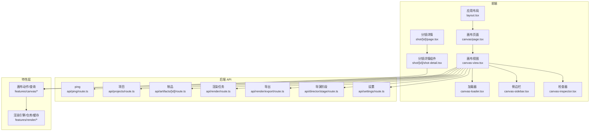
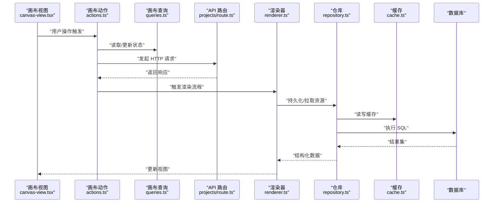
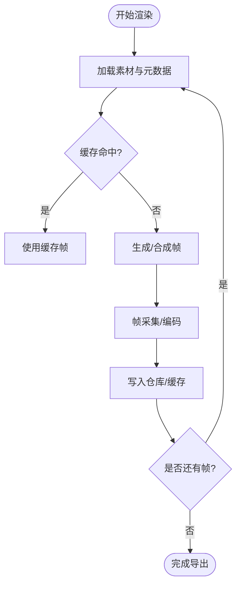
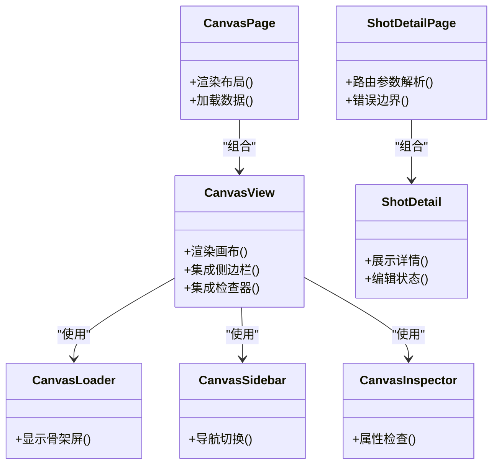
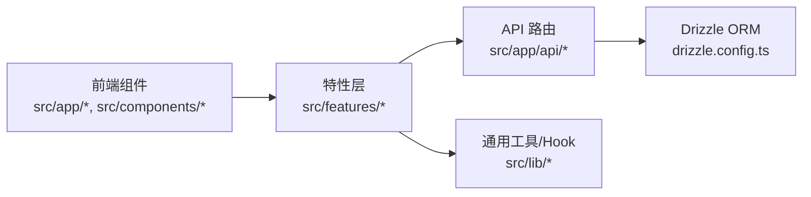

# 调试指南

<cite>
**本文引用的文件**   
- [src/app/error.tsx](file://src/app/error.tsx)
- [src/app/global-error.tsx](file://src/app/global-error.tsx)
- [src/app/layout.tsx](file://src/app/layout.tsx)
- [src/app/canvas/page.tsx](file://src/app/canvas/page.tsx)
- [src/app/canvas/layout.tsx](file://src/app/canvas/layout.tsx)
- [src/app/canvas/canvas-view.tsx](file://src/app/canvas/canvas-view.tsx)
- [src/app/canvas/canvas-loader.tsx](file://src/app/canvas/canvas-loader.tsx)
- [src/app/canvas/canvas-sidebar.tsx](file://src/app/canvas/canvas-sidebar.tsx)
- [src/app/canvas/canvas-inspector.tsx](file://src/app/canvas/canvas-inspector.tsx)
- [src/app/canvas/shot/[id]/page.tsx](file://src/app/canvas/shot/[id]/page.tsx)
- [src/app/canvas/shot/[id]/shot-detail.tsx](file://src/app/canvas/shot/[id]/shot-detail.tsx)
- [src/app/canvas/shot/[id]/shot-api.ts](file://src/app/canvas/shot/[id]/shot-api.ts)
- [src/app/api/ping/route.ts](file://src/app/api/ping/route.ts)
- [src/app/api/projects/route.ts](file://src/app/api/projects/route.ts)
- [src/app/api/artifacts/[id]/route.ts](file://src/app/api/artifacts/[id]/route.ts)
- [src/app/api/render/route.ts](file://src/app/api/render/route.ts)
- [src/app/api/render/export/route.ts](file://src/app/api/render/export/route.ts)
- [src/app/api/director/stage/route.ts](file://src/app/api/director/stage/route.ts)
- [src/app/api/settings/route.ts](file://src/app/api/settings/route.ts)
- [src/features/canvas/actions.ts](file://src/features/canvas/actions.ts)
- [src/features/canvas/queries.ts](file://src/features/canvas/queries.ts)
- [src/features/canvas/types.ts](file://src/features/canvas/types.ts)
- [src/features/render/renderer.ts](file://src/features/render/renderer.ts)
- [src/features/render/repository.ts](file://src/features/render/repository.ts)
- [src/features/render/cache.ts](file://src/features/render/cache.ts)
- [src/features/render/frame-capture.ts](file://src/features/render/frame-capture.ts)
- [src/features/render/queue-handler.ts](file://src/features/render/queue-handler.ts)
- [src/lib/hooks/index.ts](file://src/lib/hooks/index.ts)
- [src/instrumentation.ts](file://src/instrumentation.ts)
- [next.config.ts](file://next.config.ts)
- [drizzle.config.ts](file://drizzle.config.ts)
</cite>

## 目录
1. [简介](#简介)
2. [项目结构](#项目结构)
3. [核心组件](#核心组件)
4. [架构总览](#架构总览)
5. [详细组件分析](#详细组件分析)
6. [依赖分析](#依赖分析)
7. [性能考虑](#性能考虑)
8. [故障排查指南](#故障排查指南)
9. [结论](#结论)
10. [附录](#附录)

## 简介
本指南面向 CodeVideoCanvas 的前后端开发者，提供系统化的调试方法与实践建议。内容覆盖：
- 前端调试：浏览器开发者工具、React DevTools、网络请求与状态调试
- 后端调试：API 路由调试、数据库查询优化、日志与指标
- 错误处理：全局错误页面与错误边界的使用
- 性能分析与优化：内存泄漏检测、渲染性能分析、渲染管线瓶颈定位
- 调试工具与插件配置：Next.js、Vitest、Drizzle 等
- 常见问题与排障步骤

## 项目结构
CodeVideoCanvas 采用 Next.js App Router 前后端一体化结构。前端以 React 组件为主，位于 src/app 与 src/components；业务特性按功能域划分在 src/features；服务端 API 使用 Route Handlers 暴露于 src/app/api；数据访问通过 Drizzle ORM 与数据库交互（配置文件见 drizzle.config.ts）。

图表来源
- [src/app/layout.tsx](file://src/app/layout.tsx)
- [src/app/canvas/page.tsx](file://src/app/canvas/page.tsx)
- [src/app/canvas/canvas-view.tsx](file://src/app/canvas/canvas-view.tsx)
- [src/app/canvas/canvas-loader.tsx](file://src/app/canvas/canvas-loader.tsx)
- [src/app/canvas/canvas-sidebar.tsx](file://src/app/canvas/canvas-sidebar.tsx)
- [src/app/canvas/canvas-inspector.tsx](file://src/app/canvas/canvas-inspector.tsx)
- [src/app/canvas/shot/[id]/page.tsx](file://src/app/canvas/shot/[id]/page.tsx)
- [src/app/canvas/shot/[id]/shot-detail.tsx](file://src/app/canvas/shot/[id]/shot-detail.tsx)
- [src/app/api/ping/route.ts](file://src/app/api/ping/route.ts)
- [src/app/api/projects/route.ts](file://src/app/api/projects/route.ts)
- [src/app/api/artifacts/[id]/route.ts](file://src/app/api/artifacts/[id]/route.ts)
- [src/app/api/render/route.ts](file://src/app/api/render/route.ts)
- [src/app/api/render/export/route.ts](file://src/app/api/render/export/route.ts)
- [src/app/api/director/stage/route.ts](file://src/app/api/director/stage/route.ts)
- [src/app/api/settings/route.ts](file://src/app/api/settings/route.ts)
- [src/features/canvas/actions.ts](file://src/features/canvas/actions.ts)
- [src/features/canvas/queries.ts](file://src/features/canvas/queries.ts)
- [src/features/render/renderer.ts](file://src/features/render/renderer.ts)
- [src/features/render/repository.ts](file://src/features/render/repository.ts)
- [src/features/render/cache.ts](file://src/features/render/cache.ts)

章节来源
- [src/app/layout.tsx](file://src/app/layout.tsx)
- [src/app/canvas/page.tsx](file://src/app/canvas/page.tsx)
- [src/app/canvas/canvas-view.tsx](file://src/app/canvas/canvas-view.tsx)
- [src/app/canvas/canvas-loader.tsx](file://src/app/canvas/canvas-loader.tsx)
- [src/app/canvas/canvas-sidebar.tsx](file://src/app/canvas/canvas-sidebar.tsx)
- [src/app/canvas/canvas-inspector.tsx](file://src/app/canvas/canvas-inspector.tsx)
- [src/app/canvas/shot/[id]/page.tsx](file://src/app/canvas/shot/[id]/page.tsx)
- [src/app/canvas/shot/[id]/shot-detail.tsx](file://src/app/canvas/shot/[id]/shot-detail.tsx)
- [src/app/api/ping/route.ts](file://src/app/api/ping/route.ts)
- [src/app/api/projects/route.ts](file://src/app/api/projects/route.ts)
- [src/app/api/artifacts/[id]/route.ts](file://src/app/api/artifacts/[id]/route.ts)
- [src/app/api/render/route.ts](file://src/app/api/render/route.ts)
- [src/app/api/render/export/route.ts](file://src/app/api/render/export/route.ts)
- [src/app/api/director/stage/route.ts](file://src/app/api/director/stage/route.ts)
- [src/app/api/settings/route.ts](file://src/app/api/settings/route.ts)
- [src/features/canvas/actions.ts](file://src/features/canvas/actions.ts)
- [src/features/canvas/queries.ts](file://src/features/canvas/queries.ts)
- [src/features/render/renderer.ts](file://src/features/render/renderer.ts)
- [src/features/render/repository.ts](file://src/features/render/repository.ts)
- [src/features/render/cache.ts](file://src/features/render/cache.ts)

## 核心组件
- 应用布局与根错误边界：负责全局样式、错误页面挂载与基础布局。
- 画布页面与视图：承载主工作区，包含加载器、侧边栏、检查器等子模块。
- 分镜详情页：聚焦单条分镜的编辑与预览。
- API 路由：提供 ping、项目、制品、渲染、导出、导演阶段、设置等接口。
- 特性层：封装画布动作/查询与渲染管线（渲染器、仓库、缓存、队列处理器）。

章节来源
- [src/app/layout.tsx](file://src/app/layout.tsx)
- [src/app/canvas/page.tsx](file://src/app/canvas/page.tsx)
- [src/app/canvas/canvas-view.tsx](file://src/app/canvas/canvas-view.tsx)
- [src/app/canvas/canvas-loader.tsx](file://src/app/canvas/canvas-loader.tsx)
- [src/app/canvas/canvas-sidebar.tsx](file://src/app/canvas/canvas-sidebar.tsx)
- [src/app/canvas/canvas-inspector.tsx](file://src/app/canvas/canvas-inspector.tsx)
- [src/app/canvas/shot/[id]/page.tsx](file://src/app/canvas/shot/[id]/page.tsx)
- [src/app/canvas/shot/[id]/shot-detail.tsx](file://src/app/canvas/shot/[id]/shot-detail.tsx)
- [src/app/api/ping/route.ts](file://src/app/api/ping/route.ts)
- [src/app/api/projects/route.ts](file://src/app/api/projects/route.ts)
- [src/app/api/artifacts/[id]/route.ts](file://src/app/api/artifacts/[id]/route.ts)
- [src/app/api/render/route.ts](file://src/app/api/render/route.ts)
- [src/app/api/render/export/route.ts](file://src/app/api/render/export/route.ts)
- [src/app/api/director/stage/route.ts](file://src/app/api/director/stage/route.ts)
- [src/app/api/settings/route.ts](file://src/app/api/settings/route.ts)
- [src/features/canvas/actions.ts](file://src/features/canvas/actions.ts)
- [src/features/canvas/queries.ts](file://src/features/canvas/queries.ts)
- [src/features/render/renderer.ts](file://src/features/render/renderer.ts)
- [src/features/render/repository.ts](file://src/features/render/repository.ts)
- [src/features/render/cache.ts](file://src/features/render/cache.ts)

## 架构总览
下图展示从前端到后端的典型调用链：UI 触发操作 → 特性层动作/查询 → API 路由 → 渲染/仓库/缓存 → 数据库。

图表来源
- [src/app/canvas/canvas-view.tsx](file://src/app/canvas/canvas-view.tsx)
- [src/features/canvas/actions.ts](file://src/features/canvas/actions.ts)
- [src/features/canvas/queries.ts](file://src/features/canvas/queries.ts)
- [src/app/api/projects/route.ts](file://src/app/api/projects/route.ts)
- [src/features/render/renderer.ts](file://src/features/render/renderer.ts)
- [src/features/render/repository.ts](file://src/features/render/repository.ts)
- [src/features/render/cache.ts](file://src/features/render/cache.ts)

## 详细组件分析

### 前端调试技巧
- 浏览器开发者工具
  - Elements/Styles：定位布局问题、CSS 冲突与尺寸异常
  - Console：查看运行时错误、警告与自定义日志
  - Network：筛选 XHR/Fetch、检查请求头/响应体、重放失败请求
  - Performance/Memory：录制帧率、堆快照对比，识别内存泄漏与长任务
  - Application：查看 LocalStorage/SessionStorage、IndexedDB、Cookies
- React DevTools
  - Components：检查组件树、Props/State、Hooks 值
  - Profiler：记录渲染耗时，定位重渲染热点
  - 安装与启用：在 Chrome 扩展商店安装 React Developer Tools，并在开发环境启动应用后自动注入
- 网络请求调试
  - 使用 Network 面板过滤特定域名或路径，关注状态码与耗时
  - 对关键 API（如 projects、render）进行断点与重试
  - 结合控制台打印请求 ID/TraceId，便于跨端追踪
- 本地代理与 Mock
  - 在 next.config.ts 中配置 devServer.proxy 将 /api 转发至独立后端服务
  - 使用 MSW 或自定义中间件拦截并返回固定响应，加速联调

章节来源
- [next.config.ts](file://next.config.ts)

### 后端调试方法
- API 路由调试
  - 使用 curl 或 Postman 直接调用 /api/ping 验证服务可达性
  - 针对 /api/projects、/api/render、/api/render/export、/api/director/stage、/api/settings 等路由，构造最小可复现的请求体
  - 在路由文件中添加结构化日志（请求参数、耗时、错误栈），配合 TraceId 串联链路
- 数据库查询优化
  - 使用 EXPLAIN ANALYZE 分析慢查询，关注索引命中与扫描行数
  - 在仓库层增加查询耗时统计与采样日志
  - 利用缓存层减少重复 IO，注意缓存失效策略与一致性
- 日志分析
  - 统一日志格式（时间戳、级别、模块、TraceId、消息）
  - 对关键路径（渲染、导出、队列）输出阶段性日志
  - 结合外部日志平台进行聚合与告警

章节来源
- [src/app/api/ping/route.ts](file://src/app/api/ping/route.ts)
- [src/app/api/projects/route.ts](file://src/app/api/projects/route.ts)
- [src/app/api/render/route.ts](file://src/app/api/render/route.ts)
- [src/app/api/render/export/route.ts](file://src/app/api/render/export/route.ts)
- [src/app/api/director/stage/route.ts](file://src/app/api/director/stage/route.ts)
- [src/app/api/settings/route.ts](file://src/app/api/settings/route.ts)
- [src/features/render/repository.ts](file://src/features/render/repository.ts)
- [src/features/render/cache.ts](file://src/features/render/cache.ts)

### 错误处理与异常捕获
- 全局错误页面
  - global-error.tsx：捕获应用级未处理异常，显示兜底页面
  - error.tsx：页面级错误边界，用于局部恢复
- 错误边界最佳实践
  - 在复杂子树（如画布视图）外层包裹错误边界，避免整页崩溃
  - 在错误页面中提供“重试”和“反馈”入口，收集错误上下文
- 错误上报
  - 在错误边界中上报错误类型、堆栈、用户操作序列与设备信息
  - 为异步错误（Promise 拒绝）提供全局监听

章节来源
- [src/app/global-error.tsx](file://src/app/global-error.tsx)
- [src/app/error.tsx](file://src/app/error.tsx)
- [src/app/canvas/canvas-view.tsx](file://src/app/canvas/canvas-view.tsx)

### 渲染与导出调试
- 渲染管线
  - renderer.ts：编排帧生成、合成与编码
  - repository.ts：资源存取与持久化
  - cache.ts：帧/片段缓存，降低重复计算
  - frame-capture.ts：截图与帧采集
  - queue-handler.ts：任务队列调度与并发控制
- 调试要点
  - 在关键阶段插入计时与日志，观察各阶段耗时分布
  - 使用 Memory 面板对比导出前后的堆快照，定位大对象未释放
  - 对高并发场景，调整队列并发度，避免阻塞主线程

图表来源
- [src/features/render/renderer.ts](file://src/features/render/renderer.ts)
- [src/features/render/repository.ts](file://src/features/render/repository.ts)
- [src/features/render/cache.ts](file://src/features/render/cache.ts)
- [src/features/render/frame-capture.ts](file://src/features/render/frame-capture.ts)
- [src/features/render/queue-handler.ts](file://src/features/render/queue-handler.ts)

章节来源
- [src/features/render/renderer.ts](file://src/features/render/renderer.ts)
- [src/features/render/repository.ts](file://src/features/render/repository.ts)
- [src/features/render/cache.ts](file://src/features/render/cache.ts)
- [src/features/render/frame-capture.ts](file://src/features/render/frame-capture.ts)
- [src/features/render/queue-handler.ts](file://src/features/render/queue-handler.ts)

### 画布与分镜调试
- 画布页面与视图
  - canvas/page.tsx：入口页面，组织布局与数据加载
  - canvas-view.tsx：主视图，集成加载器、侧边栏、检查器
  - canvas-loader.tsx：骨架屏与加载态
  - canvas-sidebar.tsx：左侧导航与工具
  - canvas-inspector.tsx：属性检查与调试面板
- 分镜详情
  - shot/[id]/page.tsx：路由级页面，负责数据获取与错误边界
  - shot/[id]/shot-detail.tsx：分镜详情组件，展示与编辑
  - shot/[id]/shot-api.ts：分镜相关 API 封装

图表来源
- [src/app/canvas/page.tsx](file://src/app/canvas/page.tsx)
- [src/app/canvas/canvas-view.tsx](file://src/app/canvas/canvas-view.tsx)
- [src/app/canvas/canvas-loader.tsx](file://src/app/canvas/canvas-loader.tsx)
- [src/app/canvas/canvas-sidebar.tsx](file://src/app/canvas/canvas-sidebar.tsx)
- [src/app/canvas/canvas-inspector.tsx](file://src/app/canvas/canvas-inspector.tsx)
- [src/app/canvas/shot/[id]/page.tsx](file://src/app/canvas/shot/[id]/page.tsx)
- [src/app/canvas/shot/[id]/shot-detail.tsx](file://src/app/canvas/shot/[id]/shot-detail.tsx)

章节来源
- [src/app/canvas/page.tsx](file://src/app/canvas/page.tsx)
- [src/app/canvas/canvas-view.tsx](file://src/app/canvas/canvas-view.tsx)
- [src/app/canvas/canvas-loader.tsx](file://src/app/canvas/canvas-loader.tsx)
- [src/app/canvas/canvas-sidebar.tsx](file://src/app/canvas/canvas-sidebar.tsx)
- [src/app/canvas/canvas-inspector.tsx](file://src/app/canvas/canvas-inspector.tsx)
- [src/app/canvas/shot/[id]/page.tsx](file://src/app/canvas/shot/[id]/page.tsx)
- [src/app/canvas/shot/[id]/shot-detail.tsx](file://src/app/canvas/shot/[id]/shot-detail.tsx)

### 特性层调试（动作/查询/类型）
- actions.ts：封装用户操作对应的副作用与状态变更
- queries.ts：数据读取与缓存策略
- types.ts：共享类型定义，确保前后端一致

调试建议
- 在动作入口处打印输入参数与预期输出
- 在查询层记录命中率与延迟
- 使用 TypeScript 严格模式与类型守卫减少运行时错误

章节来源
- [src/features/canvas/actions.ts](file://src/features/canvas/actions.ts)
- [src/features/canvas/queries.ts](file://src/features/canvas/queries.ts)
- [src/features/canvas/types.ts](file://src/features/canvas/types.ts)

## 依赖分析
- 前端依赖
  - React/Next.js：组件渲染与服务端路由
  - 第三方 UI 库与图标库：提升开发效率
- 后端依赖
  - Route Handlers：Express/Koa 兼容层
  - Drizzle ORM：类型安全的数据库访问
- 内部依赖
  - features 层解耦业务逻辑，便于测试与复用
  - lib 层提供通用工具与 Hook

图表来源
- [drizzle.config.ts](file://drizzle.config.ts)
- [src/lib/hooks/index.ts](file://src/lib/hooks/index.ts)

章节来源
- [drizzle.config.ts](file://drizzle.config.ts)
- [src/lib/hooks/index.ts](file://src/lib/hooks/index.ts)

## 性能考虑
- 渲染性能
  - 使用 React Profiler 定位重渲染热点，拆分大组件，合理使用 memo/useMemo/useCallback
  - 对画布区域进行虚拟化与懒加载，减少首屏压力
- 内存管理
  - 在导出/渲染完成后显式释放大对象引用，避免长时间驻留
  - 使用 Memory 面板对比快照，关注 Detached DOM 节点与闭包持有
- 网络与缓存
  - 合理设置缓存策略，避免重复下载相同资源
  - 对列表/分页接口实现增量更新与去抖
- 队列与并发
  - 根据 CPU/IO 能力调整队列并发度，避免阻塞主线程
  - 对长任务进行分片与进度上报

[本节为通用指导，不直接分析具体文件]

## 故障排查指南
- 无法连接后端
  - 先调用 /api/ping 验证服务可达性
  - 检查 next.config.ts 中的代理配置是否正确
  - 确认端口、域名与 CORS 设置
- 渲染失败或导出中断
  - 在 renderer.ts 与 queue-handler.ts 中增加阶段日志与超时保护
  - 检查仓库层与缓存层的异常分支
  - 使用 Memory 面板排查内存溢出
- 数据库查询缓慢
  - 在 repository.ts 中记录慢查询与参数
  - 使用 EXPLAIN ANALYZE 分析执行计划，补充必要索引
  - 引入缓存层减少重复 IO
- 全局错误页面未生效
  - 确认 global-error.tsx 与 error.tsx 的路径与命名符合框架约定
  - 在错误边界中捕获并上报错误上下文
- 分镜详情空白或报错
  - 检查 shot/[id]/page.tsx 的错误边界与数据加载逻辑
  - 核对 shot-api.ts 的接口路径与参数

章节来源
- [src/app/api/ping/route.ts](file://src/app/api/ping/route.ts)
- [next.config.ts](file://next.config.ts)
- [src/features/render/renderer.ts](file://src/features/render/renderer.ts)
- [src/features/render/queue-handler.ts](file://src/features/render/queue-handler.ts)
- [src/features/render/repository.ts](file://src/features/render/repository.ts)
- [src/features/render/cache.ts](file://src/features/render/cache.ts)
- [src/app/global-error.tsx](file://src/app/global-error.tsx)
- [src/app/error.tsx](file://src/app/error.tsx)
- [src/app/canvas/shot/[id]/page.tsx](file://src/app/canvas/shot/[id]/page.tsx)
- [src/app/canvas/shot/[id]/shot-api.ts](file://src/app/canvas/shot/[id]/shot-api.ts)

## 结论
通过系统化的前端与后端调试方法、完善的错误边界与日志体系、以及针对性的性能分析与优化策略，可以显著提升 CodeVideoCanvas 的可维护性与稳定性。建议在团队内推广统一的调试规范与工具链配置，持续沉淀排障经验与最佳实践。

## 附录
- 常用命令与环境
  - 启动开发服务器：pnpm dev
  - 运行测试：pnpm test
  - 构建与部署：参考 scripts 目录说明
- 调试清单
  - 打开 Network 面板，筛选关键 API
  - 使用 React Profiler 记录一次完整操作流程
  - 在关键路径添加结构化日志与 TraceId
  - 导出前后对比 Memory 快照
  - 对慢查询执行 EXPLAIN ANALYZE

[本节为通用指导，不直接分析具体文件]