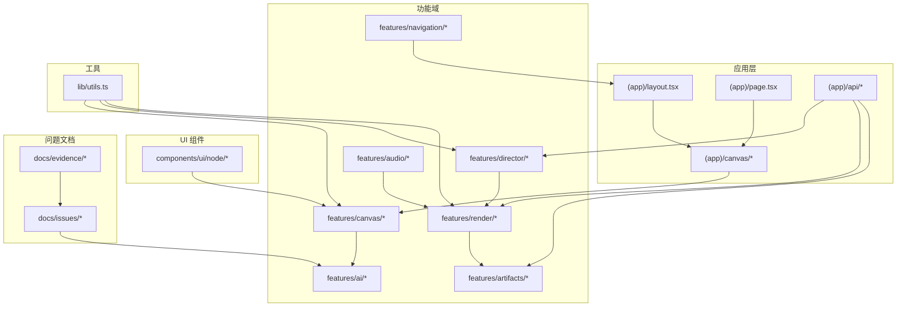
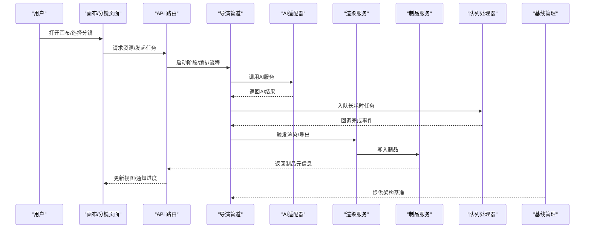
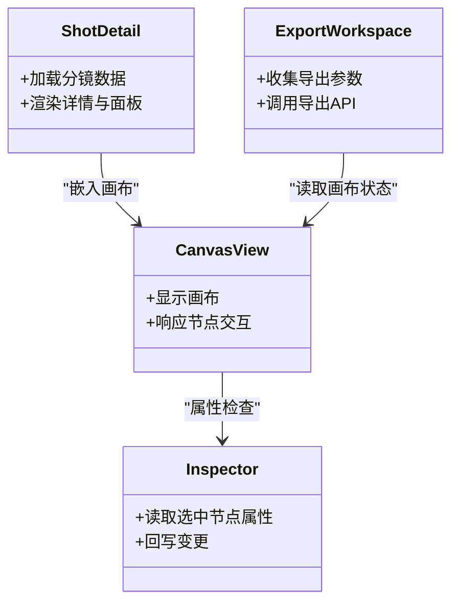
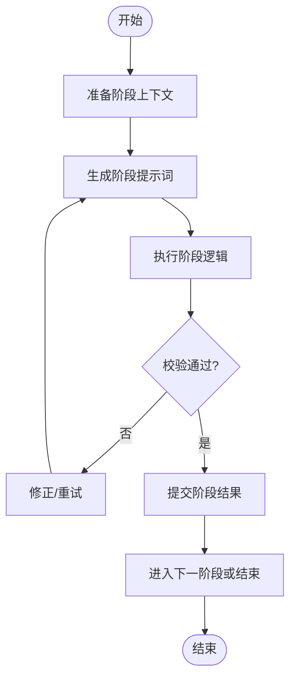
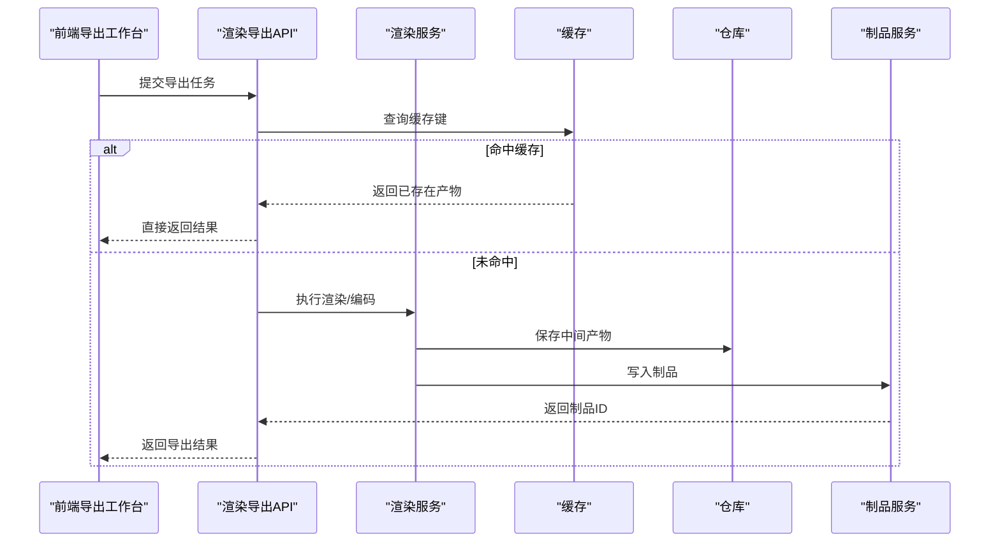
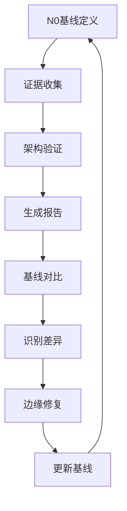
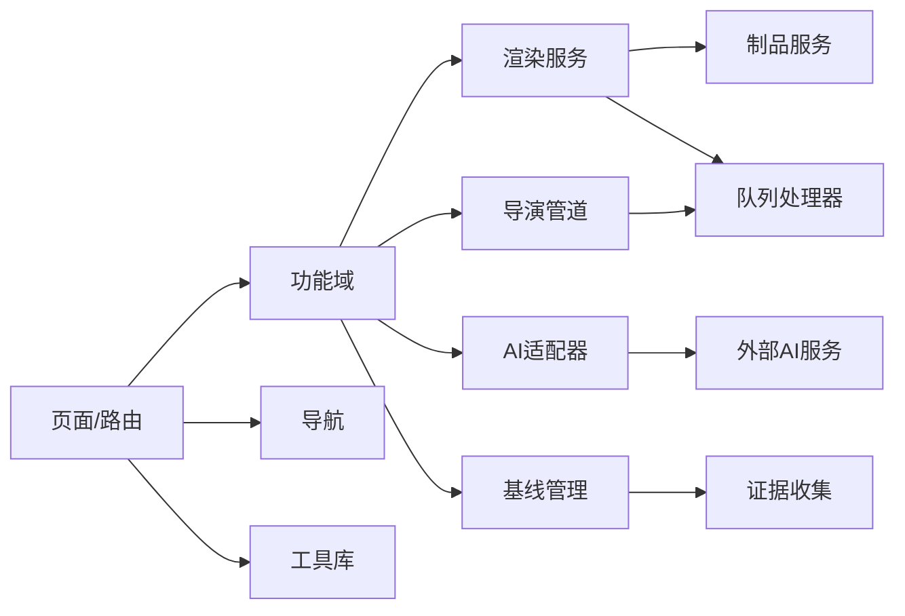

# 问题跟踪系统

<cite>
**本文引用的文件**   
- [README.md](file://README.md)
- [package.json](file://package.json)
- [next.config.ts](file://next.config.ts)
- [drizzle.config.ts](file://drizzle.config.ts)
- [vitest.config.ts](file://vitest.config.ts)
- [src/app/(app)/layout.tsx](file://src/app/(app)/layout.tsx)
- [src/app/(app)/page.tsx](file://src/app/(app)/page.tsx)
- [src/app/(app)/canvas/page.tsx](file://src/app/(app)/canvas/page.tsx)
- [src/app/(app)/canvas/canvas-view.tsx](file://src/app/(app)/canvas/canvas-view.tsx)
- [src/app/(app)/canvas/canvas-inspector.tsx](file://src/app/(app)/canvas/canvas-inspector.tsx)
- [src/app/(app)/canvas/flow-elements.tsx](file://src/app/(app)/canvas/flow-elements.tsx)
- [src/app/(app)/canvas/canvas-loader.tsx](file://src/app/(app)/canvas/canvas-loader.tsx)
- [src/app/(app)/canvas/export/page.tsx](file://src/app/(app)/canvas/export/page.tsx)
- [src/app/(app)/canvas/export/export-workspace.tsx](file://src/app/(app)/canvas/export/export-workspace.tsx)
- [src/app/(app)/canvas/export/export-api.ts](file://src/app/(app)/canvas/export/export-api.ts)
- [src/app/(app)/canvas/export/export-view-model.ts](file://src/app/(app)/canvas/export/export-view-model.ts)
- [src/app/(app)/canvas/shot/[id]/page.tsx](file://src/app/(app)/canvas/shot/[id]/page.tsx)
- [src/app/(app)/canvas/shot/[id]/shot-detail.tsx](file://src/app/(app)/canvas/shot/[id]/shot-detail.tsx)
- [src/app/(app)/canvas/shot/[id]/shot-panels.tsx](file://src/app/(app)/canvas/shot/[id]/shot-panels.tsx)
- [src/app/(app)/projects/page.tsx](file://src/app/(app)/projects/page.tsx)
- [src/app/(app)/settings/page.tsx](file://src/app/(app)/settings/page.tsx)
- [src/app/(app)/settings/settings-form.tsx](file://src/app/(app)/settings/settings-form.tsx)
- [src/app/_components/new-project-dialog.tsx](file://src/app/_components/new-project-dialog.tsx)
- [src/app/_components/new-project-api.ts](file://src/app/_components/new-project-api.ts)
- [src/app/api/artifacts/[id]/route.ts](file://src/app/api/artifacts/[id]/route.ts)
- [src/app/api/director/stage/route.ts](file://src/app/api/director/stage/route.ts)
- [src/app/api/jobs/[id]/route.ts](file://src/app/api/jobs/[id]/route.ts)
- [src/app/api/ping/route.ts](file://src/app/api/ping/route.ts)
- [src/app/api/projects/route.ts](file://src/app/api/projects/route.ts)
- [src/app/api/render/route.ts](file://src/app/api/render/route.ts)
- [src/app/api/render/export/route.ts](file://src/app/api/render/export/route.ts)
- [src/app/api/settings/route.ts](file://src/app/api/settings/route.ts)
- [src/features/canvas/actions.ts](file://src/features/canvas/actions.ts)
- [src/features/canvas/layout.ts](file://src/features/canvas/layout.ts)
- [src/features/canvas/queries.ts](file://src/features/canvas/queries.ts)
- [src/features/canvas/schemas.ts](file://src/features/canvas/schemas.ts)
- [src/features/canvas/status.ts](file://src/features/canvas/status.ts)
- [src/features/canvas/types.ts](file://src/features/canvas/types.ts)
- [src/features/canvas/fan-out.ts](file://src/features/canvas/fan-out.ts)
- [src/features/director/index.ts](file://src/features/director/index.ts)
- [src/features/director/pipeline.ts](file://src/features/director/pipeline.ts)
- [src/features/director/pi-session.ts](file://src/features/director/pi-session.ts)
- [src/features/director/runtime-repository.ts](file://src/features/director/runtime-repository.ts)
- [src/features/director/session-store.ts](file://src/features/director/session-store.ts)
- [src/features/director/stage-runner.ts](file://src/features/director/stage-runner.ts)
- [src/features/director/stage-result.ts](file://src/features/director/stage-result.ts)
- [src/features/director/stage-prompt.ts](file://src/features/director/stage-prompt.ts)
- [src/features/director/stage-result-committer.ts](file://src/features/director/stage-result-committer.ts)
- [src/features/director/queue-handler.ts](file://src/features/director/queue-handler.ts)
- [src/features/director/tools/write-artifact.ts](file://src/features/director/tools/write-artifact.ts)
- [src/features/director/tools/validate-shot-plan.ts](file://src/features/director/tools/validate-shot-plan.ts)
- [src/features/director/tools/check-determinism.ts](file://src/features/director/tools/check-determinism.ts)
- [src/features/director/prompts/assemble.ts](file://src/features/director/prompts/assemble.ts)
- [src/features/director/prompts/direct.ts](file://src/features/director/prompts/direct.ts)
- [src/features/director/prompts/fabricate.ts](file://src/features/director/prompts/fabricate.ts)
- [src/features/director/prompts/finalize.ts](file://src/features/director/prompts/finalize.ts)
- [src/features/director/prompts/ingest.ts](file://src/features/director/prompts/ingest.ts)
- [src/features/director/prompts/shot-spec.ts](file://src/features/director/prompts/shot-spec.ts)
- [src/features/render/renderer.ts](file://src/features/render/renderer.ts)
- [src/features/render/repository.ts](file://src/features/render/repository.ts)
- [src/features/render/cache.ts](file://src/features/render/cache.ts)
- [src/features/render/encode.ts](file://src/features/render/encode.ts)
- [src/features/render/frame-capture.ts](file://src/features/render/frame-capture.ts)
- [src/features/render/frame-sequence.ts](file://src/features/render/frame-sequence.ts)
- [src/features/render/concat.ts](file://src/features/render/concat.ts)
- [src/features/render/export-service.ts](file://src/features/render/export-service.ts)
- [src/features/render/queue-handler.ts](file://src/features/render/queue-handler.ts)
- [src/features/render/types.ts](file://src/features/render/types.ts)
- [src/features/artifacts/service.ts](file://src/features/artifacts/service.ts)
- [src/features/audio/subtitle.ts](file://src/features/audio/subtitle.ts)
- [src/features/audio/voiceover.ts](file://src/features/audio/voiceover.ts)
- [src/features/audio/sfx.ts](file://src/features/audio/sfx.ts)
- [src/features/audio/score.ts](file://src/features/audio/score.ts)
- [src/features/navigation/app-sidebar.tsx](file://src/features/navigation/app-sidebar.tsx)
- [src/features/navigation/nav-context.tsx](file://src/features/navigation/nav-context.tsx)
- [src/components/ui/node/stage-node.tsx](file://src/components/ui/node/stage-node.tsx)
- [src/components/ui/node/shot-node.tsx](file://src/components/ui/node/shot-node.tsx)
- [src/components/ui/node/audio-node.tsx](file://src/components/ui/node/audio-node.tsx)
- [src/components/ui/node/export-node.tsx](file://src/components/ui/node/export-node.tsx)
- [src/components/ui/node/stage-colors.ts](file://src/components/ui/node/stage-colors.ts)
- [src/components/ui/node/types.ts](file://src/components/ui/node/types.ts)
- [src/lib/utils.ts](file://src/lib/utils.ts)
- [docs/issues/refactor-v3/issue-n0-baseline-and-bleeding-fixes.md](file://docs/issues/refactor-v3/issue-n0-baseline-and-bleeding-fixes.md)
- [docs/evidence/refactor-v3/n0-baseline.json](file://docs/evidence/refactor-v3/n0-baseline.json)
</cite>

## 更新摘要
**所做更改**   
- 新增N0基线和边缘修复问题的专门文档，解决UTF-8扫描冲突并排除Pencil源代码自动扫描
- 更新重构v3阶段的基线证据和架构基准
- 增强问题跟踪系统的技术文档完整性
- 完善UTF-8编码处理和第三方代码扫描配置

## 目录
1. [简介](#简介)
2. [项目结构](#项目结构)
3. [核心组件](#核心组件)
4. [架构总览](#架构总览)
5. [详细组件分析](#详细组件分析)
6. [依赖分析](#依赖分析)
7. [性能考虑](#性能考虑)
8. [故障排查指南](#故障排查指南)
9. [结论](#结论)
10. [附录](#附录)

## 简介
本仓库是一个基于 Next.js 的"问题跟踪系统"，围绕"导演式工作流"与"画布编辑"构建，支持分镜（Shot）管理、阶段化编排（Stage）、渲染导出、制品（Artifact）管理与队列处理。系统采用前后端同仓（Next.js App Router）组织，前端以功能域（features）划分，后端以 API Route 暴露能力，并通过数据库迁移配置与测试框架支撑工程化质量。

**更新** 新增了针对N0基线和边缘修复问题的专门文档，解决了UTF-8扫描冲突并排除了Pencil源代码的自动扫描，进一步完善了系统的工程化和质量保证能力。

## 项目结构
整体采用"应用层 + 功能域 + 通用 UI 组件 + 工具库"的分层组织：
- 应用层（app）：页面路由、布局、API 路由、全局错误与加载态
- 功能域（features）：按业务领域拆分（canvas、director、render、artifacts、audio、navigation、ai）
- UI 组件（components/ui）：可复用节点与基础控件
- 工具库（lib）：通用工具与跨层共享逻辑
- 问题文档（docs/issues）：详细的开发问题追踪与解决方案

**图表来源**
- [src/app/(app)/layout.tsx](file://src/app/(app)/layout.tsx)
- [src/app/(app)/page.tsx](file://src/app/(app)/page.tsx)
- [src/app/(app)/canvas/page.tsx](file://src/app/(app)/canvas/page.tsx)
- [src/app/api/render/route.ts](file://src/app/api/render/route.ts)
- [src/features/canvas/actions.ts](file://src/features/canvas/actions.ts)
- [src/features/director/pipeline.ts](file://src/features/director/pipeline.ts)
- [src/features/render/renderer.ts](file://src/features/render/renderer.ts)
- [src/features/artifacts/service.ts](file://src/features/artifacts/service.ts)
- [src/features/navigation/app-sidebar.tsx](file://src/features/navigation/app-sidebar.tsx)
- [src/components/ui/node/stage-node.tsx](file://src/components/ui/node/stage-node.tsx)
- [src/lib/utils.ts](file://src/lib/utils.ts)
- [docs/issues/refactor-v3/issue-n0-baseline-and-bleeding-fixes.md](file://docs/issues/refactor-v3/issue-n0-baseline-and-bleeding-fixes.md)
- [docs/evidence/refactor-v3/n0-baseline.json](file://docs/evidence/refactor-v3/n0-baseline.json)

**章节来源**
- [README.md](file://README.md)
- [package.json](file://package.json)
- [next.config.ts](file://next.config.ts)
- [drizzle.config.ts](file://drizzle.config.ts)
- [vitest.config.ts](file://vitest.config.ts)

## 核心组件
- 画布与分镜
  - 画布视图与检查器：提供可视化编排与属性检查
  - 分镜详情与面板：聚焦单条分镜的编辑与状态展示
  - 导出工作台：将画布内容转换为可导出的产物
- 导演管道
  - 阶段运行器与结果提交：驱动多阶段任务执行并持久化结果
  - 会话与运行时仓库：维护会话上下文与运行时数据
  - 队列处理器：对长耗时任务进行排队与调度
- 渲染服务
  - 渲染器与帧序列：负责帧捕获、编码与拼接
  - 缓存与仓库：命中缓存与持久化中间产物
  - 导出服务：对外提供导出入口
- 制品与音频
  - 制品服务：统一产出物访问与生命周期管理
  - 音频子域：字幕、配音、音效、配乐等处理能力
- AI集成
  - StepFun适配器：第三方AI服务的配置与调用
  - 模型配置解析器：动态配置管理和验证
  - 一键管道推进：自动化流程控制
- 导航与 UI
  - 侧边栏与导航上下文：应用内导航与状态共享
  - 节点组件：Stage、Shot、Audio、Export 等可视化节点
- 基线与证据管理
  - N0基线：重构v3阶段的架构基准和质量基线
  - 边缘修复：解决UTF-8扫描冲突和第三方代码扫描问题

**更新** 新增基线与证据管理组件，完善了重构v3阶段的质量保证体系。

**章节来源**
- [src/app/(app)/canvas/canvas-view.tsx](file://src/app/(app)/canvas/canvas-view.tsx)
- [src/app/(app)/canvas/canvas-inspector.tsx](file://src/app/(app)/canvas/canvas-inspector.tsx)
- [src/app/(app)/canvas/shot/[id]/shot-detail.tsx](file://src/app/(app)/canvas/shot/[id]/shot-detail.tsx)
- [src/app/(app)/canvas/shot/[id]/shot-panels.tsx](file://src/app/(app)/canvas/shot/[id]/shot-panels.tsx)
- [src/app/(app)/canvas/export/export-workspace.tsx](file://src/app/(app)/canvas/export/export-workspace.tsx)
- [src/features/director/stage-runner.ts](file://src/features/director/stage-runner.ts)
- [src/features/director/stage-result-committer.ts](file://src/features/director/stage-result-committer.ts)
- [src/features/director/queue-handler.ts](file://src/features/director/queue-handler.ts)
- [src/features/render/renderer.ts](file://src/features/render/renderer.ts)
- [src/features/render/export-service.ts](file://src/features/render/export-service.ts)
- [src/features/artifacts/service.ts](file://src/features/artifacts/service.ts)
- [src/features/audio/subtitle.ts](file://src/features/audio/subtitle.ts)
- [src/features/navigation/app-sidebar.tsx](file://src/features/navigation/app-sidebar.tsx)
- [src/components/ui/node/stage-node.tsx](file://src/components/ui/node/stage-node.tsx)
- [docs/issues/refactor-v3/issue-n0-baseline-and-bleeding-fixes.md](file://docs/issues/refactor-v3/issue-n0-baseline-and-bleeding-fixes.md)

## 架构总览
系统遵循"页面/路由 -> 功能域 -> 基础设施"的调用链。前端通过 API 路由触发后端能力，功能域内部再组合渲染、制品、队列等子系统。

**图表来源**
- [src/app/(app)/canvas/page.tsx](file://src/app/(app)/canvas/page.tsx)
- [src/app/api/render/route.ts](file://src/app/api/render/route.ts)
- [src/features/director/pipeline.ts](file://src/features/director/pipeline.ts)
- [src/features/director/queue-handler.ts](file://src/features/director/queue-handler.ts)
- [src/features/render/renderer.ts](file://src/features/render/renderer.ts)
- [src/features/artifacts/service.ts](file://src/features/artifacts/service.ts)
- [docs/evidence/refactor-v3/n0-baseline.json](file://docs/evidence/refactor-v3/n0-baseline.json)

## 详细组件分析

### 画布与分镜模块
- 职责
  - 提供可视化画布、节点拖拽与连线、属性检查器
  - 分镜详情页聚合数据、面板切换与操作
  - 导出工作台将画布状态映射为导出参数
- 关键交互
  - 页面加载时拉取画布与分镜数据
  - 用户操作触发动作（actions），更新本地状态并同步到后端
  - 导出工作台调用导出 API，进入渲染管线

**图表来源**
- [src/app/(app)/canvas/canvas-view.tsx](file://src/app/(app)/canvas/canvas-view.tsx)
- [src/app/(app)/canvas/canvas-inspector.tsx](file://src/app/(app)/canvas/canvas-inspector.tsx)
- [src/app/(app)/canvas/shot/[id]/shot-detail.tsx](file://src/app/(app)/canvas/shot/[id]/shot-detail.tsx)
- [src/app/(app)/canvas/export/export-workspace.tsx](file://src/app/(app)/canvas/export/export-workspace.tsx)

**章节来源**
- [src/app/(app)/canvas/page.tsx](file://src/app/(app)/canvas/page.tsx)
- [src/app/(app)/canvas/flow-elements.tsx](file://src/app/(app)/canvas/flow-elements.tsx)
- [src/app/(app)/canvas/canvas-loader.tsx](file://src/app/(app)/canvas/canvas-loader.tsx)
- [src/app/(app)/canvas/shot/[id]/page.tsx](file://src/app/(app)/canvas/shot/[id]/page.tsx)
- [src/app/(app)/canvas/shot/[id]/shot-panels.tsx](file://src/app/(app)/canvas/shot/[id]/shot-panels.tsx)
- [src/app/(app)/canvas/export/page.tsx](file://src/app/(app)/canvas/export/page.tsx)
- [src/app/(app)/canvas/export/export-api.ts](file://src/app/(app)/canvas/export/export-api.ts)
- [src/app/(app)/canvas/export/export-view-model.ts](file://src/app/(app)/canvas/export/export-view-model.ts)

### 导演管道与阶段执行
- 职责
  - 定义阶段流水线，协调各阶段提示词与工具
  - 管理会话与运行时仓库，持久化阶段结果
  - 通过队列处理器调度耗时阶段
- 关键流程
  - 启动阶段 -> 生成提示词 -> 执行阶段 -> 校验/写入制品 -> 提交结果 -> 下一阶

**图表来源**
- [src/features/director/stage-runner.ts](file://src/features/director/stage-runner.ts)
- [src/features/director/stage-prompt.ts](file://src/features/director/stage-prompt.ts)
- [src/features/director/stage-result-committer.ts](file://src/features/director/stage-result-committer.ts)
- [src/features/director/tools/validate-shot-plan.ts](file://src/features/director/tools/validate-shot-plan.ts)
- [src/features/director/tools/write-artifact.ts](file://src/features/director/tools/write-artifact.ts)

**章节来源**
- [src/features/director/pipeline.ts](file://src/features/director/pipeline.ts)
- [src/features/director/pi-session.ts](file://src/features/director/pi-session.ts)
- [src/features/director/runtime-repository.ts](file://src/features/director/runtime-repository.ts)
- [src/features/director/session-store.ts](file://src/features/director/session-store.ts)
- [src/features/director/stage-result.ts](file://src/features/director/stage-result.ts)
- [src/features/director/queue-handler.ts](file://src/features/director/queue-handler.ts)
- [src/features/director/prompts/assemble.ts](file://src/features/director/prompts/assemble.ts)
- [src/features/director/prompts/direct.ts](file://src/features/director/prompts/direct.ts)
- [src/features/director/prompts/fabricate.ts](file://src/features/director/prompts/fabricate.ts)
- [src/features/director/prompts/finalize.ts](file://src/features/director/prompts/finalize.ts)
- [src/features/director/prompts/ingest.ts](file://src/features/director/prompts/ingest.ts)
- [src/features/director/prompts/shot-spec.ts](file://src/features/director/prompts/shot-spec.ts)

### AI集成与StepFun适配器
- 职责
  - 提供统一的AI服务接口抽象
  - 管理StepFun等第三方AI服务的配置和认证
  - 实现模型配置的动态解析和验证
- 关键特性
  - 配置解析器：处理不同AI服务的配置格式
  - 模型设置：支持多种AI模型的参数配置
  - 错误处理：统一的异常处理和重试机制

**更新** 新增StepFun配置解析器和模型设置功能，增强了AI服务的灵活性和可扩展性。

**章节来源**
- [src/features/ai/config.ts](file://src/features/ai/config.ts)
- [src/features/ai/stepfun-adapter.ts](file://src/features/ai/stepfun-adapter.ts)
- [src/features/ai/schemas.ts](file://src/features/ai/schemas.ts)
- [src/features/ai/types.ts](file://src/features/ai/types.ts)

### 渲染与导出服务
- 职责
  - 渲染器负责帧捕获、编码与拼接
  - 缓存命中减少重复计算
  - 导出服务封装对外接口，协调渲染与制品写入
- 关键路径
  - 接收导出请求 -> 解析参数 -> 命中缓存或执行渲染 -> 写入制品 -> 返回结果

**图表来源**
- [src/app/api/render/export/route.ts](file://src/app/api/render/export/route.ts)
- [src/features/render/export-service.ts](file://src/features/render/export-service.ts)
- [src/features/render/renderer.ts](file://src/features/render/renderer.ts)
- [src/features/render/cache.ts](file://src/features/render/cache.ts)
- [src/features/render/repository.ts](file://src/features/render/repository.ts)
- [src/features/artifacts/service.ts](file://src/features/artifacts/service.ts)

**章节来源**
- [src/features/render/renderer.ts](file://src/features/render/renderer.ts)
- [src/features/render/encode.ts](file://src/features/render/encode.ts)
- [src/features/render/frame-capture.ts](file://src/features/render/frame-capture.ts)
- [src/features/render/frame-sequence.ts](file://src/features/render/frame-sequence.ts)
- [src/features/render/concat.ts](file://src/features/render/concat.ts)
- [src/features/render/cache.ts](file://src/features/render/cache.ts)
- [src/features/render/repository.ts](file://src/features/render/repository.ts)
- [src/features/render/export-service.ts](file://src/features/render/export-service.ts)
- [src/features/render/queue-handler.ts](file://src/features/render/queue-handler.ts)
- [src/features/render/types.ts](file://src/features/render/types.ts)

### 制品与音频子域
- 制品服务
  - 提供统一的产物读写与生命周期管理
  - 与渲染服务协作，确保产物一致性
- 音频子域
  - 字幕、配音、音效、配乐等独立能力，供渲染与导出使用

**章节来源**
- [src/features/artifacts/service.ts](file://src/features/artifacts/service.ts)
- [src/features/audio/subtitle.ts](file://src/features/audio/subtitle.ts)
- [src/features/audio/voiceover.ts](file://src/features/audio/voiceover.ts)
- [src/features/audio/sfx.ts](file://src/features/audio/sfx.ts)
- [src/features/audio/score.ts](file://src/features/audio/score.ts)

### 导航与应用壳
- 侧边栏与导航上下文
  - 提供应用级导航与状态共享
  - 与页面路由协同，实现快速跳转与面包屑

**章节来源**
- [src/features/navigation/app-sidebar.tsx](file://src/features/navigation/app-sidebar.tsx)
- [src/features/navigation/nav-context.tsx](file://src/features/navigation/nav-context.tsx)
- [src/app/(app)/layout.tsx](file://src/app/(app)/layout.tsx)

### UI 节点组件
- Stage/Shot/Audio/Export 节点
  - 在画布中作为可视化元素，承载各自的数据模型与交互
  - 颜色与类型由统一规范约束

**章节来源**
- [src/components/ui/node/stage-node.tsx](file://src/components/ui/node/stage-node.tsx)
- [src/components/ui/node/shot-node.tsx](file://src/components/ui/node/shot-node.tsx)
- [src/components/ui/node/audio-node.tsx](file://src/components/ui/node/audio-node.tsx)
- [src/components/ui/node/export-node.tsx](file://src/components/ui/node/export-node.tsx)
- [src/components/ui/node/stage-colors.ts](file://src/components/ui/node/stage-colors.ts)
- [src/components/ui/node/types.ts](file://src/components/ui/node/types.ts)

### 基线与证据管理
- N0基线管理
  - 定义重构v3阶段的架构基准和质量标准
  - 提供架构快照和对比基准
- 边缘修复
  - 解决UTF-8编码扫描冲突问题
  - 排除第三方源代码（如Pencil）的自动扫描
- 证据收集
  - 自动收集和存储架构证据
  - 支持版本化的基线比较

**更新** 新增基线与证据管理功能，完善了重构v3阶段的质量保证和版本控制能力。

**图表来源**
- [docs/evidence/refactor-v3/n0-baseline.json](file://docs/evidence/refactor-v3/n0-baseline.json)
- [docs/issues/refactor-v3/issue-n0-baseline-and-bleeding-fixes.md](file://docs/issues/refactor-v3/issue-n0-baseline-and-bleeding-fixes.md)

**章节来源**
- [docs/evidence/refactor-v3/n0-baseline.json](file://docs/evidence/refactor-v3/n0-baseline.json)
- [docs/issues/refactor-v3/issue-n0-baseline-and-bleeding-fixes.md](file://docs/issues/refactor-v3/issue-n0-baseline-and-bleeding-fixes.md)

## 依赖分析
- 耦合关系
  - 页面/路由依赖功能域；功能域之间通过明确的服务边界交互（如渲染->制品）
  - 队列处理器贯穿导演与渲染，解耦长耗时任务
  - AI适配器与外部服务解耦，提供统一的调用接口
- 外部依赖
  - Next.js 应用路由与 API 路由
  - 数据库迁移配置（Drizzle）
  - 测试框架（Vitest）
  - StepFun等第三方AI服务
- 基线依赖
  - 架构基准文件用于版本控制和对比
  - 证据文件支持自动化质量检查

**图表来源**
- [src/app/(app)/page.tsx](file://src/app/(app)/page.tsx)
- [src/app/(app)/canvas/page.tsx](file://src/app/(app)/canvas/page.tsx)
- [src/features/director/queue-handler.ts](file://src/features/director/queue-handler.ts)
- [src/features/render/queue-handler.ts](file://src/features/render/queue-handler.ts)
- [src/features/render/export-service.ts](file://src/features/render/export-service.ts)
- [src/features/artifacts/service.ts](file://src/features/artifacts/service.ts)
- [src/features/navigation/app-sidebar.tsx](file://src/features/navigation/app-sidebar.tsx)
- [src/lib/utils.ts](file://src/lib/utils.ts)
- [docs/evidence/refactor-v3/n0-baseline.json](file://docs/evidence/refactor-v3/n0-baseline.json)

**章节来源**
- [package.json](file://package.json)
- [next.config.ts](file://next.config.ts)
- [drizzle.config.ts](file://drizzle.config.ts)
- [vitest.config.ts](file://vitest.config.ts)

## 性能考虑
- 缓存优先：渲染与导出应优先命中缓存，避免重复计算
- 队列化：长耗时任务统一入队，避免阻塞主线程
- 增量更新：画布与分镜状态变更尽量局部更新，减少重绘
- 产物复用：制品与中间产物持久化，便于后续复用与审计
- AI优化：AI服务调用应实现连接池和超时控制
- 基线优化：架构基准文件应定期更新，避免过大影响性能

## 故障排查指南
- 常见问题定位
  - 导出失败：检查导出参数、缓存键是否有效、制品写入权限
  - 阶段执行异常：查看阶段提示词与校验结果，确认输入契约
  - 队列堆积：监控队列处理器健康度与消费者数量
  - AI服务异常：检查API密钥、网络连通性和速率限制
- 建议日志与断点
  - 在阶段提交与制品写入处增加关键日志
  - 在队列入队/出队处记录任务元信息与耗时
  - 在AI服务调用处记录请求参数和响应时间
- 新增问题排查
  - StepFun配置问题：验证配置格式和密钥有效性
  - 一键管道推进：检查管道状态和自动推进条件
  - TTS/ASR/视觉模型：确认模型接线和参数传递
- 基线相关问题
  - UTF-8编码冲突：检查文件编码设置和扫描配置
  - Pencil源代码扫描：确认排除规则是否正确配置
  - 基线对比失败：验证基准文件格式和版本兼容性

**更新** 新增基线相关问题的排查指南，包括UTF-8编码冲突和第三方代码扫描问题的诊断方法。

**章节来源**
- [src/features/director/stage-result-committer.ts](file://src/features/director/stage-result-committer.ts)
- [src/features/render/export-service.ts](file://src/features/render/export-service.ts)
- [src/features/director/queue-handler.ts](file://src/features/director/queue-handler.ts)
- [src/features/render/queue-handler.ts](file://src/features/render/queue-handler.ts)
- [docs/issues/refactor-v3/issue-n0-baseline-and-bleeding-fixes.md](file://docs/issues/refactor-v3/issue-n0-baseline-and-bleeding-fixes.md)
- [docs/evidence/refactor-v3/n0-baseline.json](file://docs/evidence/refactor-v3/n0-baseline.json)

## 结论
该问题跟踪系统以"导演式工作流"为核心，结合画布编辑与渲染导出，形成从编排到产物的闭环。通过清晰的功能域划分与明确的 API 边界，系统在可扩展性与可维护性上具备良好基础。新增的AI集成能力和基线管理功能进一步增强了系统的智能化水平和质量保证能力。建议在后续迭代中持续完善缓存策略、队列治理与观测指标，以提升稳定性与性能。

**更新** 随着N0基线管理和边缘修复功能的完善，系统在工程化和质量保证方面取得了重要进展，为重构v3阶段提供了坚实的支撑。

## 附录
- 相关配置
  - 应用配置：Next.js 配置项
  - 数据库迁移：Drizzle 配置
  - 测试框架：Vitest 配置
  - AI服务配置：StepFun等第三方服务配置
  - 基线配置：架构基准和证据收集配置
- 页面入口
  - 首页、画布、分镜详情、设置、新建项目对话框等
- 问题文档
  - N0基线和边缘修复问题
  - UTF-8扫描冲突解决方案
  - Pencil源代码排除配置
- 证据文件
  - N0基线JSON文件
  - 架构快照和对比基准

**更新** 新增基线配置和问题文档，完善了系统的工程化文档体系。

**章节来源**
- [next.config.ts](file://next.config.ts)
- [drizzle.config.ts](file://drizzle.config.ts)
- [vitest.config.ts](file://vitest.config.ts)
- [src/app/(app)/page.tsx](file://src/app/(app)/page.tsx)
- [src/app/(app)/canvas/page.tsx](file://src/app/(app)/canvas/page.tsx)
- [src/app/(app)/settings/page.tsx](file://src/app/(app)/settings/page.tsx)
- [src/app/_components/new-project-dialog.tsx](file://src/app/_components/new-project-dialog.tsx)
- [src/app/_components/new-project-api.ts](file://src/app/_components/new-project-api.ts)
- [docs/issues/refactor-v3/issue-n0-baseline-and-bleeding-fixes.md](file://docs/issues/refactor-v3/issue-n0-baseline-and-bleeding-fixes.md)
- [docs/evidence/refactor-v3/n0-baseline.json](file://docs/evidence/refactor-v3/n0-baseline.json)