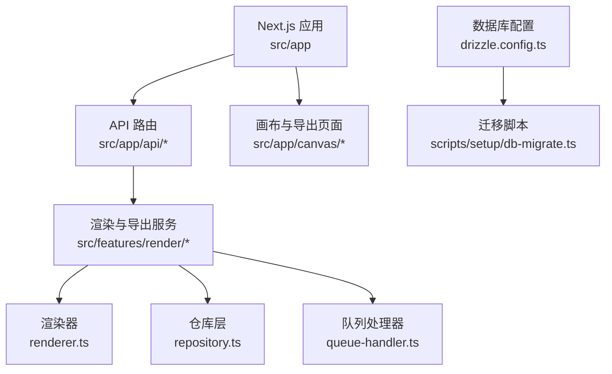
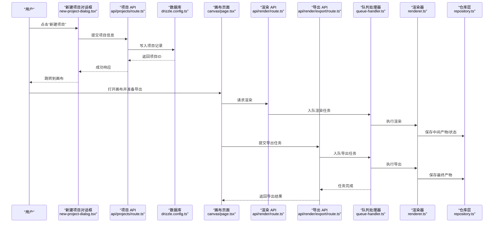
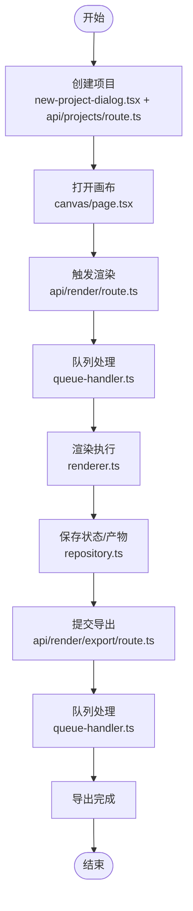
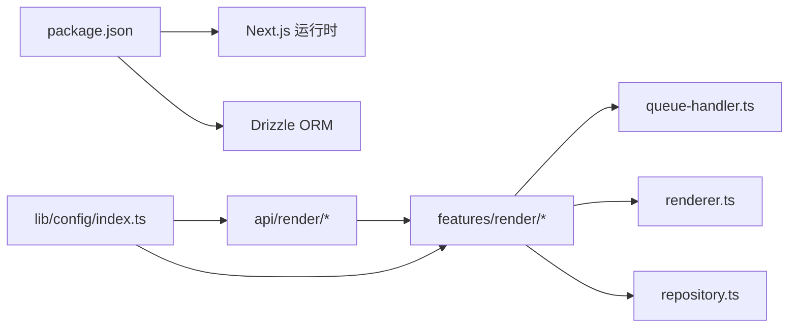

# 快速开始

<cite>
**本文引用的文件**   
- [README.md](file://README.md)
- [package.json](file://package.json)
- [drizzle.config.ts](file://drizzle.config.ts)
- [scripts/setup/db-migrate.ts](file://scripts/setup/db-migrate.ts)
- [src/app/api/projects/route.ts](file://src/app/api/projects/route.ts)
- [src/app/_components/new-project-dialog.tsx](file://src/app/_components/new-project-dialog.tsx)
- [src/app/canvas/page.tsx](file://src/app/canvas/page.tsx)
- [src/app/canvas/export/page.tsx](file://src/app/canvas/export/page.tsx)
- [src/app/api/render/route.ts](file://src/app/api/render/route.ts)
- [src/app/api/render/export/route.ts](file://src/app/api/render/export/route.ts)
- [src/features/render/renderer.ts](file://src/features/render/renderer.ts)
- [src/features/render/repository.ts](file://src/features/render/repository.ts)
- [src/features/render/queue-handler.ts](file://src/features/render/queue-handler.ts)
- [src/lib/config/index.ts](file://src/lib/config/index.ts)
</cite>

## 目录
1. [简介](#简介)
2. [项目结构](#项目结构)
3. [核心组件](#核心组件)
4. [架构总览](#架构总览)
5. [详细组件分析](#详细组件分析)
6. [依赖分析](#依赖分析)
7. [性能考虑](#性能考虑)
8. [故障排除指南](#故障排除指南)
9. [结论](#结论)
10. [附录](#附录)

## 简介
本指南面向首次接触 CodeVideoCanvas 的用户，帮助你在最短时间内完成环境搭建、启动开发服务、创建第一个项目并完成一次简单的视频导出。内容涵盖 Node.js 版本要求、包管理器与依赖安装、数据库配置与迁移、本地运行流程、基本使用方法以及常见问题排查。

## 项目结构
CodeVideoCanvas 基于 Next.js 应用，采用 App Router 组织页面与 API 路由；渲染与导出能力集中在 features/render 模块；数据库使用 Drizzle ORM 管理。

图表来源
- [src/app/api/render/route.ts](file://src/app/api/render/route.ts)
- [src/app/api/render/export/route.ts](file://src/app/api/render/export/route.ts)
- [src/features/render/renderer.ts](file://src/features/render/renderer.ts)
- [src/features/render/repository.ts](file://src/features/render/repository.ts)
- [src/features/render/queue-handler.ts](file://src/features/render/queue-handler.ts)
- [drizzle.config.ts](file://drizzle.config.ts)
- [scripts/setup/db-migrate.ts](file://scripts/setup/db-migrate.ts)

章节来源
- [README.md](file://README.md)
- [package.json](file://package.json)
- [drizzle.config.ts](file://drizzle.config.ts)
- [scripts/setup/db-migrate.ts](file://scripts/setup/db-migrate.ts)

## 核心组件
- 项目与画布
  - 新建项目对话框：提供创建项目的交互入口。
    - 参考路径：[src/app/_components/new-project-dialog.tsx](file://src/app/_components/new-project-dialog.tsx)
  - 项目列表页：展示已有项目并支持跳转至画布。
    - 参考路径：[src/app/projects/page.tsx](file://src/app/projects/page.tsx)
  - 画布主入口：进入可视化编辑界面。
    - 参考路径：[src/app/canvas/page.tsx](file://src/app/canvas/page.tsx)
- 渲染与导出
  - 渲染 API：触发渲染任务。
    - 参考路径：[src/app/api/render/route.ts](file://src/app/api/render/route.ts)
  - 导出 API：提交导出任务并获取结果。
    - 参考路径：[src/app/api/render/export/route.ts](file://src/app/api/render/export/route.ts)
  - 导出页面：在画布内发起导出操作。
    - 参考路径：[src/app/canvas/export/page.tsx](file://src/app/canvas/export/page.tsx)
  - 渲染引擎：封装帧序列处理、编码等逻辑。
    - 参考路径：[src/features/render/renderer.ts](file://src/features/render/renderer.ts)
  - 仓库层：持久化渲染相关数据（如任务、产物）。
    - 参考路径：[src/features/render/repository.ts](file://src/features/render/repository.ts)
  - 队列处理器：后台执行渲染/导出任务。
    - 参考路径：[src/features/render/queue-handler.ts](file://src/features/render/queue-handler.ts)
- 数据库
  - Drizzle 配置：定义连接与迁移策略。
    - 参考路径：[drizzle.config.ts](file://drizzle.config.ts)
  - 迁移脚本：初始化或升级数据库结构。
    - 参考路径：[scripts/setup/db-migrate.ts](file://scripts/setup/db-migrate.ts)

章节来源
- [src/app/_components/new-project-dialog.tsx](file://src/app/_components/new-project-dialog.tsx)
- [src/app/projects/page.tsx](file://src/app/projects/page.tsx)
- [src/app/canvas/page.tsx](file://src/app/canvas/page.tsx)
- [src/app/api/render/route.ts](file://src/app/api/render/route.ts)
- [src/app/api/render/export/route.ts](file://src/app/api/render/export/route.ts)
- [src/app/canvas/export/page.tsx](file://src/app/canvas/export/page.tsx)
- [src/features/render/renderer.ts](file://src/features/render/renderer.ts)
- [src/features/render/repository.ts](file://src/features/render/repository.ts)
- [src/features/render/queue-handler.ts](file://src/features/render/queue-handler.ts)
- [drizzle.config.ts](file://drizzle.config.ts)
- [scripts/setup/db-migrate.ts](file://scripts/setup/db-migrate.ts)

## 架构总览
下图展示了从“新建项目”到“导出视频”的关键调用链路与数据流向。

图表来源
- [src/app/_components/new-project-dialog.tsx](file://src/app/_components/new-project-dialog.tsx)
- [src/app/api/projects/route.ts](file://src/app/api/projects/route.ts)
- [src/app/canvas/page.tsx](file://src/app/canvas/page.tsx)
- [src/app/api/render/route.ts](file://src/app/api/render/route.ts)
- [src/app/api/render/export/route.ts](file://src/app/api/render/export/route.ts)
- [src/features/render/queue-handler.ts](file://src/features/render/queue-handler.ts)
- [src/features/render/renderer.ts](file://src/features/render/renderer.ts)
- [src/features/render/repository.ts](file://src/features/render/repository.ts)
- [drizzle.config.ts](file://drizzle.config.ts)

## 详细组件分析

### 环境搭建与启动
- Node.js 版本
  - 请查看 package.json 中的 engines 字段以确认所需 Node.js 版本范围。
  - 参考路径：[package.json](file://package.json)
- 包管理器与依赖安装
  - 推荐使用 pnpm。若未安装，请先安装 pnpm。
  - 在项目根目录执行依赖安装命令（例如 pnpm install）。
  - 参考路径：[package.json](file://package.json)
- 数据库配置与迁移
  - 根据 drizzle.config.ts 配置数据库连接参数（如驱动、URL 等），确保本地或远程数据库可访问。
  - 执行迁移脚本以初始化或升级数据库结构。
  - 参考路径：
    - [drizzle.config.ts](file://drizzle.config.ts)
    - [scripts/setup/db-migrate.ts](file://scripts/setup/db-migrate.ts)
- 启动开发服务器
  - 使用包管理器提供的脚本启动开发服务（例如 pnpm dev）。
  - 参考路径：[package.json](file://package.json)

章节来源
- [package.json](file://package.json)
- [drizzle.config.ts](file://drizzle.config.ts)
- [scripts/setup/db-migrate.ts](file://scripts/setup/db-migrate.ts)

### 第一个项目：从零到导出
- 步骤一：创建项目
  - 在应用首页或项目列表页中，通过“新建项目”对话框提交项目信息。
  - 参考路径：
    - [src/app/_components/new-project-dialog.tsx](file://src/app/_components/new-project-dialog.tsx)
    - [src/app/api/projects/route.ts](file://src/app/api/projects/route.ts)
- 步骤二：进入画布
  - 项目创建成功后，跳转到画布页面进行编排与预览。
  - 参考路径：[src/app/canvas/page.tsx](file://src/app/canvas/page.tsx)
- 步骤三：发起渲染
  - 在画布中触发渲染，后端将任务入队并由队列处理器执行。
  - 参考路径：
    - [src/app/api/render/route.ts](file://src/app/api/render/route.ts)
    - [src/features/render/queue-handler.ts](file://src/features/render/queue-handler.ts)
    - [src/features/render/renderer.ts](file://src/features/render/renderer.ts)
- 步骤四：提交导出
  - 渲染完成后，在导出页面提交导出任务，等待产物生成。
  - 参考路径：
    - [src/app/canvas/export/page.tsx](file://src/app/canvas/export/page.tsx)
    - [src/app/api/render/export/route.ts](file://src/app/api/render/export/route.ts)
    - [src/features/render/repository.ts](file://src/features/render/repository.ts)

图表来源
- [src/app/_components/new-project-dialog.tsx](file://src/app/_components/new-project-dialog.tsx)
- [src/app/api/projects/route.ts](file://src/app/api/projects/route.ts)
- [src/app/canvas/page.tsx](file://src/app/canvas/page.tsx)
- [src/app/api/render/route.ts](file://src/app/api/render/route.ts)
- [src/app/api/render/export/route.ts](file://src/app/api/render/export/route.ts)
- [src/features/render/queue-handler.ts](file://src/features/render/queue-handler.ts)
- [src/features/render/renderer.ts](file://src/features/render/renderer.ts)
- [src/features/render/repository.ts](file://src/features/render/repository.ts)

章节来源
- [src/app/_components/new-project-dialog.tsx](file://src/app/_components/new-project-dialog.tsx)
- [src/app/api/projects/route.ts](file://src/app/api/projects/route.ts)
- [src/app/canvas/page.tsx](file://src/app/canvas/page.tsx)
- [src/app/api/render/route.ts](file://src/app/api/render/route.ts)
- [src/app/api/render/export/route.ts](file://src/app/api/render/export/route.ts)
- [src/app/canvas/export/page.tsx](file://src/app/canvas/export/page.tsx)
- [src/features/render/queue-handler.ts](file://src/features/render/queue-handler.ts)
- [src/features/render/renderer.ts](file://src/features/render/renderer.ts)
- [src/features/render/repository.ts](file://src/features/render/repository.ts)

## 依赖分析
- 运行时依赖
  - Next.js 应用框架与路由系统。
  - Drizzle ORM 用于数据库访问与迁移。
  - 其他第三方库由 package.json 声明。
- 关键模块耦合关系
  - API 路由依赖 features/render 的渲染与仓库层。
  - 队列处理器作为渲染与导出的执行中枢，降低前端压力。
  - 配置中心集中读取环境变量与运行时设置。

图表来源
- [package.json](file://package.json)
- [src/app/api/render/route.ts](file://src/app/api/render/route.ts)
- [src/app/api/render/export/route.ts](file://src/app/api/render/export/route.ts)
- [src/features/render/queue-handler.ts](file://src/features/render/queue-handler.ts)
- [src/features/render/renderer.ts](file://src/features/render/renderer.ts)
- [src/features/render/repository.ts](file://src/features/render/repository.ts)
- [src/lib/config/index.ts](file://src/lib/config/index.ts)

章节来源
- [package.json](file://package.json)
- [src/lib/config/index.ts](file://src/lib/config/index.ts)

## 性能考虑
- 渲染与导出为 CPU 密集型任务，建议：
  - 合理控制并发度，避免队列阻塞。
  - 对中间产物进行缓存与复用，减少重复计算。
  - 分阶段处理（先渲染帧序列，再统一导出），提升稳定性。
- 资源监控
  - 关注队列长度与任务耗时，必要时扩容或降级。

## 故障排除指南
- 无法连接数据库
  - 检查 drizzle.config.ts 的连接参数是否正确。
  - 确认数据库服务已启动且网络可达。
  - 参考路径：[drizzle.config.ts](file://drizzle.config.ts)
- 迁移失败
  - 确认迁移脚本执行权限与环境变量。
  - 查看迁移日志定位具体错误。
  - 参考路径：[scripts/setup/db-migrate.ts](file://scripts/setup/db-migrate.ts)
- 渲染/导出任务无响应
  - 检查队列处理器是否正常运行。
  - 查看渲染器日志与仓库层写入情况。
  - 参考路径：
    - [src/features/render/queue-handler.ts](file://src/features/render/queue-handler.ts)
    - [src/features/render/renderer.ts](file://src/features/render/renderer.ts)
    - [src/features/render/repository.ts](file://src/features/render/repository.ts)
- 端口占用或服务无法启动
  - 修改开发脚本使用的端口或释放占用端口。
  - 参考路径：[package.json](file://package.json)

章节来源
- [drizzle.config.ts](file://drizzle.config.ts)
- [scripts/setup/db-migrate.ts](file://scripts/setup/db-migrate.ts)
- [src/features/render/queue-handler.ts](file://src/features/render/queue-handler.ts)
- [src/features/render/renderer.ts](file://src/features/render/renderer.ts)
- [src/features/render/repository.ts](file://src/features/render/repository.ts)
- [package.json](file://package.json)

## 结论
通过以上步骤，你已完成环境搭建、数据库初始化、项目创建与第一次视频导出。后续可根据业务需求扩展节点类型、优化渲染管线与队列策略，以获得更好的性能与体验。

## 附录
- 常用命令
  - 安装依赖：pnpm install
  - 启动开发服务：pnpm dev
  - 执行数据库迁移：参见 scripts/setup/db-migrate.ts
- 参考路径汇总
  - 项目与画布：
    - [src/app/_components/new-project-dialog.tsx](file://src/app/_components/new-project-dialog.tsx)
    - [src/app/projects/page.tsx](file://src/app/projects/page.tsx)
    - [src/app/canvas/page.tsx](file://src/app/canvas/page.tsx)
  - 渲染与导出：
    - [src/app/api/render/route.ts](file://src/app/api/render/route.ts)
    - [src/app/api/render/export/route.ts](file://src/app/api/render/export/route.ts)
    - [src/app/canvas/export/page.tsx](file://src/app/canvas/export/page.tsx)
    - [src/features/render/renderer.ts](file://src/features/render/renderer.ts)
    - [src/features/render/repository.ts](file://src/features/render/repository.ts)
    - [src/features/render/queue-handler.ts](file://src/features/render/queue-handler.ts)
  - 数据库与配置：
    - [drizzle.config.ts](file://drizzle.config.ts)
    - [scripts/setup/db-migrate.ts](file://scripts/setup/db-migrate.ts)
    - [src/lib/config/index.ts](file://src/lib/config/index.ts)
    - [package.json](file://package.json)